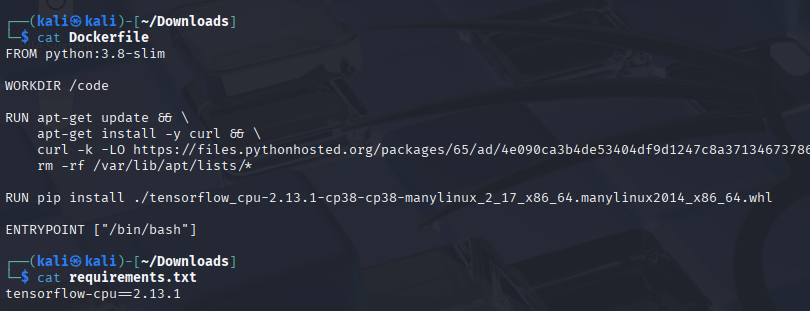
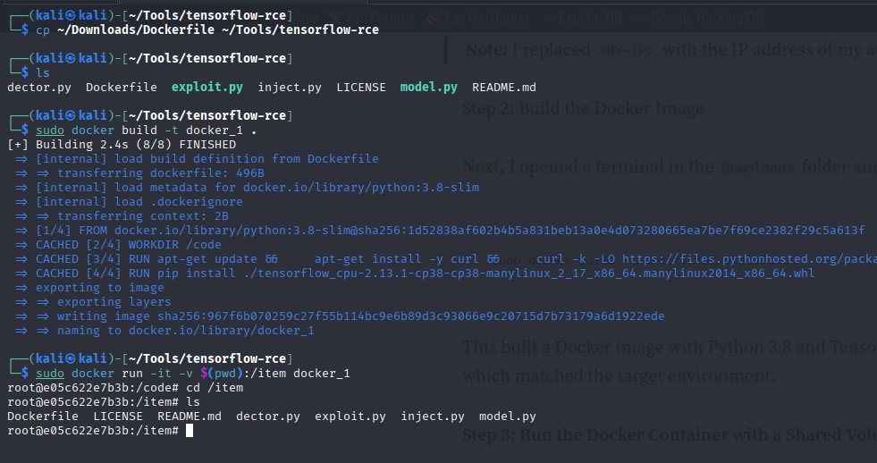
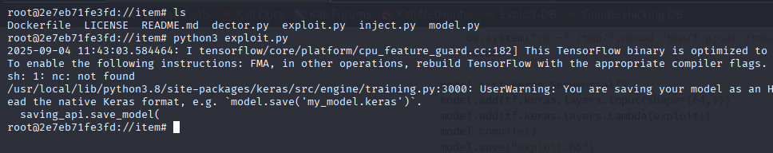
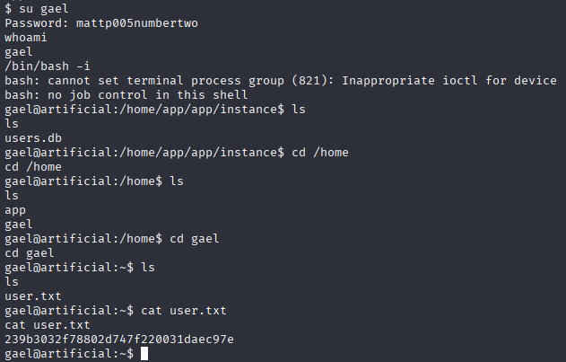
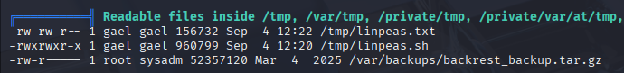

# 🤖 HackTheBox - Artificial


## 🎯 Overview

Artificial is an Easy-rated Linux machine on HackTheBox that leverages **artificial intelligence** themes and technologies. This machine appears to be newly released (June 2025) and has gained significant attention from the community with thousands of successful solves.

## 🔍 Reconnaissance

### Initial Ping scan

Let's start by pinging the TARGET IP


### Initial Nmap Scan

Now perform a basic port scan to identify open services:

```bash
sudo nmap -sVC <TARGET IP>
```


**Results:**
```
PORT   STATE SERVICE VERSION
22/tcp open  ssh     OpenSSH 8.9p1 Ubuntu 3ubuntu0.x (Ubuntu Linux; protocol 2.0)
80/tcp open  http    nginx 1.18.0 (Ubuntu)
```

### Host File Configuration

This allowed me to access the website directly by visiting http://artificial.htb.


### Service Enumeration

#### HTTP Service (Port 80)

Let's explore the web application (Login page):


Create a user and login using the credentials:


After logging in, I was redirected to a dashboard that allows managing and uploading AI models (But with a little requirements):


#### AI Model Requirements 

The application clearly required uploaded models to be built with TensorFlow CPU version 2.13.1. To assist with this, it even provided a reference Dockerfile for building compatible environments:



## 🚪 Gaining Initial Access

### Vulnerability Discovery

I found a public repository demonstrating how to abuse TensorFlow’s model loading mechanism for RCE https://github.com/Splinter0/tensorflow-rce/.

**Step 1: Cloning the Exploit Repository**

I cloned the repo and verified the exploit scripts were available:


**Step 2: Writing the Malicious Exploit**

Using the exploit.py script that creates a malicious .h5 TensorFlow model containing a reverse shell payload, I changed the IP and PORT to my attacker machine.


**Step 3: Building the Docker Image**

I copied the prepared Dockerfile into the repo and built the container, then I launched a container with a mounted shared volume:



**Step 4: Generating the Malicious Model**

I executed the script to generate exploit.h5:



**Step 5: Setting up a Listener**

On my attacking machine, I set up a Netcat listener on port 4444 to catch the reverse shell:


**Step 6: Uploading the Malicious Model**

Back on the target’s dashboard, I uploaded the crafted exploit.h5 model and execute it by (View Predictions):


**Accessing User Account:**

Wolla! We gained the initial access to the system:


### 🏆 User Flag

**Step 1: Exploring the Application Directory**

After gaining a shell, I enumerated the /app directory and found an SQLite database inside the instance folder.


Step 2: Extracting User Credentials
I opened the database and dumped the contents of the user table, the database contained usernames, emails, and MD5 password hashes.


**Step 3: Preparing Hashes for Cracking**

I copied the database result into a text file (hashes.txt) and remain only the hashes.


**Step 4: Cracking Hashes with John the Ripper**

Using john with the rockyou.txt wordlist, I successfully cracked 4 out of 7 passwords.

```bash
gael : mattp005numbertwo

mark : marvinnarak043414036

john : john

kali : kali
```


**Step 5: Privilege Escalation to User**

I switched user to gael using the cracked credentials and retrieved the user.txt flag in the home directory.



**User Flag:** `239b3032f78802d747f220031daec97e`

## 🏁 Root Flag

**Step 1: SSH into the server**
SSH as User gael:


But User gael is not in the sudo group:


**Step 2: Escalation Enumeration with LinPEAS**
After securing the user foothold, I transferred and executed LinPEAS to enumerate privilege escalation vectors.


During the scan, LinPEAS highlighted a suspicious file in /var/backups — a large archive owned by root.




**Step 3: Downloading the Backup Archive**
Inside /var/backups, I found backrest_backup.tar.gz. To analyze it locally, I started a Python HTTP server and exfiltrated the file to my attacker machine.


**Step 4: Extracting Backup Contents**
I extracted the archive and discovered configuration files, SQLite databases, and logs. Among these, a file named config.json stood out.


**Step 5: Finding Credentials**
Inspecting the config file revealed credentials for a privileged user backrest_root, with the password stored as a crypt hash.


**Step 6: Cracking the Hash**
I extracted the bcrypt hash, saved it into backrest.hash, and used John the Ripper with the rockyou.txt wordlist to crack it.


The cracked password was:
```bash
!@#$%^
```
**Step 7: Finding what the credentials is for**


> **⚠️ Disclaimer:** This writeup is for educational purposes only. Always ensure you have proper authorization before testing security tools and techniques. The author is not responsible for any misuse of the information provided.

**🎯 Machine Completed:** `$(date)`
**⏱️ Total Time:** `X hours Y minutes`
**🏆 Flags Captured:** `2/2`