# Hack The Box — Certificate (Retired)


- **Name:** Eighteen
- **Difficulty:** Easy

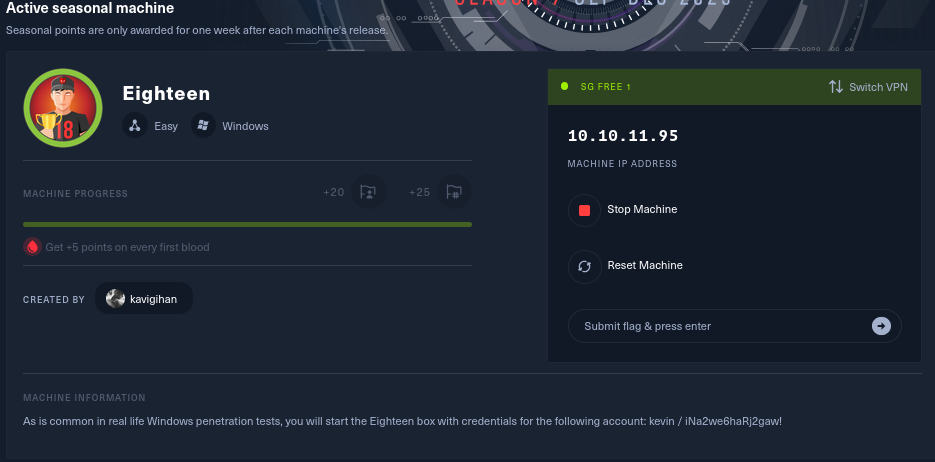

## Summary


## Target

- IP: 10.10.11.95
- Domain: Eighteen.HTB
- Hostname: DC01.Eighteen.htb

Add host mappings in `/etc/hosts` as discovered:

```
10.10.11.95 eighteen.htb dc01.eighteen.htb
```

## Reconnaissance

Run fast scans using `nmap`:

```bash
# Nmap 7.95 scan initiated Thu Nov 20 02:56:56 2025 as: /usr/lib/nmap/nmap -sCV -T4 -onmap_result 10.10.11.95
Nmap scan report for 10.10.11.95
Host is up (0.059s latency).
Not shown: 997 filtered tcp ports (no-response)
PORT     STATE SERVICE  VERSION
80/tcp   open  http     Microsoft IIS httpd 10.0
|_http-server-header: Microsoft-IIS/10.0
|_http-title: Did not follow redirect to http://eighteen.htb/
1433/tcp open  ms-sql-s Microsoft SQL Server 2022 16.00.1000.00; RTM
| ms-sql-info: 
|   10.10.11.95:1433: 
|     Version: 
|       name: Microsoft SQL Server 2022 RTM
|       number: 16.00.1000.00
|       Product: Microsoft SQL Server 2022
|       Service pack level: RTM
|       Post-SP patches applied: false
|_    TCP port: 1433
|_ssl-date: 2025-11-20T14:28:55+00:00; +6h31m27s from scanner time.
| ms-sql-ntlm-info: 
|   10.10.11.95:1433: 
|     Target_Name: EIGHTEEN
|     NetBIOS_Domain_Name: EIGHTEEN
|     NetBIOS_Computer_Name: DC01
|     DNS_Domain_Name: eighteen.htb
|     DNS_Computer_Name: DC01.eighteen.htb
|     DNS_Tree_Name: eighteen.htb
|_    Product_Version: 10.0.26100
| ssl-cert: Subject: commonName=SSL_Self_Signed_Fallback
| Not valid before: 2025-11-20T10:03:15
|_Not valid after:  2055-11-20T10:03:15
5985/tcp open  http     Microsoft HTTPAPI httpd 2.0 (SSDP/UPnP)
|_http-server-header: Microsoft-HTTPAPI/2.0
|_http-title: Not Found
Service Info: OS: Windows; CPE: cpe:/o:microsoft:windows

Host script results:
|_clock-skew: mean: 6h31m26s, deviation: 0s, median: 6h31m26s

Service detection performed. Please report any incorrect results at https://nmap.org/submit/ .
# Nmap done at Thu Nov 20 02:57:28 2025 -- 1 IP address (1 host up) scanned in 32.13 seconds
```

Port scan reveals:
- 80: IIS/HTTP(S)
- 1433: MSSQL
- 5985: LDAP/GC


## Web Enumeration

The target serves a web application on port 80 that presents an online platform offering courses and certificates.


Now, to pentest the website we first need to register as a user.

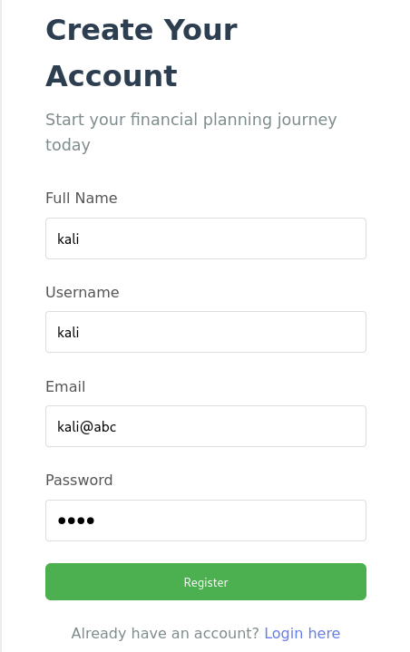

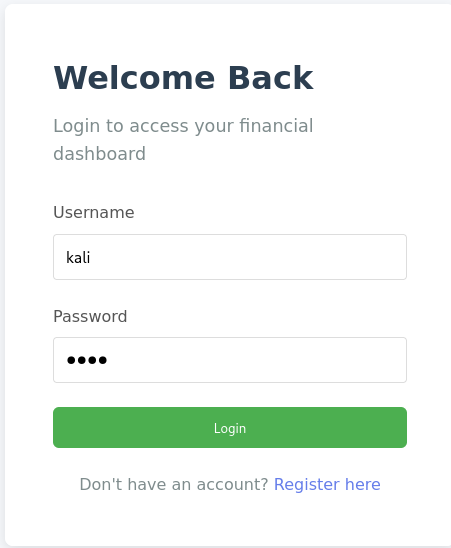

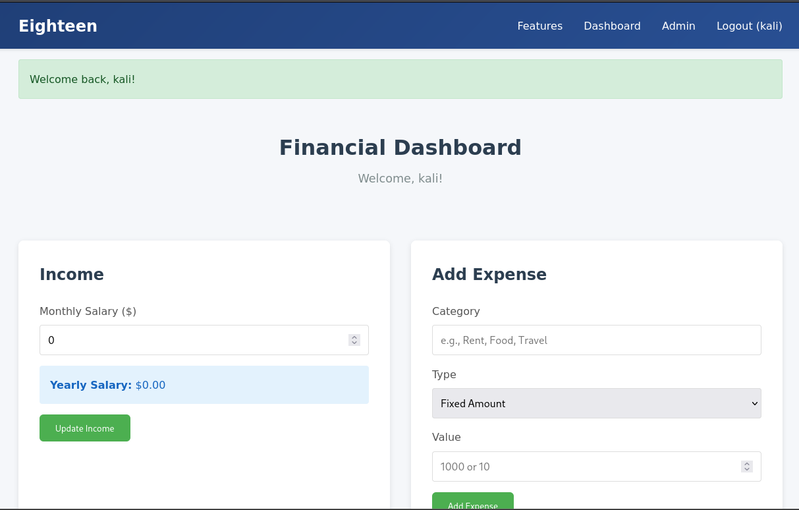

We can now go through the functions in the website to find any vulnerabilities there is.

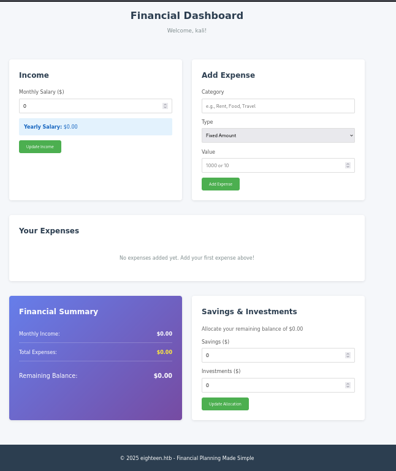

### Initial Foothold Access

In the courses section, we found out that we can subscribe to any popular course and access the content of each course which are sessions videos and quizzes.

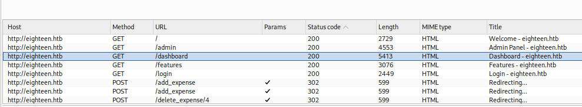

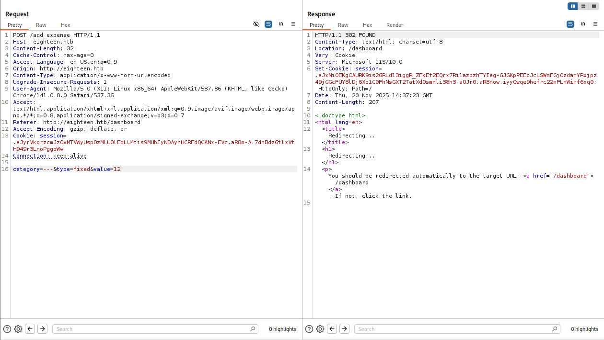

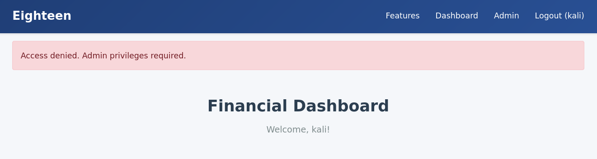

Clicking the quiz submit button direct us to a page where we can upload files into the website, soooo must be a Insecure File Upload vulnerability. Now we need to test this theory.

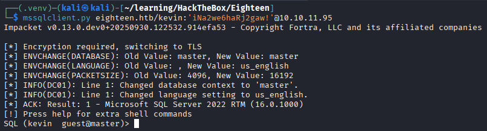

Accepted file type is only `pdf`, `docx`, `pptx` and `xlsx` and must be include in  the `zip` file. Also, reading the source script reveal the checking condition during the upload. 

Condition: 
1) If file type is not between the four mentioned earlier reject as `malicious file type`.

2) If more than one file inside the zip file uploaded, reject the zip file.

Ok reading https://benkyousec.github.io/posts/htb-certificate/, I found out that the application automatically extracted uploaded ZIP archives using WinRAR on the server; so by uploading a nested archive (double‑zipped) containing a malicious *.php file we bypassed client‑side/filetype checks and achieved remote code execution — this is commonly called a double‑loaded ZIP / nested archive bypass.

```bash
 if ($fileExtension === 'zip') {
    // Extract ZIP file contents
    $zip = new ZipArchive();
    if ($zip->open($fileTmpPath) === true) {
        if ($zip->count() > 1) {
            $message = "Please Include a single assignment file in the archive";
            exit;
        } else {
            $innerFileName = $zip->getNameIndex(0);
            if (!in_array(pathinfo($innerFileName, PATHINFO_EXTENSION), $allowedExtensions)) {
                http_response_code(400);
                echo "<h1>400 Bad Request</h1>";
                echo "<p>The request you sent contains bad or malicious content(Invalid Extension).</p>";
                exit;
            }
        }
    echo exec('"C:\\Program Files\\WinRAR\\WinRAR.exe" x -y ' . $fileTmpPath . " " . $destinationDir);
    $zip->close();
```

First, we want to know what happen when the website receive the file. Let's create a `test.pdf` and zip it inside an `a.zip` before uploading it inside the website.

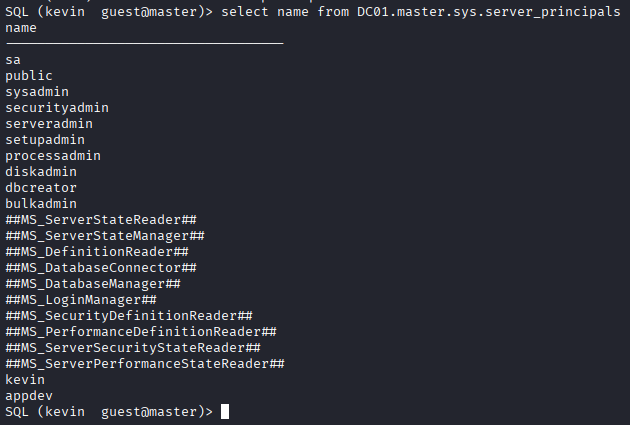

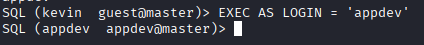

Now we know that the files uploaded will be save inside the website at `/static/uploads/<hash>/<filename>`.

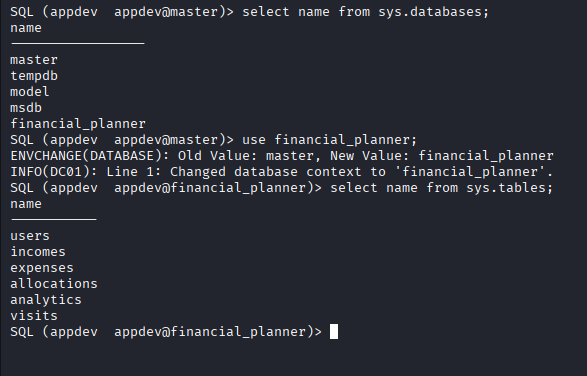

Ok now we can create a `test.php` and zip it as `b.zip` and then we can double load it into a single zip file called `c.zip`.

```bash
cat a.zip b.zip > c.zip
```
*sorry for wrong command in the picture*.

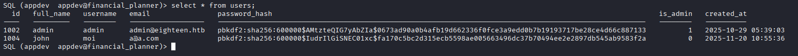

Upload it into the website and we can click on the `HERE` button to access the file. But it will initially direct us to the pdf file first. We can now change the file into the php we created earlier.

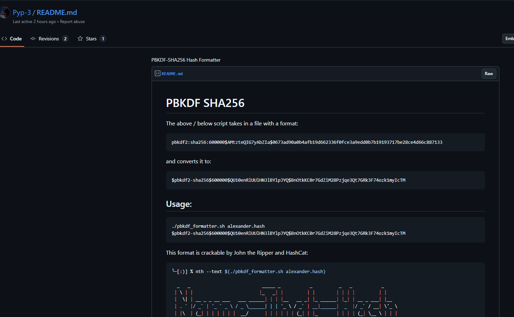

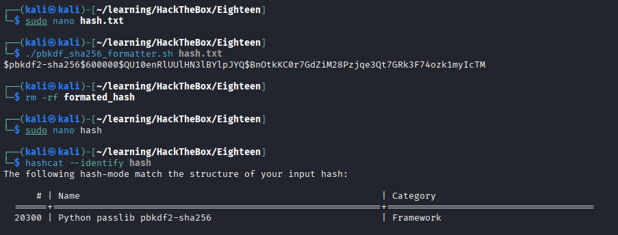

Let's go we can now execute the php file, with this we can move on to gain the foothold using reverse shell using `msfvenom`.

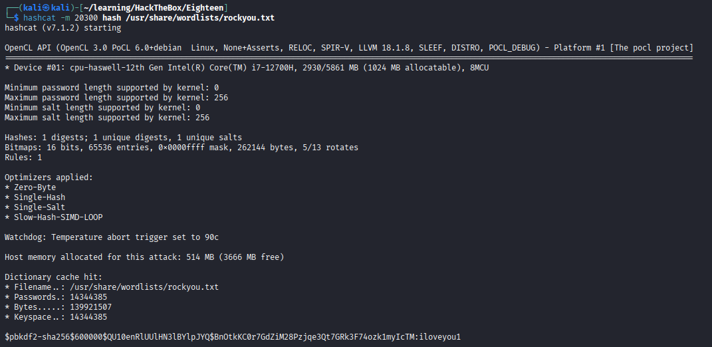

Let's go we now in the server as `xamppuser`.

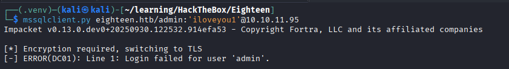

### Gaining priviledge escalation through leaked credentials

We used the command:

```bash
powershell -nop -exec bypass
```

To open an interactive PowerShell prompt.

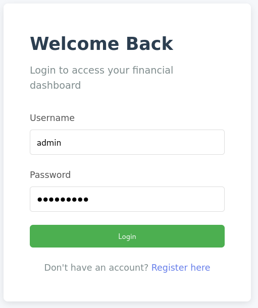

We navigate through the directories and found interesting files in the `certificate.htb` directory. What attract me is a file called db.php, for those that doesn't know db means database in short. So sometimes this file is used to store `user's credentials`.

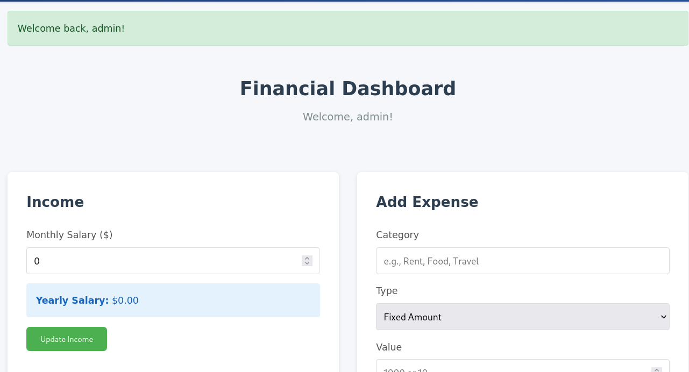

Just as i thought, there is a mysql user credential for `certificate_webapp_user`.

- Username: `certificate_webapp_user`
- Password: `cert!f!c@teDBPWD`

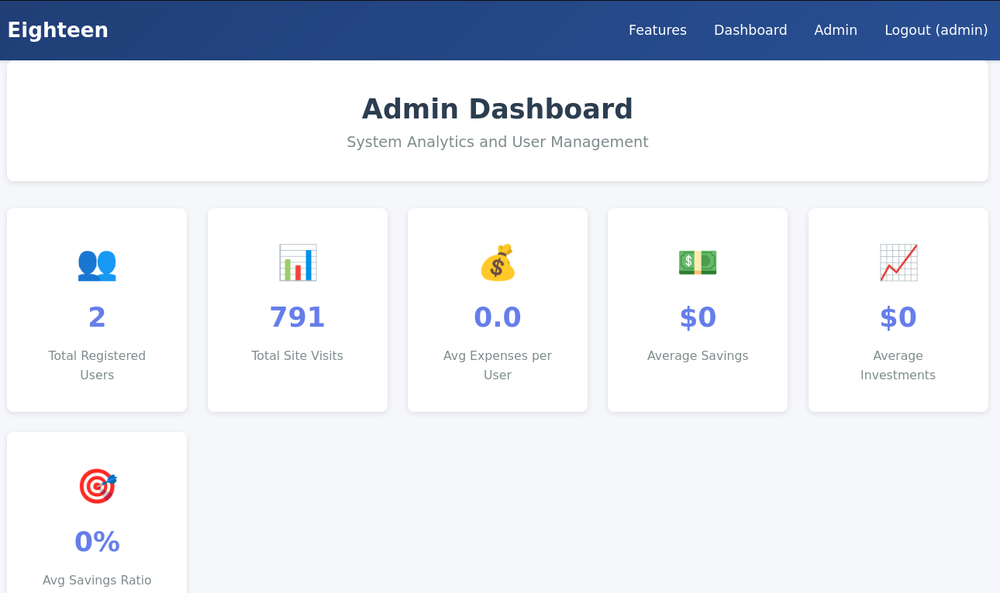

Ok the challenge is that this shell is not stable because the shell keeps getting disconnected.

*Read this write up to know more why the shell is being constantly rejected https://benkyousec.github.io/posts/htb-certificate/*.

Doing some thinking got me to just write a php script to dump all the content of the server's mysql into a file and then download the file from the server into our machine.

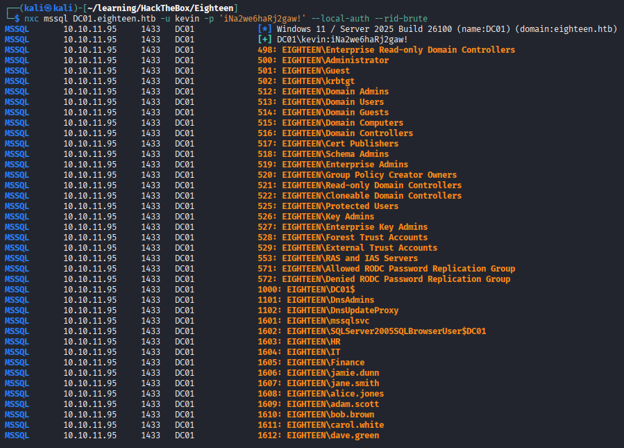

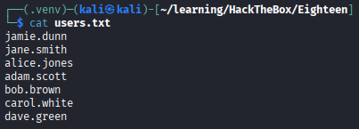

So, after reading the content of the sql, we came across a tables of user which stores the users full information including the password hash for each account. 

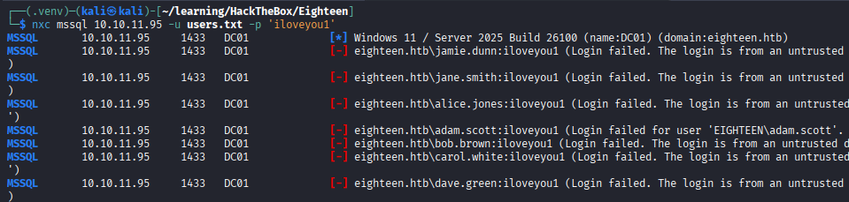

We can now copy all the hash into a `hashes.txt` file and found out what type of hash is being use here using `hashid`.

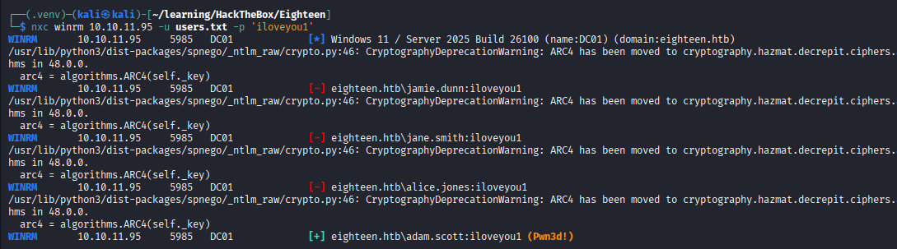

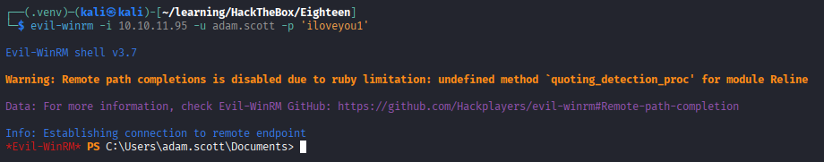

Using `hashcat` we can now perform a dictionary-based cracking using `rockyou.txt` towards the hashes and save them in a pot file called `hashcat.pot`.

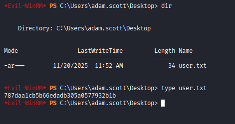

We successfully cracked 3 password from the database!

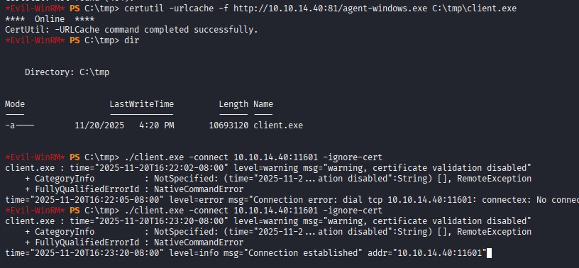

The most interesting one is the user `sara.b`.

- Username: `sara.b`
- Password: `Blink182`

### Gaining priviledge escalation through misconfiguration in AD

Now, to perform an analysis on the active directory ecosystem, using `sara.b`'s credential, we used `bloodhound-python` to gather all the information into a zip file and then we can upload it into the bloodhound GUI.

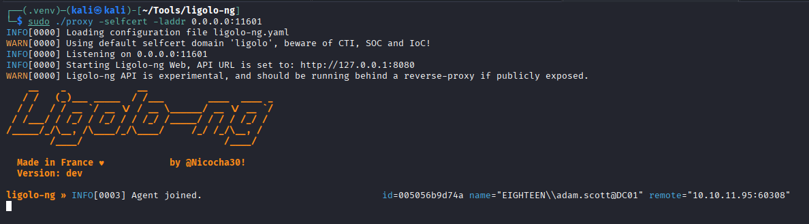

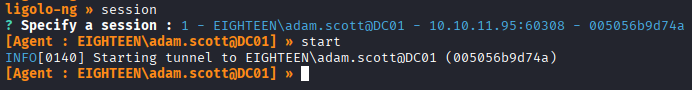

Let's take a look on the group that `sara.b` belongs to, here it stated that she is part of `help desk` group which is also a member of the `Remote Desktop Users`. BINGO!! This means that we can perform an remote connection towards `sara.b` to access the internal server.

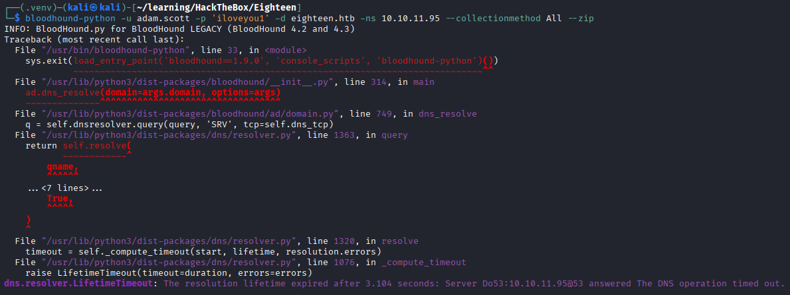

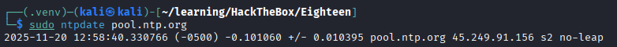

We used `evil-winrm` to do the job...

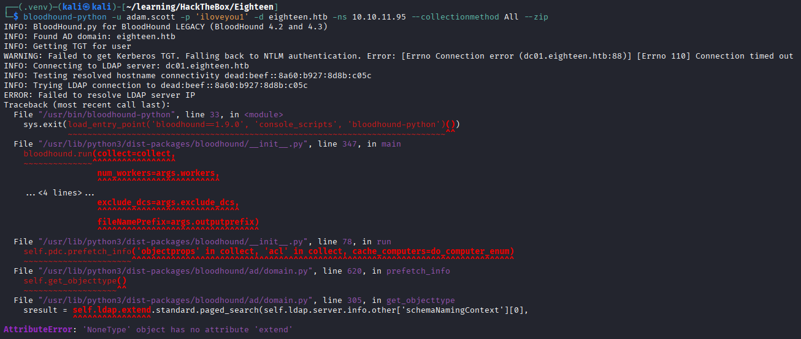

Inside we dicover something in the `Documents` directory, a folder called `WS-01` and inside is 2 files called `Description.txt` and `WS-01_PktMon.pcap`

Reading the txt file reveals a clue regarding a sign in process which stated that when a user enter a bad password it returns `bad credentials error`. But eventhough the user enter, the server will crash and freeze! Something not right here and they gave us a pcap file??? I assumed it must be the captured process during the sign in as prove to the statement before.


Because we in a remote connection, we can use the command `download` to download the pcap file into our machine.


Reading the file we saw some traces of authentication token inside the network packets, it will take forever to extract them. So luckily i found the perfect tool to extract them for me. https://github.com/jalvarezz13/Krb5RoastParser


Krb5RoastParser can extract all the 3 types of the authentication token (`as_req`, `as_rep`, and `tgs_rep`). Let's extract them all.


Using `hashcat` again i cracked the `as_req` hash and gained the second credentials to escalate our priviledge on the server.

- Username: `Lion.SK`
- Password: `!QA22wsx`


We used the same method with `sara.b` and viewed the groups `Lion.SK` belongs to. We save this for later use.


Now that we know he is also the group member of `Remote Desktop Users`, we try to create a remote connection to the server using his credentials.

VOILA!! we gain the `User.txt` flag.


**User Flag:** `f0151905d129b8bf24e96daf8ca8c892`

### Root Priviledge Escalation

We now can check for potentials vulnerable certificates that `Lion.SK` can enroll using `certipy-ad` .

```bash
certipy-ad find -u 'user@domain.local' -p 'Password123!' -dc-ip <TARGET> -vulnerable
```


checking the created `Certipy.txt` file reveals use that `Lion.SK` is vulnerable to ESC3!


We read the vulnerability in the github article 
https://github.com/ly4k/Certipy/wiki/06-%E2%80%90-Privilege-Escalation.


**So what ESC3 vulnerability is actually**: We (as an attacker) can request a user's certificate on their behalf using an Enrollment Agent certificate, allowing the us to impersonate that user.


First we must request for our user certificate using `EnrollAgent` *or any template will do*.


Here i used the template `Delegated-CRA` to request for the certificate.


Then i tried to request a certificate on behalf of Administrator.

```bash
certipy req \
    -u Lion.SK@certificate.htb -p '!QAZ2wsx' \
    -dc-ip 10.10.11.71 -target 'DC01.certificate.htb' \
    -ca 'Certificate-LTD-CA' -template 'SignedUser' \
    -pfx 'lion.sk.pfx' -on-behalf-of 'CERTIFICATE\Administrator'
```

But failed....

```bash
Certipy v5.0.3 - by Oliver Lyak (ly4k)

[*] Requesting certificate via RPC
[*] Request ID is 23
[-] Got error while requesting certificate: code: 0x80094812 - CERTSRV_E_SUBJECT_EMAIL_REQUIRED - The email name is unavailable and cannot be added to the Subject or Subject Alternate name.
```

This is because the Administrator did not have the email setup for them, that is what caused the error.

### Finding alternate way to gain Administrator access

Using `GetADUsers.py` from `impacket-tools`, we scanned the Active Directory (AD) for users that have the email setup for them so that we can request the certificate on their behalf and gained the access to impersonate them.


We go back to `bloodhound` and look through the groups where the users belongs to and the result is that `ryan.k` is in a group called `Domain Storage Managers` which from the description is the `security group that responsible for volume-level tasks inside the server`. Seems like a high priviledge group to me.


Let's request the certificate as `ryan.k` and auth as him using `certipy-ad` to get his NT hash to create a remote connection to the server impersonating him.


Going through all the directories inside the server as ryan.k did not give us anything useful for priviledge escalation. Then i remember about the `Store Manager Group` with the volume-level task.

Let's view the priviledge of this user.. Owhhh a `SeManageVolumePrivilege`?


Searching through github gave me a git page on `SeManageVolumeExploit`. Giving us a script to run on the victim server to escalate priviledge (Giving us the full permission on the C:/ drive).


I kinda hate using c exploit and luckily, the git provides with the exe file exploit too.


downloading the exe file into my machine and uploading and executing the exploit inside the server **WORKS!!**


We can now access the Administrator Directory, but unfortunately we cannot directly access the file as the challenge creator decide to make an `UnauthorizedAccessException` to `Lion.SK`. BROO COMEONNNN!!!!


Based on this write up https://benkyousec.github.io/posts/htb-certificate/, we can use `certutil` to export CA's private keys to use as a forging token to impersonate the Administrator.


We saved the CA private key as a pfx file and download it into our machine.


Using `certipy-ad` we can now forge the ca private key onto the `Administrator`.


and then auth as the `Administrator` to get the TGT hash/ NT hash for `Administrator`.


Using the hash, we can now create a remote connection as the `Administrator` into the server and read the `root.txt`.


## PWNED


---
*This writeup is for educational purposes only. Always ensure you have proper authorization before testing security vulnerabilities.*

