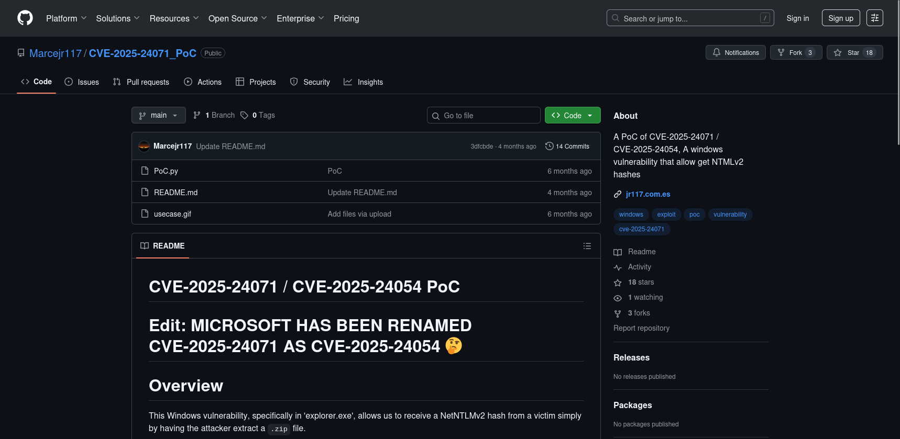
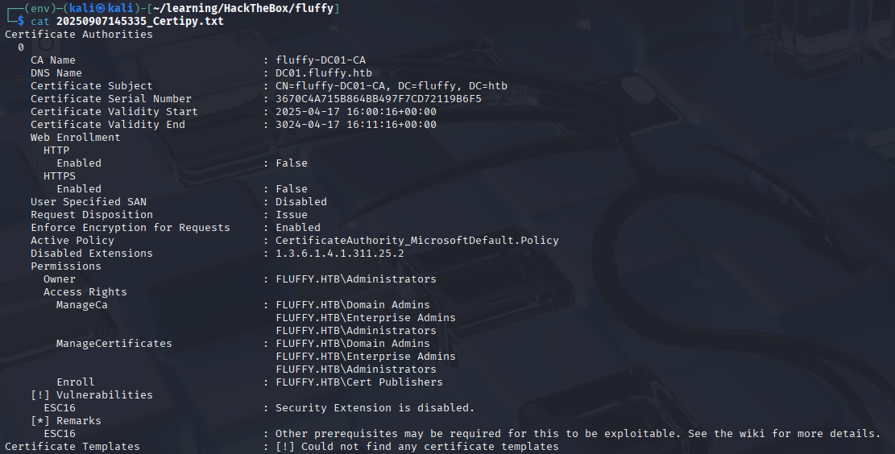

# Fluffy - HackTheBox


## Enumeration

We start with an nmap scan:

```bash
nmap -sC -sV -Pn -T5 -oN nmap_result 10.10.11.69
```


- Open ports:
  - `53/tcp`   → DNS (Simple DNS Plus)
  - `88/tcp`   → Kerberos
  - `139/tcp`  → NetBIOS-SSN
  - `389/tcp`  → LDAP
  - `445/tcp`  → SMB
  - `464/tcp`  → kpasswd5
  - `593/tcp`  → RPC over HTTP
  - `636/tcp`  → LDAPS
  - `3268/tcp` → LDAP Global Catalog
  - `3269/tcp` → LDAPS Global Catalog
  - `5985/tcp` → WinRM (HTTP)

- The site redirects to `fluffy.htb`.
---

## SMB Enumeration

We find accessible shares using given credentials (`j.fleischman / J0elTHEM4n1990!`).

```bash
smbclient -L //10.10.11.69 -U j.fleischman
```


Using smbmap we can confirms the permissions of each shares for the user `j.fleischman`:

```bash
smbmap -H 10.10.11.69 -u j.fleischman -p 'J0elTHEM4n1990!' -d fluffy.htb
```


Owh we have the write permission in the IT share, let's exploring it:

```bash
smbclient //10.10.11.69/IT -U j.fleischman
ls
```


Inside we find tools and a PDF named `Upgrade_Notice.pdf`.


Opening the document revealed a list of CVEs, highlighting unpatched Windows vulnerabilities that could potentially be exploited. 

---
## Exploitation

After going through several CVEs listed, we identified CVE-2025-24071 as the most interesting one.

This vulnerability targets explorer.exe and can be abused to leak a NetNTLMv2 hash from a victim. The trick? Simply convincing the system to extract a specially crafted .zip file — no direct code execution needed.



<details>
 <summary>Executing the PoC script</summary>
We executed the provided PoC script PoC.py to generate a malicious .zip archive designed to exploit CVE-2025-24071. By specifying the target’s IP address (10.10.11.69), the script created an archive named exploit.zip containing a documents.library-ms file.
</details>


<details>
  <summary>Viewing the content of the document</summary>

After extracting the **exploit.zip**, we inspected the `documents.library-ms` file to verify its contents.

The file is an XML-based Windows Library definition. Inside, we can see a crafted `<url>` tag pointing to our attacker machine (`10.10.11.69\shared`). When a victim opens this library file, their system automatically attempts to authenticate to the attacker’s SMB share, leaking **NetNTLMv2 hashes** in the process.

This confirms how **CVE-2025-24071** abuses the Windows library feature (`.library-ms`) to force outbound authentication without user awareness.

</details>


<details>
  <summary>Upload the malicious document in the SMB share</summary>

We then uploaded the malicious files (`exploit.zip` and `documents.library-ms`) to the SMB share.  

This ensures that whenever a victim interacts with these files, their machine will attempt outbound authentication to our attacker-controlled SMB server — leaking **NetNTLMv2 hashes** in the process.  
</details>


To exploit the .library-ms trick from earlier, we set up Responder on our attacking machine. 


Once the malicious documents.library-ms was opened on the target, the victim machine reached out to our fake SMB share. And just like that, Responder caught the NTLMv2 hash of user p.agila.


We then extracted the captured hash and saved it into a file (hash.txt) for password cracking. Using John the Ripper with the popular RockYou wordlist, we successfully cracked the password:

Crack with John:

```bash
john hash.txt --wordlist=/usr/share/wordlists/rockyou.txt
```


We recover new credentials:

```
p.agila / prometheusx-303
```

---

## BloodHound

Let's use BloodHound for Active Directory enumeration.


We ran bloodhound-python to collect domain information via LDAP enumeration:

```bash
bloodhound-python -u p.agila -p 'prometheusx-303' -d fluffy.htb -ns 10.10.11.69 -c all --zip

```


The results were then imported into the BloodHound interface.


Once the data was ingested, we started exploring the graph view. Beginning with our compromised account P.AGILA, BloodHound showed its memberships and relationships.


We now know that P.AGILA is a part of Domain Users and Service Account Manager.


Digging deeper, we noticed that the Service Account Managers group had rights over the Service Accounts group. This relationship chain is crucial, as it opens paths to higher-value accounts.


We discovered that WINRM_SVC Inspecting the Service Accounts group revealed three key service accounts:

`LDAP_SVC` `CA_SVC` `WINRM_SVC`


Winrm??? That is a windows remote control account! So now we need to create a connection from P.AGILA to the winrm.svc

Using bloodyAD, we successfully added the user into the Service Accounts group.


We know have a clear path:

`p.agila` → `Service Account Managers`

`Service Account Managers` → `Service Accounts`

`Service Accounts` → `winrm_svc`


---

Now, use Certipy’s shadow attack to retrieve the NT hash of the winrm_svc account.

```bash
certipy-ad shadow auto -dc-ip 10.10.11.69 -u p.agila -p 'prometheusx-303' -account WINRM_SVC
```


At first, the process failed due to a Kerberos clock skew error (KRB_AP_ERR_SKEW). This happens because the attacker machine’s system time was not synchronized with the Windows domain controller.


```bash
sudo timedatectl set-ntp false
sudo ntpdate -s 10.10.11.69
```

After syncing the time, we re-ran the shadow attack, and this time it returning the NT hash for winrm_svc.


We successfully logged into the machine as winrm_svc using evil-winrm with the NT hash.

Once inside, we navigated to the Desktop directory of the winrm_svc user and found the file user.txt. By reading its contents, we captured the user flag.


**User Flag:** `8e899a7f417c8c357512380f73893f8c`

## Root Privilege Escalation

After gaining access as winrm_svc, the next objective was to escalate privileges to Domain Administrator. This involved abusing Active Directory Certificate Services (AD CS) via Certipy and carefully pivoting through misconfigured accounts.

**1. Enumerating the CA**
First, we enumerated the available Certificate Authority (CA) on the system using certutil. The output revealed the fluffy-DC01-CA, which we would later exploit.


**2. BloodHound: Service Accounts Enumeration**
Using BloodHound, we confirmed that the winrm_svc account was part of the Service Accounts group alongside other sensitive accounts (ca_svc, ldap_svc). This provided a path for privilege escalation.


**3. Targeting ca_svc with Shadow Credentials**
Since winrm_svc had sufficient rights, we abused it to add Shadow Credentials for the ca_svc account using Certipy. This allowed us to generate a certificate and extract the NT hash of ca_svc.


**4. Checking Certificate Templates**
Next, we used Certipy to enumerate certificate templates for vulnerabilities. The ESC1 issue (misconfigured template allowing dangerous enrollments) was identified on the CA, confirming the environment was exploitable.


**5. Updating ca_svc → Administrator UPN**
We escalated by updating the UserPrincipalName (UPN) of ca_svc to administrator. This is a critical misconfiguration — it essentially turned our ca_svc account into an admin identity.



**6. Requesting an Administrator Certificate**
With the updated UPN, we used Certipy to request a certificate for the administrator account from the CA. The CA happily issued it, providing us with a .pfx file that contained valid admin credentials.


**7. Restoring UPN Back to ca_svc**
To avoid suspicion and maintain stealth, we reverted the ca_svc UPN back to its original state using Certipy.


**8. Authenticating as Administrator**
Finally, we authenticated as the Domain Administrator using the stolen .pfx certificate. This gave us the NT hash for the administrator account, achieving full domain compromise.


**9. logged in as the administrator**
We successfully logged into the machine as administrator with the NT hash.
Once inside, we navigated to the Desktop directory of the administrator and found the file root.txt. By reading its contents, we captured the user flag.


**Root Flag:** `89788ee44eef4318daf5a1714d5a08e5c4`

### Machine Pwned

**This is my third time handling active directory machine, thank you to Elitemi21 for the knowledge*
