# HackTheBox - Planning (Linux - Easy)
---

## 🕵️‍♂️ 1. Machine Information
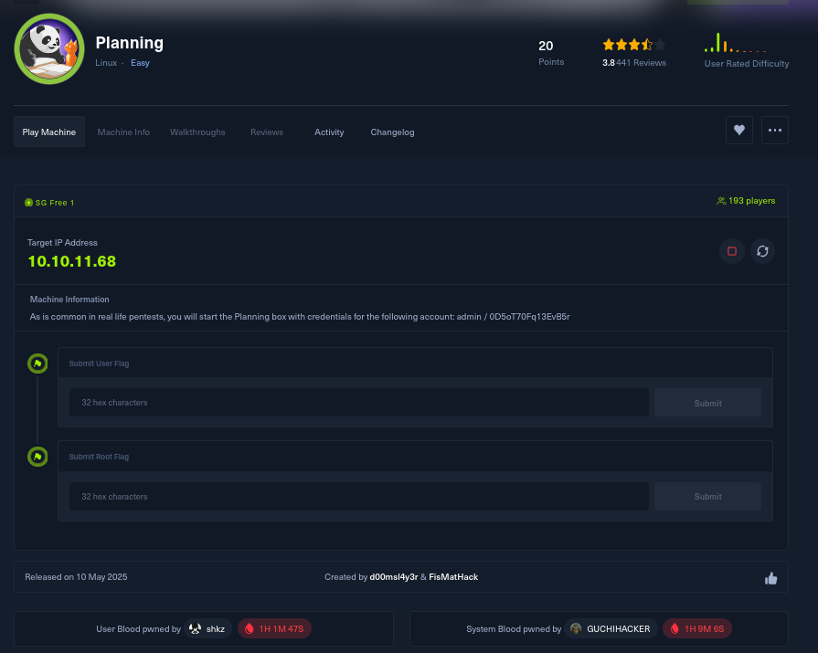

- **IP Address**: `10.10.11.68`
- **Difficulty**: Easy
- **Points**: 20 (User + Root)

---

## 🔎 2. Enumeration
### Nmap Scan
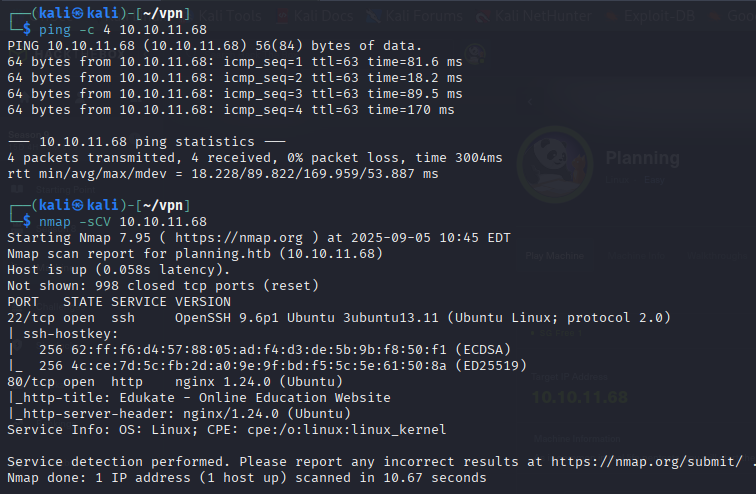

- Open ports:
  - `22/tcp` → OpenSSH 9.6p1
  - `80/tcp` → Nginx 1.24.0
- The site redirects to `planning.htb`.

### Add Domain to Hosts
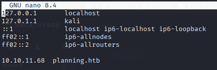

Added:
```
10.10.11.68 planning.htb
```

---

## 🌐 3. Web Enumeration
### Main Website


The domain hosts an **EdukaTe** educational template.

### VHost Enumeration with Gobuster
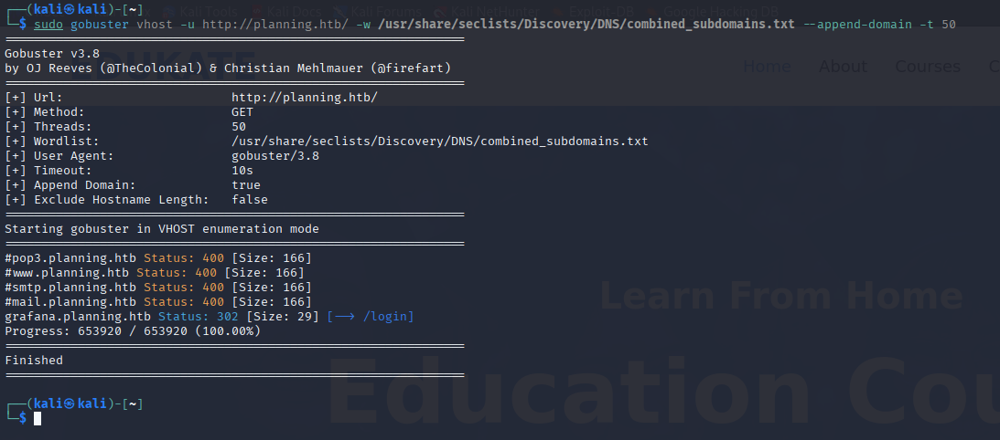

Discovered subdomain:
```
grafana.planning.htb
```

### Update Hosts File
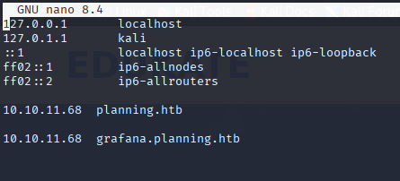

Added:
```
10.10.11.68 grafana.planning.htb
```

---

## 📊 4. Grafana Service
### Login Page
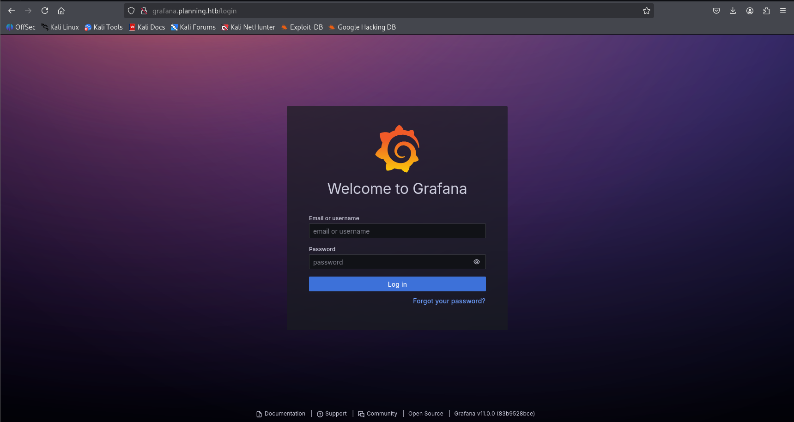

Visiting `grafana.planning.htb` reveals a **Grafana v11.0.0** login.

### Default Credentials
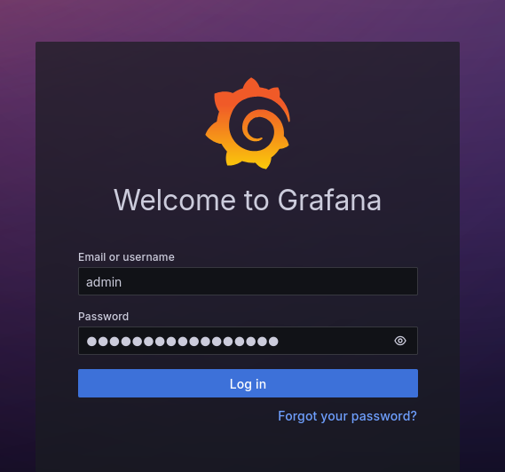

Using provided credentials:
```
admin : 0D5oT70Fq13EvB5r
```

### Grafana Dashboard
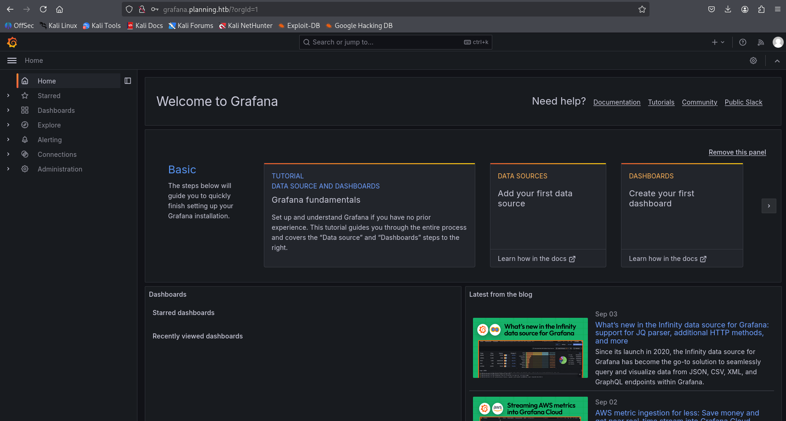

Successfully logged into Grafana.

---

## 💥 5. Exploitation (Grafana RCE)
### Vulnerability Reference
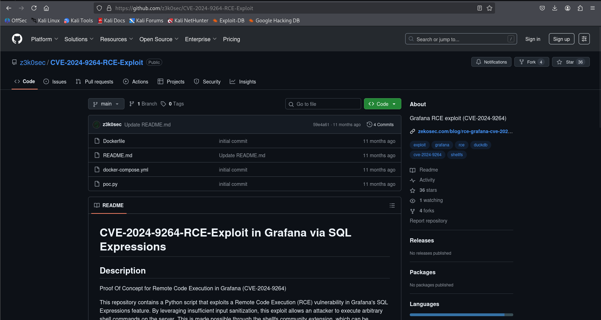

The machine is vulnerable to **CVE-2024-9264** – Grafana SQL Expressions RCE.

### Clone Exploit
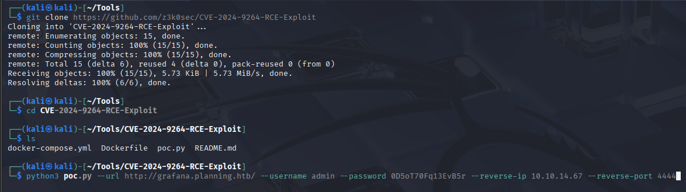

Exploit repo cloned from GitHub.

### Netcat Listener
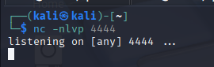

Started a listener on port `4444`.

### Run Exploit


Executed PoC with reverse shell payload.

### Shell Access
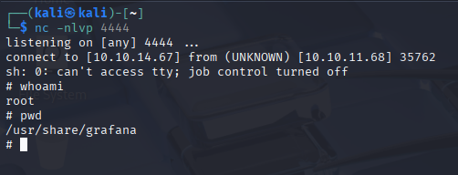

Reverse shell obtained → running as **root** in Grafana’s container environment.

---

## 🧩 6. Privilege Escalation
### LinPEAS Enumeration
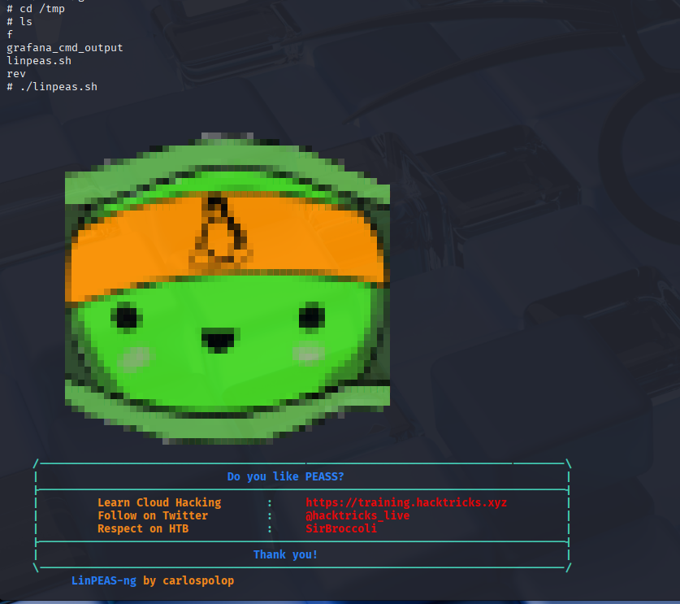

Uploaded and ran **LinPEAS** for privilege escalation hints.

### Environment Variables Leak


Found credentials in environment variables:
```
User: enzo
Password: RioTeCRANdenTANT!
```

### SSH as Enzo
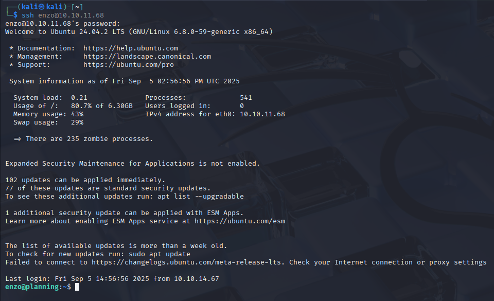

Logged in via SSH with the credentials.

### User Flag
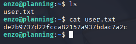

```
cat user.txt
de2b9737d22fcca82157a937bdac7a2c
```

### Sudo Privilege
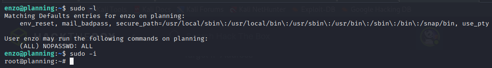

`enzo` has `NOPASSWD: ALL` → full root access.

### Root Flag


```
cat /root/root.txt
ea12bf8f9bf55b0c5e3140cd30f59d59
```

---

## 🎉 7. Pwned!
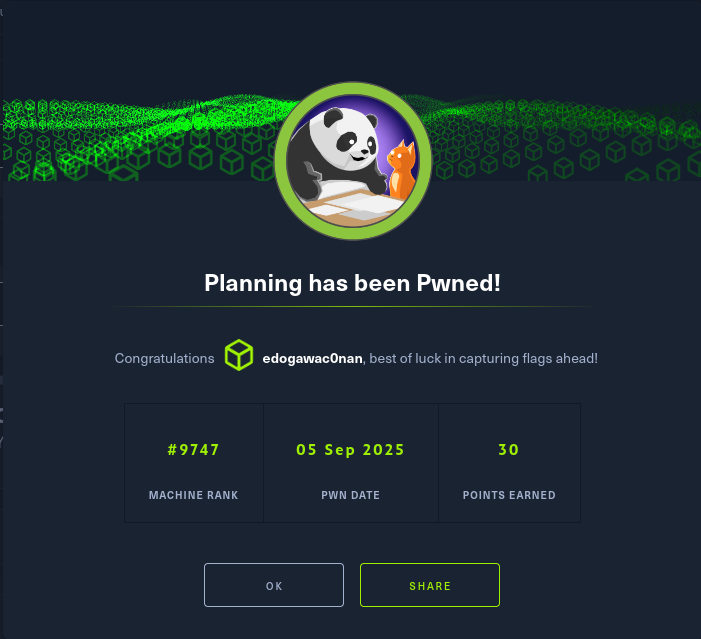

- **User pwned** ✅  
- **Root pwned** ✅  
- **Points earned**: 30  

---

## 📝 Summary
- **Initial Access**: Grafana subdomain enumeration → login with given credentials.  
- **Exploitation**: CVE-2024-9264 RCE → reverse shell as root (Grafana container).  
- **Privilege Escalation**: Exposed credentials → SSH as enzo → `sudo NOPASSWD:ALL` → full root.  

---

## 📌 Tags
```
HackTheBox, HTB, Planning, Linux, Easy, Walkthrough, Grafana, CVE-2024-9264, RCE, Privilege Escalation, CTF
```
