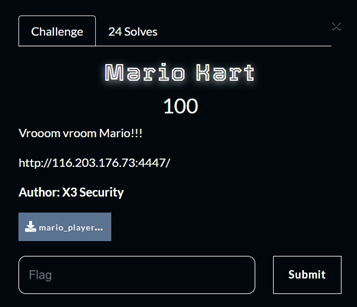

# Mario Kart

> Category: Blockchain ⛓️



## 🔍 Description
Vrooom vroom Mario!!!

---

## ✨ Challenge Overview
The objective is to solve the challenge by completing a smart contract-based race hosted in 
a contract called MarioKart.  

We don’t have direct access to the full source code, but we’re given the ABI fragments for 
both the Setup and MarioKart contracts. The Setup contract exposes a function called 
`isSolved()` that returns true once the challenge is complete.  

Our job is to reverse-engineer the race logic and interact with the contract correctly to solve 
the challenge and obtain the flag.  

---

## ✨ Walkthrough


For this challenge we are given 2 SOL File, analyzing them file we found that  


Here I will explain the script I created and used to solve this question =)  

### Step 1: Find the MarioKart Contract Address
The Setup contract contains a function `getMainContract()` that returns the address of the 
main challenge contract. We can call it directly using Web3:


### Step 2: Join the Race
The first step in the contract logic is to join the race using the `joinRace(string)` payable 
function. It seems we’re required to send exactly 1 ETH with a name (e.g., "Haxor"):


### Step 3: Start the Race
Once we’ve joined, we need to start the race by calling:


### Step 4: Accelerate Until Finish
To progress in the race, we repeatedly call `accelerate()` until the `raceFinished()` flag returns 
true. We check and loop with a short delay:


### Step 5: Check if the Challenge is Solved
Finally, once the race is finished, we query the Setup contract to check if we successfully 
completed the challenge:


Running the script using node:


We go back to the Blockchain Launcher and obtain the flag…    


---

## 🚩 Flag
```
umcs{0c3cb3bc7201f52854752b5b490164be}
```
