# SecureShell

> Category: Blockchain ⛓️

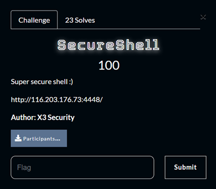

## 🔍 Description
Super secure shell :)

---

## ✨ Challenge Overview
The objective is to capture the flag by becoming the new owner of a protected smart 
contract called SecureShell.  

However, we are not given access to the source code of the SecureShell contract. The 
ownership change function appears to be protected by a secret password. To solve the 
challenge, we need to reverse-engineer and interact with the contract through raw Web3 
calls.  

---

## ✨ Walkthrough
Let’s goo next blockchain question!!!

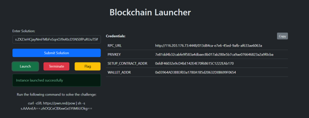

For this challenge we are given 2 SOL File, analyzing them file we found that:

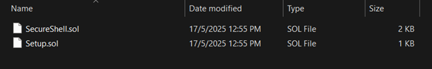

1. **SecureShell.sol**  
   - Contains a `changeOwner(uint256 _password, address _newOwner)` function.  
   - Uses a private `secretPassword` variable for verification.  

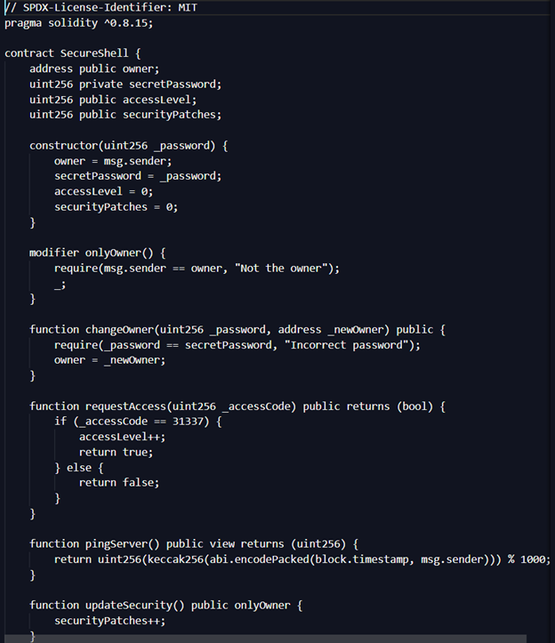

2. **Setup.sol**  
   - Deploys the SecureShell contract and stores its address in storage slot 0.  

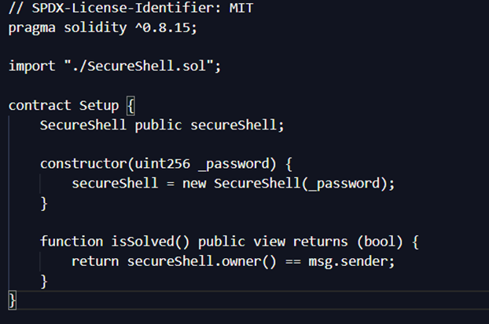

Here I will explain the script I created and used to solve this question =)

### Step 1: Find the SecureShell Contract Address
In Solidity, if a contract stores another contract address in slot 0, we can directly read it:

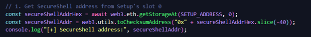

### Step 2: Extract the Secret Password
In Solidity, even private variables are stored on-chain. If the password is stored in storage 
slot 1, we can extract it easily:

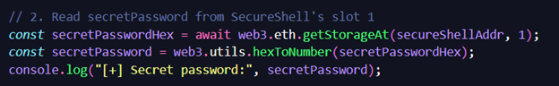

### Step 3: Take Ownership via changeOwner()
After getting the secret password from storage, we can become the new owner of the 
SecureShell contract by calling its `changeOwner()` function.  

Even though we don’t have the full source code, we know the function takes two inputs:  
the password and the new owner’s address. So we define a minimal ABI (just enough to 
call that function):  

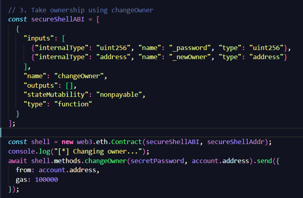

Running the script using node:

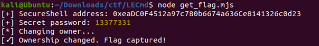

We go back to the Blockchain Launcher and obtain the flag…    

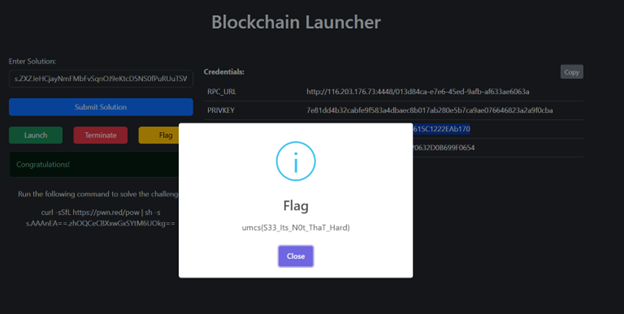

---

## 🚩 Flag
```
umcs{S33_Its_N0t_ThaT_Hard}
```
Full Script:
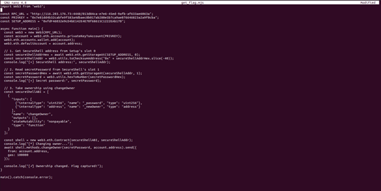