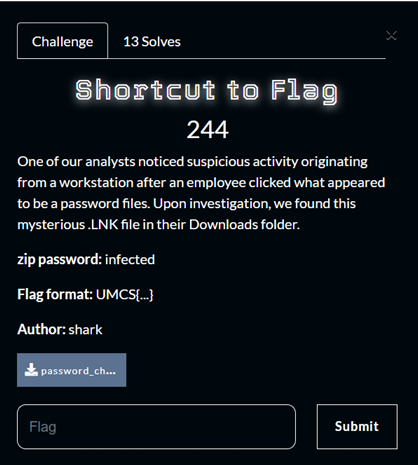
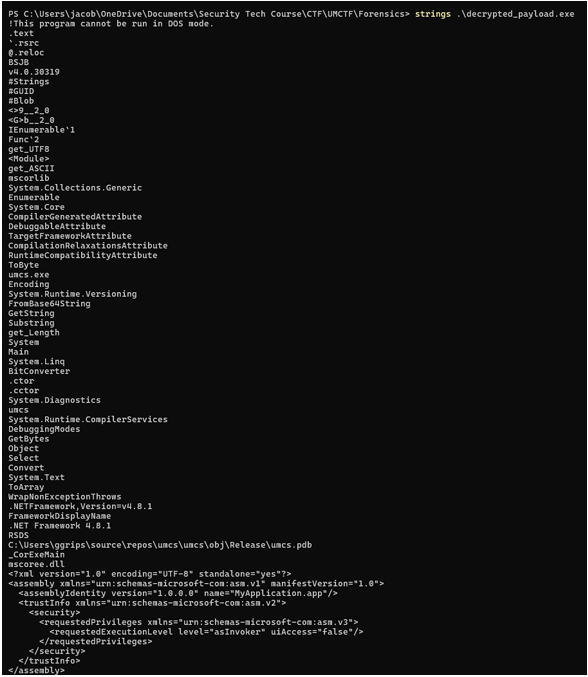
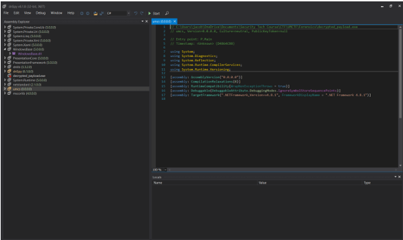
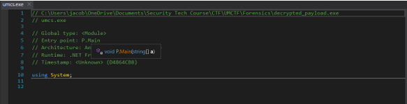
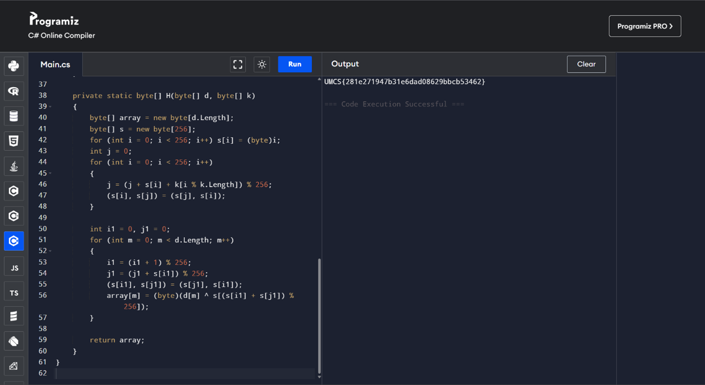

# Shortcut to Flag

> Category: Forensics 🕵️



## 🔍 Overview

One of our analysts noticed suspicious activity originating from a workstation after an employee clicked what appeared to be a password files.  
Upon investigation, we found this mysterious `.LNK` file in their Downloads folder.

---

## ✨ Walkthrough

As a forensic student this challenge is solvable        

Given a password.lnk file, knowing it is an lnk file I used **lnkparse** tool to gain full information about it. 


Ahh! Look at what we found here this is interesting          

Here we can see that this lnk file leaks a command line arguments that shows us the process done by the challenge creator before this. But what interest me is the Encoding Byte process…

Using this script I reverse the process, with XOR I decrypted each byte with `0x38` and skipped the first 3044 bytes (trash) and saved the payload.     



Using `strings` command, we can see the inside of the created exe file.  



Then, I used **dnSpy** to open the `.exe` file and boom the file renamed automatically to `umcs` (YEEAAAAA)  

Analyzing the file reveals use that the Entry point started at `P.Main` function.  



---

## ✨ Decompiled C# Code

```csharp
using System; 
using System.Linq; 
using System.Text; 

// Token: 0x02000002 RID: 2 
internal class P 
{ 
    private static void Main(string[] a) 
    { 
        P.F("BFE835EC4F752566B213A12E79CD76B85885D03A7AC457707ED3065A92C7229EE2574D045F1D"); 
    } 

    private static byte[] F(string x) 
    { 
        byte[] array = new byte[x.Length / 2]; 
        for (int i = 0; i < array.Length; i++) 
        { 
            array[i] = Convert.ToByte(x.Substring(i * 2, 2), 16); 
        } 
        byte[] bytes = BitConverter.GetBytes(3735927486U); 
        string s = P.G(); 
        return P.H(P.X(array, bytes), Encoding.UTF8.GetBytes(s)); 
    } 

    private static string G() 
    { 
        byte[] source = Convert.FromBase64String("bmV2ZXJnMXYzdXA="); 
        return Encoding.ASCII.GetString((from b in source 
        select (byte)(b << 4 >> 4 ^ 0)).ToArray<byte>()); 
    } 

    private static byte[] X(byte[] d, byte[] k) 
    { 
        byte[] array = new byte[d.Length]; 
        for (int i = 0; i < d.Length; i++) 
        { 
            array[i] = (d[i] ^ k[i % 4]); 
        } 
        return array; 
    } 

    private static byte[] H(byte[] d, byte[] k) 
    { 
        byte[] array = new byte[d.Length]; 
        byte[] array2 = new byte[256]; 
        for (int i = 0; i < 256; i++) 
        { 
            array2[i] = (byte)i; 
        } 
        int num = 0; 
        for (int j = 0; j < 256; j++) 
        { 
            num = (num + (int)array2[j] + (int)k[j % k.Length]) % 256; 
            byte b = array2[j]; 
            array2[j] = array2[num]; 
            array2[num] = b; 
        } 
        int num2 = 0; 
        num = 0; 
        for (int l = 0; l < d.Length; l++) 
        { 
            num2 = (num2 + 1) % 256; 
            num = (num + (int)array2[num2]) % 256; 
            byte b2 = array2[num2]; 
            array2[num2] = array2[num]; 
            array2[num] = b2; 
            array[l] = (d[l] ^ array2[(int)(array2[num2] + array2[num]) % 256]); 
        } 
        return array; 
    } 
} 
```



---

## 🚩 Flag
```
UMCS{281e271947b31e6dad08629bbcb53462}
```

