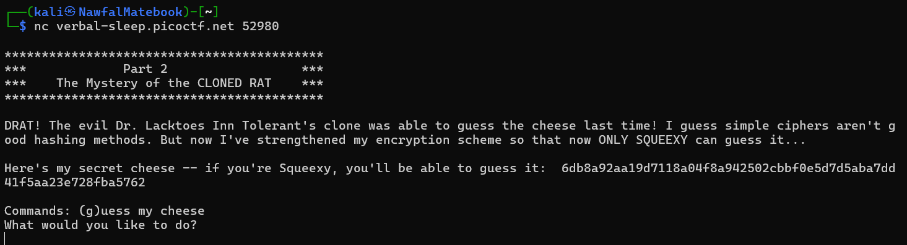

# 🧀 Guess My Cheese (Part 2)

## 🧐 The Challenge  
We are given a server to connect to using `nc`:  
```bash
nc verbal-sleep.picoctf.net 52980
```

### 📝 Given Hints  
1️⃣ **I heard that SHA-256 is the best hash function out there!**  
2️⃣ **Remember Squeexy, we enjoy our cheese with exactly 2 nibbles of hexadecimal-character salt!**  
3️⃣ **Ever heard of rainbow tables?**  


## 🚀 Steps to Solve  

### 1️⃣ Connecting to the Challenge  
First, let's connect to the server using `nc` (netcat) to see what the challenge is about.  



### 2️⃣ Understanding the given cheese list 
We are given a cheese list containing names of various cheeses:
📜 Cheese List:
[🔗 `cheese_list.txt`](../../assets/scripts/picoCTF/Crypto/GMC2/cheese_list.txt)  

### 3️⃣ Precomputing Hashes (Rainbow Table)  
Since the cheese names are hashed with a **2-character hexadecimal salt**, we generate all possible salted variations and store their **SHA-256 hashes**.  

📜 **Generating the Rainbow Table:**  
[🔗 `rainbow_table.py`](../../assets/scripts/picoCTF/Crypto/GMC2/rainbow_table.py)  

### 🔧 How It Works  
- Loads **cheese names** from `cheese_list.txt`.  
- Generates **all possible salts** (`00`-`FF` in hexadecimal).  
- Applies **different transformations** (lowercase, removing spaces, replacing spaces with underscores).  
- Tries **various salt placements** (before, after, middle).  
- Encodes the string in **UTF-8, UTF-16, UTF-32**.  
- Computes **SHA-256 hashes** and saves them in a **JSON file**.  

### 4️⃣ Solving the Challenge  
Now that we have a **rainbow table** stored in `rainbow_table.json`, we can **search for the given hash** and retrieve the correct **cheese name and salt**.  

📜 **Solver Script:**  
[🔗 `solve_cheese.py`](../../assets/scripts/picoCTF/Crypto/GMC2/solve_cheese.py)  

### 🔧 How It Works  
- Connects to the **server**.  
- Extracts the **SHA-256 hash** from the challenge prompt.  
- Searches for the hash in **`rainbow_table.json`**.  
- If a match is found, submits the **correct cheese name and salt**.

## 📜 Final Flag  

```bash
picoCTF{cHeEsY7feac875}

🔗 [Back to Home](../index.md)
