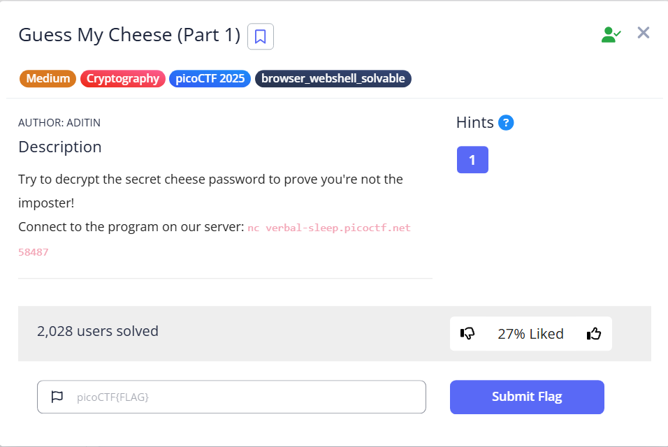
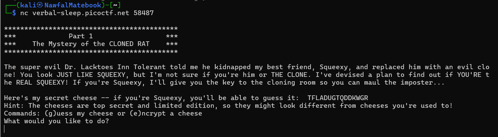
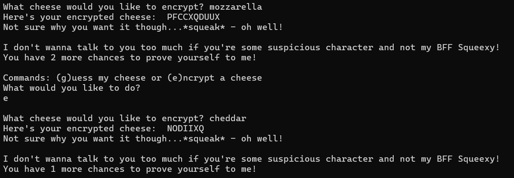
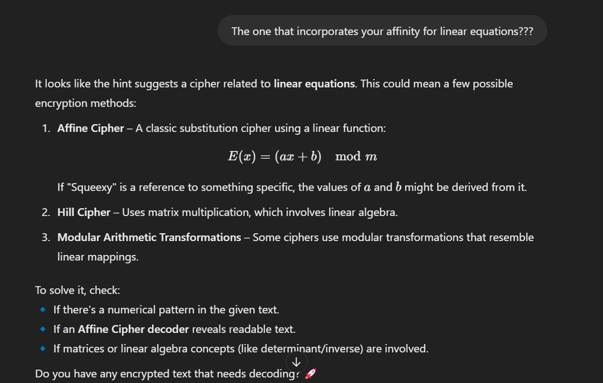

## 🧀 Guess My Cheese (Part 1)
### The question asked

### The given hint:  
> Remember that cipher we devised together, Squeexy?  
> The one that incorporates your affinity for linear equations???

### Steps:
1. Let's nc into the server first to see our challenge

2. Given 2 option to encrypt a message (e) or guess the cheese (g), we only have 3 attemps which means (2 encryptions and 1 guess)

3. By the given encrypted cheeses, we can know that it is a Monoalphabetic Cipher. But which cipher is it?
   
4. Based on the given hint, we asked chatgpt to give us the type of possible cipher the challenge used.

5. It is Affine Cipher, so based on the formula of the cipher i wrote a python script to decrypt the given encrypted cheese "TFLADUGTQDDKWGR"

🔗 [Back to Home](../index.md)

