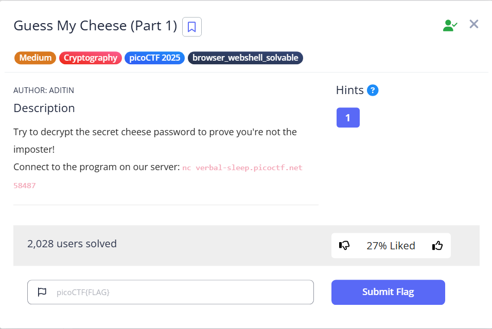

## 🧀 Guess My Cheese (Part 1)
### The question asked

### The given hint:  
> Remember that cipher we devised together, Squeexy?  
> The one that incorporates your affinity for linear equations???

### Steps:
1. Let's nc into the server first to see our challenge
   
3. Analyze the contents using appropriate Volatility plugins.
4. Extract the necessary data and retrieve the key.

🔗 [Back to Home](../index.md)

